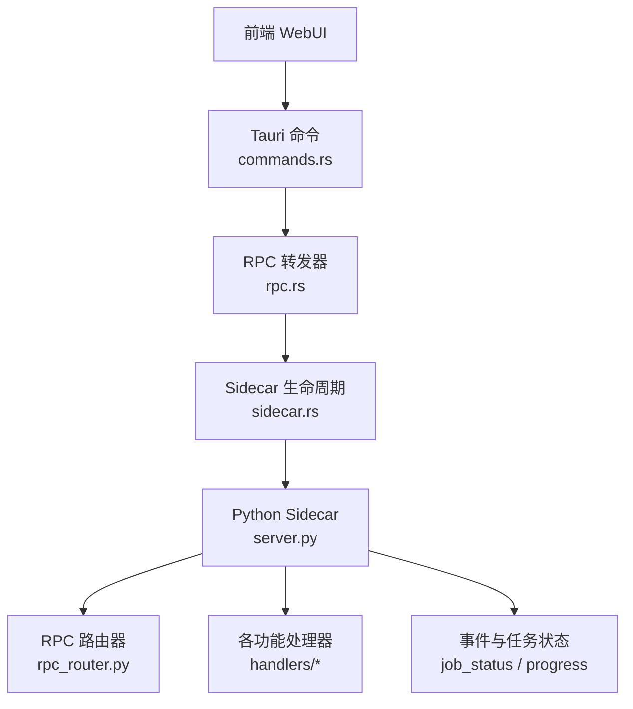
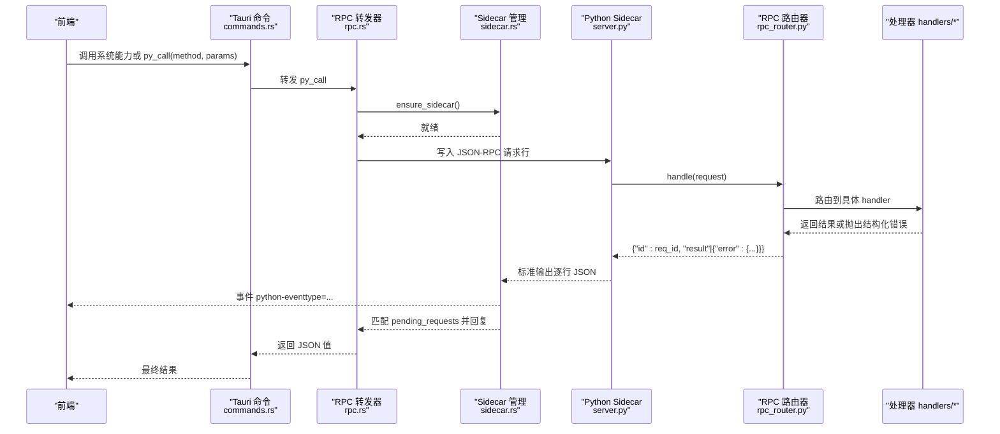
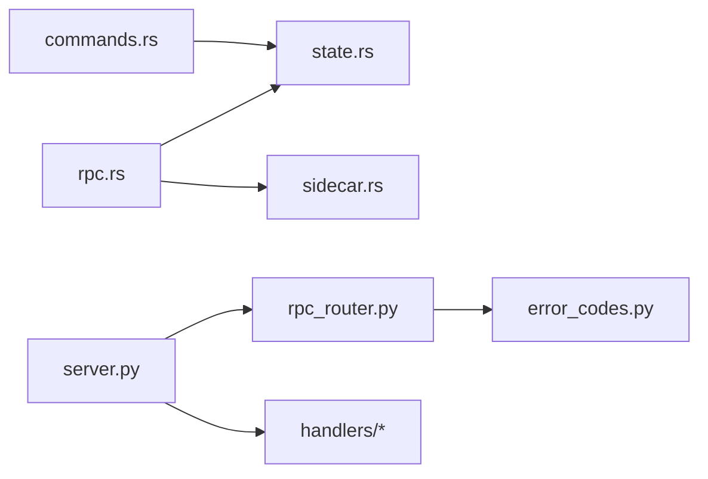

# API 参考文档

<cite>
**本文引用的文件**   
- [python/sidecar/server.py](file://python/sidecar/server.py)
- [python/sidecar/rpc_router.py](file://python/sidecar/rpc_router.py)
- [src-tauri/src/rpc.rs](file://src-tauri/src/rpc.rs)
- [src-tauri/src/sidecar.rs](file://src-tauri/src/sidecar.rs)
- [src-tauri/src/commands.rs](file://src-tauri/src/commands.rs)
- [src-tauri/src/state.rs](file://src-tauri/src/state.rs)
- [utils/error_codes.py](file://utils/error_codes.py)
</cite>

## 目录
1. [简介](#简介)
2. [项目结构](#项目结构)
3. [核心组件](#核心组件)
4. [架构总览](#架构总览)
5. [详细组件分析](#详细组件分析)
6. [依赖关系分析](#依赖关系分析)
7. [性能与可靠性](#性能与可靠性)
8. [故障排查指南](#故障排查指南)
9. [结论](#结论)
10. [附录：协议、错误码与示例](#附录协议错误码与示例)

## 简介
本文件为 NoteAI 的 API 参考文档，覆盖以下方面：
- JSON-RPC 接口（Python Sidecar）：方法名、请求参数、响应格式、错误码定义
- Tauri 命令接口（Rust）：系统级能力调用方式与权限控制
- 前后端通信协议：数据结构与序列化格式
- 事件系统：消息格式、订阅机制与实时通信模式
- 使用示例：包括错误处理与异常场景
- 版本兼容性与迁移建议、最佳实践

NoteAI 采用“Tauri 前端 + Rust 中间层 + Python Sidecar”的三层架构。前端通过 Tauri 命令调用 Rust 侧能力；Rust 侧对 Python 后端进行进程管理、JSON-RPC 转发与事件广播；Python 侧提供业务逻辑与文件系统、RAG、云同步等能力。

## 项目结构
- 前端（WebUI）通过 Tauri 暴露的命令与 Rust 交互
- Rust 负责：
  - 启动/监控 Python Sidecar 进程
  - 维护工作区路径与状态
  - 白名单校验并转发 JSON-RPC 到 Python
  - 将 Python 的事件广播给前端
- Python Sidecar 负责：
  - 基于 stdin/stdout 的 JSON-RPC 服务
  - 注册各功能模块处理器（配置、文件、主题、标签、链接、RAG、云同步、MCP、CLI Agent 等）
  - 统一错误码与结构化错误返回
  - 工作区文件监听与自动处理（转换、索引、Wiki 同步等）

图表来源
- [src-tauri/src/commands.rs:107-246](file://src-tauri/src/commands.rs#L107-L246)
- [src-tauri/src/rpc.rs:190-283](file://src-tauri/src/rpc.rs#L190-L283)
- [src-tauri/src/sidecar.rs:215-311](file://src-tauri/src/sidecar.rs#L215-L311)
- [python/sidecar/server.py:54-125](file://python/sidecar/server.py#L54-L125)
- [python/sidecar/rpc_router.py:43-98](file://python/sidecar/rpc_router.py#L43-L98)

章节来源
- [python/sidecar/server.py:54-125](file://python/sidecar/server.py#L54-L125)
- [python/sidecar/rpc_router.py:43-98](file://python/sidecar/rpc_router.py#L43-L98)
- [src-tauri/src/rpc.rs:190-283](file://src-tauri/src/rpc.rs#L190-L283)
- [src-tauri/src/sidecar.rs:215-311](file://src-tauri/src/sidecar.rs#L215-L311)
- [src-tauri/src/commands.rs:107-246](file://src-tauri/src/commands.rs#L107-L246)

## 核心组件
- Tauri 命令层（commands.rs）
  - 提供文件系统访问、对话框、窗口管理等系统级能力
  - 对工作区路径进行安全校验，防止越权访问
- RPC 转发层（rpc.rs）
  - 维护允许调用的 Python 方法白名单
  - 封装 JSON-RPC 请求/响应，设置超时，处理管道断开与自动重启
- Sidecar 生命周期（sidecar.rs）
  - 查找 Python 解释器、启动子进程、读取 stdout/stderr
  - 将 Python 的 event 广播至前端，处理意外退出与恢复
- Python 服务端（server.py）
  - 构建 RpcRouter，注册各功能处理器
  - 实现工作区文件监听、缓存失效、后台任务与进度上报
- RPC 路由器（rpc_router.py）
  - 统一解析 method/params/id，线程池执行，结构化错误包装
- 错误码（error_codes.py）
  - 定义 ErrorCode 枚举与 make_error/NoteAIError，供所有处理器统一使用

章节来源
- [src-tauri/src/commands.rs:78-105](file://src-tauri/src/commands.rs#L78-L105)
- [src-tauri/src/rpc.rs:4-157](file://src-tauri/src/rpc.rs#L4-L157)
- [src-tauri/src/sidecar.rs:109-175](file://src-tauri/src/sidecar.rs#L109-L175)
- [python/sidecar/server.py:107-125](file://python/sidecar/server.py#L107-L125)
- [python/sidecar/rpc_router.py:43-98](file://python/sidecar/rpc_router.py#L43-L98)
- [utils/error_codes.py:14-97](file://utils/error_codes.py#L14-L97)

## 架构总览
下图展示了从前端到 Python 后端的完整调用链与事件回传路径。

图表来源
- [src-tauri/src/rpc.rs:190-283](file://src-tauri/src/rpc.rs#L190-L283)
- [src-tauri/src/sidecar.rs:261-301](file://src-tauri/src/sidecar.rs#L261-L301)
- [python/sidecar/server.py:570-590](file://python/sidecar/server.py#L570-L590)
- [python/sidecar/rpc_router.py:54-94](file://python/sidecar/rpc_router.py#L54-L94)

## 详细组件分析

### Tauri 命令接口（系统级能力）
- 打开文件夹/文件选择对话框
  - 输入：无
  - 输出：所选路径或路径数组
- 获取/设置工作区路径
  - 输入：路径字符串
  - 输出：成功或错误信息
- 文件读写与目录列举
  - 输入：相对或绝对路径、内容
  - 输出：文件内容、目录项列表
  - 安全：内部 normalize_path + validate_workspace_path 确保路径在工作区内
- 在新窗口中预览文件
  - 输入：文件路径、可选标题
  - 行为：创建新窗口并注入全局变量以定位文件

注意：所有涉及文件系统的命令均受工作区边界保护，拒绝越界访问。

章节来源
- [src-tauri/src/commands.rs:107-246](file://src-tauri/src/commands.rs#L107-L246)
- [src-tauri/src/commands.rs:78-105](file://src-tauri/src/commands.rs#L78-L105)

### JSON-RPC 协议（Python Sidecar）
- 传输通道
  - 单向文本流：每行一个 JSON 对象
  - 方向：前端 -> Rust -> Python（stdin），Python -> Rust -> 前端（stdout）
- 请求格式
  - id: 唯一标识符（字符串）
  - method: 方法名（字符串，需位于白名单）
  - params: 参数对象（任意 JSON）
- 响应格式
  - 成功：{"id": "...", "result": <任意>}
  - 失败：{"id": "...", "error": {"code": "...", "message": "...", "details": {}}}
- 事件格式
  - id: "event"
  - result: 事件对象，包含 type 字段及业务数据
- 错误码
  - 统一使用 utils.error_codes.ErrorCode 与 make_error/NoteAIError 生成
  - 常见类别：通用、路径/工作区、认证、RAG/索引、特性可用性、Schema/Ingest、验证、云同步、UI/窗口

章节来源
- [src-tauri/src/state.rs:35-47](file://src-tauri/src/state.rs#L35-L47)
- [python/sidecar/server.py:126-143](file://python/sidecar/server.py#L126-L143)
- [python/sidecar/rpc_router.py:54-94](file://python/sidecar/rpc_router.py#L54-L94)
- [utils/error_codes.py:14-97](file://utils/error_codes.py#L14-L97)

### RPC 转发器（Rust 侧）
- 方法白名单
  - 仅允许 ALLOWED_PYTHON_METHODS 中的方法被调用
- 超时策略
  - rag_chat 默认 60s；start_ingest/ensure_ingest/retry_ingest/init_rag_index/rag_rebuild_index/cancel_ingest 默认 120s；其余 60s
- 管道异常与自愈
  - Broken pipe 或进程未运行会触发自动重启，随后重试一次调用
- 请求-响应关联
  - 使用 oneshot channel 按 id 匹配响应

章节来源
- [src-tauri/src/rpc.rs:4-157](file://src-tauri/src/rpc.rs#L4-L157)
- [src-tauri/src/rpc.rs:160-167](file://src-tauri/src/rpc.rs#L160-L167)
- [src-tauri/src/rpc.rs:247-283](file://src-tauri/src/rpc.rs#L247-L283)

### Sidecar 生命周期（Rust 侧）
- Python 解释器发现
  - 支持环境变量 NOTEAI_PYTHON、打包资源路径、开发环境路径、系统 PATH
- 脚本定位
  - 优先从应用资源中解析 main.py，否则回退到多候选路径
- 进程管理
  - 设置 HF/HuggingFace 相关环境变量与线程数
  - 捕获 stdout/stderr，解析 JSON 响应并分发
  - 检测异常退出并广播 sidecar_died 事件
- 健康检查与等待
  - is_sidecar_alive/wait_for_sidecar 用于阻塞等待就绪

章节来源
- [src-tauri/src/sidecar.rs:109-175](file://src-tauri/src/sidecar.rs#L109-L175)
- [src-tauri/src/sidecar.rs:177-213](file://src-tauri/src/sidecar.rs#L177-L213)
- [src-tauri/src/sidecar.rs:215-311](file://src-tauri/src/sidecar.rs#L215-L311)
- [src-tauri/src/sidecar.rs:26-45](file://src-tauri/src/sidecar.rs#L26-L45)

### Python 服务端与路由器
- 路由注册
  - 在构造时集中注册配置、组件、工作区、传输、文件、标签、主题、链接、智能、作业、RAG、云同步、Ingest、知识库、CLI Agent、MCP 等处理器
- 请求处理
  - 解析 method/params/id，线程池执行，统一错误包装
- 事件与进度
  - _send_progress/_send_job_update 推送 job 状态与进度事件
- 工作区监听
  - 基于 watchdog 监听变更，去抖合并，触发 Wiki 同步、自动转换、RAG 重建提示等
- 缓存
  - TTLCache 与全文索引脏标记，避免重复计算

章节来源
- [python/sidecar/server.py:107-125](file://python/sidecar/server.py#L107-L125)
- [python/sidecar/server.py:126-182](file://python/sidecar/server.py#L126-L182)
- [python/sidecar/server.py:216-255](file://python/sidecar/server.py#L216-L255)
- [python/sidecar/server.py:298-346](file://python/sidecar/server.py#L298-L346)
- [python/sidecar/server.py:340-356](file://python/sidecar/server.py#L340-L356)
- [python/sidecar/rpc_router.py:43-98](file://python/sidecar/rpc_router.py#L43-L98)

### 处理器基类与扩展点
- BaseHandler 提供共享上下文、发送工具、路径解析、缓存、任务启动等便捷属性
- 各功能模块处理器继承该基类并实现 register_routes 注册方法

章节来源
- [python/sidecar/handlers/base.py:4-106](file://python/sidecar/handlers/base.py#L4-L106)

## 依赖关系分析
- Rust 侧
  - commands.rs 依赖 state.rs（AppState、PyRequest/PyResponse）
  - rpc.rs 依赖 sidecar.rs（进程管理）、state.rs（状态）
  - sidecar.rs 依赖 tokio 异步 I/O、tauri Emitter
- Python 侧
  - server.py 依赖 rpc_router.py、handlers/*、config、modules/*、utils/*
  - rpc_router.py 依赖 error_codes.py、logger
- 事件与状态
  - Rust 通过 app.emit("python-event") 向 UI 广播
  - Python 通过 stdout 逐行输出 JSON，Rust 解析并分发

图表来源
- [src-tauri/src/commands.rs:1-246](file://src-tauri/src/commands.rs#L1-246)
- [src-tauri/src/rpc.rs:1-283](file://src-tauri/src/rpc.rs#L1-283)
- [src-tauri/src/sidecar.rs:1-312](file://src-tauri/src/sidecar.rs#L1-312)
- [src-tauri/src/state.rs:1-48](file://src-tauri/src/state.rs#L1-48)
- [python/sidecar/server.py:1-125](file://python/sidecar/server.py#L1-L125)
- [python/sidecar/rpc_router.py:1-106](file://python/sidecar/rpc_router.py#L1-L106)
- [utils/error_codes.py:1-120](file://utils/error_codes.py#L1-L120)

章节来源
- [src-tauri/src/state.rs:1-48](file://src-tauri/src/state.rs#L1-48)
- [src-tauri/src/rpc.rs:1-283](file://src-tauri/src/rpc.rs#L1-283)
- [src-tauri/src/sidecar.rs:1-312](file://src-tauri/src/sidecar.rs#L1-312)
- [python/sidecar/server.py:1-125](file://python/sidecar/server.py#L1-L125)
- [python/sidecar/rpc_router.py:1-106](file://python/sidecar/rpc_router.py#L1-L106)
- [utils/error_codes.py:1-120](file://utils/error_codes.py#L1-L120)

## 性能与可靠性
- 并发模型
  - Python 侧使用线程池执行处理器，避免阻塞主循环
  - Rust 侧使用 tokio 异步 I/O 与 oneshot 通道
- 超时与重试
  - 针对长耗时方法（如 RAG 聊天、索引重建）提高超时阈值
  - 管道异常自动重启并重试一次
- 缓存与去抖
  - Python 侧 TTLCache 与工作区变更去抖，减少重复计算与频繁事件
- 资源清理
  - shutdown 阶段关闭线程池、清理集合缓存、停止 LLM/RAG 执行器

章节来源
- [python/sidecar/rpc_router.py:43-50](file://python/sidecar/rpc_router.py#L43-L50)
- [python/sidecar/server.py:340-356](file://python/sidecar/server.py#L340-L356)
- [python/sidecar/server.py:544-568](file://python/sidecar/server.py#L544-L568)
- [src-tauri/src/rpc.rs:160-167](file://src-tauri/src/rpc.rs#L160-L167)
- [src-tauri/src/rpc.rs:247-283](file://src-tauri/src/rpc.rs#L247-L283)

## 故障排查指南
- Python 后端意外退出
  - 现象：收到 sidecar_died 事件
  - 处理：下次操作将自动恢复；可手动触发 restart_python_sidecar
- 管道断开/进程未运行
  - 现象：调用返回“Broken pipe”或“not running”
  - 处理：自动重启并重试；若仍失败，检查 Python 环境与资源路径
- 方法不在白名单
  - 现象：Method not allowed
  - 处理：确认方法名是否在 ALLOWED_PYTHON_METHODS 中
- 工作区路径无效或越界
  - 现象：PATH_OUTSIDE_WORKSPACE/WORKSPACE_NOT_SET
  - 处理：先设置有效工作区路径，并确保目标路径在工作区内
- 结构化错误码
  - 使用 ErrorCode 分类快速定位问题域（认证、RAG、索引、云同步等）

章节来源
- [src-tauri/src/sidecar.rs:57-79](file://src-tauri/src/sidecar.rs#L57-L79)
- [src-tauri/src/rpc.rs:247-283](file://src-tauri/src/rpc.rs#L247-L283)
- [src-tauri/src/commands.rs:78-105](file://src-tauri/src/commands.rs#L78-L105)
- [utils/error_codes.py:14-97](file://utils/error_codes.py#L14-L97)

## 结论
NoteAI 的 API 体系围绕“Tauri 命令 + Rust RPC 转发 + Python Sidecar”展开，具备清晰的职责划分、严格的权限与安全校验、完善的错误码与事件机制。通过白名单、超时、自动重启与缓存去抖，系统在可用性与性能之间取得良好平衡。

## 附录：协议、错误码与示例

### 协议与数据结构
- JSON-RPC 请求
  - id: 字符串
  - method: 字符串（需在白名单）
  - params: 对象
- JSON-RPC 响应
  - 成功：{"id": "...", "result": <任意>}
  - 失败：{"id": "...", "error": {"code": "...", "message": "...", "details": {}}}
- 事件
  - id: "event"
  - result: 事件对象，包含 type 与业务数据

章节来源
- [src-tauri/src/state.rs:35-47](file://src-tauri/src/state.rs#L35-L47)
- [python/sidecar/server.py:126-143](file://python/sidecar/server.py#L126-L143)
- [python/sidecar/rpc_router.py:54-94](file://python/sidecar/rpc_router.py#L54-L94)

### 错误码定义（节选）
- 通用：OK、UNKNOWN_ERROR、INVALID_PARAMS、INTERNAL_ERROR、NOT_IMPLEMENTED、METHOD_NOT_FOUND、OPERATION_CANCELLED、TIMEOUT
- 路径/工作区：WORKSPACE_NOT_SET、WORKSPACE_NOT_FOUND、PATH_OUTSIDE_WORKSPACE、PATH_INVALID、FILE_NOT_FOUND、FILE_TOO_LARGE、FILE_READ_ONLY、DIRECTORY_PROTECTED
- 认证/凭据：API_KEY_MISSING、API_KEY_INVALID、API_CONNECTION_FAILED、CLOUD_AUTH_FAILED、CLOUD_NOT_CONNECTED
- RAG/索引：RAG_NOT_ENABLED、RAG_INDEX_EMPTY、RAG_INDEX_BUILDING、RAG_RETRIEVAL_FAILED、RAG_LLM_CALL_FAILED、RAG_RERANKER_UNAVAILABLE
- 特性可用性：FEATURE_NOT_INSTALLED、DEPENDENCY_MISSING、CLI_AGENT_NOT_FOUND、CLI_AGENT_EXEC_FAILED
- Schema/Ingest：SCHEMA_NOT_SETUP、SCHEMA_INVALID、INGEST_IN_PROGRESS、INGEST_FAILED、CONVERSION_FAILED
- 验证：PROMPT_EMPTY、PROMPT_TOO_LONG、PROMPT_INVALID、TOPIC_NOT_FOUND、TAG_INVALID
- 云同步：CLOUD_PROVIDER_UNKNOWN、CLOUD_SYNC_IN_PROGRESS、CLOUD_SYNC_FAILED
- UI/前端：NOT_RUNNING_IN_TAURI、WINDOW_OPERATION_FAILED

章节来源
- [utils/error_codes.py:14-97](file://utils/error_codes.py#L14-L97)

### 事件类型与订阅
- 事件通道
  - Rust 通过 app.emit("python-event", payload) 广播
  - 前端订阅 "python-event" 事件进行处理
- 典型事件
  - sidecar_ready：Python 后端已恢复
  - sidecar_died：Python 后端意外退出
  - workspace_files_changed：工作区文件变更（可能包含 file_paths）
  - rag_index_needs_rebuild：RAG 索引需要重建
  - auto_file_converted：自动文件转换完成（包含 source/markdown）
  - progress：任务进度更新（element_id/progress/message）

章节来源
- [src-tauri/src/sidecar.rs:98-106](file://src-tauri/src/sidecar.rs#L98-L106)
- [src-tauri/src/sidecar.rs:72-79](file://src-tauri/src/sidecar.rs#L72-L79)
- [python/sidecar/server.py:241-246](file://python/sidecar/server.py#L241-L246)
- [python/sidecar/server.py:283-296](file://python/sidecar/server.py#L283-L296)
- [python/sidecar/server.py:496-504](file://python/sidecar/server.py#L496-L504)
- [python/sidecar/server.py:131-143](file://python/sidecar/server.py#L131-L143)

### 使用示例（步骤式）
- 调用 Python 方法
  - 前端调用 Tauri 命令 py_call(method, params)
  - Rust 侧确保 Sidecar 存活，写入 JSON-RPC 请求行
  - Python 侧路由到对应处理器，返回 result 或 error
  - Rust 侧匹配 id 并返回给前端
- 处理事件
  - 前端订阅 "python-event"
  - 根据 result.type 分支处理（如 workspace_files_changed、rag_index_needs_rebuild、progress 等）
- 错误处理
  - 检查 response.error.code，结合 i18n 展示用户友好提示
  - 对于 TIME_OUT/Broken pipe 等，提示重试或等待自动恢复

章节来源
- [src-tauri/src/rpc.rs:247-283](file://src-tauri/src/rpc.rs#L247-L283)
- [python/sidecar/server.py:126-143](file://python/sidecar/server.py#L126-L143)
- [python/sidecar/rpc_router.py:54-94](file://python/sidecar/rpc_router.py#L54-L94)

### 版本兼容性与迁移指南
- 兼容性
  - 当前协议基于 JSON 文本行，向后兼容性强
  - 新增方法需加入 ALLOWED_PYTHON_METHODS 白名单
- 迁移建议
  - 旧版直接调用 Python 的方法应逐步迁移到通过 py_call 统一入口
  - 对长耗时方法，前端应订阅事件而非长时间轮询
  - 对路径相关操作，始终通过 Tauri 命令或经工作区校验的 RPC 方法

章节来源
- [src-tauri/src/rpc.rs:4-157](file://src-tauri/src/rpc.rs#L4-L157)
- [src-tauri/src/commands.rs:78-105](file://src-tauri/src/commands.rs#L78-L105)

### 最佳实践
- 安全
  - 所有路径操作必须经过工作区校验
  - 严格限制可调用的 Python 方法
- 健壮性
  - 合理设置超时与重试策略
  - 对事件进行去重与幂等处理
- 性能
  - 利用缓存与去抖减少重复计算
  - 大任务采用事件驱动，避免阻塞 UI

章节来源
- [python/sidecar/server.py:340-356](file://python/sidecar/server.py#L340-L356)
- [src-tauri/src/rpc.rs:160-167](file://src-tauri/src/rpc.rs#L160-L167)
- [src-tauri/src/commands.rs:78-105](file://src-tauri/src/commands.rs#L78-L105)