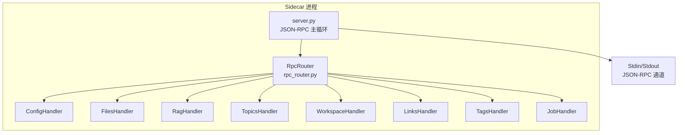
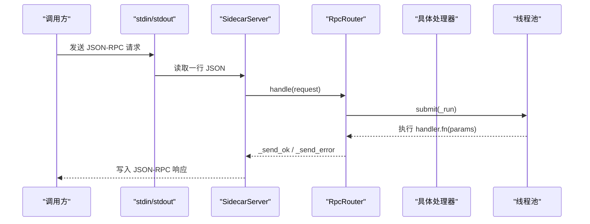
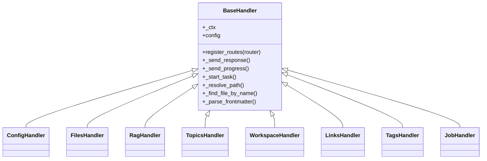

# JSON-RPC API

<cite>
**本文引用的文件**   
- [rpc_router.py](file://python/sidecar/rpc_router.py)
- [server.py](file://python/sidecar/server.py)
- [config_handler.py](file://python/sidecar/handlers/config_handler.py)
- [files_handler.py](file://python/sidecar/handlers/files_handler.py)
- [rag_handler.py](file://python/sidecar/handlers/rag_handler.py)
- [topics_handler.py](file://python/sidecar/handlers/topics_handler.py)
- [workspace_handler.py](file://python/sidecar/handlers/workspace_handler.py)
- [job_handler.py](file://python/sidecar/handlers/job_handler.py)
- [links_handler.py](file://python/sidecar/handlers/links_handler.py)
- [tags_handler.py](file://python/sidecar/handlers/tags_handler.py)
- [base.py](file://python/sidecar/handlers/base.py)
- [error_codes.py](file://utils/error_codes.py)
</cite>

## 目录
1. [简介](#简介)
2. [项目结构](#项目结构)
3. [核心组件](#核心组件)
4. [架构总览](#架构总览)
5. [详细组件分析](#详细组件分析)
6. [依赖关系分析](#依赖关系分析)
7. [性能与并发](#性能与并发)
8. [错误处理与安全](#错误处理与安全)
9. [版本兼容与迁移](#版本兼容与迁移)
10. [故障排查指南](#故障排查指南)
11. [结论](#结论)

## 简介
本文件为 NoteAI 的 JSON-RPC API 提供完整接口文档。NoteAI 通过 Python Sidecar 进程以 JSON-RPC over stdin/stdout 的方式对外暴露能力，涵盖配置管理、文件操作、RAG 检索、主题管理、工作区管理、链接发现、标签管理、任务状态等。所有处理器均继承自统一基类并通过 RpcRouter 注册路由，请求在独立线程池中执行，避免阻塞主 I/O 循环。

## 项目结构
- 入口与路由
  - server.py：Sidecar 主服务，负责 stdin/stdout 读写、事件推送、后台任务、文件监听、模型预热等；构建并持有各处理器实例，统一注册路由。
  - rpc_router.py：轻量级 JSON-RPC 路由器，支持同步/异步处理器，内置线程池与结构化错误封装。
- 处理器（handlers）
  - config_handler.py：API/UI/主题/规则等配置读写与连通性测试。
  - files_handler.py：文件预览、保存、创建笔记、删除/移动、Finder 打开等。
  - rag_handler.py：RAG 索引构建/增量更新、问答流式输出、记忆清理、索引状态查询。
  - topics_handler.py：主题树、自动分配、批量分配、重命名/删除、Wiki 同步、待办与活动日志等。
  - workspace_handler.py：工作区设置/校验/树形浏览、健康检查等。
  - links_handler.py：链接发现、反向链接、确认/拒绝链接等。
  - tags_handler.py：标签扫描、自动打标、增删改查、导出 tags.md 等。
  - job_handler.py：任务列表与详情查询。
- 基础与工具
  - base.py：处理器基类，提供共享能力访问。
  - error_codes.py：统一的错误码枚举与结构化错误构造器。

图表来源
- [server.py:107-124](file://python/sidecar/server.py#L107-L124)
- [rpc_router.py:43-82](file://python/sidecar/rpc_router.py#L43-L82)

章节来源
- [server.py:1-125](file://python/sidecar/server.py#L1-L125)
- [rpc_router.py:1-106](file://python/sidecar/rpc_router.py#L1-L106)

## 核心组件
- RpcRouter
  - 职责：解析 JSON-RPC 请求、分发到处理器方法、线程池执行、返回成功或结构化错误。
  - 关键特性：
    - 支持同步处理器；异步处理器标记 async_mode=True 时仍走线程池执行，避免阻塞。
    - 错误消息脱敏：移除绝对路径与家目录提示，防止泄露敏感信息。
    - 线程池大小默认 8，可通过内部常量调整。
- BaseHandler
  - 职责：为各处理器提供统一上下文访问（配置、发送响应/进度、任务调度、路径解析、缓存失效等）。
- Server（SidecarServer）
  - 职责：生命周期管理、文件监听、后台任务、事件推送、模型预热、RPC 路由组装。

章节来源
- [rpc_router.py:35-106](file://python/sidecar/rpc_router.py#L35-L106)
- [base.py:1-106](file://python/sidecar/handlers/base.py#L1-L106)
- [server.py:54-125](file://python/sidecar/server.py#L54-L125)

## 架构总览

图表来源
- [server.py:570-595](file://python/sidecar/server.py#L570-L595)
- [rpc_router.py:54-94](file://python/sidecar/rpc_router.py#L54-L94)

## 详细组件分析

### 配置管理（ConfigHandler）
- 功能概览
  - 获取/保存 API 配置（含连接测试）、UI 配置、主题偏好、项目规则与工作区规则。
  - UI 配置包含 RAG 相关开关与阈值、字体、集成策略、自动导入、Agent 模式等。
- 主要方法与参数
  - get_api_config
    - 请求参数：无
    - 响应字段：api_key（脱敏）、api_key_configured、api_base、model_name、temperature、max_tokens、max_context_tokens、disable_thinking
  - save_api_config
    - 请求参数：api_key、api_base、model_name、temperature、max_tokens、max_context_tokens、disable_thinking
    - 响应：success、message
  - get_ui_config
    - 请求参数：无
    - 响应：web_ai_assist、web_include_images、conv_ai_assist、integration_strategy、auto_topic、topic_auto_assign_threshold、topic_list、font_size、sidebar_font_family、preview_font_family、typography、cloud_sync_experimental、ingest_auto_enabled、assistant_agent_mode、cli_agent_id、rag_enabled、rag_hyde_enabled、rag_hyde_threshold、rag_rerank_enabled、rag_rerank_skip_score、rag_dense_weight、rag_top_k、rag_top_k_tags、rag_rerank_model、locale
  - save_ui_config
    - 请求参数：上述任意子集（带类型约束与范围校验）
    - 响应：success、message
  - get_theme_preference / save_theme_preference
    - 请求参数：theme（保存时）
    - 响应：success 或 theme 值
  - test_api_connection
    - 请求参数：api_key、api_base、model_name（可选）
    - 响应：success、message
  - get_project_rules / save_project_rules
    - 请求参数：rules（保存时）
    - 响应：success、rules/message
  - get_workspace_rules / save_workspace_rules
    - 请求参数：max_topic_depth、auto_update_survey、survey_at_level（保存时）
    - 响应：success、configured/message
  - needs_workspace_rules_setup
    - 请求参数：无
    - 响应：success、needs_setup
- 示例
  - 成功：保存 UI 配置后返回 success=true，message="UI 配置已保存"
  - 失败：未设置工作区时保存项目规则返回 success=false，message="未设置工作区"

章节来源
- [config_handler.py:16-286](file://python/sidecar/handlers/config_handler.py#L16-L286)

### 文件操作（FilesHandler）
- 功能概览
  - 文件预览（大文本分片直传）、保存内容、创建笔记（从标题/草稿）、原始读取、Finder 打开、删除、移动。
- 主要方法与参数
  - get_file_preview
    - 请求参数：path、force_semantic_preview（可选）
    - 响应：success、type、preview_delivery、file_name、file_size、total_byte_size、transport_hint 或二进制预览数据
  - read_preview_raw_slice
    - 请求参数：path、byte_offset、byte_limit
    - 响应：success、chunk_b64、total_byte_size、byte_offset_start、next_byte_offset、done
  - can_preview_file
    - 请求参数：path
    - 响应：布尔结果
  - save_file_content
    - 请求参数：path、content
    - 响应：success、message
  - create_note / create_note_from_draft
    - 请求参数：title、topic（可选）、content（草稿模式）
    - 响应：success、path、title、topic、message
  - read_file_raw
    - 请求参数：path
    - 响应：success、content(base64)、size、file_name
  - reveal_in_finder
    - 请求参数：path
    - 响应：success、message
  - delete_file
    - 请求参数：path
    - 响应：success、message
  - move_file
    - 请求参数：file_path、target_folder
    - 响应：success、path、message
- 安全与限制
  - 最大文件大小限制（保存/读取），保护系统/运行时目录不可写，Finder 打开前进行非法字符校验。
- 示例
  - 成功：保存文件返回 success=true，message="文件已保存"
  - 失败：路径无效返回 success=false，message="路径无效"

章节来源
- [files_handler.py:15-425](file://python/sidecar/handlers/files_handler.py#L15-L425)

### RAG 检索（RagHandler）
- 功能概览
  - 索引构建/重建、增量添加/删除块、对话问答（流式）、记忆清理、索引状态查询。
- 主要方法与参数
  - init_rag_index / rag_rebuild_index
    - 请求参数：workspace（可选）
    - 响应：success、status="started"；后台事件 rag_index_progress、rag_index_built
  - rag_add_chunks
    - 请求参数：file_path
    - 响应：success、message
  - rag_remove_chunks
    - 请求参数：file_path
    - 响应：success、message
  - rag_chat（异步）
    - 请求参数：question、history（可选）、selection_lookup/current_file/selection_context/selection_route（选填）、force_intent（可选）
    - 响应：success、started=true；后台事件 rag_chat_chunk、rag_chat_done、rag_error
  - rag_clear_memory
    - 请求参数：无
    - 响应：success
  - rag_index_status
    - 请求参数：无
    - 响应：enabled、built、needs_rebuild、repair_required、chunk_count、expected_chunks、file_count、mtime、is_building、percent、stage
- 并发控制
  - 使用锁保证索引构建互斥、对话互斥；错误冷却期避免频繁重试。
- 示例
  - 成功：rag_chat 启动后返回 started=true，随后收到多个 rag_chat_chunk，最终 rag_chat_done 携带 answer、citations、citation_quality
  - 失败：RAG 未启用返回 success=false，message 提示开启向量检索

章节来源
- [rag_handler.py:22-698](file://python/sidecar/handlers/rag_handler.py#L22-L698)

### 主题管理（TopicsHandler）
- 功能概览
  - 主题树、自动/批量分配、移动到主题、创建/重命名/删除主题、Wiki 同步、待办与活动日志、合并重复主题、调查状态与切换。
- 主要方法与参数
  - get_topic_tree
    - 请求参数：无
    - 响应：主题树结构
  - sync_wiki_with_files
    - 请求参数：无
    - 响应：success、updated 等
  - auto_assign_topic / batch_auto_assign_topics
    - 请求参数：path（单个）；批量无需参数
    - 响应：success、topic/candidates/统计信息
  - move_file_to_topic
    - 请求参数：path、topic
    - 响应：success、message
  - create_topic / rename_topic / delete_topic
    - 请求参数：name/parent、old_name/new_name、topic_name
    - 响应：success、message、updated/merged/moved 等
  - resolve_topic / keep_note_in_topic / apply_topic_placement_threshold
    - 请求参数：file_path/topic 等
    - 响应：success、message
  - get_all_topic_names / get_file_topics / get_topic_files / remove_file_from_topic
    - 请求参数：path 或 topic
    - 响应：success、topics/files 等
  - get_all_pending / get_activity_log / merge_duplicate_topics
    - 请求参数：limit（活动日志）
    - 响应：items/count/summary、entries、merged/deduplicated 计数
  - get_survey_status / toggle_survey / fix_survey_topics
    - 请求参数：topic（切换）
    - 响应：surveys、success、message
- 示例
  - 成功：批量分配完成后返回 total/auto_assigned/need_confirm/skipped 统计
  - 失败：未设置工作区返回 success=false，message="未设置工作区或工作区不存在"

章节来源
- [topics_handler.py:41-588](file://python/sidecar/handlers/topics_handler.py#L41-L588)

### 工作区管理（WorkspaceHandler）
- 功能概览
  - 工作区状态、路径校验/设置/清除、树形浏览、文件选择解析、知识库健康检查、刷新日志。
- 主要方法与参数
  - get_workspace_status
    - 请求参数：无
    - 响应：is_set、workspace_path、notes_folder、organized_folder、saved_workspace、needs_workspace_rules_setup、needs_schema_setup
  - check_workspace_path_valid
    - 请求参数：path
    - 响应：is_valid、message、path
  - clear_saved_workspace
    - 请求参数：无
    - 响应：success、message
  - set_workspace_path
    - 请求参数：path
    - 响应：success、message、workspace_path、needs_* 标志
  - get_workspace_tree
    - 请求参数：无
    - 响应：树节点数组（文件夹/文件）
  - on_file_selected
    - 请求参数：path
    - 响应：success、path
  - refresh_log
    - 请求参数：无
    - 响应：success、message
  - get_kb_health
    - 请求参数：无
    - 响应：健康指标对象
- 示例
  - 成功：设置工作区返回 success=true，workspace_path=目标路径
  - 失败：路径无效返回 success=false，message="路径无效"

章节来源
- [workspace_handler.py:34-260](file://python/sidecar/handlers/workspace_handler.py#L34-L260)

### 链接管理（LinksHandler）
- 功能概览
  - 链接发现（后台）、反向链接、链接统计、确认/拒绝链接、批量确认、单文件交叉引用发现。
- 主要方法与参数
  - discover_links
    - 请求参数：无
    - 响应：success、status="started"；后台事件 link_discovery_progress、link_discovery_complete
  - get_backlinks
    - 请求参数：file_path
    - 响应：backlinks 列表
  - get_link_stats
    - 请求参数：无
    - 响应：total、confirmed、pending
  - confirm_link / reject_link
    - 请求参数：from、to
    - 响应：success、message
  - confirm_all_links
    - 请求参数：无
    - 响应：success、message
  - discover_cross_refs_for_file
    - 请求参数：file_path
    - 响应：success、data
- 示例
  - 成功：discover_links 返回 status="started"，完成后触发 link_discovery_complete 事件

章节来源
- [links_handler.py:7-85](file://python/sidecar/handlers/links_handler.py#L7-L85)

### 标签管理（TagsHandler）
- 功能概览
  - 全量标签扫描、自动打标（dry_run 预览）、导出 tags.md、标签 CRUD、按文件增删标签。
- 主要方法与参数
  - get_all_tags
    - 请求参数：无
    - 响应：tags（名称、数量、文件列表）
  - auto_tag_files
    - 请求参数：dry_run（可选）
    - 响应：success、dry_run、updated、preview、message
  - save_tags_md / ensure_tags_md
    - 请求参数：无
    - 响应：success、message
  - create_tag / rename_tag / delete_tag
    - 请求参数：name、old_tag/new_tag、tag_name
    - 响应：success、message、created/updated/merged
  - add_tag_to_file
    - 请求参数：file_path、tag
    - 响应：success、updated、message
- 示例
  - 成功：rename_tag 返回 updated 计数与 merged 标志
  - 失败：未设置工作区返回 success=false，message="未设置工作区"

章节来源
- [tags_handler.py:47-305](file://python/sidecar/handlers/tags_handler.py#L47-L305)

### 任务状态（JobHandler）
- 功能概览
  - 列出任务、查询单个任务详情。
- 主要方法与参数
  - get_jobs
    - 请求参数：include_finished、limit
    - 响应：success、jobs
  - get_job
    - 请求参数：id 或 job_id
    - 响应：success、job
- 示例
  - 成功：get_jobs 返回 jobs 列表
  - 失败：缺少 id 返回 success=false，message="缺少 job id"

章节来源
- [job_handler.py:5-30](file://python/sidecar/handlers/job_handler.py#L5-L30)

## 依赖关系分析
- 处理器均继承 BaseHandler，通过 Server 提供的上下文访问配置、I/O、缓存、任务调度等。
- RpcRouter 集中注册所有处理器方法，屏蔽底层线程池与错误格式化细节。
- 错误体系由 ErrorCode 与 make_error 统一，处理器可抛出 NoteAIError 或直接返回结构化错误。

图表来源
- [base.py:1-106](file://python/sidecar/handlers/base.py#L1-L106)
- [config_handler.py:16-286](file://python/sidecar/handlers/config_handler.py#L16-L286)
- [files_handler.py:15-425](file://python/sidecar/handlers/files_handler.py#L15-L425)
- [rag_handler.py:22-698](file://python/sidecar/handlers/rag_handler.py#L22-L698)
- [topics_handler.py:41-588](file://python/sidecar/handlers/topics_handler.py#L41-L588)
- [workspace_handler.py:34-260](file://python/sidecar/handlers/workspace_handler.py#L34-L260)
- [links_handler.py:7-85](file://python/sidecar/handlers/links_handler.py#L7-L85)
- [tags_handler.py:47-305](file://python/sidecar/handlers/tags_handler.py#L47-L305)
- [job_handler.py:5-30](file://python/sidecar/handlers/job_handler.py#L5-L30)

章节来源
- [rpc_router.py:43-98](file://python/sidecar/rpc_router.py#L43-L98)
- [error_codes.py:14-120](file://utils/error_codes.py#L14-L120)

## 性能与并发
- 线程池
  - RpcRouter 使用 ThreadPoolExecutor，默认最大工作线程数为 8，用于执行所有处理器方法，确保主循环不被阻塞。
- 后台任务
  - Server 提供 _start_task 封装，基于 daemon 线程执行耗时任务，并通过 job_status 上报进度/完成/失败事件。
- 锁与去抖
  - RAG 对话与索引构建使用互斥锁；文件监听采用去抖定时器聚合变更，减少频繁事件风暴。
- 缓存
  - TTLCache 对高频计算结果做短期缓存；文件变更时主动失效 RPC 与全文检索缓存。
- 流式输出
  - RAG 问答通过事件流式推送 token，降低首字延迟。

章节来源
- [rpc_router.py:44-82](file://python/sidecar/rpc_router.py#L44-L82)
- [server.py:184-214](file://python/sidecar/server.py#L184-L214)
- [server.py:416-539](file://python/sidecar/server.py#L416-L539)
- [server.py:340-356](file://python/sidecar/server.py#L340-L356)
- [rag_handler.py:23-25](file://python/sidecar/handlers/rag_handler.py#L23-L25)

## 错误处理与安全
- 错误码
  - 定义于 ErrorCode 枚举，覆盖通用、路径/工作区、认证、RAG、特性可用性、Schema/Ingest、验证、云同步、UI 等场景。
- 结构化错误
  - make_error 生成 {code, message, details}；NoteAIError 可在处理器中抛出，由 Router 捕获并转换为 JSON-RPC error。
- 消息脱敏
  - 错误消息中的工作区路径与家目录会被替换为占位符，避免泄露敏感信息。
- 安全校验
  - 文件保存/删除/移动对工作区内路径进行严格校验，禁止写入受保护目录；Finder 打开前过滤非法字符。
- 典型错误码
  - METHOD_NOT_FOUND、INTERNAL_ERROR、WORKSPACE_NOT_SET、PATH_INVALID、FILE_TOO_LARGE、RAG_NOT_ENABLED、RAG_INDEX_BUILDING、API_CONNECTION_FAILED、DEPENDENCY_MISSING 等。

章节来源
- [error_codes.py:14-120](file://utils/error_codes.py#L14-L120)
- [rpc_router.py:14-32](file://python/sidecar/rpc_router.py#L14-L32)
- [files_handler.py:117-149](file://python/sidecar/handlers/files_handler.py#L117-L149)
- [files_handler.py:175-217](file://python/sidecar/handlers/files_handler.py#L175-L217)

## 版本兼容与迁移
- 当前版本约定
  - 通过 RpcRouter 注册的方法名作为 API 标识；新增方法保持向后兼容，不破坏已有方法签名。
- 兼容性建议
  - 客户端应忽略未知字段，仅依赖已知字段；对错误码进行分支处理而非字符串匹配。
- 迁移指南
  - 若需弃用某方法，保留空实现并返回 NOT_IMPLEMENTED 或废弃提示，同时在新版本中提供替代方法。
  - 对于 RAG 相关配置项，遵循现有 coerce 逻辑与默认值，避免破坏旧配置。

[本节为通用指导，不直接分析具体文件]

## 故障排查指南
- 常见问题
  - 方法未找到：检查 method 名称是否拼写正确，确认已在对应处理器 register_routes 中注册。
  - 工作区未设置：先调用 set_workspace_path 并确保路径存在。
  - RAG 未启用：在 UI 配置中开启 rag_enabled，必要时重建索引。
  - 索引构建中：等待完成或稍后重试，避免并发冲突。
  - 链接发现进行中：等待完成后再发起新发现。
- 定位手段
  - 观察事件流：progress、complete、failed、workspace_files_changed、rag_chat_chunk、rag_chat_done、rag_error 等。
  - 查看任务状态：get_jobs/get_job 获取运行中任务详情。
  - 检查健康状态：get_kb_health 获取知识库健康指标。

章节来源
- [server.py:126-183](file://python/sidecar/server.py#L126-L183)
- [job_handler.py:10-29](file://python/sidecar/handlers/job_handler.py#L10-L29)
- [workspace_handler.py:45-48](file://python/sidecar/handlers/workspace_handler.py#L45-L48)

## 结论
NoteAI 的 JSON-RPC API 以清晰的处理器分层与统一的路由/错误机制，提供了稳定可扩展的能力集合。通过线程池与事件流，兼顾了交互体验与系统稳定性。建议在客户端侧做好错误码分支、事件订阅与任务轮询，以获得最佳用户体验。