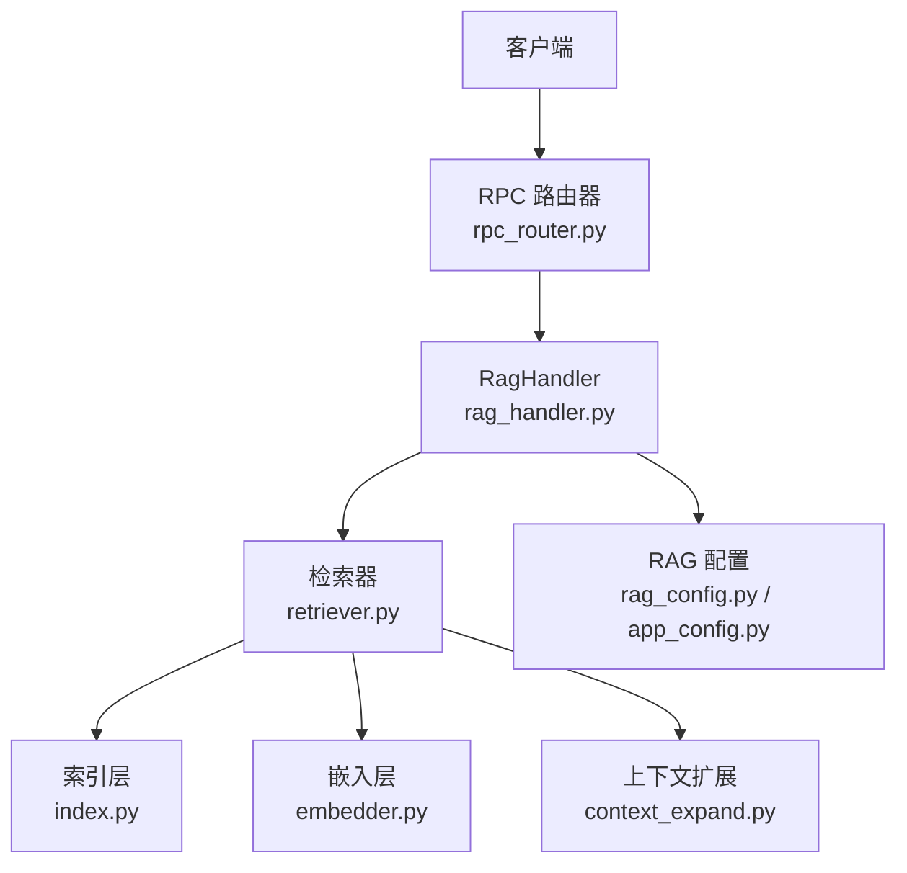
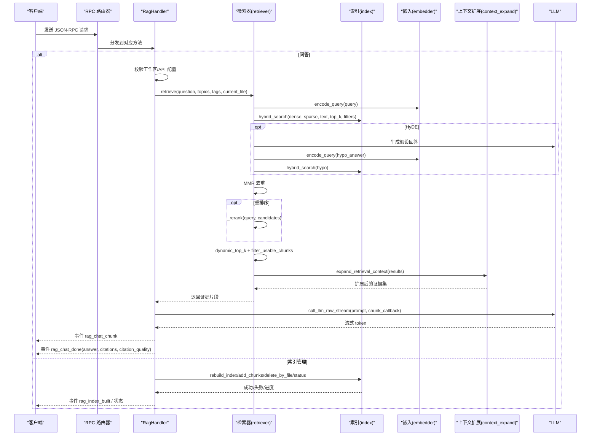
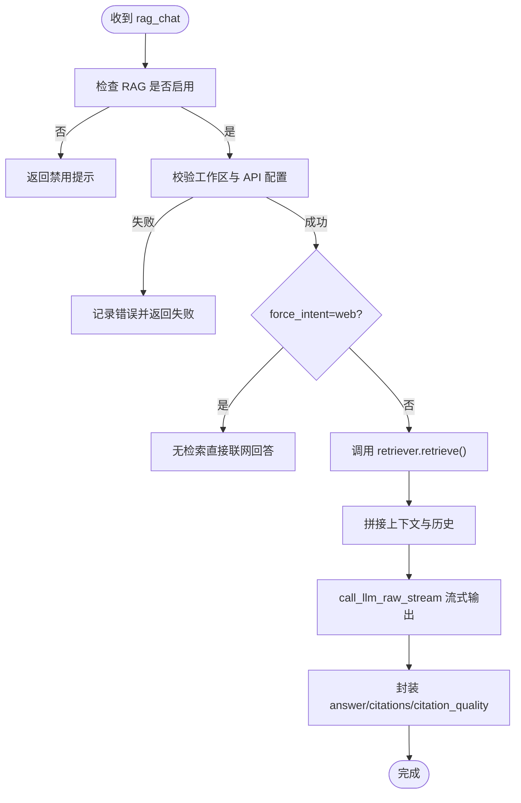
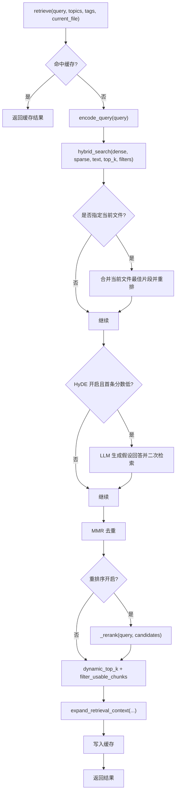
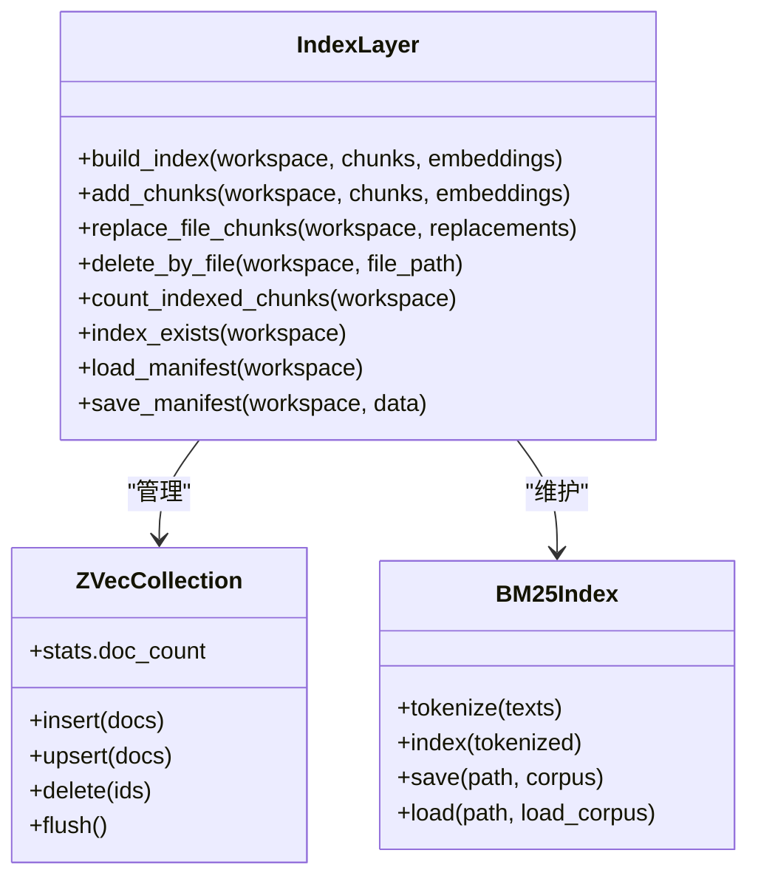
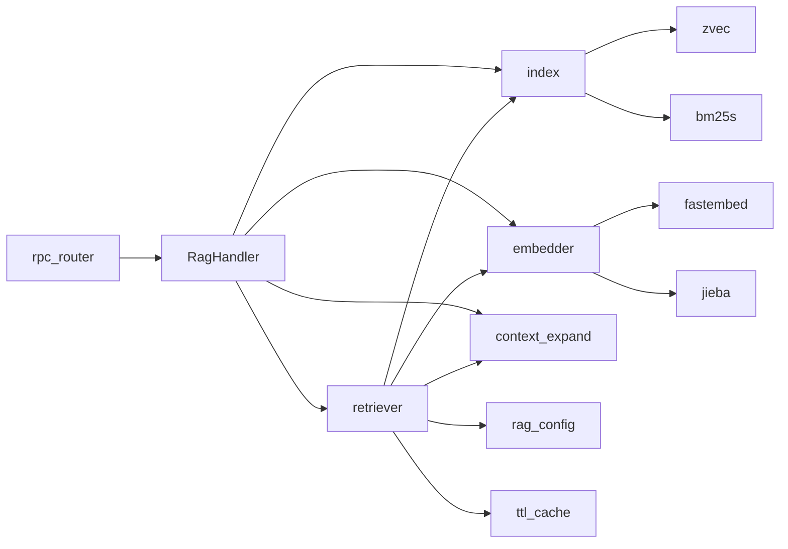

# RAG 检索 API

<cite>
**本文引用的文件**
- [rag_handler.py](file://python/sidecar/handlers/rag_handler.py)
- [retriever.py](file://python/sidecar/rag/retriever.py)
- [index.py](file://python/sidecar/rag/index.py)
- [embedder.py](file://python/sidecar/rag/embedder.py)
- [context_expand.py](file://python/sidecar/rag/context_expand.py)
- [rag_config.py](file://python/sidecar/rag/rag_config.py)
- [rpc_router.py](file://python/sidecar/rpc_router.py)
- [app_config.py](file://config/app_config.py)
</cite>

## 目录
1. [简介](#简介)
2. [项目结构](#项目结构)
3. [核心组件](#核心组件)
4. [架构总览](#架构总览)
5. [详细组件分析](#详细组件分析)
6. [依赖关系分析](#依赖关系分析)
7. [性能考虑](#性能考虑)
8. [故障排查指南](#故障排查指南)
9. [结论](#结论)
10. [附录：API 方法与参数参考](#附录api-方法与参数参考)

## 简介
本文件为 NoteAI 侧车（Sidecar）中“RAG 检索处理器”（RagHandler）的完整 API 文档，覆盖智能问答相关的所有 RPC 方法，包括向量索引管理、混合搜索查询、上下文扩展与结果重排序。文档同时说明检索参数配置（相似度阈值、返回数量限制、搜索策略）、索引生命周期（创建、更新、重建、清理）、嵌入模型选择与多 LLM 提供商支持、检索结果格式化输出（引用溯源、相关性评分、上下文片段），并提供性能优化建议与完整的查询示例及结果解析指南。

## 项目结构
RAG 检索能力由以下模块协作实现：
- RagHandler：对外暴露 JSON-RPC 方法，编排检索流程、流式输出与错误处理
- retriever：检索主流程，包含缓存、HyDE、MMR、重排序、动态 Top-K、上下文扩展
- index：本地向量+BM25s 混合索引，提供构建、增量更新、删除、状态统计等
- embedder：稠密向量与稀疏权重生成，全局 IDF 持久化
- context_expand：基于主题综述与确认双向链接的轻量上下文扩展
- rag_config：运行时检索策略开关与阈值
- rpc_router：统一 JSON-RPC 路由与线程池执行
- app_config：应用级配置项（含 RAG 相关开关与默认值）

图表来源
- [rpc_router.py:43-106](file://python/sidecar/rpc_router.py#L43-L106)
- [rag_handler.py:690-698](file://python/sidecar/handlers/rag_handler.py#L690-L698)
- [retriever.py:102-196](file://python/sidecar/rag/retriever.py#L102-L196)
- [index.py:502-582](file://python/sidecar/rag/index.py#L502-L582)
- [embedder.py:334-384](file://python/sidecar/rag/embedder.py#L334-L384)
- [context_expand.py:147-198](file://python/sidecar/rag/context_expand.py#L147-L198)
- [rag_config.py:1-64](file://python/sidecar/rag/rag_config.py#L1-L64)
- [app_config.py:89-97](file://config/app_config.py#L89-L97)

章节来源
- [rpc_router.py:43-106](file://python/sidecar/rpc_router.py#L43-L106)
- [rag_handler.py:690-698](file://python/sidecar/handlers/rag_handler.py#L690-L698)

## 核心组件
- RagHandler：注册并处理所有 RAG 相关的 RPC 方法，负责并发控制、进度事件、LLM 调用与最终结果封装
- retriever：检索管线，包含查询缓存、HyDE 假设生成、混合搜索、MMR 去重、重排序、动态 Top-K、上下文扩展
- index：zvec 稠密向量 + BM25s 稀疏词表的双路索引，支持原子构建、增量更新、批量删除、元数据倒排
- embedder：BAAI/bge-small-zh-v1.5 稠密向量与 jieba 分词 + 全局 IDF 的稀疏权重；支持下载回调与进度回调
- context_expand：按主题加载综述摘要，按已确认双向链接追加关联笔记片段
- rag_config：top_k、hyde_threshold、rerank_enabled、rerank_skip_score、dense_weight 等运行时开关
- rpc_router：JSON-RPC 路由，统一错误码与消息脱敏，线程池异步执行

章节来源
- [rag_handler.py:22-698](file://python/sidecar/handlers/rag_handler.py#L22-L698)
- [retriever.py:102-196](file://python/sidecar/rag/retriever.py#L102-L196)
- [index.py:502-582](file://python/sidecar/rag/index.py#L502-L582)
- [embedder.py:334-384](file://python/sidecar/rag/embedder.py#L334-L384)
- [context_expand.py:147-198](file://python/sidecar/rag/context_expand.py#L147-L198)
- [rag_config.py:1-64](file://python/sidecar/rag/rag_config.py#L1-L64)
- [rpc_router.py:43-106](file://python/sidecar/rpc_router.py#L43-L106)

## 架构总览
RAG 检索的整体流程如下：
- 客户端通过 JSON-RPC 调用 RagHandler 的方法
- 对于问答类请求，RagHandler 先校验工作区与 API 配置，再进入检索或联网分支
- 检索路径：encode_query -> hybrid_search -> HyDE(可选) -> MMR -> rerank(可选) -> dynamic_top_k -> filter_usable_chunks -> expand_retrieval_context
- 将检索到的上下文片段与历史/画像组合后，调用 LLM 流式生成答案，附带引用列表与质量评估
- 索引管理路径：全量/增量重建、文件级替换、删除、状态查询

图表来源
- [rag_handler.py:231-554](file://python/sidecar/handlers/rag_handler.py#L231-L554)
- [retriever.py:102-196](file://python/sidecar/rag/retriever.py#L102-L196)
- [retriever.py:198-227](file://python/sidecar/rag/retriever.py#L198-L227)
- [retriever.py:229-324](file://python/sidecar/rag/retriever.py#L229-L324)
- [retriever.py:459-626](file://python/sidecar/rag/retriever.py#L459-L626)
- [index.py:502-582](file://python/sidecar/rag/index.py#L502-L582)
- [embedder.py:359-384](file://python/sidecar/rag/embedder.py#L359-L384)
- [context_expand.py:147-198](file://python/sidecar/rag/context_expand.py#L147-L198)

## 详细组件分析

### RagHandler（RPC 方法编排）
- 注册方法：init_rag_index、rag_rebuild_index、rag_add_chunks、rag_remove_chunks、rag_chat、rag_clear_memory、rag_index_status
- 并发控制：对话与索引构建分别使用独立锁，避免重复执行
- 进度事件：索引构建阶段通过 job_status 与自定义事件上报进度
- 错误冷却：记录最近错误并在冷却期内拒绝新请求，防止雪崩
- 问答流程：
  - 校验工作区与 API 配置
  - 根据 force_intent 决定走知识库检索或联网检索
  - 组装提示词，调用 LLM 流式输出
  - 抽取实际被引用的来源，计算引用质量等级
- 记忆清理：清空短期记忆

图表来源
- [rag_handler.py:231-554](file://python/sidecar/handlers/rag_handler.py#L231-L554)
- [rag_handler.py:416-476](file://python/sidecar/handlers/rag_handler.py#L416-L476)
- [rag_handler.py:478-554](file://python/sidecar/handlers/rag_handler.py#L478-L554)

章节来源
- [rag_handler.py:22-698](file://python/sidecar/handlers/rag_handler.py#L22-L698)

### retriever（检索管线）
- 查询缓存：TTL 缓存相同查询的结果，过期时间 5 分钟
- 混合搜索：稠密向量 + 稀疏词表（全局 IDF）联合打分
- HyDE：当首条结果分数低于阈值时，用 LLM 生成假设回答再检索
- MMR：候选去重，平衡相关性与多样性
- 重排序：可选 FlagReranker，若首条分数高于阈值则跳过
- 动态 Top-K：根据问题类型与证据强度自适应裁剪
- 上下文扩展：主题综述 + 已确认双向链接片段

图表来源
- [retriever.py:102-196](file://python/sidecar/rag/retriever.py#L102-L196)
- [retriever.py:198-227](file://python/sidecar/rag/retriever.py#L198-L227)
- [retriever.py:229-324](file://python/sidecar/rag/retriever.py#L229-L324)
- [retriever.py:387-404](file://python/sidecar/rag/retriever.py#L387-L404)
- [retriever.py:459-626](file://python/sidecar/rag/retriever.py#L459-L626)

章节来源
- [retriever.py:102-196](file://python/sidecar/rag/retriever.py#L102-L196)
- [retriever.py:198-227](file://python/sidecar/rag/retriever.py#L198-L227)
- [retriever.py:229-324](file://python/sidecar/rag/retriever.py#L229-L324)
- [retriever.py:459-626](file://python/sidecar/rag/retriever.py#L459-L626)

### index（索引层）
- 数据结构：zvec 集合（稠密向量 + 字段）+ bm25s 词表 + metadata.json（主题/标签/文件倒排）
- 构建：原子写入 staging -> rename -> flush，失败回滚至备份
- 增量：删除旧文件块 -> 并行分块 -> 编码 -> upsert -> 重建 BM25s/metadata/global IDF
- 删除：按 file_path 过滤删除，更新倒排与 manifest
- 状态：count_indexed_chunks、index_exists、manifest 版本与 mtime 一致性检查

图表来源
- [index.py:502-582](file://python/sidecar/rag/index.py#L502-L582)
- [index.py:596-644](file://python/sidecar/rag/index.py#L596-L644)
- [index.py:646-702](file://python/sidecar/rag/index.py#L646-L702)
- [index.py:704-773](file://python/sidecar/rag/index.py#L704-L773)
- [index.py:332-359](file://python/sidecar/rag/index.py#L332-L359)

章节来源
- [index.py:502-582](file://python/sidecar/rag/index.py#L502-L582)
- [index.py:596-644](file://python/sidecar/rag/index.py#L596-L644)
- [index.py:646-702](file://python/sidecar/rag/index.py#L646-L702)
- [index.py:704-773](file://python/sidecar/rag/index.py#L704-L773)
- [index.py:332-359](file://python/sidecar/rag/index.py#L332-L359)

### embedder（嵌入与稀疏权重）
- 稠密模型：BAAI/bge-small-zh-v1.5，ONNX 推理线程数自动设置，支持下载回调与进度回调
- 稀疏权重：jieba 分词 + 全局 IDF（首次全量构建时保存 global_idf.json），查询时使用相同前缀模板
- 容错：模型加载失败时清理缓存重试，异常信息可恢复性判断

章节来源
- [embedder.py:140-165](file://python/sidecar/rag/embedder.py#L140-L165)
- [embedder.py:173-224](file://python/sidecar/rag/embedder.py#L173-L224)
- [embedder.py:258-284](file://python/sidecar/rag/embedder.py#L258-L284)
- [embedder.py:334-384](file://python/sidecar/rag/embedder.py#L334-L384)

### context_expand（上下文扩展）
- 主题综述：按 topic 键查找综述文件，截取最多 2 个，限制字符数
- 反向链接：从已确认双向链接中选取最多 4 个邻居，优先取已索引片段，否则读取正文节选
- 去重与顺序：综述前置，原始结果居中，反向链接后置，按 id 去重

章节来源
- [context_expand.py:147-198](file://python/sidecar/rag/context_expand.py#L147-L198)
- [context_expand.py:59-100](file://python/sidecar/rag/context_expand.py#L59-L100)
- [context_expand.py:103-144](file://python/sidecar/rag/context_expand.py#L103-L144)

### rag_config（检索策略配置）
- top_k：默认 5，带标签过滤时默认 7，范围 1-50
- hyde_enabled/threshold：默认开启，阈值 0.33
- rerank_enabled/skip_score：默认开启，跳过阈值 0.75
- dense_weight：稠密权重默认 0.7，稀疏权重为 1-dense_weight

章节来源
- [rag_config.py:1-64](file://python/sidecar/rag/rag_config.py#L1-L64)
- [app_config.py:89-97](file://config/app_config.py#L89-L97)

## 依赖关系分析
- RagHandler 依赖 retriever、index、embedder、context_expand、llm_utils、prompts、archive_wiki
- retriever 依赖 embedder、index、context_expand、rag_config、retrieval_policy、ttl_cache
- index 依赖 zvec、bm25s、json、pathlib、threading
- embedder 依赖 fastembed、numpy、jieba、config
- context_expand 依赖 link_indexer、cascade、textutils
- rpc_router 提供统一的 JSON-RPC 路由与线程池

图表来源
- [rag_handler.py:690-698](file://python/sidecar/handlers/rag_handler.py#L690-L698)
- [retriever.py:102-196](file://python/sidecar/rag/retriever.py#L102-L196)
- [index.py:502-582](file://python/sidecar/rag/index.py#L502-L582)
- [embedder.py:334-384](file://python/sidecar/rag/embedder.py#L334-L384)
- [context_expand.py:147-198](file://python/sidecar/rag/context_expand.py#L147-L198)
- [rpc_router.py:43-106](file://python/sidecar/rpc_router.py#L43-L106)

章节来源
- [rpc_router.py:43-106](file://python/sidecar/rpc_router.py#L43-L106)
- [rag_handler.py:690-698](file://python/sidecar/handlers/rag_handler.py#L690-L698)

## 性能考虑
- 查询缓存：对相同 query/topics/tags/current_file 的检索结果进行 TTL 缓存，降低重复成本
- 批量操作：索引写入采用批大小 128，BM25 构建与保存批量进行
- 并发控制：索引写操作使用工作区级互斥锁，避免并发写入冲突
- 模型加载：稠密模型单例缓存，失败自动清理缓存重试；重排序器具备冷却期
- 动态 Top-K：依据问题意图与证据强度自适应裁剪，减少无关片段
- 内存与 IO：zvec 集合句柄缓存，BM25 检索器缓存，减少频繁磁盘 IO

[本节为通用性能建议，不直接分析具体文件]

## 故障排查指南
- 索引被占用：打开集合时若检测到锁文件，会提示关闭其他实例或等待；必要时清理临时文件并重启
- 模型加载失败：清理 fastembed 缓存目录后重试；查看日志中的错误信息
- 重排序不可用：若导入 FlagEmbedding 失败或初始化异常，将进入冷却期并降级为不调用重排序
- 错误冷却：短时间内连续失败会触发冷却，避免雪崩；冷却结束后再试
- 权限与路径：确保工作区路径存在且有读写权限；错误消息会自动脱敏

章节来源
- [index.py:169-189](file://python/sidecar/rag/index.py#L169-L189)
- [embedder.py:117-165](file://python/sidecar/rag/embedder.py#L117-L165)
- [retriever.py:47-84](file://python/sidecar/rag/retriever.py#L47-L84)
- [rag_handler.py:118-152](file://python/sidecar/handlers/rag_handler.py#L118-L152)

## 结论
RagHandler 提供了完善的 RAG 检索与问答能力，涵盖索引管理、混合检索、上下文扩展与结果重排序，并通过配置项灵活调整检索策略。系统具备良好的并发控制、错误冷却与性能优化机制，适合在本地知识库场景下稳定运行。

[本节为总结性内容，不直接分析具体文件]

## 附录：API 方法与参数参考

### RPC 方法清单
- init_rag_index：启动索引构建（后台线程），返回 {"success": true, "status": "started"}，并通过事件 rag_index_built 反馈进度与结果
- rag_rebuild_index：手动重建索引（内部复用 init_rag_index）
- rag_add_chunks：增量添加某文件的文本块（分块、编码、替换）
- rag_remove_chunks：删除某文件对应的所有块
- rag_chat：智能问答（异步模式），返回 {"success": true, "started": true}，后续通过事件 rag_chat_chunk 与 rag_chat_done 推送结果
- rag_clear_memory：清空短期记忆
- rag_index_status：查询索引状态（是否启用、是否构建完成、chunk/file 计数、是否正在构建、百分比与阶段）

章节来源
- [rag_handler.py:690-698](file://python/sidecar/handlers/rag_handler.py#L690-L698)
- [rag_handler.py:30-115](file://python/sidecar/handlers/rag_handler.py#L30-L115)
- [rag_handler.py:153-217](file://python/sidecar/handlers/rag_handler.py#L153-L217)
- [rag_handler.py:231-254](file://python/sidecar/handlers/rag_handler.py#L231-L254)
- [rag_handler.py:256-260](file://python/sidecar/handlers/rag_handler.py#L256-L260)
- [rag_handler.py:615-688](file://python/sidecar/handlers/rag_handler.py#L615-L688)

### 检索参数与配置选项
- 基础参数
  - question：必填，用户问题
  - history：可选，会话历史（会被压缩与截断）
  - topics/tags/current_file：可选，用于过滤与增强当前文件证据
  - selection_lookup/selection_route/selection_context/current_file：用于选中内容快速解释与路由
  - force_intent：强制走 web 分支（不走知识库检索）
- 检索策略
  - rag_top_k：默认 5，范围 1-50
  - rag_top_k_tags：带标签过滤时的默认返回数量，默认 7
  - rag_hyde_enabled：是否启用 HyDE，默认 True
  - rag_hyde_threshold：HyDE 触发阈值，默认 0.33
  - rag_rerank_enabled：是否启用重排序，默认 True
  - rag_rerank_skip_score：若最高分超过该阈值则跳过重排序，默认 0.75
  - rag_dense_weight：稠密权重，默认 0.7（稀疏权重 = 1 - dense_weight）
  - NOTEAI_DISABLE_RERANKER：环境变量，设为 1/true/yes 可禁用重排序

章节来源
- [rag_handler.py:231-554](file://python/sidecar/handlers/rag_handler.py#L231-L554)
- [rag_config.py:1-64](file://python/sidecar/rag/rag_config.py#L1-L64)
- [app_config.py:89-97](file://config/app_config.py#L89-L97)

### 索引生命周期管理
- 创建/重建
  - 全量重建：扫描 Notes 目录下的 .md 文件，分块、编码、构建 zvec 与 BM25s，保存 manifest 与 global_idf
  - 增量重建：对比 manifest 与当前文件 mtime/size，删除/新增/修改文件对应的块，最后重建 BM25s 与 global_idf
- 更新
  - rag_add_chunks：对单个文件进行分块、编码与替换，保持原子性
- 删除
  - rag_remove_chunks：按 file_path 删除所有相关块，更新倒排与 manifest
- 清理
  - 清理集合缓存与 BM25 缓存接口可用于测试或切换工作区后释放资源

章节来源
- [retriever.py:459-626](file://python/sidecar/rag/retriever.py#L459-L626)
- [index.py:502-582](file://python/sidecar/rag/index.py#L502-L582)
- [index.py:596-644](file://python/sidecar/rag/index.py#L596-L644)
- [index.py:646-702](file://python/sidecar/rag/index.py#L646-L702)
- [index.py:704-773](file://python/sidecar/rag/index.py#L704-L773)

### 嵌入模型与多 LLM 提供商支持
- 稠密模型：BAAI/bge-small-zh-v1.5，通过 fastembed 加载，支持下载回调与进度回调
- 稀疏权重：jieba 分词 + 全局 IDF（global_idf.json），首次全量构建时保存
- LLM 提供商：通过 utils.llm_utils 的 create_llm/call_llm_raw_stream 抽象，适配多种后端（OpenAI 兼容等），由 AppConfig 中的 api_key/api_base/model_name 控制

章节来源
- [embedder.py:140-165](file://python/sidecar/rag/embedder.py#L140-L165)
- [embedder.py:258-284](file://python/sidecar/rag/embedder.py#L258-L284)
- [app_config.py:37-41](file://config/app_config.py#L37-L41)

### 检索结果格式与引用溯源
- 证据片段字段
  - id/content/file_path/file_name/source_label/section_title/topic/source_type/score/dense_score/sparse_score/rerank_score
- 引用列表
  - index/file_path/file_name/source_label/section_title/topic/source_type/score
- 引用质量评估
  - source_count/level(top_score 与来源数量综合判定)/top_score
- 流式输出
  - rag_chat_chunk：逐 token 推送
  - rag_chat_done：最终答案、建议保存笔记、引用列表与质量评估

章节来源
- [retriever.py:463-476](file://python/sidecar/rag/retriever.py#L463-L476)
- [rag_handler.py:504-554](file://python/sidecar/handlers/rag_handler.py#L504-L554)
- [rag_handler.py:371-414](file://python/sidecar/handlers/rag_handler.py#L371-L414)

### 查询示例与结果解析指南
- 示例一：普通问答
  - 请求：method="rag_chat", params={"question":"什么是 RAG","topics":["AI > RAG"],"tags":["检索"]}
  - 响应：先收到多个 rag_chat_chunk 事件，最后收到 rag_chat_done，包含 answer、citations、citation_quality
- 示例二：仅联网回答
  - 请求：method="rag_chat", params={"question":"最新 AI 新闻","force_intent":"web"}
  - 响应：rag_chat_chunk 流式输出，rag_chat_done 中包含 web 来源的 citations
- 示例三：索引状态查询
  - 请求：method="rag_index_status"
  - 响应：enabled/built/chunk_count/file_count/is_building/percent/stage 等
- 示例四：重建索引
  - 请求：method="init_rag_index" 或 "rag_rebuild_index"
  - 响应：{"success":true,"status":"started"}，随后通过 rag_index_built 事件反馈成功/失败与统计

章节来源
- [rag_handler.py:231-554](file://python/sidecar/handlers/rag_handler.py#L231-L554)
- [rag_handler.py:615-688](file://python/sidecar/handlers/rag_handler.py#L615-L688)
- [rag_handler.py:30-115](file://python/sidecar/handlers/rag_handler.py#L30-L115)