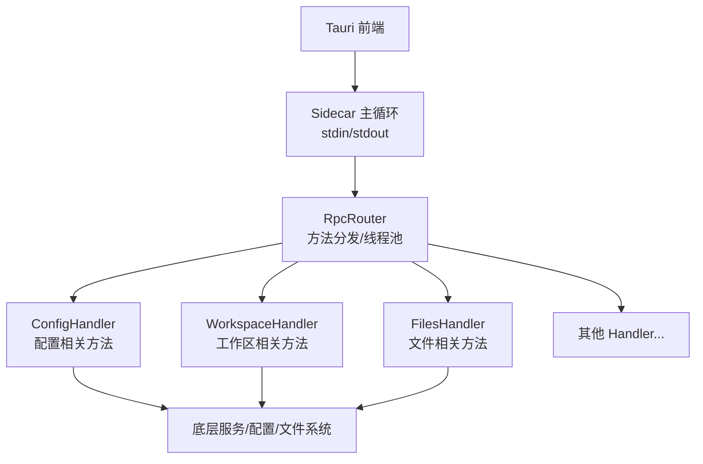
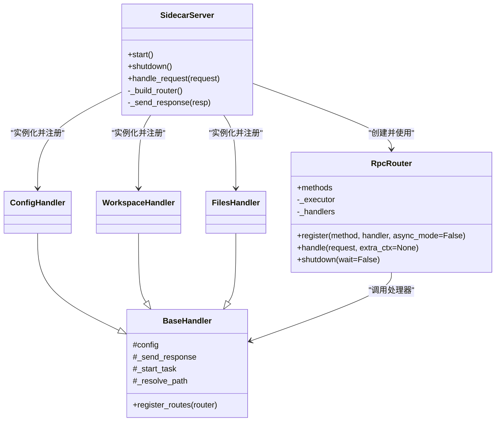

# RPC 协议规范

<cite>
**本文引用的文件**   
- [rpc_router.py](file://python/sidecar/rpc_router.py)
- [server.py](file://python/sidecar/server.py)
- [error_codes.py](file://utils/error_codes.py)
- [config_handler.py](file://python/sidecar/handlers/config_handler.py)
- [workspace_handler.py](file://python/sidecar/handlers/workspace_handler.py)
- [files_handler.py](file://python/sidecar/handlers/files_handler.py)
- [base.py](file://python/sidecar/handlers/base.py)
</cite>

## 目录
1. [简介](#简介)
2. [项目结构](#项目结构)
3. [核心组件](#核心组件)
4. [架构总览](#架构总览)
5. [详细组件分析](#详细组件分析)
6. [依赖关系分析](#依赖关系分析)
7. [性能考虑](#性能考虑)
8. [故障排查指南](#故障排查指南)
9. [结论](#结论)
10. [附录：协议示例与错误码清单](#附录协议示例与错误码清单)

## 简介
本规范定义 NoteAI 侧进程（Python Sidecar）通过标准输入/输出传输的轻量 JSON-RPC 协议。该协议用于 Tauri 前端与 Python 后端之间的方法调用、参数传递、结果返回与错误处理，并支持同步与异步处理器模式。文档涵盖请求/响应格式、路由注册机制、线程池与异步执行模型、错误码体系与安全脱敏策略，并提供完整示例。

## 项目结构
NoteAI 的 RPC 相关代码主要位于 sidecar 模块中，核心由“服务器主循环 + 路由器 + 处理器”组成：
- 服务器主循环负责从 stdin 读取 JSON 行、解析为请求对象、交由路由器处理，并将响应写回 stdout。
- 路由器维护方法名到处理器的映射，统一调度线程池执行，封装成功/失败响应。
- 处理器按功能域划分（配置、工作区、文件等），各自注册若干方法。



图表来源
- [server.py:570-595](file://python/sidecar/server.py#L570-L595)
- [rpc_router.py:43-106](file://python/sidecar/rpc_router.py#L43-L106)
- [config_handler.py:16-30](file://python/sidecar/handlers/config_handler.py#L16-L30)
- [workspace_handler.py:34-44](file://python/sidecar/handlers/workspace_handler.py#L34-L44)
- [files_handler.py:414-425](file://python/sidecar/handlers/files_handler.py#L414-L425)

章节来源
- [server.py:570-595](file://python/sidecar/server.py#L570-L595)
- [rpc_router.py:43-106](file://python/sidecar/rpc_router.py#L43-L106)

## 核心组件
- RpcRouter：JSON-RPC 路由器，负责方法注册、请求分发、异常捕获、线程池执行与响应封装。
- BaseHandler：处理器基类，提供对服务器上下文、配置、路径解析、任务调度等能力的统一访问。
- 各业务 Handler：如 ConfigHandler、WorkspaceHandler、FilesHandler，分别实现具体领域的方法。
- 错误体系：ErrorCode 枚举、make_error 构造器、NoteAIError 自定义异常。

章节来源
- [rpc_router.py:35-106](file://python/sidecar/rpc_router.py#L35-L106)
- [base.py:4-106](file://python/sidecar/handlers/base.py#L4-L106)
- [error_codes.py:14-120](file://utils/error_codes.py#L14-L120)

## 架构总览
RPC 请求在 Sidecar 中的端到端流程如下：

```mermaid
sequenceDiagram
participant FE as "前端"
participant IO as "Sidecar 主循环"
participant RT as "RpcRouter"
participant HP as "处理器(Handler)"
participant EX as "线程池"
participant OUT as "stdout"
FE->>IO : 发送一行 JSON 请求
IO->>IO : json.loads() 解析
IO->>RT : handle(request)
RT->>RT : 查找 method -> handler
alt 未找到方法
RT-->>OUT : {"id" : req_id, "error" : {code : "METHOD_NOT_FOUND", ...}}
else 已注册方法
RT->>EX : submit(_run)
EX->>HP : 调用 handler(params)
alt 正常返回
EX-->>RT : result
RT-->>OUT : {"id" : req_id, "result" : result}
alt 抛出 NoteAIError
EX-->>RT : NoteAIError
RT-->>OUT : {"id" : req_id, "error" : {code, message, details}}
alt 其他异常
EX-->>RT : Exception
RT-->>OUT : {"id" : req_id, "error" : {code : "INTERNAL_ERROR", ...}}
end
end
```

图表来源
- [server.py:570-595](file://python/sidecar/server.py#L570-L595)
- [rpc_router.py:54-94](file://python/sidecar/rpc_router.py#L54-L94)

## 详细组件分析

### 请求与响应数据格式
- 请求体（单行 JSON）
  - id: 字符串或数字，用于关联请求与响应
  - method: 字符串，方法名
  - params: 对象，方法参数（可为空对象）
- 成功响应
  - id: 与请求一致
  - result: 任意可序列化对象
- 错误响应
  - id: 与请求一致
  - error: 对象，包含 code、message，可选 details

说明
- 所有响应均为一行 JSON，以换行分隔。
- 当方法不存在时，路由器直接返回 METHOD_NOT_FOUND 错误。
- 处理器内部可通过 raise NoteAIError(...) 或 return make_error(...) 返回结构化错误。

章节来源
- [rpc_router.py:54-94](file://python/sidecar/rpc_router.py#L54-L94)
- [error_codes.py:82-97](file://utils/error_codes.py#L82-L97)

### 方法注册与路由机制
- 每个 Handler 在 register_routes(router) 中调用 router.register(method_name, handler_fn[, async_mode]) 完成注册。
- Router 内部维护字典 _handlers，handle(request) 根据 method 查找对应处理器。
- 所有处理器（无论同步或异步）均提交至线程池执行，避免阻塞 stdin 读取循环。

章节来源
- [config_handler.py:16-30](file://python/sidecar/handlers/config_handler.py#L16-L30)
- [workspace_handler.py:34-44](file://python/sidecar/handlers/workspace_handler.py#L34-L44)
- [files_handler.py:414-425](file://python/sidecar/handlers/files_handler.py#L414-L425)
- [rpc_router.py:43-83](file://python/sidecar/rpc_router.py#L43-L83)

### 线程池与异步处理模式
- 路由器使用 ThreadPoolExecutor(max_workers=8) 作为默认线程池大小。
- 所有处理器函数（包括同步与异步标记）均通过 executor.submit 提交执行。
- 服务器启动/关闭时会对相关线程池进行优雅关闭，避免资源泄漏。

章节来源
- [rpc_router.py:44-50](file://python/sidecar/rpc_router.py#L44-L50)
- [rpc_router.py:80-83](file://python/sidecar/rpc_router.py#L80-L83)
- [server.py:544-568](file://python/sidecar/server.py#L544-L568)

### 安全与路径脱敏
- 错误消息脱敏：路由器在捕获异常后，会将工作区路径与用户家目录替换为占位符，防止敏感路径泄露。
- 路径校验：处理器中对路径进行工作区内校验、保护目录拦截、非法字符检查等。
- 权限控制：当前实现未引入鉴权中间件；如需扩展，可在路由器层增加认证/授权钩子。

章节来源
- [rpc_router.py:14-32](file://python/sidecar/rpc_router.py#L14-L32)
- [files_handler.py:117-149](file://python/sidecar/handlers/files_handler.py#L117-L149)
- [files_handler.py:175-217](file://python/sidecar/handlers/files_handler.py#L175-L217)
- [workspace_handler.py:85-105](file://python/sidecar/handlers/workspace_handler.py#L85-L105)

### 处理器基类能力
BaseHandler 为各业务处理器提供统一的上下文访问与工具方法，包括：
- 配置访问：self.config
- 响应发送：_send_response、_send_progress、_send_job_update
- 任务调度：_start_task
- 路径解析：_resolve_path、_find_file_by_name
- 缓存与失效：_cached_or_compute、_invalidate_cache
- 工作区设置：_setup_workspace、_setup_watcher
- 级联更新与批量操作：_do_cascade_survey_update、_batch_auto_assign_topics
- 通用工具：frontmatter 解析、待处理主题持久化等

章节来源
- [base.py:4-106](file://python/sidecar/handlers/base.py#L4-L106)

## 依赖关系分析
- server.py 构建 SidecarServer，初始化各 Handler，并通过 _build_router 将方法注册到 RpcRouter。
- RpcRouter 依赖 utils.error_codes 提供的 ErrorCode、make_error、NoteAIError。
- 各 Handler 依赖 BaseHandler 提供的公共能力，以及各自的业务模块。



图表来源
- [server.py:54-125](file://python/sidecar/server.py#L54-L125)
- [rpc_router.py:35-106](file://python/sidecar/rpc_router.py#L35-L106)
- [base.py:4-106](file://python/sidecar/handlers/base.py#L4-L106)
- [config_handler.py:16-30](file://python/sidecar/handlers/config_handler.py#L16-L30)
- [workspace_handler.py:34-44](file://python/sidecar/handlers/workspace_handler.py#L34-L44)
- [files_handler.py:414-425](file://python/sidecar/handlers/files_handler.py#L414-L425)

章节来源
- [server.py:54-125](file://python/sidecar/server.py#L54-L125)
- [rpc_router.py:35-106](file://python/sidecar/rpc_router.py#L35-L106)
- [base.py:4-106](file://python/sidecar/handlers/base.py#L4-L106)

## 性能考虑
- 线程池上限：默认最大工作线程数为 8，适合 I/O 密集型与中等 CPU 负载场景。
- 非阻塞设计：所有处理器提交到线程池执行，确保 stdin 读取循环不被慢处理器阻塞。
- 缓存策略：服务器提供 TTL 缓存与变更失效机制，减少重复计算与 I/O。
- 深度限制：工作区树遍历限制递归深度，避免超大仓库导致的阻塞。
- 优雅关闭：shutdown 阶段关闭线程池与外部资源，避免残留任务影响退出。

章节来源
- [rpc_router.py:44-50](file://python/sidecar/rpc_router.py#L44-L50)
- [server.py:340-356](file://python/sidecar/server.py#L340-L356)
- [workspace_handler.py:200-247](file://python/sidecar/handlers/workspace_handler.py#L200-L247)
- [server.py:544-568](file://python/sidecar/server.py#L544-L568)

## 故障排查指南
- 常见错误类型
  - 方法不存在：METHOD_NOT_FOUND
  - 参数无效：INVALID_PARAMS
  - 内部错误：INTERNAL_ERROR
  - 未实现：NOT_IMPLEMENTED
  - 取消/超时：OPERATION_CANCELLED / TIMEOUT
- 定位步骤
  - 确认请求 JSON 是否合法（主循环会返回 Invalid JSON 错误）。
  - 检查 method 是否在对应 Handler 的 register_routes 中注册。
  - 查看处理器日志与 traceback（路由器记录错误堆栈）。
  - 关注错误消息是否被脱敏（路径将被替换为 <workspace>/<home>）。
- 恢复建议
  - 修复参数格式或补齐必填字段。
  - 安装缺失依赖或启用相应功能开关。
  - 重试或降级策略（例如 RAG 索引重建提示）。

章节来源
- [rpc_router.py:54-94](file://python/sidecar/rpc_router.py#L54-L94)
- [error_codes.py:14-80](file://utils/error_codes.py#L14-L80)
- [server.py:570-595](file://python/sidecar/server.py#L570-L595)

## 结论
NoteAI 的 JSON-RPC 协议采用极简的 stdin/stdout 传输方式，配合轻量路由器与线程池，实现了高内聚、低耦合的服务编排。通过统一的错误码体系与路径脱敏机制，既保证了可观测性与安全性，又便于前端进行国际化与用户体验优化。建议在后续版本中按需引入鉴权与速率限制，以满足更严格的安全需求。

## 附录：协议示例与错误码清单

### 请求与响应示例
- 成功响应
  - 请求：{"id":"1","method":"get_ui_config","params":{}}
  - 响应：{"id":"1","result":{"web_ai_assist":true,...}}
- 方法不存在
  - 响应：{"id":"1","error":{"code":"METHOD_NOT_FOUND","message":"Unknown method: xxx"}}
- 内部错误
  - 响应：{"id":"1","error":{"code":"INTERNAL_ERROR","message":"<workspace>/... 被脱敏后的信息"}}

章节来源
- [rpc_router.py:54-94](file://python/sidecar/rpc_router.py#L54-L94)
- [server.py:570-595](file://python/sidecar/server.py#L570-L595)

### 错误码定义体系
- 通用错误
  - OK、UNKNOWN_ERROR、INVALID_PARAMS、INTERNAL_ERROR、NOT_IMPLEMENTED、METHOD_NOT_FOUND、OPERATION_CANCELLED、TIMEOUT
- 路径与工作区
  - WORKSPACE_NOT_SET、WORKSPACE_NOT_FOUND、PATH_OUTSIDE_WORKSPACE、PATH_INVALID、PATH_CONTAINS_ILLEGAL_CHARS、FILE_NOT_FOUND、FILE_TOO_LARGE、FILE_READ_ONLY、DIRECTORY_PROTECTED
- 认证与凭据
  - API_KEY_MISSING、API_KEY_INVALID、API_CONNECTION_FAILED、CLOUD_AUTH_FAILED、CLOUD_NOT_CONNECTED
- RAG/索引
  - RAG_NOT_ENABLED、RAG_INDEX_EMPTY、RAG_INDEX_BUILDING、RAG_RETRIEVAL_FAILED、RAG_LLM_CALL_FAILED、RAG_RERANKER_UNAVAILABLE
- 特性可用性
  - FEATURE_NOT_INSTALLED、DEPENDENCY_MISSING、CLI_AGENT_NOT_FOUND、CLI_AGENT_EXEC_FAILED
- 模式/入库
  - SCHEMA_NOT_SETUP、SCHEMA_INVALID、INGEST_IN_PROGRESS、INGEST_FAILED、CONVERSION_FAILED
- 校验
  - PROMPT_EMPTY、PROMPT_TOO_LONG、PROMPT_INVALID、TOPIC_NOT_FOUND、TAG_INVALID
- 云同步
  - CLOUD_PROVIDER_UNKNOWN、CLOUD_SYNC_IN_PROGRESS、CLOUD_SYNC_FAILED
- UI/前端
  - NOT_RUNNING_IN_TAURI、WINDOW_OPERATION_FAILED

章节来源
- [error_codes.py:14-80](file://utils/error_codes.py#L14-L80)