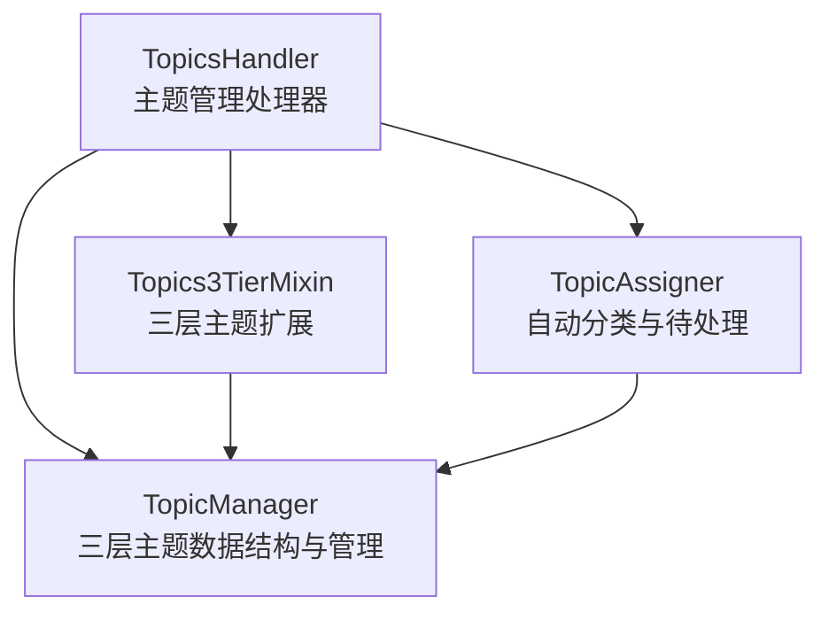
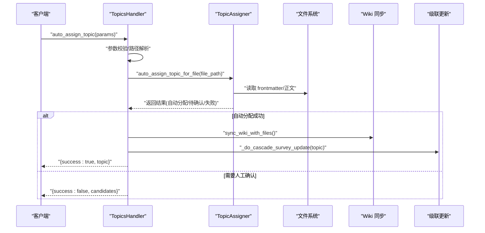
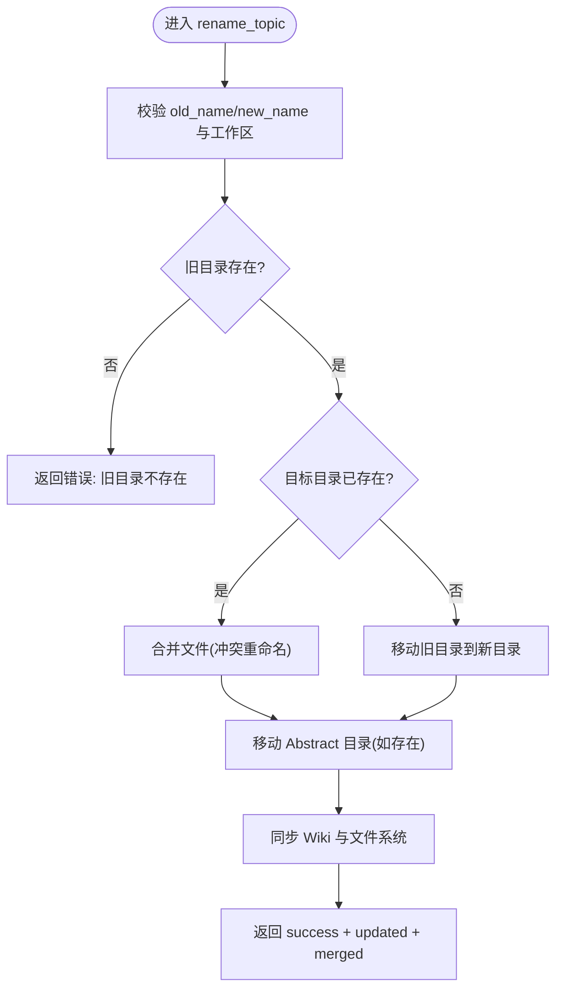
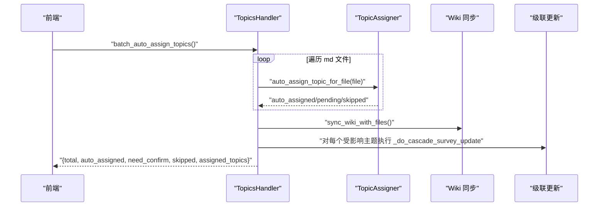
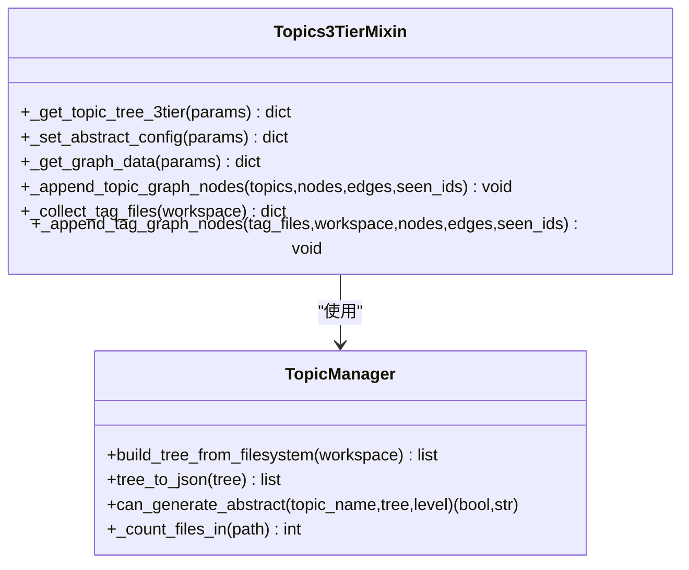
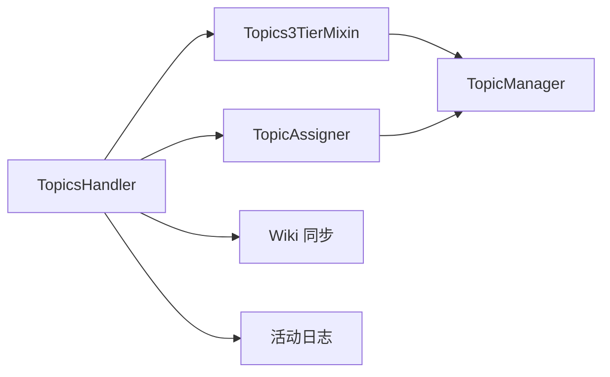

# 主题管理 API

<cite>
**本文引用的文件**   
- [topics_handler.py](file://python/sidecar/handlers/topics_handler.py)
- [topics_3tier_mixin.py](file://python/sidecar/mixins/topics_3tier_mixin.py)
- [topic_manager.py](file://utils/topic_manager.py)
- [topic_assigner.py](file://utils/topic_assigner.py)
</cite>

## 目录
1. [简介](#简介)
2. [项目结构](#项目结构)
3. [核心组件](#核心组件)
4. [架构总览](#架构总览)
5. [详细组件分析](#详细组件分析)
6. [依赖关系分析](#依赖关系分析)
7. [性能与扩展性](#性能与扩展性)
8. [故障排查指南](#故障排查指南)
9. [结论](#结论)
10. [附录：API 参考](#附录api-参考)

## 简介
本文件为“主题管理处理器（TopicsHandler）”的完整 API 文档，覆盖三级主题体系的所有操作方法，包括创建、移动、合并、拆分与层级调整；自动分类能力（基于内容分配、标签提取、知识图谱构建）；主题统计与分析接口（密度、关联度、热点）；导入导出与批量迁移；冲突检测与解决（重复识别与合并策略）；历史追踪与回滚；以及可视化数据接口与前端集成指引。

## 项目结构
- 处理器层
  - TopicsHandler：对外暴露的主题管理 RPC/HTTP 路由集合，封装业务编排与副作用（文件系统、Wiki、级联更新）。
  - Topics3TierMixin：三层主题系统扩展方法，提供树构建、图谱生成、安全删除等能力。
- 领域工具层
  - TopicManager：三层主题数据结构与管理（解析 frontmatter、构建嵌套树、路径映射、删除保护、综述控制、文件系统扫描）。
  - TopicAssigner：自动分类与待处理队列（从文件夹路径推断、LLM 建议、阈值判定、写入 frontmatter、移动文件、同步 Wiki）。

图表来源
- [topics_handler.py:40-568](file://python/sidecar/handlers/topics_handler.py#L40-L568)
- [topics_3tier_mixin.py:44-324](file://python/sidecar/mixins/topics_3tier_mixin.py#L44-L324)
- [topic_manager.py:32-485](file://utils/topic_manager.py#L32-L485)
- [topic_assigner.py:318-418](file://utils/topic_assigner.py#L318-L418)

章节来源
- [topics_handler.py:40-568](file://python/sidecar/handlers/topics_handler.py#L40-L568)
- [topics_3tier_mixin.py:44-324](file://python/sidecar/mixins/topics_3tier_mixin.py#L44-L324)
- [topic_manager.py:32-485](file://utils/topic_manager.py#L32-L485)
- [topic_assigner.py:318-418](file://utils/topic_assigner.py#L318-L418)

## 核心组件
- TopicsHandler
  - 负责注册所有主题相关路由，统一参数校验、错误处理、进度推送与异步任务调度。
  - 关键能力：创建/重命名/删除主题、文件归属变更、自动分配、批量分配、待处理列表、活动日志、Wiki 同步、综述开关与状态查询。
- Topics3TierMixin
  - 提供三层主题树构建、摘要（综述）配置、知识图谱节点与边生成、安全删除保护。
- TopicManager
  - 定义并维护三层主题模型，提供解析、构建、计数、序列化、删除保护与综述控制等方法。
- TopicAssigner
  - 实现自动分类流水线：从 Notes 目录推断、标题/标签启发式、LLM 建议、阈值判定、写入 frontmatter、移动文件、同步 Wiki、记录待处理项。

章节来源
- [topics_handler.py:40-568](file://python/sidecar/handlers/topics_handler.py#L40-L568)
- [topics_3tier_mixin.py:44-324](file://python/sidecar/mixins/topics_3tier_mixin.py#L44-L324)
- [topic_manager.py:32-485](file://utils/topic_manager.py#L32-L485)
- [topic_assigner.py:318-418](file://utils/topic_assigner.py#L318-L418)

## 架构总览
以下序列图展示“自动分配主题”的典型调用链：处理器接收请求 → 解析与校验 → 调用自动分类器 → 写入 frontmatter 并移动文件 → 同步 Wiki → 触发级联更新。

图表来源
- [topics_handler.py:71-94](file://python/sidecar/handlers/topics_handler.py#L71-L94)
- [topic_assigner.py:318-327](file://utils/topic_assigner.py#L318-L327)
- [topic_assigner.py:267-316](file://utils/topic_assigner.py#L267-L316)

## 详细组件分析

### 主题基础操作（创建/重命名/删除/移动）
- 创建主题
  - 路由：create_topic
  - 行为：校验主题名与工作区 → 创建 Wiki 条目 → 确保 Notes 目录存在 → 尝试将未标记文件自动分配到新主题 → 同步 Wiki → 返回消息与主题名。
- 重命名主题
  - 路由：rename_topic
  - 行为：校验旧/新名称 → 移动 Notes 目录（若目标存在则合并文件并重命名冲突）→ 移动 Abstract 目录 → 同步 Wiki → 返回是否合并及更新数量。
- 删除主题
  - 路由：delete_topic / delete_topic_safe
  - 行为：将主题下 .md 文件上移至 Notes 根目录（避免丢失）→ 删除主题目录与 Abstract 目录 → 同步 Wiki → 返回移动与更新数量。安全删除会先检查删除保护规则。
- 文件归属变更
  - 路由：move_file_to_topic / remove_file_from_topic / get_file_topics / get_topic_files
  - 行为：写入或移除 frontmatter 中的 topic 字段，必要时移动文件到 Notes 对应目录，并同步 Wiki。

图表来源
- [topics_handler.py:231-282](file://python/sidecar/handlers/topics_handler.py#L231-L282)
- [topics_handler.py:284-333](file://python/sidecar/handlers/topics_handler.py#L284-L333)
- [topics_3tier_mixin.py:288-315](file://python/sidecar/mixins/topics_3tier_mixin.py#L288-L315)

章节来源
- [topics_handler.py:182-229](file://python/sidecar/handlers/topics_handler.py#L182-L229)
- [topics_handler.py:231-282](file://python/sidecar/handlers/topics_handler.py#L231-L282)
- [topics_handler.py:284-333](file://python/sidecar/handlers/topics_handler.py#L284-L333)
- [topics_handler.py:339-426](file://python/sidecar/handlers/topics_handler.py#L339-L426)
- [topics_3tier_mixin.py:288-315](file://python/sidecar/mixins/topics_3tier_mixin.py#L288-L315)

### 自动分类与待处理流程
- 单文件自动分配
  - 路由：auto_assign_topic
  - 行为：校验路径 → 调用自动分类器 → 若自动分配成功则同步 Wiki 并触发级联更新；否则返回候选供人工确认。
- 批量自动分配
  - 路由：batch_auto_assign_topics
  - 行为：遍历工作区中符合条件的 Markdown 文件，逐个自动分配，统计总数、自动分配数、需确认数、跳过数，并汇总受影响主题以触发级联更新。
- 待处理列表
  - 路由：get_all_pending
  - 行为：收集待确认项与主题选项，返回清单与统计摘要。

图表来源
- [topics_handler.py:96-149](file://python/sidecar/handlers/topics_handler.py#L96-L149)
- [topic_assigner.py:318-327](file://utils/topic_assigner.py#L318-L327)

章节来源
- [topics_handler.py:71-94](file://python/sidecar/handlers/topics_handler.py#L71-L94)
- [topics_handler.py:96-149](file://python/sidecar/handlers/topics_handler.py#L96-L149)
- [topics_handler.py:445-461](file://python/sidecar/handlers/topics_handler.py#L445-L461)
- [topic_assigner.py:267-316](file://utils/topic_assigner.py#L267-L316)

### 知识图谱与可视化数据接口
- 获取知识图谱数据
  - 路由：get_graph_data
  - 行为：支持 filter=topic|tag|all 或 chunk 模式；topic/tag 模式下分别追加主题节点与标签节点，并建立与文件的边；chunk 模式通过相似度视图返回。
- 主题树与摘要状态
  - 路由：get_topic_tree_3tier
  - 行为：从文件系统构建三层主题树，补充摘要开关与文件计数，并附带待处理列表。
- 摘要配置
  - 路由：set_abstract_config
  - 行为：仅二级主题可开启/关闭综述，内部校验一级与二级互斥、三级不支持等规则。

图表来源
- [topics_3tier_mixin.py:50-86](file://python/sidecar/mixins/topics_3tier_mixin.py#L50-L86)
- [topics_3tier_mixin.py:126-153](file://python/sidecar/mixins/topics_3tier_mixin.py#L126-L153)
- [topics_3tier_mixin.py:256-286](file://python/sidecar/mixins/topics_3tier_mixin.py#L256-L286)
- [topic_manager.py:377-426](file://utils/topic_manager.py#L377-L426)
- [topic_manager.py:447-484](file://utils/topic_manager.py#L447-L484)
- [topic_manager.py:291-345](file://utils/topic_manager.py#L291-L345)

章节来源
- [topics_3tier_mixin.py:50-86](file://python/sidecar/mixins/topics_3tier_mixin.py#L50-L86)
- [topics_3tier_mixin.py:126-153](file://python/sidecar/mixins/topics_3tier_mixin.py#L126-L153)
- [topics_3tier_mixin.py:256-286](file://python/sidecar/mixins/topics_3tier_mixin.py#L256-L286)
- [topic_manager.py:377-426](file://utils/topic_manager.py#L377-L426)
- [topic_manager.py:447-484](file://utils/topic_manager.py#L447-L484)
- [topic_manager.py:291-345](file://utils/topic_manager.py#L291-L345)

### 主题统计与分析接口
- 主题文件计数与树信息
  - 数据来源：TopicManager.build_tree_from_filesystem 会为每个主题节点填充 file_count、path、has_abstract、abstract_file 等元信息。
  - 前端可通过 get_topic_tree_3tier 获取树与统计，用于计算主题密度（文件数/主题规模）、发现热点（高 file_count 节点）。
- 标签关联度
  - 数据来源：_collect_tag_files 扫描全工作区 Markdown 的 tags 字段，构建 tag→files 映射；_append_tag_graph_nodes 生成标签与文件边。
  - 前端可据此计算标签共现、主题-标签关联强度。
- 热点发现
  - 结合 file_count 与标签频次，前端可进行简单排序与筛选，定位热点主题与标签。

章节来源
- [topic_manager.py:377-426](file://utils/topic_manager.py#L377-L426)
- [topics_3tier_mixin.py:200-238](file://python/sidecar/mixins/topics_3tier_mixin.py#L200-L238)
- [topics_3tier_mixin.py:240-255](file://python/sidecar/mixins/topics_3tier_mixin.py#L240-L255)

### 主题导入导出与批量迁移
- 导入/对齐
  - 路由：apply_topic_placement_threshold
  - 行为：根据放置策略自动移动错位笔记到正确主题目录，并触发受影响的级联更新。
- 导出/迁移
  - 路由：get_topic_files
  - 行为：列出某主题下的所有 Markdown 相对路径，便于前端导出或批量迁移。
- 批量自动分配
  - 路由：batch_auto_assign_topics
  - 行为：对 Inbox/孤儿文件进行批量自动分配，输出统计与受影响主题列表。

章节来源
- [topics_handler.py:518-535](file://python/sidecar/handlers/topics_handler.py#L518-L535)
- [topics_handler.py:359-383](file://python/sidecar/handlers/topics_handler.py#L359-L383)
- [topics_handler.py:96-149](file://python/sidecar/handlers/topics_handler.py#L96-L149)

### 冲突检测与解决机制
- 重复主题识别与合并
  - 路由：merge_duplicate_topics
  - 行为：合并 Wiki 中的重复主题并去重文件，返回合并主题数与去重文件数。
- 删除保护
  - 路由：delete_topic_safe
  - 行为：在删除前检查主题层级与子项，防止误删（例如一级标题仍有二级标题时禁止删除）。

章节来源
- [topics_handler.py:541-544](file://python/sidecar/handlers/topics_handler.py#L541-L544)
- [topics_3tier_mixin.py:288-315](file://python/sidecar/mixins/topics_3tier_mixin.py#L288-L315)

### 主题历史追踪与回滚
- 活动日志
  - 路由：get_activity_log
  - 行为：返回最近的活动条目（限制条数），可用于审计与回溯。
- 变更记录
  - 行为：创建主题等操作会追加变更日志（changelog），便于后续审计。

章节来源
- [topics_handler.py:537-539](file://python/sidecar/handlers/topics_handler.py#L537-L539)
- [topics_handler.py:203-206](file://python/sidecar/handlers/topics_handler.py#L203-L206)

### 综述（摘要）管理与级联更新
- 综述开关
  - 路由：toggle_survey / set_abstract_config / get_survey_status
  - 行为：切换指定主题的综述开关；设置时校验一级/二级互斥与三级不支持；查询当前综述状态。
- 级联更新
  - 行为：当主题被创建、移动或确认时，触发级联更新任务，刷新相关综述与索引。

章节来源
- [topics_handler.py:579-587](file://python/sidecar/handlers/topics_handler.py#L579-L587)
- [topics_3tier_mixin.py:126-153](file://python/sidecar/mixins/topics_3tier_mixin.py#L126-L153)
- [topics_handler.py:428-431](file://python/sidecar/handlers/topics_handler.py#L428-L431)

## 依赖关系分析
- 组件耦合
  - TopicsHandler 依赖 Topics3TierMixin 与 TopicAssigner，间接依赖 TopicManager 与 Wiki 工具。
  - Topics3TierMixin 直接依赖 TopicManager 进行树构建与校验。
  - TopicAssigner 依赖 TopicManager 与 Wiki 同步模块完成写入与移动。
- 外部依赖点
  - 文件系统（Notes/、Abstract/、wiki/）
  - 配置常量（TOPIC_SEP、NOTES_FOLDER、ABSTRACT_FOLDER）
  - LLM 服务（可选，用于主题建议）
  - 活动日志与事件通道（用于审计与前端通知）

图表来源
- [topics_handler.py:40-568](file://python/sidecar/handlers/topics_handler.py#L40-L568)
- [topics_3tier_mixin.py:44-324](file://python/sidecar/mixins/topics_3tier_mixin.py#L44-L324)
- [topic_assigner.py:318-418](file://utils/topic_assigner.py#L318-L418)
- [topic_manager.py:32-485](file://utils/topic_manager.py#L32-L485)

章节来源
- [topics_handler.py:40-568](file://python/sidecar/handlers/topics_handler.py#L40-L568)
- [topics_3tier_mixin.py:44-324](file://python/sidecar/mixins/topics_3tier_mixin.py#L44-L324)
- [topic_assigner.py:318-418](file://utils/topic_assigner.py#L318-L418)
- [topic_manager.py:32-485](file://utils/topic_manager.py#L32-L485)

## 性能与扩展性
- 批量处理
  - 批量自动分配采用分片进度上报，适合大规模文件处理；建议在大批量场景下启用后台任务与进度轮询。
- 文件系统 I/O
  - 大量文件扫描与移动可能产生 I/O 压力，建议在高并发场景下考虑限流与重试策略。
- 可扩展点
  - 自动分类器可替换为更复杂的匹配策略或向量检索；图谱视图支持 chunk 模式，便于引入相似度网络分析。

[本节为通用指导，不直接分析具体文件]

## 故障排查指南
- 常见错误
  - 路径无效/文件不存在：检查工作区路径与相对路径是否正确。
  - 主题名非法/未设置工作区：确认配置与工作区初始化。
  - 删除保护失败：检查是否存在子主题或违反删除规则。
- 诊断手段
  - 使用 get_activity_log 查看最近操作记录。
  - 使用 get_all_pending 查看待确认项与候选主题。
  - 使用 sync_wiki_with_files 修复文件系统与 Wiki 不一致。

章节来源
- [topics_handler.py:537-539](file://python/sidecar/handlers/topics_handler.py#L537-L539)
- [topics_handler.py:445-461](file://python/sidecar/handlers/topics_handler.py#L445-L461)
- [topics_handler.py:569-577](file://python/sidecar/handlers/topics_handler.py#L569-L577)

## 结论
TopicsHandler 提供了完整的三级主题管理能力，涵盖 CRUD、自动分类、图谱可视化、统计分析与冲突处理，并通过活动日志与级联更新保障一致性与可追溯性。配合 TopicManager 与 TopicAssigner，系统具备良好的扩展性与可维护性。

[本节为总结，不直接分析具体文件]

## 附录：API 参考
以下为 TopicsHandler 注册的路由与其职责说明（按功能分组）：

- 主题树与概览
  - get_topic_tree_3tier：返回三层主题树、摘要状态与待处理列表。
  - get_all_topic_names：返回所有主题名称列表。
  - get_survey_status：返回各主题综述状态。
- 主题生命周期
  - create_topic：创建主题（含自动分配与 Wiki 同步）。
  - rename_topic：重命名主题（支持合并同名目录）。
  - delete_topic / delete_topic_safe：删除主题（含删除保护）。
- 文件归属与移动
  - move_file_to_topic：将文件移动到指定主题目录并更新 frontmatter。
  - remove_file_from_topic：从主题中移除文件（清理 frontmatter 并上移）。
  - get_file_topics：读取文件的主题。
  - get_topic_files：列出某主题下的所有文件。
- 自动分类与待处理
  - auto_assign_topic：单文件自动分配。
  - batch_auto_assign_topics：批量自动分配。
  - get_all_pending：获取待处理项与主题选项。
  - resolve_topic：确认待处理项的主题并落盘。
  - keep_note_in_topic：保持笔记在当前主题（依据策略）。
  - apply_topic_placement_threshold：应用放置阈值，自动纠正错位笔记。
- 知识图谱与可视化
  - get_graph_data：获取主题/标签/块粒度的图谱数据。
- 综述管理
  - toggle_survey：切换主题综述开关。
  - set_abstract_config：设置二级主题综述开关（含校验）。
- 一致性修复与审计
  - sync_wiki_with_files：同步 Wiki 与文件系统。
  - merge_duplicate_topics：合并重复主题与去重文件。
  - fix_survey_topics：修复综述与文件系统不一致。
  - get_activity_log：获取活动日志。

章节来源
- [topics_handler.py:546-568](file://python/sidecar/handlers/topics_handler.py#L546-L568)
- [topics_3tier_mixin.py:317-323](file://python/sidecar/mixins/topics_3tier_mixin.py#L317-L323)