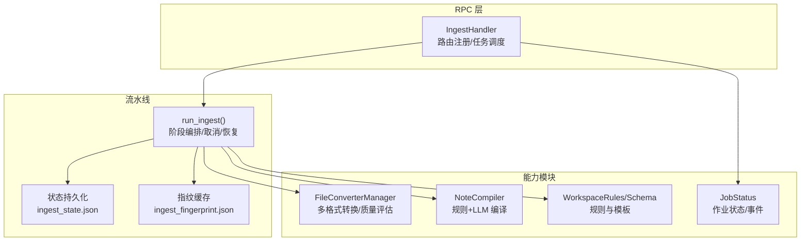
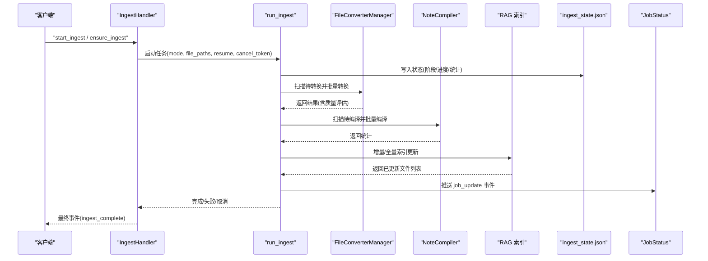
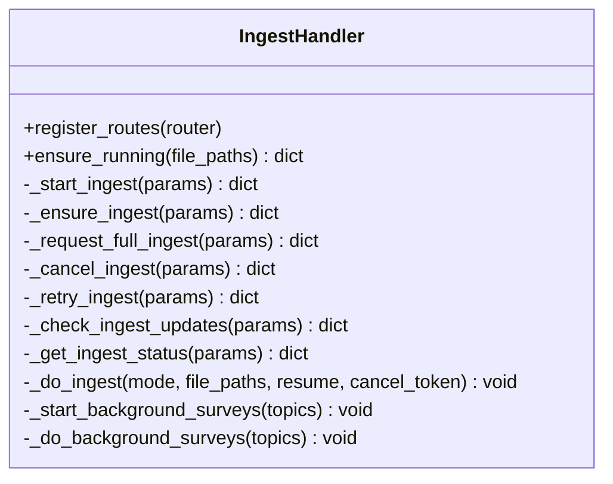
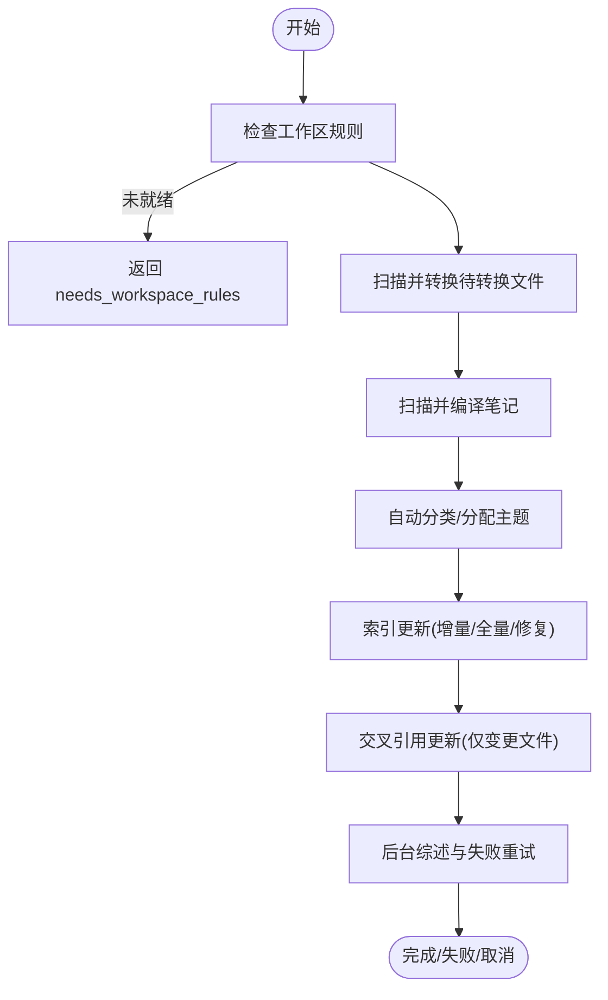
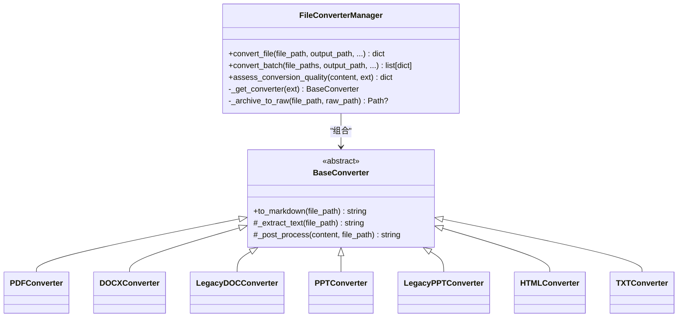
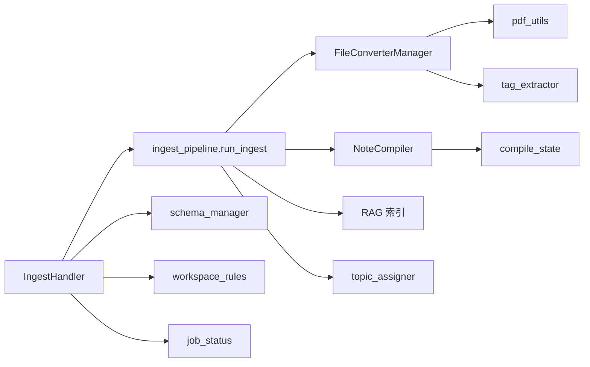

# 入库处理 API

<cite>
**本文引用的文件**   
- [ingest_handler.py](file://python/sidecar/handlers/ingest_handler.py)
- [ingest_pipeline.py](file://python/sidecar/ingest_pipeline.py)
- [job_status.py](file://python/sidecar/job_status.py)
- [conversion_state.py](file://python/sidecar/conversion_state.py)
- [workspace_rules.py](file://python/sidecar/workspace_rules.py)
- [schema_manager.py](file://python/sidecar/schema_manager.py)
- [file_converter.py](file://modules/file_converter.py)
- [note_compiler.py](file://utils/note_compiler.py)
- [test_ingest_handler.py](file://tests/unit/test_ingest_handler.py)
- [test_ingest_pipeline.py](file://tests/integration/test_ingest_pipeline.py)
</cite>

## 目录
1. [简介](#简介)
2. [项目结构](#项目结构)
3. [核心组件](#核心组件)
4. [架构总览](#架构总览)
5. [详细组件分析](#详细组件分析)
6. [依赖关系分析](#依赖关系分析)
7. [性能考虑](#性能考虑)
8. [故障排除指南](#故障排除指南)
9. [结论](#结论)
10. [附录：API 参考](#附录api-参考)

## 简介
本文件为“入库处理处理器（IngestHandler）”的完整 API 文档，覆盖自动化入库流水线的所有接口与行为。内容包含：
- 文件导入、格式转换、内容编译、分类与索引更新
- 批量处理与并发控制、进度跟踪与事件推送
- 任务状态管理（作业队列、执行状态、失败重试）
- 入库规则配置（工作区 Schema、整理规则、输出格式）
- 入库质量检查（内容完整性与格式合规性）
- 性能优化建议（批大小、内存、索引修复）
- 日志分析与故障排除

## 项目结构
入库相关代码主要分布在 sidecar 层与工具模块中：
- RPC 处理器：负责暴露 API、调度后台任务、推送进度事件
- 入库流水线：编排各阶段（规则→转换→编译→分类→索引→交叉引用→级联→同步）
- 作业状态：内存中的作业注册表，用于前端展示与查询
- 转换与编译：文件到 Markdown 的转换、规则清理与可选 LLM 重写
- 工作区规则与 Schema：定义主题深度、综述策略、AI 可写范围等
- 转换去重状态：基于源文件哈希避免重复转换

图表来源
- [ingest_handler.py:32-49](file://python/sidecar/handlers/ingest_handler.py#L32-L49)
- [ingest_pipeline.py:480-566](file://python/sidecar/ingest_pipeline.py#L480-L566)
- [file_converter.py:407-534](file://modules/file_converter.py#L407-L534)
- [note_compiler.py:128-238](file://utils/note_compiler.py#L128-L238)
- [workspace_rules.py:59-96](file://python/sidecar/workspace_rules.py#L59-L96)
- [schema_manager.py:94-123](file://python/sidecar/schema_manager.py#L94-L123)
- [job_status.py:35-92](file://python/sidecar/job_status.py#L35-L92)

章节来源
- [ingest_handler.py:32-49](file://python/sidecar/handlers/ingest_handler.py#L32-L49)
- [ingest_pipeline.py:480-566](file://python/sidecar/ingest_pipeline.py#L480-L566)

## 核心组件
- IngestHandler：注册 RPC 路由，启动/取消/重试入库任务，发送进度事件，触发后台综述
- run_ingest：统一入口，按阶段推进，支持增量/全量、断点续跑、取消信号
- FileConverterManager：多格式转 Markdown，内置质量评估与可选 LLM 重写
- NoteCompiler：对已转换笔记进行规则清理与可选 LLM 重写
- WorkspaceRules/Schema：工作区组织规则与模板，驱动分类与综述策略
- JobStatus：内存作业注册表，提供 start/update/complete/fail/cancel/list/get
- ConversionState：基于源文件 SHA256 的去重记录，避免重复转换

章节来源
- [ingest_handler.py:132-151](file://python/sidecar/handlers/ingest_handler.py#L132-L151)
- [ingest_pipeline.py:480-566](file://python/sidecar/ingest_pipeline.py#L480-L566)
- [file_converter.py:569-730](file://modules/file_converter.py#L569-L730)
- [note_compiler.py:128-238](file://utils/note_compiler.py#L128-L238)
- [workspace_rules.py:59-96](file://python/sidecar/workspace_rules.py#L59-L96)
- [schema_manager.py:94-123](file://python/sidecar/schema_manager.py#L94-L123)
- [job_status.py:35-92](file://python/sidecar/job_status.py#L35-L92)
- [conversion_state.py:65-109](file://python/sidecar/conversion_state.py#L65-L109)

## 架构总览
入库流程由 IngestHandler 接收请求后，通过 run_ingest 编排各阶段，期间持续写入 ingest_state.json 并推送 job_update 事件。转换与编译分别调用 FileConverterManager 与 NoteCompiler；索引阶段使用 RAG 索引器；完成后触发后台综述任务。

图表来源
- [ingest_handler.py:152-215](file://python/sidecar/handlers/ingest_handler.py#L152-L215)
- [ingest_pipeline.py:480-800](file://python/sidecar/ingest_pipeline.py#L480-L800)
- [file_converter.py:732-770](file://modules/file_converter.py#L732-L770)
- [note_compiler.py:213-238](file://utils/note_compiler.py#L213-L238)
- [job_status.py:67-92](file://python/sidecar/job_status.py#L67-L92)

## 详细组件分析

### IngestHandler（RPC 处理器）
职责
- 注册路由：确保 schema、获取/保存 schema 与规则、启动/取消/重试入库、查询状态与更新检测
- 任务调度：封装 _do_ingest，统一进度上报与异常处理
- 后台综述：在入库成功后，根据受影响主题发起 cascade 综述任务

关键方法
- ensure_running(file_paths=None)：自动判断是否需要启动入库（增量/全量/跳过）
- _start_ingest(params)：显式启动入库（mode=full/incremental）
- _ensure_ingest(params)：便捷入口，内部委托 ensure_running
- _request_full_ingest()：标记下次自动入库为全量
- _cancel_ingest()：请求取消当前运行任务
- _retry_ingest(params)：失败/取消时续跑，保留已完成阶段
- _check_ingest_updates(params)：检测是否有可整理的更新
- _get_ingest_status()：读取持久化状态并标准化返回

事件与状态
- 进度事件：type="ingest_progress"，携带 stage、progress、message、extra
- 完成事件：type="ingest_complete"，success/up_to_date/message
- 后台综述事件：type="ingest_cascade_started"/"ingest_cascade_complete"

图表来源
- [ingest_handler.py:32-49](file://python/sidecar/handlers/ingest_handler.py#L32-L49)
- [ingest_handler.py:132-151](file://python/sidecar/handlers/ingest_handler.py#L132-L151)
- [ingest_handler.py:152-215](file://python/sidecar/handlers/ingest_handler.py#L152-L215)
- [ingest_handler.py:301-351](file://python/sidecar/handlers/ingest_handler.py#L301-L351)

章节来源
- [ingest_handler.py:32-49](file://python/sidecar/handlers/ingest_handler.py#L32-L49)
- [ingest_handler.py:132-151](file://python/sidecar/handlers/ingest_handler.py#L132-L151)
- [ingest_handler.py:152-215](file://python/sidecar/handlers/ingest_handler.py#L152-L215)
- [ingest_handler.py:301-351](file://python/sidecar/handlers/ingest_handler.py#L301-L351)

### 入库流水线（run_ingest）
阶段顺序
- rules：校验工作区规则是否就绪
- convert：扫描并批量转换待转换文件
- compile：对已转换或需要编译的笔记进行规则清理与可选 LLM 重写
- classify：自动分配主题，收集受影响主题集合
- index：增量/全量向量索引更新，必要时整库修复
- crossref：仅对实际变更的文件进行交叉引用更新
- cascade：后台综述生成与失败重试
- lint/sync：后续一致性检查与 WIKI 同步（由上层编排）

特性
- 增量模式：基于指纹与 mtime/size 快速判断是否需要处理
- 断点续跑：resume=true 时恢复 completed_stages 与中间变量
- 取消机制：全局取消事件与 generation 计数，保证安全退出
- 幂等与原子写入：状态与指纹文件采用原子替换，避免损坏

图表来源
- [ingest_pipeline.py:480-800](file://python/sidecar/ingest_pipeline.py#L480-L800)

章节来源
- [ingest_pipeline.py:480-800](file://python/sidecar/ingest_pipeline.py#L480-L800)

### 文件转换（FileConverterManager）
功能
- 支持 PDF、DOCX、旧版 DOC、PPT/PPTX、HTML、TXT 等格式
- 统一 to_markdown 流程：提取文本 → 后处理（清理/去签名/去图片）
- 质量评估 assess_conversion_quality：检测正文长度、乱码比例、疑似扫描 PDF
- 可选 LLM 重写：当内容结构不佳且长度受限时尝试改写
- 批量转换 convert_batch：带进度回调与失败记录

输出
- 成功：output_path、tags、source_sha256、archived_source（归档至 Raw）
- 失败：error 信息（如不支持格式、质量不达标、归档失败）

图表来源
- [file_converter.py:27-69](file://modules/file_converter.py#L27-L69)
- [file_converter.py:72-158](file://modules/file_converter.py#L72-L158)
- [file_converter.py:168-252](file://modules/file_converter.py#L168-L252)
- [file_converter.py:254-388](file://modules/file_converter.py#L254-L388)
- [file_converter.py:390-405](file://modules/file_converter.py#L390-L405)
- [file_converter.py:407-534](file://modules/file_converter.py#L407-L534)
- [file_converter.py:569-730](file://modules/file_converter.py#L569-L730)
- [file_converter.py:732-770](file://modules/file_converter.py#L732-L770)

章节来源
- [file_converter.py:407-534](file://modules/file_converter.py#L407-L534)
- [file_converter.py:569-730](file://modules/file_converter.py#L569-L730)
- [file_converter.py:732-770](file://modules/file_converter.py#L732-L770)

### 内容编译（NoteCompiler）
功能
- 规则清理 rule_clean_markdown：去除页眉页脚、重复分隔线、短行重复等
- 决策 should_compile_file：若 source 来自可转换格式则需编译
- 单篇编译 compile_note_file：规则清理 + 可选 LLM 重写，保持 frontmatter
- 批量编译 compile_notes_batch：带进度回调，返回统计与变更路径

章节来源
- [note_compiler.py:43-81](file://utils/note_compiler.py#L43-L81)
- [note_compiler.py:90-126](file://utils/note_compiler.py#L90-L126)
- [note_compiler.py:128-238](file://utils/note_compiler.py#L128-L238)

### 工作区规则与 Schema
- workspace_rules.json：max_topic_depth、auto_update_survey、survey_at_level、ai_may_edit_wiki/notes、configured
- schema.md：版本标记与配置标记，供解析与提示上下文
- 迁移：从旧 SCHEMA.md 迁移到 workspace_rules.json

章节来源
- [workspace_rules.py:15-22](file://python/sidecar/workspace_rules.py#L15-L22)
- [workspace_rules.py:59-96](file://python/sidecar/workspace_rules.py#L59-L96)
- [schema_manager.py:13-20](file://python/sidecar/schema_manager.py#L13-20)
- [schema_manager.py:94-123](file://python/sidecar/schema_manager.py#L94-L123)

### 作业状态（JobStatus）
- start_job/update_job/complete_job/fail_job/cancel_job：线程安全的内存注册表
- get_job/list_jobs：查询单个/最近作业列表
- 事件推送：job_update 类型事件，便于前端实时刷新

章节来源
- [job_status.py:35-92](file://python/sidecar/job_status.py#L35-L92)
- [job_status.py:95-165](file://python/sidecar/job_status.py#L95-L165)
- [job_status.py:168-189](file://python/sidecar/job_status.py#L168-L189)

### 转换去重状态（ConversionState）
- 基于源文件 SHA256 查找已有转换结果，避免重复转换
- 记录转换映射，支持跨会话幂等

章节来源
- [conversion_state.py:18-23](file://python/sidecar/conversion_state.py#L18-L23)
- [conversion_state.py:65-109](file://python/sidecar/conversion_state.py#L65-L109)

## 依赖关系分析
- IngestHandler 依赖 ingest_pipeline、schema_manager、workspace_rules、job_status
- ingest_pipeline 依赖 modules.file_converter、utils.note_compiler、sidecar.rag.*、utils.topic_assigner
- FileConverterManager 依赖 utils.pdf_utils、utils.tag_extractor、utils.helpers
- NoteCompiler 依赖 sidecar.compile_state、utils.llm_utils（可选）

图表来源
- [ingest_handler.py:32-49](file://python/sidecar/handlers/ingest_handler.py#L32-L49)
- [ingest_pipeline.py:480-566](file://python/sidecar/ingest_pipeline.py#L480-L566)
- [file_converter.py:407-534](file://modules/file_converter.py#L407-L534)
- [note_compiler.py:128-238](file://utils/note_compiler.py#L128-L238)

章节来源
- [ingest_handler.py:32-49](file://python/sidecar/handlers/ingest_handler.py#L32-L49)
- [ingest_pipeline.py:480-566](file://python/sidecar/ingest_pipeline.py#L480-L566)

## 性能考虑
- 增量优先：默认使用增量模式，结合指纹与 mtime/size 快速判断，减少不必要扫描
- 索引修复：当索引块数量不一致时自动整库修复，保障数据一致性
- 取消安全：在索引准备阶段允许丢弃已计算嵌入，避免部分写入导致的状态不一致
- 并发控制：索引操作使用锁，防止多实例同时修改索引
- 批处理：转换与编译均支持批量接口与进度回调，适合大文件集处理
- 内存管理：避免一次性加载超大文件，分块读取与流式处理（转换器基类）

章节来源
- [ingest_pipeline.py:93-104](file://python/sidecar/ingest_pipeline.py#L93-L104)
- [ingest_pipeline.py:350-461](file://python/sidecar/ingest_pipeline.py#L350-L461)
- [file_converter.py:407-534](file://modules/file_converter.py#L407-L534)

## 故障排除指南
常见问题
- 未设置工作区：所有接口会返回 success=False 并提示先设置工作区
- 工作区规则未配置：返回 needs_workspace_rules=True，需在设置向导中完成配置
- 索引不可用：提示关闭其他 NoteAI 实例后重试（索引被占用）
- 转换质量不达标：返回 issues（如正文过短、疑似乱码、扫描 PDF），需人工干预或更换源文件
- 取消/失败：可通过 _retry_ingest 续跑，resume=true 将恢复已完成阶段

定位手段
- 查看 _get_ingest_status 返回的 status、stage、progress、stats、can_retry
- 监听 job_update 事件，观察作业状态与错误信息
- 检查 ingest_state.json 与 conversion_state.json 的持久化状态
- 查看日志中 [ingest] 与 [note_compiler] 前缀的警告/错误

章节来源
- [ingest_handler.py:337-351](file://python/sidecar/handlers/ingest_handler.py#L337-L351)
- [ingest_pipeline.py:167-178](file://python/sidecar/ingest_pipeline.py#L167-L178)
- [file_converter.py:510-534](file://modules/file_converter.py#L510-L534)

## 结论
IngestHandler 提供了完整的入库 API，覆盖从文件导入到索引更新的端到端流程。系统具备增量优化、断点续跑、取消安全、质量检查与后台综述等能力，适合大规模知识库的自动化维护。配合作业状态与事件推送，可实现良好的用户体验与可观测性。

## 附录：API 参考

### 路由与方法一览
- ensure_schema：确保 schema.md 存在（兼容旧名）
- get_schema：获取 schema.md 内容
- save_schema：保存 schema.md 内容（自动追加版本/配置标记）
- get_schema_rules：获取工作区规则
- get_schema_options：获取规则选项（主题深度、综述策略等）
- save_schema_options：保存规则选项
- needs_schema_setup：是否需要初始化 schema
- get_schema_template：获取内置模板
- start_ingest：启动入库（mode=full/incremental，file_paths，resume）
- ensure_ingest：自动判断并启动入库
- request_full_ingest：标记下次自动入库为全量
- cancel_ingest：请求取消当前入库
- retry_ingest：失败/取消时续跑（resume=true）
- check_ingest_updates：检测是否有可整理的更新
- get_ingest_status：获取入库状态与统计

参数与返回值要点
- mode：full 或 incremental
- file_paths：相对工作区的文件路径列表（Notes/...）
- resume：是否续跑
- 返回字段：success、started、mode、resume、message、has_updates、action、reason、status、stage、progress、stats、running、needs_resume、can_retry

事件类型
- ingest_progress：stage、progress、message、extra（可能包含 stats、background）
- ingest_complete：success、up_to_date、message、error
- ingest_cascade_started：topics
- ingest_cascade_complete：success、updated、failed

章节来源
- [ingest_handler.py:32-49](file://python/sidecar/handlers/ingest_handler.py#L32-L49)
- [ingest_handler.py:132-151](file://python/sidecar/handlers/ingest_handler.py#L132-L151)
- [ingest_handler.py:152-215](file://python/sidecar/handlers/ingest_handler.py#L152-L215)
- [ingest_handler.py:301-351](file://python/sidecar/handlers/ingest_handler.py#L301-L351)

### 质量检查与合规性
- assess_conversion_quality：返回 acceptable、characters、suspicious_ratio、suspected_scanned_pdf、issues
- 规则清理：rule_clean_markdown 去除页眉页脚与重复行
- 编译决策：should_compile_file 基于 source 扩展名决定是否需要编译

章节来源
- [file_converter.py:510-534](file://modules/file_converter.py#L510-L534)
- [note_compiler.py:43-81](file://utils/note_compiler.py#L43-L81)
- [note_compiler.py:90-126](file://utils/note_compiler.py#L90-L126)

### 测试用例参考
- 单元测试验证状态、规则配置、自动入库开关、更新检测、续跑逻辑
- 集成测试覆盖状态持久化、取消/清除、工作区规则、转换与分类、级联与同步

章节来源
- [test_ingest_handler.py:31-115](file://tests/unit/test_ingest_handler.py#L31-L115)
- [test_ingest_pipeline.py:28-125](file://tests/integration/test_ingest_pipeline.py#L28-L125)