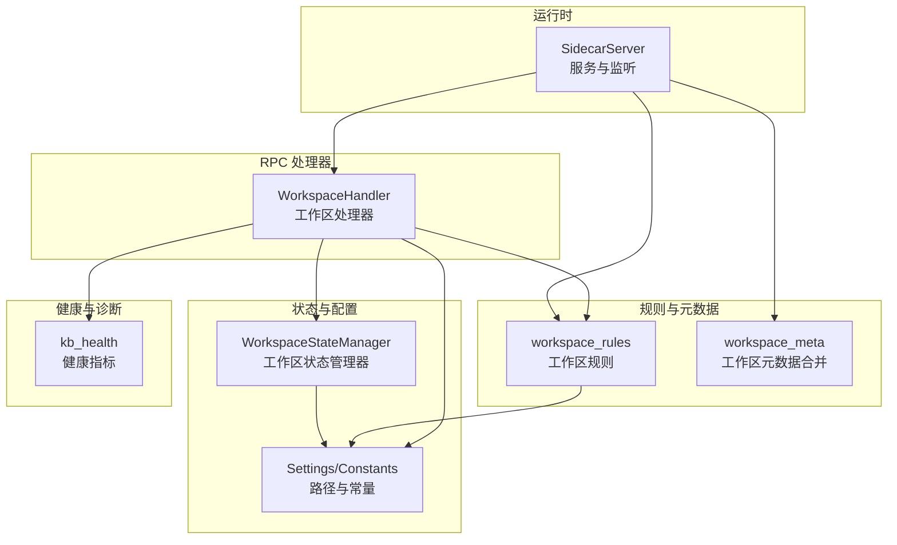
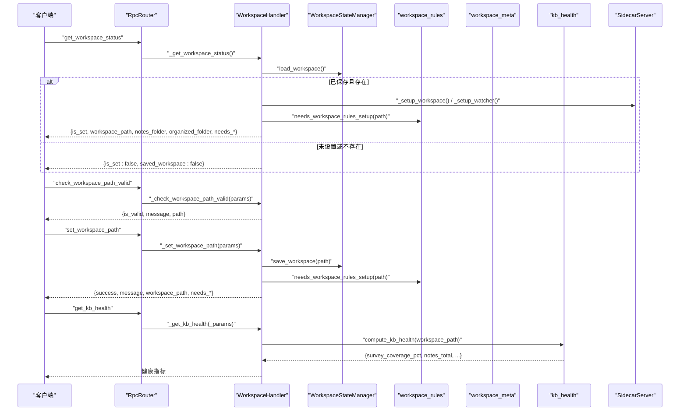
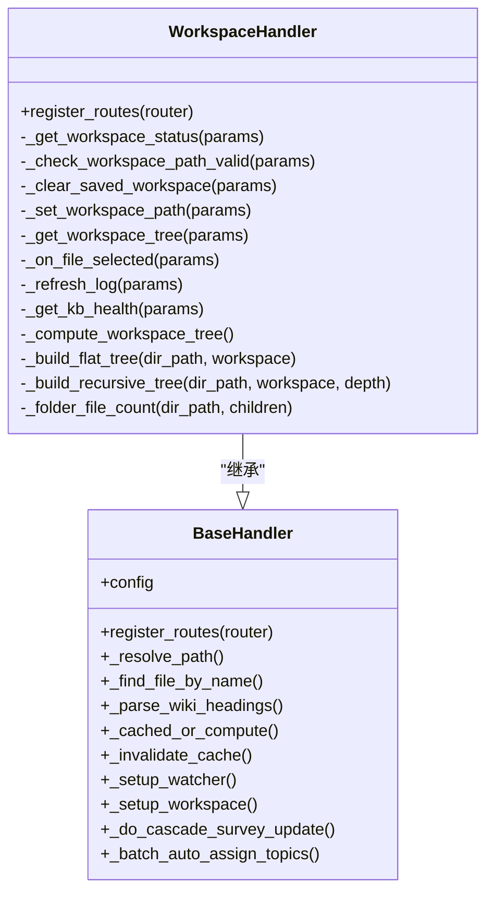
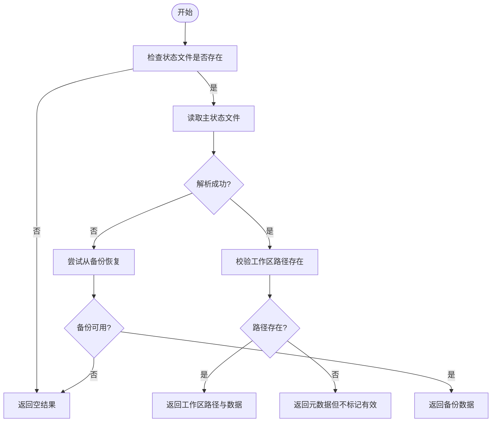
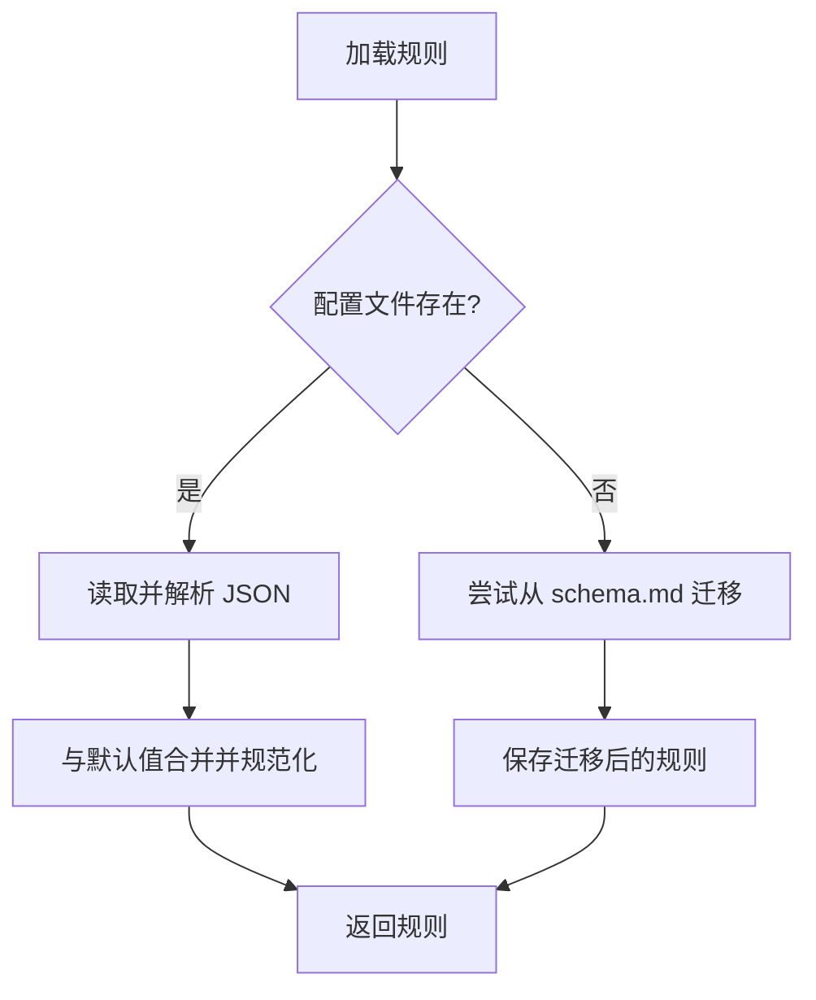
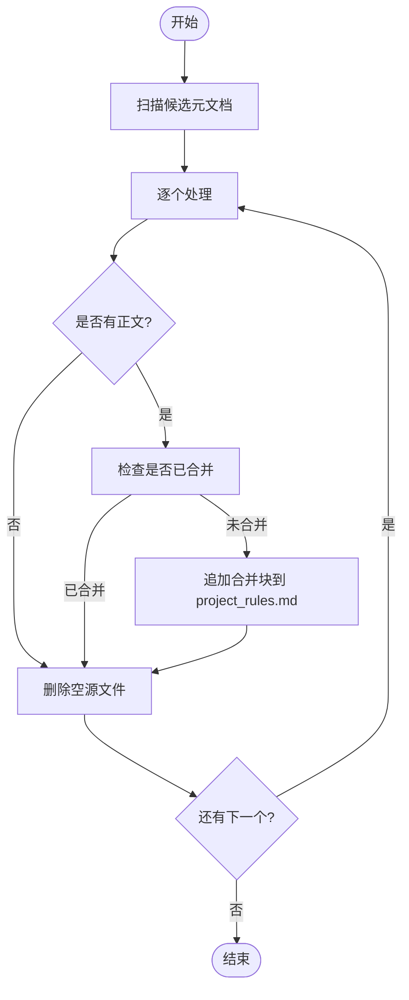
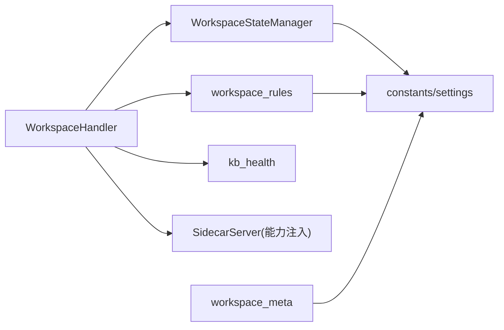

# 工作区管理 API

<cite>
**本文引用的文件**   
- [python/sidecar/handlers/workspace_handler.py](file://python/sidecar/handlers/workspace_handler.py)
- [config/workspace_state.py](file://config/workspace_state.py)
- [python/sidecar/workspace_rules.py](file://python/sidecar/workspace_rules.py)
- [python/sidecar/workspace_meta.py](file://python/sidecar/workspace_meta.py)
- [python/sidecar/kb_health.py](file://python/sidecar/kb_health.py)
- [python/sidecar/server.py](file://python/sidecar/server.py)
- [config/settings.py](file://config/settings.py)
- [config/constants.py](file://config/constants.py)
</cite>

## 目录
1. [简介](#简介)
2. [项目结构](#项目结构)
3. [核心组件](#核心组件)
4. [架构总览](#架构总览)
5. [详细组件分析](#详细组件分析)
6. [依赖关系分析](#依赖关系分析)
7. [性能与扩展性](#性能与扩展性)
8. [故障排查指南](#故障排查指南)
9. [结论](#结论)
10. [附录：API 参考](#附录api-参考)

## 简介
本文件为“工作区处理器（WorkspaceHandler）”的权威 API 文档，覆盖工作区生命周期、元数据管理、规则系统、备份恢复、健康检查与诊断、多工作区切换与并行管理最佳实践，以及工作区间的数据共享与协作机制。读者无需深入源码即可理解并正确使用相关能力。

## 项目结构
工作区管理能力由以下模块协同实现：
- 处理器层：暴露 RPC 接口，处理工作区状态、树形视图、文件选择等请求
- 状态持久化：原子写入、备份与恢复的工作区状态管理器
- 规则系统：工作区组织规则加载/保存、迁移与选项管理
- 元数据合并：将 AGENTS/CLAUDE/GEMINI 等元文档合并入项目规则
- 健康检查：知识库健康指标计算
- 服务器与监听：启动时同步、文件变更监听、缓存失效与后台任务

图表来源
- [python/sidecar/handlers/workspace_handler.py:34-44](file://python/sidecar/handlers/workspace_handler.py#L34-L44)
- [config/workspace_state.py:15-197](file://config/workspace_state.py#L15-L197)
- [python/sidecar/workspace_rules.py:15-96](file://python/sidecar/workspace_rules.py#L15-L96)
- [python/sidecar/workspace_meta.py:46-98](file://python/sidecar/workspace_meta.py#L46-L98)
- [python/sidecar/kb_health.py:30-90](file://python/sidecar/kb_health.py#L30-L90)
- [python/sidecar/server.py:97-124](file://python/sidecar/server.py#L97-L124)

章节来源
- [python/sidecar/handlers/workspace_handler.py:34-44](file://python/sidecar/handlers/workspace_handler.py#L34-L44)
- [config/workspace_state.py:15-197](file://config/workspace_state.py#L15-L197)
- [python/sidecar/workspace_rules.py:15-96](file://python/sidecar/workspace_rules.py#L15-L96)
- [python/sidecar/workspace_meta.py:46-98](file://python/sidecar/workspace_meta.py#L46-L98)
- [python/sidecar/kb_health.py:30-90](file://python/sidecar/kb_health.py#L30-L90)
- [python/sidecar/server.py:97-124](file://python/sidecar/server.py#L97-L124)

## 核心组件
- WorkspaceHandler：注册并处理工作区相关的 RPC 方法，包括状态查询、路径校验、设置、树构建、文件选择、日志刷新与健康检查入口。
- WorkspaceStateManager：负责工作区状态的持久化、读取、清理与自动从备份恢复。
- workspace_rules：工作区组织规则（JSON）的加载、保存、默认值合并、旧 schema 迁移与选项管理。
- workspace_meta：将 AGENTS/CLAUDE/GEMINI 等元文档合并到 .ai_memory/project_rules.md，并清理源文件。
- kb_health：计算知识库健康指标（覆盖率、链接统计、待办项等）。
- SidecarServer：启动时触发元数据合并、主题同步、修复断链、WIKI 同步；提供文件监听与缓存失效。

章节来源
- [python/sidecar/handlers/workspace_handler.py:34-106](file://python/sidecar/handlers/workspace_handler.py#L34-L106)
- [config/workspace_state.py:15-197](file://config/workspace_state.py#L15-L197)
- [python/sidecar/workspace_rules.py:59-96](file://python/sidecar/workspace_rules.py#L59-L96)
- [python/sidecar/workspace_meta.py:46-98](file://python/sidecar/workspace_meta.py#L46-L98)
- [python/sidecar/kb_health.py:30-90](file://python/sidecar/kb_health.py#L30-L90)
- [python/sidecar/server.py:221-255](file://python/sidecar/server.py#L221-L255)

## 架构总览
工作区处理器通过 RPC 路由对外暴露能力，内部调用状态管理器、规则系统与元数据合并工具，并在服务器启动阶段完成必要的初始化与同步。

图表来源
- [python/sidecar/handlers/workspace_handler.py:34-106](file://python/sidecar/handlers/workspace_handler.py#L34-L106)
- [config/workspace_state.py:62-126](file://config/workspace_state.py#L62-L126)
- [python/sidecar/workspace_rules.py:95-96](file://python/sidecar/workspace_rules.py#L95-L96)
- [python/sidecar/kb_health.py:30-90](file://python/sidecar/kb_health.py#L30-L90)
- [python/sidecar/server.py:221-255](file://python/sidecar/server.py#L221-L255)

## 详细组件分析

### 工作区处理器（WorkspaceHandler）
职责
- 注册工作区相关 RPC 方法
- 获取/设置工作区路径与状态
- 构建工作区树（支持扁平与递归两种模式）
- 解析文件选择路径
- 刷新日志与触发健康检查

关键方法与行为
- get_workspace_status：加载已保存工作区，若有效则更新当前配置、设置工作区与监听器，返回是否已设置、路径、Notes/Wiki 目录及是否需要规则/Schema 配置。
- check_workspace_path_valid：校验路径是否存在。
- clear_saved_workspace：清除已保存的工作区状态（保留备份），重置内存中的路径。
- set_workspace_path：设置新路径，更新预览器与工作区监听，持久化状态，返回是否需要规则/Schema 配置。
- get_workspace_tree：返回工作区树（仅允许根目录 Notes/Raw/wiki，过滤隐藏与忽略目录，限制深度与后缀）。
- on_file_selected：根据相对路径解析绝对路径，失败时回退按名称查找。
- refresh_log：返回刷新成功提示。
- get_kb_health：委托健康检查模块计算指标。

注意事项
- 树构建对权限错误进行捕获并记录警告，避免阻塞。
- 递归深度上限用于防止在超大/深层工作区中阻塞 RPC 线程。
- 文件后缀白名单控制可展示的文件类型。

章节来源
- [python/sidecar/handlers/workspace_handler.py:34-106](file://python/sidecar/handlers/workspace_handler.py#L34-L106)
- [python/sidecar/handlers/workspace_handler.py:107-157](file://python/sidecar/handlers/workspace_handler.py#L107-L157)
- [python/sidecar/handlers/workspace_handler.py:159-171](file://python/sidecar/handlers/workspace_handler.py#L159-L171)
- [python/sidecar/handlers/workspace_handler.py:173-198](file://python/sidecar/handlers/workspace_handler.py#L173-L198)
- [python/sidecar/handlers/workspace_handler.py:200-247](file://python/sidecar/handlers/workspace_handler.py#L200-L247)
- [python/sidecar/handlers/workspace_handler.py:249-260](file://python/sidecar/handlers/workspace_handler.py#L249-L260)

#### 类图（代码级）

图表来源
- [python/sidecar/handlers/base.py:4-106](file://python/sidecar/handlers/base.py#L4-L106)
- [python/sidecar/handlers/workspace_handler.py:34-260](file://python/sidecar/handlers/workspace_handler.py#L34-L260)

### 工作区状态管理（WorkspaceStateManager）
职责
- 原子写入工作区状态（含临时文件、fsync、移动替换）
- 自动备份与损坏恢复（.json.bak）
- 清理工作区状态（保留备份）
- 提供工作区信息摘要

关键流程
- save_workspace：校验路径存在后，写入包含 workspace_path、last_opened_at、version 的状态对象。
- load_workspace：优先读取主文件，异常时尝试从备份恢复。
- clear_workspace_state：复制当前为备份后删除主文件。
- get_workspace_info：汇总是否保存、是否有效、上次打开时间、文件名等。

图表来源
- [config/workspace_state.py:62-126](file://config/workspace_state.py#L62-L126)
- [config/workspace_state.py:108-126](file://config/workspace_state.py#L108-L126)
- [config/workspace_state.py:128-138](file://config/workspace_state.py#L128-L138)
- [config/workspace_state.py:140-178](file://config/workspace_state.py#L140-L178)

章节来源
- [config/workspace_state.py:15-197](file://config/workspace_state.py#L15-L197)

### 工作区规则系统（workspace_rules）
职责
- 加载/保存工作区规则 JSON（位于 .noteai/workspace_rules.json）
- 合并默认值与边界约束（如最大层级、调查级别开关）
- 从旧 schema.md 一次性迁移
- 提供选项查询与保存接口
- 生成 LLM 可用的主题结构摘要

关键要点
- DEFAULT_RULES 定义默认策略，save 时会强制规范化字段类型与取值范围。
- needs_workspace_rules_setup 判断是否需要引导配置。
- list_topic_headings/list_l1_topics 基于 Notes/ 目录结构生成主题列表。
- format_wiki_topic_structure_for_llm 输出供分类模型使用的结构化文本。

图表来源
- [python/sidecar/workspace_rules.py:59-76](file://python/sidecar/workspace_rules.py#L59-L76)
- [python/sidecar/workspace_rules.py:79-92](file://python/sidecar/workspace_rules.py#L79-L92)
- [python/sidecar/workspace_rules.py:95-96](file://python/sidecar/workspace_rules.py#L95-L96)
- [python/sidecar/workspace_rules.py:143-160](file://python/sidecar/workspace_rules.py#L143-L160)
- [python/sidecar/workspace_rules.py:171-199](file://python/sidecar/workspace_rules.py#L171-L199)

章节来源
- [python/sidecar/workspace_rules.py:15-96](file://python/sidecar/workspace_rules.py#L15-L96)
- [python/sidecar/workspace_rules.py:143-160](file://python/sidecar/workspace_rules.py#L143-L160)
- [python/sidecar/workspace_rules.py:171-199](file://python/sidecar/workspace_rules.py#L171-L199)

### 工作区元数据管理（workspace_meta）
职责
- 识别工作区元文档（AGENTS.md、CLAUDE.md、GEMINI.md）
- 合并其正文至 .ai_memory/project_rules.md，并移除源文件
- 检测 Inbox 孤儿文件（工作区根或 Notes/ 根下的孤立 MD）

关键点
- 合并前会去重与跳过已有标记的内容，避免重复合并。
- 合并块以分隔符拼接，便于后续维护与定位来源。

图表来源
- [python/sidecar/workspace_meta.py:46-98](file://python/sidecar/workspace_meta.py#L46-L98)
- [python/sidecar/workspace_meta.py:101-121](file://python/sidecar/workspace_meta.py#L101-L121)

章节来源
- [python/sidecar/workspace_meta.py:1-121](file://python/sidecar/workspace_meta.py#L1-121)

### 健康检查与诊断（kb_health）
职责
- 计算知识库健康指标：综述覆盖率、笔记总数、外链统计、Lint 问题数、待办项数量等
- 作为 get_kb_health 接口的后端实现

使用方式
- 通过 WorkspaceHandler 的 _get_kb_health 暴露 RPC 方法，传入空参数即可触发。

章节来源
- [python/sidecar/kb_health.py:30-90](file://python/sidecar/kb_health.py#L30-L90)
- [python/sidecar/handlers/workspace_handler.py:45-48](file://python/sidecar/handlers/workspace_handler.py#L45-L48)

### 服务器集成与启动同步（SidecarServer）
职责
- 启动时执行元数据合并、文件夹主题同步、修复断链、WIKI 同步（在未处于规则引导状态时）
- 启动文件监听，变更时触发缓存失效与事件广播
- 按需触发 RAG 索引重建检查

章节来源
- [python/sidecar/server.py:221-255](file://python/sidecar/server.py#L221-L255)
- [python/sidecar/server.py:298-346](file://python/sidecar/server.py#L298-L346)

## 依赖关系分析
- WorkspaceHandler 依赖：
  - config.settings.workspace_manager（状态持久化）
  - sidecar.workspace_rules（规则加载与判断）
  - sidecar.kb_health（健康检查）
  - server 提供的路径解析、缓存失效、监听器设置等能力
- WorkspaceStateManager 依赖：
  - config.constants.WORKSPACE_STATE_FILE 与平台应用数据目录
- workspace_rules 依赖：
  - config.settings.WORKSPACE_APP_FOLDER 与 constants.TOPIC_SEP
- workspace_meta 依赖：
  - config.settings.NOTES_FOLDER 与 textutils.parse_frontmatter

图表来源
- [python/sidecar/handlers/workspace_handler.py:34-106](file://python/sidecar/handlers/workspace_handler.py#L34-L106)
- [config/workspace_state.py:15-197](file://config/workspace_state.py#L15-L197)
- [python/sidecar/workspace_rules.py:15-96](file://python/sidecar/workspace_rules.py#L15-L96)
- [python/sidecar/workspace_meta.py:1-44](file://python/sidecar/workspace_meta.py#L1-44)
- [config/constants.py:22-52](file://config/constants.py#L22-L52)
- [config/settings.py:1-41](file://config/settings.py#L1-41)

章节来源
- [config/constants.py:22-52](file://config/constants.py#L22-L52)
- [config/settings.py:1-41](file://config/settings.py#L1-41)

## 性能与扩展性
- 树构建优化
  - 递归深度上限（MAX_TREE_DEPTH=6）避免大/深工作区阻塞
  - 忽略隐藏与已知无关目录，减少遍历开销
  - 仅展示白名单后缀文件，降低 I/O 压力
- 缓存与失效
  - 变更时统一失效 RPC 与全文检索缓存，避免脏读
- 后台任务
  - 启动巡检与 RAG 索引检查在后台线程执行，不阻塞主流程
- 可扩展点
  - 新增文件类型或忽略目录可通过常量与过滤器扩展
  - 规则系统支持更多字段与校验逻辑，保持向后兼容

[本节为通用指导，不涉及具体文件分析]

## 故障排查指南
- 工作区路径无效
  - 现象：check_workspace_path_valid 返回 is_valid=false
  - 排查：确认路径存在且可读；检查权限与符号链接
- 无法保存工作区状态
  - 现象：save_workspace 返回失败
  - 排查：检查应用数据目录写入权限；查看 .json.bak 是否存在并可恢复
- 规则未配置导致功能受限
  - 现象：needs_workspace_rules_setup=true
  - 处理：调用保存规则选项接口完成引导配置
- 健康检查为空或指标异常
  - 现象：未设置工作区或指标为 0
  - 排查：确保工作区已设置且包含 Notes/ 目录；检查链接索引与待办项收集是否正常

章节来源
- [python/sidecar/handlers/workspace_handler.py:72-106](file://python/sidecar/handlers/workspace_handler.py#L72-L106)
- [config/workspace_state.py:62-126](file://config/workspace_state.py#L62-L126)
- [python/sidecar/workspace_rules.py:95-96](file://python/sidecar/workspace_rules.py#L95-L96)
- [python/sidecar/kb_health.py:30-90](file://python/sidecar/kb_health.py#L30-L90)

## 结论
WorkspaceHandler 提供了完整的工作区生命周期管理与元数据、规则、健康检查能力，并通过 SidecarServer 的监听与后台任务保障一致性与可用性。配合 WorkspaceStateManager 的原子写入与备份恢复，系统在可靠性与性能之间取得良好平衡。建议在生产环境中遵循多工作区切换的最佳实践，并定期运行健康检查与巡检任务。

[本节为总结性内容，不涉及具体文件分析]

## 附录：API 参考

### RPC 方法清单（工作区处理器）
- get_workspace_status
  - 作用：获取当前工作区状态与必要标志位
  - 输入：无
  - 输出：是否已设置、路径、Notes/Wiki 目录、是否需要规则/Schema 配置等
- check_workspace_path_valid
  - 作用：校验工作区路径有效性
  - 输入：path（可选）
  - 输出：is_valid、message、path
- clear_saved_workspace
  - 作用：清除已保存的工作区状态（保留备份）
  - 输入：无
  - 输出：success、message
- set_workspace_path
  - 作用：设置工作区路径并持久化
  - 输入：path
  - 输出：success、message、workspace_path、是否需要规则/Schema 配置
- get_workspace_tree
  - 作用：获取工作区树（受限于根目录与后缀白名单）
  - 输入：无
  - 输出：节点列表（文件夹/文件，含 file_count）
- on_file_selected
  - 作用：解析选中文件的绝对路径
  - 输入：path（相对路径或名称）
  - 输出：success、path 或 message
- refresh_log
  - 作用：刷新日志提示
  - 输入：无
  - 输出：success、message
- get_kb_health
  - 作用：计算知识库健康指标
  - 输入：无
  - 输出：survey_coverage_pct、notes_total、outbound_links_total、lint_total、pending_total 等

章节来源
- [python/sidecar/handlers/workspace_handler.py:34-106](file://python/sidecar/handlers/workspace_handler.py#L34-L106)
- [python/sidecar/handlers/workspace_handler.py:107-157](file://python/sidecar/handlers/workspace_handler.py#L107-L157)
- [python/sidecar/handlers/workspace_handler.py:249-260](file://python/sidecar/handlers/workspace_handler.py#L249-L260)
- [python/sidecar/handlers/workspace_handler.py:45-48](file://python/sidecar/handlers/workspace_handler.py#L45-L48)

### 状态与规则数据结构（节选）
- 工作区状态（workspace_state.json）
  - 关键字段：workspace_path、last_opened_at、version
  - 备份文件：workspace_state.json.bak
- 工作区规则（.noteai/workspace_rules.json）
  - 关键字段：max_topic_depth、auto_update_survey、survey_at_level、ai_may_edit_wiki、ai_may_edit_notes、configured
  - 迁移：从 schema.md 导入并保存为新格式

章节来源
- [config/workspace_state.py:62-126](file://config/workspace_state.py#L62-L126)
- [python/sidecar/workspace_rules.py:15-92](file://python/sidecar/workspace_rules.py#L15-L92)

### 多工作区切换与并行管理最佳实践
- 切换顺序
  - 先 set_workspace_path 设置新路径并持久化
  - 再 get_workspace_status 触发状态同步与监听器重建
  - 必要时调用 get_workspace_tree 刷新 UI 树
- 并发安全
  - 状态写入采用原子操作与备份，避免并发写冲突
  - 文件监听在服务器侧集中管理，避免重复订阅
- 资源隔离
  - 不同工作区的缓存键应包含工作区路径前缀，避免交叉污染
  - 后台任务（巡检、RAG 索引）应按工作区分派，避免相互阻塞

[本节为通用指导，不涉及具体文件分析]

### 工作区间数据共享与协作机制
- 元数据合并
  - 将 AGENTS/CLAUDE/GEMINI 等元文档合并到 .ai_memory/project_rules.md，便于跨模块共享上下文
- 主题与 Wiki 同步
  - 启动时根据 Notes/ 目录结构同步主题与 Wiki，保证一致性
- 链接与待办
  - 通过链接索引与待办项收集，形成工作区间的协作线索

章节来源
- [python/sidecar/workspace_meta.py:46-98](file://python/sidecar/workspace_meta.py#L46-L98)
- [python/sidecar/server.py:221-255](file://python/sidecar/server.py#L221-L255)