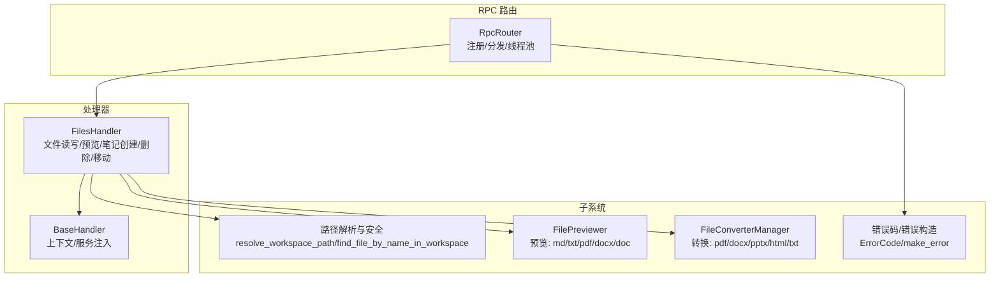
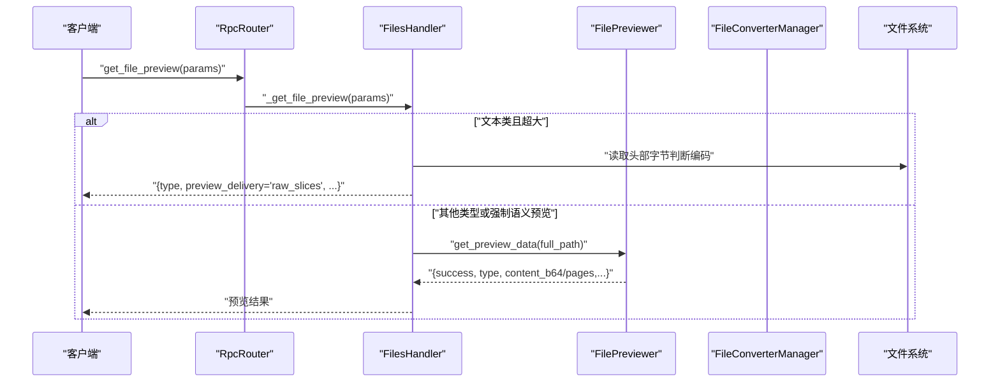
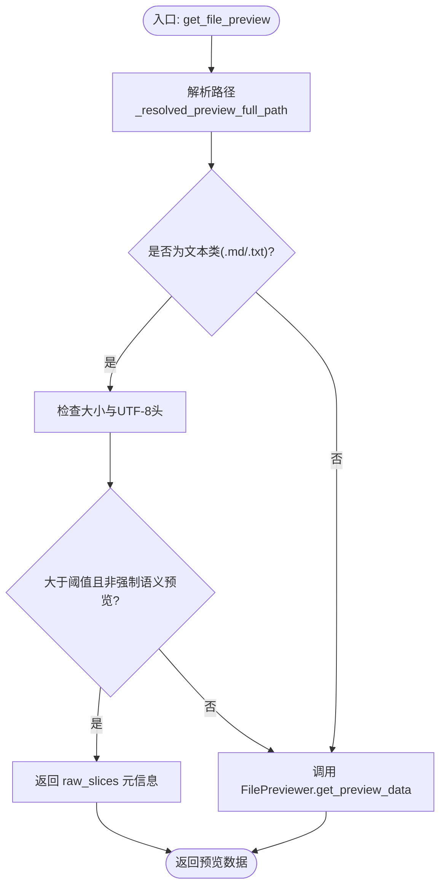
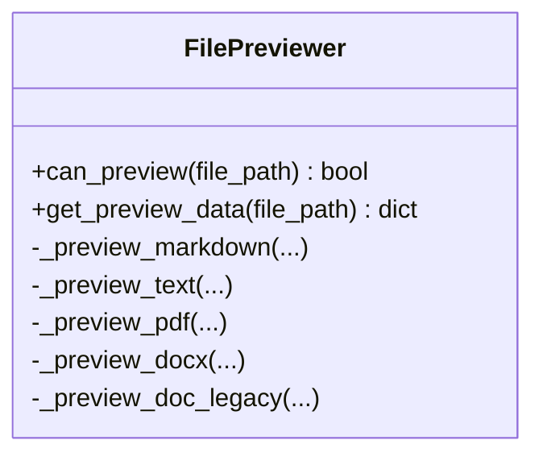
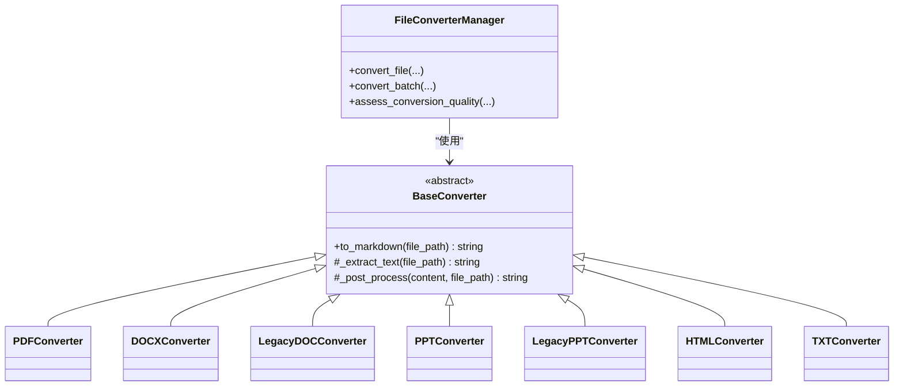
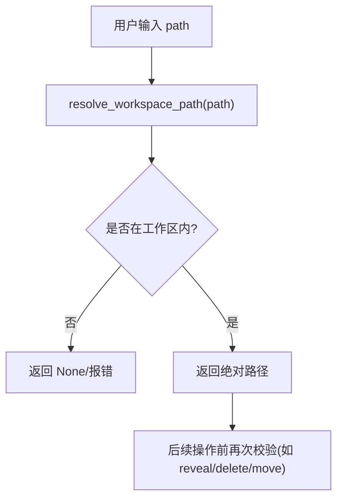
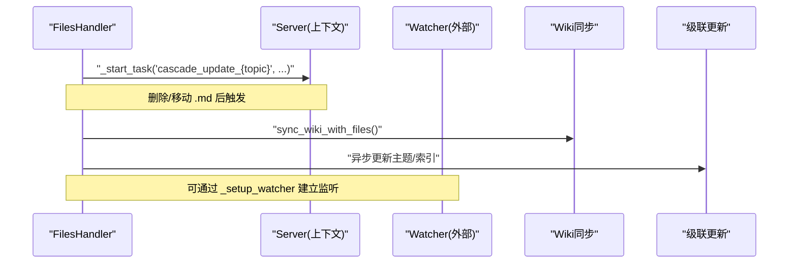
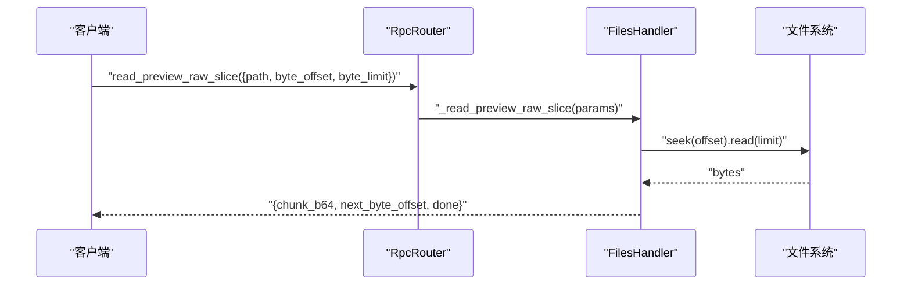
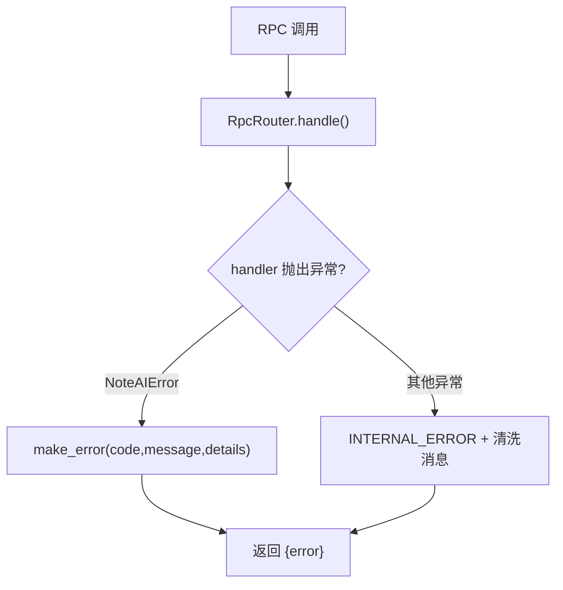
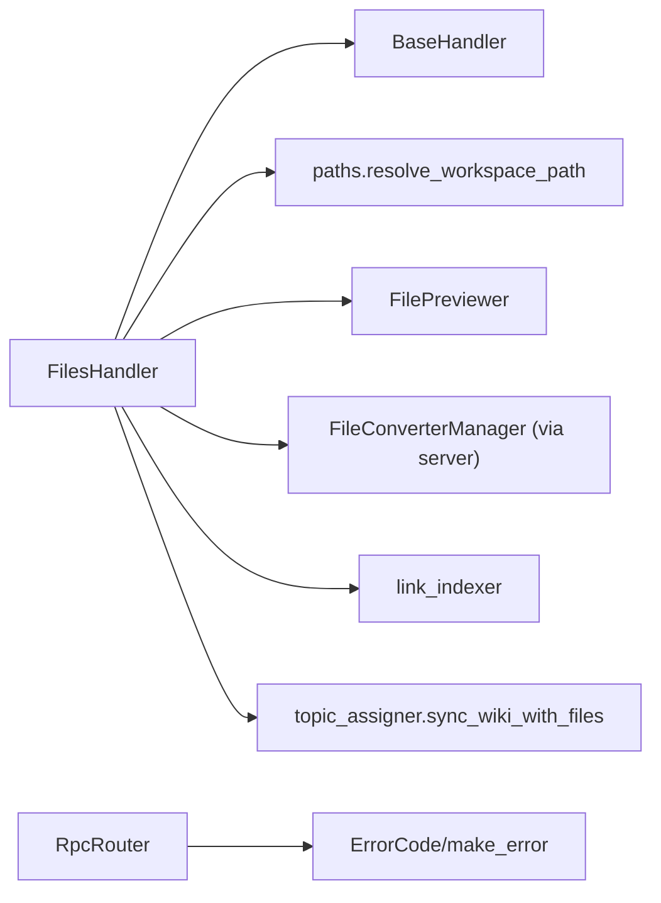

# 文件操作 API

<cite>
**本文引用的文件**   
- [files_handler.py](file://python/sidecar/handlers/files_handler.py)
- [base.py](file://python/sidecar/handlers/base.py)
- [rpc_router.py](file://python/sidecar/rpc_router.py)
- [error_codes.py](file://utils/error_codes.py)
- [paths.py](file://python/sidecar/paths.py)
- [file_converter.py](file://modules/file_converter.py)
- [file_preview.py](file://modules/file_preview.py)
</cite>

## 目录
1. [简介](#简介)
2. [项目结构](#项目结构)
3. [核心组件](#核心组件)
4. [架构总览](#架构总览)
5. [详细组件分析](#详细组件分析)
6. [依赖关系分析](#依赖关系分析)
7. [性能与可靠性](#性能与可靠性)
8. [故障排查指南](#故障排查指南)
9. [结论](#结论)
10. [附录：API 参考](#附录api-参考)

## 简介
本文件为“文件操作处理器（FilesHandler）”的完整 API 文档，覆盖以下能力：
- 文件读取、写入、删除、重命名（移动）、批量操作
- 文件格式转换接口（PDF、DOCX、PPTX、HTML、TXT 等）
- 文件预览生成（缩略图、内容提取、元数据）
- 文件监控机制（变更监听、事件通知、同步策略）
- 路径安全验证与权限控制
- 大文件流式传输与进度跟踪
- 错误处理与重试机制说明

## 项目结构
与文件操作相关的核心代码分布在如下模块：
- RPC 路由层：负责方法注册、请求分发、线程池执行与结构化错误返回
- 处理器层：FilesHandler 暴露文件相关 RPC 方法；BaseHandler 提供通用上下文访问
- 工具与子系统：
  - 路径解析与安全校验
  - 文件预览器（文本、Markdown、PDF、Word）
  - 文件转换器（PDF、DOCX、PPTX、HTML、TXT 等）
  - 统一错误码与错误构造

图表来源
- [rpc_router.py:43-106](file://python/sidecar/rpc_router.py#L43-L106)
- [base.py:4-106](file://python/sidecar/handlers/base.py#L4-L106)
- [files_handler.py:15-425](file://python/sidecar/handlers/files_handler.py#L15-L425)
- [paths.py:1-86](file://python/sidecar/paths.py#L1-L86)
- [file_preview.py:9-281](file://modules/file_preview.py#L9-L281)
- [file_converter.py:407-800](file://modules/file_converter.py#L407-L800)
- [error_codes.py:14-120](file://utils/error_codes.py#L14-L120)

章节来源
- [rpc_router.py:43-106](file://python/sidecar/rpc_router.py#L43-L106)
- [base.py:4-106](file://python/sidecar/handlers/base.py#L4-L106)
- [files_handler.py:15-425](file://python/sidecar/handlers/files_handler.py#L15-L425)
- [paths.py:1-86](file://python/sidecar/paths.py#L1-L86)
- [file_preview.py:9-281](file://modules/file_preview.py#L9-L281)
- [file_converter.py:407-800](file://modules/file_converter.py#L407-L800)
- [error_codes.py:14-120](file://utils/error_codes.py#L14-L120)

## 核心组件
- FilesHandler：实现所有文件相关 RPC 方法，包括预览、原始读取、保存、删除、移动、笔记创建等。
- BaseHandler：为处理器提供统一的上下文访问（配置、工作区、任务调度、缓存、观察者等）。
- RpcRouter：JSON-RPC 路由，负责方法注册、参数传递、异常捕获与响应封装。
- FilePreviewer：多格式预览（Markdown、TXT、PDF、DOCX、DOC），支持图片缩略图与全文提取。
- FileConverterManager：多格式到 Markdown 的转换，包含质量评估、LLM 重写、主题自动分配、原始归档等。
- 路径解析与安全：防止路径穿越与工作区外访问。
- 错误体系：统一错误码与错误构造，便于前端 i18n 与重试决策。

章节来源
- [files_handler.py:15-425](file://python/sidecar/handlers/files_handler.py#L15-L425)
- [base.py:4-106](file://python/sidecar/handlers/base.py#L4-L106)
- [rpc_router.py:43-106](file://python/sidecar/rpc_router.py#L43-L106)
- [file_preview.py:9-281](file://modules/file_preview.py#L9-L281)
- [file_converter.py:407-800](file://modules/file_converter.py#L407-L800)
- [paths.py:1-86](file://python/sidecar/paths.py#L1-L86)
- [error_codes.py:14-120](file://utils/error_codes.py#L14-L120)

## 架构总览
RPC 调用从客户端进入 RpcRouter，路由到具体 Handler。FilesHandler 通过 BaseHandler 获取工作区、预览器、转换器、任务调度等能力，并调用路径解析与安全校验工具进行输入校验。

图表来源
- [rpc_router.py:54-82](file://python/sidecar/rpc_router.py#L54-L82)
- [files_handler.py:42-67](file://python/sidecar/handlers/files_handler.py#L42-L67)
- [file_preview.py:19-44](file://modules/file_preview.py#L19-L44)

## 详细组件分析

### FilesHandler 方法与协议
- get_file_preview
  - 功能：根据 path 解析真实路径，优先对大文本采用 raw_slices 分片预览；否则走 FilePreviewer 语义预览。
  - 关键参数：path、force_semantic_preview
  - 返回：成功标志、预览类型、传输方式、文件大小、分页信息（raw_slices）或语义内容（b64）
- read_preview_raw_slice
  - 功能：对 .md/.markdown/.txt 按 byte_offset/byte_limit 分页读取，返回 base64 块与 next_byte_offset/done
  - 关键参数：path、byte_offset、byte_limit
- can_preview_file
  - 功能：判断是否支持预览（扩展名白名单）
- save_file_content
  - 功能：将 UTF-8 文本保存到目标路径，限制最大大小，保护系统/运行时目录
  - 关键参数：path、content
- create_note / create_note_from_draft
  - 功能：在 Notes 下按 topic 层级创建 .md 笔记，附带 frontmatter 与日志
  - 关键参数：title、topic、content（后者）
- read_file_raw
  - 功能：以 base64 返回整个文件内容，带大小限制
  - 关键参数：path
- reveal_in_finder
  - 功能：在系统文件管理器中定位文件（macOS/Windows/Linux）
  - 关键参数：path
- delete_file
  - 功能：移动到回收站，清理后触发 wiki 同步与级联更新（.md）
  - 关键参数：path
- move_file
  - 功能：移动文件到目标文件夹，避免自身/子目录移动冲突，必要时触发 wiki 同步
  - 关键参数：file_path、target_folder

图表来源
- [files_handler.py:20-67](file://python/sidecar/handlers/files_handler.py#L20-L67)
- [file_preview.py:19-44](file://modules/file_preview.py#L19-L44)

章节来源
- [files_handler.py:42-116](file://python/sidecar/handlers/files_handler.py#L42-L116)
- [files_handler.py:117-150](file://python/sidecar/handlers/files_handler.py#L117-L150)
- [files_handler.py:156-174](file://python/sidecar/handlers/files_handler.py#L156-L174)
- [files_handler.py:175-218](file://python/sidecar/handlers/files_handler.py#L175-L218)
- [files_handler.py:219-281](file://python/sidecar/handlers/files_handler.py#L219-L281)
- [files_handler.py:282-324](file://python/sidecar/handlers/files_handler.py#L282-L324)
- [files_handler.py:363-412](file://python/sidecar/handlers/files_handler.py#L363-L412)
- [files_handler.py:414-425](file://python/sidecar/handlers/files_handler.py#L414-L425)

### 文件预览（FilePreviewer）
- 支持类型：.md/.markdown/.txt/.pdf/.doc/.docx
- 输出模式：
  - 文本/Markdown：semantic_b64（UTF-8 经 base64 传输）
  - PDF：pages（含每页文本与 PNG 缩略图）、full_text、truncated 标记
  - DOCX：优先 mammoth 转 HTML，回退 python-docx 生成 HTML
  - DOC：通过 LegacyDOCConverter 转为 Markdown 再预览
- 安全与资源限制：
  - PDF 渲染限制单页像素与总图片大小，防止内存耗尽
  - 失败时回退至 legacy 路径

图表来源
- [file_preview.py:9-281](file://modules/file_preview.py#L9-L281)

章节来源
- [file_preview.py:15-44](file://modules/file_preview.py#L15-L44)
- [file_preview.py:79-169](file://modules/file_preview.py#L79-L169)
- [file_preview.py:171-264](file://modules/file_preview.py#L171-L264)

### 文件转换（FileConverterManager）
- 支持格式：PDF、DOCX、旧版 DOC、PPTX、旧版 PPT、HTML、TXT
- 流程要点：
  - 选择对应 Converter（模板方法模式）
  - 质量评估（字符密度、乱码比例、扫描 PDF 检测）
  - 可选 LLM 重写（短文本场景）
  - 添加 YAML front matter（标签、source、sha256）
  - 落盘与去重命名
  - 可选自动主题分配
  - 可选将源文件归档到 Raw 目录并更新 source 字段
- 批量转换：convert_batch 支持进度回调与失败记录

图表来源
- [file_converter.py:27-69](file://modules/file_converter.py#L27-L69)
- [file_converter.py:72-158](file://modules/file_converter.py#L72-L158)
- [file_converter.py:160-182](file://modules/file_converter.py#L160-L182)
- [file_converter.py:183-252](file://modules/file_converter.py#L183-L252)
- [file_converter.py:254-287](file://modules/file_converter.py#L254-L287)
- [file_converter.py:289-388](file://modules/file_converter.py#L289-L388)
- [file_converter.py:390-405](file://modules/file_converter.py#L390-L405)
- [file_converter.py:407-800](file://modules/file_converter.py#L407-L800)

章节来源
- [file_converter.py:407-731](file://modules/file_converter.py#L407-L731)
- [file_converter.py:732-771](file://modules/file_converter.py#L732-L771)
- [file_converter.py:772-800](file://modules/file_converter.py#L772-L800)

### 路径处理与安全
- resolve_workspace_path：拒绝控制字符与路径穿越，确保目标在工作区内
- find_file_by_name_in_workspace：按文件名模糊匹配，限定工作区范围
- FilesHandler 内部多处二次校验（如 reveal_in_finder 非法字符检查、删除/移动的工作区边界保护）

图表来源
- [paths.py:9-51](file://python/sidecar/paths.py#L9-L51)
- [paths.py:54-86](file://python/sidecar/paths.py#L54-L86)
- [files_handler.py:175-218](file://python/sidecar/handlers/files_handler.py#L175-L218)
- [files_handler.py:219-281](file://python/sidecar/handlers/files_handler.py#L219-L281)
- [files_handler.py:282-324](file://python/sidecar/handlers/files_handler.py#L282-L324)

章节来源
- [paths.py:1-86](file://python/sidecar/paths.py#L1-L86)
- [files_handler.py:175-218](file://python/sidecar/handlers/files_handler.py#L175-L218)
- [files_handler.py:219-281](file://python/sidecar/handlers/files_handler.py#L219-L281)
- [files_handler.py:282-324](file://python/sidecar/handlers/files_handler.py#L282-L324)

### 文件监控机制
- 变更监听与事件通知：BaseHandler 暴露 _setup_watcher 能力，供上层服务初始化文件系统观察器
- 同步策略：
  - 删除/移动 .md 后触发 wiki 同步（sync_wiki_with_files）
  - 删除 .md 后异步触发级联更新（_do_cascade_survey_update）
  - 保存 .md 后异步建议跨文件链接（discover_cross_refs_for_file）

图表来源
- [base.py:53-66](file://python/sidecar/handlers/base.py#L53-L66)
- [files_handler.py:250-272](file://python/sidecar/handlers/files_handler.py#L250-L272)
- [files_handler.py:141-155](file://python/sidecar/handlers/files_handler.py#L141-L155)

章节来源
- [base.py:53-66](file://python/sidecar/handlers/base.py#L53-L66)
- [files_handler.py:250-272](file://python/sidecar/handlers/files_handler.py#L250-L272)
- [files_handler.py:141-155](file://python/sidecar/handlers/files_handler.py#L141-L155)

### 大文件处理与进度跟踪
- 大文件预览：
  - 文本类大文件采用 raw_slices 分片读取，避免一次性加载
  - 每次返回 chunk_b64、next_byte_offset、done 标志
- 批量转换进度：
  - convert_batch 支持 progress_callback(i+1, total, message)
- 线程池执行：
  - RpcRouter 使用线程池执行处理器，避免阻塞主循环

图表来源
- [files_handler.py:69-106](file://python/sidecar/handlers/files_handler.py#L69-L106)
- [rpc_router.py:43-82](file://python/sidecar/rpc_router.py#L43-L82)
- [file_converter.py:732-771](file://modules/file_converter.py#L732-L771)

章节来源
- [files_handler.py:69-106](file://python/sidecar/handlers/files_handler.py#L69-L106)
- [file_converter.py:732-771](file://modules/file_converter.py#L732-L771)
- [rpc_router.py:43-82](file://python/sidecar/rpc_router.py#L43-L82)

### 错误处理与重试机制
- 结构化错误码：ErrorCode 枚举定义各类错误域（路径、文件、转换、云同步等）
- 错误构造：make_error 生成标准错误负载，前端可据此做 i18n 与重试策略
- 路由层处理：
  - 捕获 NoteAIError 与普通 Exception
  - 清洗敏感信息（工作区/家目录路径）
  - 统一返回 {"error": {...}}
- 重试建议：
  - 网络/外部依赖错误（TIMEOUT、API_CONNECTION_FAILED、DEPENDENCY_MISSING）适合指数退避重试
  - 业务不可重试错误（PATH_OUTSIDE_WORKSPACE、FILE_NOT_FOUND、CONVERSION_FAILED）应提示用户修正

图表来源
- [rpc_router.py:54-94](file://python/sidecar/rpc_router.py#L54-L94)
- [error_codes.py:14-120](file://utils/error_codes.py#L14-L120)

章节来源
- [rpc_router.py:54-94](file://python/sidecar/rpc_router.py#L54-L94)
- [error_codes.py:14-120](file://utils/error_codes.py#L14-L120)

## 依赖关系分析
- FilesHandler 依赖：
  - BaseHandler：获取 server 上下文与服务（file_previewer、file_converter、task 调度等）
  - paths：路径解析与安全校验
  - file_previewer：预览能力
  - file_converter：转换能力（间接通过 server 注入）
  - utils.link_indexer：保存 .md 后建议链接
  - utils.topic_assigner：删除/移动后同步 wiki
- RpcRouter 依赖：
  - error_codes：结构化错误
  - logger：日志
  - ThreadPoolExecutor：并发执行

图表来源
- [files_handler.py:15-425](file://python/sidecar/handlers/files_handler.py#L15-L425)
- [base.py:4-106](file://python/sidecar/handlers/base.py#L4-L106)
- [paths.py:1-86](file://python/sidecar/paths.py#L1-L86)
- [file_preview.py:9-281](file://modules/file_preview.py#L9-L281)
- [file_converter.py:407-800](file://modules/file_converter.py#L407-L800)
- [rpc_router.py:43-106](file://python/sidecar/rpc_router.py#L43-L106)
- [error_codes.py:14-120](file://utils/error_codes.py#L14-L120)

章节来源
- [files_handler.py:15-425](file://python/sidecar/handlers/files_handler.py#L15-L425)
- [base.py:4-106](file://python/sidecar/handlers/base.py#L4-L106)
- [paths.py:1-86](file://python/sidecar/paths.py#L1-L86)
- [file_preview.py:9-281](file://modules/file_preview.py#L9-L281)
- [file_converter.py:407-800](file://modules/file_converter.py#L407-L800)
- [rpc_router.py:43-106](file://python/sidecar/rpc_router.py#L43-L106)
- [error_codes.py:14-120](file://utils/error_codes.py#L14-L120)

## 性能与可靠性
- 预览优化
  - 大文本采用 raw_slices 分片传输，降低首屏延迟与内存占用
  - PDF 渲染限制单页像素与总图片大小，避免 OOM
- 转换优化
  - 懒加载各格式转换器，减少启动开销
  - 质量评估快速过滤低质结果，避免无效 LLM 调用
  - 批量转换支持进度回调，便于 UI 反馈
- 并发与稳定性
  - RpcRouter 使用线程池执行处理器，避免阻塞 I/O
  - 关键目录保护与路径穿越防护，提升安全性
- 建议
  - 对大文件预览优先使用 raw_slices
  - 批量转换设置合理的进度上报频率
  - 对网络/外部依赖错误实施指数退避重试

[本节为通用指导，不直接分析具体文件]

## 故障排查指南
- 常见错误码与含义
  - PATH_OUTSIDE_WORKSPACE：路径不在工作区内
  - FILE_NOT_FOUND：文件不存在
  - FILE_TOO_LARGE：超过大小限制
  - CONVERSION_FAILED：转换失败（可能由依赖缺失或格式不支持导致）
  - DEPENDENCY_MISSING：缺少必要依赖（如 send2trash、mammoth、fitz 等）
- 定位步骤
  - 检查返回的 code 与 message，确认是否为路径/权限问题
  - 对于转换失败，查看 quality 字段中的 issues（如“疑似乱码”、“疑似扫描 PDF”）
  - 若涉及外部命令（macOS textutil、antiword/catdoc），确认已安装
- 重试策略
  - 临时性错误（超时、连接失败）可重试
  - 业务错误（路径非法、文件不存在）不应重试，需提示用户修正

章节来源
- [error_codes.py:14-120](file://utils/error_codes.py#L14-L120)
- [rpc_router.py:54-94](file://python/sidecar/rpc_router.py#L54-L94)
- [file_converter.py:509-535](file://modules/file_converter.py#L509-L535)

## 结论
FilesHandler 提供了完整的文件操作与预览/转换能力，结合路径安全校验、结构化错误码与线程池执行，形成稳定可靠的文件服务层。通过 raw_slices 与批量进度回调，兼顾了大文件体验与可观测性。建议在集成端遵循错误码规范，合理实施重试与降级策略。

[本节为总结，不直接分析具体文件]

## 附录：API 参考

### 文件预览
- get_file_preview
  - 入参：path, force_semantic_preview
  - 出参：success, type, preview_delivery, file_name, file_size, transport_hint/content_b64/pages/full_text/truncated
- read_preview_raw_slice
  - 入参：path, byte_offset, byte_limit
  - 出参：success, chunk_b64, total_byte_size, byte_offset_start, next_byte_offset, done
- can_preview_file
  - 入参：path
  - 出参：success, boolean

章节来源
- [files_handler.py:42-116](file://python/sidecar/handlers/files_handler.py#L42-L116)
- [file_preview.py:15-44](file://modules/file_preview.py#L15-L44)

### 文件读写与发现
- save_file_content
  - 入参：path, content
  - 出参：success, message
- read_file_raw
  - 入参：path
  - 出参：success, content(base64), size, file_name
- reveal_in_finder
  - 入参：path
  - 出参：success, message

章节来源
- [files_handler.py:117-174](file://python/sidecar/handlers/files_handler.py#L117-L174)
- [files_handler.py:175-218](file://python/sidecar/handlers/files_handler.py#L175-L218)

### 文件管理
- delete_file
  - 入参：path
  - 出参：success, message
- move_file
  - 入参：file_path, target_folder
  - 出参：success, path, message

章节来源
- [files_handler.py:219-324](file://python/sidecar/handlers/files_handler.py#L219-L324)

### 笔记创建
- create_note
  - 入参：title, topic
  - 出参：success, path, title, topic, message
- create_note_from_draft
  - 入参：title, topic, content
  - 出参：success, path, title, topic, message

章节来源
- [files_handler.py:363-412](file://python/sidecar/handlers/files_handler.py#L363-L412)

### 文件转换（通过服务器注入的转换器）
- convert_file
  - 入参：file_path, output_path, output_format="markdown", assign_topic=True, raw_path=None
  - 出参：success, output_path, tags, source_sha256, archived_source, quality, skipped, error
- convert_batch
  - 入参：file_paths[], output_path, raw_path=None, output_format="markdown", assign_topic=True
  - 出参：results[]（每项同 convert_file）

章节来源
- [file_converter.py:569-731](file://modules/file_converter.py#L569-L731)
- [file_converter.py:732-771](file://modules/file_converter.py#L732-L771)