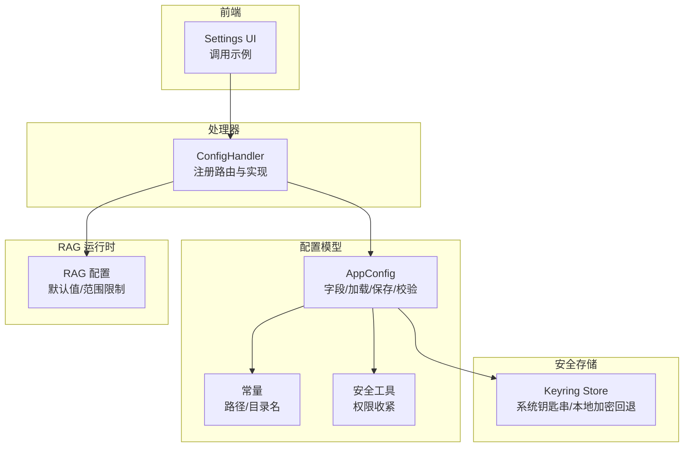
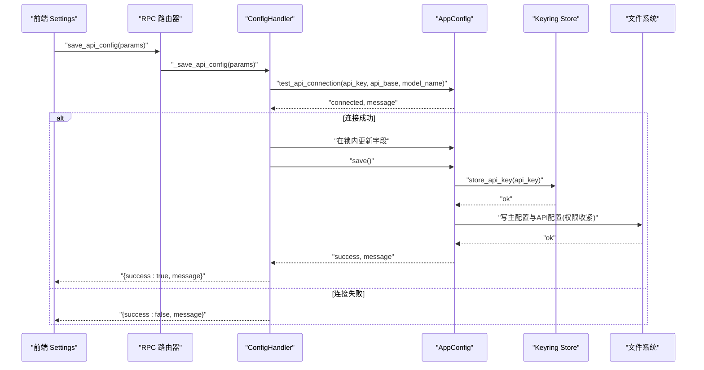
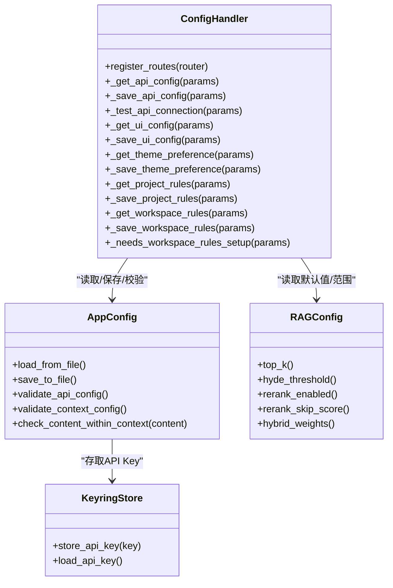

# 配置管理 API

<cite>
**本文引用的文件**   
- [config_handler.py](file://python/sidecar/handlers/config_handler.py)
- [app_config.py](file://config/app_config.py)
- [constants.py](file://config/constants.py)
- [security.py](file://config/security.py)
- [rag_config.py](file://python/sidecar/rag/rag_config.py)
- [keyring_store.py](file://utils/keyring_store.py)
- [settings.js](file://webui/js/settings.js)
</cite>

## 目录
1. [简介](#简介)
2. [项目结构](#项目结构)
3. [核心组件](#核心组件)
4. [架构总览](#架构总览)
5. [详细组件分析](#详细组件分析)
6. [依赖关系分析](#依赖关系分析)
7. [性能与一致性](#性能与一致性)
8. [故障排查指南](#故障排查指南)
9. [结论](#结论)
10. [附录：API 参考](#附录api-参考)

## 简介
本文件为配置管理处理器（ConfigHandler）的完整 API 文档，覆盖所有与配置相关的 RPC 方法。内容包括：
- 获取应用设置、更新配置项、验证配置有效性等接口定义
- 请求参数结构、类型约束与默认值处理
- 响应数据格式与状态信息
- 配置的持久化机制、热重载支持与版本兼容性
- 安全最佳实践（敏感信息加密存储与环境变量集成）
- 实际使用示例与常见配置场景

## 项目结构
配置相关代码主要分布在以下模块：
- 处理器层：负责暴露 RPC 路由与方法实现
- 配置模型层：定义配置字段、加载/保存逻辑、校验规则
- 安全与密钥存储：系统钥匙串或本地加密回退
- RAG 运行时配置：从 AppConfig 读取并做范围限制
- 前端调用示例：Settings 页面如何调用配置 API

图表来源
- [config_handler.py:16-30](file://python/sidecar/handlers/config_handler.py#L16-L30)
- [app_config.py:28-99](file://config/app_config.py#L28-L99)
- [constants.py:5-24](file://config/constants.py#L5-L24)
- [security.py:6-12](file://config/security.py#L6-L12)
- [rag_config.py:9-14](file://python/sidecar/rag/rag_config.py#L9-L14)
- [keyring_store.py:166-189](file://utils/keyring_store.py#L166-L189)
- [settings.js:3-54](file://webui/js/settings.js#L3-L54)

章节来源
- [config_handler.py:16-30](file://python/sidecar/handlers/config_handler.py#L16-L30)
- [app_config.py:28-99](file://config/app_config.py#L28-L99)
- [constants.py:5-24](file://config/constants.py#L5-L24)
- [security.py:6-12](file://config/security.py#L6-L12)
- [rag_config.py:9-14](file://python/sidecar/rag/rag_config.py#L9-L14)
- [keyring_store.py:166-189](file://utils/keyring_store.py#L166-L189)
- [settings.js:3-54](file://webui/js/settings.js#L3-L54)

## 核心组件
- ConfigHandler：提供配置读写、连接测试、工作区规则等 RPC 方法
- AppConfig：集中定义配置字段、加载顺序（环境变量 > 文件 > 默认）、保存策略（主配置与 API 配置分离）、校验与上下文长度检查
- Keyring Store：优先使用系统钥匙串，不可用时回退到本地加密文件
- RAG 配置：提供默认值与取值范围限制，供运行时读取

章节来源
- [config_handler.py:16-30](file://python/sidecar/handlers/config_handler.py#L16-L30)
- [app_config.py:212-311](file://config/app_config.py#L212-L311)
- [app_config.py:313-386](file://config/app_config.py#L313-L386)
- [keyring_store.py:166-189](file://utils/keyring_store.py#L166-L189)
- [rag_config.py:9-14](file://python/sidecar/rag/rag_config.py#L9-L14)

## 架构总览
配置管理的整体流程如下：
- 读取：进程启动时按优先级加载配置（环境变量 > 配置文件 > 默认值），并从系统钥匙串恢复 API Key
- 写入：通过处理器方法接收变更，在锁保护下原子更新内存对象，再持久化到磁盘；敏感字段走钥匙串或加密回退
- 校验：保存前进行连通性测试与数值范围校验
- 热重载：部分 RAG 配置变更后清理查询缓存以生效

图表来源
- [config_handler.py:50-78](file://python/sidecar/handlers/config_handler.py#L50-L78)
- [app_config.py:313-386](file://config/app_config.py#L313-L386)
- [keyring_store.py:166-189](file://utils/keyring_store.py#L166-L189)
- [security.py:6-12](file://config/security.py#L6-L12)

## 详细组件分析

### 处理器路由与方法清单
ConfigHandler 注册了以下 RPC 方法：
- get_api_config：获取 LLM API 配置（脱敏返回）
- save_api_config：保存 LLM API 配置（含连通性校验）
- test_api_connection：测试 API 连通性
- get_ui_config：获取 UI 与应用功能开关配置
- save_ui_config：保存 UI 与应用功能开关配置（含类型转换与范围限制）
- get_theme_preference / save_theme_preference：主题偏好
- get_project_rules / save_project_rules：项目级规则文件
- get_workspace_rules / save_workspace_rules：工作区整理规则选项
- needs_workspace_rules_setup：是否需要初始化工作区规则

章节来源
- [config_handler.py:17-30](file://python/sidecar/handlers/config_handler.py#L17-L30)

#### 获取 API 配置
- 方法名：get_api_config
- 请求参数：无
- 行为说明：
  - 返回当前 API Key（脱敏显示）、是否已配置、API Base、模型名称、温度、最大 Token、最大上下文 Token、是否禁用思考
- 响应结构：
  - api_key: string（脱敏）
  - api_key_configured: boolean
  - api_base: string
  - model_name: string
  - temperature: number
  - max_tokens: number
  - max_context_tokens: number
  - disable_thinking: boolean

章节来源
- [config_handler.py:31-48](file://python/sidecar/handlers/config_handler.py#L31-L48)

#### 保存 API 配置
- 方法名：save_api_config
- 请求参数：
  - api_key: string（必填；若传入值为“掩码占位符”，则保留原值）
  - api_base: string（可选，默认 https://api.openai.com/v1）
  - model_name: string（可选，默认 gpt-4）
  - temperature: number（可选，默认 0.7）
  - max_tokens: number（可选，默认 32000）
  - max_context_tokens: number（可选，默认 128000）
  - disable_thinking: boolean（可选，默认 true）
- 行为说明：
  - 非空校验
  - 连通性测试（调用外部 API）
  - 在锁内原子更新内存配置
  - 持久化：主配置与 API 配置分别落盘；API Key 优先写入系统钥匙串，否则回退到本地加密文件
  - 对 API 配置文件执行权限收紧
- 响应结构：
  - success: boolean
  - message: string（成功或错误原因）

章节来源
- [config_handler.py:50-78](file://python/sidecar/handlers/config_handler.py#L50-L78)
- [app_config.py:313-386](file://config/app_config.py#L313-L386)
- [keyring_store.py:166-189](file://utils/keyring_store.py#L166-L189)
- [security.py:6-12](file://config/security.py#L6-L12)

#### 测试 API 连通性
- 方法名：test_api_connection
- 请求参数：
  - api_key: string（可选，未传则使用当前配置）
  - api_base: string（可选，未传则使用当前配置）
  - model_name: string（可选，未传则使用当前配置）
- 行为说明：
  - 若传入的 api_key 为“掩码占位符”，则自动替换为真实值
  - 调用连通性检测并返回结果
- 响应结构：
  - success: boolean
  - message: string（连接结果描述）

章节来源
- [config_handler.py:228-240](file://python/sidecar/handlers/config_handler.py#L228-L240)

#### 获取 UI 配置
- 方法名：get_ui_config
- 请求参数：无
- 行为说明：返回 UI 与功能开关、字体、主题、RAG 运行参数、语言等
- 响应结构（节选关键项）：
  - web_ai_assist: boolean
  - web_include_images: boolean
  - conv_ai_assist: boolean
  - integration_strategy: string
  - auto_topic: boolean
  - topic_auto_assign_threshold: number（0~1）
  - topic_list: string
  - font_size: string
  - sidebar_font_family: string
  - preview_font_family: string
  - typography: object
  - cloud_sync_experimental: boolean
  - ingest_auto_enabled: boolean
  - assistant_agent_mode: boolean
  - cli_agent_id: string
  - rag_enabled: boolean
  - rag_hyde_enabled: boolean
  - rag_hyde_threshold: number（0~1）
  - rag_rerank_enabled: boolean
  - rag_rerank_skip_score: number（0~1）
  - rag_dense_weight: number（0~1）
  - rag_top_k: integer（1~50）
  - rag_top_k_tags: integer（1~50）
  - rag_rerank_model: string（固定值）
  - locale: string（"en" 或 "zh-CN"）

章节来源
- [config_handler.py:80-107](file://python/sidecar/handlers/config_handler.py#L80-L107)
- [rag_config.py:9-14](file://python/sidecar/rag/rag_config.py#L9-L14)

#### 保存 UI 配置
- 方法名：save_ui_config
- 请求参数：可包含上述任意子集（仅存在键才会更新）
- 类型转换与约束：
  - 布尔型：支持字符串 "1"/"true"/"yes"/"on" 转布尔
  - 浮点型：强制范围裁剪（如阈值 0~1）
  - 整型：强制范围裁剪（如 top_k 1~50）
  - 字符串：trim 与最小合法值处理
  - locale：仅允许 "en" 或 "zh-CN"
- 行为说明：
  - 在锁内批量更新
  - 持久化后，若涉及 RAG 相关键，尝试清理查询缓存以实现热重载
- 响应结构：
  - success: boolean
  - message: string

章节来源
- [config_handler.py:109-215](file://python/sidecar/handlers/config_handler.py#L109-L215)

#### 主题偏好
- get_theme_preference：返回当前主题偏好
- save_theme_preference：保存主题偏好（system/light/dark 等）

章节来源
- [config_handler.py:217-226](file://python/sidecar/handlers/config_handler.py#L217-L226)

#### 项目规则与工作区规则
- get_project_rules / save_project_rules：在项目 .ai_memory/project_rules.md 中读写文本规则
- get_workspace_rules / save_workspace_rules：读取/保存工作区整理规则选项（深度、调查策略等）
- needs_workspace_rules_setup：判断是否需要初始化工作区规则

章节来源
- [config_handler.py:242-285](file://python/sidecar/handlers/config_handler.py#L242-L285)

### 配置模型与持久化（AppConfig）
- 字段定义：涵盖 LLM API、UI、RAG、工作区路径、日志路径、窗口尺寸等
- 加载顺序：
  - 环境变量（如 NOTEAI_API_KEY、NOTEAI_API_BASE、NOTEAI_MODEL_NAME、NOTEAI_TEMPERATURE、NOTEAI_MAX_TOKENS、NOTEAI_MAX_CONTEXT、NOTEAI_WORKSPACE_PATH）
  - 配置文件（项目 config.json 与系统目录 api_config.json）
  - 默认值
- 保存策略：
  - 主配置保存到项目 config.json
  - API 配置保存到系统目录 api_config.json（不含 api_key）
  - api_key 优先写入系统钥匙串；不可用时回退到本地加密文件
  - 对 API 配置文件执行权限收紧（0600）
- 校验：
  - validate_api_config：校验 key/base/model/temperature/max_tokens 等
  - validate_context_config：校验上下文大小范围
  - check_content_within_context：估算 token 并在超出时进行摘要/截断

章节来源
- [app_config.py:28-99](file://config/app_config.py#L28-L99)
- [app_config.py:212-311](file://config/app_config.py#L212-L311)
- [app_config.py:313-386](file://config/app_config.py#L313-L386)
- [app_config.py:176-210](file://config/app_config.py#L176-L210)
- [constants.py:5-24](file://config/constants.py#L5-L24)
- [security.py:6-12](file://config/security.py#L6-L12)
- [keyring_store.py:166-189](file://utils/keyring_store.py#L166-L189)

### RAG 运行时配置
- 默认值与模型名：top_k、top_k_tags、hyde_threshold、rerank_skip_score、dense_weight、rerank 模型名
- 取值范围限制：统一裁剪到 [0,1] 或 [1,50]
- 环境变量控制：NOTEAI_DISABLE_RERANKER 可关闭重排器

章节来源
- [rag_config.py:9-14](file://python/sidecar/rag/rag_config.py#L9-L14)
- [rag_config.py:21-63](file://python/sidecar/rag/rag_config.py#L21-L63)

### 安全与密钥存储
- 首选系统钥匙串（macOS Keychain、Windows Credential Manager、Linux Secret Service）
- 回退方案：基于 PBKDF2+Fernet 的本地加密文件，附带安装期随机 secret，降低泄露风险
- 文件权限：API 配置文件与回退文件均设置为 0600

章节来源
- [keyring_store.py:166-189](file://utils/keyring_store.py#L166-L189)
- [keyring_store.py:43-102](file://utils/keyring_store.py#L43-L102)
- [security.py:6-12](file://config/security.py#L6-L12)

## 依赖关系分析
- ConfigHandler 依赖 AppConfig 进行配置读写与校验
- AppConfig 依赖常量定义的路径与目录名
- 保存 API 配置时依赖 Keyring Store 进行敏感信息存储
- UI 配置保存后可能触发 RAG 查询缓存清理，使新配置即时生效

图表来源
- [config_handler.py:16-30](file://python/sidecar/handlers/config_handler.py#L16-L30)
- [app_config.py:212-386](file://config/app_config.py#L212-L386)
- [keyring_store.py:166-189](file://utils/keyring_store.py#L166-L189)
- [rag_config.py:21-63](file://python/sidecar/rag/rag_config.py#L21-L63)

## 性能与一致性
- 原子更新：保存操作在锁内进行，避免并发写入导致的状态不一致
- 热重载：当 UI 配置中的 RAG 相关键发生变化时，会尝试清理查询缓存，使检索行为立即反映新配置
- I/O 优化：主配置与 API 配置分文件存储，减少不必要的数据写入；敏感字段不进入主配置

章节来源
- [config_handler.py:135-215](file://python/sidecar/handlers/config_handler.py#L135-L215)
- [app_config.py:313-386](file://config/app_config.py#L313-L386)

## 故障排查指南
- 保存 API 配置失败
  - 检查网络连接与 API Key 是否正确
  - 查看返回的 message 字段，定位具体错误原因
- 无法写入配置文件
  - 确认目标目录是否存在且具备写入权限
  - 检查系统目录权限（macOS Library/Application Support、Windows AppData/Roaming、Linux ~/.config）
- 主题/字体/语言未生效
  - 确认调用的是正确的保存接口
  - 对于 RAG 相关配置，确认缓存是否被清理
- 工作区规则未保存
  - 确认 workspace_path 已正确设置
  - 检查 .ai_memory 目录是否存在与可写

章节来源
- [config_handler.py:50-78](file://python/sidecar/handlers/config_handler.py#L50-L78)
- [config_handler.py:242-285](file://python/sidecar/handlers/config_handler.py#L242-L285)
- [app_config.py:313-386](file://config/app_config.py#L313-L386)

## 结论
ConfigHandler 提供了完整的配置管理能力，涵盖 LLM API、UI 与功能开关、RAG 运行时参数以及工作区规则。其设计强调：
- 安全性：敏感信息优先使用系统钥匙串，回退到本地加密文件，并对配置文件实施严格权限
- 一致性：在锁内原子更新，避免并发问题
- 可用性：提供连通性测试、类型转换与范围限制、热重载支持
- 可维护性：配置加载顺序清晰、字段集中定义、前后端交互简洁

## 附录：API 参考

### 通用约定
- 所有方法均以 JSON 形式传递 params 参数
- 响应统一包含 success 与 message 字段（除非另有说明）
- 布尔值接受字符串 "1"/"true"/"yes"/"on" 作为输入

### get_api_config
- 请求参数：无
- 响应字段：
  - api_key: string（脱敏）
  - api_key_configured: boolean
  - api_base: string
  - model_name: string
  - temperature: number
  - max_tokens: number
  - max_context_tokens: number
  - disable_thinking: boolean

章节来源
- [config_handler.py:31-48](file://python/sidecar/handlers/config_handler.py#L31-L48)

### save_api_config
- 请求参数：
  - api_key: string（必填）
  - api_base: string（可选，默认 https://api.openai.com/v1）
  - model_name: string（可选，默认 gpt-4）
  - temperature: number（可选，默认 0.7）
  - max_tokens: number（可选，默认 32000）
  - max_context_tokens: number（可选，默认 128000）
  - disable_thinking: boolean（可选，默认 true）
- 响应字段：
  - success: boolean
  - message: string

章节来源
- [config_handler.py:50-78](file://python/sidecar/handlers/config_handler.py#L50-L78)

### test_api_connection
- 请求参数：
  - api_key: string（可选）
  - api_base: string（可选）
  - model_name: string（可选）
- 响应字段：
  - success: boolean
  - message: string

章节来源
- [config_handler.py:228-240](file://python/sidecar/handlers/config_handler.py#L228-L240)

### get_ui_config
- 请求参数：无
- 响应字段（节选）：
  - web_ai_assist: boolean
  - web_include_images: boolean
  - conv_ai_assist: boolean
  - integration_strategy: string
  - auto_topic: boolean
  - topic_auto_assign_threshold: number（0~1）
  - topic_list: string
  - font_size: string
  - sidebar_font_family: string
  - preview_font_family: string
  - typography: object
  - cloud_sync_experimental: boolean
  - ingest_auto_enabled: boolean
  - assistant_agent_mode: boolean
  - cli_agent_id: string
  - rag_enabled: boolean
  - rag_hyde_enabled: boolean
  - rag_hyde_threshold: number（0~1）
  - rag_rerank_enabled: boolean
  - rag_rerank_skip_score: number（0~1）
  - rag_dense_weight: number（0~1）
  - rag_top_k: integer（1~50）
  - rag_top_k_tags: integer（1~50）
  - rag_rerank_model: string
  - locale: string（"en"|"zh-CN"）

章节来源
- [config_handler.py:80-107](file://python/sidecar/handlers/config_handler.py#L80-L107)
- [rag_config.py:9-14](file://python/sidecar/rag/rag_config.py#L9-L14)

### save_ui_config
- 请求参数：可包含上述任意子集（仅存在键才会更新）
- 类型与范围：
  - 布尔：支持字符串真值
  - 浮点：裁剪至指定范围
  - 整数：裁剪至指定范围
  - locale：仅允许 "en" 或 "zh-CN"
- 响应字段：
  - success: boolean
  - message: string

章节来源
- [config_handler.py:109-215](file://python/sidecar/handlers/config_handler.py#L109-L215)

### get_theme_preference / save_theme_preference
- 请求参数：
  - get：无
  - save：theme: string（如 system/light/dark）
- 响应字段：
  - get：string
  - save：{success: boolean}

章节来源
- [config_handler.py:217-226](file://python/sidecar/handlers/config_handler.py#L217-L226)

### get_project_rules / save_project_rules
- 请求参数：
  - get：无
  - save：rules: string
- 响应字段：
  - get：{success: boolean, rules: string}
  - save：{success: boolean, message: string}

章节来源
- [config_handler.py:242-262](file://python/sidecar/handlers/config_handler.py#L242-L262)

### get_workspace_rules / save_workspace_rules
- 请求参数：
  - get：无
  - save：max_topic_depth: int, auto_update_survey: bool, survey_at_level: int
- 响应字段：
  - get：{success: boolean, ...options}
  - save：{success: boolean, message: string, configured: boolean}

章节来源
- [config_handler.py:264-280](file://python/sidecar/handlers/config_handler.py#L264-L280)

### needs_workspace_rules_setup
- 请求参数：无
- 响应字段：
  - success: boolean
  - needs_setup: boolean

章节来源
- [config_handler.py:282-285](file://python/sidecar/handlers/config_handler.py#L282-L285)

### 使用示例（前端）
- 加载 API 配置到表单
- 保存 API 配置（含连接测试）
- 自动保存 UI 配置（字体、开关等）

章节来源
- [settings.js:3-54](file://webui/js/settings.js#L3-L54)
- [settings.js:56-82](file://webui/js/settings.js#L56-L82)
- [settings.js:152-175](file://webui/js/settings.js#L152-L175)