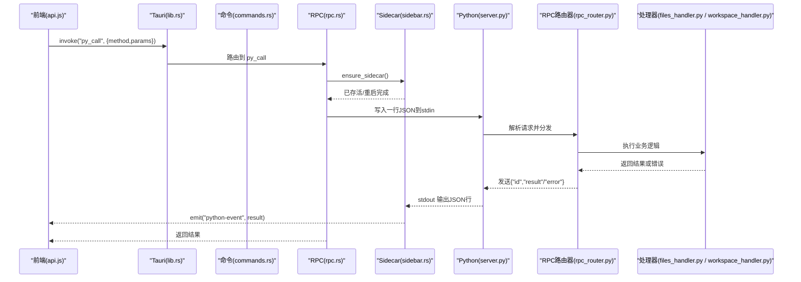
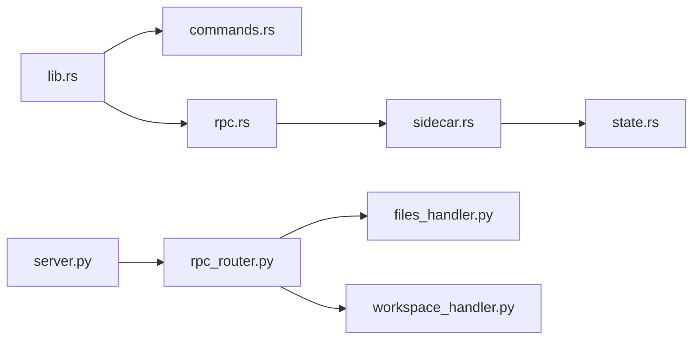
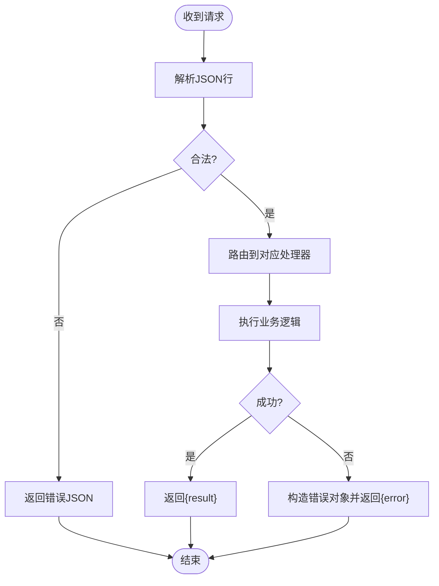

# Tauri 命令接口

<cite>
**本文引用的文件**   
- [src-tauri/src/lib.rs](file://src-tauri/src/lib.rs)
- [src-tauri/src/commands.rs](file://src-tauri/src/commands.rs)
- [src-tauri/src/rpc.rs](file://src-tauri/src/rpc.rs)
- [src-tauri/src/sidecar.rs](file://src-tauri/src/sidecar.rs)
- [src-tauri/src/state.rs](file://src-tauri/src/state.rs)
- [python/main.py](file://python/main.py)
- [python/sidecar/server.py](file://python/sidecar/server.py)
- [python/sidecar/rpc_router.py](file://python/sidecar/rpc_router.py)
- [python/sidecar/handlers/files_handler.py](file://python/sidecar/handlers/files_handler.py)
- [python/sidecar/handlers/workspace_handler.py](file://python/sidecar/handlers/workspace_handler.py)
- [webui/js/api.js](file://webui/js/api.js)
- [src-tauri/tauri.conf.json](file://src-tauri/tauri.conf.json)
- [src-tauri/capabilities/default.json](file://src-tauri/capabilities/default.json)
</cite>

## 目录
1. [简介](#简介)
2. [项目结构](#项目结构)
3. [核心组件](#核心组件)
4. [架构总览](#架构总览)
5. [详细组件分析](#详细组件分析)
6. [依赖关系分析](#依赖关系分析)
7. [性能考量](#性能考量)
8. [故障排除指南](#故障排除指南)
9. [结论](#结论)
10. [附录：命令参考](#附录命令参考)

## 简介
本文件为 NoteAI 的 Tauri 命令接口完整参考文档，覆盖以下方面：
- 所有系统级命令的名称、参数类型、返回值与权限要求
- Rust 侧与 Python sidecar 的进程间通信协议与数据序列化格式
- 前端如何调用这些命令（JavaScript 绑定与使用示例）
- 命令执行上下文、状态管理与错误处理
- 安全模型、权限验证与资源访问控制
- 调试方法与故障排除指南

## 项目结构
NoteAI 采用“Rust(Tauri) + Python(sidecar)”的双进程架构。Rust 负责 UI 窗口、对话框、文件系统访问与能力授权；Python sidecar 通过标准输入输出接收 JSON-RPC 请求并执行业务逻辑，同时通过事件通道向前端推送进度与状态更新。

```mermaid
graph TB
subgraph "前端"
FE["webui/js/api.js"]
end
subgraph "Tauri(Rust)"
LIB["lib.rs<br/>注册命令/插件/生命周期"]
CMD["commands.rs<br/>原生命令(对话框/工作区/预览窗口)"]
RPC["rpc.rs<br/>py_call 转发与白名单"]
SC["sidecar.rs<br/>启动/重启/读写子进程"]
ST["state.rs<br/>全局状态与请求映射"]
end
subgraph "Python Sidecar"
PM["python/main.py<br/>入口"]
SRV["server.py<br/>SidecarServer/路由/事件"]
RR["rpc_router.py<br/>RPC 路由器/线程池"]
FH["handlers/files_handler.py"]
WH["handlers/workspace_handler.py"]
end
FE --> |invoke('py_call')| RPC
FE --> |invoke('open_*_dialog'/'set_workspace_path'等)| CMD
RPC --> SC
SC --> PM
PM --> SRV
SRV --> RR
RR --> FH
RR --> WH
```

图表来源
- [src-tauri/src/lib.rs:10-49](file://src-tauri/src/lib.rs#L10-L49)
- [src-tauri/src/commands.rs:107-246](file://src-tauri/src/commands.rs#L107-L246)
- [src-tauri/src/rpc.rs:273-284](file://src-tauri/src/rpc.rs#L273-L284)
- [src-tauri/src/sidecar.rs:215-311](file://src-tauri/src/sidecar.rs#L215-L311)
- [src-tauri/src/state.rs:9-47](file://src-tauri/src/state.rs#L9-L47)
- [python/main.py:17-21](file://python/main.py#L17-L21)
- [python/sidecar/server.py:570-595](file://python/sidecar/server.py#L570-L595)
- [python/sidecar/rpc_router.py:43-106](file://python/sidecar/rpc_router.py#L43-L106)
- [python/sidecar/handlers/files_handler.py:42-106](file://python/sidecar/handlers/files_handler.py#L42-L106)
- [python/sidecar/handlers/workspace_handler.py:34-105](file://python/sidecar/handlers/workspace_handler.py#L34-L105)

章节来源
- [src-tauri/src/lib.rs:10-49](file://src-tauri/src/lib.rs#L10-L49)
- [src-tauri/src/commands.rs:107-246](file://src-tauri/src/commands.rs#L107-L246)
- [src-tauri/src/rpc.rs:273-284](file://src-tauri/src/rpc.rs#L273-L284)
- [src-tauri/src/sidecar.rs:215-311](file://src-tauri/src/sidecar.rs#L215-L311)
- [src-tauri/src/state.rs:9-47](file://src-tauri/src/state.rs#L9-L47)
- [python/main.py:17-21](file://python/main.py#L17-L21)
- [python/sidecar/server.py:570-595](file://python/sidecar/server.py#L570-L595)
- [python/sidecar/rpc_router.py:43-106](file://python/sidecar/rpc_router.py#L43-L106)
- [python/sidecar/handlers/files_handler.py:42-106](file://python/sidecar/handlers/files_handler.py#L42-L106)
- [python/sidecar/handlers/workspace_handler.py:34-105](file://python/sidecar/handlers/workspace_handler.py#L34-L105)

## 核心组件
- Tauri 命令层（commands.rs）
  - 提供原生能力：打开文件夹/文件对话框、获取/设置工作区路径、读取/写入/列出文件、在新窗口中打开文件预览等。
  - 对路径进行规范化与工作区边界校验，防止越权访问。
- RPC 桥接层（rpc.rs）
  - 暴露 py_call 命令，维护允许方法白名单，封装一次请求/响应语义，包含超时与管道异常自动恢复。
- Sidecar 管理（sidecar.rs）
  - 查找 Python 解释器、启动/重启 Python 子进程、监听 stdout/stderr、将事件广播到前端、在意外退出时清理状态。
- 全局状态（state.rs）
  - 保存 Python 子进程句柄、stdin 写端、待处理请求映射表、工作区路径与应用句柄。
- Python 侧服务（server.py, rpc_router.py）
  - 基于 stdin/stdout 的 JSON 行协议，按 method 分发到各 Handler，统一错误码与消息清洗，支持异步任务与事件推送。
- 前端绑定（api.js）
  - 封装 invoke 调用、重试策略、特殊 API（对话框、分页预览）、批量生成 API 函数，并通过 window.api 暴露。

章节来源
- [src-tauri/src/commands.rs:78-246](file://src-tauri/src/commands.rs#L78-L246)
- [src-tauri/src/rpc.rs:4-167](file://src-tauri/src/rpc.rs#L4-L167)
- [src-tauri/src/sidecar.rs:26-107](file://src-tauri/src/sidecar.rs#L26-L107)
- [src-tauri/src/state.rs:9-47](file://src-tauri/src/state.rs#L9-L47)
- [python/sidecar/server.py:54-125](file://python/sidecar/server.py#L54-L125)
- [python/sidecar/rpc_router.py:43-106](file://python/sidecar/rpc_router.py#L43-L106)
- [webui/js/api.js:61-90](file://webui/js/api.js#L61-L90)

## 架构总览
下图展示了从前端到后端的一次典型调用流程，包括命令注册、RPC 转发、子进程通信与事件回推。



图表来源
- [src-tauri/src/lib.rs:39-49](file://src-tauri/src/lib.rs#L39-L49)
- [src-tauri/src/rpc.rs:247-284](file://src-tauri/src/rpc.rs#L247-L284)
- [src-tauri/src/sidecar.rs:215-311](file://src-tauri/src/sidecar.rs#L215-L311)
- [python/sidecar/server.py:570-595](file://python/sidecar/server.py#L570-L595)
- [python/sidecar/rpc_router.py:54-83](file://python/sidecar/rpc_router.py#L54-L83)
- [python/sidecar/handlers/files_handler.py:42-106](file://python/sidecar/handlers/files_handler.py#L42-L106)
- [python/sidecar/handlers/workspace_handler.py:34-105](file://python/sidecar/handlers/workspace_handler.py#L34-L105)

## 详细组件分析

### 原生命令（commands.rs）
- open_folder_dialog
  - 参数：无
  - 返回：可选字符串（所选文件夹路径）
  - 权限：dialog:default/dialog:allow-open
- open_file_dialog
  - 参数：无
  - 返回：可选字符串数组（所选文件路径列表）
  - 权限：dialog:default/dialog:allow-open
- get_workspace_path
  - 参数：无
  - 返回：可选字符串（当前工作区绝对路径）
- set_workspace_path
  - 参数：path(String)
  - 返回：空或错误
  - 说明：仅存储于 Rust 状态，实际持久化由 Python 侧完成
- read_file / write_file / list_dir
  - 参数：path(String)，write_file 额外 content(String)
  - 返回：read_file 返回文本；write_file 成功/错误；list_dir 返回条目数组
  - 安全：路径经 normalize 与 canonicalize 后校验是否位于工作区内
- open_file_in_new_window
  - 参数：path(String), name(可选 String)
  - 返回：空或错误
  - 行为：创建新 WebviewWindow，注入 __PREVIEW_FILE_PATH__ 与 __IS_PREVIEW_WINDOW__ 变量

章节来源
- [src-tauri/src/commands.rs:107-246](file://src-tauri/src/commands.rs#L107-L246)
- [src-tauri/capabilities/default.json:6-48](file://src-tauri/capabilities/default.json#L6-L48)

### RPC 桥接（rpc.rs）
- py_call
  - 参数：method(String), params(JSON)
  - 返回：JSON（业务结果或错误对象）
  - 白名单：ALLOWED_PYTHON_METHODS 严格限定可调用方法
  - 超时：不同方法有不同超时秒数（如 rag_chat 60s，索引相关 120s）
  - 自愈：检测到 Broken pipe 或未运行会尝试重启 sidecar 并重试一次

章节来源
- [src-tauri/src/rpc.rs:4-167](file://src-tauri/src/rpc.rs#L4-L167)
- [src-tauri/src/rpc.rs:247-284](file://src-tauri/src/rpc.rs#L247-L284)

### Sidecar 管理（sidecar.rs）
- 启动流程
  - 查找 Python 解释器（环境变量、打包资源、本地 venv、PATH）
  - 解析 main.py 脚本位置（资源包或开发路径）
  - 设置 HF/HuggingFace 缓存目录与环境变量
  - 启动子进程，分离 stdout/stderr 读取协程
- 事件与响应
  - stdout 每行解析为 PyResponse；id="event" 的事件直接 emit 到前端
  - 普通响应通过 pending_requests 的 oneshot channel 回传
- 健康检查与重启
  - is_sidecar_alive 检测 stdin 是否存在且未处于重启中
  - restart_python_sidecar 串行化重启，避免并发重启竞争
  - 意外退出时清理句柄并通知前端

章节来源
- [src-tauri/src/sidecar.rs:109-213](file://src-tauri/src/sidecar.rs#L109-L213)
- [src-tauri/src/sidecar.rs:215-311](file://src-tauri/src/sidecar.rs#L215-L311)
- [src-tauri/src/state.rs:9-47](file://src-tauri/src/state.rs#L9-L47)

### Python 侧服务（server.py, rpc_router.py）
- 主循环
  - 逐行读取 stdin JSON，交由 RpcRouter.handle 分发
  - 统一捕获异常，返回结构化错误
- 路由与线程池
  - RpcRouter 维护 method -> handler 映射
  - 所有处理器提交至线程池执行，避免阻塞 I/O 读循环
- 事件机制
  - _send_response 以 JSON 行形式写入 stdout
  - 进度/作业状态/工作区变更等事件通过 id="event" 推送
- 处理器示例
  - files_handler：文件预览（含大文件 raw_slices 分片）、保存内容、原始读取、Finder 显示等
  - workspace_handler：工作区状态、树构建、路径有效性检查、清除/设置工作区等

章节来源
- [python/sidecar/server.py:570-595](file://python/sidecar/server.py#L570-L595)
- [python/sidecar/rpc_router.py:43-106](file://python/sidecar/rpc_router.py#L43-L106)
- [python/sidecar/handlers/files_handler.py:42-106](file://python/sidecar/handlers/files_handler.py#L42-L106)
- [python/sidecar/handlers/workspace_handler.py:34-105](file://python/sidecar/handlers/workspace_handler.py#L34-L105)

### 前端绑定（api.js）
- 通用调用
  - pyCall(method, params, options)：封装 invoke('py_call', ...)，带重试与错误翻译
- 特殊 API
  - openWorkspace/addFiles/importFilesToWorkspace/browseFolder：组合 Tauri 对话框与 py_call
  - getFilePreview：支持 raw_slices 分片拼接与语义预览回退
  - openFileInNewWindow：直接调用 Tauri 原生命令
- 批量注册
  - API_DEFS 定义大量方法名到 Python method 的映射，createApiFunction 生成统一包装

章节来源
- [webui/js/api.js:61-90](file://webui/js/api.js#L61-L90)
- [webui/js/api.js:170-248](file://webui/js/api.js#L170-L248)
- [webui/js/api.js:324-465](file://webui/js/api.js#L324-L465)

## 依赖关系分析
- 模块耦合
  - lib.rs 集中注册命令与插件，低耦合高内聚
  - commands.rs 仅依赖 state 与 Tauri 插件
  - rpc.rs 依赖 sidecar 与 state，屏蔽底层进程细节
  - sidecar.rs 独立管理子进程生命周期
  - Python 侧 server.py 聚合各 handler，通过 router 解耦
- 外部依赖
  - Tauri 插件：dialog、shell
  - 能力配置：capabilities/default.json 声明窗口与插件权限
  - CSP 与安全策略：tauri.conf.json



图表来源
- [src-tauri/src/lib.rs:10-49](file://src-tauri/src/lib.rs#L10-L49)
- [src-tauri/src/commands.rs:107-246](file://src-tauri/src/commands.rs#L107-L246)
- [src-tauri/src/rpc.rs:247-284](file://src-tauri/src/rpc.rs#L247-L284)
- [src-tauri/src/sidecar.rs:215-311](file://src-tauri/src/sidecar.rs#L215-L311)
- [src-tauri/src/state.rs:9-47](file://src-tauri/src/state.rs#L9-L47)
- [python/sidecar/server.py:54-125](file://python/sidecar/server.py#L54-L125)
- [python/sidecar/rpc_router.py:43-106](file://python/sidecar/rpc_router.py#L43-L106)
- [python/sidecar/handlers/files_handler.py:42-106](file://python/sidecar/handlers/files_handler.py#L42-L106)
- [python/sidecar/handlers/workspace_handler.py:34-105](file://python/sidecar/handlers/workspace_handler.py#L34-L105)

章节来源
- [src-tauri/tauri.conf.json:23-46](file://src-tauri/tauri.conf.json#L23-L46)
- [src-tauri/capabilities/default.json:1-49](file://src-tauri/capabilities/default.json#L1-L49)

## 性能考量
- 长耗时操作
  - RAG 聊天、索引重建、导入等通过事件流式反馈，避免阻塞前端
  - RPC 层针对不同方法设置合理超时，减少挂起等待
- 并发与线程池
  - Python 侧使用线程池并行处理请求，避免单线程瓶颈
- 大文件预览
  - 支持 raw_slices 分片传输，前端按需拉取，降低内存占用
- 缓存与失效
  - Python 侧 TTL 缓存与全文检索缓存随工作区变更失效，保证一致性

[本节为通用指导，不直接分析具体文件]

## 故障排除指南
- Python 后端不可用
  - 现象：调用 py_call 报“后端未运行”或“Broken pipe”
  - 排查：确认 find_python 能找到解释器；检查 NOTEAI_PYTHON 环境变量；查看 stderr 日志
  - 自愈：RPC 层检测到管道异常会自动重启 sidecar 并重试一次
- 工作区路径无效
  - 现象：read/write/list 报错“路径在工作区外”或“工作区未设置”
  - 排查：先调用 set_workspace_path 设置有效路径；确保路径存在且可读
- 大文件预览失败
  - 现象：raw_slices 拉取中断或拼接失败
  - 排查：检查 total_byte_size 与 next_byte_offset 是否正确递增；必要时回退到语义预览
- 事件未到达前端
  - 现象：进度条不动或 workspace_files_changed 未触发
  - 排查：确认 stdout 正常输出 JSON 行；检查前端 python-event 监听是否注册

章节来源
- [src-tauri/src/rpc.rs:169-188](file://src-tauri/src/rpc.rs#L169-L188)
- [src-tauri/src/sidecar.rs:57-107](file://src-tauri/src/sidecar.rs#L57-L107)
- [src-tauri/src/commands.rs:78-105](file://src-tauri/src/commands.rs#L78-L105)
- [python/sidecar/server.py:570-595](file://python/sidecar/server.py#L570-L595)
- [webui/js/api.js:131-153](file://webui/js/api.js#L131-L153)

## 结论
NoteAI 的 Tauri 命令接口通过严格的白名单与路径校验保障安全，借助 JSON 行协议实现跨语言高效通信，并以事件驱动提升用户体验。合理的超时、重试与自愈机制增强了鲁棒性。建议在生产环境中固定 Python 环境路径、启用最小权限原则，并对大文件预览采用分片策略。

[本节为总结，不直接分析具体文件]

## 附录：命令参考

### 原生命令（Tauri）
- open_folder_dialog
  - 参数：无
  - 返回：可选字符串
  - 权限：dialog:default/dialog:allow-open
- open_file_dialog
  - 参数：无
  - 返回：可选字符串数组
  - 权限：dialog:default/dialog:allow-open
- get_workspace_path
  - 参数：无
  - 返回：可选字符串
- set_workspace_path
  - 参数：path(String)
  - 返回：空或错误
- read_file
  - 参数：path(String)
  - 返回：字符串或错误
- write_file
  - 参数：path(String), content(String)
  - 返回：空或错误
- list_dir
  - 参数：path(String)
  - 返回：条目数组或错误
- open_file_in_new_window
  - 参数：path(String), name(可选 String)
  - 返回：空或错误

章节来源
- [src-tauri/src/commands.rs:107-246](file://src-tauri/src/commands.rs#L107-L246)
- [src-tauri/capabilities/default.json:6-48](file://src-tauri/capabilities/default.json#L6-L48)

### RPC 命令（py_call）
- 通用签名
  - 参数：method(String), params(JSON)
  - 返回：JSON（success/message/result 或 error 对象）
  - 白名单：见 ALLOWED_PYTHON_METHODS
  - 超时：根据 method 动态设定
- 常用方法（节选）
  - 工作区：get_workspace_status, check_workspace_path_valid, clear_saved_workspace, set_workspace_path, get_workspace_tree, on_file_selected, refresh_log, get_kb_health
  - 文件：get_file_preview, read_preview_raw_slice, can_preview_file, save_file_content, read_file_raw, reveal_in_finder
  - 其他：start_ingest, cancel_ingest, retry_ingest, get_ingest_status, check_ingest_updates, ensure_ingest, get_jobs, get_job, search_files 等

章节来源
- [src-tauri/src/rpc.rs:4-167](file://src-tauri/src/rpc.rs#L4-L167)
- [python/sidecar/handlers/workspace_handler.py:34-105](file://python/sidecar/handlers/workspace_handler.py#L34-L105)
- [python/sidecar/handlers/files_handler.py:42-106](file://python/sidecar/handlers/files_handler.py#L42-L106)

### 进程间通信协议
- 传输方式
  - 标准输入/输出，每行一个 JSON 对象
- 请求格式
  - {"id": 唯一ID, "method": 方法名, "params": JSON}
- 响应格式
  - 成功：{"id": 唯一ID, "result": JSON}
  - 错误：{"id": 唯一ID, "error": 错误对象}
  - 事件：{"id": "event", "result": 事件对象}
- 错误对象
  - 包含 code、message、details 等字段，路径信息会被脱敏



图表来源
- [python/sidecar/server.py:570-595](file://python/sidecar/server.py#L570-L595)
- [python/sidecar/rpc_router.py:54-94](file://python/sidecar/rpc_router.py#L54-L94)

### 前端调用示例（JavaScript）
- 通用调用
  - await api.invoke('rag_chat', { question, topics, tags, current_file, history })
- 工作区选择
  - const r = await api.openWorkspace(); // 内部组合对话框与 set_workspace_path
- 文件预览
  - const p = await api.getFilePreview(path); // 自动处理 raw_slices 分片
- 新建窗口预览
  - await api.openFileInNewWindow(path, '预览');

章节来源
- [webui/js/api.js:61-90](file://webui/js/api.js#L61-L90)
- [webui/js/api.js:170-248](file://webui/js/api.js#L170-L248)
- [webui/js/api.js:304-313](file://webui/js/api.js#L304-L313)

### 安全模型与权限
- 能力与权限
  - capabilities/default.json 声明窗口与插件权限（core/window、dialog、shell）
- CSP 限制
  - tauri.conf.json 中定义 CSP，限制脚本、样式、连接源等
- 路径安全
  - Rust 侧对路径进行规范化与根路径校验，禁止越界访问
  - Python 侧对敏感目录进行保护（如 .noteai、.git 等），拒绝写入
- 方法白名单
  - 仅 ALLOWED_PYTHON_METHODS 中的方法可通过 py_call 调用

章节来源
- [src-tauri/capabilities/default.json:1-49](file://src-tauri/capabilities/default.json#L1-L49)
- [src-tauri/tauri.conf.json:23-46](file://src-tauri/tauri.conf.json#L23-L46)
- [src-tauri/src/commands.rs:78-105](file://src-tauri/src/commands.rs#L78-L105)
- [python/sidecar/handlers/files_handler.py:117-149](file://python/sidecar/handlers/files_handler.py#L117-L149)
- [src-tauri/src/rpc.rs:4-157](file://src-tauri/src/rpc.rs#L4-L157)