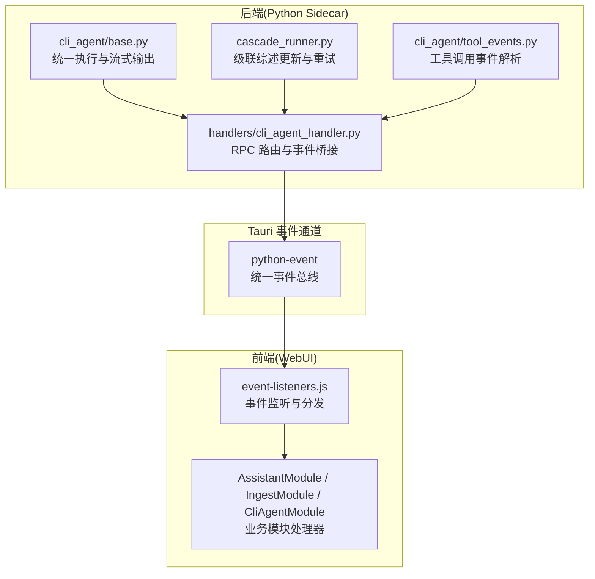
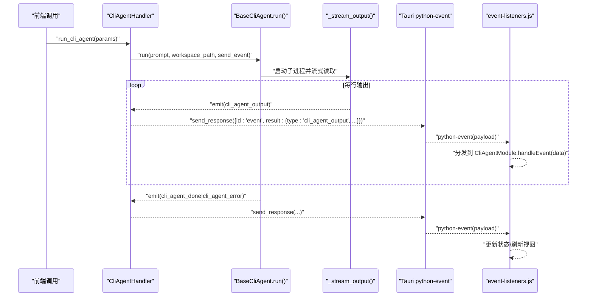
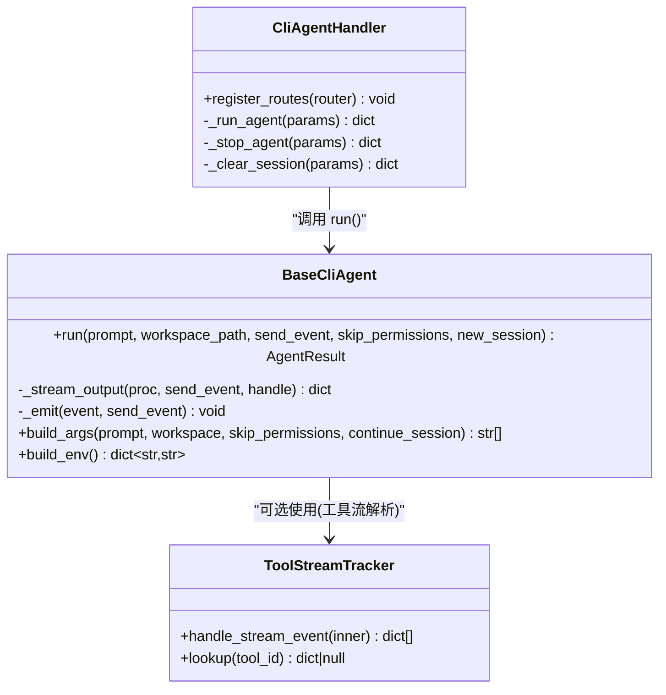
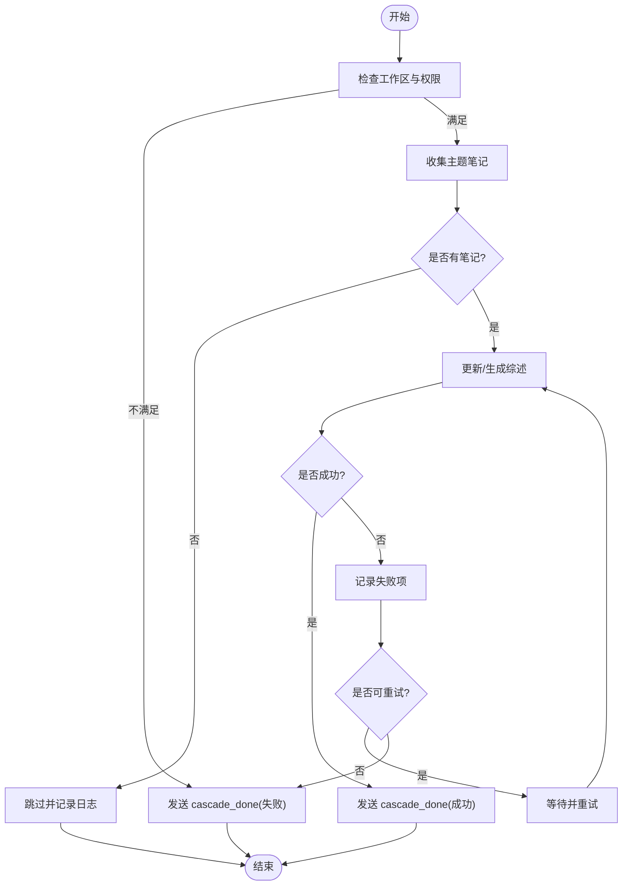
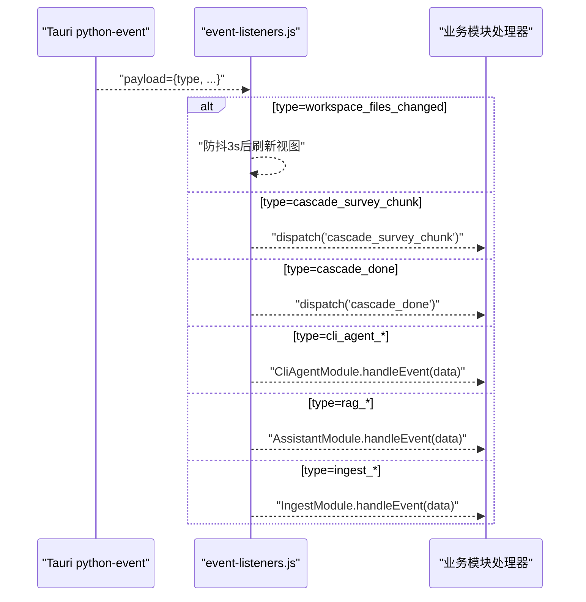
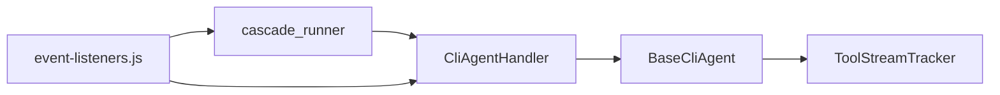

# 事件系统

<cite>
**本文引用的文件**
- [python/sidecar/cli_agent/tool_events.py](file://python/sidecar/cli_agent/tool_events.py)
- [python/sidecar/handlers/cli_agent_handler.py](file://python/sidecar/handlers/cli_agent_handler.py)
- [python/sidecar/cli_agent/base.py](file://python/sidecar/cli_agent/base.py)
- [python/sidecar/cascade_runner.py](file://python/sidecar/cascade_runner.py)
- [webui/js/event-listeners.js](file://webui/js/event-listeners.js)
</cite>

## 目录
1. [简介](#简介)
2. [项目结构](#项目结构)
3. [核心组件](#核心组件)
4. [架构总览](#架构总览)
5. [详细组件分析](#详细组件分析)
6. [依赖关系分析](#依赖关系分析)
7. [性能与背压](#性能与背压)
8. [错误恢复与重试](#错误恢复与重试)
9. [调试与监控](#调试与监控)
10. [结论](#结论)

## 简介
本文件为 NoteAI 的事件系统提供完整技术文档，围绕事件驱动架构的设计原理、发布订阅模式、消息传递机制与实时通信协议展开。重点覆盖：
- 预定义事件类型（CLI Agent 工具调用、级联综述更新、工作区变更、RAG/任务进度等）
- 事件数据结构、字段含义与生命周期
- 前后端事件监听、分发与处理流程
- 性能优化策略、背压处理与错误恢复机制
- 调试工具与监控方法

## 项目结构
NoteAI 的事件系统贯穿后端 Python Sidecar 与前端 WebUI，通过 Tauri 事件通道进行跨进程通信。关键路径包括：
- 后端事件生产：CLI Agent 执行器、级联综述更新器等模块产生结构化事件
- 事件桥接：Handler 将内部事件包装为统一格式并通过 RPC 发送
- 前端消费：WebUI 监听统一事件通道，按 type 路由到具体模块处理

图表来源
- [python/sidecar/cli_agent/base.py:169-383](file://python/sidecar/cli_agent/base.py#L169-L383)
- [python/sidecar/handlers/cli_agent_handler.py:34-134](file://python/sidecar/handlers/cli_agent_handler.py#L34-L134)
- [python/sidecar/cascade_runner.py:74-153](file://python/sidecar/cascade_runner.py#L74-L153)
- [python/sidecar/cli_agent/tool_events.py:136-151](file://python/sidecar/cli_agent/tool_events.py#L136-L151)
- [webui/js/event-listeners.js:148-246](file://webui/js/event-listeners.js#L148-L246)

章节来源
- [python/sidecar/cli_agent/base.py:169-383](file://python/sidecar/cli_agent/base.py#L169-L383)
- [python/sidecar/handlers/cli_agent_handler.py:34-134](file://python/sidecar/handlers/cli_agent_handler.py#L34-L134)
- [python/sidecar/cascade_runner.py:74-153](file://python/sidecar/cascade_runner.py#L74-L153)
- [python/sidecar/cli_agent/tool_events.py:136-151](file://python/sidecar/cli_agent/tool_events.py#L136-L151)
- [webui/js/event-listeners.js:148-246](file://webui/js/event-listeners.js#L148-L246)

## 核心组件
- CLI Agent 基类与执行器：负责启动外部 CLI 进程、流式读取输出、超时控制、会话管理与事件发射
- CLI Agent Handler：暴露 RPC 接口，管理并发与锁，将内部事件转换为统一事件格式并推送
- 工具事件解析器：从流式 JSON 或消息体中解析 tool_use/tool_result，生成 cli_agent_tool 事件
- 级联综述更新器：对主题综述进行增量更新，支持分块事件、失败持久化与重试
- WebUI 事件监听器：统一监听 python-event，按 type 分发至各业务模块处理

章节来源
- [python/sidecar/cli_agent/base.py:53-168](file://python/sidecar/cli_agent/base.py#L53-L168)
- [python/sidecar/handlers/cli_agent_handler.py:21-166](file://python/sidecar/handlers/cli_agent_handler.py#L21-L166)
- [python/sidecar/cli_agent/tool_events.py:28-151](file://python/sidecar/cli_agent/tool_events.py#L28-L151)
- [python/sidecar/cascade_runner.py:74-219](file://python/sidecar/cascade_runner.py#L74-L219)
- [webui/js/event-listeners.js:1-259](file://webui/js/event-listeners.js#L1-L259)

## 架构总览
事件驱动架构采用“生产者—通道—消费者”模型：
- 生产者：后端模块在关键阶段发射事件（开始、输出、完成、错误、进度等）
- 通道：Tauri 的 python-event 作为统一事件总线，承载所有事件
- 消费者：前端 event-listeners.js 接收后按 type 路由到对应模块处理 UI 状态与交互

图表来源
- [python/sidecar/handlers/cli_agent_handler.py:34-134](file://python/sidecar/handlers/cli_agent_handler.py#L34-L134)
- [python/sidecar/cli_agent/base.py:235-383](file://python/sidecar/cli_agent/base.py#L235-L383)
- [webui/js/event-listeners.js:240-245](file://webui/js/event-listeners.js#L240-L245)

## 详细组件分析

### CLI Agent 事件流与数据结构
- 事件类型
  - cli_agent_start：表示 CLI agent 已启动，包含 agent 标识、名称、命令与会话复用信息
  - cli_agent_output：逐行输出事件，包含 agent 标识与内容片段
  - cli_agent_tool：工具调用事件，包含 phase（start/done）、tool_id、tool、input、success、result 等
  - cli_agent_done：执行成功结束，包含最终输出与会话复用标记
  - cli_agent_error：异常或用户停止，包含错误信息与是否由用户触发
- 关键字段说明
  - agent：agent 唯一标识
  - agent_name：显示名称
  - content：输出文本片段
  - phase：工具调用阶段（start/done）
  - tool_id：工具实例 ID
  - tool：工具名称
  - input：工具输入参数（字典）
  - success：工具调用是否成功
  - result：工具返回结果（截断长度限制）
  - stopped_by_user：是否由用户主动停止
- 生命周期
  - 启动阶段：cli_agent_start → 多次 cli_agent_output → cli_agent_tool(start/done) → cli_agent_done 或 cli_agent_error

图表来源
- [python/sidecar/cli_agent/base.py:53-168](file://python/sidecar/cli_agent/base.py#L53-L168)
- [python/sidecar/cli_agent/base.py:235-383](file://python/sidecar/cli_agent/base.py#L235-L383)
- [python/sidecar/cli_agent/tool_events.py:28-151](file://python/sidecar/cli_agent/tool_events.py#L28-L151)
- [python/sidecar/handlers/cli_agent_handler.py:34-134](file://python/sidecar/handlers/cli_agent_handler.py#L34-L134)

章节来源
- [python/sidecar/cli_agent/base.py:235-383](file://python/sidecar/cli_agent/base.py#L235-L383)
- [python/sidecar/cli_agent/tool_events.py:101-151](file://python/sidecar/cli_agent/tool_events.py#L101-L151)
- [python/sidecar/handlers/cli_agent_handler.py:61-134](file://python/sidecar/handlers/cli_agent_handler.py#L61-L134)

### 级联综述更新事件
- 事件类型
  - cascade_survey_chunk：分块推进事件，包含 topic 与 token
  - cascade_done：完成事件，包含 success、message、topic 与 data
- 处理逻辑
  - 检查工作区与权限
  - 收集笔记并生成/更新综述
  - 失败持久化与重试
  - 通过 send_response 推送事件

图表来源
- [python/sidecar/cascade_runner.py:74-153](file://python/sidecar/cascade_runner.py#L74-L153)
- [python/sidecar/cascade_runner.py:197-219](file://python/sidecar/cascade_runner.py#L197-L219)

章节来源
- [python/sidecar/cascade_runner.py:74-153](file://python/sidecar/cascade_runner.py#L74-L153)
- [python/sidecar/cascade_runner.py:197-219](file://python/sidecar/cascade_runner.py#L197-L219)

### 前端事件监听与分发
- 统一监听 python-event，按 type 分发：
  - auto_topic_assigned/auto_file_moved/workspace_files_changed：刷新工作区视图与统计
  - sidecar_died/sidecar_ready/sidecar_error：侧车进程状态提示
  - progress/job_update/component_installed：进度与组件安装反馈
  - rag_chat_chunk/rag_chat_done/rag_error/rag_index_built：RAG 聊天与索引构建
  - ingest_progress/ingest_complete/ingest_cascade_started/ingest_cascade_complete：摄取流水线事件
  - cascade_survey_chunk/cascade_done：级联综述事件
  - batch_assign_progress：批量分配进度
  - cli_agent_*：CLI Agent 相关事件，交由 CliAgentModule.handleEvent 处理

图表来源
- [webui/js/event-listeners.js:148-246](file://webui/js/event-listeners.js#L148-L246)

章节来源
- [webui/js/event-listeners.js:1-259](file://webui/js/event-listeners.js#L1-L259)

## 依赖关系分析
- 模块耦合
  - BaseCliAgent 与 ToolStreamTracker：前者负责进程与流式输出，后者解析工具调用事件；二者通过事件回调解耦
  - CliAgentHandler 与 BaseCliAgent：Handler 仅负责并发控制与事件桥接，不关心具体实现细节
  - cascade_runner 与 send_response：通过回调函数推送事件，避免直接依赖传输层
  - WebUI event-listeners.js 与各业务模块：通过 window 全局对象与方法名约定进行松耦合分发
- 外部依赖
  - Tauri 事件通道：python-event 作为统一总线
  - 第三方 CLI Agent：通过 subprocess 启动，事件由 stdout 流式产出

图表来源
- [python/sidecar/cli_agent/base.py:53-168](file://python/sidecar/cli_agent/base.py#L53-L168)
- [python/sidecar/cli_agent/tool_events.py:28-151](file://python/sidecar/cli_agent/tool_events.py#L28-L151)
- [python/sidecar/handlers/cli_agent_handler.py:34-134](file://python/sidecar/handlers/cli_agent_handler.py#L34-L134)
- [python/sidecar/cascade_runner.py:74-153](file://python/sidecar/cascade_runner.py#L74-L153)
- [webui/js/event-listeners.js:148-246](file://webui/js/event-listeners.js#L148-L246)

章节来源
- [python/sidecar/cli_agent/base.py:53-168](file://python/sidecar/cli_agent/base.py#L53-L168)
- [python/sidecar/handlers/cli_agent_handler.py:34-134](file://python/sidecar/handlers/cli_agent_handler.py#L34-L134)
- [python/sidecar/cascade_runner.py:74-153](file://python/sidecar/cascade_runner.py#L74-L153)
- [webui/js/event-listeners.js:148-246](file://webui/js/event-listeners.js#L148-L246)

## 性能与背压
- 防抖与节流
  - 工作区文件变更事件采用 3 秒防抖，避免频繁刷新视图
- 流式输出与缓冲
  - CLI Agent 以行为单位流式读取 stdout，减少内存占用与延迟
- 并发控制
  - CLI Agent 运行互斥锁，防止同一时刻多个 agent 并行导致资源竞争
- 超时与终止
  - 空闲超时与总超时保护，长时间无输出或总时长超限自动终止
- 建议
  - 在前端增加队列与丢弃策略，对高频率事件进行合并或限流
  - 对大体积 payload（如大量输出）考虑分页或压缩

章节来源
- [webui/js/event-listeners.js:35-46](file://webui/js/event-listeners.js#L35-L46)
- [python/sidecar/handlers/cli_agent_handler.py:46-48](file://python/sidecar/handlers/cli_agent_handler.py#L46-L48)
- [python/sidecar/cli_agent/base.py:332-383](file://python/sidecar/cli_agent/base.py#L332-L383)

## 错误恢复与重试
- CLI Agent 错误处理
  - 非零退出码与异常捕获均会发送 cli_agent_error，并标记 stopped_by_user 区分用户停止
  - 会话清理：失败时清除会话状态，避免脏状态影响后续执行
- 级联综述更新
  - 失败项持久化到 cascade_failures.json，支持手动重试
  - 最大重试次数与退避间隔，避免雪崩
- 建议
  - 为关键事件增加幂等性校验，避免重复处理
  - 引入死信队列与告警，便于追踪长期失败的任务

章节来源
- [python/sidecar/cli_agent/base.py:267-331](file://python/sidecar/cli_agent/base.py#L267-L331)
- [python/sidecar/cascade_runner.py:112-153](file://python/sidecar/cascade_runner.py#L112-L153)
- [python/sidecar/cascade_runner.py:187-195](file://python/sidecar/cascade_runner.py#L187-L195)

## 调试与监控
- 后端日志
  - 使用 logger 记录命令解析、启动、输出与异常，便于定位问题
- 前端控制台
  - event-listeners.js 在多处 console.warn/console.error 输出关键路径
- 状态栏与提示
  - 通过 updateStatus 与 CustomEvent 向 UI 反馈进度与错误
- 建议
  - 增加事件审计日志，记录 type、payload 摘要与时间戳
  - 提供开关以启用详细事件追踪，便于线上诊断

章节来源
- [python/sidecar/cli_agent/base.py:186-234](file://python/sidecar/cli_agent/base.py#L186-L234)
- [webui/js/event-listeners.js:114-146](file://webui/js/event-listeners.js#L114-L146)

## 结论
NoteAI 的事件系统以 Tauri python-event 为核心总线，结合后端模块化事件生产与前端统一分发，实现了高内聚、低耦合的实时通信能力。通过流式输出、防抖、超时与重试等机制，系统在性能与可靠性之间取得平衡。未来可在事件审计、背压控制与可视化监控方面进一步增强，以提升可观测性与用户体验。