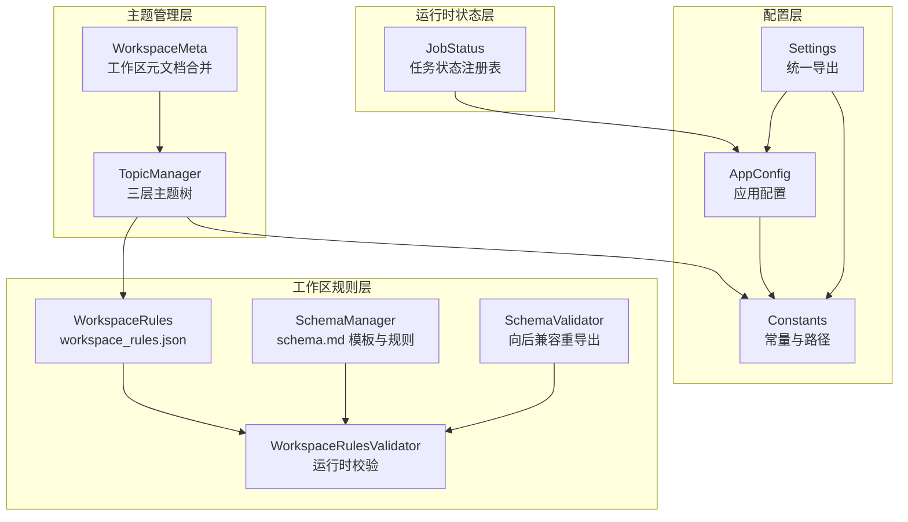
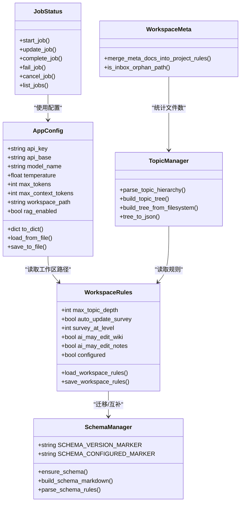
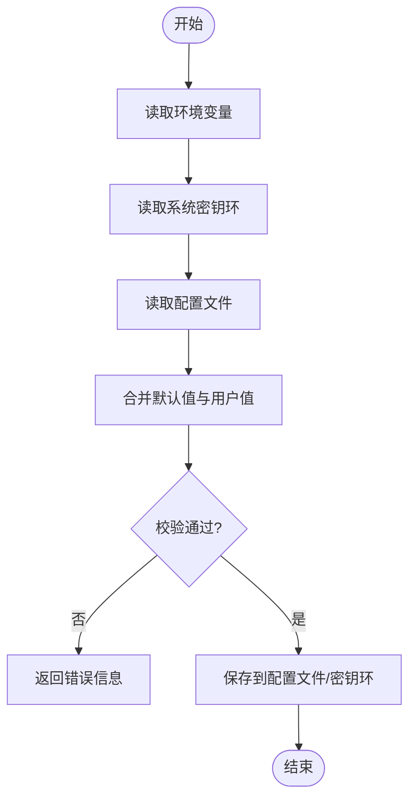
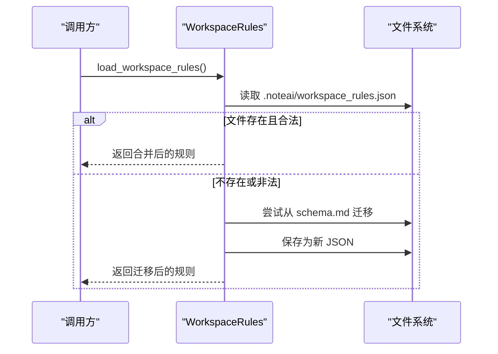
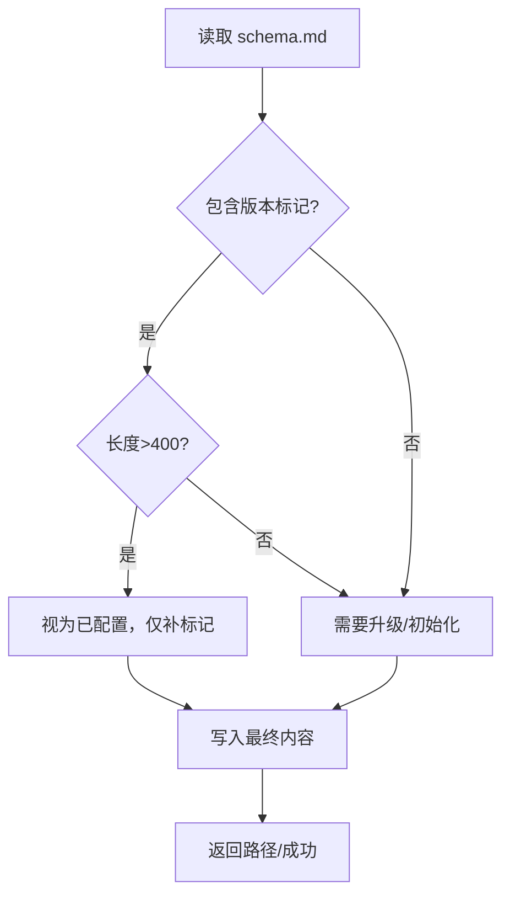
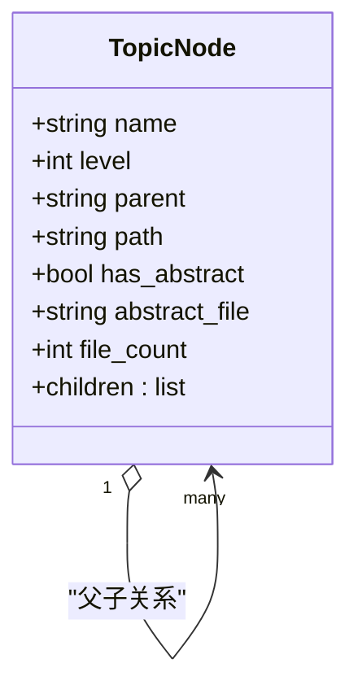
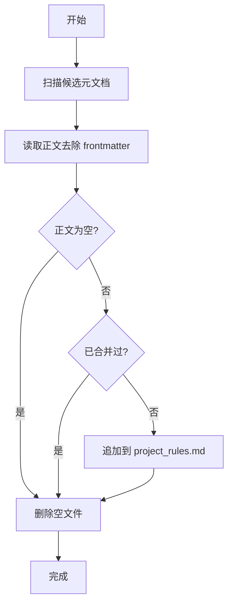
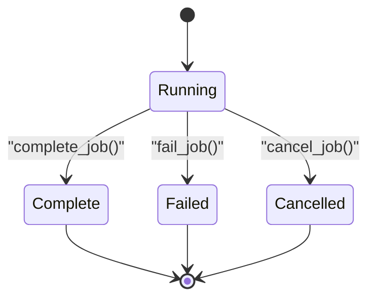
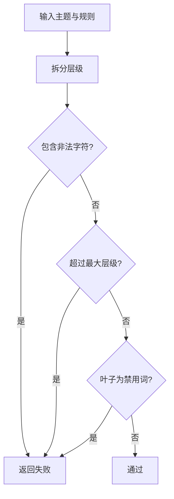
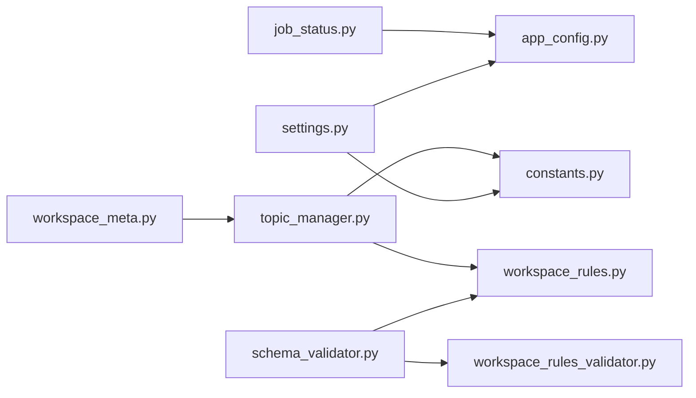

# 数据模型

<cite>
**本文引用的文件**   
- [app_config.py](file://config/app_config.py)
- [constants.py](file://config/constants.py)
- [settings.py](file://config/settings.py)
- [workspace_rules.py](file://python/sidecar/workspace_rules.py)
- [workspace_rules_validator.py](file://python/sidecar/workspace_rules_validator.py)
- [schema_manager.py](file://python/sidecar/schema_manager.py)
- [schema_validator.py](file://python/sidecar/schema_validator.py)
- [topic_manager.py](file://utils/topic_manager.py)
- [job_status.py](file://python/sidecar/job_status.py)
- [workspace_meta.py](file://python/sidecar/workspace_meta.py)
</cite>

## 目录
1. [简介](#简介)
2. [项目结构](#项目结构)
3. [核心组件](#核心组件)
4. [架构总览](#架构总览)
5. [详细组件分析](#详细组件分析)
6. [依赖关系分析](#依赖关系分析)
7. [性能考虑](#性能考虑)
8. [故障排查指南](#故障排查指南)
9. [结论](#结论)
10. [附录](#附录)

## 简介
本参考文档聚焦 NoteAI 的核心数据模型，覆盖工作区元数据、主题层次结构、任务状态、配置对象等关键数据结构。文档说明每个字段的类型、约束与业务含义，描述数据之间的关系映射、继承结构与组合模式，并提供序列化/反序列化规则（含 JSON 规范与版本兼容）、验证规则与完整性约束、迁移策略、备份恢复机制以及性能优化建议。文末提供可视化图表与实际使用示例路径，帮助读者快速理解与落地。

## 项目结构
NoteAI 的数据模型分布在配置层、工作区规则层、主题管理层与运行时状态层：
- 配置层：应用配置与工作区常量定义
- 工作区规则层：schema.md 与工作区规则 JSON 的加载、解析与校验
- 主题管理层：三层主题树构建、文件系统映射与序列化
- 运行时状态层：后台任务状态注册表与工作区元数据合并

图示来源
- [app_config.py:1-396](file://config/app_config.py#L1-L396)
- [constants.py:1-52](file://config/constants.py#L1-L52)
- [settings.py:1-41](file://config/settings.py#L1-L41)
- [workspace_rules.py:1-200](file://python/sidecar/workspace_rules.py#L1-L200)
- [schema_manager.py:1-307](file://python/sidecar/schema_manager.py#L1-L307)
- [schema_validator.py:1-15](file://python/sidecar/schema_validator.py#L1-L15)
- [workspace_rules_validator.py:1-94](file://python/sidecar/workspace_rules_validator.py#L1-L94)
- [topic_manager.py:1-485](file://utils/topic_manager.py#L1-L485)
- [workspace_meta.py:1-121](file://python/sidecar/workspace_meta.py#L1-L121)
- [job_status.py:1-189](file://python/sidecar/job_status.py#L1-L189)

章节来源
- [app_config.py:1-396](file://config/app_config.py#L1-L396)
- [constants.py:1-52](file://config/constants.py#L1-L52)
- [settings.py:1-41](file://config/settings.py#L1-L41)
- [workspace_rules.py:1-200](file://python/sidecar/workspace_rules.py#L1-L200)
- [schema_manager.py:1-307](file://python/sidecar/schema_manager.py#L1-L307)
- [schema_validator.py:1-15](file://python/sidecar/schema_validator.py#L1-L15)
- [workspace_rules_validator.py:1-94](file://python/sidecar/workspace_rules_validator.py#L1-L94)
- [topic_manager.py:1-485](file://utils/topic_manager.py#L1-L485)
- [workspace_meta.py:1-121](file://python/sidecar/workspace_meta.py#L1-L121)
- [job_status.py:1-189](file://python/sidecar/job_status.py#L1-L189)

## 核心组件
本节概述各核心数据模型的职责与关键字段，后续章节将深入展开。

- 应用配置 AppConfig
  - 作用：集中管理 API、RAG、UI、下载、集成等全局配置；负责从环境变量、系统密钥环与配置文件加载与持久化。
  - 关键字段：api_key、api_base、model_name、temperature、max_tokens、max_context_tokens、workspace_path、theme、locale、rag_* 系列开关与阈值等。
  - 约束：API 配置范围校验、上下文长度估算与处理、线程安全读写。

- 工作区规则 WorkspaceRules
  - 作用：以 JSON 形式存储工作区组织规则（如最大层级、是否自动更新综述、AI 可写范围等），并支持从旧 schema.md 迁移。
  - 关键字段：max_topic_depth、auto_update_survey、survey_at_level、ai_may_edit_wiki、ai_may_edit_notes、configured。
  - 约束：数值范围钳制、布尔规范化、缺失字段合并默认值。

- Schema 管理器 SchemaManager
  - 作用：维护 schema.md 模板与版本标记，生成/保存工作区规则摘要，提供 LLM 提示片段。
  - 关键字段：SCHEMA_VERSION_MARKER、SCHEMA_CONFIGURED_MARKER、模板内容。
  - 行为：检测是否需要升级或初始化，补齐版本与已配置标记。

- 主题管理器 TopicManager
  - 作用：解析 frontmatter 中的 topic 层级，构建三层主题树，从文件系统扫描同步真实目录结构，提供序列化到前端 JSON。
  - 关键字段：name、level、parent、children、path、has_abstract、abstract_file、file_count。
  - 约束：最多三级、父子关系一致性、综述互斥规则。

- 工作区元数据 WorkspaceMeta
  - 作用：合并 AGENTS/CLAUDE/GEMINI 等元文档至 .ai_memory/project_rules.md，清理空源文件，识别 Inbox 孤儿路径。
  - 行为：按约定文件名扫描、去重、写入合并结果。

- 任务状态 JobStatus
  - 作用：内存中维护后台任务的状态快照，支持进度、消息、错误、时间戳与事件推送。
  - 关键字段：id、kind、label、status、progress、message、metadata、created_at、updated_at、finished_at、error。
  - 约束：状态机（running → complete/failed/cancelled）、进度归一化、容量上限裁剪。

章节来源
- [app_config.py:1-396](file://config/app_config.py#L1-L396)
- [workspace_rules.py:1-200](file://python/sidecar/workspace_rules.py#L1-L200)
- [schema_manager.py:1-307](file://python/sidecar/schema_manager.py#L1-L307)
- [topic_manager.py:1-485](file://utils/topic_manager.py#L1-L485)
- [workspace_meta.py:1-121](file://python/sidecar/workspace_meta.py#L1-L121)
- [job_status.py:1-189](file://python/sidecar/job_status.py#L1-L189)

## 架构总览
下图展示数据模型之间的交互与依赖关系，包括配置加载、规则解析、主题树构建与任务状态流转。

图示来源
- [app_config.py:1-396](file://config/app_config.py#L1-L396)
- [workspace_rules.py:1-200](file://python/sidecar/workspace_rules.py#L1-L200)
- [schema_manager.py:1-307](file://python/sidecar/schema_manager.py#L1-L307)
- [topic_manager.py:1-485](file://utils/topic_manager.py#L1-L485)
- [workspace_meta.py:1-121](file://python/sidecar/workspace_meta.py#L1-L121)
- [job_status.py:1-189](file://python/sidecar/job_status.py#L1-L189)

## 详细组件分析

### 应用配置 AppConfig
- 字段类型与约束
  - 字符串类：api_key、api_base、model_name、workspace_path、theme、locale 等
  - 数值类：temperature(0.0~2.0)、max_tokens(100~128000)、max_context_tokens(1000~1000000)
  - 布尔类：disable_thinking、web_ai_assist、rag_enabled 等
  - 字典类：typography
- 业务含义
  - API 相关：用于调用大模型服务，包含密钥、基地址、模型名、温度与 token 限制
  - RAG 相关：混合检索权重、Top-K、重排阈值、错误冷却等
  - UI 相关：主题、字体、窗口尺寸
  - 工作区：Notes/wiki/Raw/.noteai 等目录路径派生
- 序列化/反序列化
  - 加载顺序：环境变量 > 系统密钥环 > API 配置文件 > 主配置文件 > 默认值
  - 保存策略：非敏感字段写入主配置文件，敏感字段优先写入系统密钥环，剩余 API 字段写入系统目录下的独立文件
  - 线程安全：内部锁保护属性读写
- 校验逻辑
  - validate_api_config：检查 API key 格式、必填项与取值范围
  - validate_context_config：检查上下文 token 范围
  - check_content_within_context：估算 token 并根据阈值进行摘要/截断

图示来源
- [app_config.py:212-311](file://config/app_config.py#L212-L311)
- [app_config.py:313-383](file://config/app_config.py#L313-L383)
- [app_config.py:176-210](file://config/app_config.py#L176-L210)

章节来源
- [app_config.py:1-396](file://config/app_config.py#L1-L396)

### 工作区规则 WorkspaceRules
- 数据结构
  - max_topic_depth：主题最大层级（1~3）
  - auto_update_survey：是否自动更新综述
  - survey_at_level：综述粒度（1=一级，2=二级）
  - ai_may_edit_wiki：允许 AI 编辑 wiki
  - ai_may_edit_notes：允许 AI 编辑 Notes 正文
  - configured：是否已完成设置
- 文件位置
  - .noteai/workspace_rules.json
- 迁移策略
  - 若存在旧版 schema.md，则提取规则并迁移为 JSON，同时写入“已配置”标记
- 校验与规范化
  - 数值范围钳制、布尔规范化、缺失字段合并默认值

图示来源
- [workspace_rules.py:59-92](file://python/sidecar/workspace_rules.py#L59-L92)
- [workspace_rules.py:32-56](file://python/sidecar/workspace_rules.py#L32-L56)

章节来源
- [workspace_rules.py:1-200](file://python/sidecar/workspace_rules.py#L1-L200)

### Schema 管理器 SchemaManager
- 作用
  - 维护 schema.md 模板与版本标记
  - 检测是否需要升级或初始化
  - 生成/保存工作区规则摘要与 LLM 提示片段
- 关键字段
  - SCHEMA_VERSION_MARKER：版本标记
  - SCHEMA_CONFIGURED_MARKER：已配置标记
- 行为
  - ensure_schema：兼容旧命名并保证文件存在
  - finalize_schema_content：补齐版本与已配置标记
  - build_schema_markdown：根据选项生成 Markdown 内容
  - parse_schema_rules：轻量解析规则标志供运行时使用

图示来源
- [schema_manager.py:94-123](file://python/sidecar/schema_manager.py#L94-L123)
- [schema_manager.py:85-92](file://python/sidecar/schema_manager.py#L85-L92)
- [schema_manager.py:207-272](file://python/sidecar/schema_manager.py#L207-L272)

章节来源
- [schema_manager.py:1-307](file://python/sidecar/schema_manager.py#L1-L307)

### 主题管理器 TopicManager
- 数据结构
  - 节点字段：name、level、parent、children、path、has_abstract、abstract_file、file_count
  - 层级：Level 1（领域）、Level 2（方向）、Level 3（子题），最多三级
- 核心能力
  - parse_topic_hierarchy：从 frontmatter 解析层级
  - build_topic_tree：扁平条目构建嵌套树
  - build_tree_from_filesystem：基于 Notes/ 目录扫描构建权威树
  - tree_to_json：序列化为前端友好结构
- 约束与校验
  - 父子关系一致性
  - 综述互斥：一级与二级不能同时有综述；三级不支持综述
  - 删除保护：一级需无二级才可删除；二级可级联删除其下三级

图示来源
- [topic_manager.py:114-179](file://utils/topic_manager.py#L114-L179)
- [topic_manager.py:377-426](file://utils/topic_manager.py#L377-L426)
- [topic_manager.py:446-484](file://utils/topic_manager.py#L446-L484)

章节来源
- [topic_manager.py:1-485](file://utils/topic_manager.py#L1-L485)

### 工作区元数据 WorkspaceMeta
- 作用
  - 合并 AGENTS/CLAUDE/GEMINI 元文档至 .ai_memory/project_rules.md
  - 清理空源文件，避免重复合并
  - 识别 Inbox 孤儿路径（根或 Notes/ 根下的孤立 Markdown）
- 行为
  - merge_meta_docs_into_project_rules：扫描候选文件、去重、拼接区块、写入合并结果
  - is_inbox_orphan_path：判断是否为未归类入站文件

图示来源
- [workspace_meta.py:46-98](file://python/sidecar/workspace_meta.py#L46-L98)
- [workspace_meta.py:101-121](file://python/sidecar/workspace_meta.py#L101-L121)

章节来源
- [workspace_meta.py:1-121](file://python/sidecar/workspace_meta.py#L1-L121)

### 任务状态 JobStatus
- 数据结构
  - id、kind、label、status、progress、message、metadata、created_at、updated_at、finished_at、error
- 状态机
  - running → complete / failed / cancelled
- 特性
  - 线程安全、最近 N 条保留、进度归一化、可选事件推送

图示来源
- [job_status.py:35-165](file://python/sidecar/job_status.py#L35-L165)

章节来源
- [job_status.py:1-189](file://python/sidecar/job_status.py#L1-L189)

### 工作区规则校验器 WorkspaceRulesValidator
- 作用
  - 运行时强制校验工作区规则与主题合法性
- 主要函数
  - validate_topic：主题名称合法性、层级限制、禁止叶子为“其他/杂项/未分类”
  - check_wiki_writable / check_notes_writable：依据规则判断 AI 可写范围
  - require_topic：前置规则就绪与主题校验
  - allows_wiki_edit：便捷查询是否允许编辑 wiki

图示来源
- [workspace_rules_validator.py:34-52](file://python/sidecar/workspace_rules_validator.py#L34-L52)
- [workspace_rules_validator.py:65-82](file://python/sidecar/workspace_rules_validator.py#L65-L82)

章节来源
- [workspace_rules_validator.py:1-94](file://python/sidecar/workspace_rules_validator.py#L1-L94)

## 依赖关系分析
- 配置层
  - settings.py 统一导出 AppConfig、常量与工作区状态管理器
  - constants.py 定义系统应用数据目录、工作区状态文件、API 配置文件与忽略目录集合
- 工作区规则层
  - schema_validator.py 向后兼容重导出至 workspace_rules 与 workspace_rules_validator
  - workspace_rules.py 负责 JSON 规则加载、迁移与保存
  - workspace_rules_validator.py 提供运行时校验
- 主题管理层
  - topic_manager.py 依赖 TOPIC_SEP 常量与文件系统，构建权威主题树
  - workspace_meta.py 与 topic_manager.py 协作统计文件数与识别孤儿路径
- 运行时状态层
  - job_status.py 在进程内维护任务状态，可与上层处理器联动推送事件

图示来源
- [settings.py:1-41](file://config/settings.py#L1-L41)
- [constants.py:1-52](file://config/constants.py#L1-L52)
- [schema_validator.py:1-15](file://python/sidecar/schema_validator.py#L1-L15)
- [workspace_rules.py:1-200](file://python/sidecar/workspace_rules.py#L1-L200)
- [workspace_rules_validator.py:1-94](file://python/sidecar/workspace_rules_validator.py#L1-L94)
- [topic_manager.py:1-485](file://utils/topic_manager.py#L1-L485)
- [workspace_meta.py:1-121](file://python/sidecar/workspace_meta.py#L1-L121)
- [job_status.py:1-189](file://python/sidecar/job_status.py#L1-L189)

章节来源
- [settings.py:1-41](file://config/settings.py#L1-L41)
- [constants.py:1-52](file://config/constants.py#L1-L52)
- [schema_validator.py:1-15](file://python/sidecar/schema_validator.py#L1-L15)
- [workspace_rules.py:1-200](file://python/sidecar/workspace_rules.py#L1-L200)
- [workspace_rules_validator.py:1-94](file://python/sidecar/workspace_rules_validator.py#L1-L94)
- [topic_manager.py:1-485](file://utils/topic_manager.py#L1-L485)
- [workspace_meta.py:1-121](file://python/sidecar/workspace_meta.py#L1-L121)
- [job_status.py:1-189](file://python/sidecar/job_status.py#L1-L189)

## 性能考虑
- 配置加载
  - 环境变量与系统密钥环优先，减少磁盘 I/O；保存时分离敏感与非敏感字段，降低权限风险
- 规则解析
  - 轻量正则解析 schema.md 规则，避免重型 YAML 解析；JSON 规则直接合并默认值，O(1) 访问
- 主题树构建
  - 基于文件系统扫描，注意忽略隐藏目录与系统文件；计数时排除特定文件以提升效率
- 任务状态
  - 内存有序字典维护，限制最大条目数量，避免无限增长；批量列表返回时切片限制

[本节为通用指导，不直接分析具体文件]

## 故障排查指南
- 配置保存失败
  - 现象：保存主配置成功但 API 配置失败
  - 可能原因：系统目录写入权限不足
  - 处理：检查系统应用数据目录权限，或使用系统密钥环存储 API key
- 工作区规则未配置
  - 现象：操作被拒绝，提示先完成工作区配置
  - 处理：运行工作区规则设置流程，确保 workspace_rules.json 存在且 configured=true
- 主题校验失败
  - 现象：主题包含非法字符或层级超限
  - 处理：修正主题名称，遵循分隔符与层级限制，避免使用禁用叶子
- 任务状态异常
  - 现象：任务长时间处于 running 状态
  - 处理：检查任务回调与事件推送链路，确认是否调用了 complete/fail/cancel

章节来源
- [app_config.py:313-383](file://config/app_config.py#L313-L383)
- [workspace_rules_validator.py:55-82](file://python/sidecar/workspace_rules_validator.py#L55-L82)
- [job_status.py:35-165](file://python/sidecar/job_status.py#L35-L165)

## 结论
NoteAI 的数据模型围绕配置、规则、主题与状态四大维度构建，强调文件系统为事实来源、规则驱动与运行时校验。通过清晰的序列化/反序列化策略、严格的验证与迁移机制，系统在易用性与安全性之间取得平衡。建议在扩展新字段时遵循现有模式：明确类型与约束、提供默认值与迁移路径、补充校验与日志记录。

[本节为总结性内容，不直接分析具体文件]

## 附录

### JSON 格式规范与版本兼容性
- 工作区规则 JSON（.noteai/workspace_rules.json）
  - 字段：max_topic_depth(int, 1~3)、auto_update_survey(bool)、survey_at_level(int, 1~2)、ai_may_edit_wiki(bool)、ai_may_edit_notes(bool)、configured(bool)
  - 兼容：缺失字段合并默认值；从 schema.md 迁移一次后不再重复迁移
- 应用配置 JSON（项目根 config.json 与系统目录 api_config.json）
  - 主配置：非敏感字段；API 配置：敏感字段优先系统密钥环，其余落盘
  - 兼容：环境变量覆盖优先级最高；空环境值视为未设置

章节来源
- [workspace_rules.py:15-22](file://python/sidecar/workspace_rules.py#L15-L22)
- [workspace_rules.py:79-92](file://python/sidecar/workspace_rules.py#L79-L92)
- [app_config.py:212-311](file://config/app_config.py#L212-L311)
- [app_config.py:313-383](file://config/app_config.py#L313-L383)

### 数据验证规则与完整性约束
- 主题名称
  - 不允许包含路径分隔符与控制字符
  - 层级不超过 max_topic_depth
  - 叶子不得为“其他/杂项/未分类”等禁用词
- 综述控制
  - 一级与二级互斥；三级不支持综述
- 可写范围
  - 依据 ai_may_edit_wiki 与 ai_may_edit_notes 控制 AI 对 wiki 与 Notes 的修改权限

章节来源
- [workspace_rules_validator.py:34-52](file://python/sidecar/workspace_rules_validator.py#L34-L52)
- [topic_manager.py:291-345](file://utils/topic_manager.py#L291-L345)

### 数据迁移策略
- 从 schema.md 迁移至 workspace_rules.json
  - 一次性迁移，写入“已配置”标记
  - 保留原 schema.md 作为历史参考
- 工作区元文档合并
  - 合并后删除源文件，避免重复合并
  - 空内容源文件直接清理

章节来源
- [workspace_rules.py:32-56](file://python/sidecar/workspace_rules.py#L32-L56)
- [workspace_meta.py:46-98](file://python/sidecar/workspace_meta.py#L46-L98)

### 备份恢复机制
- 配置备份
  - 主配置与 API 配置分别落盘；系统密钥环作为首选存储
- 工作区规则备份
  - workspace_rules.json 与 schema.md 双轨并存（迁移后以 JSON 为准）
- 主题树与笔记
  - 以 Notes/ 目录为权威来源；wiki/ 与 .noteai/ 为衍生产物，可按需重建

章节来源
- [app_config.py:212-311](file://config/app_config.py#L212-L311)
- [workspace_rules.py:59-92](file://python/sidecar/workspace_rules.py#L59-L92)
- [topic_manager.py:377-426](file://utils/topic_manager.py#L377-L426)

### 实际使用示例（路径指引）
- 加载应用配置
  - [加载入口:212-311](file://config/app_config.py#L212-L311)
  - [保存入口:313-383](file://config/app_config.py#L313-L383)
- 读取工作区规则
  - [加载与迁移:59-92](file://python/sidecar/workspace_rules.py#L59-L92)
  - [保存与规范化:79-92](file://python/sidecar/workspace_rules.py#L79-L92)
- 构建主题树
  - [文件系统扫描:377-426](file://utils/topic_manager.py#L377-L426)
  - [序列化到前端:446-484](file://utils/topic_manager.py#L446-L484)
- 校验主题与可写范围
  - [主题校验:34-52](file://python/sidecar/workspace_rules_validator.py#L34-L52)
  - [Wiki/Notes 可写检查:65-82](file://python/sidecar/workspace_rules_validator.py#L65-L82)
- 任务状态管理
  - [启动/更新/完成/失败/取消:35-165](file://python/sidecar/job_status.py#L35-L165)