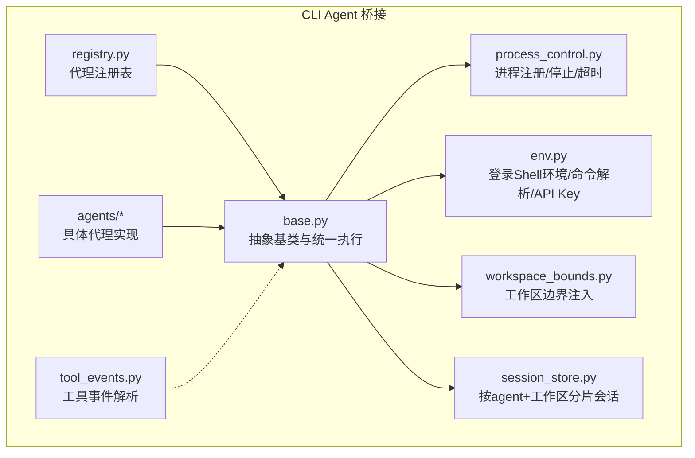
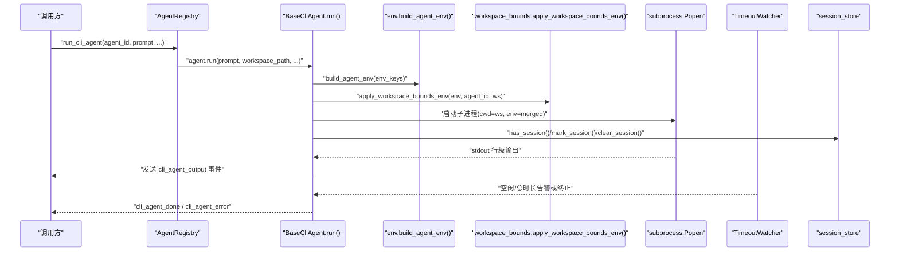
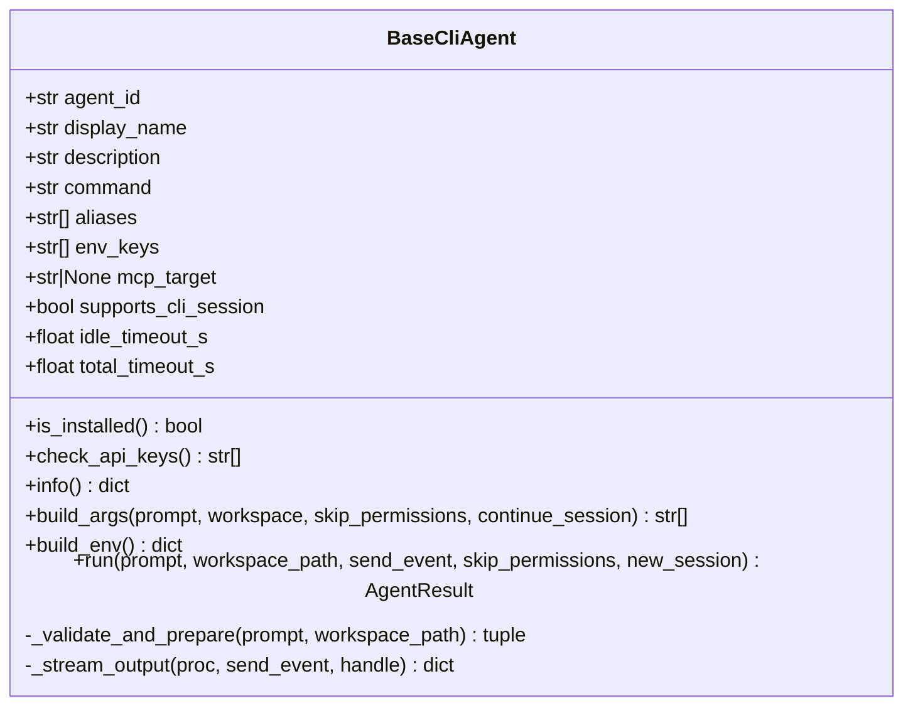
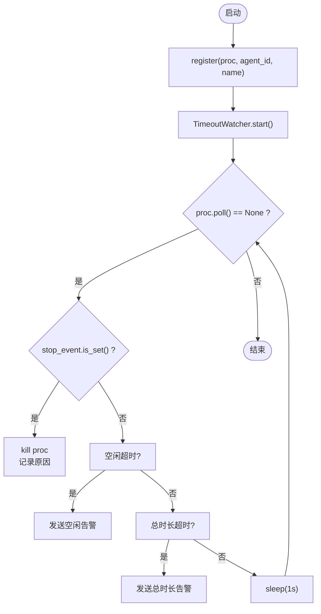
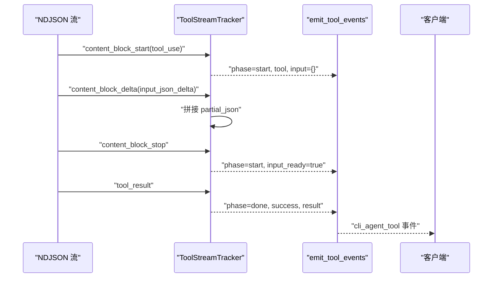
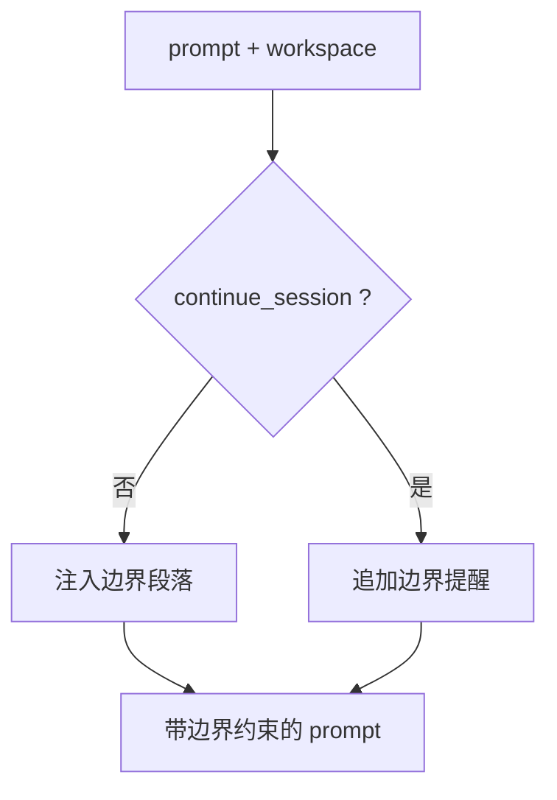
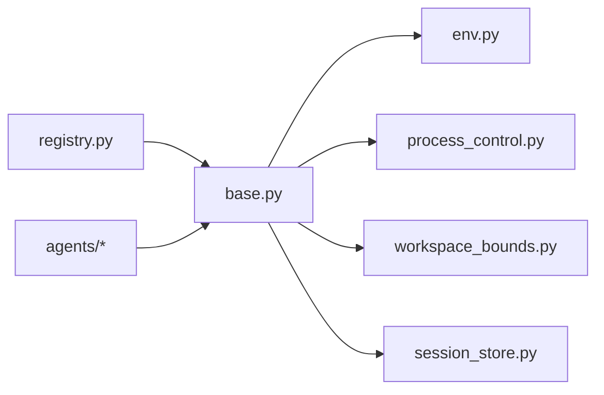
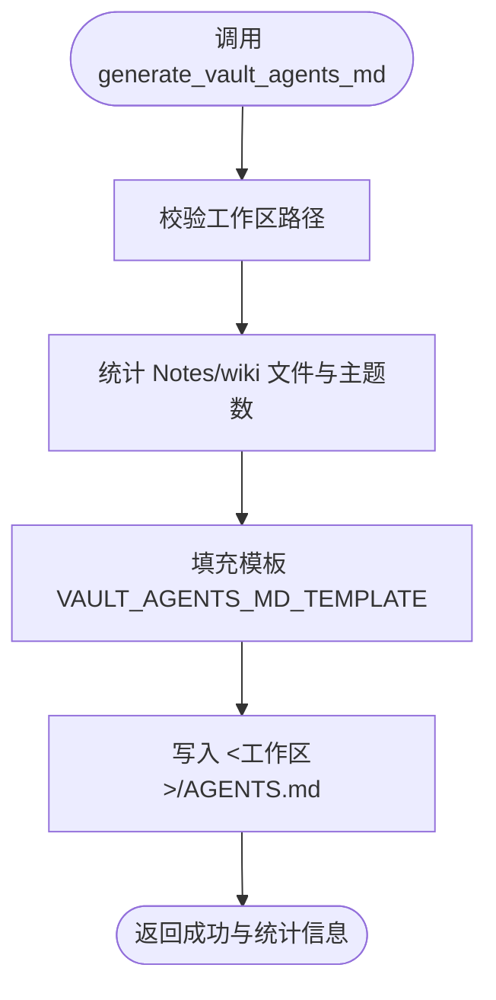

# CLI Agent 桥接

<cite>
**本文引用的文件**   
- [base.py](file://python/sidecar/cli_agent/base.py)
- [process_control.py](file://python/sidecar/cli_agent/process_control.py)
- [tool_events.py](file://python/sidecar/cli_agent/tool_events.py)
- [workspace_bounds.py](file://python/sidecar/cli_agent/workspace_bounds.py)
- [env.py](file://python/sidecar/cli_agent/env.py)
- [registry.py](file://python/sidecar/cli_agent/registry.py)
- [session_store.py](file://python/sidecar/cli_agent/session_store.py)
- [claude.py](file://python/sidecar/cli_agent/agents/claude.py)
- [opencode.py](file://python/sidecar/cli_agent/agents/opencode.py)
- [codex.py](file://python/sidecar/cli_agent/agents/codex.py)
- [gemini.py](file://python/sidecar/cli_agent/agents/gemini.py)
- [vault_agents_md.py](file://python/sidecar/vault_agents_md.py)
- [AGENTS.md](file://AGENTS.md)
- [settings.py](file://config/settings.py)
</cite>

## 目录
1. [简介](#简介)
2. [项目结构](#项目结构)
3. [核心组件](#核心组件)
4. [架构总览](#架构总览)
5. [详细组件分析](#详细组件分析)
6. [依赖关系分析](#依赖关系分析)
7. [性能与可靠性](#性能与可靠性)
8. [故障排除指南](#故障排除指南)
9. [结论](#结论)
10. [附录：新增代理类型指南](#附录新增代理类型指南)

## 简介
本技术文档面向“CLI Agent 桥接系统”，系统性阐述如何统一集成外部 AI 工具（Claude Code、OpenCode、Codex、Gemini 等），并通过统一的 Python 侧边车实现进程管理、事件流处理、实时输出展示。同时说明 AGENTS.md 自动生成机制、vault 结构与主题体系、笔记规范，以及工作区边界与安全控制。文末提供新代理类型的添加步骤、配置项说明与常见问题排查方法。

## 项目结构
CLI Agent 桥接位于 python/sidecar/cli_agent 下，采用“抽象基类 + 具体代理实现 + 注册表”的分层组织方式：
- 抽象基类与执行流程：base.py
- 进程生命周期与超时监控：process_control.py
- 工具调用事件解析：tool_events.py
- 工作区边界注入与环境增强：workspace_bounds.py、env.py
- 会话状态管理：session_store.py
- 代理发现与调度：registry.py
- 各第三方 CLI 的具体实现：agents/*

图表来源
- [base.py:1-383](file://python/sidecar/cli_agent/base.py#L1-L383)
- [process_control.py:1-130](file://python/sidecar/cli_agent/process_control.py#L1-L130)
- [env.py:1-257](file://python/sidecar/cli_agent/env.py#L1-L257)
- [workspace_bounds.py:1-64](file://python/sidecar/cli_agent/workspace_bounds.py#L1-L64)
- [session_store.py:1-43](file://python/sidecar/cli_agent/session_store.py#L1-L43)
- [registry.py:1-120](file://python/sidecar/cli_agent/registry.py#L1-L120)
- [tool_events.py:1-151](file://python/sidecar/cli_agent/tool_events.py#L1-L151)

章节来源
- [base.py:1-383](file://python/sidecar/cli_agent/base.py#L1-L383)
- [registry.py:1-120](file://python/sidecar/cli_agent/registry.py#L1-L120)

## 核心组件
- BaseCliAgent：定义统一执行入口 run()、参数构建 build_args()、环境变量构建 build_env()、MCP 自动注册、流式输出与超时控制、会话标记等。
- AgentRegistry：集中注册所有支持的 agent，提供 list/run/is_supported 能力，屏蔽具体实现差异。
- CliProcessHandle/TimeoutWatcher：负责子进程注册、用户停止、空闲/总时长超时告警与终止。
- ToolStreamTracker：从 Claude NDJSON 流中解析 tool_use/tool_result，生成结构化 cli_agent_tool 事件。
- Workspace Bounds：在 prompt 前注入安全边界提示，并为特定代理（如 OpenCode）注入运行时限制配置。
- Env 工具：通过登录 shell 获取完整 PATH/NVM 等环境；合并 PATH；查找 API key；校验 prompt；解析工作区路径。
- Session Store：以 agent_id + workspace 为维度维护“是否已有会话”的内存状态。

章节来源
- [base.py:53-383](file://python/sidecar/cli_agent/base.py#L53-L383)
- [process_control.py:15-130](file://python/sidecar/cli_agent/process_control.py#L15-L130)
- [tool_events.py:28-151](file://python/sidecar/cli_agent/tool_events.py#L28-L151)
- [workspace_bounds.py:1-64](file://python/sidecar/cli_agent/workspace_bounds.py#L1-L64)
- [env.py:18-257](file://python/sidecar/cli_agent/env.py#L18-L257)
- [session_store.py:1-43](file://python/sidecar/cli_agent/session_store.py#L1-L43)

## 架构总览
下图展示了从上层调用到具体 CLI 子进程的端到端流程，包括事件发射、工作区边界注入、MCP 注册、会话管理与超时控制。

图表来源
- [registry.py:58-83](file://python/sidecar/cli_agent/registry.py#L58-L83)
- [base.py:169-331](file://python/sidecar/cli_agent/base.py#L169-L331)
- [env.py:201-224](file://python/sidecar/cli_agent/env.py#L201-L224)
- [workspace_bounds.py:51-64](file://python/sidecar/cli_agent/workspace_bounds.py#L51-L64)
- [process_control.py:65-130](file://python/sidecar/cli_agent/process_control.py#L65-L130)
- [session_store.py:16-31](file://python/sidecar/cli_agent/session_store.py#L16-L31)

## 详细组件分析

### 抽象基类与统一执行（BaseCliAgent）
- 职责
  - 统一入口 run()：解析命令、校验 prompt 与工作区、检查 API key、可选 MCP 注册、构建参数、启动子进程、流式读取 stdout、超时控制、会话标记、结果封装。
  - 参数构建 build_args()：由子类实现，将 prompt 与工作区信息转换为具体 CLI 的参数列表。
  - 环境变量 build_env()：基于 env.build_agent_env 注入必要的环境变量。
  - 工作区边界：通过 workspace_bounds.append_workspace_boundary 在 prompt 前注入约束。
  - 事件：通过 _emit 发送 cli_agent_start/output/error/done 等事件。
- 关键行为
  - 支持 supports_cli_session 标志位，决定是否复用 CLI 原生会话。
  - mcp_target 非空时，在运行前自动注册 NoteAI vault MCP server。
  - 非零退出码或用户停止会触发错误事件并返回失败结果。

图表来源
- [base.py:53-170](file://python/sidecar/cli_agent/base.py#L53-L170)
- [base.py:169-331](file://python/sidecar/cli_agent/base.py#L169-L331)
- [base.py:332-383](file://python/sidecar/cli_agent/base.py#L332-L383)

章节来源
- [base.py:53-383](file://python/sidecar/cli_agent/base.py#L53-L383)

### 进程管理与超时控制（process_control）
- CliProcessHandle：封装 Popen 对象、agent 标识、显示名、停止事件与告警标记。
- register/clear：全局单例持有当前活跃进程句柄，供 UI 停止操作使用。
- stop_active：设置停止事件并 kill 子进程。
- TimeoutWatcher：后台线程轮询，检测空闲与总时长阈值，发出警告并在达到总时长或用户停止时终止进程。

图表来源
- [process_control.py:15-63](file://python/sidecar/cli_agent/process_control.py#L15-L63)
- [process_control.py:65-130](file://python/sidecar/cli_agent/process_control.py#L65-L130)

章节来源
- [process_control.py:1-130](file://python/sidecar/cli_agent/process_control.py#L1-130)

### 工具事件解析（tool_events）
- ToolStreamTracker：跟踪 stream-json 中的 content_block_start/delta/stop，拼装 tool_use 的 input JSON，并在结束时产出结构化事件。
- tool_results_from_message：从消息体中提取 tool_result 块，生成 done 事件。
- emit_tool_events：统一包装为 cli_agent_tool 事件类型。

图表来源
- [tool_events.py:28-95](file://python/sidecar/cli_agent/tool_events.py#L28-L95)
- [tool_events.py:117-151](file://python/sidecar/cli_agent/tool_events.py#L117-L151)

章节来源
- [tool_events.py:1-151](file://python/sidecar/cli_agent/tool_events.py#L1-151)

### 工作区边界与安全（workspace_bounds）
- boundary_block/append_workspace_boundary：在 prompt 前注入“仅允许在当前工作区内读写”的安全提示，续会话时追加提醒。
- apply_workspace_bounds_env：为特定代理注入运行时限制（例如 OpenCode 的 external_directory=deny）。

图表来源
- [workspace_bounds.py:22-41](file://python/sidecar/cli_agent/workspace_bounds.py#L22-L41)
- [workspace_bounds.py:51-64](file://python/sidecar/cli_agent/workspace_bounds.py#L51-L64)

章节来源
- [workspace_bounds.py:1-64](file://python/sidecar/cli_agent/workspace_bounds.py#L1-64)

### 环境与命令解析（env）
- get_login_shell/get_login_shell_env：通过登录 shell 获取用户真实环境（PATH、NVM、API key 等）。
- which_via_login_shell：优先用登录 shell 的 which/command -v 定位可执行文件。
- resolve_command：综合登录 shell PATH、shutil.which、常见安装目录进行解析。
- merge_path：智能合并 PATH，保留登录 shell 条目优先。
- lookup_api_key/build_agent_env：按优先级查找 API key 并注入到子进程环境，禁用彩色输出保证纯文本流。
- validate_prompt：防止空内容、超长、非法字符与以选项开头的 prompt。
- resolve_workspace：校验工作区路径存在且为目录。

章节来源
- [env.py:18-257](file://python/sidecar/cli_agent/env.py#L18-L257)

### 会话状态（session_store）
- 以 agent_id::workspace 作为键，维护“是否存在已建立会话”的集合。
- 提供 has/marking/clear 接口，配合 BaseCliAgent 的 supports_cli_session 控制是否复用 CLI 原生会话。

章节来源
- [session_store.py:1-43](file://python/sidecar/cli_agent/session_store.py#L1-L43)

### 代理注册表（registry）
- 集中注册所有支持的 agent（默认走 MCP 模式的 ClaudeMcpAgent，其余也支持自动注册 vault MCP）。
- 暴露 list_agents/run/is_supported 等方法，屏蔽底层差异。

章节来源
- [registry.py:1-120](file://python/sidecar/cli_agent/registry.py#L1-L120)

### 具体代理实现

#### Claude（Legacy）
- 特点：直连模式，支持 --permission-mode acceptEdits，-c 续会话，-p 传入 prompt，--add-dir 指定工作区。
- 工作区边界：通过 append_workspace_boundary 注入。

章节来源
- [claude.py:1-39](file://python/sidecar/cli_agent/agents/claude.py#L1-L39)

#### OpenCode
- 特点：MCP 模式，run --dir 指定工作区，--dangerously-skip-permissions 跳过权限，-c 续会话。
- 上下文增强：enrich_prompt 注入 Notes/wiki/Raw 目录说明与 MCP 工具建议，避免在错误目录搜索笔记。
- 工作区边界：首次注入完整边界段落，续会话追加提醒。

章节来源
- [opencode.py:1-63](file://python/sidecar/cli_agent/agents/opencode.py#L1-L63)

#### Codex
- 特点：MCP 模式，exec --sandbox workspace-write -C 指定工作区，resume --last 续上次会话。
- 工作区边界：通过 append_workspace_boundary 注入。

章节来源
- [codex.py:1-37](file://python/sidecar/cli_agent/agents/codex.py#L1-L37)

#### Gemini
- 特点：MCP 模式，--mode autonomous 自动模式，-p 传入 prompt。
- 不支持 CLI 原生会话：supports_cli_session=False。

章节来源
- [gemini.py:1-39](file://python/sidecar/cli_agent/agents/gemini.py#L1-L39)

## 依赖关系分析
- BaseCliAgent 依赖 env、process_control、workspace_bounds、session_store 与 MCP 注册器。
- 各具体代理均继承 BaseCliAgent，仅覆盖 build_args 与元数据。
- registry 聚合所有代理类，对外暴露统一接口。

图表来源
- [registry.py:1-120](file://python/sidecar/cli_agent/registry.py#L1-L120)
- [base.py:1-383](file://python/sidecar/cli_agent/base.py#L1-L383)
- [env.py:1-257](file://python/sidecar/cli_agent/env.py#L1-L257)
- [process_control.py:1-130](file://python/sidecar/cli_agent/process_control.py#L1-L130)
- [workspace_bounds.py:1-64](file://python/sidecar/cli_agent/workspace_bounds.py#L1-L64)
- [session_store.py:1-43](file://python/sidecar/cli_agent/session_store.py#L1-L43)

章节来源
- [registry.py:1-120](file://python/sidecar/cli_agent/registry.py#L1-L120)
- [base.py:1-383](file://python/sidecar/cli_agent/base.py#L1-L383)

## 性能与可靠性
- 流式输出：逐行读取 stdout 并即时发送事件，降低前端等待延迟。
- 超时策略：空闲超时与总时长超时分别告警，必要时终止进程，避免僵尸任务。
- 会话复用：对支持 CLI 原生会话的代理，减少重复初始化开销。
- 环境优化：禁用彩色输出，确保纯文本流稳定解析；智能合并 PATH，提高命令解析成功率。
- 资源清理：finally 中关闭管道、wait/kill 确保进程回收。

[本节为通用指导，不直接分析具体文件]

## 故障排除指南
- 未找到命令
  - 现象：返回“未安装/未找到命令”。
  - 排查：确认命令是否在登录 shell 的 PATH 中；检查 resolve_command 的三种解析路径；必要时补充 common_bin_dirs。
- API key 缺失
  - 现象：提示需要至少一个 API key。
  - 排查：检查 os.environ、登录 shell 环境、配置文件字段；OpenAI 系列可复用主 API key。
- 工作区无效
  - 现象：提示未设置/不存在/不是目录。
  - 排查：确认 config.workspace_path 有效；resolve_workspace 校验逻辑。
- 非零退出码
  - 现象：代理执行失败，返回退出码。
  - 排查：查看 cli_agent_error 事件中的 message 与 output；检查权限与 sandbox 配置。
- 长时间无输出
  - 现象：空闲/总时长告警。
  - 排查：观察 cli_agent_timeout_warning 事件；必要时调整 idle/total 超时或终止进程。
- 无法停止
  - 现象：stop_active 返回没有正在运行的 CLI Agent。
  - 排查：确认当前是否有活跃句柄；检查进程是否已结束。

章节来源
- [base.py:169-331](file://python/sidecar/cli_agent/base.py#L169-L331)
- [process_control.py:52-63](file://python/sidecar/cli_agent/process_control.py#L52-L63)
- [env.py:186-224](file://python/sidecar/cli_agent/env.py#L186-L224)
- [env.py:247-257](file://python/sidecar/cli_agent/env.py#L247-L257)

## 结论
CLI Agent 桥接通过抽象基类与注册表实现了多代理的统一接入，结合登录 shell 环境、工作区边界、会话管理与超时控制，提供了稳定可靠的执行通道。配合 AGENTS.md 自动生成与 MCP 自动注册，外部 AI 工具可在受控的工作区内高效完成知识检索与文件操作。

[本节为总结性内容，不直接分析具体文件]

## 附录：新增代理类型指南
- 新建代理类
  - 在 agents/ 下创建新文件，继承 BaseCliAgent，填写 agent_id/display_name/description/command/aliases/env_keys/mcp_target/supports_cli_session。
  - 实现 build_args(prompt, workspace, skip_permissions, continue_session)，将 prompt 与工作区信息转换为目标 CLI 的参数列表。
  - 如需注入工作区边界，使用 append_workspace_boundary；如需额外上下文，参考 OpenCode.enrich_prompt。
- 注册代理
  - 在 registry.py 的 _AGENTS 字典中注册新代理类。
- 配置与环境
  - 若需新的 API key，确保 env.lookup_api_key/build_agent_env 能正确注入。
  - 若需特殊环境变量（如 OpenCode 的 OPENCODE_CONFIG_CONTENT），在 workspace_bounds.apply_workspace_bounds_env 中添加分支。
- 测试建议
  - 验证 is_installed/check_api_keys/info。
  - 模拟 run 流程，检查事件序列与退出码处理。
  - 验证工作区边界与续会话行为。

章节来源
- [base.py:53-170](file://python/sidecar/cli_agent/base.py#L53-L170)
- [registry.py:15-33](file://python/sidecar/cli_agent/registry.py#L15-L33)
- [workspace_bounds.py:51-64](file://python/sidecar/cli_agent/workspace_bounds.py#L51-L64)
- [env.py:201-224](file://python/sidecar/cli_agent/env.py#L201-L224)

## AGENTS.md 自动生成系统与 Vault 结构说明
- 生成器
  - vault_agents_md.generate_vault_agents_md 根据当前工作区统计（Notes 数量、主题数、综述数）动态生成 AGENTS.md，描述三层知识架构、主题体系、笔记规范与 AI 行为准则。
- 顶层仓库 AGENTS.md
  - 提供构建、测试、架构约定、关键注意事项与产品运行边界，辅助外部 AI 编码代理理解代码库。

图表来源
- [vault_agents_md.py:145-194](file://python/sidecar/vault_agents_md.py#L145-L194)

章节来源
- [vault_agents_md.py:1-194](file://python/sidecar/vault_agents_md.py#L1-194)
- [AGENTS.md:1-157](file://AGENTS.md#L1-L157)
- [settings.py:1-41](file://config/settings.py#L1-L41)