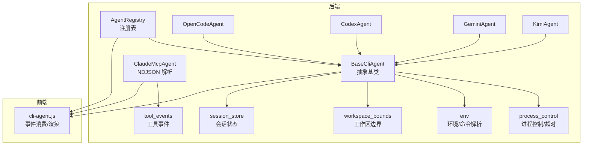
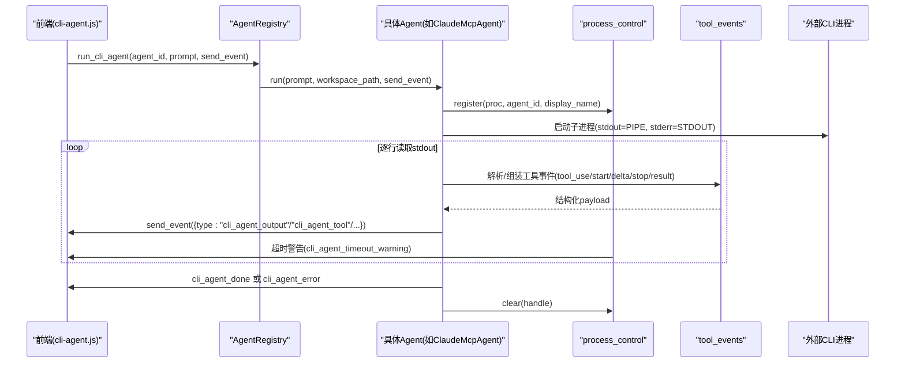
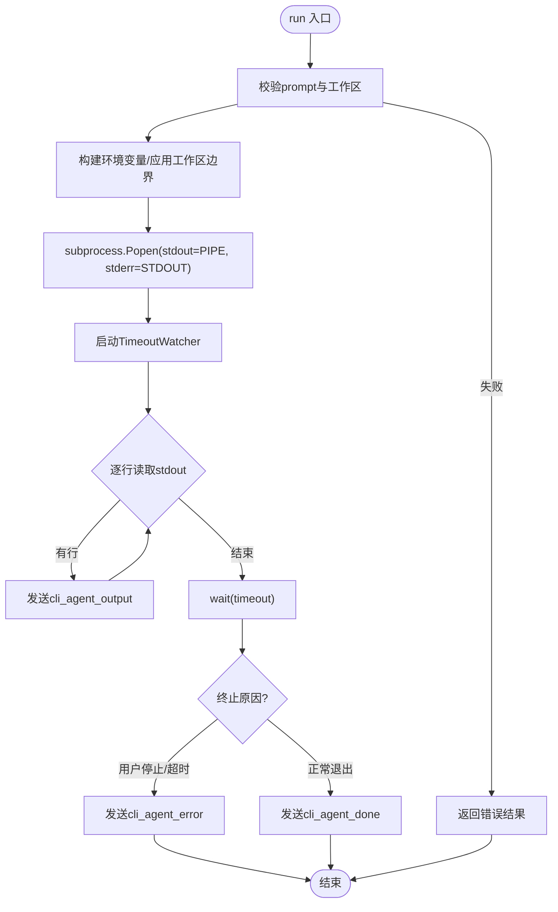
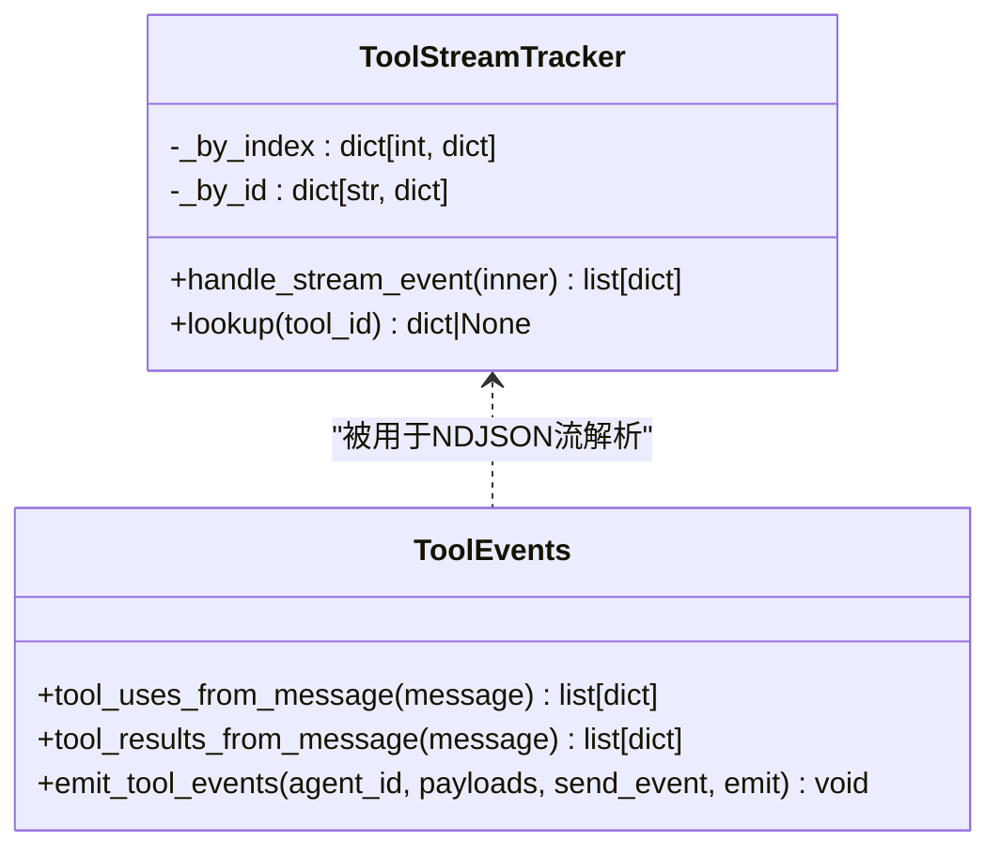
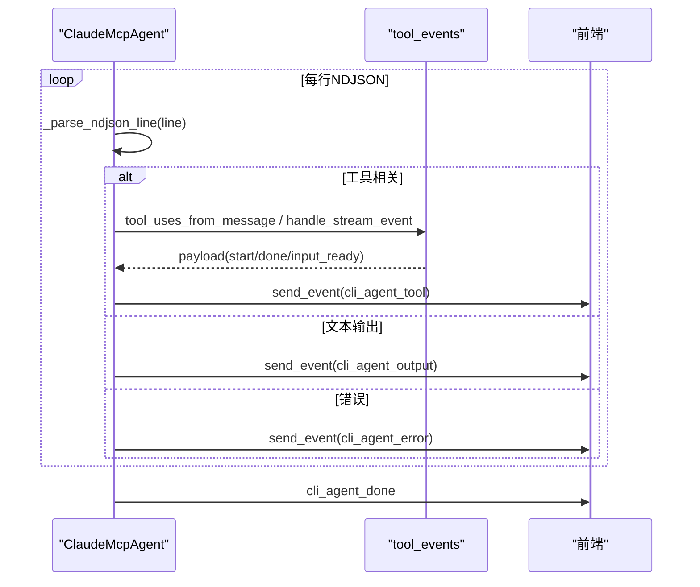
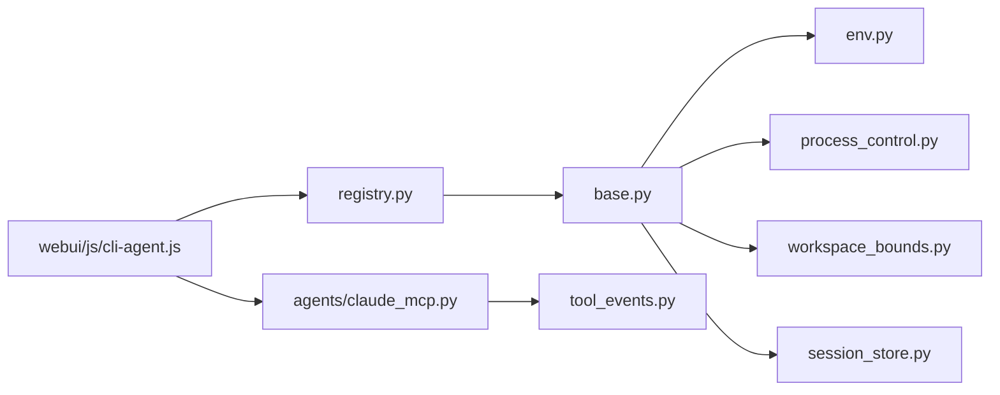

# 事件处理

<cite>
**本文引用的文件**   
- [python/sidecar/cli_agent/base.py](file://python/sidecar/cli_agent/base.py)
- [python/sidecar/cli_agent/tool_events.py](file://python/sidecar/cli_agent/tool_events.py)
- [python/sidecar/cli_agent/process_control.py](file://python/sidecar/cli_agent/process_control.py)
- [python/sidecar/cli_agent/registry.py](file://python/sidecar/cli_agent/registry.py)
- [python/sidecar/cli_agent/agents/claude_mcp.py](file://python/sidecar/cli_agent/agents/claude_mcp.py)
- [python/sidecar/cli_agent/agents/opencode.py](file://python/sidecar/cli_agent/agents/opencode.py)
- [python/sidecar/cli_agent/agents/codex.py](file://python/sidecar/cli_agent/agents/codex.py)
- [python/sidecar/cli_agent/agents/gemini.py](file://python/sidecar/cli_agent/agents/gemini.py)
- [python/sidecar/cli_agent/agents/kimi.py](file://python/sidecar/cli_agent/agents/kimi.py)
- [python/sidecar/cli_agent/env.py](file://python/sidecar/cli_agent/env.py)
- [python/sidecar/cli_agent/workspace_bounds.py](file://python/sidecar/cli_agent/workspace_bounds.py)
- [python/sidecar/cli_agent/session_store.py](file://python/sidecar/cli_agent/session_store.py)
- [webui/js/cli-agent.js](file://webui/js/cli-agent.js)
</cite>

## 目录
1. [简介](#简介)
2. [项目结构](#项目结构)
3. [核心组件](#核心组件)
4. [架构总览](#架构总览)
5. [详细组件分析](#详细组件分析)
6. [依赖关系分析](#依赖关系分析)
7. [性能与背压](#性能与背压)
8. [故障排查指南](#故障排查指南)
9. [结论](#结论)
10. [附录：前端集成方案](#附录前端集成方案)

## 简介
本技术文档围绕 CLI Agent 事件处理系统，系统性阐述事件驱动架构的设计与实现。重点覆盖：
- 事件定义与发布订阅机制
- 工具调用事件的捕获、解析、转发流程
- 实时输出流处理（标准输出重定向、错误流合并、进度更新）
- 事件过滤、转换、聚合策略
- 前端展示集成方案（含 WebSocket 推送、增量更新、错误提示）
- 事件持久化、回放、调试方法
- 性能优化、背压处理、异常恢复技巧

## 项目结构
CLI Agent 事件处理系统位于 Python 侧边服务中，采用“抽象基类 + 具体 Agent 实现”的分层设计；前端通过统一 API 接收事件并渲染。

图表来源
- [python/sidecar/cli_agent/registry.py:1-120](file://python/sidecar/cli_agent/registry.py#L1-L120)
- [python/sidecar/cli_agent/base.py:1-383](file://python/sidecar/cli_agent/base.py#L1-L383)
- [python/sidecar/cli_agent/agents/claude_mcp.py:1-399](file://python/sidecar/cli_agent/agents/claude_mcp.py#L1-L399)
- [python/sidecar/cli_agent/tool_events.py:1-151](file://python/sidecar/cli_agent/tool_events.py#L1-L151)
- [python/sidecar/cli_agent/process_control.py:1-130](file://python/sidecar/cli_agent/process_control.py#L1-L130)
- [python/sidecar/cli_agent/env.py:1-257](file://python/sidecar/cli_agent/env.py#L1-L257)
- [python/sidecar/cli_agent/workspace_bounds.py:1-64](file://python/sidecar/cli_agent/workspace_bounds.py#L1-L64)
- [python/sidecar/cli_agent/session_store.py:1-43](file://python/sidecar/cli_agent/session_store.py#L1-L43)
- [webui/js/cli-agent.js:1-800](file://webui/js/cli-agent.js#L1-L800)

章节来源
- [python/sidecar/cli_agent/registry.py:1-120](file://python/sidecar/cli_agent/registry.py#L1-L120)
- [python/sidecar/cli_agent/base.py:1-383](file://python/sidecar/cli_agent/base.py#L1-L383)

## 核心组件
- 抽象基类 BaseCliAgent：统一执行入口、子进程生命周期管理、流式输出、超时告警、会话标记、MCP 自动注册等。
- 进程控制 process_control：进程注册、用户停止、空闲/总时长超时监控与告警。
- 工具事件 tool_events：从 Claude NDJSON 或消息体中提取 tool_use/tool_result，生成结构化 cli_agent_tool 事件。
- Agent 注册表 registry：发现、列举、运行各 Agent。
- 具体 Agent 实现：ClaudeMcpAgent（NDJSON 流）、OpenCode/Codex/Gemini/Kimi（参数构建与环境注入）。
- 环境与边界 env/workspace_bounds：登录 shell 环境获取、PATH 合并、API key 查找、工作区安全边界注入。
- 会话状态 session_store：按 agent+workspace 维度维护多轮会话标志。
- 前端 cli-agent.js：事件消费、过滤、工具卡片渲染、工作流步骤汇总、超时提示、停止/新会话控制。

章节来源
- [python/sidecar/cli_agent/base.py:1-383](file://python/sidecar/cli_agent/base.py#L1-L383)
- [python/sidecar/cli_agent/process_control.py:1-130](file://python/sidecar/cli_agent/process_control.py#L1-L130)
- [python/sidecar/cli_agent/tool_events.py:1-151](file://python/sidecar/cli_agent/tool_events.py#L1-L151)
- [python/sidecar/cli_agent/registry.py:1-120](file://python/sidecar/cli_agent/registry.py#L1-L120)
- [python/sidecar/cli_agent/agents/claude_mcp.py:1-399](file://python/sidecar/cli_agent/agents/claude_mcp.py#L1-L399)
- [python/sidecar/cli_agent/agents/opencode.py:1-63](file://python/sidecar/cli_agent/agents/opencode.py#L1-L63)
- [python/sidecar/cli_agent/agents/codex.py:1-37](file://python/sidecar/cli_agent/agents/codex.py#L1-L37)
- [python/sidecar/cli_agent/agents/gemini.py:1-39](file://python/sidecar/cli_agent/agents/gemini.py#L1-L39)
- [python/sidecar/cli_agent/agents/kimi.py:1-44](file://python/sidecar/cli_agent/agents/kimi.py#L1-L44)
- [python/sidecar/cli_agent/env.py:1-257](file://python/sidecar/cli_agent/env.py#L1-L257)
- [python/sidecar/cli_agent/workspace_bounds.py:1-64](file://python/sidecar/cli_agent/workspace_bounds.py#L1-L64)
- [python/sidecar/cli_agent/session_store.py:1-43](file://python/sidecar/cli_agent/session_store.py#L1-L43)
- [webui/js/cli-agent.js:1-800](file://webui/js/cli-agent.js#L1-L800)

## 架构总览
整体为事件驱动架构：后端以子进程方式运行第三方 CLI Agent，将 stdout 作为文本流读取，逐行解析并转换为内部事件；工具调用事件由 ToolStreamTracker 跟踪拼装；最终通过 send_event 回调推送到前端。

图表来源
- [python/sidecar/cli_agent/registry.py:58-83](file://python/sidecar/cli_agent/registry.py#L58-L83)
- [python/sidecar/cli_agent/agents/claude_mcp.py:177-267](file://python/sidecar/cli_agent/agents/claude_mcp.py#L177-L267)
- [python/sidecar/cli_agent/tool_events.py:28-99](file://python/sidecar/cli_agent/tool_events.py#L28-L99)
- [python/sidecar/cli_agent/process_control.py:65-130](file://python/sidecar/cli_agent/process_control.py#L65-L130)

## 详细组件分析

### 抽象基类 BaseCliAgent
职责
- 统一执行入口：校验 prompt、解析工作区、构建环境变量、注册 MCP、启动子进程。
- 流式输出：逐行读取 stdout，发送 cli_agent_output 事件；合并 stderr 到 stdout。
- 超时与停止：基于 TimeoutWatcher 发出 idle/total 超时警告；支持用户停止。
- 会话管理：根据 supports_cli_session 决定是否标记/清理会话。
- 结果封装：返回 AgentResult，包含 success/message/output/exit_code。

关键流程
- run() 负责前置校验、MCP 注册、参数构建、进程启动、流式处理、结束事件。
- _stream_output() 负责逐行读取、累积输出、超时监听、终止原因判断。

图表来源
- [python/sidecar/cli_agent/base.py:169-331](file://python/sidecar/cli_agent/base.py#L169-L331)
- [python/sidecar/cli_agent/base.py:332-383](file://python/sidecar/cli_agent/base.py#L332-L383)
- [python/sidecar/cli_agent/process_control.py:65-130](file://python/sidecar/cli_agent/process_control.py#L65-L130)

章节来源
- [python/sidecar/cli_agent/base.py:1-383](file://python/sidecar/cli_agent/base.py#L1-L383)

### 工具事件工具集 tool_events
职责
- 从 Claude NDJSON stream_event 的 content_block_start/delta/stop 中拼装 tool_use 输入。
- 从 assistant/user 消息中的 tool_use/tool_result 块提取事件。
- 统一包装为 cli_agent_tool 事件并通过 emit 回调发送。

数据结构与复杂度
- ToolStreamTracker 使用 by_index/by_id 双索引字典，O(1) 查找与更新。
- 输入 JSON 增量拼接后一次性 json.loads，异常时回退保留已拼内容。

图表来源
- [python/sidecar/cli_agent/tool_events.py:28-99](file://python/sidecar/cli_agent/tool_events.py#L28-L99)
- [python/sidecar/cli_agent/tool_events.py:101-151](file://python/sidecar/cli_agent/tool_events.py#L101-L151)

章节来源
- [python/sidecar/cli_agent/tool_events.py:1-151](file://python/sidecar/cli_agent/tool_events.py#L1-L151)

### ClaudeMcpAgent（NDJSON 流）
职责
- 通过 --mcp-config 启动 Claude CLI，启用内置 tool loop。
- 解析 NDJSON 流：text/TextDelta/stream_event/assistant/user/ToolStart/ToolDone/Error 等。
- 将各类事件转译为统一的 cli_agent_output 与 cli_agent_tool 事件。

图表来源
- [python/sidecar/cli_agent/agents/claude_mcp.py:177-399](file://python/sidecar/cli_agent/agents/claude_mcp.py#L177-L399)
- [python/sidecar/cli_agent/tool_events.py:28-99](file://python/sidecar/cli_agent/tool_events.py#L28-L99)

章节来源
- [python/sidecar/cli_agent/agents/claude_mcp.py:1-399](file://python/sidecar/cli_agent/agents/claude_mcp.py#L1-L399)

### OpenCode/Codex/Gemini/Kimi Agent
职责
- 继承 BaseCliAgent，覆写 build_args 构造各自 CLI 的参数。
- 注入工作区边界与安全限制（如 OpenCode 的 external_directory=deny）。
- Gemini 不支持 CLI 原生会话，supports_cli_session=False。

章节来源
- [python/sidecar/cli_agent/agents/opencode.py:1-63](file://python/sidecar/cli_agent/agents/opencode.py#L1-L63)
- [python/sidecar/cli_agent/agents/codex.py:1-37](file://python/sidecar/cli_agent/agents/codex.py#L1-L37)
- [python/sidecar/cli_agent/agents/gemini.py:1-39](file://python/sidecar/cli_agent/agents/gemini.py#L1-L39)
- [python/sidecar/cli_agent/agents/kimi.py:1-44](file://python/sidecar/cli_agent/agents/kimi.py#L1-L44)
- [python/sidecar/cli_agent/workspace_bounds.py:1-64](file://python/sidecar/cli_agent/workspace_bounds.py#L1-L64)

### 进程控制 process_control
职责
- 全局唯一活跃进程句柄注册/清理。
- 用户停止：设置 stop_event 并 kill 进程。
- 超时监控：idle/total 阈值触发 cli_agent_timeout_warning 事件。

章节来源
- [python/sidecar/cli_agent/process_control.py:1-130](file://python/sidecar/cli_agent/process_control.py#L1-L130)

### 环境与环境变量 env
职责
- 通过登录 shell 获取完整 PATH、NVM、fnm 等配置。
- 智能合并 PATH，避免覆盖当前进程独有路径。
- 查找 API key：环境变量 > 登录 shell > config 字段 > 兜底复用主 key。
- 校验 prompt：长度、空字符、控制字符、防止选项注入。
- 解析工作区路径并校验存在性与类型。

章节来源
- [python/sidecar/cli_agent/env.py:1-257](file://python/sidecar/cli_agent/env.py#L1-L257)

### 工作区边界 workspace_bounds
职责
- 在 prompt 前注入安全边界说明，限制读写范围在当前工作区内。
- 针对特定 Agent（如 OpenCode）注入运行时限制环境变量。

章节来源
- [python/sidecar/cli_agent/workspace_bounds.py:1-64](file://python/sidecar/cli_agent/workspace_bounds.py#L1-L64)

### 会话状态 session_store
职责
- 按 agent_id + workspace 维度维护会话标志。
- 提供 has/marking/clear 接口，支持按工作区批量清理。

章节来源
- [python/sidecar/cli_agent/session_store.py:1-43](file://python/sidecar/cli_agent/session_store.py#L1-L43)

## 依赖关系分析
- AgentRegistry 依赖具体 Agent 类，统一对外暴露 run/list_agents。
- BaseCliAgent 依赖 env、process_control、workspace_bounds、session_store。
- ClaudeMcpAgent 额外依赖 tool_events 进行 NDJSON 解析与工具事件生成。
- 前端 cli-agent.js 依赖后端事件流，进行过滤、渲染与交互。

图表来源
- [python/sidecar/cli_agent/registry.py:1-120](file://python/sidecar/cli_agent/registry.py#L1-L120)
- [python/sidecar/cli_agent/base.py:1-383](file://python/sidecar/cli_agent/base.py#L1-L383)
- [python/sidecar/cli_agent/agents/claude_mcp.py:1-399](file://python/sidecar/cli_agent/agents/claude_mcp.py#L1-L399)
- [python/sidecar/cli_agent/tool_events.py:1-151](file://python/sidecar/cli_agent/tool_events.py#L1-L151)
- [webui/js/cli-agent.js:1-800](file://webui/js/cli-agent.js#L1-L800)

章节来源
- [python/sidecar/cli_agent/registry.py:1-120](file://python/sidecar/cli_agent/registry.py#L1-L120)
- [python/sidecar/cli_agent/base.py:1-383](file://python/sidecar/cli_agent/base.py#L1-L383)
- [python/sidecar/cli_agent/agents/claude_mcp.py:1-399](file://python/sidecar/cli_agent/agents/claude_mcp.py#L1-L399)
- [python/sidecar/cli_agent/tool_events.py:1-151](file://python/sidecar/cli_agent/tool_events.py#L1-L151)
- [webui/js/cli-agent.js:1-800](file://webui/js/cli-agent.js#L1-L800)

## 性能与背压
- 流式读取：逐行 readline 降低内存占用，bufsize=1 提高吞吐。
- 文本缓冲：前端对输出进行行缓冲与增量 Markdown 渲染，减少重排。
- 工具输入增量拼装：ToolStreamTracker 仅保存必要上下文，避免大对象复制。
- 超时与停止：后台线程监控 idle/total 阈值，及时释放资源。
- 建议
  - 若事件量极大，可在 send_event 处增加队列与节流，避免前端阻塞。
  - 对超长输出可考虑分片推送与分页回放。
  - 对工具输入过大场景，可引入压缩或延迟加载详情。

[本节为通用指导，不直接分析具体文件]

## 故障排查指南
常见问题与定位
- 未安装命令：检查 resolved_path 与 which_via_login_shell 逻辑，确认 PATH 与别名。
- API key 缺失：查看 lookup_api_key 优先级与 config 字段映射。
- 工作区无效：校验 resolve_workspace 返回值与错误信息。
- 非零退出码：关注 cli_agent_error 事件与 output 片段。
- 用户停止/超时：检查 stop_event 与 TimeoutWatcher 的 kill_reason。
- NDJSON 解析异常：观察 _parse_ndjson_line 的容错分支与 fallback 文本。

章节来源
- [python/sidecar/cli_agent/env.py:136-198](file://python/sidecar/cli_agent/env.py#L136-L198)
- [python/sidecar/cli_agent/env.py:227-257](file://python/sidecar/cli_agent/env.py#L227-L257)
- [python/sidecar/cli_agent/base.py:286-331](file://python/sidecar/cli_agent/base.py#L286-L331)
- [python/sidecar/cli_agent/process_control.py:91-130](file://python/sidecar/cli_agent/process_control.py#L91-L130)
- [python/sidecar/cli_agent/agents/claude_mcp.py:269-286](file://python/sidecar/cli_agent/agents/claude_mcp.py#L269-L286)

## 结论
本系统通过抽象基类统一了 CLI Agent 的执行与事件模型，结合进程控制与环境注入，实现了稳定可靠的工具调用与流式输出。前端通过事件过滤与增量渲染，提供了良好的用户体验。后续可在事件队列、背压、持久化回放方面进一步增强。

[本节为总结性内容，不直接分析具体文件]

## 附录：前端集成方案
- 事件类型
  - cli_agent_output：增量文本输出，前端追加到消息容器并进行 Markdown 渲染。
  - cli_agent_tool：工具调用 start/done 事件，前端渲染工具卡片，支持 input_ready 更新。
  - cli_agent_timeout_warning：超时告警，前端显示提示条。
  - cli_agent_start/cli_agent_done/cli_agent_error：生命周期事件，控制按钮状态与会话徽章。
- 过滤与聚合
  - 过滤 system/user/tool_use/tool_result 等原始 JSON 行，避免重复展示。
  - 识别 OpenCode 工作流行，聚合为步骤列表，并在完成时折叠。
- 交互
  - 停止：调用 stopCliAgent，后端设置 stop_event 并 kill 进程。
  - 新对话：clearCliAgentSession，清空会话标志并重置 UI。
- WebSocket 推送
  - 若上层使用 WebSocket 推送事件，前端可按相同事件模型消费，无需改动渲染逻辑。
- 持久化与回放
  - 可将事件序列序列化存储，回放时按时间顺序重放，用于调试与审计。
  - 建议对长会话事件进行分片与索引，提升回放性能。

章节来源
- [webui/js/cli-agent.js:226-533](file://webui/js/cli-agent.js#L226-L533)
- [webui/js/cli-agent.js:574-589](file://webui/js/cli-agent.js#L574-L589)
- [webui/js/cli-agent.js:68-83](file://webui/js/cli-agent.js#L68-L83)