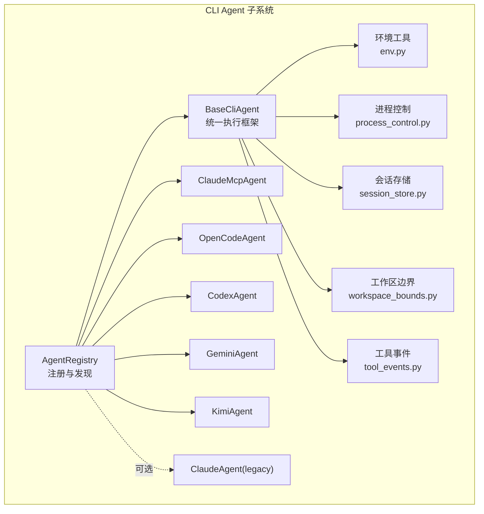
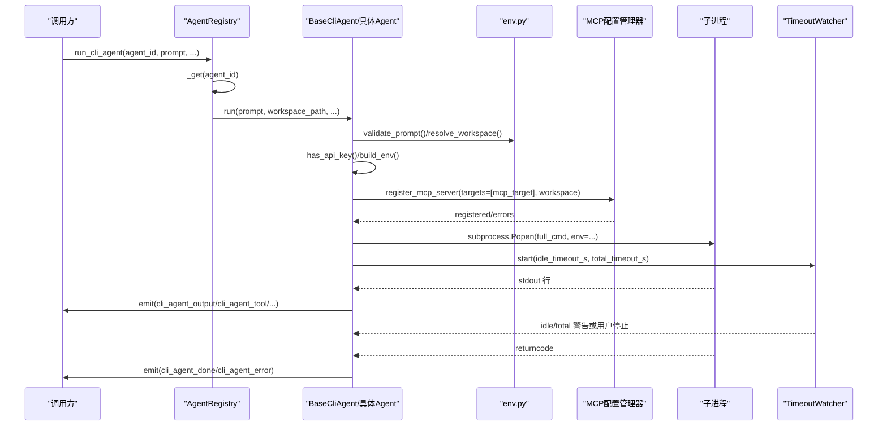
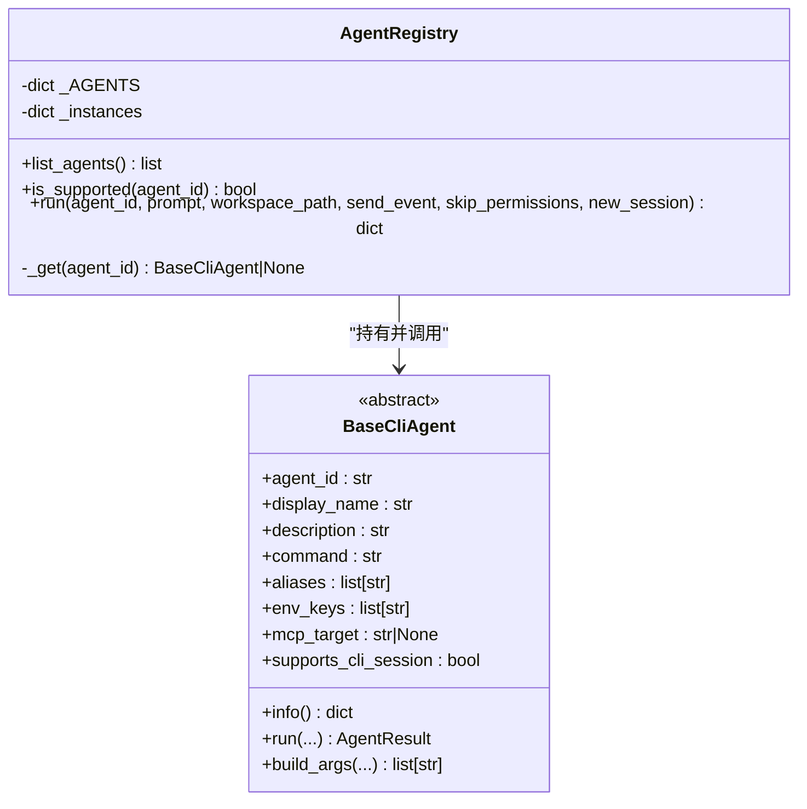
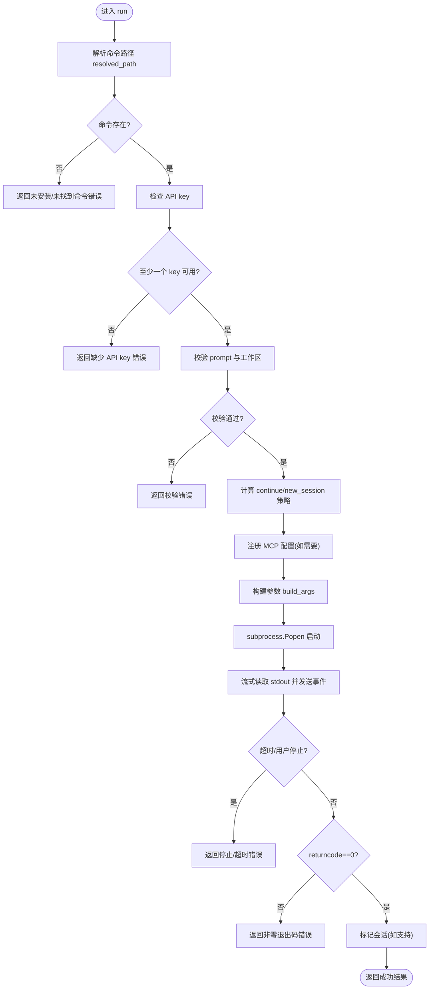
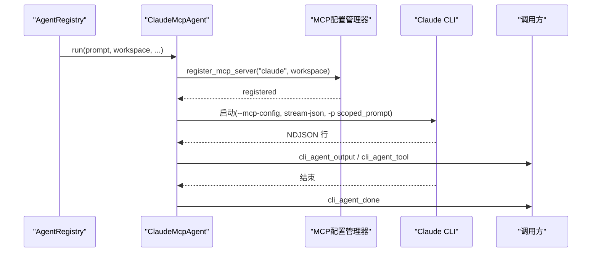
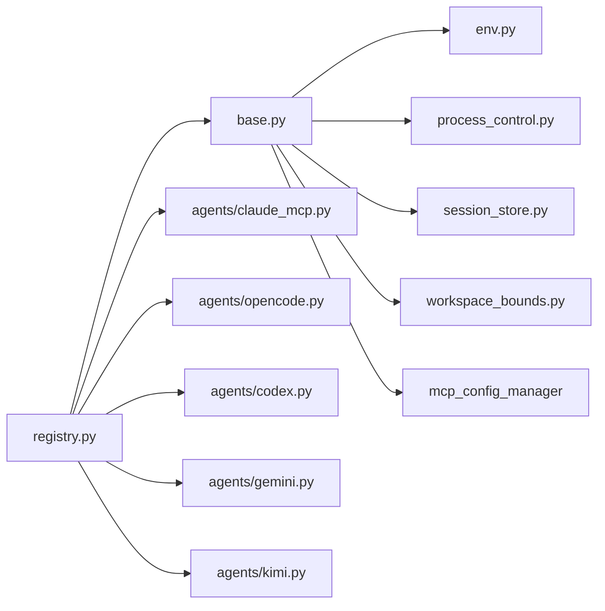

# 代理管理

<cite>
**本文引用的文件**   
- [registry.py](file://python/sidecar/cli_agent/registry.py)
- [base.py](file://python/sidecar/cli_agent/base.py)
- [env.py](file://python/sidecar/cli_agent/env.py)
- [process_control.py](file://python/sidecar/cli_agent/process_control.py)
- [session_store.py](file://python/sidecar/cli_agent/session_store.py)
- [tool_events.py](file://python/sidecar/cli_agent/tool_events.py)
- [workspace_bounds.py](file://python/sidecar/cli_agent/workspace_bounds.py)
- [agents/__init__.py](file://python/sidecar/cli_agent/agents/__init__.py)
- [agents/claude_mcp.py](file://python/sidecar/cli_agent/agents/claude_mcp.py)
- [agents/claude.py](file://python/sidecar/cli_agent/agents/claude.py)
- [agents/opencode.py](file://python/sidecar/cli_agent/agents/opencode.py)
- [agents/codex.py](file://python/sidecar/cli_agent/agents/codex.py)
- [agents/gemini.py](file://python/sidecar/cli_agent/agents/gemini.py)
- [agents/kimi.py](file://python/sidecar/cli_agent/agents/kimi.py)
- [__init__.py](file://python/sidecar/cli_agent/__init__.py)
</cite>

## 目录
1. [简介](#简介)
2. [项目结构](#项目结构)
3. [核心组件](#核心组件)
4. [架构总览](#架构总览)
5. [详细组件分析](#详细组件分析)
6. [依赖关系分析](#依赖关系分析)
7. [性能与可靠性](#性能与可靠性)
8. [故障排查指南](#故障排查指南)
9. [结论](#结论)
10. [附录：新增代理类型指南](#附录新增代理类型指南)

## 简介
本技术文档面向 CLI Agent 代理管理系统，系统性阐述代理注册、发现、生命周期管理、能力检测与兼容性校验、错误处理机制，以及状态监控与性能统计的实现细节。重点解析 AgentRegistry 的设计模式与实现原理，说明支持的代理类型（Claude Code、OpenCode、Codex、Gemini、Kimi）的配置与初始化流程，并提供扩展新代理类型的完整指南。

## 项目结构
CLI Agent 子系统位于 python/sidecar/cli_agent 下，采用“抽象基类 + 具体实现 + 统一注册表”的分层组织方式：
- 抽象与执行框架：base.py、env.py、process_control.py、session_store.py、workspace_bounds.py、tool_events.py
- 注册与对外入口：registry.py、__init__.py
- 具体代理实现：agents/*（claude_mcp.py、opencode.py、codex.py、gemini.py、kimi.py、claude.py）

图表来源
- [registry.py:15-33](file://python/sidecar/cli_agent/registry.py#L15-L33)
- [base.py:53-126](file://python/sidecar/cli_agent/base.py#L53-L126)
- [env.py:136-224](file://python/sidecar/cli_agent/env.py#L136-L224)
- [process_control.py:15-63](file://python/sidecar/cli_agent/process_control.py#L15-L63)
- [session_store.py:10-43](file://python/sidecar/cli_agent/session_store.py#L10-L43)
- [workspace_bounds.py:22-64](file://python/sidecar/cli_agent/workspace_bounds.py#L22-L64)
- [tool_events.py:28-151](file://python/sidecar/cli_agent/tool_events.py#L28-L151)
- [agents/claude_mcp.py:27-52](file://python/sidecar/cli_agent/agents/claude_mcp.py#L27-L52)
- [agents/opencode.py:11-63](file://python/sidecar/cli_agent/agents/opencode.py#L11-L63)
- [agents/codex.py:11-37](file://python/sidecar/cli_agent/agents/codex.py#L11-L37)
- [agents/gemini.py:11-39](file://python/sidecar/cli_agent/agents/gemini.py#L11-L39)
- [agents/kimi.py:15-44](file://python/sidecar/cli_agent/agents/kimi.py#L15-L44)
- [agents/claude.py:11-39](file://python/sidecar/cli_agent/agents/claude.py#L11-L39)

章节来源
- [registry.py:15-33](file://python/sidecar/cli_agent/registry.py#L15-L33)
- [base.py:53-126](file://python/sidecar/cli_agent/base.py#L53-L126)
- [agents/__init__.py:1-2](file://python/sidecar/cli_agent/agents/__init__.py#L1-L2)

## 核心组件
- AgentRegistry：集中式注册表，负责代理的发现、列举与分发执行；提供单例访问与便捷函数。
- BaseCliAgent：抽象基类，封装命令解析、环境变量构建、工作区校验、MCP 配置注入、子进程启动、流式输出、超时与停止控制、会话标记等通用逻辑。
- 环境工具 env：登录 shell 环境获取、PATH 合并、API key 查找与注入、prompt 与工作区校验。
- 进程控制 process_control：活跃进程注册、用户停止、空闲/总时长超时告警。
- 会话存储 session_store：按 agent+工作区维度维护多轮会话状态。
- 工作区边界 workspace_bounds：在 prompt 中注入安全边界提示，并为特定代理注入运行时限制。
- 工具事件 tool_events：将 Claude NDJSON 中的 tool_use/tool_result 转换为结构化 cli_agent_tool 事件。

章节来源
- [registry.py:15-120](file://python/sidecar/cli_agent/registry.py#L15-L120)
- [base.py:53-383](file://python/sidecar/cli_agent/base.py#L53-L383)
- [env.py:18-257](file://python/sidecar/cli_agent/env.py#L18-L257)
- [process_control.py:15-130](file://python/sidecar/cli_agent/process_control.py#L15-L130)
- [session_store.py:10-43](file://python/sidecar/cli_agent/session_store.py#L10-L43)
- [workspace_bounds.py:22-64](file://python/sidecar/cli_agent/workspace_bounds.py#L22-L64)
- [tool_events.py:28-151](file://python/sidecar/cli_agent/tool_events.py#L28-L151)

## 架构总览
下图展示了从调用方到具体代理执行的端到端流程，包括注册表分发、基类统一执行、环境与权限校验、MCP 配置注入、子进程运行与事件回传。

图表来源
- [registry.py:58-82](file://python/sidecar/cli_agent/registry.py#L58-L82)
- [base.py:169-331](file://python/sidecar/cli_agent/base.py#L169-L331)
- [env.py:227-257](file://python/sidecar/cli_agent/env.py#L227-L257)
- [process_control.py:65-130](file://python/sidecar/cli_agent/process_control.py#L65-L130)

## 详细组件分析

### 代理注册与发现（AgentRegistry）
- 设计要点
  - 静态映射：通过类属性字典 _AGENTS 声明所有受支持代理的 id 到类的映射，新增代理仅需在此处注册。
  - 懒加载实例：_get 方法按需创建并缓存实例，避免重复构造开销。
  - 列表与检查：list_agents 遍历已注册代理，调用 info() 返回安装状态与元数据；is_supported 快速判断是否受支持。
  - 统一执行：run 委托给具体 agent.run，并将结果转为 dict。
- 关键路径
  - 全局单例：get_registry 提供线程安全的单例访问。
  - 便捷函数：list_available_agents、run_cli_agent 作为对外稳定入口。

图表来源
- [registry.py:15-120](file://python/sidecar/cli_agent/registry.py#L15-L120)
- [base.py:53-126](file://python/sidecar/cli_agent/base.py#L53-L126)

章节来源
- [registry.py:15-120](file://python/sidecar/cli_agent/registry.py#L15-L120)

### 统一执行框架（BaseCliAgent）
- 职责边界
  - 命令解析：resolved_path 基于 command 与 aliases 解析可执行路径。
  - 能力检测：is_installed 判定是否可用；check_api_keys/has_api_key 校验 API key。
  - 参数构建：由子类实现 build_args，基类负责组装 full_cmd。
  - 环境准备：build_env 合并当前进程、登录 shell 与必要 API key，禁用彩色输出保证纯文本流。
  - 前置校验：validate_prompt 与 resolve_workspace 确保输入安全与工作区有效。
  - MCP 注入：若 mcp_target 非空，则在 run 前自动注册 NoteAI vault MCP server。
  - 子进程与流式输出：subprocess.Popen 启动，逐行读取 stdout，发送 cli_agent_output 事件。
  - 超时与停止：TimeoutWatcher 监控空闲与总时长，支持用户停止；异常捕获与日志记录。
  - 会话标记：根据 supports_cli_session 决定是否标记/清理会话。
- 错误处理
  - 未安装/未找到命令：返回失败结果并给出明确提示。
  - 缺少 API key：列出所需键名，引导用户设置。
  - 工作区无效：返回错误信息。
  - 非零退出码：记录日志并返回失败结果，必要时清理会话。
  - 异常兜底：捕获并记录异常堆栈，返回失败结果。

图表来源
- [base.py:169-331](file://python/sidecar/cli_agent/base.py#L169-L331)
- [env.py:227-257](file://python/sidecar/cli_agent/env.py#L227-L257)
- [process_control.py:65-130](file://python/sidecar/cli_agent/process_control.py#L65-L130)

章节来源
- [base.py:53-383](file://python/sidecar/cli_agent/base.py#L53-L383)

### 环境与安全（env.py、workspace_bounds.py）
- 登录 shell 环境：通过登录 shell 获取 PATH、NVM、fnm 等用户真实环境，解决 GUI 启动时 PATH 不完整问题。
- 命令解析：优先使用登录 shell 的 which/command -v，其次用合并后的 PATH，最后扫描常见安装目录。
- API key 查找：环境变量 > 登录 shell > config 精确字段 > 主 API key 兜底（兼容 OpenAI 系列）。
- 工作区边界：在 prompt 中注入安全边界提示，并在继续会话时追加提醒；为 OpenCode 注入外部目录拒绝策略。
- 环境变量合并：保留登录 shell PATH 优先级，同时合并当前进程独有条目，避免覆盖。

章节来源
- [env.py:18-257](file://python/sidecar/cli_agent/env.py#L18-L257)
- [workspace_bounds.py:22-64](file://python/sidecar/cli_agent/workspace_bounds.py#L22-L64)

### 进程控制与超时（process_control.py）
- 活跃进程注册：register/clear 维护当前唯一活跃进程句柄，支持 stop_active 强制终止。
- 超时告警：Idle 与 Total 双阈值监控，达到阈值发出 cli_agent_timeout_warning 事件；不直接杀死进程，除非用户主动停止。
- 用户停止：stop_event 触发后，立即 kill 子进程并上报停止原因。

章节来源
- [process_control.py:15-130](file://python/sidecar/cli_agent/process_control.py#L15-L130)

### 会话管理（session_store.py）
- 维度：按 agent_id + 工作区绝对路径生成唯一键。
- 操作：has_session/mark_session/clear_session/clear_workspace_sessions。
- 用途：决定 continue_session 行为，影响各代理的参数构建与后续会话复用。

章节来源
- [session_store.py:10-43](file://python/sidecar/cli_agent/session_store.py#L10-L43)

### 工具事件解析（tool_events.py）
- 目标：将 Claude NDJSON stream-json 中的 tool_use/tool_result 转换为统一的 cli_agent_tool 事件。
- 跟踪器：ToolStreamTracker 维护 content_block_start/delta/stop 序列，拼装完整的 input JSON。
- 提取器：tool_uses_from_message/tool_results_from_message 从消息体中提取工具调用与结果。

章节来源
- [tool_events.py:28-151](file://python/sidecar/cli_agent/tool_events.py#L28-L151)

### 具体代理实现

#### Claude Code（MCP 模式）
- 特点：通过 --mcp-config 启动，利用 Claude CLI 内置 tool loop；NDJSON 流被解析并转发为标准事件。
- 关键流程：确保 MCP 配置注册 -> 构造 --output-format stream-json 参数 -> 流式解析 text/tool_use/tool_result -> 转发 cli_agent_output/cli_agent_tool/cli_agent_done/error。
- 会话：支持 continue_session，成功完成后标记会话。

图表来源
- [agents/claude_mcp.py:27-168](file://python/sidecar/cli_agent/agents/claude_mcp.py#L27-L168)
- [agents/claude_mcp.py:177-399](file://python/sidecar/cli_agent/agents/claude_mcp.py#L177-L399)

章节来源
- [agents/claude_mcp.py:27-399](file://python/sidecar/cli_agent/agents/claude_mcp.py#L27-L399)

#### OpenCode
- 特点：开源终端 AI 编程助手，默认以 MCP 模式运行；首次运行注入工作区上下文，避免误搜源码目录。
- 参数：run --dir <workspace>，支持 --dangerously-skip-permissions 与 -c 继续会话；非首次会话追加工作区边界提醒。
- 环境变量：OPENCODE_CONFIG_CONTENT 注入 external_directory=deny，限制跨目录访问。

章节来源
- [agents/opencode.py:11-63](file://python/sidecar/cli_agent/agents/opencode.py#L11-L63)
- [workspace_bounds.py:44-64](file://python/sidecar/cli_agent/workspace_bounds.py#L44-L64)

#### Codex（OpenAI）
- 特点：OpenAI Codex CLI，支持 sandbox workspace-write 模式；支持 resume 继续上次会话。
- 参数：exec --sandbox workspace-write -C <workspace>，resume --last 用于续会。

章节来源
- [agents/codex.py:11-37](file://python/sidecar/cli_agent/agents/codex.py#L11-L37)

#### Gemini
- 特点：Google Gemini CLI，不支持原生 CLI 会话（supports_cli_session=False），每次独立运行。
- 参数：--mode autonomous 与 -p 传入带边界的 prompt。

章节来源
- [agents/gemini.py:11-39](file://python/sidecar/cli_agent/agents/gemini.py#L11-L39)

#### Kimi Code
- 特点：Moonshot Kimi Code CLI，启动前自动注册 ~/.kimi-code/mcp.json 中的 NoteAI vault MCP server。
- 参数：-C 继续会话，-y 跳过权限确认，-p 传入带边界的 prompt。

章节来源
- [agents/kimi.py:15-44](file://python/sidecar/cli_agent/agents/kimi.py#L15-L44)

#### Claude Code（Legacy 直连模式）
- 特点：旧版直连实现，仍保留于 agents/claude.py，可通过手动注册启用。
- 参数：--permission-mode acceptEdits，-c 继续会话，-p 传入带边界的 prompt，--add-dir 指定工作区。

章节来源
- [agents/claude.py:11-39](file://python/sidecar/cli_agent/agents/claude.py#L11-L39)

## 依赖关系分析
- 模块耦合
  - registry.py 仅依赖 base.py 与各具体 agent 类，低耦合高内聚。
  - base.py 依赖 env.py、process_control.py、session_store.py、workspace_bounds.py 与 mcp_config_manager。
  - 具体 agent 主要继承 base.py，并通过 workspace_bounds 与 env 完成参数与环境定制。
- 外部依赖
  - 通过 subprocess 与系统 shell 交互，依赖用户环境中安装的 CLI 工具。
  - 通过 mcp_config_manager 动态注册 MCP 服务器，增强工具生态集成。

图表来源
- [registry.py:15-33](file://python/sidecar/cli_agent/registry.py#L15-L33)
- [base.py:11-22](file://python/sidecar/cli_agent/base.py#L11-L22)

章节来源
- [registry.py:15-33](file://python/sidecar/cli_agent/registry.py#L15-L33)
- [base.py:11-22](file://python/sidecar/cli_agent/base.py#L11-L22)

## 性能与可靠性
- 流式输出：逐行读取 stdout，减少内存占用，提升实时性。
- 超时与告警：空闲与总时长双阈值监控，提前预警，避免长时间无响应。
- 会话复用：对支持 CLI 会话的代理，避免重复初始化成本，提高吞吐。
- 环境变量优化：登录 shell PATH 合并，降低命令解析失败率；禁用彩色输出，减少解析开销。
- 资源释放：finally 块确保 stdout 关闭与进程等待，防止资源泄漏。

[本节为通用指导，无需引用具体文件]

## 故障排查指南
- 未安装或命令不可用
  - 现象：返回“未安装/未找到命令”错误。
  - 排查：确认 CLI 工具已安装且加入 PATH；检查 aliases 配置；查看 resolve_command 的解析顺序。
- API key 缺失
  - 现象：返回“缺少 API key”错误。
  - 排查：检查环境变量、登录 shell 环境、config 对应字段；OpenAI 系列可复用主 API key。
- 工作区无效
  - 现象：返回“未设置工作区/路径不存在/不是目录”。
  - 排查：确认 workspace_path 指向有效目录。
- 非零退出码
  - 现象：代理执行失败，返回退出码。
  - 排查：查看输出片段与日志；必要时清理会话并重试。
- 用户停止/超时
  - 现象：cli_agent_error 包含“用户已停止”或超时警告。
  - 排查：检查 idle/total 阈值设置；评估任务复杂度与网络状况。
- MCP 配置失败
  - 现象：返回“MCP 配置注册失败”。
  - 排查：检查 mcp_config_manager 返回值与错误信息；确认工作区路径正确。

章节来源
- [base.py:169-331](file://python/sidecar/cli_agent/base.py#L169-L331)
- [process_control.py:65-130](file://python/sidecar/cli_agent/process_control.py#L65-L130)
- [env.py:227-257](file://python/sidecar/cli_agent/env.py#L227-L257)

## 结论
本系统通过抽象基类与注册表实现了可扩展、可观测、可控制的 CLI Agent 管理体系。统一的环境与安全策略、流式事件与超时控制、会话管理与 MCP 集成，使得多种第三方 CLI 工具能够以一致的方式接入并稳定运行。新增代理只需遵循约定接口与注册流程即可无缝集成。

[本节为总结，无需引用具体文件]

## 附录：新增代理类型指南
- 步骤
  1. 新建代理类：在 agents/ 目录下创建新文件，继承 BaseCliAgent，定义 agent_id、display_name、description、command、aliases、env_keys、mcp_target、supports_cli_session 等属性。
  2. 实现 build_args：根据目标 CLI 的参数规范，结合 prompt、workspace、skip_permissions、continue_session 构建参数列表；必要时使用 append_workspace_boundary 注入安全边界。
  3. 注册代理：在 registry.py 的 _AGENTS 字典中添加新代理的 id 与类映射。
  4. 测试验证：使用 list_available_agents 与 run_cli_agent 进行功能与错误路径测试；检查事件输出与超时行为。
- 最佳实践
  - 明确 supports_cli_session：若目标 CLI 不支持原生会话，设置为 False。
  - 合理设置 mcp_target：如需自动注册 NoteAI vault MCP，填写对应 target。
  - 谨慎处理权限：根据目标 CLI 的能力选择 --permission-mode 或 --dangerously-skip-permissions 等选项。
  - 关注环境变量：为不同代理注入必要的 OPENCODE_CONFIG_CONTENT 等运行时限制。
- 参考实现
  - ClaudeMcpAgent：复杂事件解析与工具事件转发示例。
  - OpenCodeAgent：工作区上下文注入与外部目录限制示例。
  - CodexAgent/Gemini/Kimi：简洁参数构建与边界注入示例。

章节来源
- [registry.py:15-33](file://python/sidecar/cli_agent/registry.py#L15-L33)
- [base.py:53-126](file://python/sidecar/cli_agent/base.py#L53-L126)
- [agents/claude_mcp.py:27-52](file://python/sidecar/cli_agent/agents/claude_mcp.py#L27-L52)
- [agents/opencode.py:11-63](file://python/sidecar/cli_agent/agents/opencode.py#L11-L63)
- [agents/codex.py:11-37](file://python/sidecar/cli_agent/agents/codex.py#L11-L37)
- [agents/gemini.py:11-39](file://python/sidecar/cli_agent/agents/gemini.py#L11-L39)
- [agents/kimi.py:15-44](file://python/sidecar/cli_agent/agents/kimi.py#L15-L44)