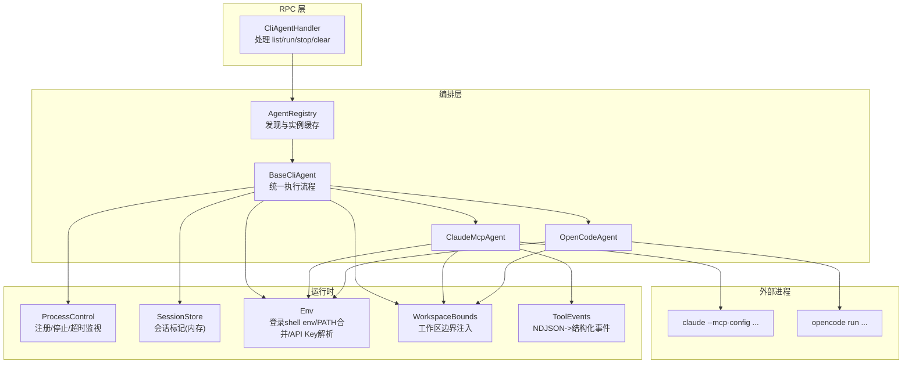
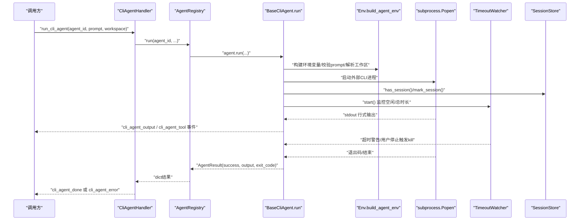
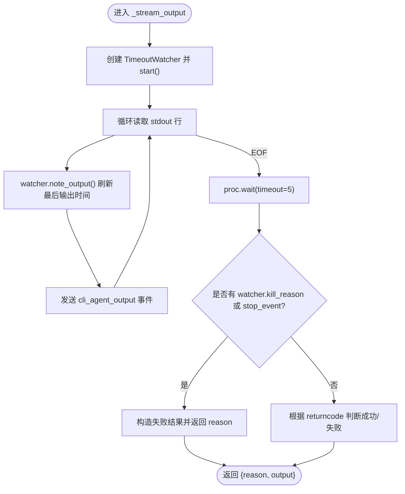
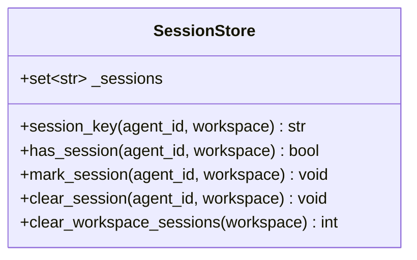
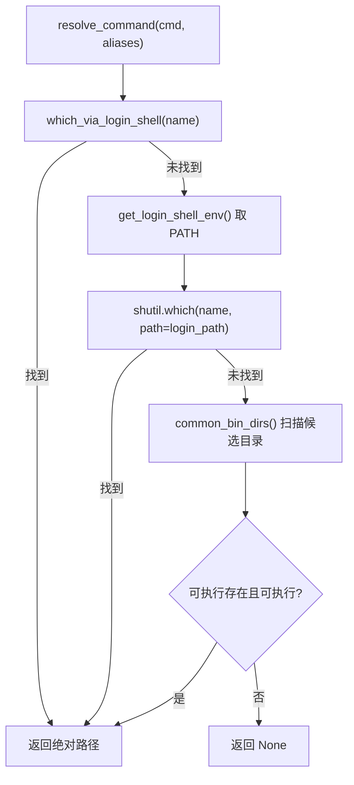
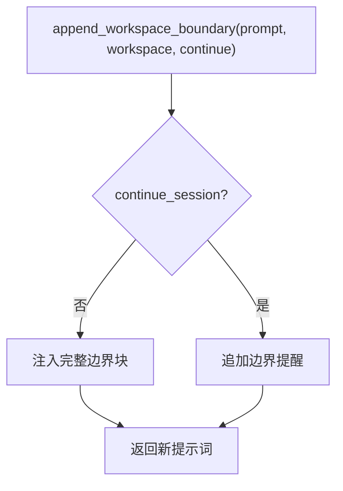
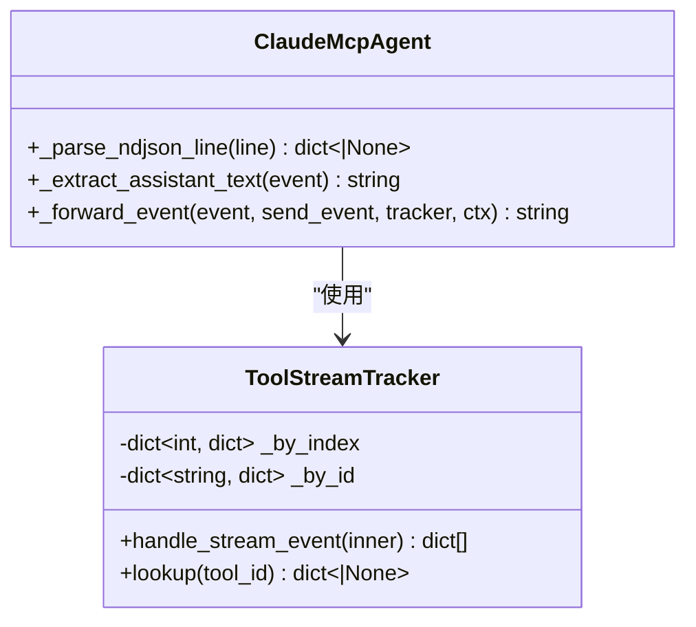
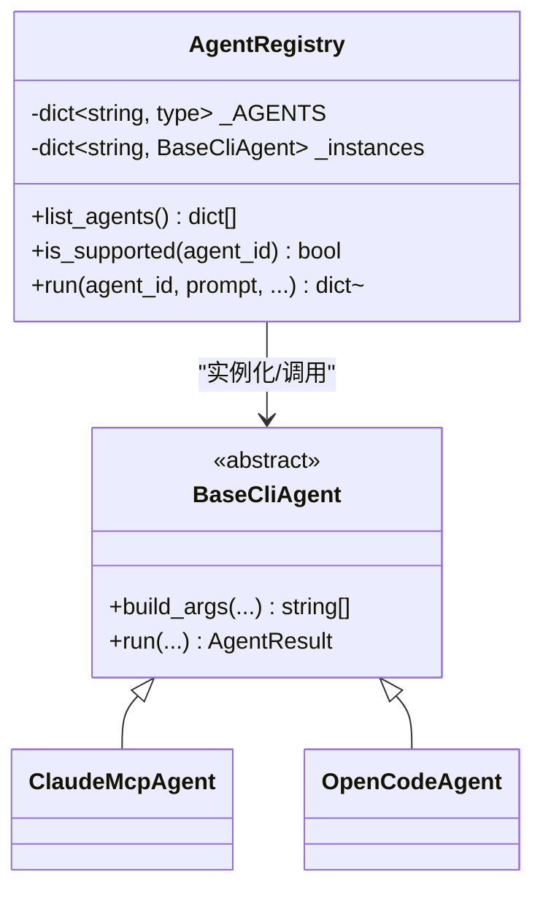
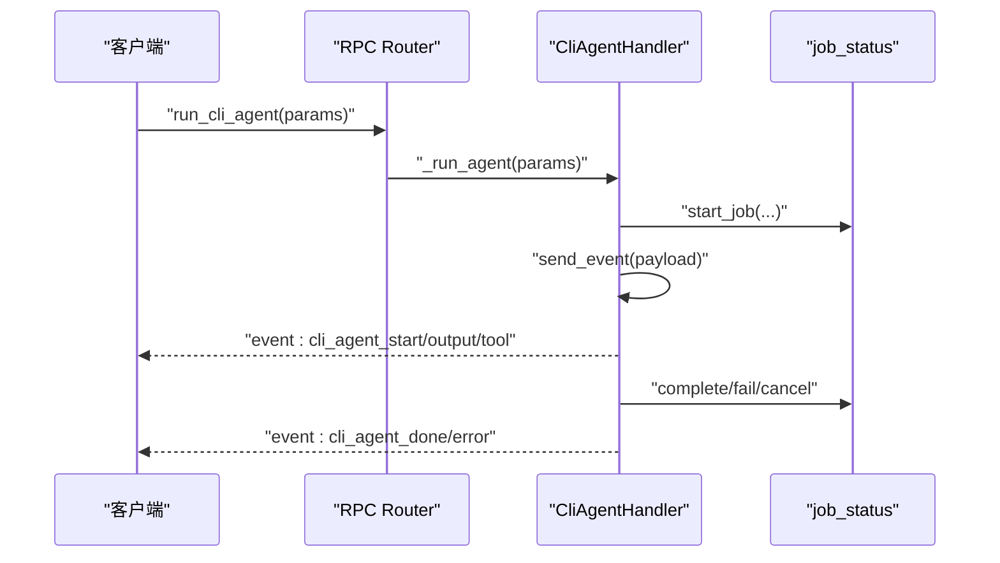
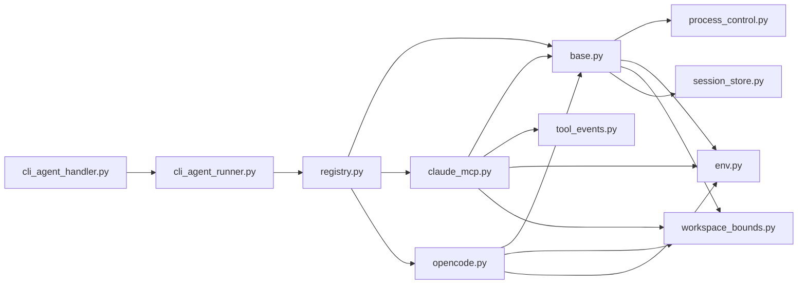

# 进程控制

<cite>
**本文引用的文件**   
- [process_control.py](file://python/sidecar/cli_agent/process_control.py)
- [session_store.py](file://python/sidecar/cli_agent/session_store.py)
- [base.py](file://python/sidecar/cli_agent/base.py)
- [env.py](file://python/sidecar/cli_agent/env.py)
- [registry.py](file://python/sidecar/cli_agent/registry.py)
- [workspace_bounds.py](file://python/sidecar/cli_agent/workspace_bounds.py)
- [tool_events.py](file://python/sidecar/cli_agent/tool_events.py)
- [claude_mcp.py](file://python/sidecar/cli_agent/agents/claude_mcp.py)
- [opencode.py](file://python/sidecar/cli_agent/agents/opencode.py)
- [cli_agent_runner.py](file://python/sidecar/cli_agent_runner.py)
- [cli_agent_handler.py](file://python/sidecar/handlers/cli_agent_handler.py)
- [test_cli_process_control.py](file://tests/unit/test_cli_process_control.py)
- [test_cli_session_store.py](file://tests/unit/test_cli_session_store.py)
</cite>

## 目录
1. [简介](#简介)
2. [项目结构](#项目结构)
3. [核心组件](#核心组件)
4. [架构总览](#架构总览)
5. [详细组件分析](#详细组件分析)
6. [依赖关系分析](#依赖关系分析)
7. [性能与资源特性](#性能与资源特性)
8. [故障排查指南](#故障排查指南)
9. [结论](#结论)
10. [附录：事件与协议规范](#附录事件与协议规范)

## 简介
本技术文档围绕 CLI Agent 进程控制系统，系统性阐述外部进程的启动、监控、终止机制；进程池管理、资源隔离与内存限制的实现现状与建议；会话存储系统（持久化、状态恢复、并发访问）；进程间通信协议、数据序列化与错误传播；健康检查、自动重启与优雅退出方案；安全沙箱、权限控制与资源清理最佳实践；以及监控指标收集、日志聚合与调试工具使用方法。

## 项目结构
CLI Agent 子系统位于 python/sidecar/cli_agent 包内，采用“抽象基类 + 具体 Agent 实现 + 注册表 + 进程控制 + 环境与安全边界”的分层设计。处理器通过 RPC 路由暴露对外接口，统一调度执行。

图示来源
- [cli_agent_handler.py:1-166](file://python/sidecar/handlers/cli_agent_handler.py#L1-L166)
- [registry.py:1-120](file://python/sidecar/cli_agent/registry.py#L1-L120)
- [base.py:1-383](file://python/sidecar/cli_agent/base.py#L1-L383)
- [claude_mcp.py:1-399](file://python/sidecar/cli_agent/agents/claude_mcp.py#L1-L399)
- [opencode.py:1-63](file://python/sidecar/cli_agent/agents/opencode.py#L1-L63)
- [process_control.py:1-130](file://python/sidecar/cli_agent/process_control.py#L1-L130)
- [session_store.py:1-43](file://python/sidecar/cli_agent/session_store.py#L1-L43)
- [env.py:1-257](file://python/sidecar/cli_agent/env.py#L1-L257)
- [workspace_bounds.py:1-64](file://python/sidecar/cli_agent/workspace_bounds.py#L1-L64)
- [tool_events.py:1-151](file://python/sidecar/cli_agent/tool_events.py#L1-L151)

章节来源
- [cli_agent_runner.py:1-127](file://python/sidecar/cli_agent_runner.py#L1-L127)
- [cli_agent_handler.py:1-166](file://python/sidecar/handlers/cli_agent_handler.py#L1-L166)

## 核心组件
- 进程生命周期与监控
  - 进程句柄注册、全局活跃进程、用户主动停止、空闲/总时长超时告警与强制终止。
- 会话存储
  - 基于 agent_id + 工作区路径的会话标记集合，支持新建/继续/清除。
- 环境与命令解析
  - 从登录 shell 获取完整环境变量与 PATH，智能合并，查找 API key，校验 prompt 与工作区。
- 工作区边界
  - 在提示词中注入安全边界约束，特定 agent 注入运行时配置以拒绝工作区外访问。
- 事件与协议
  - 将子进程输出与 NDJSON 流转换为统一事件类型，包括开始、输出、工具调用、完成、错误等。
- 注册表与执行入口
  - 集中注册支持的第三方 CLI agent，提供统一的运行接口。

章节来源
- [process_control.py:1-130](file://python/sidecar/cli_agent/process_control.py#L1-L130)
- [session_store.py:1-43](file://python/sidecar/cli_agent/session_store.py#L1-L43)
- [env.py:1-257](file://python/sidecar/cli_agent/env.py#L1-L257)
- [workspace_bounds.py:1-64](file://python/sidecar/cli_agent/workspace_bounds.py#L1-L64)
- [tool_events.py:1-151](file://python/sidecar/cli_agent/tool_events.py#L1-L151)
- [registry.py:1-120](file://python/sidecar/cli_agent/registry.py#L1-L120)

## 架构总览
下图展示一次完整的 CLI Agent 请求到外部进程执行的端到端流程，包含事件回传与错误传播。

图示来源
- [cli_agent_handler.py:34-134](file://python/sidecar/handlers/cli_agent_handler.py#L34-L134)
- [registry.py:58-83](file://python/sidecar/cli_agent/registry.py#L58-L83)
- [base.py:169-331](file://python/sidecar/cli_agent/base.py#L169-L331)
- [process_control.py:65-130](file://python/sidecar/cli_agent/process_control.py#L65-L130)
- [session_store.py:10-43](file://python/sidecar/cli_agent/session_store.py#L10-L43)

## 详细组件分析

### 进程控制与监控
- 进程句柄与注册
  - 使用线程锁保护的全局活跃进程句柄，记录子进程对象、agent_id、显示名、停止事件与告警标志。
- 用户停止
  - stop_active 设置停止事件并尝试 kill 当前活跃进程，返回成功与否及 agent 标识。
- 超时监视器
  - 后台线程轮询，检测空闲与总时长阈值，仅发出警告事件；若检测到用户停止则直接 kill。
- 测试覆盖
  - 验证空闲超时仅发警告不杀进程；用户停止能正确终止进程并置位停止事件。

图示来源
- [base.py:332-383](file://python/sidecar/cli_agent/base.py#L332-L383)
- [process_control.py:65-130](file://python/sidecar/cli_agent/process_control.py#L65-L130)

章节来源
- [process_control.py:15-63](file://python/sidecar/cli_agent/process_control.py#L15-L63)
- [test_cli_process_control.py:11-53](file://tests/unit/test_cli_process_control.py#L11-L53)

### 会话存储系统
- 键生成
  - 基于 agent_id 与规范化后的绝对工作区路径拼接，避免尾随斜杠差异。
- 操作
  - has_session/mark_session/clear_session/clear_workspace_sessions 均为内存集合操作。
- 行为
  - 无持久化；进程重启后会话状态丢失；适合短期多轮对话上下文延续。
- 并发
  - 使用 Python 全局 set，未加锁；在高并发场景下存在竞态风险。

图示来源
- [session_store.py:1-43](file://python/sidecar/cli_agent/session_store.py#L1-L43)

章节来源
- [test_cli_session_store.py:13-46](file://tests/unit/test_cli_session_store.py#L13-L46)

### 环境与命令解析
- 登录 shell 环境
  - 通过登录 shell 执行 env 获取用户真实环境变量，解决 GUI 启动时 PATH 不完整问题。
- 命令解析
  - 优先通过登录 shell 的 which/command -v 查找，其次用合并后的 PATH，最后扫描常见安装目录。
- API Key 查找
  - 优先级：进程环境变量 > 登录 shell 变量 > 配置精确字段 > 主 API key 兜底。
- Prompt 与工作区校验
  - 禁止空、超长、含非法字符、以选项前缀开头的 prompt；工作区需存在且为目录。

图示来源
- [env.py:136-166](file://python/sidecar/cli_agent/env.py#L136-L166)
- [env.py:69-91](file://python/sidecar/cli_agent/env.py#L69-L91)
- [env.py:93-134](file://python/sidecar/cli_agent/env.py#L93-L134)

章节来源
- [env.py:18-67](file://python/sidecar/cli_agent/env.py#L18-L67)
- [env.py:169-224](file://python/sidecar/cli_agent/env.py#L169-L224)
- [env.py:227-257](file://python/sidecar/cli_agent/env.py#L227-L257)

### 工作区边界与安全
- 提示词注入
  - 首次会话注入完整边界说明；继续会话追加提醒，确保模型始终知晓范围。
- 运行时限制
  - 针对 OpenCode 注入配置，拒绝工作区外目录访问；其他 agent 可通过环境变量扩展。
- 建议
  - 结合操作系统级 cgroups/ulimit 限制 CPU/内存/文件描述符；对子进程组进行信号隔离。

图示来源
- [workspace_bounds.py:22-41](file://python/sidecar/cli_agent/workspace_bounds.py#L22-L41)
- [workspace_bounds.py:51-64](file://python/sidecar/cli_agent/workspace_bounds.py#L51-L64)

章节来源
- [workspace_bounds.py:1-64](file://python/sidecar/cli_agent/workspace_bounds.py#L1-L64)

### 事件与协议（NDJSON 到结构化事件）
- Claude MCP 模式
  - 子进程以 stream-json 输出 NDJSON，内部解析 text、assistant、stream_event、tool_use/tool_result 等，映射为统一事件。
- Tool 事件追踪
  - ToolStreamTracker 维护 tool_use 的 index/id 映射，增量拼装 input_json_delta，最终输出 start/done 事件。
- 文本提取
  - 从多种事件类型中提取应展示给用户的文本片段，累积为最终输出。

图示来源
- [tool_events.py:28-99](file://python/sidecar/cli_agent/tool_events.py#L28-L99)
- [claude_mcp.py:177-399](file://python/sidecar/cli_agent/agents/claude_mcp.py#L177-L399)

章节来源
- [tool_events.py:101-151](file://python/sidecar/cli_agent/tool_events.py#L101-L151)
- [claude_mcp.py:1-168](file://python/sidecar/cli_agent/agents/claude_mcp.py#L1-L168)

### 注册表与执行入口
- 注册表
  - 集中定义支持的 agent 类，懒加载实例，提供列表与运行接口。
- 兼容入口
  - cli_agent_runner 保留旧版公开 API，转发至新实现，便于平滑迁移。

图示来源
- [registry.py:15-83](file://python/sidecar/cli_agent/registry.py#L15-L83)
- [base.py:53-126](file://python/sidecar/cli_agent/base.py#L53-L126)
- [claude_mcp.py:27-52](file://python/sidecar/cli_agent/agents/claude_mcp.py#L27-L52)
- [opencode.py:11-18](file://python/sidecar/cli_agent/agents/opencode.py#L11-L18)

章节来源
- [registry.py:85-120](file://python/sidecar/cli_agent/registry.py#L85-L120)
- [cli_agent_runner.py:53-75](file://python/sidecar/cli_agent_runner.py#L53-L75)

### RPC 处理器与任务状态
- 路由
  - 提供 list/run/stop/clear/generate_vault_agents_md 等接口。
- 并发控制
  - 使用互斥锁保证同一时刻仅一个 CLI agent 任务运行。
- 任务状态
  - 通过 job_status 上报进度、消息与元数据，事件透传给前端。

图示来源
- [cli_agent_handler.py:34-134](file://python/sidecar/handlers/cli_agent_handler.py#L34-L134)

章节来源
- [cli_agent_handler.py:1-166](file://python/sidecar/handlers/cli_agent_handler.py#L1-L166)

## 依赖关系分析
- 模块耦合
  - base.py 强依赖 process_control、env、workspace_bounds、session_store；具体 agent 继承 base 并复用这些能力。
- 外部依赖
  - subprocess 用于进程管理；logging 用于诊断；config 用于工作区路径与 API key 配置。
- 潜在环依赖
  - 当前未见循环导入；各模块职责清晰，分层明确。

图示来源
- [base.py:1-23](file://python/sidecar/cli_agent/base.py#L1-L23)
- [claude_mcp.py:1-24](file://python/sidecar/cli_agent/agents/claude_mcp.py#L1-L24)
- [opencode.py:1-8](file://python/sidecar/cli_agent/agents/opencode.py#L1-L8)
- [registry.py:1-12](file://python/sidecar/cli_agent/registry.py#L1-L12)
- [cli_agent_runner.py:14-47](file://python/sidecar/cli_agent_runner.py#L14-L47)
- [cli_agent_handler.py:1-19](file://python/sidecar/handlers/cli_agent_handler.py#L1-L19)

章节来源
- [base.py:1-23](file://python/sidecar/cli_agent/base.py#L1-L23)
- [registry.py:1-12](file://python/sidecar/cli_agent/registry.py#L1-L12)

## 性能与资源特性
- 进程 I/O
  - 逐行读取 stdout，bufsize=1，减少内存占用；stderr 重定向到 stdout 简化处理。
- 超时策略
  - 空闲与总时长阈值仅告警，不自动终止；用户停止才 kill，兼顾可控性与稳定性。
- 资源隔离建议
  - 使用操作系统级 cgroups/ulimit 限制 CPU、内存、文件描述符；对子进程组使用进程组与信号屏蔽。
- 内存限制现状
  - 代码层未实现内存限制；建议在容器或系统层面实施。
- 并发与锁
  - 会话存储未加锁，高并发下可能产生竞态；建议引入细粒度锁或原子操作。

[本节为通用指导，无需源码引用]

## 故障排查指南
- 常见问题定位
  - 命令未找到：检查 resolve_command 是否能在登录 shell 环境中解析到可执行文件。
  - API key 缺失：确认 lookup_api_key 的优先级链与环境变量是否正确设置。
  - 工作区无效：校验 resolve_workspace 返回的错误信息。
  - 进程卡死：查看超时警告事件与 stop_active 调用情况。
- 日志与事件
  - 关注 cli_agent_start/cli_agent_output/cli_agent_tool/cli_agent_done/cli_agent_error 事件序列。
  - 使用 logger 输出关键路径与异常堆栈。
- 单元测试辅助
  - 参考 test_cli_process_control.py 与 test_cli_session_store.py 的行为断言，快速复现与验证修复。

章节来源
- [env.py:136-166](file://python/sidecar/cli_agent/env.py#L136-L166)
- [env.py:186-198](file://python/sidecar/cli_agent/env.py#L186-L198)
- [env.py:247-257](file://python/sidecar/cli_agent/env.py#L247-L257)
- [test_cli_process_control.py:11-53](file://tests/unit/test_cli_process_control.py#L11-L53)
- [test_cli_session_store.py:13-46](file://tests/unit/test_cli_session_store.py#L13-L46)

## 结论
该进程控制系统以清晰的层次与职责划分实现了外部 CLI Agent 的统一接入、安全边界约束、会话延续与事件驱动的输出。当前实现聚焦于进程生命周期管理与基础安全加固，尚未内置进程池、内存限制与持久化会话。建议在生产部署中结合系统级资源管控与可观测性设施，完善健壮性与可运维性。

[本节为总结性内容，无需源码引用]

## 附录：事件与协议规范
- 事件类型
  - cli_agent_start：进程启动
  - cli_agent_output：文本输出片段
  - cli_agent_tool：工具调用 start/done
  - cli_agent_done：执行完成
  - cli_agent_error：错误/被用户停止
  - cli_agent_timeout_warning：空闲/总时长告警
- 数据序列化
  - 标准 JSON 事件；Claude MCP 模式使用 NDJSON 流，内部解析为上述事件。
- 错误传播
  - 非零退出码、异常捕获、用户停止均转化为 cli_agent_error 事件，并附带 message 与 stopped_by_user 标志。

章节来源
- [base.py:235-331](file://python/sidecar/cli_agent/base.py#L235-L331)
- [claude_mcp.py:269-399](file://python/sidecar/cli_agent/agents/claude_mcp.py#L269-L399)
- [process_control.py:116-130](file://python/sidecar/cli_agent/process_control.py#L116-L130)