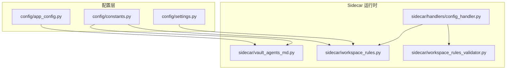
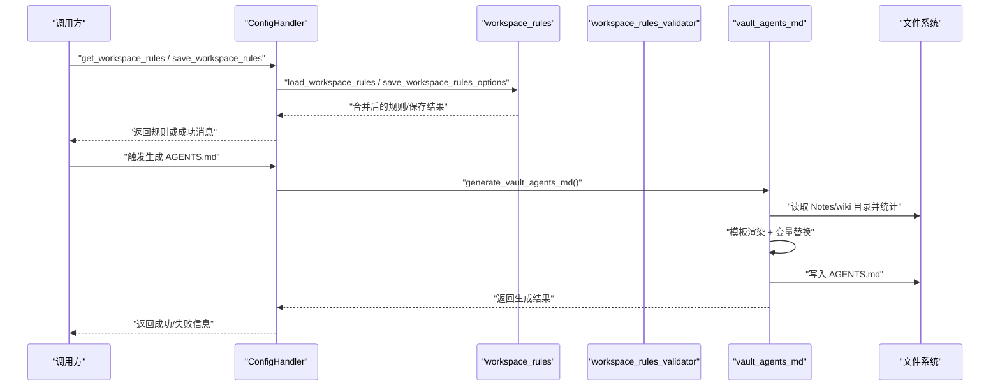
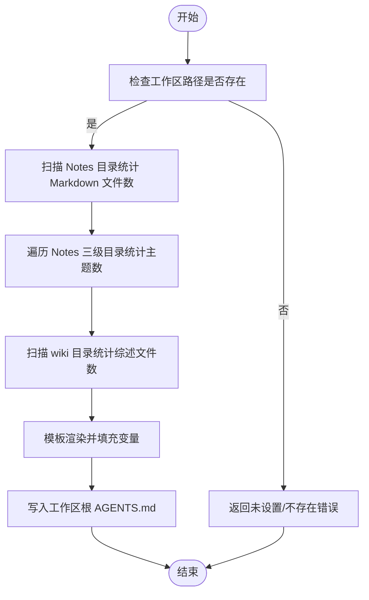
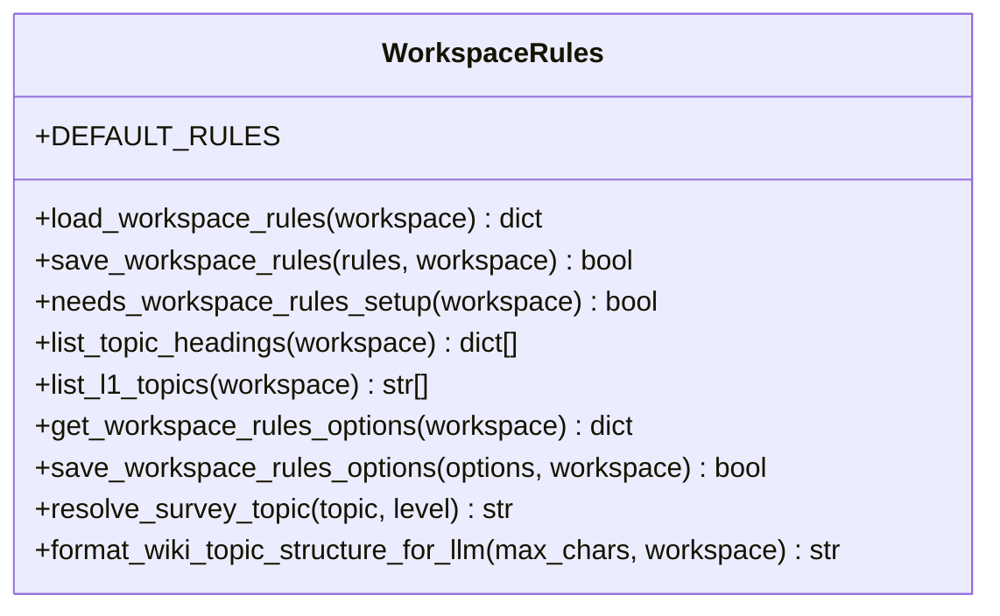
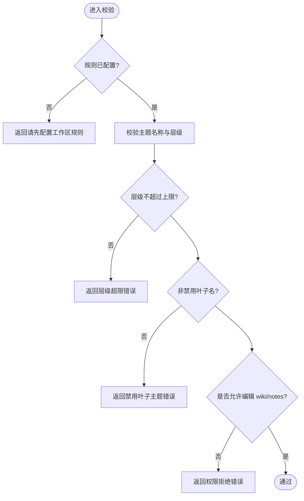
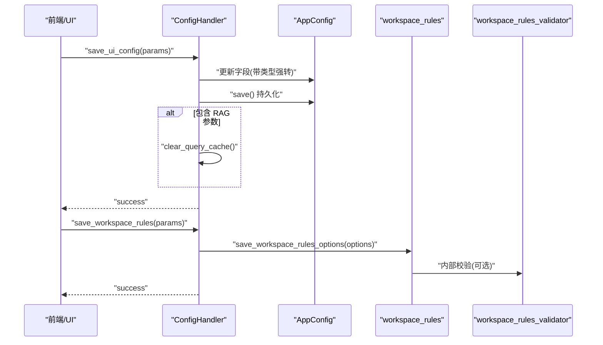
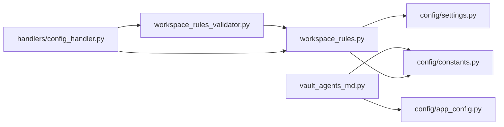

# 配置文件生成

<cite>
**本文引用的文件**   
- [vault_agents_md.py](file://python/sidecar/vault_agents_md.py)
- [app_config.py](file://config/app_config.py)
- [settings.py](file://config/settings.py)
- [constants.py](file://config/constants.py)
- [workspace_rules.py](file://python/sidecar/workspace_rules.py)
- [workspace_rules_validator.py](file://python/sidecar/workspace_rules_validator.py)
- [config_handler.py](file://python/sidecar/handlers/config_handler.py)
- [AGENTS.md](file://AGENTS.md)
</cite>

## 目录
1. [简介](#简介)
2. [项目结构](#项目结构)
3. [核心组件](#核心组件)
4. [架构总览](#架构总览)
5. [详细组件分析](#详细组件分析)
6. [依赖关系分析](#依赖关系分析)
7. [性能与可扩展性](#性能与可扩展性)
8. [故障排查指南](#故障排查指南)
9. [结论](#结论)
10. [附录：模板开发与调试](#附录模板开发与调试)

## 简介
本技术文档面向 CLI Agent 配置文件生成系统，聚焦以下目标：
- AGENTS.md 自动生成机制：模板渲染、变量替换、格式校验
- Vault 结构描述文件的生成逻辑：目录结构分析、文件关系映射、元数据提取
- 工作区规则的定义与应用：文件操作权限、路径约束、安全策略
- 笔记规范的动态生成：Markdown 模板、样式约定、内容结构
- 配置文件的版本管理、冲突解决、回滚机制
- 自定义模板开发指南、配置验证工具、调试方法

## 项目结构
与“配置文件生成”直接相关的代码主要分布在 sidecar 与 config 两个子系统中：
- sidecar 负责运行时处理（生成器、规则加载与校验、处理器路由）
- config 提供全局配置、常量与工作区状态

图表来源
- [vault_agents_md.py:1-194](file://python/sidecar/vault_agents_md.py#L1-L194)
- [app_config.py:1-396](file://config/app_config.py#L1-L396)
- [constants.py:1-52](file://config/constants.py#L1-L52)
- [settings.py:1-41](file://config/settings.py#L1-L41)
- [workspace_rules.py:1-200](file://python/sidecar/workspace_rules.py#L1-L200)
- [workspace_rules_validator.py:1-94](file://python/sidecar/workspace_rules_validator.py#L1-L94)
- [config_handler.py:1-286](file://python/sidecar/handlers/config_handler.py#L1-L286)

章节来源
- [vault_agents_md.py:1-194](file://python/sidecar/vault_agents_md.py#L1-L194)
- [app_config.py:1-396](file://config/app_config.py#L1-L396)
- [constants.py:1-52](file://config/constants.py#L1-L52)
- [settings.py:1-41](file://config/settings.py#L1-L41)
- [workspace_rules.py:1-200](file://python/sidecar/workspace_rules.py#L1-L200)
- [workspace_rules_validator.py:1-94](file://python/sidecar/workspace_rules_validator.py#L1-L94)
- [config_handler.py:1-286](file://python/sidecar/handlers/config_handler.py#L1-L286)

## 核心组件
- AGENTS.md 生成器：基于内置模板渲染当前工作区的结构说明与统计信息，输出到工作区根目录。
- 工作区规则：以 JSON 形式定义主题深度、综述策略、AI 可编辑范围等，并提供迁移与校验能力。
- 配置处理器：暴露 API 用于读写 UI 配置、API 配置、项目规则与工作区规则。
- 配置中心：集中管理应用配置、环境变量覆盖、持久化与线程安全访问。

章节来源
- [vault_agents_md.py:145-194](file://python/sidecar/vault_agents_md.py#L145-L194)
- [workspace_rules.py:15-92](file://python/sidecar/workspace_rules.py#L15-L92)
- [config_handler.py:16-286](file://python/sidecar/handlers/config_handler.py#L16-L286)
- [app_config.py:28-110](file://config/app_config.py#L28-L110)

## 架构总览
下图展示了从前端/调用方到后端处理器、再到具体生成器与规则模块的交互流程。

图表来源
- [config_handler.py:264-286](file://python/sidecar/handlers/config_handler.py#L264-L286)
- [workspace_rules.py:59-92](file://python/sidecar/workspace_rules.py#L59-L92)
- [vault_agents_md.py:145-194](file://python/sidecar/vault_agents_md.py#L145-L194)

## 详细组件分析

### AGENTS.md 自动生成器
职责
- 扫描工作区 Notes 与 wiki 目录，统计笔记数、主题数、综述数
- 使用内置模板进行渲染，将工作区路径、目录名、统计值与时间戳注入
- 将生成的 AGENTS.md 写入工作区根目录

关键实现要点
- 模板字符串包含占位符，通过 format 完成变量替换
- 统计函数对 Notes 下 .md 文件计数，排除 readme；主题计数遍历三层目录；综述计数匹配文件名关键词
- 异常捕获保证在目录不存在或权限不足时返回错误信息而非崩溃

图表来源
- [vault_agents_md.py:105-143](file://python/sidecar/vault_agents_md.py#L105-L143)
- [vault_agents_md.py:145-194](file://python/sidecar/vault_agents_md.py#L145-L194)

章节来源
- [vault_agents_md.py:18-102](file://python/sidecar/vault_agents_md.py#L18-L102)
- [vault_agents_md.py:105-143](file://python/sidecar/vault_agents_md.py#L105-L143)
- [vault_agents_md.py:145-194](file://python/sidecar/vault_agents_md.py#L145-L194)

### 工作区规则定义与应用
职责
- 定义默认规则（主题最大深度、是否自动更新综述、综述层级、AI 可编辑范围等）
- 支持从旧 schema.md 迁移至 workspace_rules.json
- 提供选项获取与保存接口，并对输入进行规范化与边界检查

关键实现要点
- 加载顺序：优先读取 .noteai/workspace_rules.json，否则尝试从 schema.md 迁移，最后回退到默认规则
- 保存时对 max_topic_depth 与 survey_at_level 做上下界裁剪，布尔字段强制类型转换
- 列表一级主题优先基于 Notes 目录结构，若无则回退到 TopicManager 构建的树

图表来源
- [workspace_rules.py:15-92](file://python/sidecar/workspace_rules.py#L15-L92)
- [workspace_rules.py:99-200](file://python/sidecar/workspace_rules.py#L99-L200)

章节来源
- [workspace_rules.py:15-92](file://python/sidecar/workspace_rules.py#L15-L92)
- [workspace_rules.py:99-200](file://python/sidecar/workspace_rules.py#L99-L200)

### 工作区规则运行时校验
职责
- 在运行时对主题合法性、规则就绪状态、wiki/notes 可写权限进行检查
- 禁止将内容归入“其他/杂项/未分类”类叶子主题
- 提供便捷断言式校验供上层调用

关键实现要点
- validate_topic 检查空值、非法字符、层级上限、禁用叶子名
- check_wiki_writable / check_notes_writable 依据规则决定是否允许 AI 修改对应目录
- require_topic 组合规则就绪与主题校验

图表来源
- [workspace_rules_validator.py:29-94](file://python/sidecar/workspace_rules_validator.py#L29-L94)

章节来源
- [workspace_rules_validator.py:21-94](file://python/sidecar/workspace_rules_validator.py#L21-L94)

### 配置处理器（UI/API 入口）
职责
- 暴露 get/save_api_config、get/save_ui_config、get/save_project_rules、get/save_workspace_rules 等 RPC 路由
- 对 UI 配置项进行类型强转与边界限制（浮点、整型、布尔）
- 保存后按需清理查询缓存，确保一致性

关键实现要点
- _coerce_* 静态方法统一类型转换与范围裁剪
- 保存 UI 配置时，若涉及 RAG 相关参数，触发检索缓存清理
- 项目规则与工作区规则分别写入 .ai_memory/project_rules.md 与 .noteai/workspace_rules.json

图表来源
- [config_handler.py:135-215](file://python/sidecar/handlers/config_handler.py#L135-L215)
- [config_handler.py:270-286](file://python/sidecar/handlers/config_handler.py#L270-L286)

章节来源
- [config_handler.py:16-286](file://python/sidecar/handlers/config_handler.py#L16-L286)

### 配置中心与常量
职责
- AppConfig 作为单例，提供配置加载、保存、校验与线程安全访问
- constants 提供路径常量、忽略目录集合、主题分隔符等
- settings 聚合导出常用符号，便于各模块导入

关键实现要点
- load_from_file 按优先级合并：环境变量 > 系统目录 api_config.json > 项目 config.json > 默认值
- save_to_file 分离敏感字段与非敏感字段，必要时写入系统目录并限制权限
- is_ignored_dir 用于文件监听与扫描时过滤无关目录

章节来源
- [app_config.py:212-311](file://config/app_config.py#L212-L311)
- [app_config.py:313-383](file://config/app_config.py#L313-L383)
- [constants.py:26-52](file://config/constants.py#L26-L52)
- [settings.py:1-41](file://config/settings.py#L1-L41)

## 依赖关系分析
- vault_agents_md 依赖 config.config 与 constants.NOTES_FOLDER，用于定位工作区与目录名
- workspace_rules 依赖 config.settings.WORKSPACE_APP_FOLDER 与 constants.TOPIC_SEP
- workspace_rules_validator 依赖 workspace_rules 的加载与就绪检查
- config_handler 作为路由层，组合上述模块对外暴露 API

图表来源
- [vault_agents_md.py:14-16](file://python/sidecar/vault_agents_md.py#L14-L16)
- [workspace_rules.py:9-11](file://python/sidecar/workspace_rules.py#L9-L11)
- [workspace_rules_validator.py:5-6](file://python/sidecar/workspace_rules_validator.py#L5-L6)
- [config_handler.py:264-286](file://python/sidecar/handlers/config_handler.py#L264-L286)

章节来源
- [vault_agents_md.py:14-16](file://python/sidecar/vault_agents_md.py#L14-L16)
- [workspace_rules.py:9-11](file://python/sidecar/workspace_rules.py#L9-L11)
- [workspace_rules_validator.py:5-6](file://python/sidecar/workspace_rules_validator.py#L5-L6)
- [config_handler.py:264-286](file://python/sidecar/handlers/config_handler.py#L264-L286)

## 性能与可扩展性
- 生成器采用一次性扫描与简单计数，复杂度近似 O(N+M)，N 为 Notes 下文件数，M 为 wiki 下文件数；适合中小规模工作区
- 规则加载与保存均为轻量 JSON 读写，I/O 开销可控
- 如需扩展模板或新增统计维度，可在生成器中增加计数函数并在模板中添加占位符
- 建议对大仓库引入增量扫描或索引缓存以降低重复扫描成本

[本节为通用指导，不直接分析具体文件]

## 故障排查指南
常见问题与定位思路
- 未设置工作区或路径不存在：生成器会返回明确错误信息，确认 config.workspace_path 有效且存在
- 权限不足：写入 AGENTS.md 或保存规则时抛出权限错误，检查目标目录权限
- 规则未配置：校验器提示需先完成工作区规则设置，通过 UI 或 API 完成初始化
- 主题非法：包含路径字符、层级超限或使用禁用叶子名，调整主题命名与层级

章节来源
- [vault_agents_md.py:151-194](file://python/sidecar/vault_agents_md.py#L151-L194)
- [workspace_rules_validator.py:55-94](file://python/sidecar/workspace_rules_validator.py#L55-L94)
- [config_handler.py:270-286](file://python/sidecar/handlers/config_handler.py#L270-L286)

## 结论
本系统围绕“配置即规范”的理念，通过模板化生成与规则化约束，为 CLI Agent 提供了清晰的工作区结构与行为边界。生成器负责呈现现状，规则模块负责约束未来，处理器负责桥接前后端。整体设计简洁、可维护性强，易于扩展新的模板与规则。

[本节为总结性内容，不直接分析具体文件]

## 附录：模板开发与调试

### 自定义模板开发指南
- 在生成器中新增模板字符串，定义占位符（如 {key}），并在渲染时传入对应值
- 新增统计函数，计算所需指标（如综述数量、标签分布等）
- 在模板中引用新字段，保持可读性与一致性

参考路径
- [模板定义位置:18-102](file://python/sidecar/vault_agents_md.py#L18-L102)
- [渲染与写入位置:170-194](file://python/sidecar/vault_agents_md.py#L170-L194)

### 配置验证工具
- 使用 workspace_rules_validator 提供的校验函数进行前置检查
- 在保存 UI 配置时利用 _coerce_* 方法进行类型与范围校验

参考路径
- [校验函数:29-94](file://python/sidecar/workspace_rules_validator.py#L29-L94)
- [类型强转方法:109-134](file://python/sidecar/handlers/config_handler.py#L109-L134)

### 调试方法
- 查看生成器日志输出，确认统计与写入步骤
- 在工作区 .noteai/workspace_rules.json 中检查规则是否正确合并与持久化
- 通过 ConfigHandler 的 API 逐项测试配置项生效情况

参考路径
- [生成器日志:182-193](file://python/sidecar/vault_agents_md.py#L182-L193)
- [规则保存与合并:79-92](file://python/sidecar/workspace_rules.py#L79-L92)
- [UI 配置保存:135-215](file://python/sidecar/handlers/config_handler.py#L135-L215)

### 笔记规范与示例
- 顶层 AGENTS.md 提供了项目级行为规范与约定，可作为工作区生成内容的参考基准

参考路径
- [项目级 AGENTS.md:1-157](file://AGENTS.md#L1-L157)