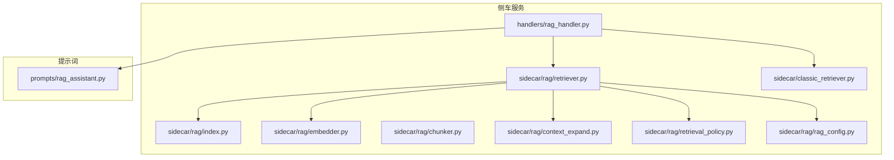
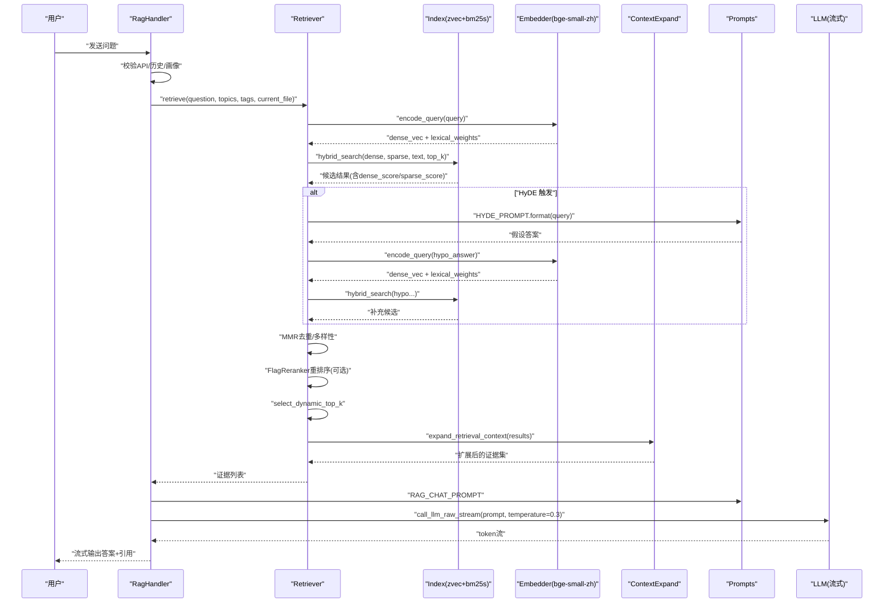
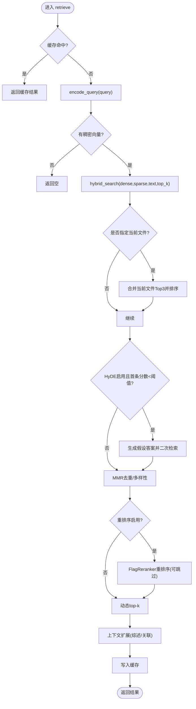
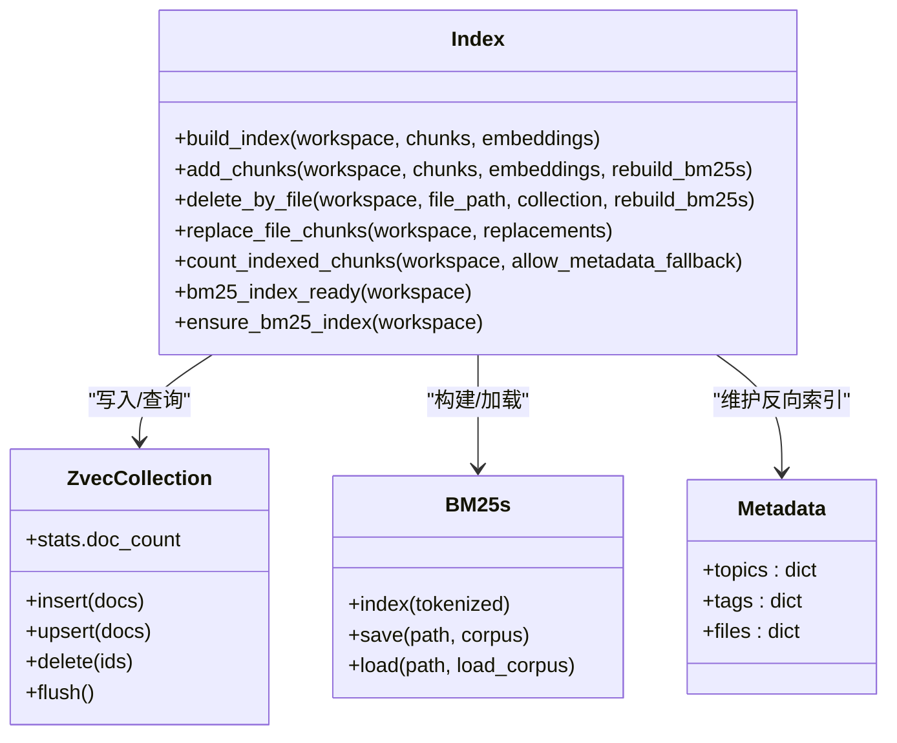
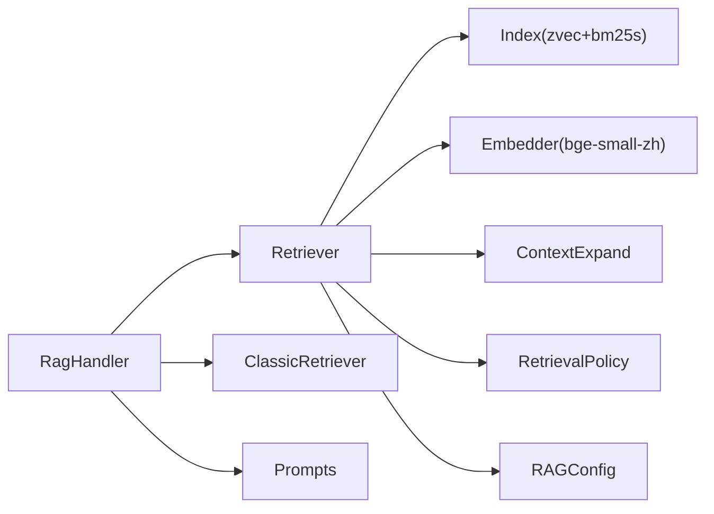

# RAG 检索系统

<cite>
**本文引用的文件**
- [retriever.py](file://python/sidecar/rag/retriever.py)
- [index.py](file://python/sidecar/rag/index.py)
- [embedder.py](file://python/sidecar/rag/embedder.py)
- [chunker.py](file://python/sidecar/rag/chunker.py)
- [context_expand.py](file://python/sidecar/rag/context_expand.py)
- [retrieval_policy.py](file://python/sidecar/rag/retrieval_policy.py)
- [rag_config.py](file://python/sidecar/rag/rag_config.py)
- [rag_handler.py](file://python/sidecar/handlers/rag_handler.py)
- [classic_retriever.py](file://python/sidecar/classic_retriever.py)
- [rag_assistant.py](file://prompts/rag_assistant.py)
</cite>

## 目录
1. [简介](#简介)
2. [项目结构](#项目结构)
3. [核心组件](#核心组件)
4. [架构总览](#架构总览)
5. [详细组件分析](#详细组件分析)
6. [依赖关系分析](#依赖关系分析)
7. [性能与调优](#性能与调优)
8. [故障排除指南](#故障排除指南)
9. [结论](#结论)
10. [附录](#附录)

## 简介
本技术文档面向 NoteAI 的检索增强生成（RAG）子系统，系统性阐述从查询预处理到 LLM 流式输出的完整链路：查询预处理 → HyDE 假设文档生成 → 向量编码 → 混合检索（稠密 zvec + 稀疏 bm25s）→ 重排序（FlagReranker）→ MMR 多样性选择 → 上下文扩展 → LLM 流式输出。同时覆盖索引构建与维护、文本分块策略、嵌入模型与重排序算法选型、问答模式与助手模式差异、Agent 工具调用能力，以及检索效果调优、性能优化与故障排除实践。

## 项目结构
RAG 相关代码主要位于 sidecar/rag 模块，配合 handlers 层对外暴露接口，提示词集中在 prompts 包中。

图表来源
- [rag_handler.py:231-554](file://python/sidecar/handlers/rag_handler.py#L231-L554)
- [retriever.py:102-196](file://python/sidecar/rag/retriever.py#L102-L196)
- [index.py:502-582](file://python/sidecar/rag/index.py#L502-L582)
- [embedder.py:334-384](file://python/sidecar/rag/embedder.py#L334-L384)
- [chunker.py:11-25](file://python/sidecar/rag/chunker.py#L11-L25)
- [context_expand.py:147-198](file://python/sidecar/rag/context_expand.py#L147-L198)
- [retrieval_policy.py:58-101](file://python/sidecar/rag/retrieval_policy.py#L58-L101)
- [rag_config.py:21-64](file://python/sidecar/rag/rag_config.py#L21-L64)
- [classic_retriever.py:72-168](file://python/sidecar/classic_retriever.py#L72-L168)
- [rag_assistant.py:120-141](file://prompts/rag_assistant.py#L120-L141)

章节来源
- [rag_handler.py:231-554](file://python/sidecar/handlers/rag_handler.py#L231-L554)
- [retriever.py:102-196](file://python/sidecar/rag/retriever.py#L102-L196)
- [index.py:502-582](file://python/sidecar/rag/index.py#L502-L582)
- [embedder.py:334-384](file://python/sidecar/rag/embedder.py#L334-L384)
- [chunker.py:11-25](file://python/sidecar/rag/chunker.py#L11-L25)
- [context_expand.py:147-198](file://python/sidecar/rag/context_expand.py#L147-L198)
- [retrieval_policy.py:58-101](file://python/sidecar/rag/retrieval_policy.py#L58-L101)
- [rag_config.py:21-64](file://python/sidecar/rag/rag_config.py#L21-L64)
- [classic_retriever.py:72-168](file://python/sidecar/classic_retriever.py#L72-L168)
- [rag_assistant.py:120-141](file://prompts/rag_assistant.py#L120-L141)

## 核心组件
- 检索编排器 retriever：串联查询缓存、HyDE、混合检索、MMR、重排序、动态 top-k、上下文扩展等步骤，并维护查询结果 TTL 缓存。
- 索引引擎 index：基于 zvec 稠密向量与 bm25s 稀疏倒排的双路索引；提供全量/增量重建、批量写入、元数据反查、BM25 缓存与集合句柄缓存。
- 嵌入器 embedder：使用 BAAI/bge-small-zh-v1.5 生成 512 维稠密向量，结合全局 IDF 计算稀疏权重；支持下载回调与进度回调。
- 分块器 chunker：按 ## 与 ### 标题切分，段落级再切分，表格与代码块保持完整性，设置重叠窗口。
- 上下文扩展 context_expand：在检索结果前后插入主题综述与已确认双向链接片段，丰富回答背景。
- 检索策略 retrieval_policy：根据问题复杂度与分数分布动态决定引用数量，限制唯一来源数。
- 配置 rag_config：集中管理 top_k、HyDE 阈值、重排序开关与跳过阈值、稠密/稀疏权重等运行时参数。
- 对话处理器 rag_handler：封装聊天流程、索引构建任务、错误冷却、流式输出与引用抽取。
- 经典检索 classic_retriever：无向量的全文+主题树检索，作为降级或辅助路径。
- 提示词 rag_assistant：定义助手人格、HyDE 模板、RAG 对话模板等。

章节来源
- [retriever.py:102-196](file://python/sidecar/rag/retriever.py#L102-L196)
- [index.py:502-582](file://python/sidecar/rag/index.py#L502-L582)
- [embedder.py:334-384](file://python/sidecar/rag/embedder.py#L334-L384)
- [chunker.py:11-25](file://python/sidecar/rag/chunker.py#L11-L25)
- [context_expand.py:147-198](file://python/sidecar/rag/context_expand.py#L147-L198)
- [retrieval_policy.py:58-101](file://python/sidecar/rag/retrieval_policy.py#L58-L101)
- [rag_config.py:21-64](file://python/sidecar/rag/rag_config.py#L21-L64)
- [rag_handler.py:231-554](file://python/sidecar/handlers/rag_handler.py#L231-L554)
- [classic_retriever.py:72-168](file://python/sidecar/classic_retriever.py#L72-L168)
- [rag_assistant.py:120-141](file://prompts/rag_assistant.py#L120-L141)

## 架构总览
下图展示一次“问答模式”的端到端流程：用户提问经 RagHandler 进入检索管线，依次执行 HyDE、混合检索、MMR、重排序、动态 top-k、上下文扩展，最终拼接提示词并流式返回答案。

图表来源
- [rag_handler.py:478-554](file://python/sidecar/handlers/rag_handler.py#L478-L554)
- [retriever.py:102-196](file://python/sidecar/rag/retriever.py#L102-L196)
- [retriever.py:198-227](file://python/sidecar/rag/retriever.py#L198-L227)
- [retriever.py:229-291](file://python/sidecar/rag/retriever.py#L229-L291)
- [retriever.py:293-325](file://python/sidecar/rag/retriever.py#L293-L325)
- [retrieval_policy.py:58-86](file://python/sidecar/rag/retrieval_policy.py#L58-L86)
- [context_expand.py:147-198](file://python/sidecar/rag/context_expand.py#L147-L198)
- [rag_assistant.py:120-141](file://prompts/rag_assistant.py#L120-L141)

## 详细组件分析

### 检索编排器（Retriever）
职责
- 统一入口 retrieve：查询缓存命中则直接返回；否则进行编码、混合检索、HyDE 回退、MMR、重排序、动态 top-k、上下文扩展与缓存落盘。
- HyDE：当首条结果分数低于阈值时，调用 LLM 生成假设答案，再用该假设答案进行二次检索以召回更多相关片段。
- MMR：对候选集做相关性-多样性权衡，避免重复信息堆叠。
- 重排序：使用 FlagReranker 对候选进行细粒度打分，若最高分已高于跳过阈值则直接短路。
- 动态 top-k：依据问题复杂度与分数分布自适应调整引用数量。
- 上下文扩展：在证据前后插入主题综述与关联笔记片段。

关键实现要点
- 查询缓存：TTLCache，键包含工作区、query、topics、tags、current_file，过期时间 5 分钟。
- 当前文件优先：将当前打开文件的最佳片段加入候选池，但不赋予特权，仍参与后续排序。
- 线程安全：重排序器单例加锁，失败后冷却一段时间避免雪崩。

图表来源
- [retriever.py:102-196](file://python/sidecar/rag/retriever.py#L102-L196)
- [retriever.py:198-227](file://python/sidecar/rag/retriever.py#L198-L227)
- [retriever.py:229-291](file://python/sidecar/rag/retriever.py#L229-L291)
- [retriever.py:293-325](file://python/sidecar/rag/retriever.py#L293-L325)
- [retrieval_policy.py:58-86](file://python/sidecar/rag/retrieval_policy.py#L58-L86)
- [context_expand.py:147-198](file://python/sidecar/rag/context_expand.py#L147-L198)

章节来源
- [retriever.py:102-196](file://python/sidecar/rag/retriever.py#L102-L196)
- [retriever.py:198-227](file://python/sidecar/rag/retriever.py#L198-L227)
- [retriever.py:229-291](file://python/sidecar/rag/retriever.py#L229-L291)
- [retriever.py:293-325](file://python/sidecar/rag/retriever.py#L293-L325)
- [retrieval_policy.py:58-86](file://python/sidecar/rag/retrieval_policy.py#L58-L86)
- [context_expand.py:147-198](file://python/sidecar/rag/context_expand.py#L147-L198)

### 索引引擎（Index）
职责
- 稠密索引：zvec Collection，存储 512 维 dense 向量与字段（content、file_path、topic、tags_json、section_title）。
- 稀疏索引：bm25s 倒排，中文停用词过滤，k1=1.5，b=0.75。
- 元数据反查：metadata.json 维护 topic/tag/file 的反向映射，用于快速过滤与统计。
- 构建与更新：支持全量构建与增量更新；原子替换 staging→production；BM25 重建延迟至批处理末尾以减少昂贵操作。
- 缓存：zvec 集合句柄按 workspace 缓存；bm25s 加载结果内存缓存，避免重复 IO。

关键实现要点
- 并发控制：_COLLECTION_IO_LOCK 串行化集合读写；_INDEX_OPERATION_LOCKS 保证同一 workspace 的索引写互斥。
- 版本兼容：manifest.json 记录 schema_version，不匹配时自动重建集合与 BM25。
- 健壮性：集合打开失败重试、GC 回收、清理 stale lock 文件，并提供友好的“被占用”错误提示。

图表来源
- [index.py:148-166](file://python/sidecar/rag/index.py#L148-L166)
- [index.py:502-582](file://python/sidecar/rag/index.py#L502-L582)
- [index.py:596-644](file://python/sidecar/rag/index.py#L596-L644)
- [index.py:704-773](file://python/sidecar/rag/index.py#L704-L773)
- [index.py:786-800](file://python/sidecar/rag/index.py#L786-L800)

章节来源
- [index.py:148-166](file://python/sidecar/rag/index.py#L148-L166)
- [index.py:502-582](file://python/sidecar/rag/index.py#L502-L582)
- [index.py:596-644](file://python/sidecar/rag/index.py#L596-L644)
- [index.py:704-773](file://python/sidecar/rag/index.py#L704-L773)
- [index.py:786-800](file://python/sidecar/rag/index.py#L786-L800)

### 嵌入器（Embedder）
职责
- 稠密编码：BAAI/bge-small-zh-v1.5，维度 512，查询前缀注入以提升检索对齐。
- 稀疏编码：jieba 分词 + 全局 IDF（首次全量构建时持久化），未命中时回退为批次内 IDF。
- 模型加载：带重试与缓存清理逻辑，支持下载回调与 ONNX 推理线程数自适应。

关键实现要点
- 环境变量：HF_HOME/HUGGINGFACE_HUB_CACHE/TRANSFORMERS_CACHE 指向应用数据目录，镜像源 hf-mirror.com。
- 全局 IDF：全量重建时保存 global_idf.json，查询阶段优先使用，提升稀疏权重稳定性。

章节来源
- [embedder.py:19-35](file://python/sidecar/rag/embedder.py#L19-L35)
- [embedder.py:140-165](file://python/sidecar/rag/embedder.py#L140-L165)
- [embedder.py:173-224](file://python/sidecar/rag/embedder.py#L173-L224)
- [embedder.py:258-284](file://python/sidecar/rag/embedder.py#L258-L284)
- [embedder.py:334-384](file://python/sidecar/rag/embedder.py#L334-L384)

### 分块器（Chunker）
职责
- 按 Markdown 标题层级（##、###）切分，段落级再切分，表格与代码块整体保留。
- 最大块长度 1000 字符，重叠窗口至少 100 字符或 20% 比例，确保跨段语义连贯。
- 提取 frontmatter 中的 topic/tags，并为每个 chunk 生成稳定 id。

章节来源
- [chunker.py:11-25](file://python/sidecar/rag/chunker.py#L11-L25)
- [chunker.py:27-42](file://python/sidecar/rag/chunker.py#L27-L42)
- [chunker.py:45-103](file://python/sidecar/rag/chunker.py#L45-L103)
- [chunker.py:105-132](file://python/sidecar/rag/chunker.py#L105-L132)
- [chunker.py:153-163](file://python/sidecar/rag/chunker.py#L153-L163)

### 上下文扩展（ContextExpand）
职责
- 在检索结果前插入主题综述（最多 2 个，截断至 2800 字）。
- 在检索结果后追加已确认的双向链接片段（最多 4 个，每篇截取 700 字）。
- 去重与来源标记，便于下游区分证据与背景材料。

章节来源
- [context_expand.py:59-100](file://python/sidecar/rag/context_expand.py#L59-L100)
- [context_expand.py:103-144](file://python/sidecar/rag/context_expand.py#L103-L144)
- [context_expand.py:147-198](file://python/sidecar/rag/context_expand.py#L147-L198)

### 检索策略（RetrievalPolicy）
职责
- 问题复杂度分类：简单/中等/宽泛，依据关键词、长度与分隔符判断。
- 动态 top-k：根据最高分与次高分差距、来源/主题多样性、问题类型自适应选取 2~8 条。
- 唯一来源限制：防止过多内容来自单一文件。

章节来源
- [retrieval_policy.py:6-39](file://python/sidecar/rag/retrieval_policy.py#L6-L39)
- [retrieval_policy.py:58-86](file://python/sidecar/rag/retrieval_policy.py#L58-L86)
- [retrieval_policy.py:88-101](file://python/sidecar/rag/retrieval_policy.py#L88-L101)

### 配置（RAGConfig）
职责
- top_k：默认 5，带标签过滤时默认 7，范围 1~50。
- HyDE：开关与阈值（默认 0.33）。
- 重排序：开关与跳过阈值（默认 0.75），支持环境变量关闭。
- 混合权重：稠密权重默认 0.7，稀疏权重 0.3。

章节来源
- [rag_config.py:21-64](file://python/sidecar/rag/rag_config.py#L21-L64)

### 对话处理器（RagHandler）
职责
- 索引构建：异步任务，进度事件推送，错误冷却与状态上报。
- 问答流程：校验 API 配置、压缩历史、加载用户画像、选择检索路径（向量/经典）、构造提示词、流式输出、引用抽取与质量评估。
- 选择查找：先给出快速解释，再根据意图路由走知识库或联网搜索。

章节来源
- [rag_handler.py:30-115](file://python/sidecar/handlers/rag_handler.py#L30-L115)
- [rag_handler.py:231-296](file://python/sidecar/handlers/rag_handler.py#L231-L296)
- [rag_handler.py:329-362](file://python/sidecar/handlers/rag_handler.py#L329-L362)
- [rag_handler.py:416-476](file://python/sidecar/handlers/rag_handler.py#L416-L476)
- [rag_handler.py:478-554](file://python/sidecar/handlers/rag_handler.py#L478-L554)
- [rag_handler.py:555-566](file://python/sidecar/handlers/rag_handler.py#L555-L566)

### 经典检索（ClassicRetriever）
职责
- 无向量路径：主题树 + 全文索引，支持 topic/tags 过滤，同样接入综述与双向链接扩展。
- 适用于禁用向量或降级场景。

章节来源
- [classic_retriever.py:72-168](file://python/sidecar/classic_retriever.py#L72-L168)

### 提示词（RAG Assistant Prompts）
职责
- 助手人格、HyDE 模板、RAG 对话模板、无上下文/联网模板等，驱动 LLM 行为与引用规范。

章节来源
- [rag_assistant.py:1-6](file://prompts/rag_assistant.py#L1-L6)
- [rag_assistant.py:120-141](file://prompts/rag_assistant.py#L120-L141)

## 依赖关系分析
- 外部库
  - zvec：稠密向量集合与 HNSW 索引。
  - bm25s：稀疏倒排索引与检索。
  - fastembed + onnxruntime：bge-small-zh-v1.5 推理。
  - jieba：中文分词与全局 IDF 计算。
  - FlagEmbedding.FlagReranker：重排序模型 bge-reranker-v2-m3。
- 内部耦合
  - retriever 强依赖 index、embedder、context_expand、retrieval_policy、rag_config。
  - rag_handler 聚合 retriever/classic_retriever 与 prompts，负责 UI 事件与流式输出。
  - index 独立于上层业务，仅通过函数契约交互。

图表来源
- [rag_handler.py:478-554](file://python/sidecar/handlers/rag_handler.py#L478-L554)
- [retriever.py:102-196](file://python/sidecar/rag/retriever.py#L102-L196)
- [index.py:502-582](file://python/sidecar/rag/index.py#L502-L582)
- [embedder.py:334-384](file://python/sidecar/rag/embedder.py#L334-L384)
- [context_expand.py:147-198](file://python/sidecar/rag/context_expand.py#L147-L198)
- [retrieval_policy.py:58-86](file://python/sidecar/rag/retrieval_policy.py#L58-L86)
- [rag_config.py:21-64](file://python/sidecar/rag/rag_config.py#L21-L64)
- [classic_retriever.py:72-168](file://python/sidecar/classic_retriever.py#L72-L168)
- [rag_assistant.py:120-141](file://prompts/rag_assistant.py#L120-L141)

章节来源
- [rag_handler.py:478-554](file://python/sidecar/handlers/rag_handler.py#L478-L554)
- [retriever.py:102-196](file://python/sidecar/rag/retriever.py#L102-L196)
- [index.py:502-582](file://python/sidecar/rag/index.py#L502-L582)
- [embedder.py:334-384](file://python/sidecar/rag/embedder.py#L334-L384)
- [context_expand.py:147-198](file://python/sidecar/rag/context_expand.py#L147-L198)
- [retrieval_policy.py:58-86](file://python/sidecar/rag/retrieval_policy.py#L58-L86)
- [rag_config.py:21-64](file://python/sidecar/rag/rag_config.py#L21-L64)
- [classic_retriever.py:72-168](file://python/sidecar/classic_retriever.py#L72-L168)
- [rag_assistant.py:120-141](file://prompts/rag_assistant.py#L120-L141)

## 性能与调优
- 索引构建
  - 优先增量更新：比较 mtime/size，仅对新增/修改/删除文件进行 chunk 与 embedding，最后一次性重建 BM25 与全局 IDF。
  - 集合句柄缓存：避免频繁 zvec.open 导致的 mmindex 重载开销。
  - BM25 缓存：避免每次查询都 load 倒排。
- 检索加速
  - 查询缓存：相同 query+filter+current_file 的结果 5 分钟内复用。
  - 候选上限：MMR 前裁剪至固定上限，降低后续计算成本。
  - 重排序短路：若最高分超过阈值则跳过 rerank。
- 模型与硬件
  - ONNX 推理线程数按 CPU 核数自适应，限制最大 8。
  - 模型与缓存目录集中于应用数据目录，避免网络抖动影响。
- 效果调优建议
  - 调整稠密/稀疏权重（默认 0.7/0.3）：领域术语密集时可适当提高稀疏权重。
  - 调节 top_k 与 HyDE 阈值：复杂问题可提高 top_k 与 HyDE 阈值以扩大召回面。
  - 重排序阈值：若多数查询已有高置信度结果，可适当提高跳过阈值减少耗时。
  - 分块大小与重叠：长文档可考虑增大 MAX_CHUNK_CHARS 或提高 OVERLAP_RATIO，但需平衡上下文窗口。
- 监控与诊断
  - 使用索引状态接口查看 chunk_count、expected_chunks、is_building、percent、stage。
  - 关注日志中的“索引文件被占用”“BM25s 重建失败”“Embedding 生成失败”等关键字。

[本节为通用指导，无需特定文件来源]

## 故障排除指南
- 索引文件被占用
  - 现象：打开集合时报错提示被占用。
  - 排查：检查是否有其他 NoteAI 实例持有锁；必要时关闭其他实例或等待 GC 释放。
- BM25 重建失败
  - 现象：增量添加或删除后 BM25 重建报错。
  - 排查：确认 corpus 非空、磁盘空间充足；必要时触发全量重建。
- Embedding 模型加载失败
  - 现象：ONNXRuntimeError 或模型不存在。
  - 排查：清理 fastembed 缓存目录对应快照后重试；检查 HF 镜像与代理设置。
- 重排序不可用
  - 现象：rerank 初始化异常导致冷却期。
  - 排查：检查 FlagReranker 依赖与缓存目录；可通过环境变量临时关闭重排序。
- 检索结果为空或过少
  - 现象：retrieve 返回空或极少结果。
  - 排查：确认索引存在且 chunk_count > 0；检查 HyDE 阈值与 top_k；验证 topics/tags 过滤条件。

章节来源
- [index.py:169-189](file://python/sidecar/rag/index.py#L169-L189)
- [index.py:229-253](file://python/sidecar/rag/index.py#L229-L253)
- [index.py:624-644](file://python/sidecar/rag/index.py#L624-L644)
- [embedder.py:117-165](file://python/sidecar/rag/embedder.py#L117-L165)
- [retriever.py:51-85](file://python/sidecar/rag/retriever.py#L51-L85)
- [rag_handler.py:615-688](file://python/sidecar/handlers/rag_handler.py#L615-L688)

## 结论
本 RAG 系统以“稠密+稀疏”双路检索为核心，辅以 HyDE、MMR、重排序与上下文扩展，形成兼顾召回广度与精度的检索链路。通过索引句柄与 BM25 缓存、查询 TTL 缓存、动态 top-k 与重排序短路等机制，在保证效果的同时显著降低延迟与资源消耗。问答模式强调证据引用与流式体验，助手模式侧重自然交互与可选联网，Agent 模式通过工具调用扩展系统能力。合理调优权重、阈值与分块策略，可进一步提升检索质量与用户体验。

[本节为总结性内容，无需特定文件来源]

## 附录

### 检索效果调优清单
- 稠密/稀疏权重：默认 0.7/0.3，术语密集场景可上调稀疏权重。
- top_k：默认 5，复杂问题可调至 7~10；带过滤时默认 7。
- HyDE 阈值：默认 0.33，低分场景更可能触发假设检索。
- 重排序跳过阈值：默认 0.75，可减少不必要的 rerank 开销。
- 分块大小与重叠：MAX_CHUNK_CHARS=1000，OVERLAP_MIN_CHARS=100，OVERLAP_RATIO=0.2。

章节来源
- [rag_config.py:21-64](file://python/sidecar/rag/rag_config.py#L21-L64)
- [chunker.py:6-8](file://python/sidecar/rag/chunker.py#L6-L8)

### 问答模式 vs 助手模式 vs Agent 模式
- 问答模式：强制走检索路径，要求引用编号，适合知识型问答。
- 助手模式：无上下文或联网模式，语气亲切，适合闲聊或通用问题。
- Agent 模式：通过工具调用执行笔记管理操作（改主题、加标签、搜索等），由提示词驱动动作解析与执行。

章节来源
- [rag_assistant.py:120-141](file://prompts/rag_assistant.py#L120-L141)
- [rag_assistant.py:79-115](file://prompts/rag_assistant.py#L79-L115)
- [rag_handler.py:416-476](file://python/sidecar/handlers/rag_handler.py#L416-L476)
- [rag_handler.py:478-554](file://python/sidecar/handlers/rag_handler.py#L478-L554)