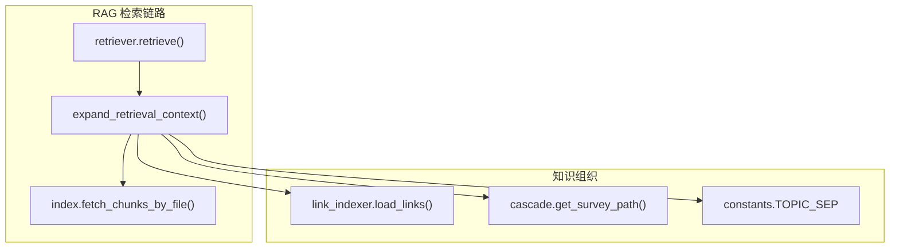
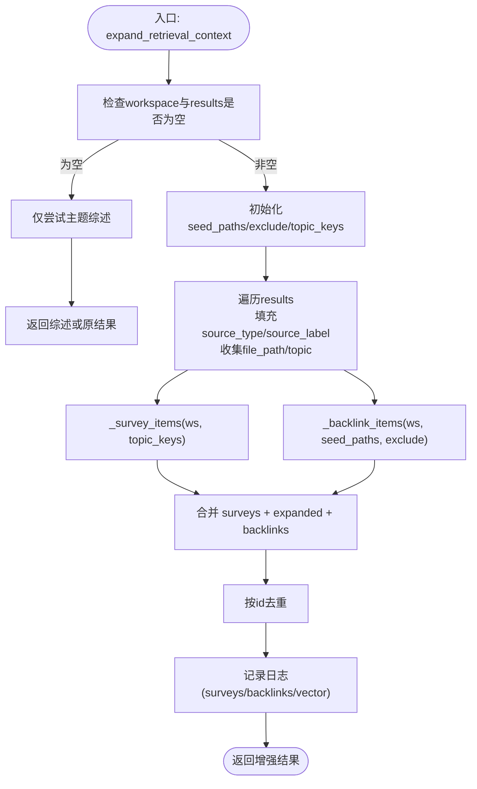
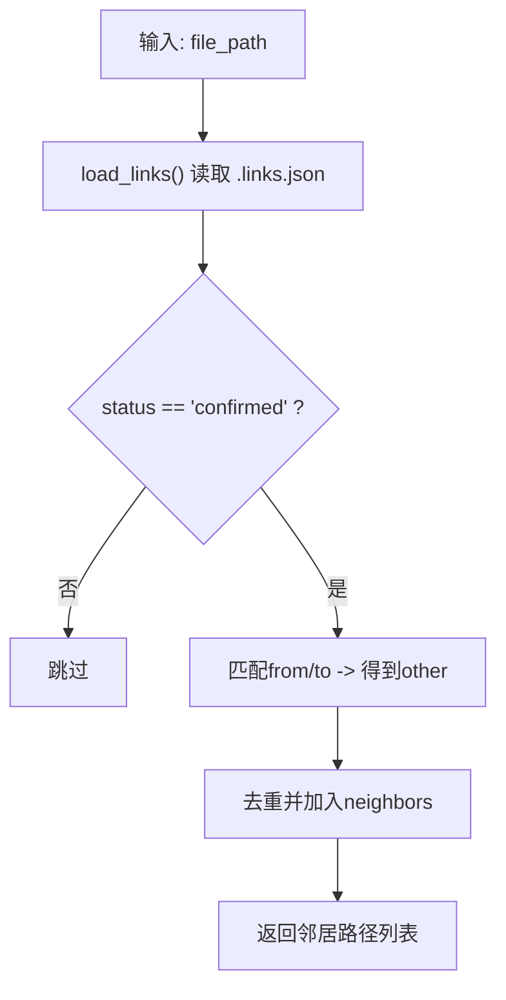
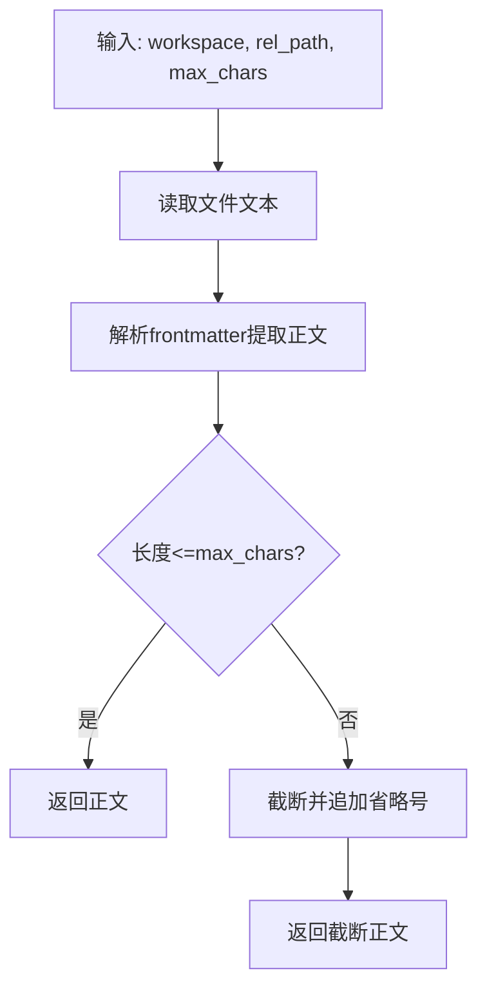
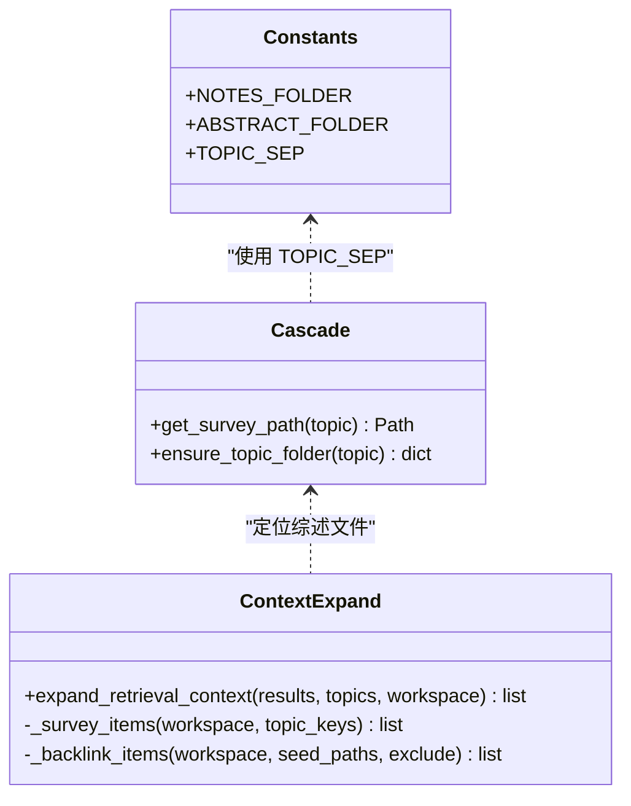
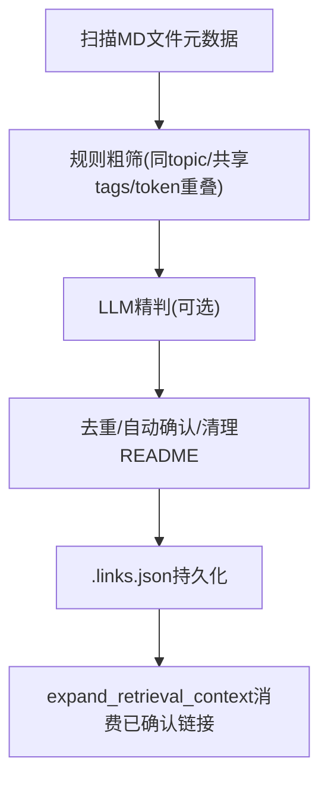
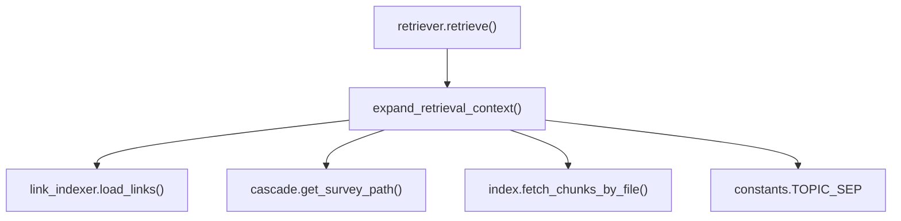

# 上下文扩展

<cite>
**本文引用的文件**
- [context_expand.py](file://python/sidecar/rag/context_expand.py)
- [retriever.py](file://python/sidecar/rag/retriever.py)
- [index.py](file://python/sidecar/rag/index.py)
- [link_indexer.py](file://utils/link_indexer.py)
- [cascade.py](file://python/sidecar/cascade.py)
- [constants.py](file://config/constants.py)
- [test_context_expand.py](file://tests/unit/test_context_expand.py)
</cite>

## 目录
1. [简介](#简介)
2. [项目结构](#项目结构)
3. [核心组件](#核心组件)
4. [架构总览](#架构总览)
5. [详细组件分析](#详细组件分析)
6. [依赖关系分析](#依赖关系分析)
7. [性能考量](#性能考量)
8. [故障排查指南](#故障排查指南)
9. [结论](#结论)
10. [附录](#附录)

## 简介
本技术文档聚焦于 RAG 检索结果的“上下文扩展”模块，解释其如何在不引入完整图 RAG 的前提下，通过轻量策略增强检索结果的相关性与完整性。该模块主要实现：
- 基于主题关系的知识图谱式扩展：利用已确认的双向链接（backlinks）发现相关文档片段。
- 父子章节关联与标签聚合：结合三级主题体系与综述文件，按主题抽取综述内容作为上下文。
- expand_retrieval_context() 函数：负责将向量检索结果、主题综述与反向链接片段进行拼接、去重与引用关系维护。
- 策略选择与调优：在信息完整性与冗余度之间取得平衡，提供可观测的日志与测试用例支撑。

## 项目结构
上下文扩展位于 sidecar.rag.context_expand 模块中，由检索器 retriever 调用，并依赖双向链接索引 link_indexer、主题综述路径 cascade.get_survey_path、以及索引 index.fetch_chunks_by_file 等能力。



图表来源
- [retriever.py:188-195](file://python/sidecar/rag/retriever.py#L188-L195)
- [context_expand.py:147-198](file://python/sidecar/rag/context_expand.py#L147-L198)
- [index.py:53-56](file://python/sidecar/rag/index.py#L53-L56)
- [link_indexer.py:136-154](file://utils/link_indexer.py#L136-L154)
- [cascade.py:46-53](file://python/sidecar/cascade.py#L46-L53)
- [constants.py:33](file://config/constants.py#L33)

章节来源
- [retriever.py:102-195](file://python/sidecar/rag/retriever.py#L102-L195)
- [context_expand.py:1-198](file://python/sidecar/rag/context_expand.py#L1-L198)
- [index.py:1-200](file://python/sidecar/rag/index.py#L1-L200)
- [link_indexer.py:136-154](file://utils/link_indexer.py#L136-L154)
- [cascade.py:46-53](file://python/sidecar/cascade.py#L46-L53)
- [constants.py:26-33](file://config/constants.py#L26-L33)

## 核心组件
- expand_retrieval_context(results, topics=None, workspace=None)
  - 职责：对原始检索结果进行上下文增强，前置主题综述，后置已确认反向链接片段；保持源类型标记与 ID 去重。
- _survey_items(workspace, topic_keys)
  - 职责：根据主题键集合定位综述文件，读取并截断至上限字符数，构造带 source_type="survey" 的条目。
- _backlink_items(workspace, seed_paths, exclude)
  - 职责：从已确认双向链接中查找邻居文件，优先取索引分块片段，否则回退到全文摘要片段，构造 source_type="backlink" 的条目。
- _confirmed_neighbor_paths(file_path)
  - 职责：加载 .links.json，筛选 status="confirmed" 的有向链接，返回当前文件的邻居路径集合。
- _read_file_excerpt(workspace, rel_path, max_chars)
  - 职责：安全读取文件正文（解析 frontmatter），按最大字符数截断。
- _fetch_indexed_chunks(workspace, rel_path, limit=2)
  - 职责：从本地 RAG 索引中获取指定文件的前若干分块，用于快速构建 backlink 片段。

章节来源
- [context_expand.py:147-198](file://python/sidecar/rag/context_expand.py#L147-L198)
- [context_expand.py:59-100](file://python/sidecar/rag/context_expand.py#L59-L100)
- [context_expand.py:103-144](file://python/sidecar/rag/context_expand.py#L103-L144)
- [context_expand.py:21-35](file://python/sidecar/rag/context_expand.py#L21-L35)
- [context_expand.py:38-50](file://python/sidecar/rag/context_expand.py#L38-L50)
- [context_expand.py:53-56](file://python/sidecar/rag/context_expand.py#L53-L56)

## 架构总览
下图展示了检索流程中上下文扩展的时序与数据流向。

```mermaid
sequenceDiagram
participant Client as "客户端"
participant Retriever as "retriever.retrieve()"
participant Index as "index.hybrid_search()"
participant Expander as "expand_retrieval_context()"
participant Links as "link_indexer.load_links()"
participant Cascade as "cascade.get_survey_path()"
participant FileIO as "文件系统/索引"
Client->>Retriever : "发起检索(含query/topics/tags)"
Retriever->>Index : "混合检索(稠密+稀疏)"
Index-->>Retriever : "候选分块列表"
Retriever->>Expander : "传入results + topics + workspace"
Expander->>Cascade : "按主题生成综述路径"
Cascade-->>Expander : "综述文件路径"
Expander->>FileIO : "读取综述正文并截断"
Expander->>Links : "加载已确认双向链接"
Links-->>Expander : "邻居文件路径集合"
Expander->>FileIO : "读取邻居分块或正文片段"
Expander-->>Retriever : "合并后的增强结果(含source_type/id)"
Retriever-->>Client : "最终证据集"
```

图表来源
- [retriever.py:188-195](file://python/sidecar/rag/retriever.py#L188-L195)
- [context_expand.py:147-198](file://python/sidecar/rag/context_expand.py#L147-L198)
- [link_indexer.py:136-154](file://utils/link_indexer.py#L136-L154)
- [cascade.py:46-53](file://python/sidecar/cascade.py#L46-L53)

## 详细组件分析

### expand_retrieval_context() 实现逻辑
- 输入处理
  - 若未提供工作区或结果为空，则仅尝试补充主题综述；若无综述则直接返回原结果。
  - 遍历 results，收集每个条目的 file_path 与 topic，用于后续 backlink 与 survey 扩展。
  - 为每条结果设置默认 source_type="vector" 与 source_label（文件名）。
- 主题综述扩展
  - 使用 cascade.get_survey_path(topic) 定位综述文件，读取正文并截断至上限字符数。
  - 生成 id="survey::{topic}"，source_type="survey"，score 较高以优先展示。
- 反向链接扩展
  - 通过 load_links() 过滤出 status="confirmed" 的链接，得到邻居文件集合。
  - 优先从索引中取前若干分块（_fetch_indexed_chunks），否则回退到全文片段（_read_file_excerpt）。
  - 生成 id="backlink::{neighbor}"，source_type="backlink"，附带 linked_from 记录引用关系。
- 合并与去重
  - 顺序：surveys + expanded(vector) + backlinks。
  - 基于 id 字段去重，避免重复项进入最终输出。
  - 记录日志：surveys/backlinks/vector 数量，便于效果评估。



图表来源
- [context_expand.py:147-198](file://python/sidecar/rag/context_expand.py#L147-L198)
- [context_expand.py:59-100](file://python/sidecar/rag/context_expand.py#L59-L100)
- [context_expand.py:103-144](file://python/sidecar/rag/context_expand.py#L103-L144)

章节来源
- [context_expand.py:147-198](file://python/sidecar/rag/context_expand.py#L147-L198)

### 相关文档发现算法（已确认双向链接）
- 数据来源：workspace/.links.json，包含 links 数组，每条记录包含 from/to/status/reason。
- 过滤策略：仅考虑 status="confirmed" 的链接；忽略 README 类文件；自引用被丢弃。
- 邻居发现：对于给定种子文件，扫描所有链接，找到与之相连的 other 路径，去重后返回。
- 质量保障：load_links() 内部执行去重与自动确认（normalized），保证查询一致性。



图表来源
- [link_indexer.py:136-154](file://utils/link_indexer.py#L136-L154)
- [context_expand.py:21-35](file://python/sidecar/rag/context_expand.py#L21-L35)

章节来源
- [link_indexer.py:136-154](file://utils/link_indexer.py#L136-L154)
- [context_expand.py:21-35](file://python/sidecar/rag/context_expand.py#L21-L35)

### 内容片段拼接策略
- 综述片段
  - 通过 cascade.get_survey_path(topic) 定位 wiki/{leaf}_综述.md。
  - 解析 frontmatter 后截取正文，超过上限字符数时截断并追加省略号。
  - 赋予高 score 与固定 source_label，确保在最终列表中靠前显示。
- 反向链接片段
  - 优先从索引中取前若干分块（_fetch_indexed_chunks），提升相关性。
  - 若索引不可用，回退到全文片段（_read_file_excerpt），同样进行字符上限控制。
  - 附加 linked_from 字段，明确引用来源，便于溯源。



图表来源
- [context_expand.py:38-50](file://python/sidecar/rag/context_expand.py#L38-L50)
- [context_expand.py:59-100](file://python/sidecar/rag/context_expand.py#L59-L100)
- [context_expand.py:103-144](file://python/sidecar/rag/context_expand.py#L103-L144)

章节来源
- [context_expand.py:38-50](file://python/sidecar/rag/context_expand.py#L38-L50)
- [context_expand.py:59-100](file://python/sidecar/rag/context_expand.py#L59-L100)
- [context_expand.py:103-144](file://python/sidecar/rag/context_expand.py#L103-L144)

### 引用关系维护
- 每条增强条目均携带 id、source_type、source_label、file_path、file_name、topic 等元数据。
- backlink 条目额外包含 linked_from，指向种子文件，形成明确的引用关系。
- 去重策略基于 id，避免同一综述或同一邻居重复出现。

章节来源
- [context_expand.py:147-198](file://python/sidecar/rag/context_expand.py#L147-L198)

### 与三级主题体系的集成
- 主题分隔符：TOPIC_SEP = " > "，用于拆分主题层级。
- 综述路径生成：get_survey_path(topic) 依据 leaf 名称生成 wiki/{leaf}_综述.md。
- 主题树与图谱：topics_3tier_mixin 提供主题树构建、综述开关、图谱节点生成等能力，辅助上层 UI 与策略决策。



图表来源
- [constants.py:26-33](file://config/constants.py#L26-L33)
- [cascade.py:46-53](file://python/sidecar/cascade.py#L46-L53)
- [context_expand.py:59-100](file://python/sidecar/rag/context_expand.py#L59-L100)

章节来源
- [constants.py:26-33](file://config/constants.py#L26-L33)
- [cascade.py:46-53](file://python/sidecar/cascade.py#L46-L53)
- [context_expand.py:59-100](file://python/sidecar/rag/context_expand.py#L59-L100)

### 跨文件知识关联的发现算法
- 双向链接索引引擎两阶段发现：
  - 本地粗筛：同主题、共享标签、文件名 token 重叠 → 候选对。
  - AI 精判：批处理候选对，LLM 判断是否内容相关（可选）。
- 存储与归一化：写入 workspace/.links.json，自动确认与去重，清理 README 与自引用。
- 与上下文扩展联动：expand 模块仅消费已确认链接，确保稳定性与低噪声。



图表来源
- [link_indexer.py:690-737](file://utils/link_indexer.py#L690-L737)
- [link_indexer.py:136-154](file://utils/link_indexer.py#L136-L154)
- [context_expand.py:21-35](file://python/sidecar/rag/context_expand.py#L21-L35)

章节来源
- [link_indexer.py:690-737](file://utils/link_indexer.py#L690-L737)
- [link_indexer.py:136-154](file://utils/link_indexer.py#L136-L154)
- [context_expand.py:21-35](file://python/sidecar/rag/context_expand.py#L21-L35)

## 依赖关系分析
- retriever.retrieve() 在检索完成后调用 expand_retrieval_context()，并将结果再次过滤与限制唯一来源数量。
- expand_retrieval_context() 依赖：
  - link_indexer.load_links()：获取已确认双向链接。
  - cascade.get_survey_path()：定位综述文件。
  - index.fetch_chunks_by_file()：快速获取邻居文件分块。
  - constants.TOPIC_SEP：主题分隔符。



图表来源
- [retriever.py:188-195](file://python/sidecar/rag/retriever.py#L188-L195)
- [context_expand.py:147-198](file://python/sidecar/rag/context_expand.py#L147-L198)
- [link_indexer.py:136-154](file://utils/link_indexer.py#L136-L154)
- [cascade.py:46-53](file://python/sidecar/cascade.py#L46-L53)
- [index.py:53-56](file://python/sidecar/rag/index.py#L53-L56)
- [constants.py:33](file://config/constants.py#L33)

章节来源
- [retriever.py:188-195](file://python/sidecar/rag/retriever.py#L188-L195)
- [context_expand.py:147-198](file://python/sidecar/rag/context_expand.py#L147-L198)

## 性能考量
- 综述与反向链接的数量上限：
  - 最多选取 2 个主题综述，单篇综述最多 2800 字符。
  - 最多选取 4 个反向链接文件，每段最多 700 字符。
- 索引优先：优先从索引中取邻居分块，减少磁盘 IO 与解析成本。
- 去重与限流：基于 id 去重，并在 retriever 层限制唯一来源数量，避免冗余。
- 缓存与降级：
  - retriever 层具备 TTL 查询缓存与 reranker 冷却机制，降低外部依赖失败的影响。
  - link_indexer 对向量搜索存在冷却期，防止频繁失败导致系统抖动。

[本节为通用指导，不直接分析具体文件]

## 故障排查指南
- 常见问题
  - 无综述文件：当主题不存在综述时，不会插入 survey 条目，属于预期行为。
  - 无已确认链接：若 .links.json 为空或链接未确认，不会插入 backlink 条目。
  - 文件读取异常：OSError 会被捕获并返回空片段，不影响整体流程。
- 日志与验证
  - expand 模块会记录 surveys/backlinks/vector 数量，便于观察扩展效果。
  - 单元测试覆盖基本场景：确保同时出现 survey、vector、backlink 三种来源。

章节来源
- [context_expand.py:195-197](file://python/sidecar/rag/context_expand.py#L195-L197)
- [test_context_expand.py:23-69](file://tests/unit/test_context_expand.py#L23-L69)

## 结论
本上下文扩展模块以轻量策略实现了检索结果的增强：通过主题综述与已确认双向链接，既提升了信息的完整性，又控制了冗余度。其设计强调稳定性（仅消费已确认链接）、可观测性（日志与测试）与可扩展性（未来可接入更丰富的图谱或语义推理）。在实际使用中，建议关注综述覆盖率与链接质量，并结合动态 top_k 与唯一来源限制，持续优化检索体验。

[本节为总结性内容，不直接分析具体文件]

## 附录
- 关键常量与配置
  - TOPIC_SEP：" > "
  - ABSTRACT_FOLDER："wiki"
  - NOTES_FOLDER："Notes"
- 扩展策略参数
  - _MAX_SURVEY_TOPICS：2
  - _MAX_SURVEY_CHARS：2800
  - _MAX_BACKLINK_FILES：4
  - _MAX_BACKLINK_CHARS：700
  - _BACKLINK_SCORE：0.25

章节来源
- [constants.py:26-33](file://config/constants.py#L26-L33)
- [context_expand.py:14-18](file://python/sidecar/rag/context_expand.py#L14-L18)