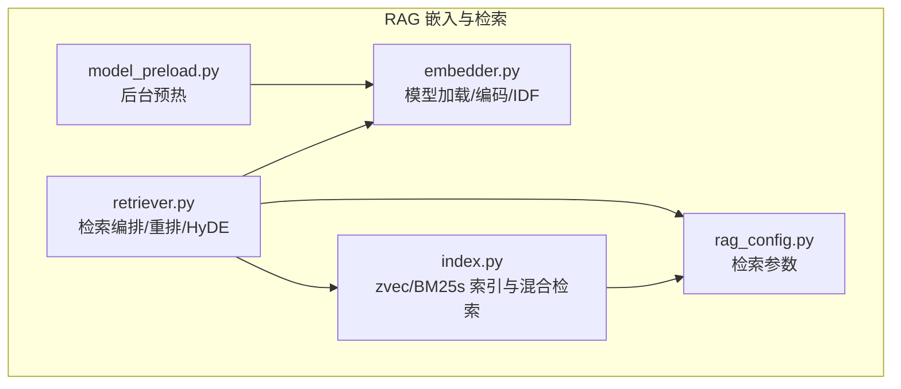
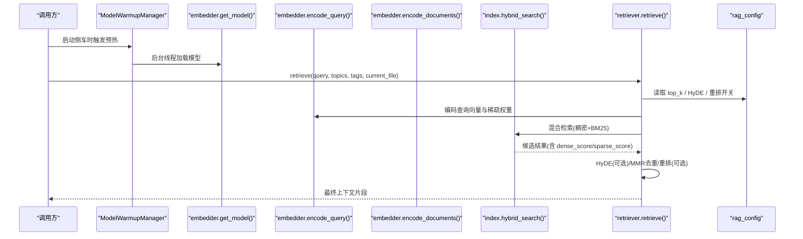
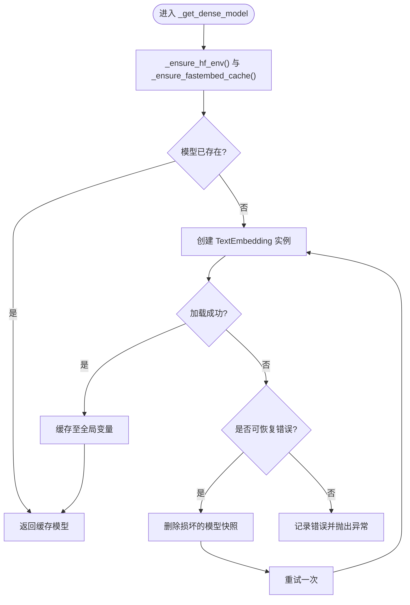
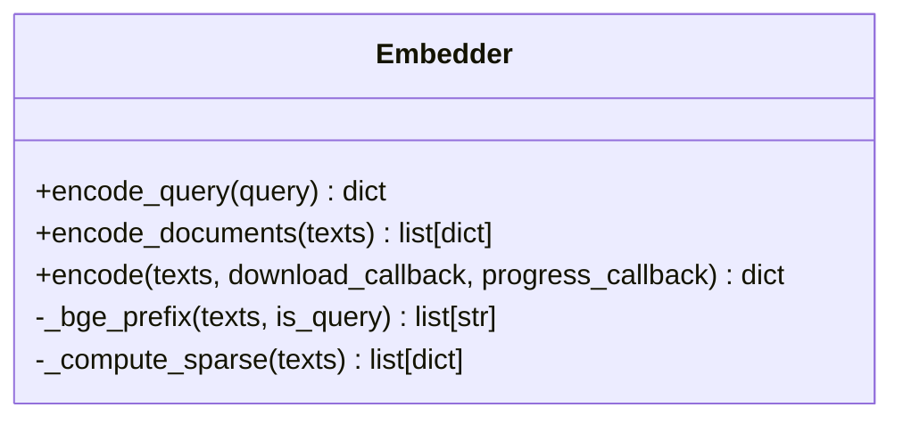
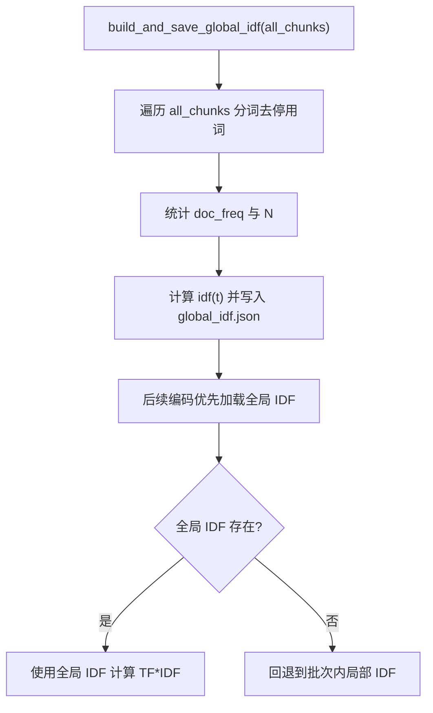
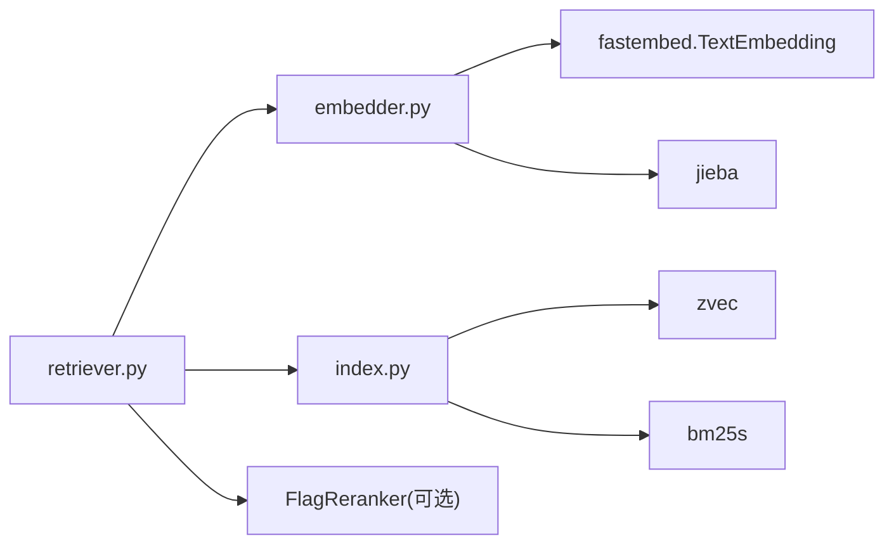

# 嵌入模型

<cite>
**本文引用的文件**   
- [embedder.py](file://python/sidecar/rag/embedder.py)
- [model_preload.py](file://python/sidecar/rag/model_preload.py)
- [retriever.py](file://python/sidecar/rag/retriever.py)
- [index.py](file://python/sidecar/rag/index.py)
- [rag_config.py](file://python/sidecar/rag/rag_config.py)
</cite>

## 目录
1. [简介](#简介)
2. [项目结构](#项目结构)
3. [核心组件](#核心组件)
4. [架构总览](#架构总览)
5. [详细组件分析](#详细组件分析)
6. [依赖关系分析](#依赖关系分析)
7. [性能与内存管理](#性能与内存管理)
8. [故障排查指南](#故障排查指南)
9. [结论](#结论)
10. [附录：评估与替换指南](#附录：评估与替换指南)

## 简介
本技术文档聚焦 RAG 嵌入模型模块，围绕文本向量化流程、查询与文档编码策略差异、全局 IDF 计算与稀疏权重生成、模型预加载机制、HuggingFace 环境配置、GPU/CPU 资源管理、以及嵌入质量评估与模型替换建议进行系统化说明。目标是帮助开发者快速理解并优化该模块在 NoteAI 中的行为与性能。

## 项目结构
RAG 嵌入相关代码位于 sidecar 的 rag 子模块中，关键文件如下：
- embedder.py：负责 bge-small-zh 模型的加载、初始化、批量编码、稀疏向量（TF*IDF）计算、全局 IDF 持久化等。
- model_preload.py：后台预热模型，降低首次请求延迟。
- retriever.py：检索流程编排，调用 encode_query/encode_documents，结合混合检索与重排。
- index.py：索引构建与检索执行（zvec + BM25s），提供混合搜索入口。
- rag_config.py：运行时检索参数（top_k、HyDE、重排开关与阈值、稠密/稀疏权重）。

图表来源
- [embedder.py:1-120](file://python/sidecar/rag/embedder.py#L1-L120)
- [model_preload.py:1-56](file://python/sidecar/rag/model_preload.py#L1-L56)
- [retriever.py:100-200](file://python/sidecar/rag/retriever.py#L100-L200)
- [index.py:960-1030](file://python/sidecar/rag/index.py#L960-L1030)
- [rag_config.py:1-64](file://python/sidecar/rag/rag_config.py#L1-L64)

章节来源
- [embedder.py:1-120](file://python/sidecar/rag/embedder.py#L1-L120)
- [model_preload.py:1-56](file://python/sidecar/rag/model_preload.py#L1-L56)
- [retriever.py:100-200](file://python/sidecar/rag/retriever.py#L100-L200)
- [index.py:960-1030](file://python/sidecar/rag/index.py#L960-L1030)
- [rag_config.py:1-64](file://python/sidecar/rag/rag_config.py#L1-L64)

## 核心组件
- 模型与缓存
  - 使用 fastembed 的 TextEmbedding 加载 BAAI/bge-small-zh-v1.5，维度固定为 512。
  - HuggingFace 与 fastembed 缓存路径统一指向应用数据目录下的专用文件夹，避免分散缓存。
  - 线程安全地懒加载模型，支持下载回调与失败重试（清理损坏快照后重试）。
- 编码接口
  - encode_query(query): 返回单条查询的稠密向量与稀疏权重。
  - encode_documents(texts): 批量编码文档，返回每条文档的稠密向量与稀疏权重列表。
  - encode(texts, ...): 内部通用批量编码，供两者复用。
- 稀疏向量与全局 IDF
  - 基于 jieba 分词与停用词过滤，优先使用全局 IDF；若不存在则回退到批次内局部 IDF。
  - 全局 IDF 在索引重建时一次性计算并持久化，增量更新采用近似策略。
- 预加载
  - 启动时在后台线程预热 Embedding 与 Reranker，减少首请求延迟。

章节来源
- [embedder.py:54-165](file://python/sidecar/rag/embedder.py#L54-L165)
- [embedder.py:167-225](file://python/sidecar/rag/embedder.py#L167-L225)
- [embedder.py:234-332](file://python/sidecar/rag/embedder.py#L234-L332)
- [embedder.py:334-384](file://python/sidecar/rag/embedder.py#L334-L384)
- [model_preload.py:1-56](file://python/sidecar/rag/model_preload.py#L1-L56)

## 架构总览
下图展示了从用户查询到最终结果的关键调用链，包括模型预热、编码、混合检索与可选重排。

图表来源
- [model_preload.py:15-50](file://python/sidecar/rag/model_preload.py#L15-L50)
- [embedder.py:140-165](file://python/sidecar/rag/embedder.py#L140-L165)
- [embedder.py:359-368](file://python/sidecar/rag/embedder.py#L359-L368)
- [retriever.py:102-196](file://python/sidecar/rag/retriever.py#L102-L196)
- [index.py:960-1030](file://python/sidecar/rag/index.py#L960-L1030)
- [rag_config.py:21-64](file://python/sidecar/rag/rag_config.py#L21-L64)

## 详细组件分析

### 模型加载与环境配置
- HuggingFace 环境变量
  - 设置 HF_HOME、HUGGINGFACE_HUB_CACHE、TRANSFORMERS_CACHE 指向应用数据目录下的 hf_hub 子目录，确保模型与权重集中存储。
  - 配置镜像端点与 NO_PROXY，提升国内网络访问稳定性。
- fastembed 缓存
  - 通过 FASTEMBED_CACHE_PATH 指定缓存根目录，避免重复下载。
- 模型实例
  - 使用 TextEmbedding("BAAI/bge-small-zh-v1.5", cache_dir=..., threads=...) 创建模型实例，threads 根据 CPU 核数动态选择，上限为 8。
- 错误恢复
  - 当出现“文件不存在/ONNXRuntimeError/无法加载模型”等可恢复错误时，自动清理对应模型快照并重新尝试。

图表来源
- [embedder.py:19-53](file://python/sidecar/rag/embedder.py#L19-L53)
- [embedder.py:140-165](file://python/sidecar/rag/embedder.py#L140-L165)
- [embedder.py:110-131](file://python/sidecar/rag/embedder.py#L110-L131)

章节来源
- [embedder.py:19-53](file://python/sidecar/rag/embedder.py#L19-L53)
- [embedder.py:140-165](file://python/sidecar/rag/embedder.py#L140-L165)
- [embedder.py:110-131](file://python/sidecar/rag/embedder.py#L110-L131)

### 查询编码 vs 文档编码
- 查询编码 encode_query(query)
  - 对查询文本添加前缀提示，以适配 BGE 中文检索场景。
  - 返回单个稠密向量与对应的稀疏权重字典。
- 文档编码 encode_documents(texts)
  - 批量调用内部 encode，逐条生成稠密向量与稀疏权重，并以列表形式返回。
- 共同点
  - 均使用相同的模型实例与分词/停用词策略，保证查询与文档在同一语义空间对齐。
- 差异点
  - 查询编码带前缀，文档编码不带前缀；查询编码返回标量向量，文档编码返回列表。

图表来源
- [embedder.py:334-384](file://python/sidecar/rag/embedder.py#L334-L384)
- [embedder.py:167-171](file://python/sidecar/rag/embedder.py#L167-L171)
- [embedder.py:173-225](file://python/sidecar/rag/embedder.py#L173-L225)

章节来源
- [embedder.py:334-384](file://python/sidecar/rag/embedder.py#L334-L384)
- [embedder.py:167-171](file://python/sidecar/rag/embedder.py#L167-L171)
- [embedder.py:173-225](file://python/sidecar/rag/embedder.py#L173-L225)

### 全局 IDF 的计算与存储
- 计算时机
  - 全量索引重建或增量重建完成后，基于当前全部语料计算全局 IDF 并持久化为 JSON。
- 计算方式
  - 遍历所有 chunk 的 content，jieba 分词并过滤停用词，统计词项文档频率（doc_freq）。
  - 按公式 idf(t) = max(0, log((N - df(t) + 0.5)/(df(t) + 0.5)) + 1) 计算权重。
- 存储位置
  - 工作区目录下 .rag_index/global_idf.json，原子写入（先写 tmp 再 replace）。
- 使用策略
  - 编码阶段优先加载全局 IDF；若不存在则回退到批次内局部 IDF，保证可用性。
- 增量更新
  - 提供 update_global_idf_incremental，但实现为近似策略，实际更倾向于在重建时整体刷新。

图表来源
- [embedder.py:257-285](file://python/sidecar/rag/embedder.py#L257-L285)
- [embedder.py:243-256](file://python/sidecar/rag/embedder.py#L243-L256)
- [embedder.py:173-204](file://python/sidecar/rag/embedder.py#L173-L204)

章节来源
- [embedder.py:257-285](file://python/sidecar/rag/embedder.py#L257-L285)
- [embedder.py:243-256](file://python/sidecar/rag/embedder.py#L243-L256)
- [embedder.py:173-204](file://python/sidecar/rag/embedder.py#L173-L204)

### 模型预加载机制
- 启动时由 ModelWarmupManager 在后台线程预热 Embedding 与 Reranker。
- 预热成功后，首次检索不再阻塞等待模型下载与加载，显著降低首请求延迟。
- 预热失败不影响主流程，仅记录警告日志。

章节来源
- [model_preload.py:15-50](file://python/sidecar/rag/model_preload.py#L15-L50)

### 检索流程与混合权重
- retriever.retrieve 编排：
  - 调用 encode_query 获取查询向量与稀疏权重。
  - 调用 index.hybrid_search 执行稠密+BM25 混合检索。
  - 可选 HyDE（弱检索时扩展查询）、MMR 去重、重排（FlagReranker）。
- 混合权重
  - 默认稠密权重 0.7，稀疏权重 0.3，可通过配置调整。

章节来源
- [retriever.py:102-196](file://python/sidecar/rag/retriever.py#L102-L196)
- [index.py:960-1030](file://python/sidecar/rag/index.py#L960-L1030)
- [rag_config.py:57-64](file://python/sidecar/rag/rag_config.py#L57-L64)

## 依赖关系分析
- 外部依赖
  - fastembed.TextEmbedding：用于 bge-small-zh 的稠密向量生成。
  - FlagReranker：用于相关性重排（可选）。
  - bm25s：用于 BM25 稀疏检索。
  - zvec：用于稠密向量索引与检索。
  - jieba：中文分词。
- 内部耦合
  - retriever 依赖 embedder 与 index；index 依赖 zvec 与 bm25s；model_preload 依赖 embedder 与 retriever 的重排器。

图表来源
- [retriever.py:102-196](file://python/sidecar/rag/retriever.py#L102-L196)
- [index.py:960-1030](file://python/sidecar/rag/index.py#L960-L1030)
- [embedder.py:54-165](file://python/sidecar/rag/embedder.py#L54-L165)

章节来源
- [retriever.py:102-196](file://python/sidecar/rag/retriever.py#L102-L196)
- [index.py:960-1030](file://python/sidecar/rag/index.py#L960-L1030)
- [embedder.py:54-165](file://python/sidecar/rag/embedder.py#L54-L165)

## 性能与内存管理
- 批处理与并发
  - 索引构建与检索均采用分批处理（如 _INDEX_BATCH_SIZE、_FETCH_BATCH_SIZE），降低单次 IO 压力。
  - 混合检索使用线程池并行执行稠密与稀疏分支，缩短端到端延迟。
- 模型线程数
  - ONNX 推理线程数根据 CPU 核数动态选择，上限 8，避免过度竞争。
- 缓存与预热
  - 模型与 BM25 检索器均有缓存；后台预热减少冷启动开销。
- 内存释放
  - 索引操作结束后主动释放 collection 引用并触发 GC，避免句柄泄漏。
- GPU/CPU 资源管理
  - 当前实现未显式启用 GPU；如需加速，可在 TextEmbedding 与 FlagReranker 初始化时传入相应后端参数（需确保硬件与驱动可用）。

章节来源
- [embedder.py:103-108](file://python/sidecar/rag/embedder.py#L103-L108)
- [index.py:36-41](file://python/sidecar/rag/index.py#L36-L41)
- [index.py:518-565](file://python/sidecar/rag/index.py#L518-L565)
- [retriever.py:36-41](file://python/sidecar/rag/retriever.py#L36-L41)

## 故障排查指南
- 模型加载失败
  - 现象：出现“文件不存在/ONNXRuntimeError/无法加载模型”等错误。
  - 处理：系统会自动清理损坏的模型快照并重试；检查网络连接与镜像配置；确认缓存目录权限。
- 索引被占用
  - 现象：打开集合时报锁错误。
  - 处理：关闭其他 NoteAI 实例；等待锁释放；必要时清理临时文件。
- BM25 缺失
  - 现象：稀疏检索不可用，降级为稠密检索。
  - 处理：触发 ensure_bm25_index 重建；检查索引目录是否存在有效文件。
- 重排不可用
  - 现象：重排跳过或冷却期内禁用。
  - 处理：检查 FlagReranker 依赖与缓存；稍后重试。

章节来源
- [embedder.py:110-165](file://python/sidecar/rag/embedder.py#L110-L165)
- [index.py:169-190](file://python/sidecar/rag/index.py#L169-L190)
- [index.py:786-822](file://python/sidecar/rag/index.py#L786-L822)
- [retriever.py:47-85](file://python/sidecar/rag/retriever.py#L47-L85)

## 结论
该嵌入模块通过统一的模型加载与缓存策略、查询与文档编码差异化处理、全局 IDF 的持久化与回退机制、以及后台预热与批处理优化，提供了稳定高效的 RAG 检索能力。配合混合检索与可选重排，能够在不同规模与分布的数据集上保持良好召回与排序效果。

## 附录：评估与替换指南

### 嵌入质量评估建议
- 离线评测
  - 构造查询-正样本对，计算相似度命中率与平均倒数排名（MRR）。
  - 对比不同 top_k 与混合权重下的指标变化。
- 在线观测
  - 关注首请求延迟、P95/P99 延迟、错误率与重排成功率。
  - 监控 BM25 与稠密检索的贡献比例，验证权重合理性。

### 模型替换指南
- 替换步骤
  - 修改 DENSE_MODEL_NAME 为新模型名称（例如其他中文或英文模型）。
  - 确认新模型输出维度与现有索引维度一致（当前为 512），否则需重建索引。
  - 若新模型需要不同的预处理（如前缀/模板），调整 _bge_prefix 逻辑。
- 注意事项
  - 新模型可能改变稠密向量空间，导致历史检索结果偏差，建议全量重建索引。
  - 若新模型支持 GPU，可在初始化时开启相应后端以提升吞吐。

章节来源
- [embedder.py:61-66](file://python/sidecar/rag/embedder.py#L61-L66)
- [embedder.py:167-171](file://python/sidecar/rag/embedder.py#L167-L171)
- [index.py:31-35](file://python/sidecar/rag/index.py#L31-L35)