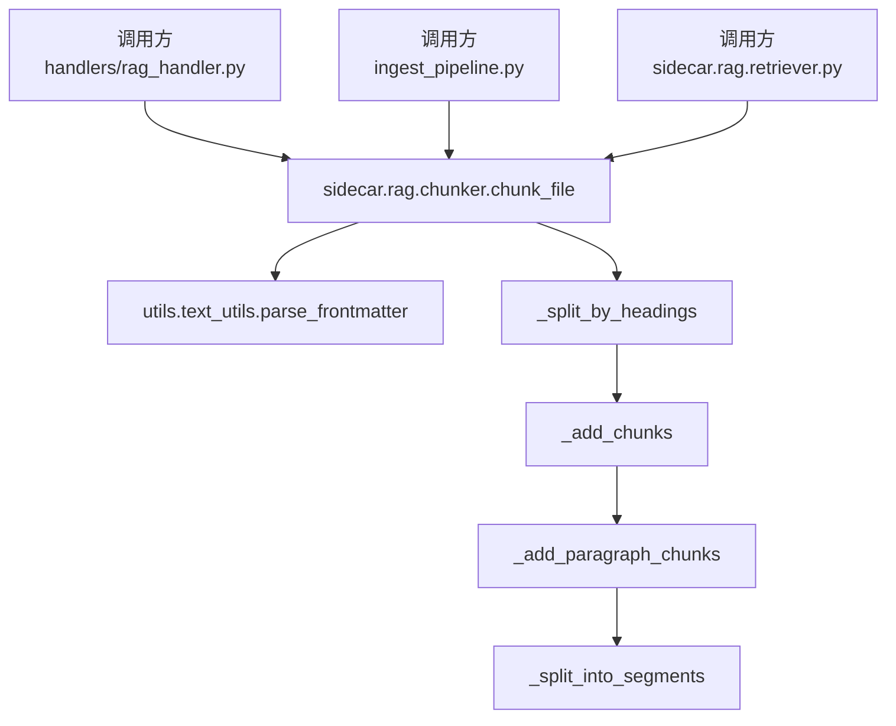
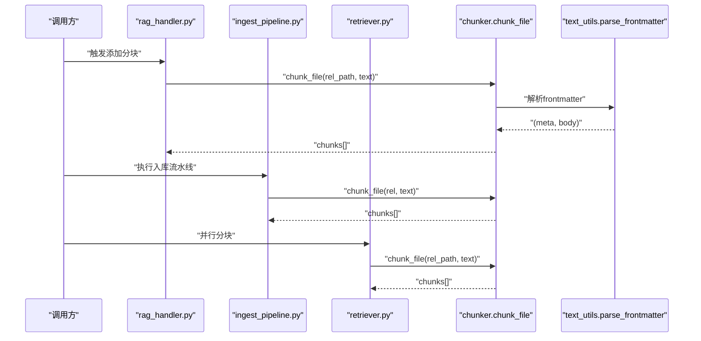
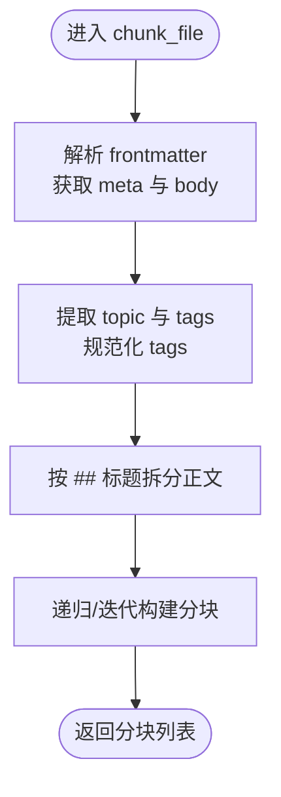
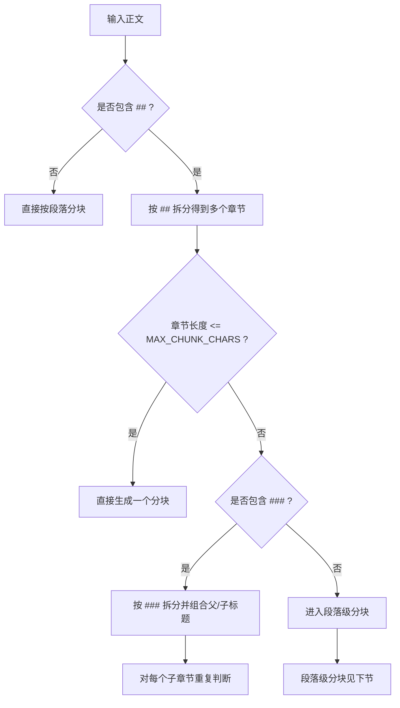
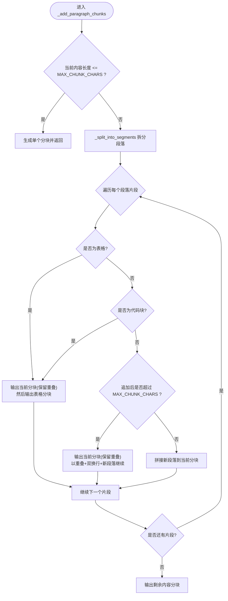
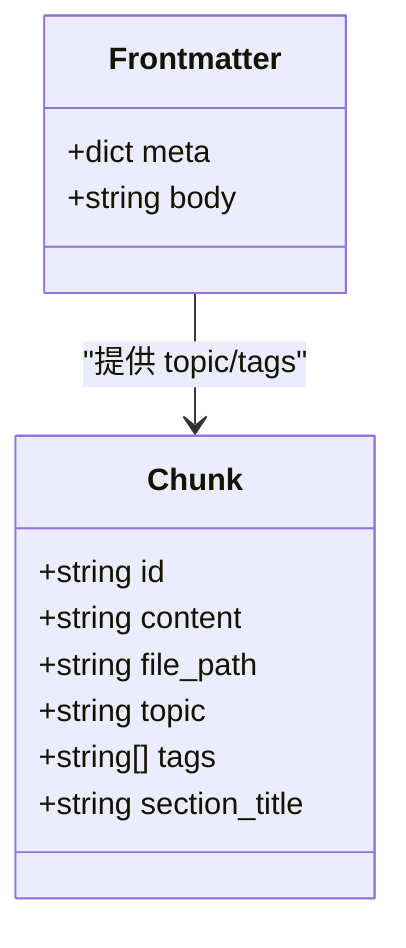
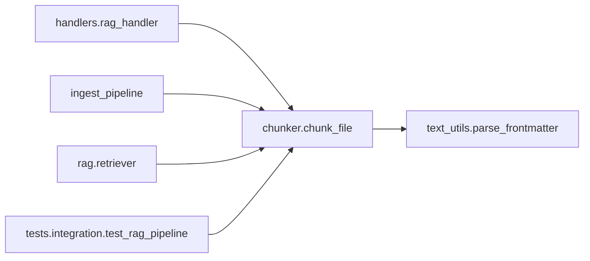

# 文本分块器

<cite>
**本文引用的文件**   
- [chunker.py](file://python/sidecar/rag/chunker.py)
- [text_utils.py](file://utils/text_utils.py)
- [rag_handler.py](file://python/sidecar/handlers/rag_handler.py)
- [ingest_pipeline.py](file://python/sidecar/ingest_pipeline.py)
- [retriever.py](file://python/sidecar/rag/retriever.py)
- [test_rag_pipeline.py](file://tests/integration/test_rag_pipeline.py)
</cite>

## 目录
1. [简介](#简介)
2. [项目结构](#项目结构)
3. [核心组件](#核心组件)
4. [架构总览](#架构总览)
5. [详细组件分析](#详细组件分析)
6. [依赖关系分析](#依赖关系分析)
7. [性能考量](#性能考量)
8. [故障排查指南](#故障排查指南)
9. [结论](#结论)
10. [附录](#附录)

## 简介
本技术文档聚焦于 RAG 文本分块器的实现与使用，围绕智能文本分割算法展开：基于语义边界的段落识别、Markdown 结构感知（标题层级提取）、以及分块大小控制与重叠策略。文档将深入解析 chunk_file() 函数的实现细节，包括文本预处理、分块策略、元数据保留；说明如何保持章节完整性、处理嵌套列表和表格；并提供效果评估、参数调优与自定义分块策略的开发指导。

## 项目结构
分块器位于 sidecar.rag 子模块中，作为 RAG 流水线的基础设施被多处调用：
- 入口函数：chunk_file(file_path, text)
- 内部流程：_split_by_headings -> _add_chunks -> _add_paragraph_chunks -> _split_into_segments
- 辅助工具：parse_frontmatter（用于解析 YAML frontmatter）



图表来源
- [rag_handler.py:168-175](file://python/sidecar/handlers/rag_handler.py#L168-L175)
- [ingest_pipeline.py:372-423](file://python/sidecar/ingest_pipeline.py#L372-L423)
- [retriever.py:386-415](file://python/sidecar/rag/retriever.py#L386-L415)
- [chunker.py:10-24](file://python/sidecar/rag/chunker.py#L10-L24)
- [text_utils.py:1332-1351](file://utils/text_utils.py#L1332-L1351)

章节来源
- [chunker.py:1-163](file://python/sidecar/rag/chunker.py#L1-L163)
- [text_utils.py:1332-1351](file://utils/text_utils.py#L1332-L1351)

## 核心组件
- chunk_file(file_path, text): 对外暴露的分块入口，负责解析 frontmatter、提取主题与标签，并交由标题感知的分块流程处理。
- _split_by_headings(body, file_path, topic, tags): 以二级标题“##”为边界对正文进行粗粒度切分，生成各章节内容。
- _add_chunks(content, file_path, topic, tags, section_title, chunks): 若内容超过最大长度，则尝试按三级标题“###”进一步细分；否则进入段落级分块。
- _add_paragraph_chunks(content, file_path, topic, tags, section_title, chunks): 段落级分块，考虑代码块与表格的完整性，采用滑动窗口与重叠拼接策略。
- _split_into_segments(content): 将内容拆分为段落片段，同时保护代码块与表格不被截断。
- parse_frontmatter(text): 从 Markdown 文本中提取 YAML frontmatter 元数据，返回 (meta_dict, body_str)。

章节来源
- [chunker.py:10-24](file://python/sidecar/rag/chunker.py#L10-L24)
- [chunker.py:26-42](file://python/sidecar/rag/chunker.py#L26-L42)
- [chunker.py:44-65](file://python/sidecar/rag/chunker.py#L44-L65)
- [chunker.py:67-103](file://python/sidecar/rag/chunker.py#L67-L103)
- [chunker.py:105-132](file://python/sidecar/rag/chunker.py#L105-L132)
- [text_utils.py:1332-1351](file://utils/text_utils.py#L1332-L1351)

## 架构总览
下图展示了分块器在系统内的集成位置与调用链：上层处理器或流水线读取文档后，调用 chunk_file 完成结构化分块，随后由检索或索引模块消费这些分块。



图表来源
- [rag_handler.py:168-175](file://python/sidecar/handlers/rag_handler.py#L168-L175)
- [ingest_pipeline.py:372-423](file://python/sidecar/ingest_pipeline.py#L372-L423)
- [retriever.py:386-415](file://python/sidecar/rag/retriever.py#L386-L415)
- [chunker.py:10-24](file://python/sidecar/rag/chunker.py#L10-L24)
- [text_utils.py:1332-1351](file://utils/text_utils.py#L1332-L1351)

## 详细组件分析

### 入口函数 chunk_file()
- 功能概述
  - 解析 frontmatter，提取 topic 与 tags，并将 tags 标准化为字符串列表。
  - 将正文交给标题感知的分块流程，最终返回分块列表。
- 关键行为
  - 若不存在 frontmatter，则 meta 为空字典，body 为原始文本。
  - tags 支持逗号分隔的字符串或列表形式，并进行清洗。
- 输出结构
  - 每个分块包含 id、content、file_path、topic、tags、section_title 等字段。



图表来源
- [chunker.py:10-24](file://python/sidecar/rag/chunker.py#L10-L24)
- [chunker.py:26-42](file://python/sidecar/rag/chunker.py#L26-L42)
- [text_utils.py:1332-1351](file://utils/text_utils.py#L1332-L1351)

章节来源
- [chunker.py:10-24](file://python/sidecar/rag/chunker.py#L10-L24)

### 标题层级提取与章节完整性
- 二级标题“##”作为一级分段边界，确保章节整体性。
- 当某章节内容过长时，尝试按三级标题“###”进一步细分，并在段标题上累积形成完整路径（如“父标题 > 子标题”）。
- 对于没有标题的前置内容，会单独作为一个初始分块处理。



图表来源
- [chunker.py:26-42](file://python/sidecar/rag/chunker.py#L26-L42)
- [chunker.py:44-65](file://python/sidecar/rag/chunker.py#L44-L65)

章节来源
- [chunker.py:26-42](file://python/sidecar/rag/chunker.py#L26-L42)
- [chunker.py:44-65](file://python/sidecar/rag/chunker.py#L44-L65)

### 段落级分块与边界检测
- 段落划分
  - 通过双换行“\n\n”进行段落切分。
  - 遇到代码块或表格时，将其视为独立片段，避免被截断。
- 代码块与表格保护
  - 代码块：匹配“```...```”整块，保证不被拆分。
  - 表格：匹配首行含“|”且第二行为分隔线“|---|”的表格结构，保证表格完整性。
- 重叠策略
  - 计算 overlap_size = max(OVERLAP_MIN_CHARS, int(MAX_CHUNK_CHARS * OVERLAP_RATIO))。
  - 当追加新段落会导致超出最大长度时，先输出当前分块，并以末尾 overlap_size 字符作为下一分块的开头，再拼接新段落，从而维持上下文连续性。
- 特殊片段处理
  - 遇到表格或代码块时，优先将其作为独立分块输出，必要时保留前一分块的尾部重叠部分，以保证衔接。



图表来源
- [chunker.py:67-103](file://python/sidecar/rag/chunker.py#L67-L103)
- [chunker.py:105-132](file://python/sidecar/rag/chunker.py#L105-L132)
- [chunker.py:135-151](file://python/sidecar/rag/chunker.py#L135-L151)

章节来源
- [chunker.py:67-103](file://python/sidecar/rag/chunker.py#L67-L103)
- [chunker.py:105-132](file://python/sidecar/rag/chunker.py#L105-L132)
- [chunker.py:135-151](file://python/sidecar/rag/chunker.py#L135-L151)

### 元数据保留与分块标识
- 元数据来源
  - 从 frontmatter 提取 topic 与 tags，并在每个分块中保留。
- 分块 ID 生成
  - 基于 file_path、section_title 与内容前缀的哈希值生成稳定短 ID，便于去重与追踪。
- 分块字段
  - id、content、file_path、topic、tags、section_title。



图表来源
- [chunker.py:153-163](file://python/sidecar/rag/chunker.py#L153-L163)
- [text_utils.py:1332-1351](file://utils/text_utils.py#L1332-L1351)

章节来源
- [chunker.py:153-163](file://python/sidecar/rag/chunker.py#L153-L163)

### 分块大小控制与重叠区域设置
- 最大分块长度
  - MAX_CHUNK_CHARS：默认 1000 字符。
- 最小重叠长度
  - OVERLAP_MIN_CHARS：默认 100 字符。
- 重叠比例
  - OVERLAP_RATIO：默认 0.2（即 20%）。
- 实际重叠计算
  - overlap_size = max(OVERLAP_MIN_CHARS, int(MAX_CHUNK_CHARS * OVERLAP_RATIO))。
- 影响范围
  - 仅在段落级分块中使用，用于在分块边界处保留上下文，提升检索召回质量。

章节来源
- [chunker.py:5-8](file://python/sidecar/rag/chunker.py#L5-L8)
- [chunker.py:72-74](file://python/sidecar/rag/chunker.py#L72-L74)
- [chunker.py:94-102](file://python/sidecar/rag/chunker.py#L94-L102)

### 与文档结构的集成
- 标题层级
  - 以“##”为一级边界，“###”为二级边界，支持多级标题组合成完整路径。
- 章节完整性
  - 长章节优先按“###”细分，避免跨章节合并导致语义断裂。
- 嵌套列表与表格
  - 表格通过正则与结构校验保护，避免被拆分。
  - 嵌套列表未做特殊保护，遵循段落切分规则；建议在文档中用空行分隔复杂列表以提升稳定性。

章节来源
- [chunker.py:26-42](file://python/sidecar/rag/chunker.py#L26-L42)
- [chunker.py:44-65](file://python/sidecar/rag/chunker.py#L44-L65)
- [chunker.py:105-132](file://python/sidecar/rag/chunker.py#L105-L132)
- [chunker.py:135-151](file://python/sidecar/rag/chunker.py#L135-L151)

## 依赖关系分析
- 外部依赖
  - utils.text_utils.parse_frontmatter：解析 YAML frontmatter。
- 内部依赖
  - handlers/rag_handler.py、ingest_pipeline.py、rag/retriever.py 均调用 chunk_file 完成分块。
- 测试覆盖
  - tests/integration/test_rag_pipeline.py 对 chunk_file 与 _make_chunk 进行集成测试。



图表来源
- [rag_handler.py:168-175](file://python/sidecar/handlers/rag_handler.py#L168-L175)
- [ingest_pipeline.py:372-423](file://python/sidecar/ingest_pipeline.py#L372-L423)
- [retriever.py:386-415](file://python/sidecar/rag/retriever.py#L386-L415)
- [test_rag_pipeline.py:39-88](file://tests/integration/test_rag_pipeline.py#L39-L88)
- [chunker.py:10-24](file://python/sidecar/rag/chunker.py#L10-L24)
- [text_utils.py:1332-1351](file://utils/text_utils.py#L1332-L1351)

章节来源
- [rag_handler.py:168-175](file://python/sidecar/handlers/rag_handler.py#L168-L175)
- [ingest_pipeline.py:372-423](file://python/sidecar/ingest_pipeline.py#L372-L423)
- [retriever.py:386-415](file://python/sidecar/rag/retriever.py#L386-L415)
- [test_rag_pipeline.py:39-88](file://tests/integration/test_rag_pipeline.py#L39-L88)

## 性能考量
- 时间复杂度
  - 标题切分与段落切分均为线性扫描，整体 O(n)，其中 n 为文本长度。
- 空间复杂度
  - 主要消耗在中间字符串切片与分块列表，O(n)。
- 优化建议
  - 对超长文档可考虑流式处理或分批读取。
  - 调整 MAX_CHUNK_CHARS 与 OVERLAP_RATIO 平衡检索精度与存储成本。
  - 减少不必要的正则回溯，确保表格与代码块模式简洁高效。

[本节为通用性能讨论，不直接分析具体文件]

## 故障排查指南
- 常见问题
  - 表格未被正确识别：检查表格格式是否符合“首行含 |，第二行为分隔线”的规范。
  - 代码块被截断：确认代码块以“```”包裹，且无多余缩进破坏匹配。
  - 分块过大或过小：调整 MAX_CHUNK_CHARS、OVERLAP_MIN_CHARS、OVERLAP_RATIO。
  - 元数据丢失：确认 frontmatter 语法正确，topic 与 tags 字段存在且类型合法。
- 定位方法
  - 在调用点打印传入的 file_path 与 text 前若干字符，观察分块结果。
  - 使用集成测试用例对比预期分块数量与字段。

章节来源
- [chunker.py:105-132](file://python/sidecar/rag/chunker.py#L105-L132)
- [chunker.py:135-151](file://python/sidecar/rag/chunker.py#L135-L151)
- [test_rag_pipeline.py:39-88](file://tests/integration/test_rag_pipeline.py#L39-L88)

## 结论
该分块器以 Markdown 结构为核心，结合段落级语义边界与重叠策略，在保证章节完整性的前提下，有效控制了分块大小与上下文连续性。通过 frontmatter 元数据保留与稳定的分块 ID，提升了检索与索引的可追溯性与一致性。针对复杂文档，建议遵循规范的表格与代码块格式，并根据业务需求微调分块参数。

[本节为总结性内容，不直接分析具体文件]

## 附录

### 参数与配置参考
- MAX_CHUNK_CHARS：最大分块字符数（默认 1000）
- OVERLAP_MIN_CHARS：最小重叠字符数（默认 100）
- OVERLAP_RATIO：重叠比例（默认 0.2）
- frontmatter 字段
  - topic：主题
  - tags：标签（字符串或逗号分隔字符串）

章节来源
- [chunker.py:5-8](file://python/sidecar/rag/chunker.py#L5-L8)
- [chunker.py:10-24](file://python/sidecar/rag/chunker.py#L10-L24)

### 自定义分块策略开发指导
- 扩展点
  - 新增边界检测：在 _split_into_segments 中添加新的模式匹配（如 Mermaid 图、数学公式等），确保其不被截断。
  - 调整分块策略：在 _add_paragraph_chunks 中修改追加逻辑与重叠策略。
  - 增强标题识别：在 _split_by_headings 中增加更多标题级别或变体匹配。
- 验证方式
  - 编写单元测试覆盖典型场景（长段落、多表格、嵌套列表、前后置内容）。
  - 在集成测试中对比分块数量、字段一致性与稳定性。

章节来源
- [chunker.py:26-42](file://python/sidecar/rag/chunker.py#L26-L42)
- [chunker.py:67-103](file://python/sidecar/rag/chunker.py#L67-L103)
- [chunker.py:105-132](file://python/sidecar/rag/chunker.py#L105-L132)
- [test_rag_pipeline.py:39-88](file://tests/integration/test_rag_pipeline.py#L39-L88)