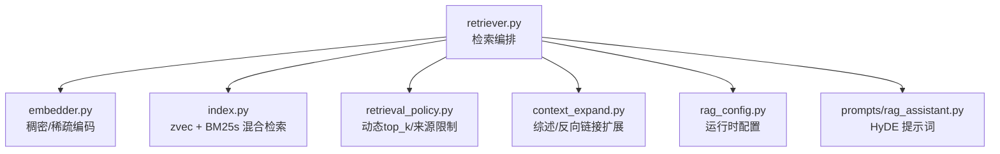
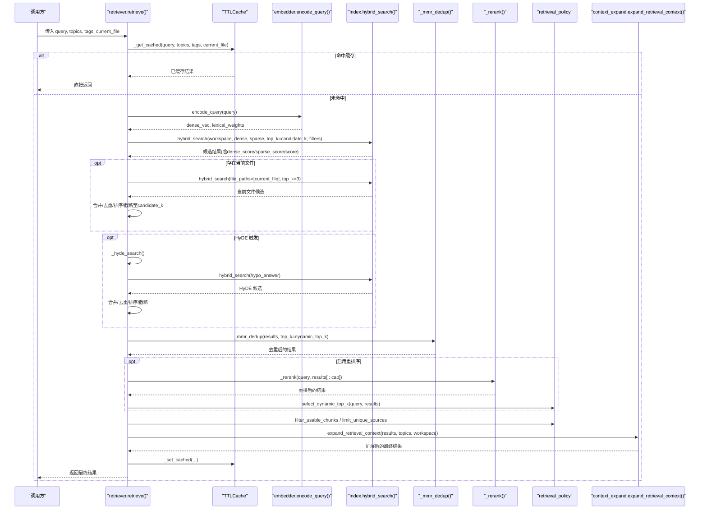
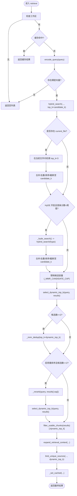
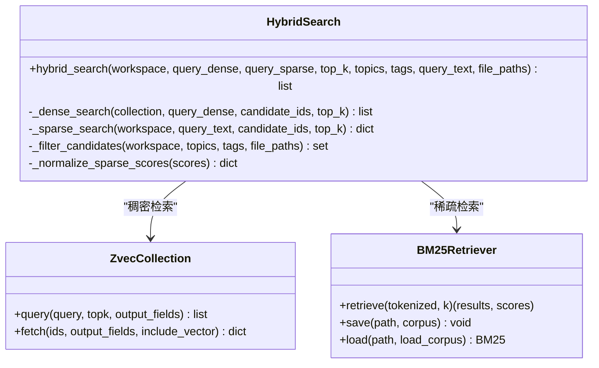
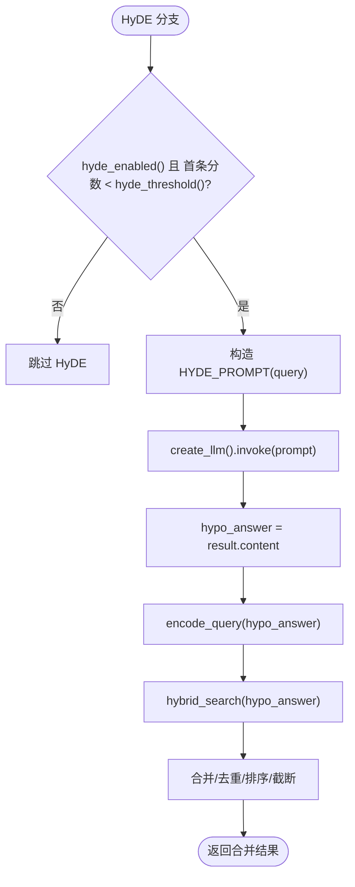
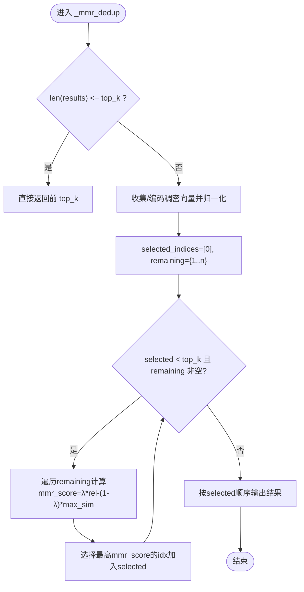
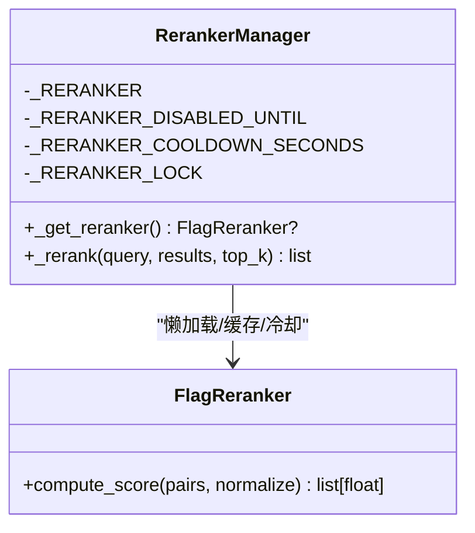
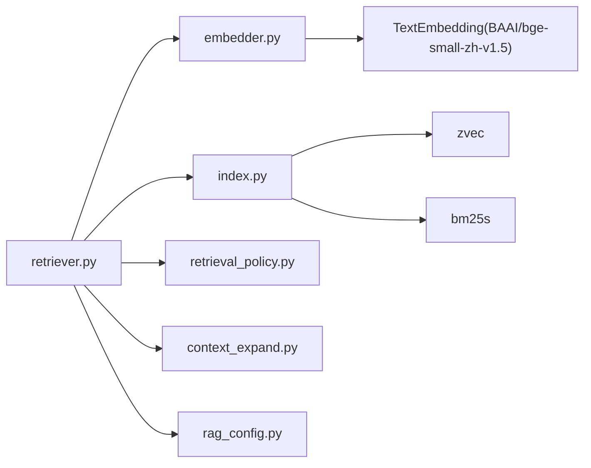

# 检索器核心

<cite>
**本文引用的文件**
- [retriever.py](file://python/sidecar/rag/retriever.py)
- [index.py](file://python/sidecar/rag/index.py)
- [embedder.py](file://python/sidecar/rag/embedder.py)
- [retrieval_policy.py](file://python/sidecar/rag/retrieval_policy.py)
- [context_expand.py](file://python/sidecar/rag/context_expand.py)
- [rag_config.py](file://python/sidecar/rag/rag_config.py)
- [rag_assistant.py](file://prompts/rag_assistant.py)
- [test_rag_retriever.py](file://tests/unit/test_rag_retriever.py)
</cite>

## 目录
1. [简介](#简介)
2. [项目结构](#项目结构)
3. [核心组件](#核心组件)
4. [架构总览](#架构总览)
5. [详细组件分析](#详细组件分析)
6. [依赖关系分析](#依赖关系分析)
7. [性能考量](#性能考量)
8. [故障排除指南](#故障排除指南)
9. [结论](#结论)
10. [附录](#附录)

## 简介
本文件面向 RAG 检索器核心模块，系统性梳理从查询预处理到上下文扩展的完整检索流程，重点解析 retrieve() 主函数执行逻辑、缓存机制、动态 top_k 选择、当前文件优先策略、HyDE 假设文档生成触发条件与实现原理、MMR 去重算法参数调优、重排序器的冷却机制与错误处理，并提供检索效果评估、性能优化与故障排除的实践指导。

## 项目结构
检索器核心由以下关键模块组成：
- retriever.py：检索编排层，串联编码、混合检索、MMR、重排序、上下文扩展等步骤，并管理缓存与线程池。
- index.py：底层索引与检索实现，基于 zvec（稠密向量）+ bm25s（稀疏词项），提供混合检索、候选过滤、BM25 重建与缓存。
- embedder.py：文本向量化与稀疏权重计算，维护全局 IDF，支持模型加载与缓存。
- retrieval_policy.py：结果后处理策略，包括动态 top_k 选择与唯一来源限制。
- context_expand.py：轻量上下文扩展，注入主题综述与确认过的反向链接片段。
- rag_config.py：运行时配置读取，控制 top_k、HyDE 阈值、重排序开关与混合权重等。
- prompts/rag_assistant.py：HyDE 提示词模板。
- tests/unit/test_rag_retriever.py：检索器相关单元测试，覆盖重排序器开关、扫描文件范围、动态 top_k 行为等。

图表来源
- [retriever.py:102-195](file://python/sidecar/rag/retriever.py#L102-L195)
- [index.py:961-1028](file://python/sidecar/rag/index.py#L961-L1028)
- [embedder.py:359-367](file://python/sidecar/rag/embedder.py#L359-L367)
- [retrieval_policy.py:58-100](file://python/sidecar/rag/retrieval_policy.py#L58-L100)
- [context_expand.py:147-197](file://python/sidecar/rag/context_expand.py#L147-L197)
- [rag_config.py:21-63](file://python/sidecar/rag/rag_config.py#L21-L63)
- [rag_assistant.py:4-6](file://prompts/rag_assistant.py#L4-L6)

章节来源
- [retriever.py:102-195](file://python/sidecar/rag/retriever.py#L102-L195)
- [index.py:961-1028](file://python/sidecar/rag/index.py#L961-L1028)
- [embedder.py:359-367](file://python/sidecar/rag/embedder.py#L359-L367)
- [retrieval_policy.py:58-100](file://python/sidecar/rag/retrieval_policy.py#L58-L100)
- [context_expand.py:147-197](file://python/sidecar/rag/context_expand.py#L147-L197)
- [rag_config.py:21-63](file://python/sidecar/rag/rag_config.py#L21-L63)
- [rag_assistant.py:4-6](file://prompts/rag_assistant.py#L4-L6)

## 核心组件
- 检索编排（retrieve）：负责查询缓存命中、编码、混合检索、当前文件补充、HyDE 增强、MMR 去重、重排序、动态 top_k、可用块过滤与上下文扩展。
- 混合检索（hybrid_search）：并行执行稠密搜索（zvec）与稀疏搜索（bm25s），按配置权重融合得分，返回候选集。
- 编码（encode_query/encode_documents）：使用本地嵌入模型生成稠密向量，同时基于全局 IDF 计算稀疏权重。
- 策略（select_dynamic_top_k/limit_unique_sources）：根据查询复杂度与分数分布自适应决定引用数量，并限制来源多样性。
- 上下文扩展（expand_retrieval_context）：在结果前后插入主题综述与确认过的反向链接片段，提升可解释性与覆盖面。
- 配置（rag_config）：集中暴露 top_k、HyDE 阈值、重排序开关、跳过阈值、稠密权重等可调参数。

章节来源
- [retriever.py:102-195](file://python/sidecar/rag/retriever.py#L102-L195)
- [index.py:961-1028](file://python/sidecar/rag/index.py#L961-L1028)
- [embedder.py:359-367](file://python/sidecar/rag/embedder.py#L359-L367)
- [retrieval_policy.py:58-100](file://python/sidecar/rag/retrieval_policy.py#L58-L100)
- [context_expand.py:147-197](file://python/sidecar/rag/context_expand.py#L147-L197)
- [rag_config.py:21-63](file://python/sidecar/rag/rag_config.py#L21-L63)

## 架构总览
下图展示一次典型检索请求的端到端调用序列，涵盖缓存、编码、混合检索、当前文件优先、HyDE、MMR、重排序、动态 top_k、上下文扩展与缓存落盘。

图表来源
- [retriever.py:102-195](file://python/sidecar/rag/retriever.py#L102-L195)
- [retriever.py:198-226](file://python/sidecar/rag/retriever.py#L198-L226)
- [index.py:961-1028](file://python/sidecar/rag/index.py#L961-L1028)
- [retrieval_policy.py:58-100](file://python/sidecar/rag/retrieval_policy.py#L58-L100)
- [context_expand.py:147-197](file://python/sidecar/rag/context_expand.py#L147-L197)

## 详细组件分析

### retrieve() 主函数执行逻辑
- 工作区校验与缓存命中：若同一工作区下相同 query/topics/tags/current_file 命中 TTL 缓存，直接返回；否则进入检索流程。
- 查询编码：调用 encode_query 获取稠密向量与稀疏权重；若无稠密向量则快速返回空结果。
- 候选规模与混合检索：根据是否带过滤器动态选择配置的 top_k，并以 candidate_k = min(max(top_k*3, 12), 24) 作为初始候选上限；调用 hybrid_search 进行稠密+稀疏混合检索。
- 当前文件优先策略：若指定 current_file，则以相同查询向量仅在该文件内检索前 3 条，合并入候选集并按 score 排序后截断至 candidate_k。注意该阶段不改变原始证据优先级，仅作为候选补充。
- HyDE 假设文档生成：当 HyDE 开启且首条结果分数低于阈值时，通过 LLM 生成简短假设答案，再对该假设答案执行混合检索，合并去重后再次截断。
- MMR 去重：对候选集进行最大边际相关性去重，默认候选容量上限为固定值；去重后得到更具多样性的子集。
- 动态 top_k：依据查询复杂度与分数分布选择最终引用数量。
- 重排序：若启用且候选数≥2，先以内容长度上限裁剪，批量打分后按 rerank_score 排序，再重新计算 dynamic_top_k。
- 可用块过滤与上下文扩展：过滤空内容块，调用 expand_retrieval_context 注入综述与反向链接片段，最后限制唯一来源数量。
- 缓存落盘：将最终结果写入 TTL 缓存，键包含工作区、query、topics、tags、current_file。

图表来源
- [retriever.py:102-195](file://python/sidecar/rag/retriever.py#L102-L195)
- [retriever.py:198-226](file://python/sidecar/rag/retriever.py#L198-L226)
- [retrieval_policy.py:58-100](file://python/sidecar/rag/retrieval_policy.py#L58-L100)
- [context_expand.py:147-197](file://python/sidecar/rag/context_expand.py#L147-L197)

章节来源
- [retriever.py:102-195](file://python/sidecar/rag/retriever.py#L102-L195)
- [retriever.py:198-226](file://python/sidecar/rag/retriever.py#L198-L226)
- [retrieval_policy.py:58-100](file://python/sidecar/rag/retrieval_policy.py#L58-L100)
- [context_expand.py:147-197](file://python/sidecar/rag/context_expand.py#L147-L197)

### 混合检索（zvec 稠密 0.7 + bm25s 稀疏 0.3）
- 候选过滤：根据 topics/tags/file_paths 构建候选 ID 集合，用于后续稠密/稀疏检索的预筛。
- 稠密检索：使用 zvec 的 HNSW 近似最近邻搜索，按 ef 参数控制召回质量，返回稠密相似度分数。
- 稀疏检索：使用 bm25s 对查询文本分词并检索，返回稀疏分数映射；若缺失 BM25 索引则自动重建或降级为稠密-only。
- 分数归一化与融合：将稀疏分数归一化到 [0,1]，按配置权重（默认稠密 0.7、稀疏 0.3）线性融合，合并稠密与稀疏独有命中，按总分排序并截取 top_k。

图表来源
- [index.py:961-1028](file://python/sidecar/rag/index.py#L961-L1028)
- [index.py:856-923](file://python/sidecar/rag/index.py#L856-L923)
- [index.py:824-843](file://python/sidecar/rag/index.py#L824-L843)
- [rag_config.py:57-63](file://python/sidecar/rag/rag_config.py#L57-L63)

章节来源
- [index.py:961-1028](file://python/sidecar/rag/index.py#L961-L1028)
- [index.py:856-923](file://python/sidecar/rag/index.py#L856-L923)
- [index.py:824-843](file://python/sidecar/rag/index.py#L824-L843)
- [rag_config.py:57-63](file://python/sidecar/rag/rag_config.py#L57-L63)

### HyDE 假设文档生成
- 触发条件：HyDE 功能开启且首轮检索的首条结果分数低于 hyde_threshold()。
- 实现原理：构造 HYDE_PROMPT 并调用 LLM 生成简短中文回答（≤100字），将该假设答案视为查询，再次执行混合检索，并将结果与首轮结果合并去重后截断。
- 容错处理：LLM 调用或检索异常均被捕获并记录日志，不影响主流程继续。

图表来源
- [retriever.py:198-226](file://python/sidecar/rag/retriever.py#L198-L226)
- [rag_assistant.py:4-6](file://prompts/rag_assistant.py#L4-L6)
- [rag_config.py:31-40](file://python/sidecar/rag/rag_config.py#L31-L40)

章节来源
- [retriever.py:198-226](file://python/sidecar/rag/retriever.py#L198-L226)
- [rag_assistant.py:4-6](file://prompts/rag_assistant.py#L4-L6)
- [rag_config.py:31-40](file://python/sidecar/rag/rag_config.py#L31-L40)

### MMR 去重算法与参数调优
- 输入：候选结果列表与目标 top_k。
- 向量准备：若结果中缺少稠密向量或维度不符，则批量调用 encode 生成；随后对向量进行 L2 归一化。
- 迭代选择：每次从未选集合中选择 mmr_score = λ * relevance - (1-λ) * max_sim 最高的条目加入已选集合，直至达到 top_k。
- 参数建议：
  - lambda_param：默认 0.5，增大偏向相关性，减小偏向多样性。
  - top_k：由动态策略决定，通常 2~8。
  - 候选容量上限：_MMR_CANDIDATE_CAP 限制参与 MMR 的最大候选数，避免 O(n^2) 开销过大。
- 异常处理：任何异常均回退为取前 top_k 条结果。

图表来源
- [retriever.py:229-290](file://python/sidecar/rag/retriever.py#L229-L290)

章节来源
- [retriever.py:229-290](file://python/sidecar/rag/retriever.py#L229-L290)

### 重排序器与冷却机制
- 启用判断：可通过环境变量 NOTEAI_DISABLE_RERANKER 或配置项关闭；默认启用。
- 跳过阈值：若首条结果分数高于 rerank_skip_score()，直接跳过重排序以提升性能。
- 模型加载与缓存：首次使用时懒加载 FlagReranker（BAAI/bge-reranker-v2-m3），并设置 HF 缓存目录；失败时设置冷却时间（默认 60 秒），期间不再尝试加载。
- 批处理与裁剪：对候选内容按最大字符数裁剪，批量 compute_score 并归一化，按 rerank_score 排序后返回 top_k。
- 错误处理：导入失败或运行异常均记录警告并回退为原顺序。

图表来源
- [retriever.py:47-84](file://python/sidecar/rag/retriever.py#L47-L84)
- [retriever.py:293-324](file://python/sidecar/rag/retriever.py#L293-L324)
- [rag_config.py:43-54](file://python/sidecar/rag/rag_config.py#L43-L54)

章节来源
- [retriever.py:47-84](file://python/sidecar/rag/retriever.py#L47-L84)
- [retriever.py:293-324](file://python/sidecar/rag/retriever.py#L293-L324)
- [rag_config.py:43-54](file://python/sidecar/rag/rag_config.py#L43-L54)

### 动态 top_k 与来源限制
- 动态 top_k：根据查询复杂度（简单/中等/广泛）与分数分布（首位与次位差距、尾部分数）决定引用数量，范围 1~8。
- 来源限制：在最终输出前限制唯一来源数量，避免过度集中于单一文件，同时允许同一文件的多段内容保留。

章节来源
- [retrieval_policy.py:58-100](file://python/sidecar/rag/retrieval_policy.py#L58-L100)

### 上下文扩展
- 主题综述：根据结果中的 topic 键查找对应综述文件，截取最多两条、每条约 2800 字的内容插入到结果前部。
- 反向链接：基于已确认的双向链接，为种子文件选取最多四个邻居文件，优先取索引片段，否则回退到全文摘要，插入到结果后部。
- 去重与标记：为新增条目添加 source_type/source_label 等元信息，并对 id 去重。

章节来源
- [context_expand.py:147-197](file://python/sidecar/rag/context_expand.py#L147-L197)

## 依赖关系分析
- retriever 依赖 embedder 进行编码，依赖 index 进行混合检索，依赖 retrieval_policy 进行结果策略处理，依赖 context_expand 进行上下文扩展，依赖 rag_config 读取运行时配置。
- index 内部依赖 zvec 与 bm25s，维护 collection 与 BM25 缓存，确保并发安全与版本一致性。
- embedder 维护全局 IDF 与模型缓存，支持离线推理与增量更新。

图表来源
- [retriever.py:102-195](file://python/sidecar/rag/retriever.py#L102-L195)
- [index.py:961-1028](file://python/sidecar/rag/index.py#L961-L1028)
- [embedder.py:359-367](file://python/sidecar/rag/embedder.py#L359-L367)
- [rag_config.py:21-63](file://python/sidecar/rag/rag_config.py#L21-L63)

章节来源
- [retriever.py:102-195](file://python/sidecar/rag/retriever.py#L102-L195)
- [index.py:961-1028](file://python/sidecar/rag/index.py#L961-L1028)
- [embedder.py:359-367](file://python/sidecar/rag/embedder.py#L359-L367)
- [rag_config.py:21-63](file://python/sidecar/rag/rag_config.py#L21-L63)

## 性能考量
- 并发与线程池：
  - 混合检索使用线程池并行执行稠密与稀疏搜索，减少 I/O 等待。
  - 编码与索引重建使用线程池并行处理，提高吞吐。
- 缓存策略：
  - 查询级 TTL 缓存（5 分钟）降低重复查询成本。
  - BM25 检索器与 zvec collection 句柄缓存避免频繁磁盘 IO 与重建。
- 候选规模控制：
  - 初始 candidate_k 与 MMR/Rerank 候选上限限制计算量。
  - 动态 top_k 避免不必要的冗余引用。
- 模型与索引：
  - 全局 IDF 持久化减少稀疏权重计算开销。
  - BM25 重建延迟到批量操作末尾，减少昂贵的 zvec.open() 次数。

[本节为通用性能讨论，无需特定文件分析]

## 故障排除指南
- 重排序器不可用：
  - 现象：首次加载失败后进入冷却期，期间 _get_reranker() 返回 None。
  - 排查：检查 FlagEmbedding 安装与 HF 缓存目录权限；查看冷却时间是否过期；环境变量 NOTEAI_DISABLE_RERANKER 是否误设为禁用。
  - 参考：测试用例覆盖禁用环境与异常路径。
- BM25 索引缺失：
  - 现象：稀疏检索不可用，降级为稠密-only。
  - 排查：调用 ensure_bm25_index 自动重建；检查 bm25s 目录是否存在有效文件；查看日志中重建进度。
- 索引文件被占用：
  - 现象：打开 zvec collection 时报锁错误。
  - 排查：清理 LOCK 文件（不要删除零字节 lock 文件），关闭其他 NoteAI 实例；重试或等待 GC 释放。
- HyDE 失败：
  - 现象：LLM 调用或编码失败导致 HyDE 分支返回空。
  - 排查：检查 LLM 可用性、网络代理与缓存目录；确认 hyde_threshold 设置合理。
- 动态 top_k 过小：
  - 现象：复杂查询只返回少量引用。
  - 排查：调整 rag_top_k 与 rag_hyde_threshold；检查查询复杂度判定与分数分布是否符合预期。

章节来源
- [test_rag_retriever.py:30-144](file://tests/unit/test_rag_retriever.py#L30-L144)
- [index.py:824-843](file://python/sidecar/rag/index.py#L824-L843)
- [index.py:169-189](file://python/sidecar/rag/index.py#L169-L189)
- [retriever.py:47-84](file://python/sidecar/rag/retriever.py#L47-L84)
- [retriever.py:198-226](file://python/sidecar/rag/retriever.py#L198-L226)
- [rag_config.py:31-40](file://python/sidecar/rag/rag_config.py#L31-L40)

## 结论
本检索器核心通过“稠密+稀疏”混合检索、HyDE 增强、MMR 多样性选择、重排序与上下文扩展，形成高鲁棒性与高可解释性的检索链路。其设计强调性能与稳定性：多级缓存、并发执行、候选规模控制与冷却机制共同保障在高负载下的稳定表现。通过合理的参数调优与故障排查，可在不同场景下取得良好的检索效果。

[本节为总结性内容，无需特定文件分析]

## 附录
- 关键配置项说明：
  - rag_top_k：基础 top_k，默认 5；带标签过滤时使用 rag_top_k_tags，默认 7。
  - rag_hyde_enabled：是否启用 HyDE，默认开启。
  - rag_hyde_threshold：HyDE 触发阈值，默认 0.33。
  - rag_rerank_enabled：是否启用重排序，默认开启；可通过环境变量禁用。
  - rag_rerank_skip_score：重排序跳过阈值，默认 0.75。
  - rag_dense_weight：稠密权重，默认 0.7；稀疏权重为 1 - 稠密权重。

章节来源
- [rag_config.py:21-63](file://python/sidecar/rag/rag_config.py#L21-L63)