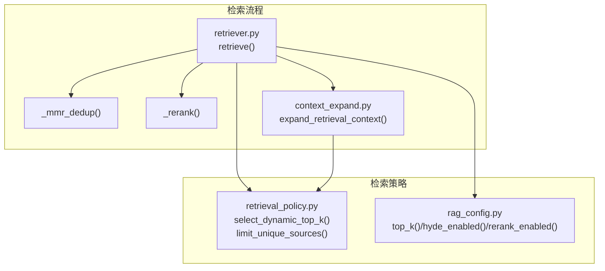
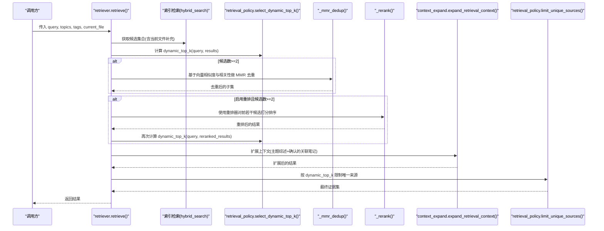
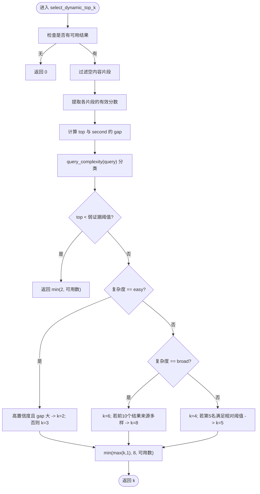
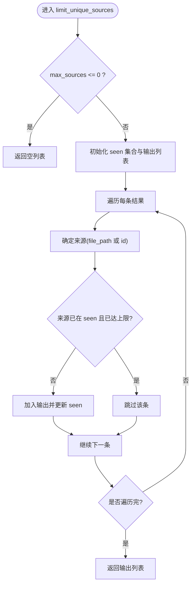
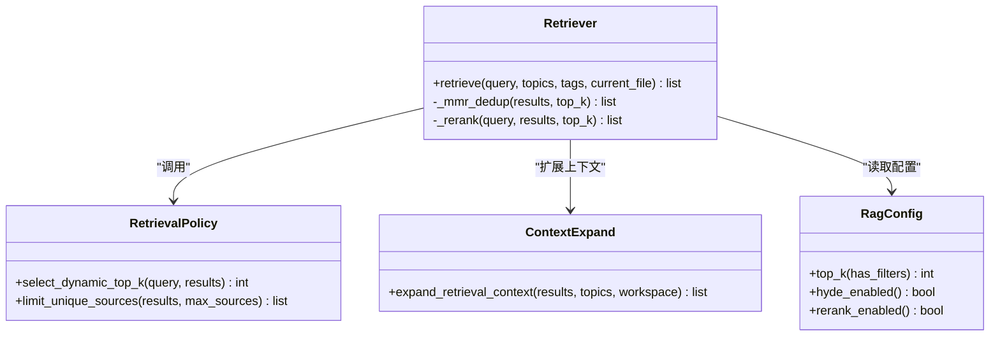
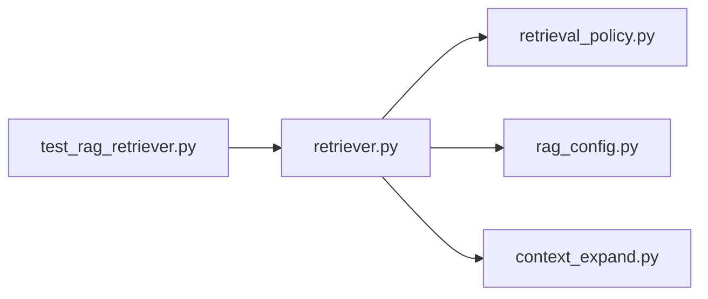

# 检索策略

<cite>
**本文引用的文件**   
- [retrieval_policy.py](file://python/sidecar/rag/retrieval_policy.py)
- [retriever.py](file://python/sidecar/rag/retriever.py)
- [context_expand.py](file://python/sidecar/rag/context_expand.py)
- [rag_config.py](file://python/sidecar/rag/rag_config.py)
- [test_rag_retriever.py](file://tests/unit/test_rag_retriever.py)
</cite>

## 目录
1. [简介](#简介)
2. [项目结构](#项目结构)
3. [核心组件](#核心组件)
4. [架构总览](#架构总览)
5. [详细组件分析](#详细组件分析)
6. [依赖关系分析](#依赖关系分析)
7. [性能考量](#性能考量)
8. [故障排查指南](#故障排查指南)
9. [结论](#结论)
10. [附录：配置与最佳实践](#附录配置与最佳实践)

## 简介
本技术文档聚焦于 RAG 检索策略模块，重点解释动态检索策略的核心机制：根据查询复杂度自动调整 top_k，以及基于结果质量的自适应过滤。文档深入解析 select_dynamic_top_k() 函数（查询分析、结果密度评估、阈值判断）、limit_unique_sources() 去重策略（避免单一来源过度影响结果），并给出检索策略的配置项、不同场景下的最佳实践、效果评估方法、参数调优建议与自定义策略开发指导。

## 项目结构
RAG 检索策略相关代码主要分布在以下模块：
- retrieval_policy.py：定义动态 top_k 选择与唯一来源限制策略
- retriever.py：检索主流程，串联候选召回、MMR 去重、重排、上下文扩展与最终裁剪
- context_expand.py：在检索结果基础上进行轻量上下文扩展（主题综述与确认的关联笔记）
- rag_config.py：运行时检索配置读取（top_k、HyDE、重排等开关与阈值）
- test_rag_retriever.py：单元测试覆盖动态 top_k 与唯一来源限制行为

图表来源
- [retriever.py:102-195](file://python/sidecar/rag/retriever.py#L102-L195)
- [retrieval_policy.py:58-101](file://python/sidecar/rag/retrieval_policy.py#L58-L101)
- [context_expand.py:147-198](file://python/sidecar/rag/context_expand.py#L147-L198)
- [rag_config.py:21-64](file://python/sidecar/rag/rag_config.py#L21-L64)

章节来源
- [retriever.py:102-195](file://python/sidecar/rag/retriever.py#L102-L195)
- [retrieval_policy.py:58-101](file://python/sidecar/rag/retrieval_policy.py#L58-L101)
- [context_expand.py:147-198](file://python/sidecar/rag/context_expand.py#L147-L198)
- [rag_config.py:21-64](file://python/sidecar/rag/rag_config.py#L21-L64)

## 核心组件
- 动态 top_k 选择：根据查询复杂度与结果质量分布，自适应决定最终引用数量
- 唯一来源限制：防止同一来源的片段过多占据结果，提升多样性
- 检索流程集成：在候选召回、MMR 去重、重排后，结合上下文扩展与唯一来源限制，输出最终证据集
- 配置驱动：通过运行时配置控制 top_k、HyDE、重排等关键行为

章节来源
- [retrieval_policy.py:58-101](file://python/sidecar/rag/retrieval_policy.py#L58-L101)
- [retriever.py:177-195](file://python/sidecar/rag/retriever.py#L177-L195)
- [rag_config.py:21-64](file://python/sidecar/rag/rag_config.py#L21-L64)

## 架构总览
下图展示了检索主流程中动态策略的调用时序与数据流：

图表来源
- [retriever.py:102-195](file://python/sidecar/rag/retriever.py#L102-L195)
- [retrieval_policy.py:58-101](file://python/sidecar/rag/retrieval_policy.py#L58-L101)
- [context_expand.py:147-198](file://python/sidecar/rag/context_expand.py#L147-L198)

## 详细组件分析

### 动态 top_k 选择：select_dynamic_top_k()
该函数依据查询复杂度与结果质量分布，自适应地选择最终引用的片段数量。其核心逻辑包括：
- 查询复杂度分类：将查询分为“简单”、“中等”、“广泛”三类，基于关键词匹配、长度与分隔符数量综合判定
- 结果可用性过滤：忽略无内容的片段，仅考虑有效结果
- 分数形状评估：取最高分与次高分的差值（gap），用于衡量结果集中度
- 阈值与分支决策：
  - 当最高分低于弱证据阈值时，保守返回少量片段
  - 简单查询在高置信度下减少引用，否则适度增加
  - 广泛查询默认返回较多片段，若前若干结果来源多样则进一步增加
  - 中等查询根据第5名分数相对阈值决定是否增加一个片段
- 边界约束：确保返回数量在合理范围内（最小为1，最大不超过8，且不大于可用结果数）

图表来源
- [retrieval_policy.py:58-86](file://python/sidecar/rag/retrieval_policy.py#L58-L86)

章节来源
- [retrieval_policy.py:58-86](file://python/sidecar/rag/retrieval_policy.py#L58-L86)
- [test_rag_retriever.py:146-174](file://tests/unit/test_rag_retriever.py#L146-L174)

### 唯一来源限制：limit_unique_sources()
该函数用于避免单一来源过度影响结果，保证结果的来源多样性：
- 遍历结果，优先保留每个来源的首条记录
- 当已选来源数量达到上限时，跳过后续相同来源的记录
- 支持以 file_path 或 id 作为来源标识，优先使用 file_path
- 返回的结果保持原始顺序，便于下游处理

图表来源
- [retrieval_policy.py:88-101](file://python/sidecar/rag/retrieval_policy.py#L88-L101)

章节来源
- [retrieval_policy.py:88-101](file://python/sidecar/rag/retrieval_policy.py#L88-L101)
- [test_rag_retriever.py:175-184](file://tests/unit/test_rag_retriever.py#L175-L184)

### 检索流程集成与上下文扩展
检索主流程在多个阶段应用动态策略：
- 候选召回后，先计算 dynamic_top_k，再进行 MMR 去重
- 若启用重排，则在重排后再次计算 dynamic_top_k，确保最终引用数量与重排后的质量分布一致
- 上下文扩展阶段会插入主题综述与确认的关联笔记片段，随后再次应用唯一来源限制，避免扩展内容导致来源集中

图表来源
- [retriever.py:102-195](file://python/sidecar/rag/retriever.py#L102-L195)
- [retrieval_policy.py:58-101](file://python/sidecar/rag/retrieval_policy.py#L58-L101)
- [context_expand.py:147-198](file://python/sidecar/rag/context_expand.py#L147-L198)
- [rag_config.py:21-64](file://python/sidecar/rag/rag_config.py#L21-L64)

章节来源
- [retriever.py:102-195](file://python/sidecar/rag/retriever.py#L102-L195)
- [context_expand.py:147-198](file://python/sidecar/rag/context_expand.py#L147-L198)

## 依赖关系分析
- retriever.py 依赖 retrieval_policy.py 的动态策略与 limit_unique_sources
- retriever.py 依赖 rag_config.py 的运行时配置（top_k、HyDE、重排开关与阈值）
- retriever.py 依赖 context_expand.py 进行上下文扩展
- 单元测试覆盖动态 top_k 与唯一来源限制的行为，验证策略在不同输入下的稳定性

图表来源
- [retriever.py:102-195](file://python/sidecar/rag/retriever.py#L102-L195)
- [retrieval_policy.py:58-101](file://python/sidecar/rag/retrieval_policy.py#L58-L101)
- [rag_config.py:21-64](file://python/sidecar/rag/rag_config.py#L21-L64)
- [context_expand.py:147-198](file://python/sidecar/rag/context_expand.py#L147-L198)
- [test_rag_retriever.py:146-184](file://tests/unit/test_rag_retriever.py#L146-L184)

章节来源
- [retriever.py:102-195](file://python/sidecar/rag/retriever.py#L102-L195)
- [retrieval_policy.py:58-101](file://python/sidecar/rag/retrieval_policy.py#L58-L101)
- [rag_config.py:21-64](file://python/sidecar/rag/rag_config.py#L21-L64)
- [context_expand.py:147-198](file://python/sidecar/rag/context_expand.py#L147-L198)
- [test_rag_retriever.py:146-184](file://tests/unit/test_rag_retriever.py#L146-L184)

## 性能考量
- 动态 top_k 的计算开销极低，仅涉及字符串分析与数值比较，适合高频调用
- 唯一来源限制为线性扫描，时间复杂度 O(n)，空间复杂度 O(s)（s 为唯一来源数）
- 在检索流程中，dynamic_top_k 被多次调用（MMR 前后、重排后），但每次调用均快速返回，整体对延迟影响可忽略
- 上下文扩展可能引入额外 I/O 与文本读取，但受限于最大条目与字符数，通常可控

[本节为通用性能讨论，不直接分析具体文件]

## 故障排查指南
- 动态 top_k 返回异常小或过大：
  - 检查查询复杂度分类是否符合预期（关键词、长度、分隔符）
  - 查看结果分数分布，确认 top 与 second 的 gap 是否合理
  - 参考单元测试用例对比输入与期望输出
- 唯一来源限制导致结果过少：
  - 确认 max_sources 设置是否过小
  - 检查来源字段（file_path 或 id）是否正确填充
- 重排未生效：
  - 检查环境变量与配置是否禁用重排
  - 查看冷却期与错误日志，确认重排器是否正常加载

章节来源
- [test_rag_retriever.py:146-184](file://tests/unit/test_rag_retriever.py#L146-L184)
- [retriever.py:47-84](file://python/sidecar/rag/retriever.py#L47-L84)

## 结论
动态检索策略通过查询复杂度与结果质量分布的联合判断，实现了灵活而稳健的 top_k 自适应；唯一来源限制有效提升了结果多样性，避免单一来源主导。配合上下文扩展与重排，整体检索流程在保证效率的同时显著提升了答案的相关性与全面性。

[本节为总结性内容，不直接分析具体文件]

## 附录：配置与最佳实践

### 配置选项
- top_k：基础候选数量，可通过 has_filters 区分带标签/主题过滤时的默认值
- hyde_enabled/hyde_threshold：是否启用 HyDE 与触发阈值
- rerank_enabled/rerank_skip_score：是否启用重排与跳过重排的阈值
- NOTEAI_DISABLE_RERANKER：环境变量，强制禁用重排器

章节来源
- [rag_config.py:21-64](file://python/sidecar/rag/rag_config.py#L21-L64)
- [retriever.py:47-84](file://python/sidecar/rag/retriever.py#L47-L84)

### 不同场景的最佳实践
- 简单明确查询（如名词短语）：
  - 倾向较小的 dynamic_top_k，避免冗余引用
  - 适当提高重排跳过阈值，减少不必要的重排开销
- 广泛探索型查询（包含“比较/总结/方案/优缺点”等）：
  - 允许较大的 dynamic_top_k，并结合唯一来源限制提升多样性
  - 开启 HyDE 以提升弱证据情况下的召回质量
- 强证据场景（top 分数很高且 gap 较大）：
  - 可减少引用数量，聚焦高质量片段
- 弱证据场景（top 分数较低）：
  - 保守返回少量片段，避免误导

[本节为通用指导，不直接分析具体文件]

### 策略效果评估与参数调优
- 评估指标：
  - 引用数量分布（平均/方差）
  - 来源多样性（唯一来源占比）
  - 答案相关性（人工或自动化评分）
- 调优建议：
  - 调整查询复杂度关键词集合与阈值，使分类更贴合业务
  - 微调 top 与 second 的 gap 阈值，平衡简洁与全面
  - 调节唯一来源限制的上限，兼顾多样性与覆盖率
  - 针对特定领域优化 HyDE 阈值与重排跳过阈值

[本节为通用指导，不直接分析具体文件]

### 自定义策略开发指导
- 扩展查询复杂度分类：
  - 在 query_complexity 中添加领域关键词或正则规则
- 改进结果密度评估：
  - 引入更多分数维度（dense/sparse/rerank）的统计特征
  - 使用分位数或直方图分析替代固定阈值
- 增强唯一来源限制：
  - 支持多级来源（topic/file_path/id）的组合去重
  - 引入来源权重，避免低质量来源占用配额
- 集成到检索流程：
  - 在 retriever.py 的关键节点插入新的策略函数
  - 确保与现有缓存、并发与错误处理兼容

[本节为通用指导，不直接分析具体文件]