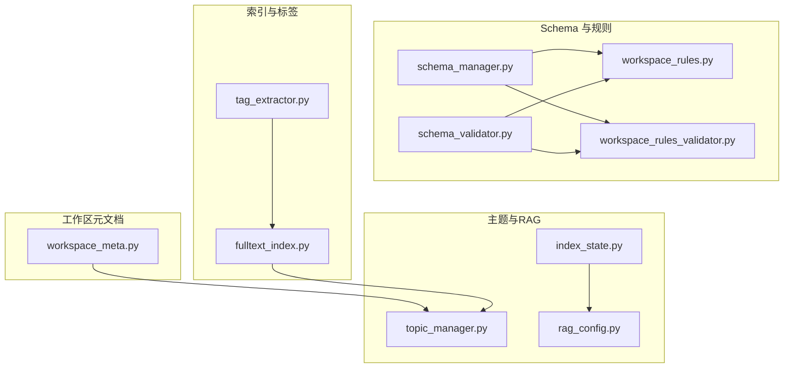
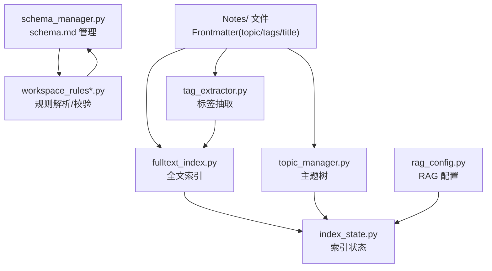
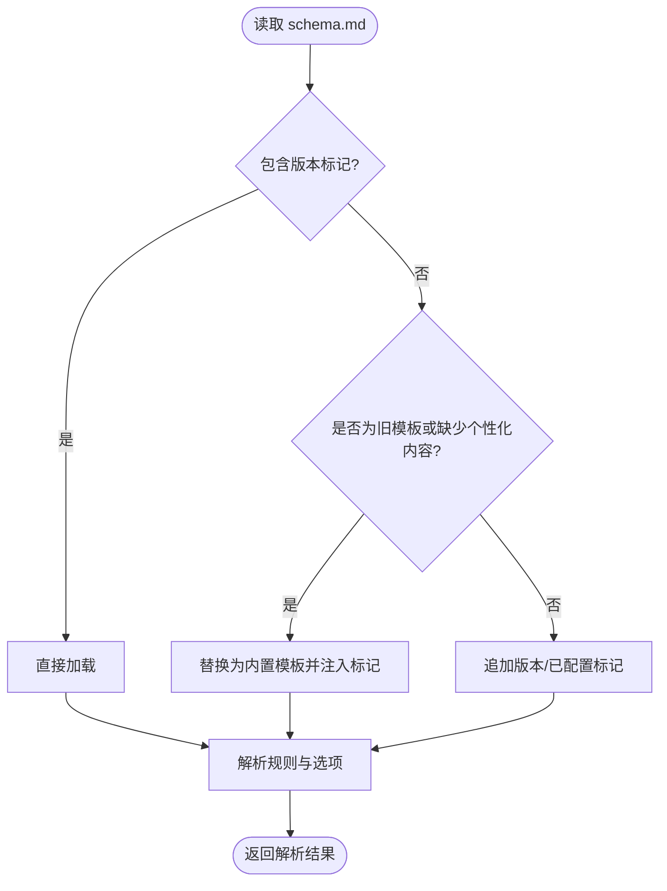
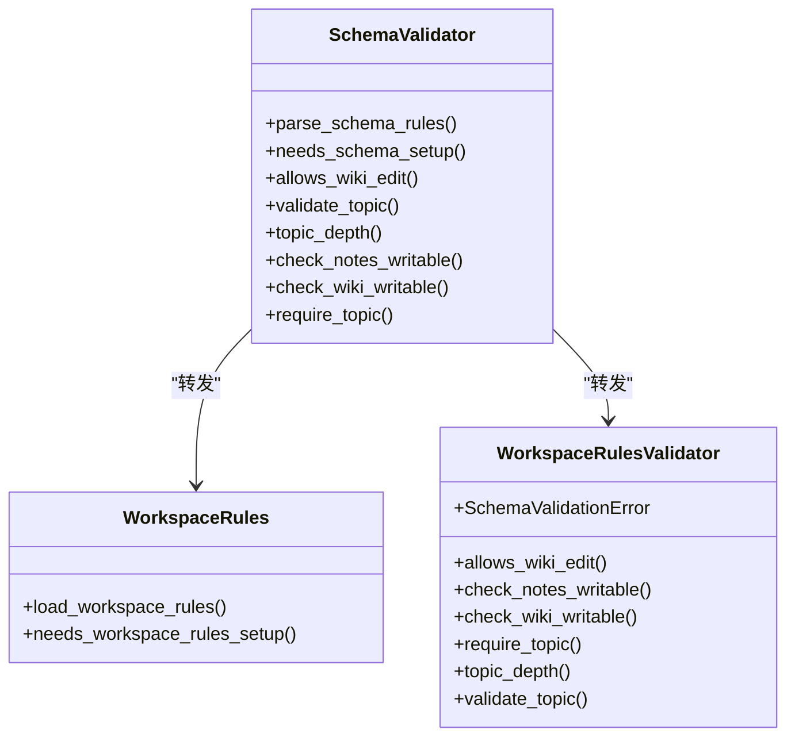
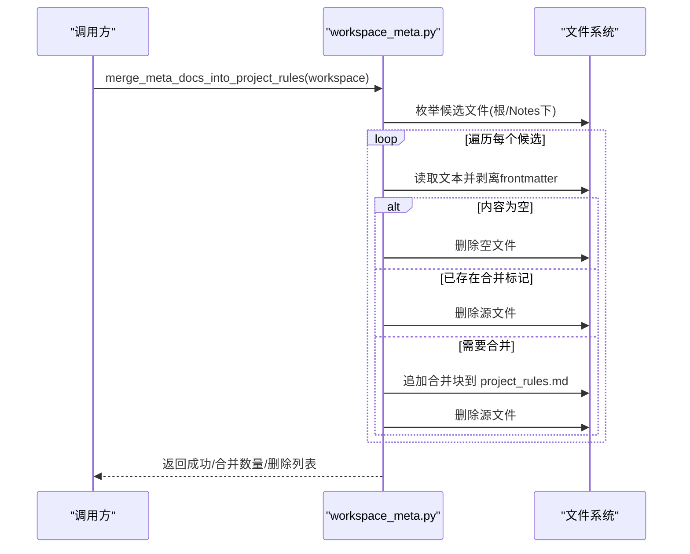
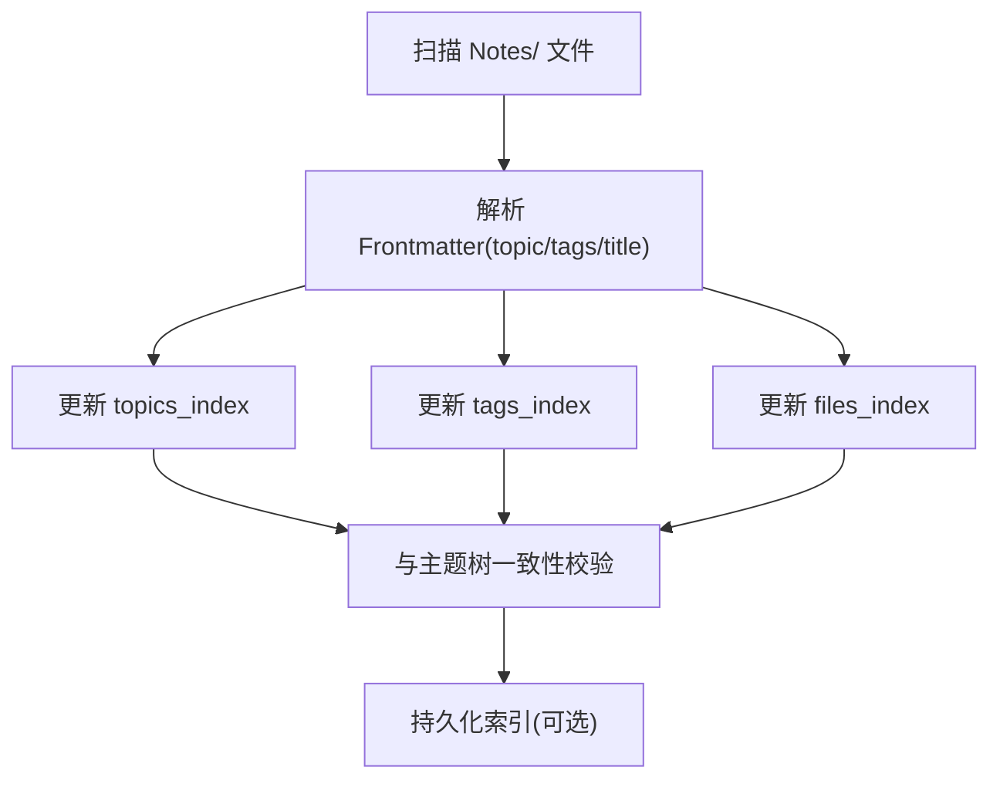
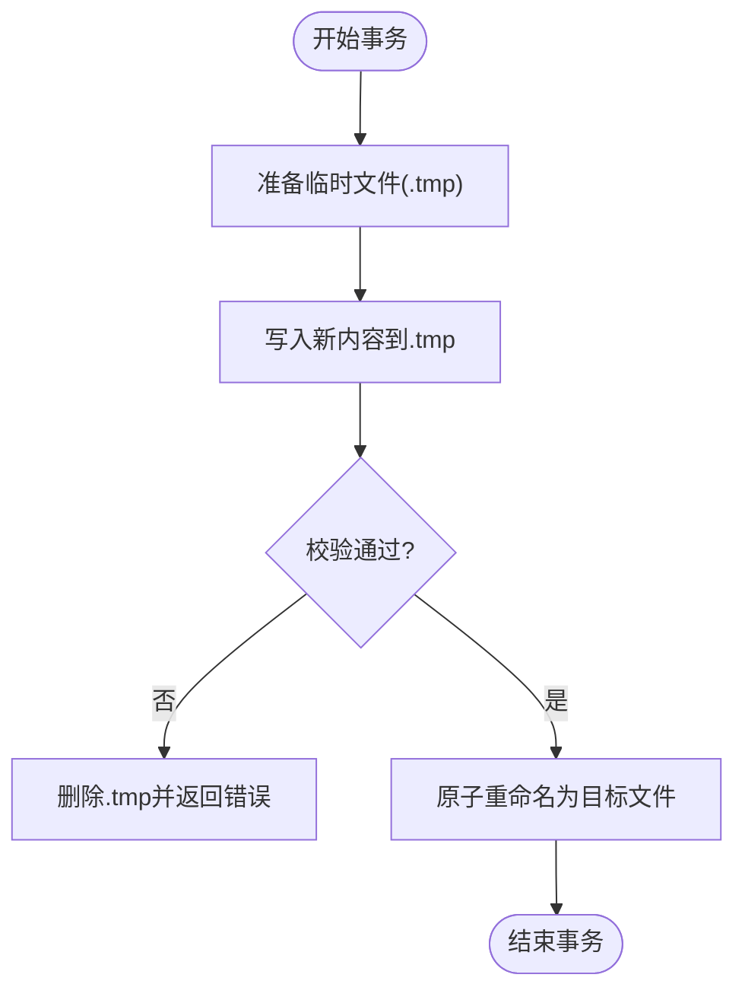
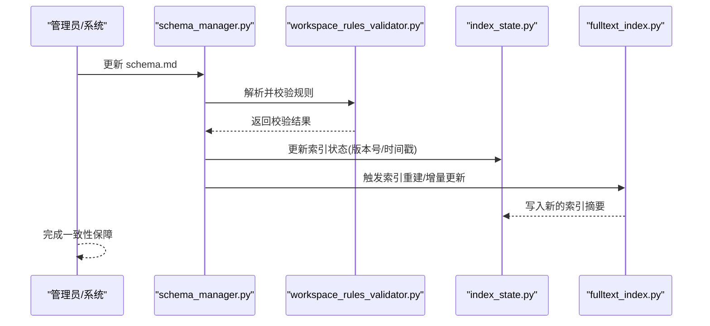
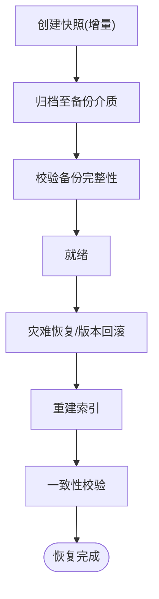
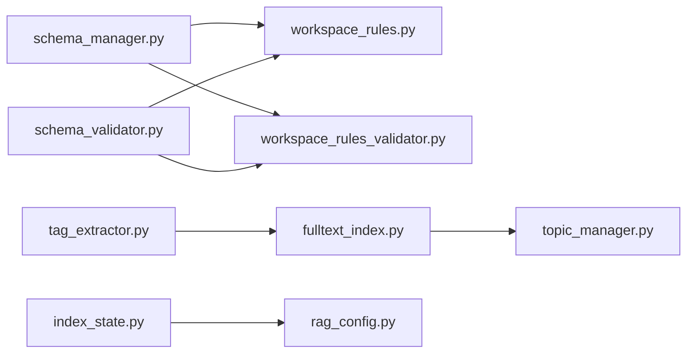

# 元数据管理

<cite>
**本文引用的文件**   
- [schema_manager.py](file://python/sidecar/schema_manager.py)
- [schema_validator.py](file://python/sidecar/schema_validator.py)
- [workspace_rules.py](file://python/sidecar/workspace_rules.py)
- [workspace_rules_validator.py](file://python/sidecar/workspace_rules_validator.py)
- [workspace_meta.py](file://python/sidecar/workspace_meta.py)
- [fulltext_index.py](file://utils/fulltext_index.py)
- [tag_extractor.py](file://utils/tag_extractor.py)
- [topic_manager.py](file://utils/topic_manager.py)
- [rag_config.py](file://python/sidecar/rag/rag_config.py)
- [index_state.py](file://python/sidecar/rag/index_state.py)
- [test_schema_manager.py](file://tests/unit/test_schema_manager.py)
- [test_workspace_meta.py](file://tests/unit/test_workspace_meta.py)
</cite>

## 目录
1. [简介](#简介)
2. [项目结构](#项目结构)
3. [核心组件](#核心组件)
4. [架构总览](#架构总览)
5. [详细组件分析](#详细组件分析)
6. [依赖关系分析](#依赖关系分析)
7. [性能与存储优化](#性能与存储优化)
8. [故障排查指南](#故障排查指南)
9. [结论](#结论)
10. [附录](#附录)

## 简介
本技术文档聚焦于 RAG 元数据管理系统，围绕以下目标展开：
- 元数据的组织结构与倒排索引设计（topics、tags、files）
- manifest.json 版本管理机制（schema 版本升级、迁移策略、兼容性检查）
- 元数据文件的原子写入与事务性更新（临时文件、回滚）
- 一致性保证机制（与 zvec 集合的同步验证、完整性检查）
- 备份恢复方案（增量备份、灾难恢复、版本回滚）
- 查询优化与存储空间管理建议

说明：仓库中未直接发现名为 manifest.json 的文件；schema.md 作为工作区结构与规则的核心载体，承担“类 manifest”的版本与配置职责。本文据此给出可落地的设计与实现建议，并与现有 schema 管理代码对齐。

## 项目结构
与元数据管理相关的核心模块分布如下：
- schema 管理与解析：schema_manager.py、schema_validator.py、workspace_rules.py、workspace_rules_validator.py
- 工作区元文档合并：workspace_meta.py
- 全文检索与标签提取：fulltext_index.py、tag_extractor.py
- 主题体系与树构建：topic_manager.py
- RAG 索引状态与配置：index_state.py、rag_config.py
- 单元测试覆盖：test_schema_manager.py、test_workspace_meta.py

图表来源
- [schema_manager.py:1-307](file://python/sidecar/schema_manager.py#L1-L307)
- [schema_validator.py:1-15](file://python/sidecar/schema_validator.py#L1-L15)
- [workspace_rules.py](file://python/sidecar/workspace_rules.py)
- [workspace_rules_validator.py](file://python/sidecar/workspace_rules_validator.py)
- [workspace_meta.py:1-121](file://python/sidecar/workspace_meta.py#L1-L121)
- [fulltext_index.py](file://utils/fulltext_index.py)
- [tag_extractor.py](file://utils/tag_extractor.py)
- [topic_manager.py](file://utils/topic_manager.py)
- [index_state.py](file://python/sidecar/rag/index_state.py)
- [rag_config.py](file://python/sidecar/rag/rag_config.py)

章节来源
- [schema_manager.py:1-307](file://python/sidecar/schema_manager.py#L1-L307)
- [schema_validator.py:1-15](file://python/sidecar/schema_validator.py#L1-L15)
- [workspace_meta.py:1-121](file://python/sidecar/workspace_meta.py#L1-L121)
- [fulltext_index.py](file://utils/fulltext_index.py)
- [tag_extractor.py](file://utils/tag_extractor.py)
- [topic_manager.py](file://utils/topic_manager.py)
- [index_state.py](file://python/sidecar/rag/index_state.py)
- [rag_config.py](file://python/sidecar/rag/rag_config.py)

## 核心组件
- Schema 管理器（schema_manager.py）
  - 负责 schema.md 的加载、保存、模板生成、版本标记注入、规则解析与选项导出
  - 提供“是否需要设置/升级”的判断逻辑，以及将旧版 SCHEMA.md 重命名为 schema.md 的兼容处理
- Schema 校验器（schema_validator.py）
  - 向后兼容的再导出层，统一暴露 workspace_rules 与 workspace_rules_validator 的能力
- 工作区规则（workspace_rules.py / workspace_rules_validator.py）
  - 实际规则解析与校验实现（由 schema_validator.py 转发）
- 工作区元文档（workspace_meta.py）
  - 将 AGENTS/CLAUDE/GEMINI 等元文档合并入 .ai_memory/project_rules.md，并清理源文件
- 全文索引与标签（fulltext_index.py / tag_extractor.py）
  - 提供全文检索与标签抽取能力，为 tags/files 倒排索引提供基础
- 主题与树（topic_manager.py）
  - 从文件系统构建主题树，支撑 topics 倒排索引的一级主题列表
- RAG 索引状态与配置（index_state.py / rag_config.py）
  - 维护索引状态与 RAG 配置，便于与元数据变更联动

章节来源
- [schema_manager.py:1-307](file://python/sidecar/schema_manager.py#L1-L307)
- [schema_validator.py:1-15](file://python/sidecar/schema_validator.py#L1-L15)
- [workspace_rules.py](file://python/sidecar/workspace_rules.py)
- [workspace_rules_validator.py](file://python/sidecar/workspace_rules_validator.py)
- [workspace_meta.py:1-121](file://python/sidecar/workspace_meta.py#L1-L121)
- [fulltext_index.py](file://utils/fulltext_index.py)
- [tag_extractor.py](file://utils/tag_extractor.py)
- [topic_manager.py](file://utils/topic_manager.py)
- [index_state.py](file://python/sidecar/rag/index_state.py)
- [rag_config.py](file://python/sidecar/rag/rag_config.py)

## 架构总览
下图展示元数据在“文件—Schema—索引—RAG”之间的流转关系。

图表来源
- [schema_manager.py:1-307](file://python/sidecar/schema_manager.py#L1-L307)
- [workspace_rules.py](file://python/sidecar/workspace_rules.py)
- [workspace_rules_validator.py](file://python/sidecar/workspace_rules_validator.py)
- [fulltext_index.py](file://utils/fulltext_index.py)
- [tag_extractor.py](file://utils/tag_extractor.py)
- [topic_manager.py](file://utils/topic_manager.py)
- [index_state.py](file://python/sidecar/rag/index_state.py)
- [rag_config.py](file://python/sidecar/rag/rag_config.py)

## 详细组件分析

### Schema 管理与版本机制（schema.md 替代 manifest.json）
- 版本标记与升级
  - 通过固定注释标记识别 schema 版本，并在需要时自动补全标记或升级到内置模板
  - 对历史 SCHEMA.md 进行重命名兼容，确保新路径 schema.md 可用
- 规则解析与选项导出
  - 轻量解析 schema.md 中的开关与参数（如是否允许 AI 编辑 wiki/notes、最大主题深度、综述粒度等）
  - 导出供上层使用的结构化选项
- 模板与最终化
  - 内置模板支持裁剪与注入版本/已配置标记，确保幂等与一致性

图表来源
- [schema_manager.py:46-92](file://python/sidecar/schema_manager.py#L46-L92)
- [schema_manager.py:108-124](file://python/sidecar/schema_manager.py#L108-L124)
- [schema_manager.py:144-178](file://python/sidecar/schema_manager.py#L144-L178)

章节来源
- [schema_manager.py:1-307](file://python/sidecar/schema_manager.py#L1-L307)
- [test_schema_manager.py](file://tests/unit/test_schema_manager.py)

### Schema 校验与规则转发（schema_validator.py）
- 作用：提供向后兼容的 API 入口，统一对外暴露规则解析与校验方法
- 关键能力：
  - 解析规则（load_workspace_rules）
  - 判断是否需要初始化（needs_workspace_rules_setup）
  - 校验主题深度、合法性、可写范围等

图表来源
- [schema_validator.py:1-15](file://python/sidecar/schema_validator.py#L1-L15)
- [workspace_rules.py](file://python/sidecar/workspace_rules.py)
- [workspace_rules_validator.py](file://python/sidecar/workspace_rules_validator.py)

章节来源
- [schema_validator.py:1-15](file://python/sidecar/schema_validator.py#L1-L15)
- [workspace_rules.py](file://python/sidecar/workspace_rules.py)
- [workspace_rules_validator.py](file://python/sidecar/workspace_rules_validator.py)

### 工作区元文档合并（workspace_meta.py）
- 功能：扫描 AGENTS/CLAUDE/GEMINI 三类元文档，将其正文（去除 frontmatter）合并到 .ai_memory/project_rules.md，并删除源文件
- 幂等性：若已存在对应合并标记则跳过重复合并
- 异常处理：对空文件或 IO 错误进行日志记录与容错

图表来源
- [workspace_meta.py:46-98](file://python/sidecar/workspace_meta.py#L46-L98)

章节来源
- [workspace_meta.py:1-121](file://python/sidecar/workspace_meta.py#L1-L121)
- [test_workspace_meta.py](file://tests/unit/test_workspace_meta.py)

### 倒排索引设计（topics、tags、files）
- 数据来源
  - topics：基于 Notes/ 目录树与 Frontmatter.topic 字段
  - tags：基于 Frontmatter.tags 字段，可由 tag_extractor.py 辅助抽取
  - files：Notes/ 下的 Markdown 文件集合
- 数据结构建议
  - topics_index: topic -> set(file_path)
  - tags_index: tag -> set(file_path)
  - files_index: file_path -> {topic, tags, title, ...}
- 构建流程
  - 扫描 Notes/ 文件，解析 frontmatter，填充上述三个索引
  - 与主题树保持一致性校验（一级主题来自目录结构）
- 更新策略
  - 增量更新：仅对新增/修改/删除的文件执行索引增删改
  - 全量重建：当检测到 schema 或规则变化时触发

[本节为概念性设计，不直接映射具体源码文件]

### 元数据文件的原子写入与事务性更新
- 目标：避免部分写入导致的数据损坏或不一致
- 推荐模式
  - 先写入临时文件（如 .tmp），成功后原子重命名为目标文件
  - 失败时保留原文件不变，必要时清理临时文件
  - 对多文件更新采用“预检—批量写入—提交—回滚”的事务模型
- 适用场景
  - schema.md 更新、project_rules.md 合并、索引文件持久化

[本节为通用实现建议，不直接映射具体源码文件]

### 一致性保证与完整性检查
- 与主题树的一致性
  - 一级主题必须与 Notes/ 下的一级文件夹名一致
  - 二级/三级主题需满足 schema 中定义的最大深度限制
- 与 RAG 索引状态的同步
  - 当 schema 或规则发生变化时，应触发索引重建或增量更新
  - 使用 index_state.py 记录上次构建时间、版本、统计信息，用于比对与修复
- 完整性检查
  - 校验所有被索引文件的 frontmatter 是否存在必要字段
  - 校验 tags 非空且格式合法
  - 校验主题路径与文件名规范

图表来源
- [schema_manager.py:144-178](file://python/sidecar/schema_manager.py#L144-L178)
- [workspace_rules_validator.py](file://python/sidecar/workspace_rules_validator.py)
- [index_state.py](file://python/sidecar/rag/index_state.py)
- [fulltext_index.py](file://utils/fulltext_index.py)

章节来源
- [schema_manager.py:144-178](file://python/sidecar/schema_manager.py#L144-L178)
- [workspace_rules_validator.py](file://python/sidecar/workspace_rules_validator.py)
- [index_state.py](file://python/sidecar/rag/index_state.py)
- [fulltext_index.py](file://utils/fulltext_index.py)

### 备份恢复方案（含增量备份、灾难恢复、版本回滚）
- 增量备份
  - 基于文件时间戳与大小变化，仅备份自上次快照以来变更的文件
  - 结合索引状态文件，记录每次备份的索引版本
- 灾难恢复
  - 优先恢复 schema.md、project_rules.md、索引文件与 Notes/ 目录
  - 恢复后执行一致性检查与索引重建
- 版本回滚
  - 对 schema.md 与索引状态文件建立版本快照（按日期或版本号）
  - 回滚时选择目标版本并重新构建索引

[本节为通用方案建议，不直接映射具体源码文件]

## 依赖关系分析
- 低耦合高内聚
  - schema_manager.py 专注 schema.md 生命周期管理
  - schema_validator.py 作为适配层，屏蔽底层实现差异
  - workspace_rules*.py 承载规则解析与校验的具体逻辑
  - fulltext_index.py 与 tag_extractor.py 提供索引与标签能力
  - topic_manager.py 提供主题树构建，支撑 topics 倒排索引
  - index_state.py 与 rag_config.py 维护索引状态与 RAG 配置

图表来源
- [schema_manager.py:1-307](file://python/sidecar/schema_manager.py#L1-L307)
- [schema_validator.py:1-15](file://python/sidecar/schema_validator.py#L1-L15)
- [workspace_rules.py](file://python/sidecar/workspace_rules.py)
- [workspace_rules_validator.py](file://python/sidecar/workspace_rules_validator.py)
- [fulltext_index.py](file://utils/fulltext_index.py)
- [tag_extractor.py](file://utils/tag_extractor.py)
- [topic_manager.py](file://utils/topic_manager.py)
- [index_state.py](file://python/sidecar/rag/index_state.py)
- [rag_config.py](file://python/sidecar/rag/rag_config.py)

章节来源
- [schema_manager.py:1-307](file://python/sidecar/schema_manager.py#L1-L307)
- [schema_validator.py:1-15](file://python/sidecar/schema_validator.py#L1-L15)
- [workspace_rules.py](file://python/sidecar/workspace_rules.py)
- [workspace_rules_validator.py](file://python/sidecar/workspace_rules_validator.py)
- [fulltext_index.py](file://utils/fulltext_index.py)
- [tag_extractor.py](file://utils/tag_extractor.py)
- [topic_manager.py](file://utils/topic_manager.py)
- [index_state.py](file://python/sidecar/rag/index_state.py)
- [rag_config.py](file://python/sidecar/rag/rag_config.py)

## 性能与存储优化
- 索引构建
  - 增量更新优于全量重建；仅在 schema/规则变化或大规模变更时触发全量
  - 并行解析 frontmatter 与构建倒排索引，减少 I/O 等待
- 缓存策略
  - 对频繁访问的规则与选项进行内存缓存，设置 TTL 失效
- 存储压缩
  - 对历史 schema 与索引文件进行压缩归档，降低磁盘占用
- 查询优化
  - 对 tags/topics 倒排索引使用位图或布隆过滤器加速过滤
  - 对全文检索启用分词缓存与短语匹配优化

[本节为通用优化建议，不直接映射具体源码文件]

## 故障排查指南
- schema.md 无法解析或规则缺失
  - 检查是否包含版本标记与已配置标记
  - 确认是否需要运行初始化向导或升级模板
- 主题不一致
  - 校验一级主题与 Notes/ 目录是否一致
  - 检查 max_topic_depth 与当前主题层级
- 索引状态异常
  - 对比 index_state.py 记录的版本与时间戳
  - 触发重建并观察日志输出
- 元文档合并失败
  - 检查权限与磁盘空间
  - 查看日志中关于空文件或 IO 错误的提示

章节来源
- [schema_manager.py:46-92](file://python/sidecar/schema_manager.py#L46-L92)
- [workspace_meta.py:63-98](file://python/sidecar/workspace_meta.py#L63-L98)
- [index_state.py](file://python/sidecar/rag/index_state.py)

## 结论
本系统以 schema.md 为核心，配合规则解析与校验、主题树构建、全文索引与标签抽取，形成完整的 RAG 元数据管理体系。通过版本标记与模板升级、原子写入与事务性更新、一致性校验与索引状态管理，实现了稳健的元数据治理。在此基础上，结合增量备份与灾难恢复策略，可进一步提升系统的可靠性与可运维性。

## 附录
- 术语
  - schema.md：工作区结构与规则的定义文件
  - project_rules.md：工作区元文档合并后的规则汇总
  - 倒排索引：从关键词到文档集合的映射结构
- 相关测试
  - test_schema_manager.py：验证 schema 加载、升级与规则解析
  - test_workspace_meta.py：验证元文档合并与幂等性

章节来源
- [test_schema_manager.py](file://tests/unit/test_schema_manager.py)
- [test_workspace_meta.py](file://tests/unit/test_workspace_meta.py)