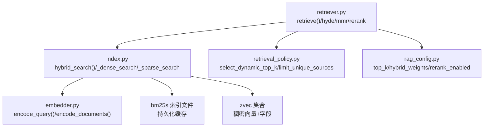
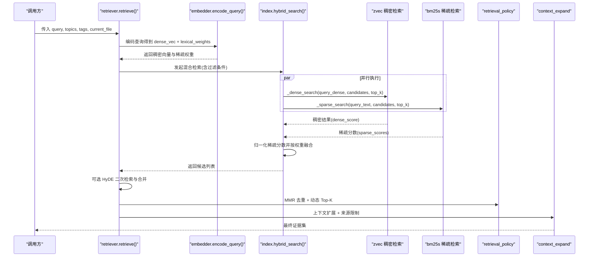
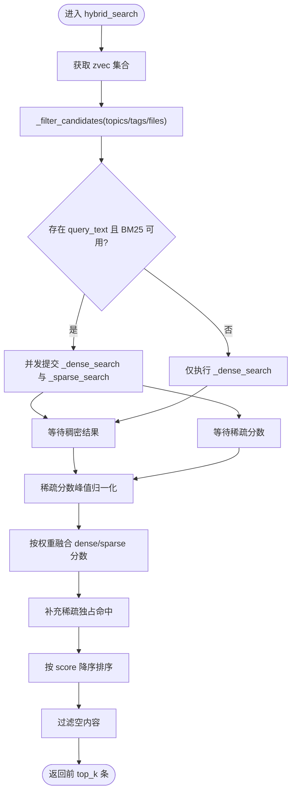
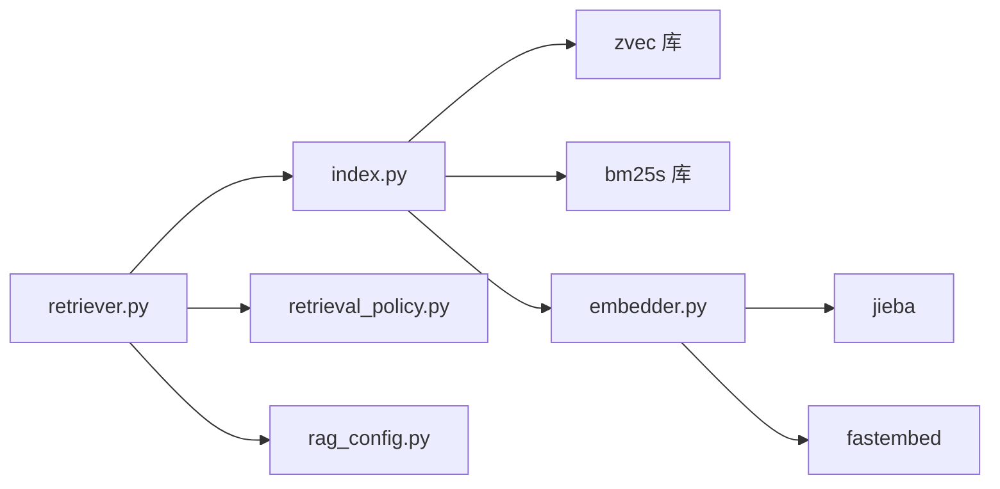

# 混合检索引擎

<cite>
**本文引用的文件**
- [retriever.py](file://python/sidecar/rag/retriever.py)
- [index.py](file://python/sidecar/rag/index.py)
- [embedder.py](file://python/sidecar/rag/embedder.py)
- [retrieval_policy.py](file://python/sidecar/rag/retrieval_policy.py)
- [rag_config.py](file://python/sidecar/rag/rag_config.py)
- [test_rag_retriever.py](file://tests/unit/test_rag_retriever.py)
</cite>

## 目录
1. [简介](#简介)
2. [项目结构](#项目结构)
3. [核心组件](#核心组件)
4. [架构总览](#架构总览)
5. [详细组件分析](#详细组件分析)
6. [依赖关系分析](#依赖关系分析)
7. [性能考量与调优](#性能考量与调优)
8. [故障排查指南](#故障排查指南)
9. [结论](#结论)
10. [附录：使用示例与常见问题](#附录使用示例与常见问题)

## 简介
本技术文档面向 NoteAI 的 RAG 混合检索子系统，重点解析 hybrid_search() 的实现原理与端到端检索流程。内容涵盖：
- 稠密向量搜索（zvec）与稀疏向量搜索（bm25s）的并行执行机制
- 权重分配算法、动态 Top-K 选择与结果融合策略
- 过滤条件处理：主题过滤、标签筛选、文件路径匹配与候选集构建
- 重排序机制：分数归一化、相关性计算与去重
- 检索性能调优：EF 参数配置、缓存策略与查询优化技巧
- 实际使用示例与常见问题解决方案

## 项目结构
RAG 混合检索相关代码主要位于 python/sidecar/rag 目录下，关键模块职责如下：
- retriever.py：对外检索入口、HyDE 增强、MMR 去重、重排序、上下文扩展、索引重建等
- index.py：底层索引与检索实现，包含 zvec 集合管理、BM25s 索引、元数据倒排、hybrid_search 主逻辑
- embedder.py：稠密向量与稀疏词项权重生成（全局 IDF 与本地 IDF 回退）
- retrieval_policy.py：动态 Top-K 选择、唯一来源限制等策略
- rag_config.py：运行时配置读取（Top-K、HyDE、重排序开关、混合权重等）

图表来源
- [retriever.py:102-196](file://python/sidecar/rag/retriever.py#L102-L196)
- [index.py:961-1029](file://python/sidecar/rag/index.py#L961-L1029)
- [embedder.py:359-367](file://python/sidecar/rag/embedder.py#L359-L367)
- [retrieval_policy.py:58-101](file://python/sidecar/rag/retrieval_policy.py#L58-L101)
- [rag_config.py:57-64](file://python/sidecar/rag/rag_config.py#L57-L64)

章节来源
- [retriever.py:102-196](file://python/sidecar/rag/retriever.py#L102-L196)
- [index.py:961-1029](file://python/sidecar/rag/index.py#L961-L1029)
- [embedder.py:359-367](file://python/sidecar/rag/embedder.py#L359-L367)
- [retrieval_policy.py:58-101](file://python/sidecar/rag/retrieval_policy.py#L58-L101)
- [rag_config.py:57-64](file://python/sidecar/rag/rag_config.py#L57-L64)

## 核心组件
- 检索入口 retrieve()：负责查询编码、候选规模控制、HyDE 增强、当前文件优先召回、MMR 去重、可选重排序、动态 Top-K、上下文扩展与来源限制。
- 混合检索 hybrid_search()：在 zvec 与 bm25s 之间并行执行稠密与稀疏检索，按配置权重融合并返回最终结果。
- 嵌入器 encode_query()/encode_documents()：生成稠密向量与稀疏词项权重（基于全局或局部 IDF）。
- 策略层 retrieval_policy.py：根据查询复杂度与得分分布动态决定引用数量，并对来源进行限制。
- 配置层 rag_config.py：提供 top_k、hyde_threshold、rerank_enabled、hybrid_weights 等运行时参数。

章节来源
- [retriever.py:102-196](file://python/sidecar/rag/retriever.py#L102-L196)
- [index.py:961-1029](file://python/sidecar/rag/index.py#L961-L1029)
- [embedder.py:359-367](file://python/sidecar/rag/embedder.py#L359-L367)
- [retrieval_policy.py:58-101](file://python/sidecar/rag/retrieval_policy.py#L58-L101)
- [rag_config.py:57-64](file://python/sidecar/rag/rag_config.py#L57-L64)

## 架构总览
下图展示了从用户查询到最终证据集的完整调用链与并行执行点。

图表来源
- [retriever.py:102-196](file://python/sidecar/rag/retriever.py#L102-L196)
- [index.py:961-1029](file://python/sidecar/rag/index.py#L961-L1029)
- [embedder.py:359-367](file://python/sidecar/rag/embedder.py#L359-L367)
- [retrieval_policy.py:58-101](file://python/sidecar/rag/retrieval_policy.py#L58-L101)

## 详细组件分析

### hybrid_search() 实现原理
- 输入：工作区路径、稠密向量、稀疏权重（可选）、目标 top_k、过滤条件（topics/tags/file_paths）、query_text（用于 BM25 分词）。
- 候选集构建：通过 _filter_candidates 将 topics、tags、file_paths 转换为 chunk id 集合，作为后续稠密与稀疏检索的共同候选范围。
- 并行执行：
  - 稠密检索 _dense_search：基于 zvec 的 HNSW 近似最近邻搜索，返回带 dense_score 的结果。
  - 稀疏检索 _sparse_search：基于 bm25s 的关键词检索，返回 {chunk_id: raw_score}。
- 分数归一化：对稀疏分数做峰值归一化至 [0,1]，保证与稠密分数可加权融合。
- 权重融合：从配置读取 dense_weight 与 sparse_weight（二者之和为 1），计算 score = dense_weight * dense_score + sparse_weight * sparse_score。
- 稀疏独占命中：若某些 chunk 仅在稀疏侧命中，则通过 collection.fetch 拉取字段后补全结果。
- 输出：按 score 降序排列，过滤空内容，截断到 top_k。

图表来源
- [index.py:961-1029](file://python/sidecar/rag/index.py#L961-L1029)
- [index.py:856-923](file://python/sidecar/rag/index.py#L856-L923)
- [index.py:846-854](file://python/sidecar/rag/index.py#L846-L854)
- [index.py:925-958](file://python/sidecar/rag/index.py#L925-L958)

章节来源
- [index.py:961-1029](file://python/sidecar/rag/index.py#L961-L1029)
- [index.py:856-923](file://python/sidecar/rag/index.py#L856-L923)
- [index.py:846-854](file://python/sidecar/rag/index.py#L846-L854)
- [index.py:925-958](file://python/sidecar/rag/index.py#L925-L958)

### 稠密向量搜索（zvec）
- 参数构造：HNSW 查询参数 ef 由 top_k 动态计算，上限受 _DENSE_EF_CAP 约束，乘数 _DENSE_EF_MULTIPLIER 控制搜索广度。
- 候选过滤：当存在候选集时，先扩大 search_topk 再在内存中过滤，避免 zvec 不支持对主键直接过滤的限制。
- 相似度转换：zvec 返回的是余弦距离，代码将其转换为相似度分数 1 - distance。

章节来源
- [index.py:856-891](file://python/sidecar/rag/index.py#L856-L891)

### 稀疏向量搜索（bm25s）
- 加载与缓存：BM25s 检索器与语料被进程内缓存，避免每次查询重复 load。
- 分词与检索：中文停用词过滤，按 k*4 召回后再按候选集过滤。
- 分数聚合：同一 chunk 可能多次命中，取最大原始分数。

章节来源
- [index.py:824-844](file://python/sidecar/rag/index.py#L824-L844)
- [index.py:894-923](file://python/sidecar/rag/index.py#L894-L923)

### 权重分配与动态调整
- 权重来源：hybrid_weights() 从配置读取 dense_weight，默认 0.7；sparse_weight=1-dense_weight。
- 动态 Top-K：根据查询复杂度与得分分布选择最终引用数量，支持“简单/中等/广泛”三类查询，结合唯一来源多样性进行自适应扩缩。
- 结果融合：在融合阶段已对稀疏分数做峰值归一化，确保不同量纲下的稳定加权。

章节来源
- [rag_config.py:57-64](file://python/sidecar/rag/rag_config.py#L57-L64)
- [retrieval_policy.py:58-101](file://python/sidecar/rag/retrieval_policy.py#L58-L101)
- [index.py:846-854](file://python/sidecar/rag/index.py#L846-L854)

### 过滤条件处理
- 主题过滤：从 metadata.json 的 topics 倒排索引映射到 chunk ids。
- 标签筛选：从 tags 倒排索引映射到 chunk ids，并与主题交集。
- 文件路径匹配：从 files 倒排索引映射到 chunk ids，继续与前两者交集。
- 候选集为空时的行为：稠密检索会扩大 topk 并在内存中过滤；稀疏检索同样在内存中过滤。

章节来源
- [index.py:925-958](file://python/sidecar/rag/index.py#L925-L958)

### 重排序与去重
- MMR 去重：在候选集较大时对前若干条进行最大边际相关性去重，平衡相关性与多样性。
- 可选重排序：若启用 reranker，会对候选文本与查询打分并重排，具备跳过阈值与冷却期保护。
- 动态 Top-K：在 MMR 与可选重排序后再次依据策略确定最终引用数量。

章节来源
- [retriever.py:229-291](file://python/sidecar/rag/retriever.py#L229-L291)
- [retriever.py:293-325](file://python/sidecar/rag/retriever.py#L293-L325)
- [retriever.py:175-186](file://python/sidecar/rag/retriever.py#L175-L186)

### 当前文件优先召回与 HyDE 增强
- 当前文件优先：若指定 current_file，会以相同查询向量单独检索该文件的前 3 个片段，并以向量相似度作为其分数参与候选池，但不赋予特权地位。
- HyDE 增强：当开启且首轮检索质量较弱时，通过 LLM 生成假设答案，再用该答案的向量与稀疏权重进行二次检索，合并入候选池。

章节来源
- [retriever.py:140-174](file://python/sidecar/rag/retriever.py#L140-L174)

## 依赖关系分析
- retriever 依赖 index.hybrid_search 完成核心检索，依赖 embedder 完成查询编码，依赖 retrieval_policy 与 rag_config 完成策略与配置。
- index 依赖 zvec 与 bm25s 两个外部库，维护集合与索引文件的缓存与生命周期。
- embedder 依赖 fastembed 与 jieba，负责稠密向量与稀疏权重生成，并提供全局 IDF 持久化。

图表来源
- [retriever.py:102-196](file://python/sidecar/rag/retriever.py#L102-L196)
- [index.py:961-1029](file://python/sidecar/rag/index.py#L961-L1029)
- [embedder.py:359-367](file://python/sidecar/rag/embedder.py#L359-L367)

章节来源
- [retriever.py:102-196](file://python/sidecar/rag/retriever.py#L102-L196)
- [index.py:961-1029](file://python/sidecar/rag/index.py#L961-L1029)
- [embedder.py:359-367](file://python/sidecar/rag/embedder.py#L359-L367)

## 性能考量与调优
- EF 参数与搜索精度
  - 稠密检索 ef 由 top_k 乘以 _DENSE_EF_MULTIPLIER 计算，上限为 _DENSE_EF_CAP。增大 top_k 会间接提升 ef，从而提升召回精度但增加延迟。
  - 建议：在大规模知识库中适当提高 top_k（如 10~20），以换取更高的召回率；在低延迟场景保持较小 top_k。
- 缓存策略
  - zvec 集合句柄按工作区缓存，避免频繁 open/close 带来的 mmindex 重载开销。
  - BM25s 检索器与语料进程内缓存，避免每次查询 load 磁盘。
  - 查询级 TTL 缓存：retriever 对相同查询（含 topics/tags/current_file）缓存结果，TTL 较短以保证内容更新及时生效。
- 索引与重建
  - 增量更新：删除/修改文件时尽量复用已打开的集合，延后 BM25s 重建以减少 zvec.open 次数。
  - 批量写入：插入/删除均按批大小分批操作，降低单次请求体积。
- 查询优化技巧
  - 合理设置 rag_dense_weight：偏语义理解可提高稠密权重；偏精确关键词匹配可提高稀疏权重。
  - 利用 HyDE：在复杂或模糊查询下开启 HyDE 可显著提升召回质量，但会增加一次 LLM 调用成本。
  - 控制候选规模：retrieve 内部会将 candidate_k 设置为配置的 top_k 的倍数并限制上限，避免过大候选导致后续 MMR/重排序开销过高。

章节来源
- [index.py:38-41](file://python/sidecar/rag/index.py#L38-L41)
- [index.py:255-284](file://python/sidecar/rag/index.py#L255-L284)
- [index.py:824-844](file://python/sidecar/rag/index.py#L824-L844)
- [retriever.py:36-41](file://python/sidecar/rag/retriever.py#L36-L41)
- [retriever.py:124-136](file://python/sidecar/rag/retriever.py#L124-L136)
- [retriever.py:198-227](file://python/sidecar/rag/retriever.py#L198-L227)

## 故障排查指南
- 索引文件被占用
  - 现象：打开 zvec 集合时报锁错误。
  - 处理：关闭其他 NoteAI 实例或等待写锁释放；系统会在重试后尝试清理 GC 与旧句柄。
- BM25 缺失或不一致
  - 现象：稀疏检索不可用或分数异常。
  - 处理：调用 ensure_bm25_index 或 rebuild_search_indices 重建 BM25 与元数据倒排。
- 模型加载失败
  - 现象：Embedding 模型下载或加载报错。
  - 处理：检查网络代理与缓存目录；系统会自动清理损坏快照并重试。
- 重排序不可用
  - 现象：导入 FlagEmbedding 失败或初始化异常。
  - 处理：系统会进入冷却期并自动降级为无重排序模式；检查环境变量 NOTEAI_DISABLE_RERANKER。

章节来源
- [index.py:169-190](file://python/sidecar/rag/index.py#L169-L190)
- [index.py:792-822](file://python/sidecar/rag/index.py#L792-L822)
- [embedder.py:140-165](file://python/sidecar/rag/embedder.py#L140-L165)
- [retriever.py:47-85](file://python/sidecar/rag/retriever.py#L47-L85)

## 结论
NoteAI 的混合检索引擎通过 zvec 稠密向量与 bm25s 稀疏检索的并行融合，兼顾语义理解与关键词匹配能力。系统在候选集构建、分数归一化、动态 Top-K、MMR 去重与可选重排序等环节形成闭环，并通过多层缓存与批量 IO 保障高吞吐与低延迟。配合 HyDE 增强与当前文件优先召回，可在复杂查询与特定上下文中进一步提升证据质量。

## 附录：使用示例与常见问题

### 基本用法
- 调用 retrieve() 进行检索，传入 query、可选 topics/tags、current_file 与进度回调。
- 系统会自动编码查询、执行混合检索、去重与重排序，并返回扩展后的证据集。

章节来源
- [retriever.py:102-196](file://python/sidecar/rag/retriever.py#L102-L196)

### 常见配置项
- rag_top_k / rag_top_k_tags：基础与带过滤条件下的 top_k
- rag_dense_weight：稠密权重（默认 0.7）
- rag_hyde_enabled / rag_hyde_threshold：是否启用 HyDE 及触发阈值
- rag_rerank_enabled / rag_rerank_skip_score：是否启用重排序与跳过阈值

章节来源
- [rag_config.py:21-64](file://python/sidecar/rag/rag_config.py#L21-L64)

### 常见问题
- 为什么稀疏检索有时不可用？
  - 可能因 BM25 索引缺失或未就绪，系统会回退为仅稠密检索；可通过 ensure_bm25_index 或重建索引解决。
- 如何提升长尾关键词召回？
  - 适当提高 rag_dense_weight 的反面即提高稀疏权重，或扩大 top_k 以提升候选规模。
- 如何减少响应延迟？
  - 降低 top_k、禁用 HyDE、关闭重排序、增大缓存命中率（减少变更频率）。

章节来源
- [index.py:894-923](file://python/sidecar/rag/index.py#L894-L923)
- [retriever.py:160-174](file://python/sidecar/rag/retriever.py#L160-L174)
- [retriever.py:293-325](file://python/sidecar/rag/retriever.py#L293-L325)