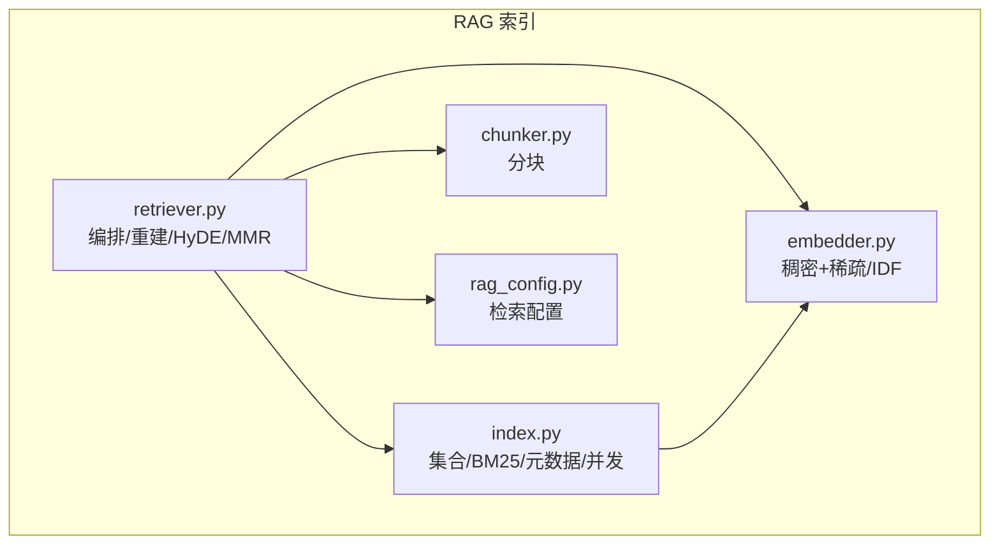
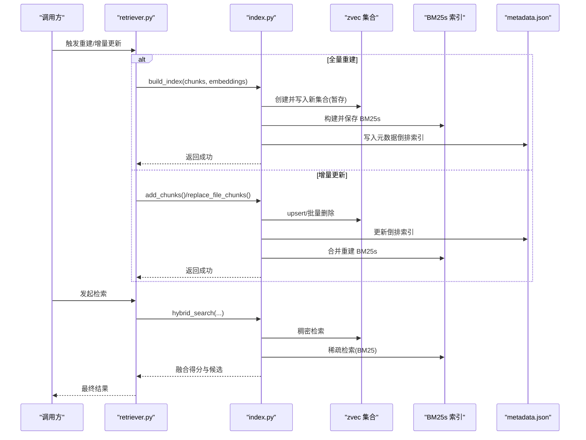
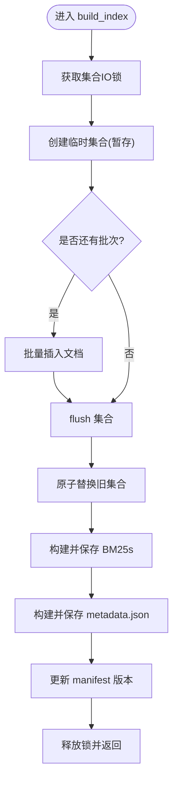
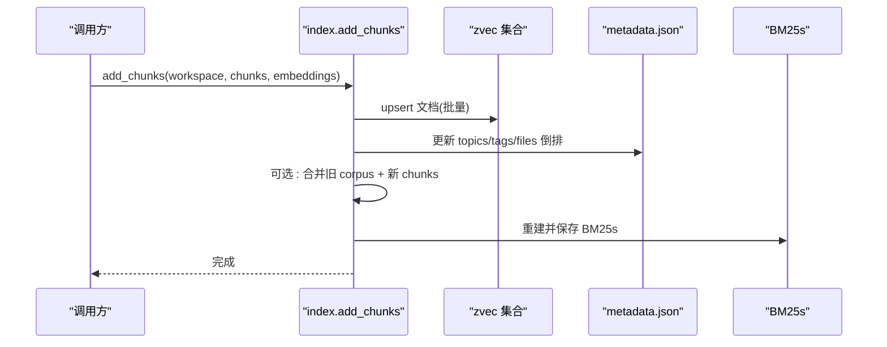
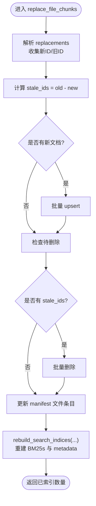
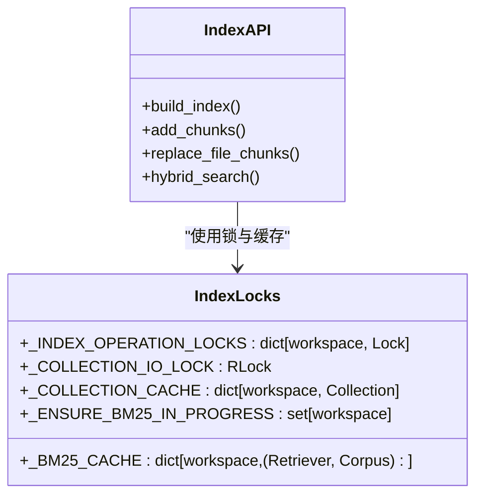
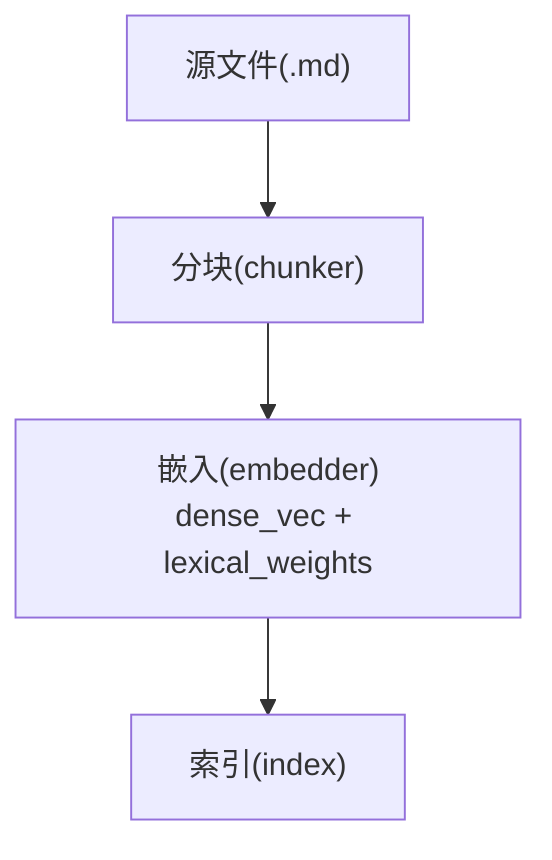
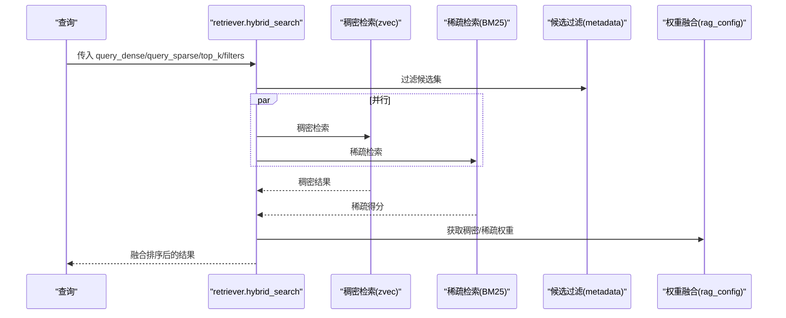
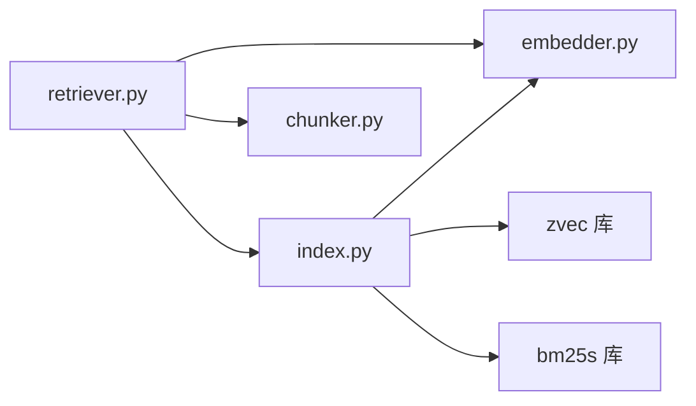

# 索引构建与更新

<cite>
**本文引用的文件**   
- [index.py](file://python/sidecar/rag/index.py)
- [chunker.py](file://python/sidecar/rag/chunker.py)
- [embedder.py](file://python/sidecar/rag/embedder.py)
- [retriever.py](file://python/sidecar/rag/retriever.py)
- [rag_config.py](file://python/sidecar/rag/rag_config.py)
- [test_rag_index.py](file://tests/unit/test_rag_index.py)
</cite>

## 目录
1. [简介](#简介)
2. [项目结构](#项目结构)
3. [核心组件](#核心组件)
4. [架构总览](#架构总览)
5. [详细组件分析](#详细组件分析)
6. [依赖关系分析](#依赖关系分析)
7. [性能考量](#性能考量)
8. [故障排查指南](#故障排查指南)
9. [结论](#结论)
10. [附录](#附录)

## 简介
本技术文档聚焦于 RAG 索引的构建与更新机制，围绕以下关键能力展开：
- 全量索引构建流程 build_index()：分块处理、向量嵌入生成、zvec 集合创建与写入、BM25s 索引构建、元数据倒排索引维护。
- 增量更新机制 add_chunks()：文档 upsert、元数据倒排索引维护、BM25s 合并重建策略。
- 文件替换 replace_file_chunks()：原子性操作（新旧 ID 对比、批量删除、索引重建）。
- 并发控制：工作区级锁、集合 IO 锁、线程安全保证。
- 性能优化建议：批处理大小调优、内存管理与磁盘 I/O 优化。

## 项目结构
RAG 索引相关代码主要位于 sidecar/rag 子模块中，核心文件职责如下：
- index.py：索引持久化与检索入口，包含 zvec 集合管理、BM25s 索引、元数据倒排索引、混合检索、并发控制等。
- chunker.py：基于标题与段落切分的分块器，输出带 id/content/topic/tags/section_title/file_path 的结构化片段。
- embedder.py：稠密向量与稀疏权重生成，全局 IDF 计算与缓存。
- retriever.py：上层编排（扫描文件、增量/全量重建、HyDE、MMR、重排序），调用 index 层进行检索。
- rag_config.py：运行时检索配置（top_k、HyDE 阈值、重排序开关、稠密/稀疏融合权重）。
- tests/unit/test_rag_index.py：索引行为与并发控制的单元测试。

图表来源
- [index.py:1-120](file://python/sidecar/rag/index.py#L1-L120)
- [chunker.py:1-60](file://python/sidecar/rag/chunker.py#L1-L60)
- [embedder.py:1-80](file://python/sidecar/rag/embedder.py#L1-L80)
- [retriever.py:1-60](file://python/sidecar/rag/retriever.py#L1-L60)
- [rag_config.py:1-64](file://python/sidecar/rag/rag_config.py#L1-L64)

章节来源
- [index.py:1-120](file://python/sidecar/rag/index.py#L1-L120)
- [chunker.py:1-60](file://python/sidecar/rag/chunker.py#L1-L60)
- [embedder.py:1-80](file://python/sidecar/rag/embedder.py#L1-L80)
- [retriever.py:1-60](file://python/sidecar/rag/retriever.py#L1-L60)
- [rag_config.py:1-64](file://python/sidecar/rag/rag_config.py#L1-L64)

## 核心组件
- 索引存储与检索
  - zvec 集合：稠密向量 + 字段（content、file_path、topic、tags_json、section_title）；HNSW 索引用于近似最近邻搜索。
  - BM25s 索引：词项倒排与评分，支持中文停用词过滤。
  - 元数据倒排索引：topics/tags/files 到 chunk_id 的映射，用于快速过滤候选集。
- 并发与一致性
  - 工作区级写锁：同一工作区串行化索引写入，避免多进程并发 commit 冲突。
  - 集合 IO 锁：保护 zvec 集合打开/关闭与缓存命中路径。
  - BM25 加载锁：防止重复加载与竞态重建。
- 嵌入与分块
  - 分块器按 ## 和 ### 标题分段，再按段落/表格/代码块切分，保持重叠上下文。
  - 稠密向量由 fastembed 模型生成，稀疏权重由 jieba 分词 + IDF 计算得到。

章节来源
- [index.py:148-166](file://python/sidecar/rag/index.py#L148-L166)
- [index.py:487-500](file://python/sidecar/rag/index.py#L487-L500)
- [index.py:407-431](file://python/sidecar/rag/index.py#L407-L431)
- [index.py:42-61](file://python/sidecar/rag/index.py#L42-L61)
- [chunker.py:11-42](file://python/sidecar/rag/chunker.py#L11-L42)
- [embedder.py:334-356](file://python/sidecar/rag/embedder.py#L334-L356)

## 架构总览
下图展示从“文件变更”到“检索结果”的整体链路，以及索引构建与更新的分支路径。

图表来源
- [retriever.py:459-627](file://python/sidecar/rag/retriever.py#L459-L627)
- [index.py:502-581](file://python/sidecar/rag/index.py#L502-L581)
- [index.py:596-644](file://python/sidecar/rag/index.py#L596-L644)
- [index.py:646-702](file://python/sidecar/rag/index.py#L646-L702)
- [index.py:961-1028](file://python/sidecar/rag/index.py#L961-L1028)

## 详细组件分析

### 全量索引构建 build_index()
- 输入：chunks 列表与对应 embeddings 列表。
- 步骤概览：
  1) 在集合 IO 锁内，使用临时目录创建新的 zvec 集合，分批插入文档，flush 后原子替换旧集合。
  2) 构建 BM25s 索引（分词、索引、落盘）。
  3) 构建 metadata.json 倒排索引（topics/tags/files -> chunk_ids）。
  4) 更新 manifest 版本信息。
- 并发与一致性：
  - 使用 _COLLECTION_IO_LOCK 保护集合生命周期与缓存。
  - 通过 staging/backup 目录实现原子替换，失败时回滚至备份。
- 复杂度与性能：
  - 插入批次大小由 _INDEX_BATCH_SIZE 控制，避免单次请求过大。
  - flush 后释放句柄并 GC，降低内存占用。
  - BM25s 构建与保存为 O(N log N) 级别（受分词与倒排构建影响）。

图表来源
- [index.py:502-581](file://python/sidecar/rag/index.py#L502-L581)

章节来源
- [index.py:502-581](file://python/sidecar/rag/index.py#L502-L581)
- [index.py:584-594](file://python/sidecar/rag/index.py#L584-L594)

### 增量更新 add_chunks()
- 功能：对新增或更新的 chunks 执行 upsert，并同步更新元数据倒排索引。
- BM25s 合并重建策略：
  - 若已有 BM25s 索引，则加载旧 corpus，将新 chunks 以 id 覆盖合并，再整体重建 BM25s。
  - 若不存在 BM25s，则直接基于新 corpus 构建。
- 并发与一致性：
  - 在集合 IO 锁内完成 zvec upsert 与 metadata 持久化。
  - BM25s 重建在锁外执行，避免阻塞后续读取。

图表来源
- [index.py:596-644](file://python/sidecar/rag/index.py#L596-L644)

章节来源
- [index.py:596-644](file://python/sidecar/rag/index.py#L596-L644)

### 文件替换 replace_file_chunks()
- 目标：针对一个或多个文件的 chunks 进行“先增后删”的原子性替换。
- 流程要点：
  1) 解析 replacements，收集新 chunks 与旧 chunks 的 ID 集合。
  2) 计算 stale_ids = old_ids - new_ids。
  3) 先 upsert 新文档，再批量删除 stale_ids。
  4) 更新 manifest 中每个文件的 mtime/size/chunks 列表。
  5) 基于当前所有 chunk ids 重建 BM25s 与 metadata。
- 并发与一致性：
  - 在集合 IO 锁内完成 zvec 写入与删除，确保中间状态不被外部观察到。
  - 失败不会破坏既有索引（因为先增后删）。

图表来源
- [index.py:646-702](file://python/sidecar/rag/index.py#L646-L702)
- [index.py:1084-1137](file://python/sidecar/rag/index.py#L1084-L1137)

章节来源
- [index.py:646-702](file://python/sidecar/rag/index.py#L646-L702)
- [index.py:1084-1137](file://python/sidecar/rag/index.py#L1084-L1137)

### 并发控制机制
- 工作区级写锁 index_operation：
  - 每个 workspace 独立锁实例，串行化索引写入，避免并发 commit 导致的不一致。
- 集合 IO 锁 _COLLECTION_IO_LOCK：
  - 保护集合打开/关闭、缓存命中、批量写入与删除。
- 集合句柄缓存与清理：
  - 按 workspace 缓存 zvec.Collection 句柄，减少 open 开销；提供 clear_collection_cache 强制释放。
- BM25 加载锁与去抖：
  - _BM25_CACHE 与 _ENSURE_BM25_IN_PROGRESS 避免重复加载与并发重建。

图表来源
- [index.py:42-61](file://python/sidecar/rag/index.py#L42-L61)
- [index.py:67-79](file://python/sidecar/rag/index.py#L67-L79)
- [index.py:255-284](file://python/sidecar/rag/index.py#L255-L284)
- [index.py:824-843](file://python/sidecar/rag/index.py#L824-L843)

章节来源
- [index.py:42-61](file://python/sidecar/rag/index.py#L42-L61)
- [index.py:67-79](file://python/sidecar/rag/index.py#L67-L79)
- [index.py:255-284](file://python/sidecar/rag/index.py#L255-L284)
- [index.py:824-843](file://python/sidecar/rag/index.py#L824-L843)

### 分块与嵌入（上游依赖）
- 分块器 chunker：
  - 基于 ## 与 ### 标题分段，再按段落/表格/代码块切分，保留 section_title 层级。
  - 输出 chunk.id 由 file_path + section_title + content 前缀哈希生成，具备稳定性。
- 嵌入器 embedder：
  - 稠密向量：fastembed TextEmbedding，默认维度 512。
  - 稀疏权重：jieba 分词 + 全局 IDF（首次全量构建时计算并持久化）。
  - encode_documents 返回每段 dense_vec 与 lexical_weights。

图表来源
- [chunker.py:11-42](file://python/sidecar/rag/chunker.py#L11-L42)
- [chunker.py:153-162](file://python/sidecar/rag/chunker.py#L153-L162)
- [embedder.py:334-356](file://python/sidecar/rag/embedder.py#L334-L356)
- [embedder.py:258-284](file://python/sidecar/rag/embedder.py#L258-L284)

章节来源
- [chunker.py:11-42](file://python/sidecar/rag/chunker.py#L11-L42)
- [chunker.py:153-162](file://python/sidecar/rag/chunker.py#L153-L162)
- [embedder.py:334-356](file://python/sidecar/rag/embedder.py#L334-L356)
- [embedder.py:258-284](file://python/sidecar/rag/embedder.py#L258-L284)

### 检索与混合融合
- 混合检索 hybrid_search：
  - 并行执行稠密检索（zvec HNSW）与稀疏检索（BM25s）。
  - 根据配置动态调整 top_k 与候选规模，并对稀疏分数归一化后加权融合。
- 过滤候选：
  - 基于 metadata.json 的 topics/tags/files 倒排索引快速缩小候选集。
- HyDE/MMR/重排序：
  - retriever 层在 index 之上进行查询扩展、去重与重排序，提升相关性。

图表来源
- [index.py:961-1028](file://python/sidecar/rag/index.py#L961-L1028)
- [rag_config.py:57-64](file://python/sidecar/rag/rag_config.py#L57-L64)

章节来源
- [index.py:961-1028](file://python/sidecar/rag/index.py#L961-L1028)
- [rag_config.py:57-64](file://python/sidecar/rag/rag_config.py#L57-L64)

## 依赖关系分析
- 模块耦合
  - retriever 依赖 index 与 embedder，负责编排与用户侧接口。
  - index 依赖 zvec/bm25s 底层库，并提供并发控制与持久化。
  - chunker 与 embedder 为上游数据处理与特征工程。
- 外部依赖
  - zvec：稠密向量集合与 HNSW 索引。
  - bm25s：稀疏词项倒排与检索。
  - fastembed/jieba：稠密向量与稀疏权重计算。
- 潜在循环依赖
  - 当前设计分层清晰，未见循环导入；retriever 仅在需要时 import index/embedder。

图表来源
- [retriever.py:1-60](file://python/sidecar/rag/retriever.py#L1-L60)
- [index.py:1-40](file://python/sidecar/rag/index.py#L1-L40)
- [embedder.py:1-40](file://python/sidecar/rag/embedder.py#L1-L40)
- [chunker.py:1-20](file://python/sidecar/rag/chunker.py#L1-L20)

章节来源
- [retriever.py:1-60](file://python/sidecar/rag/retriever.py#L1-L60)
- [index.py:1-40](file://python/sidecar/rag/index.py#L1-L40)
- [embedder.py:1-40](file://python/sidecar/rag/embedder.py#L1-L40)
- [chunker.py:1-20](file://python/sidecar/rag/chunker.py#L1-L20)

## 性能考量
- 批处理大小调优
  - 写入批次 _INDEX_BATCH_SIZE=128，适合大多数场景；可根据硬件与数据分布适当增大以提升吞吐。
  - 批量拉取 _FETCH_BATCH_SIZE=256，用于 rebuild_search_indices 与全局 IDF 构建。
- 内存管理
  - 集合句柄缓存避免频繁 open；必要时调用 clear_collection_cache 释放。
  - 构建完成后及时 flush 并释放句柄，配合 gc.collect() 降低峰值内存。
- 磁盘 I/O 优化
  - 全量构建采用 staging/backup 原子替换，减少中间态读写干扰。
  - BM25s 与 metadata.json 均使用 tmp+rename 原子落盘，避免部分写入导致的损坏。
- 并发与锁粒度
  - 工作区级写锁避免多进程并发 commit；集合 IO 锁保护共享资源访问。
  - BM25 加载缓存与 ensure_bm25_index 的去抖，避免重复加载与重建。
- 检索性能
  - 混合检索并行执行，利用 ThreadPoolExecutor 提高吞吐。
  - 候选过滤基于倒排索引，显著缩小搜索空间。
  - 可通过 rag_config 调整稠密/稀疏权重与 top_k，平衡精度与延迟。

章节来源
- [index.py:36-41](file://python/sidecar/rag/index.py#L36-L41)
- [index.py:502-581](file://python/sidecar/rag/index.py#L502-L581)
- [index.py:1084-1137](file://python/sidecar/rag/index.py#L1084-L1137)
- [index.py:287-310](file://python/sidecar/rag/index.py#L287-L310)
- [rag_config.py:21-28](file://python/sidecar/rag/rag_config.py#L21-L28)
- [rag_config.py:57-64](file://python/sidecar/rag/rag_config.py#L57-L64)

## 故障排查指南
- 索引文件被占用
  - 现象：打开集合时报错提示 lock 或被占用。
  - 处理：等待其他进程释放；必要时重启应用或调用 clear_collection_cache 释放句柄。
- BM25 缺失或不一致
  - 现象：检索时 BM25 不可用或为空。
  - 处理：调用 ensure_bm25_index 自动重建；检查 bm25s 目录是否存在且非空。
- 版本不匹配
  - 现象：manifest 版本与当前 schema_version 不一致。
  - 处理：系统会自动重建集合与 BM25s；确认 _INDEX_VERSION 与持久化版本一致。
- 计数不一致
  - 现象：metadata 与 collection 统计的 chunk 数不一致。
  - 处理：优先以 collection 为准；必要时调用 rebuild_search_indices 修复。
- 测试验证
  - 参考单元测试用例，验证构建、搜索、缓存复用与锁重试等行为。

章节来源
- [index.py:169-190](file://python/sidecar/rag/index.py#L169-L190)
- [index.py:255-284](file://python/sidecar/rag/index.py#L255-L284)
- [index.py:792-822](file://python/sidecar/rag/index.py#L792-L822)
- [index.py:336-359](file://python/sidecar/rag/index.py#L336-L359)
- [test_rag_index.py:264-399](file://tests/unit/test_rag_index.py#L264-L399)

## 结论
该 RAG 索引子系统通过 zvec 稠密向量与 BM25s 稀疏检索的混合方案，结合稳定的分块与嵌入管线，提供了高可用、可扩展的知识检索能力。其并发控制与原子性写入策略确保了在高并发与异常场景下的数据一致性。通过合理的批处理与缓存策略，系统在吞吐与延迟之间取得良好平衡。建议在大规模数据场景下进一步评估批大小与内存上限，并结合业务需求微调检索权重与 top_k。

## 附录
- 关键常量与配置
  - 稠密维度：512
  - 稠密度量：余弦相似度
  - BM25 参数：k1=1.5, b=0.75
  - 默认稠密权重：0.7（可通过配置调整）
- 重要函数路径
  - 全量构建：build_index
  - 增量更新：add_chunks
  - 文件替换：replace_file_chunks
  - 混合检索：hybrid_search
  - 重建检索索引：rebuild_search_indices
  - 确保 BM25 存在：ensure_bm25_index

章节来源
- [index.py:31-41](file://python/sidecar/rag/index.py#L31-L41)
- [rag_config.py:57-64](file://python/sidecar/rag/rag_config.py#L57-L64)
- [index.py:502-581](file://python/sidecar/rag/index.py#L502-L581)
- [index.py:596-644](file://python/sidecar/rag/index.py#L596-L644)
- [index.py:646-702](file://python/sidecar/rag/index.py#L646-L702)
- [index.py:961-1028](file://python/sidecar/rag/index.py#L961-L1028)
- [index.py:1084-1137](file://python/sidecar/rag/index.py#L1084-L1137)
- [index.py:792-822](file://python/sidecar/rag/index.py#L792-L822)