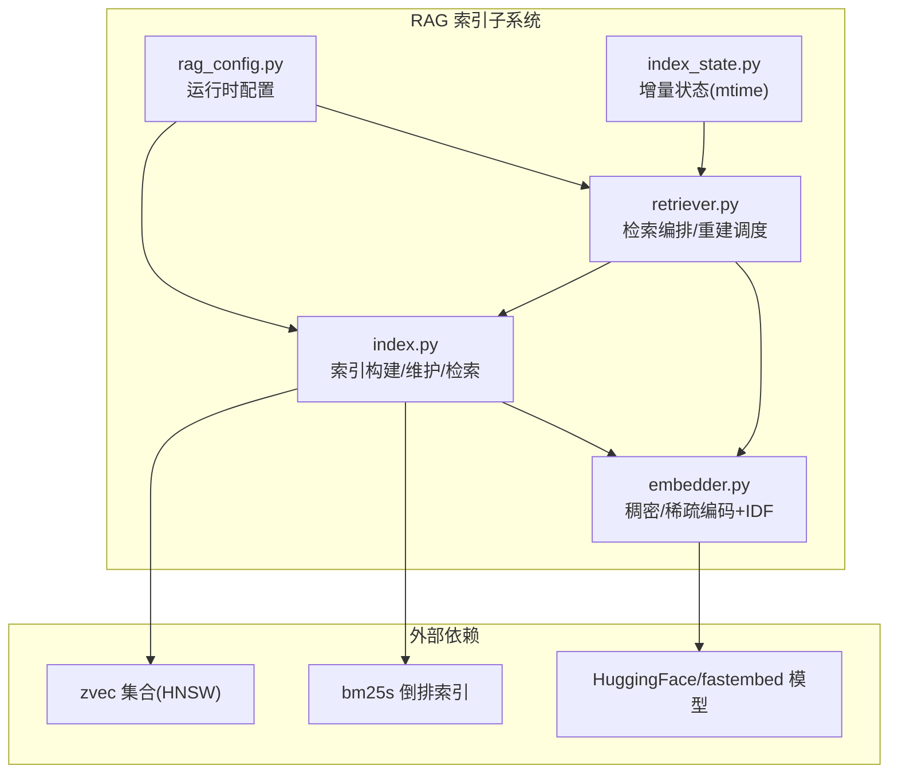
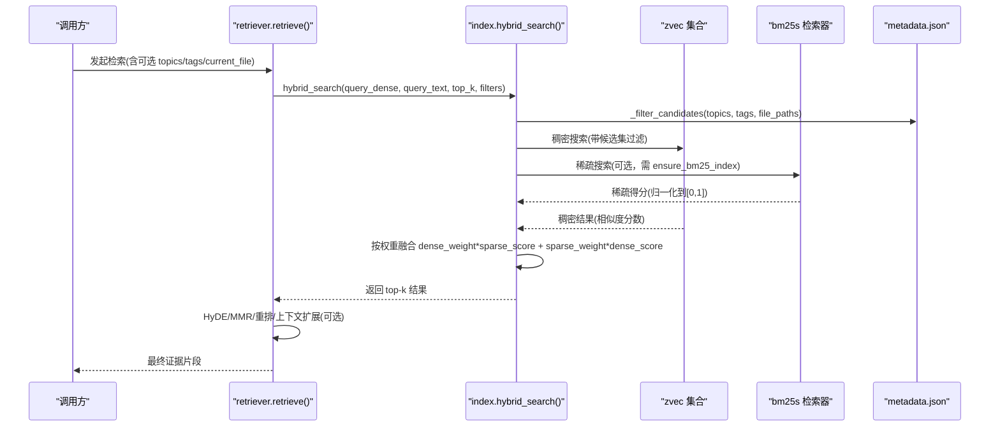
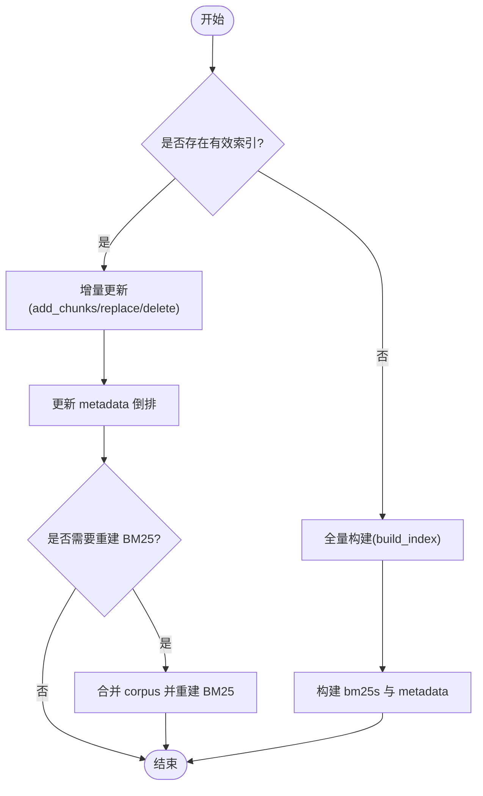
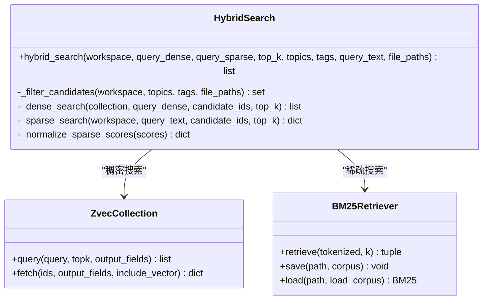
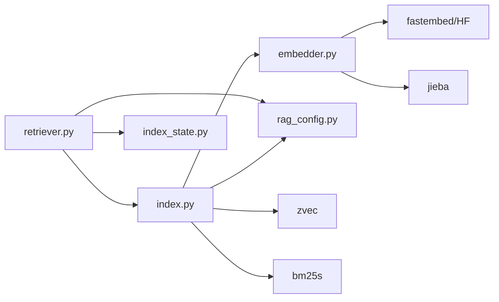
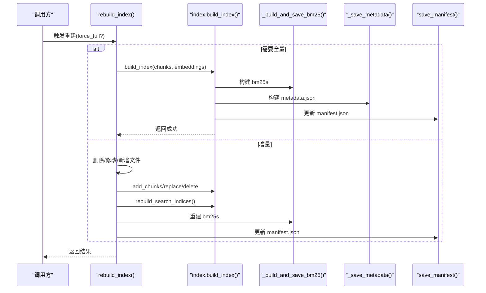
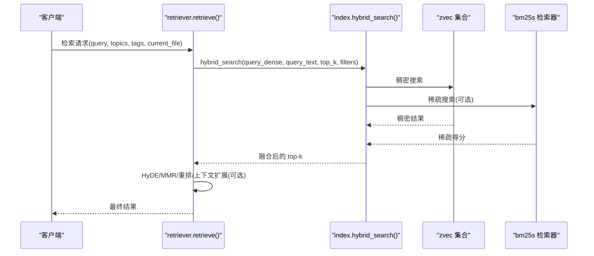

# 索引管理器

<cite>
**本文引用的文件**   
- [index.py](file://python/sidecar/rag/index.py)
- [retriever.py](file://python/sidecar/rag/retriever.py)
- [embedder.py](file://python/sidecar/rag/embedder.py)
- [rag_config.py](file://python/sidecar/rag/rag_config.py)
- [index_state.py](file://python/sidecar/rag/index_state.py)
- [test_rag_index.py](file://tests/unit/test_rag_index.py)
</cite>

## 目录
1. [简介](#简介)
2. [项目结构](#项目结构)
3. [核心组件](#核心组件)
4. [架构总览](#架构总览)
5. [详细组件分析](#详细组件分析)
6. [依赖关系分析](#依赖关系分析)
7. [性能与存储优化](#性能与存储优化)
8. [故障排查指南](#故障排查指南)
9. [结论](#结论)
10. [附录：关键流程时序图](#附录关键流程时序图)

## 简介
本技术文档围绕 RAG 索引管理器，系统性阐述向量索引的构建与维护机制（增量更新 vs 全量重建）、索引状态管理、集合操作、混合检索实现（稠密向量 zvec + 稀疏向量 bm25s）、索引文件组织结构、manifest 元数据管理、全局 IDF 计算、并发控制与锁机制、损坏检测与修复策略，以及性能调优、存储空间管理与备份恢复建议。

## 项目结构
RAG 索引相关代码位于 sidecar.rag 子模块中，核心文件如下：
- index.py：索引构建、维护、查询入口；zvec 集合与 bm25s 索引协调；元数据与 manifest 管理；并发控制与缓存。
- retriever.py：检索编排（HyDE、MMR、重排序）；增量/全量重建调度；文件扫描与 chunk 并行处理。
- embedder.py：稠密向量模型加载与推理；稀疏权重计算；全局 IDF 持久化。
- rag_config.py：运行时配置（top_k、HyDE、重排开关与阈值、稠密/稀疏权重）。
- index_state.py：按文件 mtime 的增量判断与状态持久化。
- test_rag_index.py：单元测试覆盖索引构建、候选过滤、BM25 就绪性、集合缓存等。

图表来源
- [index.py:1-120](file://python/sidecar/rag/index.py#L1-L120)
- [retriever.py:1-120](file://python/sidecar/rag/retriever.py#L1-L120)
- [embedder.py:1-120](file://python/sidecar/rag/embedder.py#L1-L120)
- [rag_config.py:1-64](file://python/sidecar/rag/rag_config.py#L1-L64)
- [index_state.py:1-102](file://python/sidecar/rag/index_state.py#L1-L102)

章节来源
- [index.py:1-120](file://python/sidecar/rag/index.py#L1-L120)
- [retriever.py:1-120](file://python/sidecar/rag/retriever.py#L1-L120)
- [embedder.py:1-120](file://python/sidecar/rag/embedder.py#L1-L120)
- [rag_config.py:1-64](file://python/sidecar/rag/rag_config.py#L1-L64)
- [index_state.py:1-102](file://python/sidecar/rag/index_state.py#L1-L102)

## 核心组件
- 索引构建与维护
  - 全量构建：build_index() 在临时目录写入新集合，成功后原子替换旧集合；同时重建 bm25s 与 metadata.json。
  - 增量更新：add_chunks() 将新块 upsert 到现有集合，并合并 corpus 重建 bm25s；replace_file_chunks() 支持批量替换文件块。
  - 删除：delete_by_file() 基于 file_path 过滤删除，并重建 bm25s。
- 检索
  - hybrid_search() 并发执行稠密搜索(zvec)与稀疏搜索(bm25s)，按权重融合得分，返回 top-k。
  - retriever.retrieve() 负责 HyDE、MMR、重排序、上下文扩展与去重等上层逻辑。
- 元数据与清单
  - metadata.json：主题/标签/文件的倒排索引，用于候选集快速过滤。
  - file_manifest.json：记录每个文件的 mtime/size/chunks 列表，用于增量判断与一致性校验。
  - manifest.json：索引版本与重建时间戳，用于 schema 版本兼容与重建触发。
- 全局 IDF
  - global_idf.json：由所有分块文本计算词频-逆文档频率，供稀疏权重计算使用。
- 并发与缓存
  - 集合句柄缓存、BM25 检索器缓存、线程池并行、工作区级写锁与 IO 锁。

章节来源
- [index.py:502-582](file://python/sidecar/rag/index.py#L502-L582)
- [index.py:596-702](file://python/sidecar/rag/index.py#L596-L702)
- [index.py:704-774](file://python/sidecar/rag/index.py#L704-L774)
- [index.py:961-1029](file://python/sidecar/rag/index.py#L961-L1029)
- [retriever.py:102-196](file://python/sidecar/rag/retriever.py#L102-L196)
- [embedder.py:258-285](file://python/sidecar/rag/embedder.py#L258-L285)

## 架构总览
RAG 索引子系统采用“稠密+稀疏”双路检索架构：
- 稠密侧：zvec 集合（HNSW），存储 512 维向量与字段（content、file_path、topic、tags_json、section_title）。
- 稀疏侧：bm25s 倒排索引，基于 jieba 分词与全局 IDF 计算 TF*IDF 权重。
- 融合层：hybrid_weights() 提供可配置的稠密/稀疏权重，对两路结果进行归一化与加权求和。
- 元数据层：metadata.json 提供 topic/tag/file 倒排，用于候选集裁剪；file_manifest.json 记录文件级变更；manifest.json 记录索引版本。

图表来源
- [retriever.py:102-196](file://python/sidecar/rag/retriever.py#L102-L196)
- [index.py:961-1029](file://python/sidecar/rag/index.py#L961-L1029)
- [index.py:925-959](file://python/sidecar/rag/index.py#L925-L959)
- [index.py:824-844](file://python/sidecar/rag/index.py#L824-L844)

## 详细组件分析

### 索引文件组织与元数据
- 目录结构（以 workspace 为根）
  - {workspace}/.../{WORKSPACE_APP_FOLDER}/{RAG_INDEX_FOLDER}/
    - zvec_collection/：zvec 集合数据（HNSW 索引与 RocksDB 底层）
    - bm25s/：bm25s 序列化索引及 corpus
    - metadata.json：主题/标签/文件倒排索引
    - file_manifest.json：文件清单（mtime/size/chunks）
    - manifest.json：索引版本与重建时间戳
    - global_idf.json：全局 IDF 表
- 清单与版本
  - manifest.json 包含 version/schema_version/last_rebuilt，用于 schema 升级时自动重建集合与 bm25s。
  - file_manifest.json 用于 is_index_up_to_date() 对比当前文件系统与已索引内容的一致性。
  - metadata.json 用于候选集过滤（topics/tags/files）。

章节来源
- [index.py:81-103](file://python/sidecar/rag/index.py#L81-L103)
- [index.py:108-146](file://python/sidecar/rag/index.py#L108-L146)
- [index.py:381-405](file://python/sidecar/rag/index.py#L381-L405)
- [index.py:1057-1082](file://python/sidecar/rag/index.py#L1057-L1082)
- [retriever.py:362-385](file://python/sidecar/rag/retriever.py#L362-L385)

### 索引构建与维护
- 全量构建 build_index()
  - 在 staging 目录创建新集合，分批插入文档，flush 后原子 rename 替换旧集合；失败则回滚至 backup。
  - 随后重建 bm25s 与 metadata.json，最后 bump manifest 版本。
- 增量更新 add_chunks()
  - 将新块 upsert 到现有集合，更新 metadata 倒排，保存 metadata。
  - 若开启 rebuild_bm25s，则从磁盘加载旧 bm25s corpus，合并新块后重建。
- 文件替换 replace_file_chunks()
  - 先 upsert 新块，再删除旧块，最后重建搜索索引与 manifest，保证失败不破坏已有索引。
- 删除 delete_by_file()
  - 基于 file_path 过滤查询并删除对应 id，更新 metadata，重建 bm25s。

图表来源
- [index.py:502-582](file://python/sidecar/rag/index.py#L502-L582)
- [index.py:596-702](file://python/sidecar/rag/index.py#L596-L702)
- [index.py:704-774](file://python/sidecar/rag/index.py#L704-L774)

章节来源
- [index.py:502-582](file://python/sidecar/rag/index.py#L502-L582)
- [index.py:596-702](file://python/sidecar/rag/index.py#L596-L702)
- [index.py:704-774](file://python/sidecar/rag/index.py#L704-L774)

### 混合检索 hybrid_search()
- 候选集过滤：_filter_candidates() 根据 topics/tags/file_paths 从 metadata.json 获取候选 id 集合。
- 稠密搜索：_dense_search() 通过 zvec.Query 执行 HNSW 近似最近邻，返回相似度分数（cosine 距离转相似度）。
- 稀疏搜索：_sparse_search() 使用 bm25s 检索，返回原始 BM25 分数，随后 _normalize_sparse_scores() 归一化到 [0,1]。
- 权重融合：hybrid_weights() 返回 (dense_weight, sparse_weight)，默认稠密权重较高；最终 score = dense_weight * dense_score + sparse_weight * sparse_score。
- 稀疏独占命中：仅被稀疏命中的条目会 fetch 字段并赋予稀疏得分参与排序。

图表来源
- [index.py:961-1029](file://python/sidecar/rag/index.py#L961-L1029)
- [index.py:856-923](file://python/sidecar/rag/index.py#L856-L923)
- [index.py:846-854](file://python/sidecar/rag/index.py#L846-L854)
- [rag_config.py:57-64](file://python/sidecar/rag/rag_config.py#L57-L64)

章节来源
- [index.py:925-959](file://python/sidecar/rag/index.py#L925-L959)
- [index.py:856-923](file://python/sidecar/rag/index.py#L856-L923)
- [index.py:961-1029](file://python/sidecar/rag/index.py#L961-L1029)
- [rag_config.py:57-64](file://python/sidecar/rag/rag_config.py#L57-L64)

### 索引状态管理与增量判断
- index_state.py 维护 per-file mtime 状态，避免重复索引未变更文件。
- file_needs_index() 比较上次记录的 mtime 与当前 mtime，差异阈值 0.5s。
- mark_many_indexed() 原子写入状态文件，支持批量提交。
- 当辅助状态缺失时，可从 file_manifest.json 恢复。

章节来源
- [index_state.py:1-102](file://python/sidecar/rag/index_state.py#L1-L102)

### 全局 IDF 计算与稀疏权重
- 构建阶段：build_and_save_global_idf() 遍历全部分块，统计词频-逆文档频率，持久化为 global_idf.json。
- 查询阶段：encode_query()/encode_documents() 使用 jieba 分词，优先读取 global_idf.json，否则回退到批次内局部 IDF。
- 稀疏权重：TF*IDF 形式，未知词项使用中性权重。

章节来源
- [embedder.py:258-285](file://python/sidecar/rag/embedder.py#L258-L285)
- [embedder.py:173-224](file://python/sidecar/rag/embedder.py#L173-L224)
- [embedder.py:359-368](file://python/sidecar/rag/embedder.py#L359-L368)

### 并发控制、锁机制与损坏检测
- 并发控制
  - index_operation(workspace)：工作区级写锁，串行化完整索引操作，防止多进程并发 prepare/commit。
  - _COLLECTION_IO_LOCK：保护集合打开/关闭与缓存读写，避免长耗时重建阻塞状态查询。
  - _BM25_CACHE_LOCK/_ENSURE_BM25_LOCK：保护 BM25 缓存与重建标志。
  - ThreadPoolExecutor：稠密/稀疏搜索并行执行。
- 锁与损坏检测
  - _open_or_create_collection() 捕获 zvec 锁错误，尝试 GC 释放、清理 stale lock 并重试；超过重试次数抛出友好提示。
  - _remove_stale_lock() 明确不删除 RocksDB LOCK 零字节文件，避免绕过 OS 文件锁。
  - 版本不一致时自动销毁旧集合与 bm25s，重建新索引。
- 测试覆盖
  - 集合缓存复用、锁重试、clear_collection_cache 释放锁、移除 stale lock 行为、批大小限制等均有单测验证。

章节来源
- [index.py:67-79](file://python/sidecar/rag/index.py#L67-L79)
- [index.py:229-285](file://python/sidecar/rag/index.py#L229-L285)
- [index.py:287-311](file://python/sidecar/rag/index.py#L287-L311)
- [index.py:205-227](file://python/sidecar/rag/index.py#L205-L227)
- [test_rag_index.py:264-399](file://tests/unit/test_rag_index.py#L264-L399)

### 重建策略与一致性校验
- is_index_up_to_date()：对比当前文件集合与 file_manifest.json 的 mtime/size 与 chunks 数量，确保索引一致。
- rebuild_index()：优先尝试增量重建；若不满足条件则走全量重建路径。
- 增量重建流程：
  - 删除/修改文件：delete_by_file(..., rebuild_bm25s=False)
  - 并行分块与编码：_chunk_files_parallel() + encode_documents()
  - 追加新块：add_chunks(..., rebuild_bm25s=False)
  - 统一重建：rebuild_search_indices() 重建 metadata 与 bm25s；build_and_save_global_idf() 重建全局 IDF；save_manifest() 更新清单。

章节来源
- [retriever.py:362-385](file://python/sidecar/rag/retriever.py#L362-L385)
- [retriever.py:459-627](file://python/sidecar/rag/retriever.py#L459-L627)
- [index.py:1084-1137](file://python/sidecar/rag/index.py#L1084-L1137)

## 依赖关系分析
- 内部依赖
  - retriever.py 依赖 index.py 的构建/维护接口与 hybrid_search()。
  - index.py 依赖 embedder.py 的全局 IDF 与稀疏权重计算。
  - rag_config.py 为 index.py 与 retriever.py 提供运行时参数。
  - index_state.py 为增量判断提供 mtime 状态。
- 外部依赖
  - zvec：稠密向量集合与 HNSW 索引。
  - bm25s：稀疏倒排索引与检索。
  - fastembed/HF：稠密模型加载与缓存。
  - jieba：中文分词。

图表来源
- [retriever.py:1-120](file://python/sidecar/rag/retriever.py#L1-L120)
- [index.py:1-120](file://python/sidecar/rag/index.py#L1-L120)
- [embedder.py:1-120](file://python/sidecar/rag/embedder.py#L1-L120)
- [rag_config.py:1-64](file://python/sidecar/rag/rag_config.py#L1-L64)
- [index_state.py:1-102](file://python/sidecar/rag/index_state.py#L1-L102)

章节来源
- [retriever.py:1-120](file://python/sidecar/rag/retriever.py#L1-L120)
- [index.py:1-120](file://python/sidecar/rag/index.py#L1-L120)
- [embedder.py:1-120](file://python/sidecar/rag/embedder.py#L1-L120)
- [rag_config.py:1-64](file://python/sidecar/rag/rag_config.py#L1-L64)
- [index_state.py:1-102](file://python/sidecar/rag/index_state.py#L1-L102)

## 性能与存储优化
- 稠密搜索参数
  - ef 动态调整：ef=min(top_k * 8, 128)，平衡召回与延迟。
  - 批量插入：_INDEX_BATCH_SIZE=128，降低单次请求体积，避免后端限制。
- 稀疏搜索优化
  - BM25 检索器与 corpus 内存缓存，减少频繁磁盘加载。
  - 归一化稀疏分数到 [0,1]，稳定融合权重。
- 全局 IDF
  - 首次全量构建时生成 global_idf.json，后续查询直接使用，避免批次内 IDF 波动。
- 缓存策略
  - 集合句柄缓存：避免重复 open() 带来的 mmindex 重载开销。
  - BM25 缓存：跨查询复用，提升吞吐。
- 存储管理
  - 全量构建使用 staging/backup 目录，原子替换，失败回滚。
  - 定期清理 .tmp 文件，避免残留。
- 备份与恢复
  - 备份：复制 zvec_collection/、bm25s/、metadata.json、file_manifest.json、manifest.json、global_idf.json。
  - 恢复：将上述文件放回目标 workspace 对应目录，重启服务即可生效。
- 调优建议
  - 增大 _FETCH_BATCH_SIZE 可减少 fetch 往返，但需权衡内存占用。
  - 合理设置 rag_dense_weight，根据业务场景调整稠密/稀疏贡献。
  - 控制 top_k 与候选集规模，避免过大导致融合与后处理成本上升。

章节来源
- [index.py:36-41](file://python/sidecar/rag/index.py#L36-L41)
- [index.py:502-582](file://python/sidecar/rag/index.py#L502-L582)
- [index.py:824-844](file://python/sidecar/rag/index.py#L824-L844)
- [embedder.py:258-285](file://python/sidecar/rag/embedder.py#L258-L285)
- [rag_config.py:57-64](file://python/sidecar/rag/rag_config.py#L57-L64)

## 故障排查指南
- 索引文件被占用
  - 现象：打开集合时报锁错误。
  - 处理：等待其他实例退出或关闭进程；系统会自动清理无效锁并提示友好信息。
- BM25 不可用
  - 现象：ensure_bm25_index() 失败或 bm25s 目录为空。
  - 处理：调用 ensure_bm25_index() 从 zvec 重建；检查磁盘空间与权限。
- 版本不匹配
  - 现象：manifest.json 版本与当前 schema 不一致。
  - 处理：自动销毁旧集合与 bm25s，重建新索引。
- 计数不一致
  - 现象：metadata 与 collection 的 chunk 数不一致。
  - 处理：以 collection 为准，必要时调用 rebuild_search_indices() 同步。
- 模型加载失败
  - 现象：fastembed/HF 模型加载异常。
  - 处理：清除缓存目录重试；检查网络代理与镜像源。

章节来源
- [index.py:169-190](file://python/sidecar/rag/index.py#L169-L190)
- [index.py:229-285](file://python/sidecar/rag/index.py#L229-L285)
- [index.py:786-822](file://python/sidecar/rag/index.py#L786-L822)
- [index.py:336-360](file://python/sidecar/rag/index.py#L336-L360)
- [embedder.py:140-165](file://python/sidecar/rag/embedder.py#L140-L165)

## 结论
该索引管理器以 zvec+bmg25s 的双路检索为核心，结合 metadata 倒排与 file_manifest 一致性校验，实现了高效、可扩展的 RAG 索引体系。通过完善的并发控制、缓存策略与原子替换机制，系统在稳定性与性能之间取得良好平衡。全局 IDF 与可配置权重进一步提升了检索质量与灵活性。

## 附录：关键流程时序图

### 全量重建流程

图表来源
- [retriever.py:459-627](file://python/sidecar/rag/retriever.py#L459-L627)
- [index.py:502-582](file://python/sidecar/rag/index.py#L502-L582)
- [index.py:1084-1137](file://python/sidecar/rag/index.py#L1084-L1137)

### 混合检索流程

图表来源
- [retriever.py:102-196](file://python/sidecar/rag/retriever.py#L102-L196)
- [index.py:961-1029](file://python/sidecar/rag/index.py#L961-L1029)