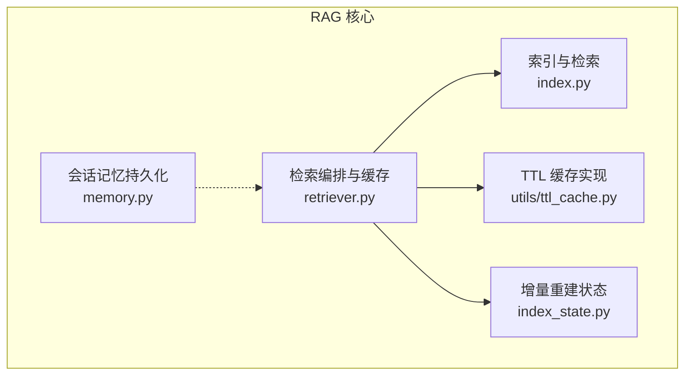
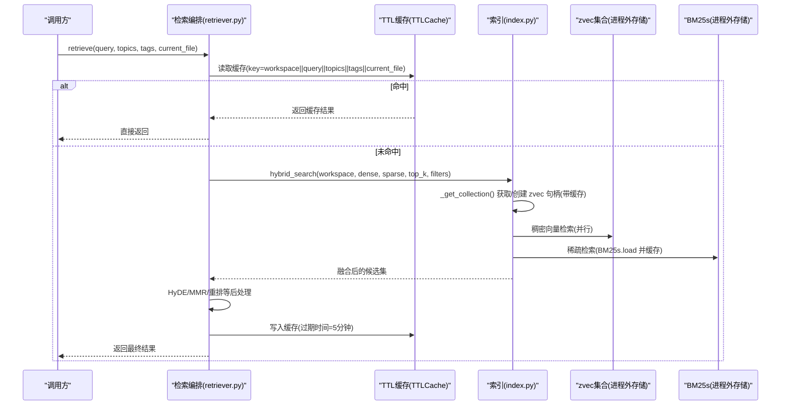
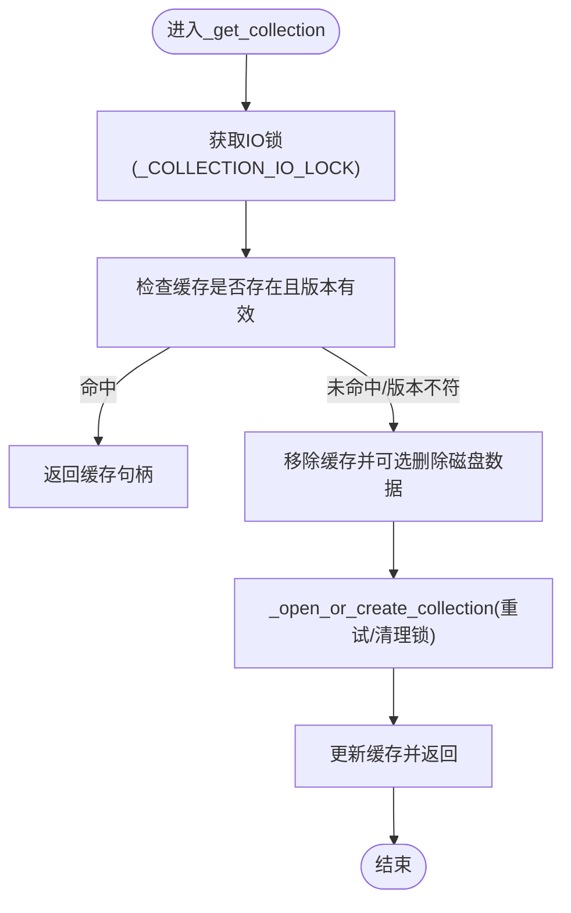
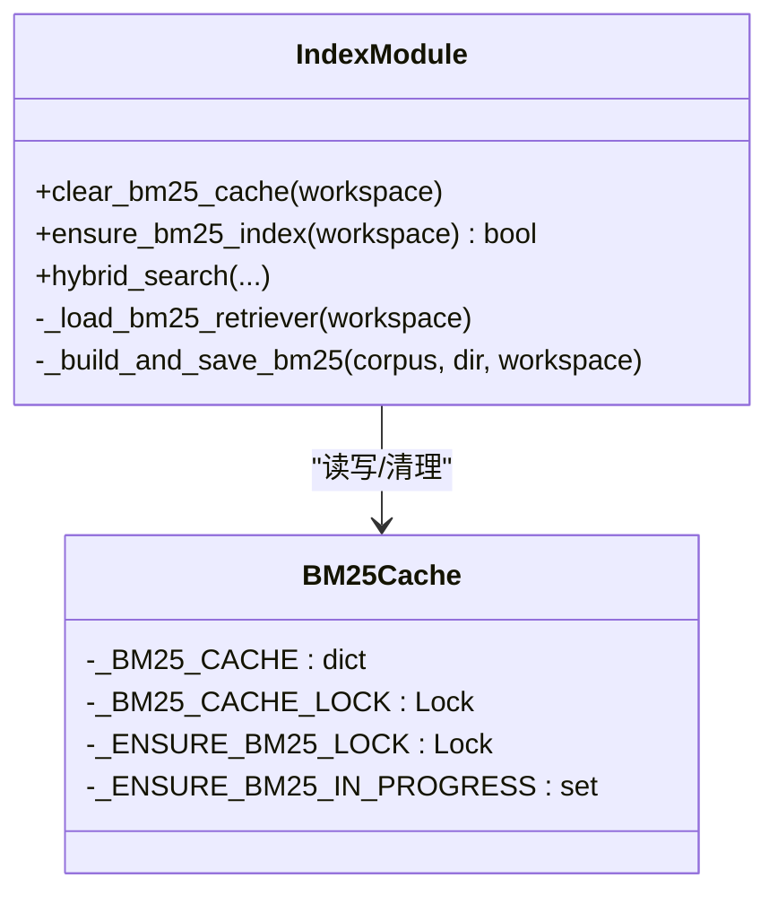
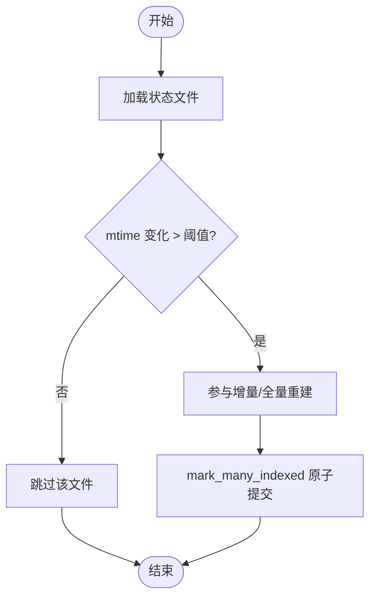
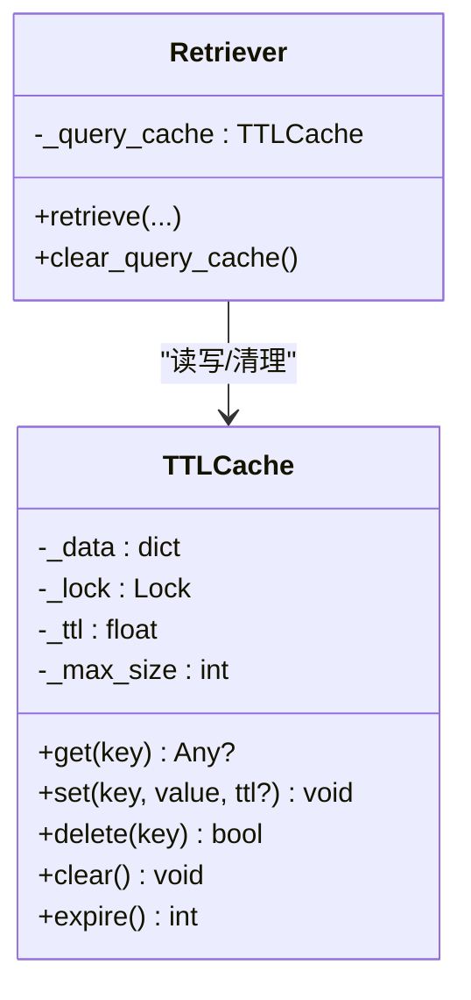
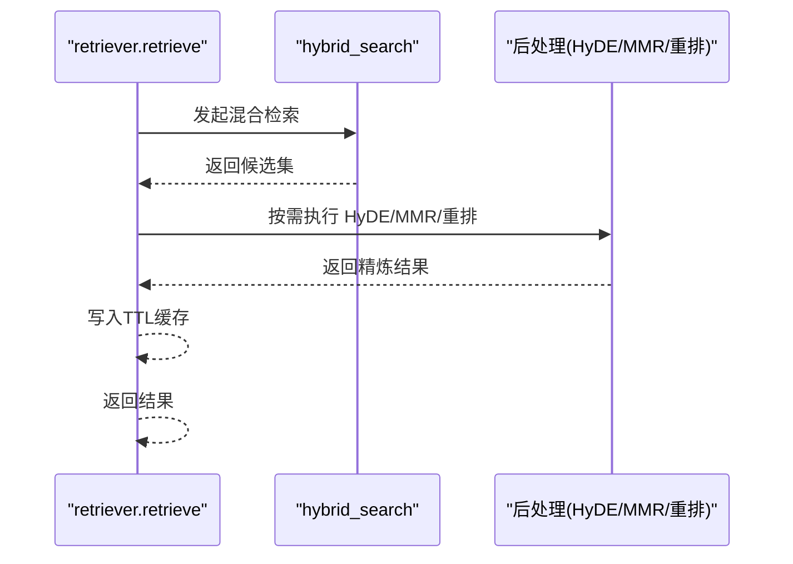
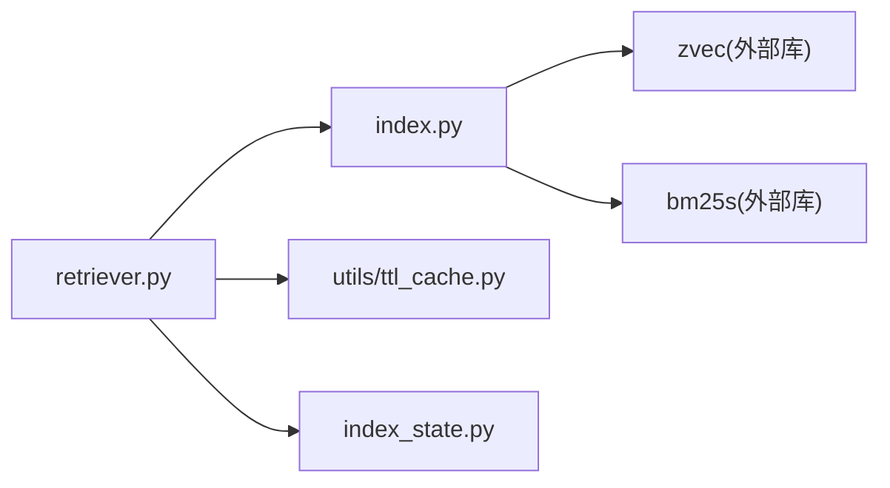

# 缓存与性能优化

<cite>
**本文引用的文件**
- [index.py](file://python/sidecar/rag/index.py)
- [retriever.py](file://python/sidecar/rag/retriever.py)
- [memory.py](file://python/sidecar/rag/memory.py)
- [index_state.py](file://python/sidecar/rag/index_state.py)
- [ttl_cache.py](file://utils/ttl_cache.py)
</cite>

## 目录
1. [简介](#简介)
2. [项目结构](#项目结构)
3. [核心组件](#核心组件)
4. [架构总览](#架构总览)
5. [详细组件分析](#详细组件分析)
6. [依赖关系分析](#依赖关系分析)
7. [性能考量](#性能考量)
8. [故障诊断指南](#故障诊断指南)
9. [结论](#结论)
10. [附录](#附录)

## 简介
本技术文档聚焦于 RAG 索引系统的缓存与性能优化，围绕多级缓存架构展开：zvec 集合句柄缓存、BM25s 检索器缓存、工作区级状态缓存（mtime 跟踪）以及查询结果 TTL 缓存。文档深入解释各层缓存的设计与实现、失效策略（版本变更检测、内存压力处理、自动清理）、并发访问控制（读写锁设计、死锁预防、资源竞争处理），并提供性能监控指标建议、调优指南与故障诊断方法。

## 项目结构
RAG 相关代码主要位于 sidecar/rag 模块中，配合 utils.ttl_cache 提供通用 TTL 缓存能力；index_state.py 维护工作区级增量重建所需的状态。

图表来源
- [index.py:44-61](file://python/sidecar/rag/index.py#L44-L61)
- [retriever.py:36-45](file://python/sidecar/rag/retriever.py#L36-L45)
- [index_state.py:13-20](file://python/sidecar/rag/index_state.py#L13-L20)
- [ttl_cache.py:8-24](file://utils/ttl_cache.py#L8-L24)

章节来源
- [index.py:1-120](file://python/sidecar/rag/index.py#L1-L120)
- [retriever.py:1-60](file://python/sidecar/rag/retriever.py#L1-L60)
- [index_state.py:1-30](file://python/sidecar/rag/index_state.py#L1-L30)
- [ttl_cache.py:1-30](file://utils/ttl_cache.py#L1-L30)

## 核心组件
- zvec 集合句柄缓存：按工作区缓存已打开的 zvec.Collection 句柄，避免重复 open 带来的 mmindex 重载开销；在版本不匹配时触发重建并替换缓存。
- BM25s 检索器缓存：进程内缓存 bm25s.BM25 实例及其 corpus，减少每次检索时的磁盘加载成本；构建或更新后主动清理旧缓存以保持一致性。
- 工作区级状态缓存：通过 index_state.json 记录每个文件的 mtime，用于增量重建判断，避免全量扫描和重建。
- 查询结果 TTL 缓存：对相同查询参数（含主题、标签、当前文件）的结果进行短时缓存，降低重复计算。

章节来源
- [index.py:44-61](file://python/sidecar/rag/index.py#L44-L61)
- [index.py:255-284](file://python/sidecar/rag/index.py#L255-L284)
- [index.py:824-843](file://python/sidecar/rag/index.py#L824-L843)
- [index_state.py:75-92](file://python/sidecar/rag/index_state.py#L75-L92)
- [retriever.py:36-45](file://python/sidecar/rag/retriever.py#L36-L45)

## 架构总览
下图展示从检索入口到多级缓存与底层索引的交互流程，包括并发执行与缓存命中路径。

图表来源
- [retriever.py:102-196](file://python/sidecar/rag/retriever.py#L102-L196)
- [index.py:961-1028](file://python/sidecar/rag/index.py#L961-L1028)
- [index.py:255-284](file://python/sidecar/rag/index.py#L255-L284)
- [index.py:824-843](file://python/sidecar/rag/index.py#L824-L843)
- [ttl_cache.py:26-45](file://utils/ttl_cache.py#L26-L45)

## 详细组件分析

### 组件一：zvec 集合句柄缓存与版本管理
- 设计要点
  - 按工作区缓存 zvec.Collection 句柄，避免频繁 open 导致的 mmindex 重载。
  - 使用 manifest 中的 version/schema_version 字段进行版本一致性校验；不匹配则销毁旧数据并重建。
  - 提供 clear_collection_cache 接口释放句柄但不删除磁盘数据，便于内存压力场景下的快速回收。
- 并发与锁
  - _COLLECTION_IO_LOCK 保护 IO 关键路径（打开、重建、替换）。
  - _COLLECTION_CACHE_LOCK 保护缓存字典读写。
  - _INDEX_OPERATION_LOCKS 保证同一工作区的写操作串行化，防止并发 prepare/commit 导致不一致。
- 失效策略
  - 版本变更：_manifest_version_ok 检查失败时，删除本地 zvec 与 BM25s 目录，重建索引。
  - 锁冲突：_open_or_create_collection 遇到“被占用”错误时，尝试 GC 与强制释放后再重试，必要时抛出友好提示。
- 性能影响
  - 显著降低大索引下重复 open 的延迟；批量插入与 flush 结合提升吞吐。

图表来源
- [index.py:255-284](file://python/sidecar/rag/index.py#L255-L284)
- [index.py:229-253](file://python/sidecar/rag/index.py#L229-L253)
- [index.py:132-146](file://python/sidecar/rag/index.py#L132-L146)
- [index.py:169-189](file://python/sidecar/rag/index.py#L169-L189)

章节来源
- [index.py:44-61](file://python/sidecar/rag/index.py#L44-L61)
- [index.py:255-284](file://python/sidecar/rag/index.py#L255-L284)
- [index.py:287-311](file://python/sidecar/rag/index.py#L287-L311)
- [index.py:105-146](file://python/sidecar/rag/index.py#L105-L146)

### 组件二：BM25s 检索器缓存与重建
- 设计要点
  - 进程内缓存 (retriever, corpus)，避免每次检索都从磁盘 load。
  - 构建或更新 BM25s 后主动清理对应工作区的缓存，确保一致性。
  - ensure_bm25_index 提供幂等保障：若缺失但存在向量数据，则从 metadata/zvec 重建。
- 并发与锁
  - _BM25_CACHE_LOCK 保护缓存读写。
  - _ENSURE_BM25_LOCK + _ENSURE_BM25_IN_PROGRESS 防止同一工作区重复重建。
- 失效策略
  - 显式 clear_bm25_cache 可清空指定或全部工作区缓存。
  - 构建完成后调用 clear_bm25_cache 使新索引生效。
- 性能影响
  - 大幅降低检索阶段 BM25s 加载开销；合并 corpus 再重建减少多次 I/O。

图表来源
- [index.py:56-61](file://python/sidecar/rag/index.py#L56-L61)
- [index.py:287-294](file://python/sidecar/rag/index.py#L287-L294)
- [index.py:792-822](file://python/sidecar/rag/index.py#L792-L822)
- [index.py:824-843](file://python/sidecar/rag/index.py#L824-L843)
- [index.py:487-500](file://python/sidecar/rag/index.py#L487-L500)

章节来源
- [index.py:56-61](file://python/sidecar/rag/index.py#L56-L61)
- [index.py:792-822](file://python/sidecar/rag/index.py#L792-L822)
- [index.py:824-843](file://python/sidecar/rag/index.py#L824-L843)
- [index.py:487-500](file://python/sidecar/rag/index.py#L487-L500)

### 组件三：工作区级状态缓存（mtime 跟踪）
- 设计要点
  - 通过 rag_index_state.json 记录每个文件的 mtime，支持增量重建。
  - file_needs_index 比较 mtime 差值阈值，避免微小抖动导致重建。
  - mark_many_indexed 原子提交多个文件的索引完成状态。
- 失效策略
  - 当持久化写入失败时回退为普通写入，保证可用性。
  - 启动时可从旧的 file_manifest.json 恢复状态，避免误判所有文件为新。
- 性能影响
  - 增量重建仅处理变更文件，显著缩短重建时间。

图表来源
- [index_state.py:75-92](file://python/sidecar/rag/index_state.py#L75-L92)
- [index_state.py:22-49](file://python/sidecar/rag/index_state.py#L22-L49)
- [index_state.py:52-73](file://python/sidecar/rag/index_state.py#L52-L73)

章节来源
- [index_state.py:13-20](file://python/sidecar/rag/index_state.py#L13-L20)
- [index_state.py:75-92](file://python/sidecar/rag/index_state.py#L75-L92)
- [index_state.py:22-49](file://python/sidecar/rag/index_state.py#L22-L49)

### 组件四：查询结果 TTL 缓存
- 设计要点
  - 基于 TTLCache 实现线程安全的键值缓存，默认 TTL=300 秒，最大容量 50。
  - 缓存 key 包含工作区、查询文本、主题、标签与当前文件，确保上下文隔离。
- 失效策略
  - 过期自动淘汰；达到 max_size 时驱逐最旧条目。
  - 提供 clear_query_cache 全局清理接口。
- 性能影响
  - 高频重复查询几乎零延迟返回，降低后端检索与 LLM 调用压力。

图表来源
- [ttl_cache.py:8-24](file://utils/ttl_cache.py#L8-L24)
- [ttl_cache.py:26-45](file://utils/ttl_cache.py#L26-L45)
- [retriever.py:36-45](file://python/sidecar/rag/retriever.py#L36-L45)
- [retriever.py:87-99](file://python/sidecar/rag/retriever.py#L87-L99)

章节来源
- [ttl_cache.py:1-72](file://utils/ttl_cache.py#L1-L72)
- [retriever.py:36-45](file://python/sidecar/rag/retriever.py#L36-L45)
- [retriever.py:87-99](file://python/sidecar/rag/retriever.py#L87-L99)

### 组件五：检索编排与后处理（HyDE、MMR、重排）
- 设计要点
  - 先查缓存，未命中则走 hybrid_search；根据配置启用 HyDE、MMR 去重与重排。
  - 动态 top_k 选择与唯一来源限制，提升结果多样性与相关性。
- 并发与锁
  - 检索线程池 _RETRIEVE_EXECUTOR 控制并发度，避免阻塞。
  - 重排器懒加载与冷却期，失败时降级。
- 性能影响
  - 仅在弱检索或无强结果时触发 HyDE；重排前设置 skip_score 阈值，减少不必要计算。

图表来源
- [retriever.py:102-196](file://python/sidecar/rag/retriever.py#L102-L196)
- [retriever.py:198-227](file://python/sidecar/rag/retriever.py#L198-L227)
- [retriever.py:229-291](file://python/sidecar/rag/retriever.py#L229-L291)
- [retriever.py:293-324](file://python/sidecar/rag/retriever.py#L293-L324)

章节来源
- [retriever.py:102-196](file://python/sidecar/rag/retriever.py#L102-L196)
- [retriever.py:198-227](file://python/sidecar/rag/retriever.py#L198-L227)
- [retriever.py:229-291](file://python/sidecar/rag/retriever.py#L229-L291)
- [retriever.py:293-324](file://python/sidecar/rag/retriever.py#L293-L324)

## 依赖关系分析
- 模块耦合
  - retriever 依赖 index 的 hybrid_search 与索引状态工具；同时使用 TTLCache 做查询级缓存。
  - index 内部自包含 zvec/BM25s 的句柄与检索器缓存，并通过 manifest/metadata 维持一致性。
- 外部依赖
  - zvec 提供稠密向量检索与持久化集合。
  - bm25s 提供稀疏词项检索与持久化索引。
- 潜在循环依赖
  - retriever 与 index 之间为单向调用（retriever -> index），无循环导入风险。

图表来源
- [retriever.py:102-196](file://python/sidecar/rag/retriever.py#L102-L196)
- [index.py:961-1028](file://python/sidecar/rag/index.py#L961-L1028)
- [ttl_cache.py:8-24](file://utils/ttl_cache.py#L8-L24)
- [index_state.py:75-92](file://python/sidecar/rag/index_state.py#L75-L92)

章节来源
- [retriever.py:1-60](file://python/sidecar/rag/retriever.py#L1-L60)
- [index.py:1-61](file://python/sidecar/rag/index.py#L1-L61)
- [ttl_cache.py:1-30](file://utils/ttl_cache.py#L1-L30)
- [index_state.py:1-30](file://python/sidecar/rag/index_state.py#L1-L30)

## 性能考量
- 批处理大小
  - 索引写入批次：_INDEX_BATCH_SIZE（约 128）；批量 upsert/insert 与 flush 组合，平衡内存与 I/O。
  - 检索拉取批次：_FETCH_BATCH_SIZE（约 256），用于重建索引时批量 fetch 字段。
- 线程池参数
  - 混合检索线程池 _HYBRID_POOL(max_workers=2) 控制稠密/稀疏并行度。
  - 检索编排线程池 _RETRIEVE_EXECUTOR(max_workers=2) 控制整体并发。
  - 分块线程池（chunker）max_workers=4，加速多文件并行分块。
- 磁盘 I/O 优化
  - 原子写入：manifest/metadata/state 采用 tmp+replace 模式，避免部分写入导致损坏。
  - 句柄缓存：避免重复 open 与 mmindex 重载。
  - BM25s 缓存：避免重复 load 与 corpus 解析。
- 内存压力处理
  - 提供 clear_collection_cache/clear_bm25_cache 主动释放句柄与检索器缓存。
  - TTLCache 具备 max_size 与 LRU 淘汰，防止无限增长。
- 并发与锁
  - 细粒度锁分离：IO 锁、缓存锁、索引操作锁、BM25 重建锁，降低锁竞争。
  - 单工作区写串行化：_INDEX_OPERATION_LOCKS 避免并发 prepare/commit。
  - 死锁预防：锁获取顺序固定（先 IO 锁，再缓存锁），避免嵌套反向持有。

章节来源
- [index.py:36-41](file://python/sidecar/rag/index.py#L36-L41)
- [index.py:507-581](file://python/sidecar/rag/index.py#L507-L581)
- [index.py:1084-1137](file://python/sidecar/rag/index.py#L1084-L1137)
- [retriever.py:36-45](file://python/sidecar/rag/retriever.py#L36-L45)
- [ttl_cache.py:17-24](file://utils/ttl_cache.py#L17-L24)

## 故障诊断指南
- 常见问题定位
  - 索引文件被占用：抛出“索引文件被占用”错误，可能由其他 NoteAI 实例持有锁。建议关闭其他实例或等待重试。
  - 版本不匹配：manifest 中 version/schema_version 与当前不一致，将触发重建。检查是否升级了索引格式。
  - BM25s 缺失：ensure_bm25_index 会尝试从 metadata/zvec 重建；若仍失败，检查 bm25s 目录权限与空间。
  - 查询结果为空：确认 query embedding 生成成功；检查 BM25s 是否可用；查看 HyDE 是否因阈值未触发。
- 日志与指标建议
  - 关键日志点：索引构建进度、BM25s 重建失败、集合计数不一致、TTL 缓存命中率（可在上层统计）。
  - 指标采集建议：
    - 查询延迟：端到端耗时、各阶段耗时（dense/sparse/hyde/mmr/rerank）。
    - 缓存命中率：TTL 缓存命中率、BM25s 缓存命中率、zvec 句柄缓存命中率。
    - 内存使用：进程 RSS、对象数量（如缓存条目数）、GC 频率。
    - 磁盘 I/O：索引文件大小、重建次数与耗时、load/save 次数。
- 调试技巧
  - 强制清理缓存：调用 clear_collection_cache/clear_bm25_cache/clear_query_cache 后复现问题。
  - 缩小范围：禁用 HyDE/重排，观察是否由外部模型引起瓶颈。
  - 检查状态：is_index_up_to_date 与 count_indexed_chunks 对比，验证一致性。

章节来源
- [index.py:169-189](file://python/sidecar/rag/index.py#L169-L189)
- [index.py:132-146](file://python/sidecar/rag/index.py#L132-L146)
- [index.py:792-822](file://python/sidecar/rag/index.py#L792-L822)
- [retriever.py:102-196](file://python/sidecar/rag/retriever.py#L102-L196)
- [retriever.py:362-384](file://python/sidecar/rag/retriever.py#L362-L384)

## 结论
本系统通过多层缓存与严格的并发控制，在保证一致性的前提下显著提升了 RAG 检索与索引的性能。zvec 句柄缓存与 BM25s 检索器缓存降低了昂贵的 I/O 与解析开销；工作区级状态缓存支撑高效的增量重建；查询 TTL 缓存进一步缓解热点查询压力。配合合理的批处理、线程池与原子写入策略，系统在大规模知识库场景下具备良好的可扩展性与稳定性。

## 附录
- 术语
  - zvec：稠密向量数据库，提供 HNSW 近似最近邻检索。
  - BM25s：稀疏词项检索器，基于倒排索引的快速关键词匹配。
  - HyDE：假设文档增强，通过 LLM 生成假设答案以提升检索召回。
  - MMR：最大边际相关性，用于结果去重与多样性提升。
- 参考实现路径
  - 句柄缓存与版本管理：[index.py:255-284](file://python/sidecar/rag/index.py#L255-L284)
  - BM25s 缓存与重建：[index.py:824-843](file://python/sidecar/rag/index.py#L824-L843)、[index.py:792-822](file://python/sidecar/rag/index.py#L792-L822)
  - 状态缓存与增量重建：[index_state.py:75-92](file://python/sidecar/rag/index_state.py#L75-L92)
  - 查询 TTL 缓存：[retriever.py:36-45](file://python/sidecar/rag/retriever.py#L36-L45)、[ttl_cache.py:26-45](file://utils/ttl_cache.py#L26-L45)