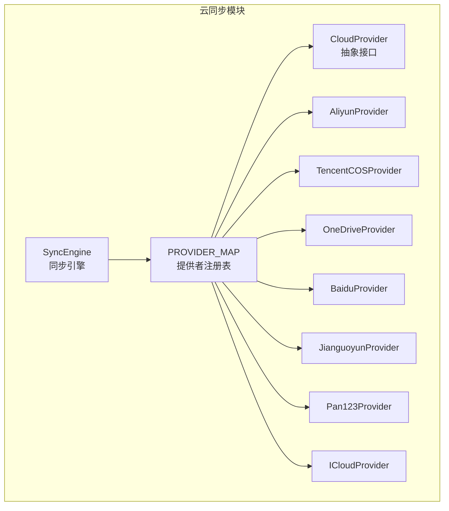
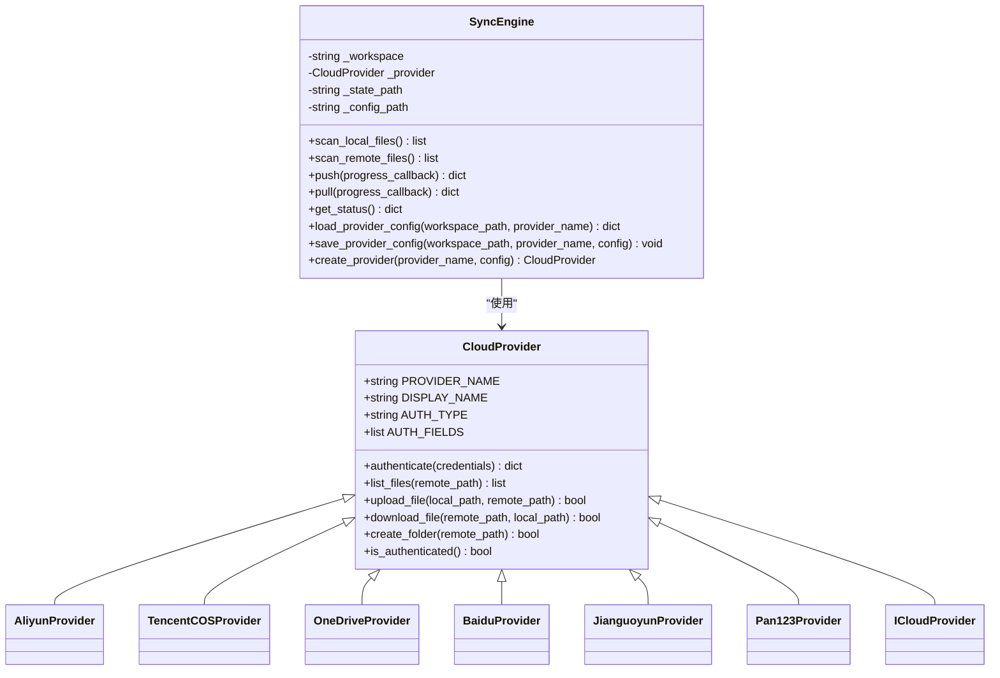
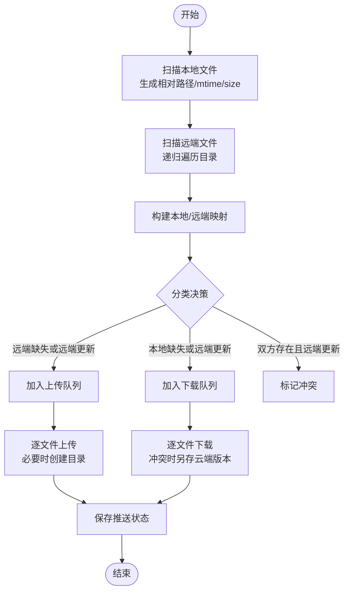
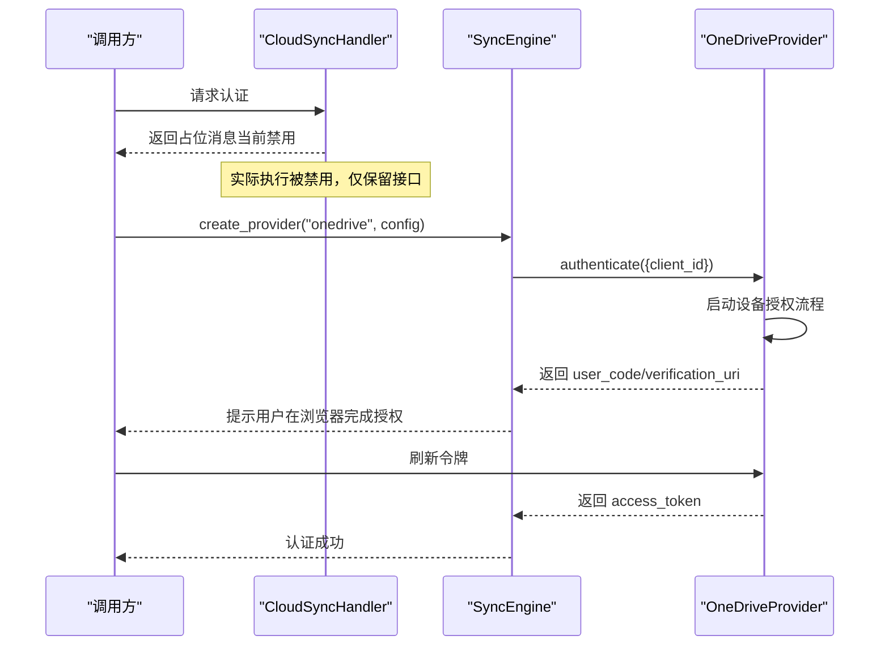
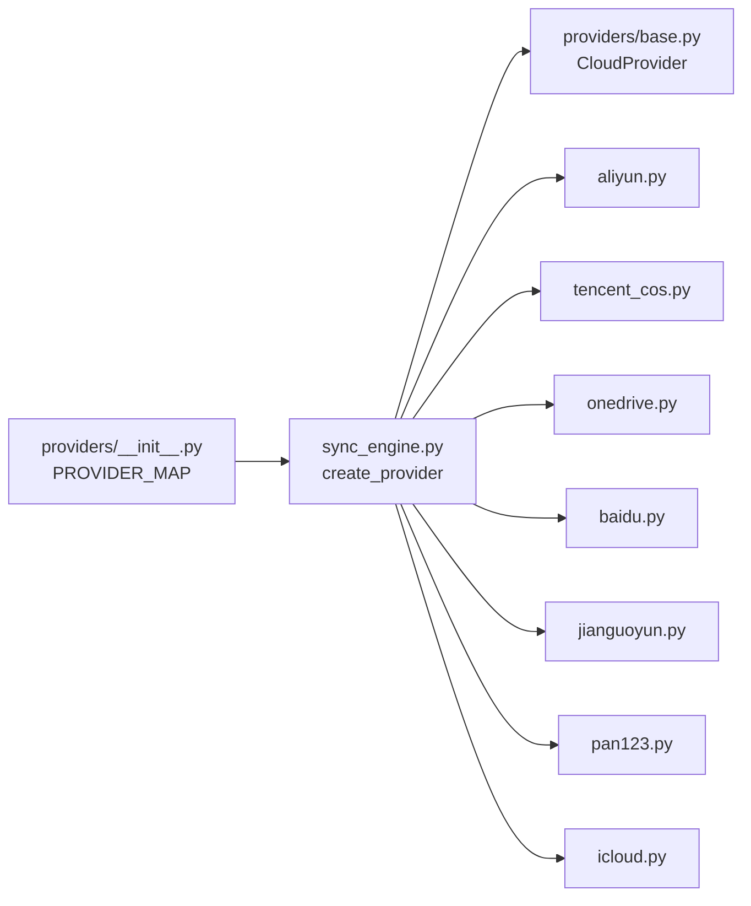

# 云同步服务

<cite>
**本文引用的文件**
- [sync_engine.py](file://python/sidecar/cloud/sync_engine.py)
- [base.py](file://python/sidecar/cloud/providers/base.py)
- [aliyun.py](file://python/sidecar/cloud/providers/aliyun.py)
- [tencent_cos.py](file://python/sidecar/cloud/providers/tencent_cos.py)
- [onedrive.py](file://python/sidecar/cloud/providers/onedrive.py)
- [baidu.py](file://python/sidecar/cloud/providers/baidu.py)
- [jianguoyun.py](file://python/sidecar/cloud/providers/jianguoyun.py)
- [pan123.py](file://python/sidecar/cloud/providers/pan123.py)
- [icloud.py](file://python/sidecar/cloud/providers/icloud.py)
- [__init__.py](file://python/sidecar/cloud/providers/__init__.py)
- [cloud_sync_handler.py](file://python/sidecar/handlers/cloud_sync_handler.py)
- [app_config.py](file://config/app_config.py)
</cite>

## 目录
1. [简介](#简介)
2. [项目结构](#项目结构)
3. [核心组件](#核心组件)
4. [架构总览](#架构总览)
5. [详细组件分析](#详细组件分析)
6. [依赖关系分析](#依赖关系分析)
7. [性能与可靠性](#性能与可靠性)
8. [配置与集成指南](#配置与集成指南)
9. [故障诊断](#故障诊断)
10. [结论](#结论)

## 简介
本技术文档面向云同步子系统，系统性阐述多云存储提供商的统一抽象设计、增量同步算法、冲突解决策略、版本管理机制、认证授权流程、数据传输安全、状态管理与进度跟踪、错误重试机制，并提供新提供商接入指南、配置项说明、性能调优建议与实际示例。当前云同步入口在 UI 层保留为实验功能占位，实际执行逻辑已具备可插拔的提供者实现与同步引擎。

## 项目结构
云同步相关代码主要位于 sidecar/cloud 下：
- providers：各云存储适配实现（阿里云盘、腾讯云 COS、OneDrive、百度网盘、坚果云、123 云盘、iCloud）
- sync_engine：统一同步引擎，负责本地扫描、远程扫描、差异计算、上传下载、冲突处理、状态持久化
- handlers：对外暴露的 RPC 路由（当前处于禁用状态，仅保留接口占位）
- config：应用级配置，包含“云同步实验开关”等全局选项

图表来源
- [sync_engine.py:1-342](file://python/sidecar/cloud/sync_engine.py#L1-L342)
- [__init__.py:1-37](file://python/sidecar/cloud/providers/__init__.py#L1-L37)
- [base.py:1-41](file://python/sidecar/cloud/providers/base.py#L1-L41)

章节来源
- [sync_engine.py:1-342](file://python/sidecar/cloud/sync_engine.py#L1-L342)
- [__init__.py:1-37](file://python/sidecar/cloud/providers/__init__.py#L1-L37)
- [cloud_sync_handler.py:1-33](file://python/sidecar/handlers/cloud_sync_handler.py#L1-L33)
- [app_config.py:80-90](file://config/app_config.py#L80-L90)

## 核心组件
- 统一抽象 CloudProvider：定义认证、列举、上传、下载、创建文件夹、认证状态检查等标准方法；提供统一的 CloudFileInfo 数据结构用于跨平台元数据对齐。
- 多提供者实现：各云厂商 API 差异通过各自 Provider 封装，屏蔽底层协议细节。
- 同步引擎 SyncEngine：基于 mtime 与 size 的增量同步，支持 push/pull、冲突检测与降级保存、状态持久化、敏感配置安全存储。
- 配置与安全：工作区 .noteai 目录下的 cloud_sync_config.json 仅存放非敏感字段，敏感字段以占位符形式保存在系统钥匙串或本地加密回退存储中。

章节来源
- [base.py:1-41](file://python/sidecar/cloud/providers/base.py#L1-L41)
- [sync_engine.py:1-342](file://python/sidecar/cloud/sync_engine.py#L1-L342)

## 架构总览
云同步采用“引擎 + 适配器”的分层架构。上层由 SyncEngine 编排同步流程，下层通过 PROVIDER_MAP 动态选择具体 CloudProvider 实现。所有 Provider 均遵循同一接口契约，确保新增平台时只需实现最小集即可接入。

图表来源
- [base.py:1-41](file://python/sidecar/cloud/providers/base.py#L1-L41)
- [aliyun.py:1-247](file://python/sidecar/cloud/providers/aliyun.py#L1-L247)
- [tencent_cos.py:1-155](file://python/sidecar/cloud/providers/tencent_cos.py#L1-L155)
- [onedrive.py:1-129](file://python/sidecar/cloud/providers/onedrive.py#L1-L129)
- [baidu.py:1-115](file://python/sidecar/cloud/providers/baidu.py#L1-L115)
- [jianguoyun.py:1-161](file://python/sidecar/cloud/providers/jianguoyun.py#L1-L161)
- [pan123.py:1-258](file://python/sidecar/cloud/providers/pan123.py#L1-L258)
- [icloud.py:1-86](file://python/sidecar/cloud/providers/icloud.py#L1-L86)
- [sync_engine.py:1-342](file://python/sidecar/cloud/sync_engine.py#L1-L342)

## 详细组件分析

### 统一抽象与数据模型
- CloudFileInfo：标准化云端条目信息（路径、名称、大小、修改时间、是否目录、云端 ID）。
- CloudProvider：抽象出认证、列举、上传、下载、创建目录、认证状态判断等方法，要求子类实现。

章节来源
- [base.py:1-41](file://python/sidecar/cloud/providers/base.py#L1-L41)

### 阿里云盘适配器
- 认证方式：access_token，首次认证会校验 token 并自动创建根目录 NoteAI。
- 目录解析：按路径分段递归查找父目录，不存在则创建。
- 上传/下载：先创建文件元信息获取 upload_url，再 PUT 上传；下载通过 getDownloadUrl 后流式写入。
- 列表：调用 openFile/list 分页拉取，解析 updated_at 为 mtime。

章节来源
- [aliyun.py:1-247](file://python/sidecar/cloud/providers/aliyun.py#L1-L247)

### 腾讯云 COS 适配器
- 认证方式：credentials（SecretId/SecretKey/Bucket/Region），通过 SDK 初始化客户端。
- 前缀隔离：REMOTE_PREFIX=NoteAI，所有对象键以此前缀组织。
- 列表：使用 Delimiter 列出子目录与对象，将 CommonPrefixes 映射为目录条目。
- 上传/下载：SDK 直传直下，失败返回 False。

章节来源
- [tencent_cos.py:1-155](file://python/sidecar/cloud/providers/tencent_cos.py#L1-L155)

### OneDrive 适配器
- 认证方式：OAuth Device Flow，需安装 msal，返回 user_code 与 verification_uri 供用户完成授权。
- 根路径：/NoteAI，后续路径拼接 Graph API 进行 CRUD。
- 列表/上传/下载：直接操作 /me/drive/root:...:/content 与 /children。

章节来源
- [onedrive.py:1-129](file://python/sidecar/cloud/providers/onedrive.py#L1-L129)

### 百度网盘适配器
- 认证方式：access_token，通过 nas/uinfo 校验。
- 根路径：/apps/NoteAI，使用 PCS 上传/下载与 NAS 管理目录。
- 列表：调用 file/list，解析 server_mtime 为 mtime。

章节来源
- [baidu.py:1-115](file://python/sidecar/cloud/providers/baidu.py#L1-L115)

### 坚果云适配器（WebDAV）
- 认证方式：用户名+应用密码，基于 WebDAV 协议。
- 列表：PROPFIND Depth=1，解析 DAV XML 中的资源类型、大小、最后修改时间。
- 上传/下载：PUT/GET 流式传输；创建目录：MKCOL 逐级创建。

章节来源
- [jianguoyun.py:1-161](file://python/sidecar/cloud/providers/jianguoyun.py#L1-L161)

### 123 云盘适配器
- 认证方式：client_id/client_secret 换取 access_token，随后维护 root_id。
- 目录解析：resolve_path 逐级查找或创建。
- 上传/下载：先申请上传 URL，再 PUT；下载通过 download/info 获取直链。

章节来源
- [pan123.py:1-258](file://python/sidecar/cloud/providers/pan123.py#L1-L258)

### iCloud 适配器
- 认证方式：本地路径，验证目录存在后可用。
- 列表/上传/下载/创建目录：基于文件系统操作，适合 macOS 本地同步场景。

章节来源
- [icloud.py:1-86](file://python/sidecar/cloud/providers/icloud.py#L1-L86)

### 同步引擎（增量同步、冲突与版本）
- 扫描范围：Notes、wiki 两个目录，忽略隐藏文件。
- 增量策略：比较本地与远端的 relative_path、mtime、size；若远端不存在或远端 mtime 晚于本地超过阈值，则判定需要上传；反之下载。
- 冲突处理：当本地与远端同时存在且远端更新更近时，视为冲突，将云端版本另存为带时间戳后缀的文件，避免覆盖本地编辑。
- 安全路径：对远端路径做白名单校验与越界保护，仅允许落在 Notes 或 wiki 下。
- 状态持久化：记录 last_push/last_pull 时间与对应 PROVIDER_NAME，便于状态查询。
- 配置安全：敏感字段以 __encrypted__:key 占位符保存，真实值存入系统钥匙串或本地回退存储。

图表来源
- [sync_engine.py:62-256](file://python/sidecar/cloud/sync_engine.py#L62-L256)

章节来源
- [sync_engine.py:1-342](file://python/sidecar/cloud/sync_engine.py#L1-L342)

### 认证与授权流程（序列图）
以下以 OneDrive 为例展示设备授权流程；其他 Provider 类似，但凭据来源不同。

图表来源
- [onedrive.py:38-64](file://python/sidecar/cloud/providers/onedrive.py#L38-L64)
- [cloud_sync_handler.py:1-33](file://python/sidecar/handlers/cloud_sync_handler.py#L1-L33)
- [sync_engine.py:337-342](file://python/sidecar/cloud/sync_engine.py#L337-L342)

章节来源
- [onedrive.py:1-129](file://python/sidecar/cloud/providers/onedrive.py#L1-L129)
- [cloud_sync_handler.py:1-33](file://python/sidecar/handlers/cloud_sync_handler.py#L1-L33)

### WebDAV 支持（坚果云）
- 使用 PROPFIND 获取目录与属性，解析 DAV XML 得到 is_dir、size、getlastmodified。
- 使用 MKCOL 创建多级目录，PUT 上传，GET 下载。
- 认证使用 Basic Auth（用户名+应用密码）。

章节来源
- [jianguoyun.py:27-161](file://python/sidecar/cloud/providers/jianguoyun.py#L27-L161)

### 数据传输加密
- 所有 HTTP 通信默认走 HTTPS（各 Provider 使用官方 API 域名与 SDK）。
- 本地敏感配置不落地明文，采用系统钥匙串或本地加密回退存储，JSON 中仅保留占位符。

章节来源
- [sync_engine.py:271-335](file://python/sidecar/cloud/sync_engine.py#L271-L335)

### 同步状态管理与进度跟踪
- 状态文件：.noteai/cloud_sync_state.json，记录最近一次 push/pull 时间与对应 PROVIDER_NAME。
- 进度回调：push/pull 支持 progress_callback(current, total, message)，可用于前端进度条。
- 状态查询：get_status 返回 provider、authenticated、local_file_count、last_push/last_pull 等信息。

章节来源
- [sync_engine.py:258-269](file://python/sidecar/cloud/sync_engine.py#L258-L269)
- [sync_engine.py:119-163](file://python/sidecar/cloud/sync_engine.py#L119-L163)
- [sync_engine.py:216-256](file://python/sidecar/cloud/sync_engine.py#L216-L256)

### 错误处理与重试
- 网络异常与 IO 异常均捕获并记录日志，单个文件失败不影响整体流程。
- 未实现指数退避或自动重试，建议在调用层（如任务调度器）增加重试策略。

章节来源
- [sync_engine.py:94-111](file://python/sidecar/cloud/sync_engine.py#L94-L111)
- [sync_engine.py:136-151](file://python/sidecar/cloud/sync_engine.py#L136-L151)
- [sync_engine.py:230-243](file://python/sidecar/cloud/sync_engine.py#L230-L243)

## 依赖关系分析
- 提供者注册：providers/__init__.py 汇总 ALL_PROVIDERS 并生成 PROVIDER_MAP，供 SyncEngine.create_provider 动态实例化。
- 引擎依赖：SyncEngine 依赖 PROVIDER_MAP 与 CloudProvider 抽象，以及 keyring_store 进行敏感配置存取。
- 外部库：部分 Provider 按需导入第三方库（如 qcloud_cos、msal），未安装时返回明确错误提示。

图表来源
- [__init__.py:1-37](file://python/sidecar/cloud/providers/__init__.py#L1-L37)
- [sync_engine.py:337-342](file://python/sidecar/cloud/sync_engine.py#L337-L342)
- [base.py:1-41](file://python/sidecar/cloud/providers/base.py#L1-L41)

章节来源
- [__init__.py:1-37](file://python/sidecar/cloud/providers/__init__.py#L1-L37)
- [sync_engine.py:337-342](file://python/sidecar/cloud/sync_engine.py#L337-L342)

## 性能与可靠性
- 增量对比：基于相对路径与 mtime 的 O(n) 扫描，适合中小规模文档集合。
- 并发优化：当前为串行上传/下载，可在调用层引入并发控制与限速，结合 Provider 的断点续传能力（如有）提升吞吐。
- 目录预创建：上传前按需创建远端目录，减少失败重试。
- 大文件下载：采用分块流式写入，降低内存占用。
- 可靠性建议：
  - 在任务调度层增加幂等与重试（指数退避、最大重试次数）。
  - 对关键 Provider 增加健康检查与快速失败。
  - 对冲突文件增加合并工具或人工确认流程。

[本节为通用指导，不直接分析具体文件]

## 配置与集成指南

### 全局开关
- 应用配置中包含 cloud_sync_experimental 布尔开关，用于控制云同步功能的可见性与可用性。

章节来源
- [app_config.py:80-90](file://config/app_config.py#L80-L90)

### 工作区配置
- 配置文件位置：.noteai/cloud_sync_config.json
- 内容结构：以 provider_name 为键，值为该 Provider 的非敏感配置项；敏感项以 __encrypted__:key 占位符保存，真实值存储在系统钥匙串或本地回退存储。
- 加载/保存：SyncEngine.load_provider_config/save_provider_config 负责迁移旧路径、读取/写入配置与清理不再使用的凭据。

章节来源
- [sync_engine.py:271-335](file://python/sidecar/cloud/sync_engine.py#L271-L335)

### 各 Provider 配置项说明
- 阿里云盘（aliyun）
  - access_token：访问令牌
  - root_id：可选，根目录 ID（内部缓存）
- 腾讯云 COS（tencent_cos）
  - secret_id、secret_key、bucket、region
- OneDrive（onedrive）
  - client_id：Azure 应用 Client ID
  - access_token、token_expiry：运行时令牌与过期时间
- 百度网盘（baidu）
  - access_token
- 坚果云（jianguoyun）
  - username、app_password（WebDAV 应用密码）
- 123 云盘（pan123）
  - client_id、client_secret、access_token、root_id
- iCloud（icloud）
  - folder_path：本地 iCloud 同步目录路径

章节来源
- [aliyun.py:10-24](file://python/sidecar/cloud/providers/aliyun.py#L10-L24)
- [tencent_cos.py:8-26](file://python/sidecar/cloud/providers/tencent_cos.py#L8-L26)
- [onedrive.py:10-28](file://python/sidecar/cloud/providers/onedrive.py#L10-L28)
- [baidu.py:9-23](file://python/sidecar/cloud/providers/baidu.py#L9-L23)
- [jianguoyun.py:10-26](file://python/sidecar/cloud/providers/jianguoyun.py#L10-L26)
- [pan123.py:9-31](file://python/sidecar/cloud/providers/pan123.py#L9-L31)
- [icloud.py:8-23](file://python/sidecar/cloud/providers/icloud.py#L8-L23)

### 新云存储提供商接入步骤
1. 新建 Provider 类，继承 CloudProvider，实现抽象方法。
2. 在 PROVIDER_MAP 中注册 PROVIDER_NAME 到类的映射。
3. 在 AUTH_FIELDS 中声明 UI 所需的凭据字段（label/type/placeholder）。
4. 实现 authenticate/is_authenticated 以校验凭据有效性。
5. 实现 list_files/upload_file/download_file/create_folder，注意：
   - 统一使用相对路径（相对于 Notes/wiki）
   - 正确解析 mtime 与 size
   - 处理目录层级与权限
6. 在 SyncEngine 中无需改动，即可通过 create_provider 动态使用。

章节来源
- [base.py:15-41](file://python/sidecar/cloud/providers/base.py#L15-L41)
- [__init__.py:12-22](file://python/sidecar/cloud/providers/__init__.py#L12-L22)
- [sync_engine.py:337-342](file://python/sidecar/cloud/sync_engine.py#L337-L342)

### 同步配置示例（文本描述）
- 在 .noteai/cloud_sync_config.json 中添加一个 provider 节点，例如 onedrive：
  - 非敏感项：client_id
  - 敏感项：access_token（保存后会被替换为 __encrypted__:access_token）
- 首次认证后，引擎会自动记录 last_pull/last_push 与 PROVIDER_NAME。

章节来源
- [sync_engine.py:271-335](file://python/sidecar/cloud/sync_engine.py#L271-L335)

## 故障诊断
- 认证失败
  - 现象：authenticate 返回 success=false 并附带错误信息。
  - 排查：检查凭据是否正确、网络连通性、第三方库是否安装（如 cos-python-sdk-v5、msal）。
- 列表为空
  - 现象：list_files 返回空列表。
  - 排查：确认 REMOTE_ROOT/前缀是否存在、权限是否足够、路径是否合法。
- 上传/下载失败
  - 现象：返回 false 或抛出异常。
  - 排查：检查文件大小、网络超时、目标目录权限、Provider 限频。
- 冲突文件过多
  - 现象：大量 _cloud_时间戳后缀文件。
  - 排查：确认两端编辑频率与时钟一致性，必要时引入合并策略。
- 状态不一致
  - 现象：get_status 显示上次同步时间与预期不符。
  - 排查：检查 .noteai/cloud_sync_state.json 是否被外部进程修改。

章节来源
- [onedrive.py:38-64](file://python/sidecar/cloud/providers/onedrive.py#L38-L64)
- [tencent_cos.py:49-66](file://python/sidecar/cloud/providers/tencent_cos.py#L49-L66)
- [sync_engine.py:94-111](file://python/sidecar/cloud/sync_engine.py#L94-L111)
- [sync_engine.py:136-151](file://python/sidecar/cloud/sync_engine.py#L136-L151)
- [sync_engine.py:230-243](file://python/sidecar/cloud/sync_engine.py#L230-L243)
- [sync_engine.py:258-269](file://python/sidecar/cloud/sync_engine.py#L258-L269)

## 结论
本云同步子系统通过统一的 CloudProvider 抽象与可扩展的 PROVIDER_MAP，实现了多云存储的无缝接入；SyncEngine 提供了稳健的增量同步、冲突降级与状态持久化能力。当前 UI 入口保留为实验功能，待冲突处理与交互完善后将全面开放。建议在生产环境中结合任务调度层实现重试与监控，并根据业务需求扩展冲突合并与审计日志。