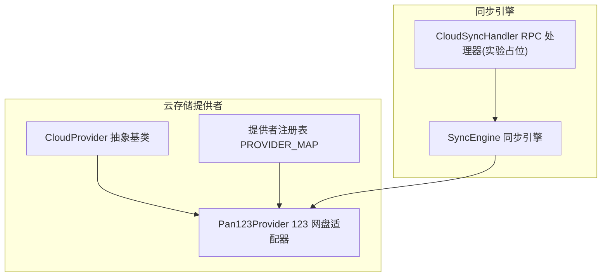
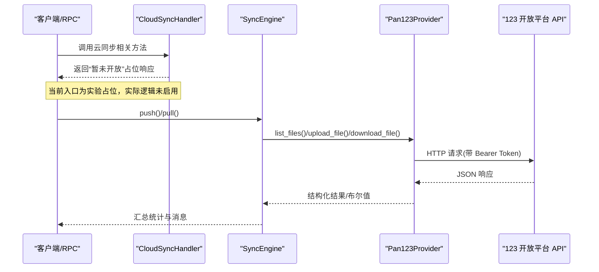
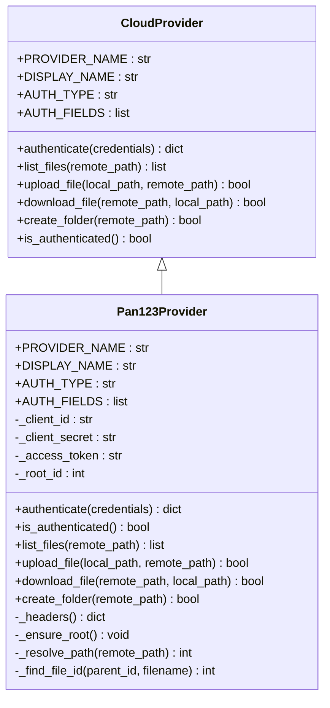
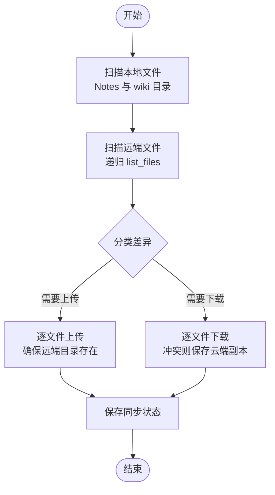
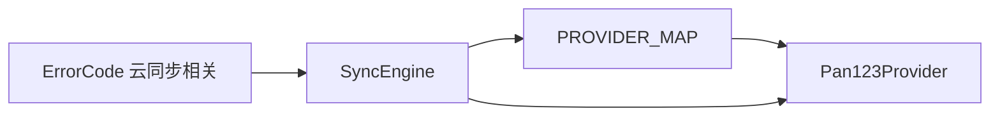

# 123 网盘适配器

<cite>
**本文引用的文件**   
- [pan123.py](file://python/sidecar/cloud/providers/pan123.py)
- [base.py](file://python/sidecar/cloud/providers/base.py)
- [__init__.py](file://python/sidecar/cloud/providers/__init__.py)
- [sync_engine.py](file://python/sidecar/cloud/sync_engine.py)
- [cloud_sync_handler.py](file://python/sidecar/handlers/cloud_sync_handler.py)
- [error_codes.py](file://utils/error_codes.py)
</cite>

## 目录
1. [简介](#简介)
2. [项目结构](#项目结构)
3. [核心组件](#核心组件)
4. [架构总览](#架构总览)
5. [详细组件分析](#详细组件分析)
6. [依赖关系分析](#依赖关系分析)
7. [性能与限流](#性能与限流)
8. [错误处理与恢复](#错误处理与恢复)
9. [使用建议与最佳实践](#使用建议与最佳实践)
10. [故障排查指南](#故障排查指南)
11. [结论](#结论)

## 简介
本技术文档面向 123 网盘适配器的集成实现，覆盖用户认证、会话管理、基础文件操作（上传、下载、列目录、创建文件夹）、路径解析与根目录初始化等关键能力。同时结合同步引擎的扫描、冲突处理与安全校验机制，给出错误处理策略、性能优化建议以及成本与数据安全的注意事项。

## 项目结构
123 网盘适配器位于云存储提供者集合中，遵循统一的抽象接口；同步引擎负责本地与远端的差异对比与执行；RPC 层提供入口（当前处于实验占位状态）。

图示来源
- [base.py:15-41](file://python/sidecar/cloud/providers/base.py#L15-L41)
- [pan123.py:8-34](file://python/sidecar/cloud/providers/pan123.py#L8-L34)
- [__init__.py:12-22](file://python/sidecar/cloud/providers/__init__.py#L12-L22)
- [sync_engine.py:37-44](file://python/sidecar/cloud/sync_engine.py#L37-L44)
- [cloud_sync_handler.py:12-21](file://python/sidecar/handlers/cloud_sync_handler.py#L12-L21)

章节来源
- [base.py:15-41](file://python/sidecar/cloud/providers/base.py#L15-L41)
- [pan123.py:8-34](file://python/sidecar/cloud/providers/pan123.py#L8-L34)
- [__init__.py:12-22](file://python/sidecar/cloud/providers/__init__.py#L12-L22)
- [sync_engine.py:37-44](file://python/sidecar/cloud/sync_engine.py#L37-L44)
- [cloud_sync_handler.py:12-21](file://python/sidecar/handlers/cloud_sync_handler.py#L12-L21)

## 核心组件
- CloudProvider 抽象基类：定义统一接口，包括认证、列出文件、上传、下载、创建文件夹、认证状态检查等。
- Pan123Provider：基于 123 开放平台 API 的具体实现，封装鉴权、根目录初始化、路径解析、上传下载、目录创建等。
- SyncEngine：负责本地与远端文件的扫描、差异计算、上传/下载流程、冲突处理、状态持久化与配置加载。
- CloudSyncHandler：RPC 入口（当前禁用），保留接口以便后续启用。

章节来源
- [base.py:15-41](file://python/sidecar/cloud/providers/base.py#L15-L41)
- [pan123.py:8-34](file://python/sidecar/cloud/providers/pan123.py#L8-L34)
- [sync_engine.py:37-44](file://python/sidecar/cloud/sync_engine.py#L37-L44)
- [cloud_sync_handler.py:12-21](file://python/sidecar/handlers/cloud_sync_handler.py#L12-L21)

## 架构总览
下图展示从 RPC 到提供者再到 123 开放平台的调用链路与职责边界。

图示来源
- [cloud_sync_handler.py:12-21](file://python/sidecar/handlers/cloud_sync_handler.py#L12-L21)
- [sync_engine.py:119-163](file://python/sidecar/cloud/sync_engine.py#L119-L163)
- [sync_engine.py:216-256](file://python/sidecar/cloud/sync_engine.py#L216-L256)
- [pan123.py:96-132](file://python/sidecar/cloud/providers/pan123.py#L96-L132)
- [pan123.py:165-195](file://python/sidecar/cloud/providers/pan123.py#L165-L195)
- [pan123.py:212-241](file://python/sidecar/cloud/providers/pan123.py#L212-L241)

## 详细组件分析

### 123 网盘适配器（Pan123Provider）
- 认证与会话
  - 通过 client_id/client_secret 获取 access_token，并在后续请求中以 Authorization: Bearer 头携带。
  - is_authenticated 通过查询用户信息接口验证 token 有效性。
- 根目录与路径解析
  - _ensure_root 自动在根下查找或创建名为 “NoteAI” 的目录作为工作根，并缓存 root_id。
  - _resolve_path 按路径分段遍历或按需创建中间目录，返回最终父目录 ID。
- 文件操作
  - list_files：分页拉取目录内容，转换为统一的 CloudFileInfo 列表。
  - upload_file：先申请上传地址，再 PUT 二进制流完成上传。
  - download_file：先获取下载链接，再以流式方式写入本地。
  - create_folder：根据路径创建目录。
- 错误与健壮性
  - 对网络异常与 JSON 解析异常进行 try/except 包裹，失败时返回空列表或 False。
  - 时间戳字段兼容多种格式，容错转换。

图示来源
- [base.py:15-41](file://python/sidecar/cloud/providers/base.py#L15-L41)
- [pan123.py:8-34](file://python/sidecar/cloud/providers/pan123.py#L8-L34)
- [pan123.py:35-56](file://python/sidecar/cloud/providers/pan123.py#L35-L56)
- [pan123.py:83-94](file://python/sidecar/cloud/providers/pan123.py#L83-L94)
- [pan123.py:96-132](file://python/sidecar/cloud/providers/pan123.py#L96-L132)
- [pan123.py:165-195](file://python/sidecar/cloud/providers/pan123.py#L165-L195)
- [pan123.py:212-241](file://python/sidecar/cloud/providers/pan123.py#L212-L241)
- [pan123.py:243-257](file://python/sidecar/cloud/providers/pan123.py#L243-L257)

章节来源
- [pan123.py:8-34](file://python/sidecar/cloud/providers/pan123.py#L8-L34)
- [pan123.py:35-56](file://python/sidecar/cloud/providers/pan123.py#L35-L56)
- [pan123.py:57-82](file://python/sidecar/cloud/providers/pan123.py#L57-L82)
- [pan123.py:83-94](file://python/sidecar/cloud/providers/pan123.py#L83-L94)
- [pan123.py:96-132](file://python/sidecar/cloud/providers/pan123.py#L96-L132)
- [pan123.py:134-163](file://python/sidecar/cloud/providers/pan123.py#L134-L163)
- [pan123.py:165-195](file://python/sidecar/cloud/providers/pan123.py#L165-L195)
- [pan123.py:212-241](file://python/sidecar/cloud/providers/pan123.py#L212-L241)
- [pan123.py:243-257](file://python/sidecar/cloud/providers/pan123.py#L243-L257)

### 同步引擎（SyncEngine）
- 本地扫描：仅遍历 Notes 与 wiki 两个目录，忽略隐藏文件。
- 远端扫描：递归调用 provider.list_files，收集非目录项。
- 推送（push）：比较 mtime 差异决定上传，自动确保远端目录存在，记录最后同步时间与提供者名称。
- 拉取（pull）：识别缺失与冲突文件，冲突时将云端版本另存为带时间戳的文件名，避免覆盖本地。
- 安全校验：下载前对相对路径进行白名单与越界检查，防止路径穿越。
- 配置与凭据：敏感字段以占位符形式保存在工作区配置文件中，真实值存入系统钥匙串；支持旧路径迁移。

图示来源
- [sync_engine.py:62-87](file://python/sidecar/cloud/sync_engine.py#L62-L87)
- [sync_engine.py:89-110](file://python/sidecar/cloud/sync_engine.py#L89-L110)
- [sync_engine.py:119-163](file://python/sidecar/cloud/sync_engine.py#L119-L163)
- [sync_engine.py:216-256](file://python/sidecar/cloud/sync_engine.py#L216-L256)
- [sync_engine.py:181-197](file://python/sidecar/cloud/sync_engine.py#L181-L197)
- [sync_engine.py:271-334](file://python/sidecar/cloud/sync_engine.py#L271-L334)

章节来源
- [sync_engine.py:62-87](file://python/sidecar/cloud/sync_engine.py#L62-L87)
- [sync_engine.py:89-110](file://python/sidecar/cloud/sync_engine.py#L89-L110)
- [sync_engine.py:119-163](file://python/sidecar/cloud/sync_engine.py#L119-L163)
- [sync_engine.py:216-256](file://python/sidecar/cloud/sync_engine.py#L216-L256)
- [sync_engine.py:181-197](file://python/sidecar/cloud/sync_engine.py#L181-L197)
- [sync_engine.py:271-334](file://python/sidecar/cloud/sync_engine.py#L271-L334)

### RPC 入口（CloudSyncHandler）
- 当前所有云同步方法均返回“暂未开放”，用于保留接口与 UI 入口。
- 提供 providers 列表接口（当前为空列表）。

章节来源
- [cloud_sync_handler.py:12-21](file://python/sidecar/handlers/cloud_sync_handler.py#L12-L21)
- [cloud_sync_handler.py:23-32](file://python/sidecar/handlers/cloud_sync_handler.py#L23-L32)

## 依赖关系分析
- 提供者注册表将具体提供者类映射到 PROVIDER_NAME，便于动态实例化。
- 同步引擎通过 PROVIDER_MAP 创建对应提供者实例，并调用其统一接口。
- 错误码模块定义了云同步相关的错误枚举，可用于上层统一处理。

图示来源
- [__init__.py:12-22](file://python/sidecar/cloud/providers/__init__.py#L12-L22)
- [sync_engine.py:337-341](file://python/sidecar/cloud/sync_engine.py#L337-L341)
- [error_codes.py:72-75](file://utils/error_codes.py#L72-L75)

章节来源
- [__init__.py:12-22](file://python/sidecar/cloud/providers/__init__.py#L12-L22)
- [sync_engine.py:337-341](file://python/sidecar/cloud/sync_engine.py#L337-L341)
- [error_codes.py:72-75](file://utils/error_codes.py#L72-L75)

## 性能与限流
- 并发控制
  - 当前实现采用串行上传/下载循环，无显式并发控制。对于大量小文件场景，可考虑引入线程池或异步任务队列以提升吞吐。
- 网络超时与重试
  - 各 HTTP 请求设置了固定超时时间，但未实现指数退避重试。建议在网络不稳定环境下增加重试与退避策略。
- 分页与批量
  - 列目录使用 limit=200 的分页参数，若目录条目较多，应实现分页游标或增量拉取以减少往返次数。
- 传输优化
  - 下载已采用流式写入，适合大文件；上传通过一次性 PUT 提交，建议对超大文件考虑分片上传与断点续传。
- 资源清理
  - 冲突下载的临时文件命名包含时间戳，建议定期清理历史冲突副本以避免磁盘膨胀。

[本节为通用指导，不直接分析具体文件]

## 错误处理与恢复
- 网络异常
  - 适配器对 requests 调用进行 try/except 捕获，失败时返回空列表或 False，避免中断整体流程。
- 服务不可用
  - 认证与用户信息查询失败时，is_authenticated 返回 False；上层可根据此状态提示重新登录。
- 数据损坏/解析异常
  - JSON 解析失败或字段类型异常时，采取默认值或空结果回退，保证鲁棒性。
- 结构化错误码
  - 上层可通过 ErrorCode 中的 CLOUD_* 系列错误码进行统一处理与国际化提示。

章节来源
- [pan123.py:35-56](file://python/sidecar/cloud/providers/pan123.py#L35-L56)
- [pan123.py:83-94](file://python/sidecar/cloud/providers/pan123.py#L83-L94)
- [pan123.py:96-132](file://python/sidecar/cloud/providers/pan123.py#L96-L132)
- [error_codes.py:72-75](file://utils/error_codes.py#L72-L75)

## 使用建议与最佳实践
- 认证与会话
  - 首次使用前需正确配置 client_id 与 client_secret；token 有效期到期后，建议在上层触发重新认证。
- 根目录与工作空间
  - 适配器会在根目录下创建 “NoteAI” 目录作为工作根，建议不要手动修改该目录结构，以免破坏路径解析。
- 路径安全
  - 同步引擎在下载前会校验相对路径是否越界与非法字符，请勿绕过该校验。
- 冲突处理
  - 拉取时的冲突会以带时间戳的副本保存，建议建立定期合并策略，避免长期堆积。
- 凭据管理
  - 敏感字段（如 token、secret）会被保存到系统钥匙串，工作区配置文件仅保留占位符，注意备份与权限控制。
- 成本控制
  - 合理设置同步频率与增量范围，减少不必要的网络请求与带宽消耗。
- 数据安全
  - 避免在工作区外写入文件；对敏感数据建议使用加密存储或最小权限原则。

[本节为通用指导，不直接分析具体文件]

## 故障排查指南
- 认证失败
  - 检查 client_id 与 client_secret 是否正确；确认 is_authenticated 返回状态；查看网络连通性与域名解析。
- 无法列出文件或上传失败
  - 确认根目录是否存在且可访问；检查网络超时与服务器返回码；查看日志中的警告信息。
- 下载路径异常
  - 若抛出路径非法或越界异常，请检查远端返回的 relative_path 是否符合白名单与规范。
- 配置加载问题
  - 确认 .noteai/cloud_sync_config.json 是否存在且可读；检查钥匙串中凭据是否可用；必要时迁移旧配置。

章节来源
- [pan123.py:35-56](file://python/sidecar/cloud/providers/pan123.py#L35-L56)
- [pan123.py:96-132](file://python/sidecar/cloud/providers/pan123.py#L96-L132)
- [sync_engine.py:181-197](file://python/sidecar/cloud/sync_engine.py#L181-L197)
- [sync_engine.py:271-334](file://python/sidecar/cloud/sync_engine.py#L271-L334)

## 结论
123 网盘适配器以简洁清晰的抽象接口实现了与 123 开放平台的对接，配合同步引擎提供了基础的推拉同步能力。当前 RPC 入口处于实验占位阶段，后续可在保持现有稳定性的基础上，逐步增强并发、重试、分片上传与更完善的冲突解决策略，以满足生产环境的可靠性与性能要求。