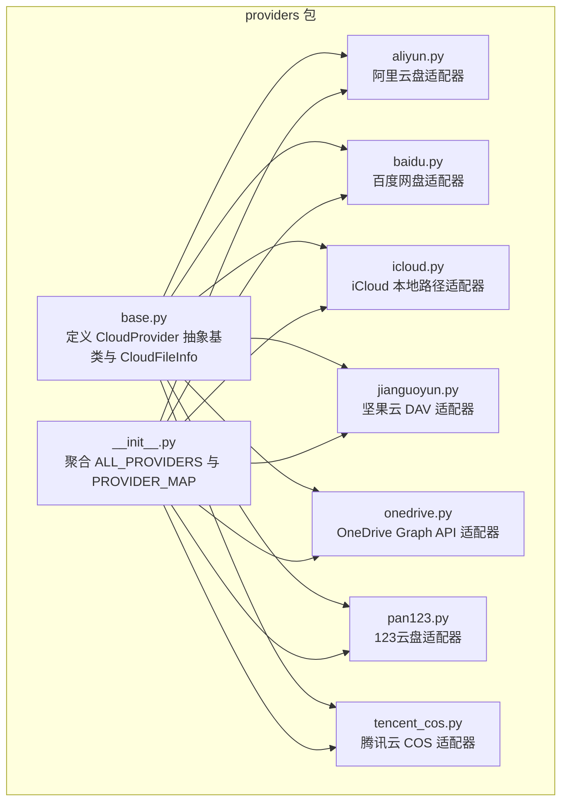
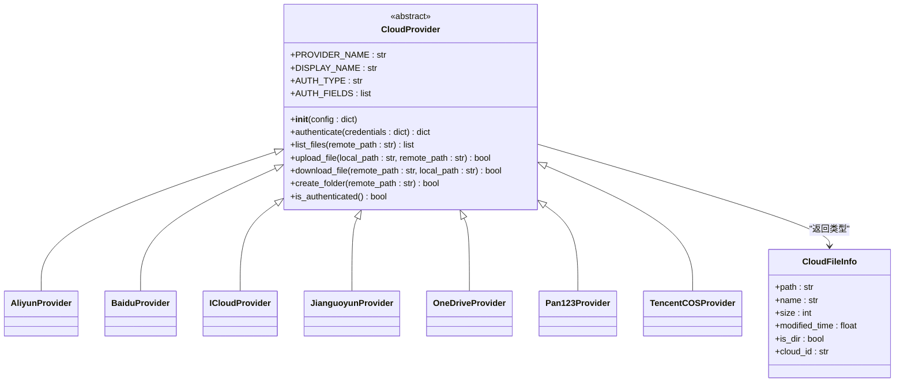
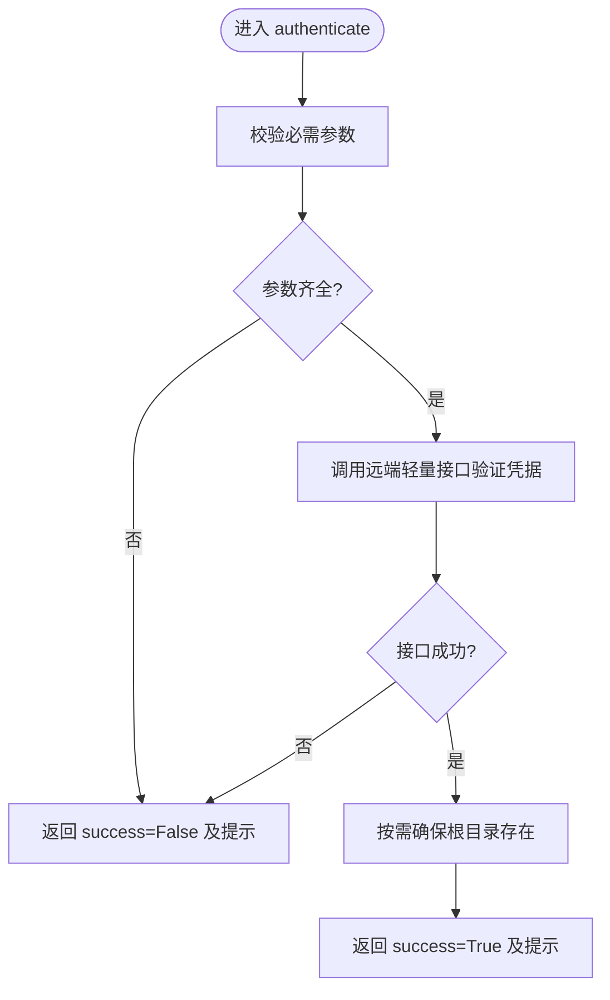
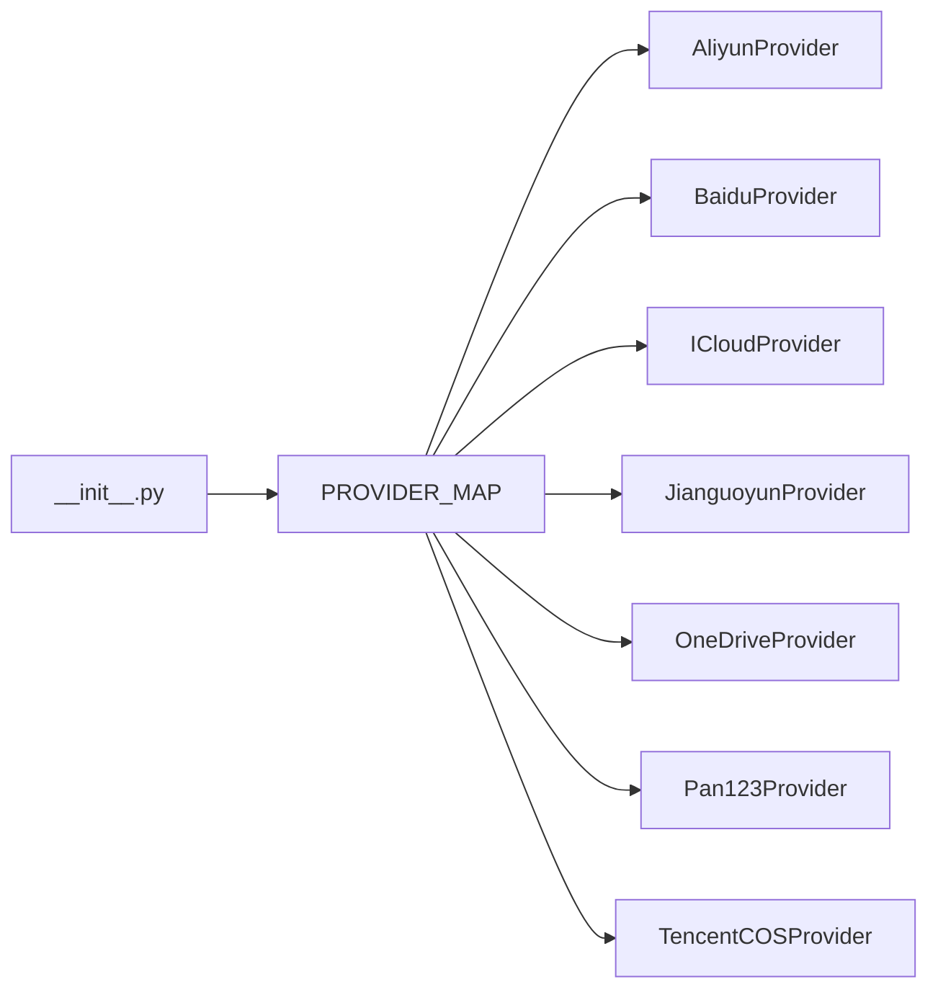

# CloudProvider 抽象基类

<cite>
**本文引用的文件**
- [python/sidecar/cloud/providers/base.py](file://python/sidecar/cloud/providers/base.py)
- [python/sidecar/cloud/providers/__init__.py](file://python/sidecar/cloud/providers/__init__.py)
- [python/sidecar/cloud/providers/aliyun.py](file://python/sidecar/cloud/providers/aliyun.py)
- [python/sidecar/cloud/providers/baidu.py](file://python/sidecar/cloud/providers/baidu.py)
- [python/sidecar/cloud/providers/icloud.py](file://python/sidecar/cloud/providers/icloud.py)
- [python/sidecar/cloud/providers/jianguoyun.py](file://python/sidecar/cloud/providers/jianguoyun.py)
- [python/sidecar/cloud/providers/onedrive.py](file://python/sidecar/cloud/providers/onedrive.py)
- [python/sidecar/cloud/providers/pan123.py](file://python/sidecar/cloud/providers/pan123.py)
- [python/sidecar/cloud/providers/tencent_cos.py](file://python/sidecar/cloud/providers/tencent_cos.py)
</cite>

## 目录
1. [简介](#简介)
2. [项目结构](#项目结构)
3. [核心组件](#核心组件)
4. [架构总览](#架构总览)
5. [详细组件分析](#详细组件分析)
6. [依赖关系分析](#依赖关系分析)
7. [性能与健壮性考虑](#性能与健壮性考虑)
8. [故障排查指南](#故障排查指南)
9. [结论](#结论)
10. [附录：新提供商适配开发指南](#附录新提供商适配开发指南)

## 简介
本文件围绕 CloudProvider 抽象基类及其数据模型 CloudFileInfo，系统性阐述其设计模式、接口规范与实现要求。文档同时覆盖 PROVIDER_NAME、DISPLAY_NAME、AUTH_TYPE、AUTH_FIELDS 等类属性的作用与使用方式，并给出新增云存储提供商适配器的完整开发流程与测试验证步骤。

## 项目结构
CloudProvider 抽象基类位于 providers 包中，具体各云厂商的适配器以独立模块形式提供，并通过包的 __init__ 进行集中注册与导出。

图表来源
- [python/sidecar/cloud/providers/base.py:15-41](file://python/sidecar/cloud/providers/base.py#L15-L41)
- [python/sidecar/cloud/providers/__init__.py:12-22](file://python/sidecar/cloud/providers/__init__.py#L12-L22)

章节来源
- [python/sidecar/cloud/providers/base.py:1-41](file://python/sidecar/cloud/providers/base.py#L1-L41)
- [python/sidecar/cloud/providers/__init__.py:1-37](file://python/sidecar/cloud/providers/__init__.py#L1-L37)

## 核心组件
- CloudFileInfo 数据类：用于统一表示远端文件或目录的元信息，字段包括 path、name、size、modified_time、is_dir、cloud_id。
- CloudProvider 抽象基类：定义统一的认证、文件列表、上传、下载、创建文件夹以及认证状态检查等接口，所有具体适配器均需继承并实现这些方法。

章节来源
- [python/sidecar/cloud/providers/base.py:5-13](file://python/sidecar/cloud/providers/base.py#L5-L13)
- [python/sidecar/cloud/providers/base.py:15-41](file://python/sidecar/cloud/providers/base.py#L15-L41)

## 架构总览
CloudProvider 采用“抽象基类 + 多实现”的设计模式。上层通过 PROVIDER_MAP 按 PROVIDER_NAME 动态选择具体适配器实例，调用统一的接口完成认证与文件操作。

图表来源
- [python/sidecar/cloud/providers/base.py:5-41](file://python/sidecar/cloud/providers/base.py#L5-L41)
- [python/sidecar/cloud/providers/aliyun.py:9-15](file://python/sidecar/cloud/providers/aliyun.py#L9-L15)
- [python/sidecar/cloud/providers/baidu.py:8-14](file://python/sidecar/cloud/providers/baidu.py#L8-L14)
- [python/sidecar/cloud/providers/icloud.py:7-18](file://python/sidecar/cloud/providers/icloud.py#L7-L18)
- [python/sidecar/cloud/providers/jianguoyun.py:10-17](file://python/sidecar/cloud/providers/jianguoyun.py#L10-L17)
- [python/sidecar/cloud/providers/onedrive.py:10-16](file://python/sidecar/cloud/providers/onedrive.py#L10-L16)
- [python/sidecar/cloud/providers/pan123.py:8-20](file://python/sidecar/cloud/providers/pan123.py#L8-L20)
- [python/sidecar/cloud/providers/tencent_cos.py:7-16](file://python/sidecar/cloud/providers/tencent_cos.py#L7-L16)

## 详细组件分析

### CloudFileInfo 数据类
- 字段说明
  - path: 相对根目录的路径（例如 “子目录/文件名”）
  - name: 文件或目录名
  - size: 文件大小（字节），目录通常为 0
  - modified_time: 修改时间戳（秒级浮点）
  - is_dir: 是否为目录
  - cloud_id: 远端唯一标识（如 file_id、fs_id、对象键等）
- 用途
  - 作为 list_files 的统一返回项，供上层 UI 或同步引擎消费
  - 为上传/下载/删除等操作提供稳定的元信息载体

章节来源
- [python/sidecar/cloud/providers/base.py:5-13](file://python/sidecar/cloud/providers/base.py#L5-L13)

### CloudProvider 抽象基类与类属性
- 类属性
  - PROVIDER_NAME: 提供商唯一标识，用于 PROVIDER_MAP 注册与查找
  - DISPLAY_NAME: 面向用户的显示名称
  - AUTH_TYPE: 认证类型，如 access_token、credentials、oauth_device、path 等
  - AUTH_FIELDS: 认证表单字段定义，包含 key、label、type、placeholder 等，用于前端渲染配置界面
- 构造器
  - __init__(config): 接收配置字典，子类可读取持久化配置（如 token、bucket、region 等）

章节来源
- [python/sidecar/cloud/providers/base.py:15-23](file://python/sidecar/cloud/providers/base.py#L15-L23)
- [python/sidecar/cloud/providers/__init__.py:22](file://python/sidecar/cloud/providers/__init__.py#L22)

### 抽象方法实现要求

#### authenticate(credentials: dict) -> dict
- 职责
  - 校验并保存凭据（可能从 credentials 覆盖 config）
  - 执行一次轻量网络探测（如列出根目录、获取用户信息等）以验证凭据有效性
- 返回值约定
  - {"success": True/False, "message": "..."}
- 常见错误处理
  - 缺少必要参数时直接返回失败消息
  - 网络异常捕获后返回失败消息
- 参考实现要点
  - 阿里云盘：通过访问根目录列表判断 Token 是否有效
  - 百度网盘：调用用户信息查询接口
  - iCloud：校验并创建本地目录路径
  - 坚果云：发送 PROPFIND 请求验证 DAV 认证
  - OneDrive：设备授权流程获取 access_token
  - 123云盘：换取 access_token 并确认根目录存在
  - 腾讯云 COS：初始化客户端并 head_bucket 校验

章节来源
- [python/sidecar/cloud/providers/aliyun.py:37-54](file://python/sidecar/cloud/providers/aliyun.py#L37-L54)
- [python/sidecar/cloud/providers/baidu.py:24-39](file://python/sidecar/cloud/providers/baidu.py#L24-L39)
- [python/sidecar/cloud/providers/icloud.py:24-34](file://python/sidecar/cloud/providers/icloud.py#L24-L34)
- [python/sidecar/cloud/providers/jianguoyun.py:35-54](file://python/sidecar/cloud/providers/jianguoyun.py#L35-L54)
- [python/sidecar/cloud/providers/onedrive.py:38-64](file://python/sidecar/cloud/providers/onedrive.py#L38-L64)
- [python/sidecar/cloud/providers/pan123.py:35-55](file://python/sidecar/cloud/providers/pan123.py#L35-L55)
- [python/sidecar/cloud/providers/tencent_cos.py:49-65](file://python/sidecar/cloud/providers/tencent_cos.py#L49-L65)

#### list_files(remote_path: str = "") -> list
- 职责
  - 返回指定远端路径下的条目集合，每个条目为 CloudFileInfo
- 行为约定
  - 空路径表示根目录
  - 对目录与文件分别设置 is_dir 与 size
  - 将 provider 特定的远端 ID 映射到 cloud_id
- 参考实现要点
  - 阿里云盘：解析 items 列表，转换更新时间戳
  - 百度网盘：根据 server_filename、isdir、server_mtime 构建条目
  - iCloud：基于本地文件系统扫描
  - 坚果云：解析 DAV XML，提取资源类型、大小、最后修改时间
  - OneDrive：Graph API /children 响应
  - 123云盘：InfoList 遍历与时间戳处理
  - 腾讯云 COS：CommonPrefixes 与 Contents 合并

章节来源
- [python/sidecar/cloud/providers/aliyun.py:125-154](file://python/sidecar/cloud/providers/aliyun.py#L125-L154)
- [python/sidecar/cloud/providers/baidu.py:54-78](file://python/sidecar/cloud/providers/baidu.py#L54-L78)
- [python/sidecar/cloud/providers/icloud.py:39-57](file://python/sidecar/cloud/providers/icloud.py#L39-L57)
- [python/sidecar/cloud/providers/jianguoyun.py:92-129](file://python/sidecar/cloud/providers/jianguoyun.py#L92-L129)
- [python/sidecar/cloud/providers/onedrive.py:80-99](file://python/sidecar/cloud/providers/onedrive.py#L80-L99)
- [python/sidecar/cloud/providers/pan123.py:96-132](file://python/sidecar/cloud/providers/pan123.py#L96-L132)
- [python/sidecar/cloud/providers/tencent_cos.py:79-120](file://python/sidecar/cloud/providers/tencent_cos.py#L79-L120)

#### upload_file(local_path: str, remote_path: str) -> bool
- 职责
  - 将本地文件上传至远端指定路径
- 行为约定
  - 确保父目录存在（必要时自动创建）
  - 返回布尔值表示成功与否
- 参考实现要点
  - 阿里云盘：先创建文件占位，再 PUT 上传流
  - 百度网盘：multipart/form-data 上传
  - iCloud：shutil.copy2 复制
  - 坚果云：PUT 到 DAV URL
  - OneDrive：PUT 到 /content 端点
  - 123云盘：申请分片/直传地址后 PUT
  - 腾讯云 COS：SDK 上传

章节来源
- [python/sidecar/cloud/providers/aliyun.py:156-186](file://python/sidecar/cloud/providers/aliyun.py#L156-L186)
- [python/sidecar/cloud/providers/baidu.py:80-89](file://python/sidecar/cloud/providers/baidu.py#L80-L89)
- [python/sidecar/cloud/providers/icloud.py:59-66](file://python/sidecar/cloud/providers/icloud.py#L59-L66)
- [python/sidecar/cloud/providers/jianguoyun.py:131-138](file://python/sidecar/cloud/providers/jianguoyun.py#L131-L138)
- [python/sidecar/cloud/providers/onedrive.py:101-106](file://python/sidecar/cloud/providers/onedrive.py#L101-L106)
- [python/sidecar/cloud/providers/pan123.py:165-195](file://python/sidecar/cloud/providers/pan123.py#L165-L195)
- [python/sidecar/cloud/providers/tencent_cos.py:122-131](file://python/sidecar/cloud/providers/tencent_cos.py#L122-L131)

#### download_file(remote_path: str, local_path: str) -> bool
- 职责
  - 从远端下载文件到本地路径
- 行为约定
  - 自动创建本地目录
  - 返回布尔值表示成功与否
- 参考实现要点
  - 阿里云盘：先获取下载链接再流式写入
  - 百度网盘：GET 流式下载
  - iCloud：shutil.copy2
  - 坚果云：GET 流式下载
  - OneDrive：GET 流式下载
  - 123云盘：获取下载 URL 后流式下载
  - 腾讯云 COS：SDK 下载

章节来源
- [python/sidecar/cloud/providers/aliyun.py:202-230](file://python/sidecar/cloud/providers/aliyun.py#L202-L230)
- [python/sidecar/cloud/providers/baidu.py:91-105](file://python/sidecar/cloud/providers/baidu.py#L91-L105)
- [python/sidecar/cloud/providers/icloud.py:68-77](file://python/sidecar/cloud/providers/icloud.py#L68-L77)
- [python/sidecar/cloud/providers/jianguoyun.py:140-149](file://python/sidecar/cloud/providers/jianguoyun.py#L140-L149)
- [python/sidecar/cloud/providers/onedrive.py:108-118](file://python/sidecar/cloud/providers/onedrive.py#L108-L118)
- [python/sidecar/cloud/providers/pan123.py:212-241](file://python/sidecar/cloud/providers/pan123.py#L212-L241)
- [python/sidecar/cloud/providers/tencent_cos.py:133-143](file://python/sidecar/cloud/providers/tencent_cos.py#L133-L143)

#### create_folder(remote_path: str) -> bool
- 职责
  - 在远端创建目录（支持多级路径）
- 行为约定
  - 若父目录不存在则逐级创建
  - 返回布尔值表示成功与否
- 参考实现要点
  - 阿里云盘：逐级创建目录
  - 百度网盘：调用创建接口
  - iCloud：os.makedirs
  - 坚果云：MKCOL 逐层创建
  - OneDrive：POST children 创建文件夹
  - 123云盘：创建目录节点
  - 腾讯云 COS：put_object 空对象模拟目录

章节来源
- [python/sidecar/cloud/providers/aliyun.py:232-246](file://python/sidecar/cloud/providers/aliyun.py#L232-L246)
- [python/sidecar/cloud/providers/baidu.py:107-114](file://python/sidecar/cloud/providers/baidu.py#L107-L114)
- [python/sidecar/cloud/providers/icloud.py:79-85](file://python/sidecar/cloud/providers/icloud.py#L79-L85)
- [python/sidecar/cloud/providers/jianguoyun.py:151-160](file://python/sidecar/cloud/providers/jianguoyun.py#L151-L160)
- [python/sidecar/cloud/providers/onedrive.py:120-128](file://python/sidecar/cloud/providers/onedrive.py#L120-L128)
- [python/sidecar/cloud/providers/pan123.py:243-257](file://python/sidecar/cloud/providers/pan123.py#L243-L257)
- [python/sidecar/cloud/providers/tencent_cos.py:145-154](file://python/sidecar/cloud/providers/tencent_cos.py#L145-L154)

#### is_authenticated() -> bool
- 职责
  - 快速判断当前实例是否具备有效凭据并可访问远端
- 行为约定
  - 优先检查本地缓存的凭据
  - 必要时发起轻量网络探测
- 参考实现要点
  - 阿里云盘：尝试列出根目录
  - 百度网盘：查询用户信息
  - iCloud：检查本地目录是否存在
  - 坚果云：PROPFIND 探测
  - OneDrive：检查 access_token 有效期并探测 /me
  - 123云盘：查询用户信息
  - 腾讯云 COS：head_bucket

章节来源
- [python/sidecar/cloud/providers/aliyun.py:111-123](file://python/sidecar/cloud/providers/aliyun.py#L111-L123)
- [python/sidecar/cloud/providers/baidu.py:41-52](file://python/sidecar/cloud/providers/baidu.py#L41-L52)
- [python/sidecar/cloud/providers/icloud.py:36-37](file://python/sidecar/cloud/providers/icloud.py#L36-L37)
- [python/sidecar/cloud/providers/jianguoyun.py:56-69](file://python/sidecar/cloud/providers/jianguoyun.py#L56-L69)
- [python/sidecar/cloud/providers/onedrive.py:69-78](file://python/sidecar/cloud/providers/onedrive.py#L69-L78)
- [python/sidecar/cloud/providers/pan123.py:83-94](file://python/sidecar/cloud/providers/pan123.py#L83-L94)
- [python/sidecar/cloud/providers/tencent_cos.py:67-77](file://python/sidecar/cloud/providers/tencent_cos.py#L67-L77)

### 认证流程图（通用）

图表来源
- [python/sidecar/cloud/providers/aliyun.py:37-54](file://python/sidecar/cloud/providers/aliyun.py#L37-L54)
- [python/sidecar/cloud/providers/onedrive.py:38-64](file://python/sidecar/cloud/providers/onedrive.py#L38-L64)
- [python/sidecar/cloud/providers/pan123.py:35-55](file://python/sidecar/cloud/providers/pan123.py#L35-L55)

## 依赖关系分析
- 包内聚合
  - __init__.py 汇总 ALL_PROVIDERS 列表，并生成 PROVIDER_MAP，键为 PROVIDER_NAME，值为可调用工厂（传入 config 返回实例）
- 外部依赖
  - requests：多数适配器使用 HTTP 请求
  - msal：OneDrive 设备授权
  - qcloud_cos：腾讯云 COS SDK
  - xml.etree.ElementTree：坚果云 DAV XML 解析
  - shutil/os：iCloud 本地路径操作

图表来源
- [python/sidecar/cloud/providers/__init__.py:12-22](file://python/sidecar/cloud/providers/__init__.py#L12-L22)

章节来源
- [python/sidecar/cloud/providers/__init__.py:1-37](file://python/sidecar/cloud/providers/__init__.py#L1-L37)

## 性能与健壮性考虑
- 网络超时与重试
  - 建议为所有网络请求设置合理超时；对幂等操作（如 list_files、is_authenticated）可引入有限次重试与退避策略
- 大文件传输
  - 使用流式读写（iter_content/chunk）避免内存峰值；必要时实现断点续传或分片上传（部分提供商已支持）
- 目录解析优化
  - 对于需要逐级解析路径的场景（如阿里云盘、123云盘），可增加本地缓存以减少多次网络往返
- 并发与锁
  - 同一实例的并发写需加锁，避免竞态条件导致目录冲突或重复创建
- 错误分类
  - 区分认证失败、权限不足、网络错误、服务端限流等，便于上层展示与重试策略

[本节为通用指导，不直接分析具体文件]

## 故障排查指南
- 认证失败
  - 检查 PROVIDER_NAME 是否正确注册
  - 核对 AUTH_FIELDS 与前端表单字段一致
  - 查看 authenticate 返回 message 中的错误描述
- 文件列表为空
  - 确认 REMOTE_ROOT 或前缀是否正确
  - 检查 is_authenticated 是否返回 True
  - 对比 list_files 返回的 CloudFileInfo 字段是否符合预期
- 上传/下载失败
  - 检查父目录是否存在（必要时调用 create_folder）
  - 确认本地路径可写、远端路径合法
  - 关注网络错误与超时日志
- 特定适配器问题
  - OneDrive：确认已安装 msal 并完成设备授权
  - 腾讯云 COS：确认已安装 cos-python-sdk-v5 且 Bucket/Region 正确
  - 坚果云：确认用户名与应用密码有效，DAV 服务可达

章节来源
- [python/sidecar/cloud/providers/onedrive.py:38-64](file://python/sidecar/cloud/providers/onedrive.py#L38-L64)
- [python/sidecar/cloud/providers/tencent_cos.py:49-65](file://python/sidecar/cloud/providers/tencent_cos.py#L49-L65)
- [python/sidecar/cloud/providers/jianguoyun.py:35-54](file://python/sidecar/cloud/providers/jianguoyun.py#L35-L54)

## 结论
CloudProvider 抽象基类通过统一的接口与数据模型屏蔽了不同云存储的差异，配合 PROVIDER_MAP 实现了可扩展的插件化架构。遵循本文档的接口规范与最佳实践，可高效扩展新的云存储适配器并保持系统一致性。

[本节为总结，不直接分析具体文件]

## 附录：新提供商适配开发指南

### 1. 继承规范
- 新建类继承 CloudProvider
- 定义类属性：
  - PROVIDER_NAME：唯一字符串标识
  - DISPLAY_NAME：显示名称
  - AUTH_TYPE：认证类型（如 access_token、credentials、oauth_device、path）
  - AUTH_FIELDS：认证表单字段定义（key、label、type、placeholder）

章节来源
- [python/sidecar/cloud/providers/base.py:15-19](file://python/sidecar/cloud/providers/base.py#L15-L19)
- [python/sidecar/cloud/providers/aliyun.py:9-15](file://python/sidecar/cloud/providers/aliyun.py#L9-L15)
- [python/sidecar/cloud/providers/baidu.py:8-14](file://python/sidecar/cloud/providers/baidu.py#L8-L14)
- [python/sidecar/cloud/providers/icloud.py:7-18](file://python/sidecar/cloud/providers/icloud.py#L7-L18)
- [python/sidecar/cloud/providers/jianguoyun.py:10-17](file://python/sidecar/cloud/providers/jianguoyun.py#L10-L17)
- [python/sidecar/cloud/providers/onedrive.py:10-16](file://python/sidecar/cloud/providers/onedrive.py#L10-L16)
- [python/sidecar/cloud/providers/pan123.py:8-20](file://python/sidecar/cloud/providers/pan123.py#L8-L20)
- [python/sidecar/cloud/providers/tencent_cos.py:7-16](file://python/sidecar/cloud/providers/tencent_cos.py#L7-L16)

### 2. 方法实现要求
- authenticate(credentials)
  - 校验并保存凭据
  - 进行一次轻量网络探测
  - 返回 {"success": bool, "message": str}
- list_files(remote_path)
  - 返回 CloudFileInfo 列表
  - 正确处理 is_dir、size、modified_time、cloud_id
- upload_file(local_path, remote_path)
  - 确保父目录存在
  - 返回布尔值
- download_file(remote_path, local_path)
  - 自动创建本地目录
  - 返回布尔值
- create_folder(remote_path)
  - 支持多级路径创建
  - 返回布尔值
- is_authenticated()
  - 快速判断凭据有效性
  - 必要时发起轻量网络探测

章节来源
- [python/sidecar/cloud/providers/base.py:24-41](file://python/sidecar/cloud/providers/base.py#L24-L41)

### 3. 注册与导出
- 在新模块中定义 Provider 类
- 在 providers/__init__.py 的 ALL_PROVIDERS 列表中追加该类
- 确保 PROVIDER_MAP 自动生成（无需手动维护）

章节来源
- [python/sidecar/cloud/providers/__init__.py:12-22](file://python/sidecar/cloud/providers/__init__.py#L12-L22)

### 4. 测试验证步骤
- 单元测试
  - 构造最小 config 与 credentials
  - 调用 authenticate 并断言 success 与 message
  - 调用 is_authenticated 并断言布尔结果
  - 调用 list_files 并断言返回 CloudFileInfo 列表非空（在可用环境下）
  - 调用 upload_file/download_file/create_folder 并断言布尔结果
- 集成测试
  - 使用真实凭据与远端环境
  - 验证端到端流程：认证 → 列目录 → 上传 → 下载 → 创建目录
- 边界与异常
  - 缺失凭据、无效凭据、网络超时、权限不足等场景
  - 断言返回结构与错误信息可读

[本节为通用指导，不直接分析具体文件]