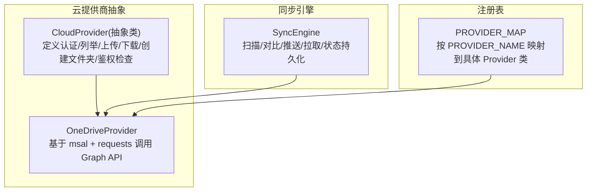
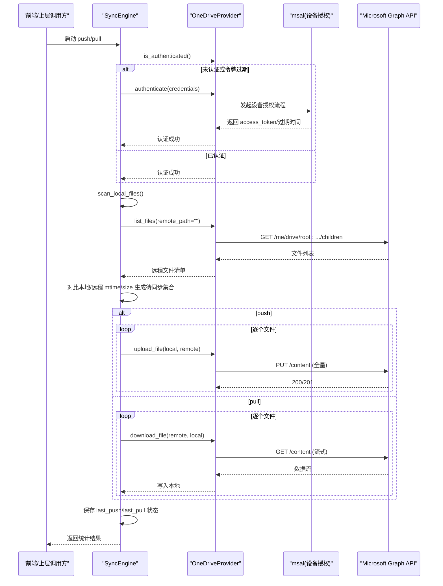
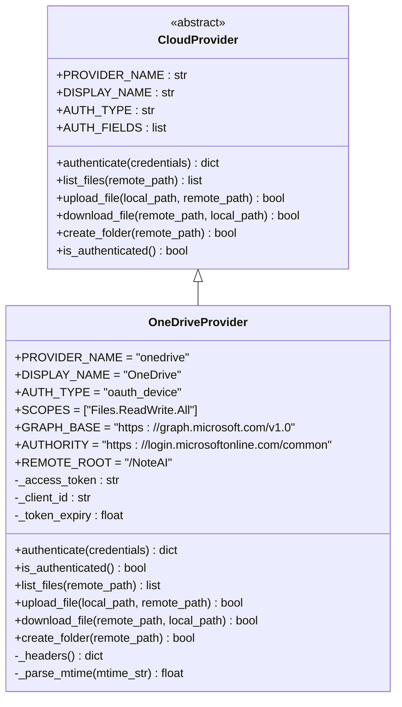
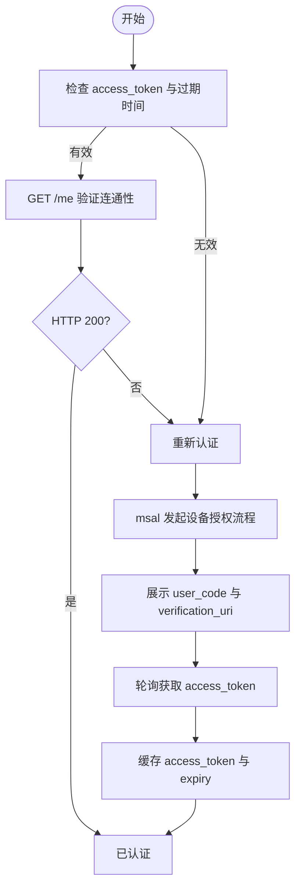
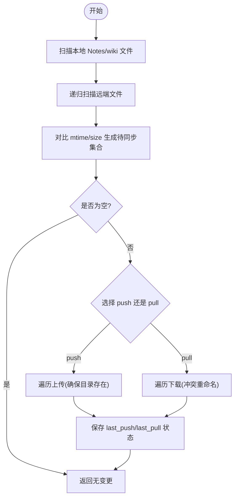
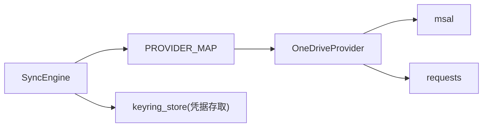

# OneDrive 适配器

<cite>
**本文引用的文件**
- [onedrive.py](file://python/sidecar/cloud/providers/onedrive.py)
- [base.py](file://python/sidecar/cloud/providers/base.py)
- [__init__.py](file://python/sidecar/cloud/providers/__init__.py)
- [sync_engine.py](file://python/sidecar/cloud/sync_engine.py)
- [test_cloud_sync_engine.py](file://tests/unit/test_cloud_sync_engine.py)
</cite>

## 目录
1. [简介](#简介)
2. [项目结构](#项目结构)
3. [核心组件](#核心组件)
4. [架构总览](#架构总览)
5. [详细组件分析](#详细组件分析)
6. [依赖关系分析](#依赖关系分析)
7. [性能与扩展性](#性能与扩展性)
8. [故障排查指南](#故障排查指南)
9. [结论](#结论)
10. [附录](#附录)

## 简介
本技术文档聚焦于 NoteAI 中的 OneDrive 适配器，系统阐述其与 Microsoft Graph API 的集成方式、OAuth2.0 设备授权流程、权限范围配置、同步引擎的工作机制，以及在企业环境下的部署注意事项。同时说明当前实现的能力边界与可扩展点，为后续引入分块上传、异步操作、进度跟踪、共享与协作等能力提供清晰路径。

## 项目结构
OneDrive 适配器位于云提供商抽象层之下，通过统一的 CloudProvider 接口暴露能力；同步引擎负责本地与云端文件的差异对比、冲突处理与状态持久化。

图表来源
- [base.py:15-41](file://python/sidecar/cloud/providers/base.py#L15-L41)
- [onedrive.py:10-129](file://python/sidecar/cloud/providers/onedrive.py#L10-L129)
- [__init__.py:12-22](file://python/sidecar/cloud/providers/__init__.py#L12-L22)
- [sync_engine.py:37-118](file://python/sidecar/cloud/sync_engine.py#L37-L118)

章节来源
- [base.py:15-41](file://python/sidecar/cloud/providers/base.py#L15-L41)
- [onedrive.py:10-129](file://python/sidecar/cloud/providers/onedrive.py#L10-L129)
- [__init__.py:12-22](file://python/sidecar/cloud/providers/__init__.py#L12-L22)
- [sync_engine.py:37-118](file://python/sidecar/cloud/sync_engine.py#L37-L118)

## 核心组件
- CloudProvider 抽象类：统一认证、列举、上传、下载、创建文件夹、鉴权检查等接口契约。
- OneDriveProvider：基于 Microsoft Graph API v1.0，使用 msal 的设备流完成 OAuth2.0 认证，使用 requests 进行 REST 调用。
- SyncEngine：负责本地 Notes/wiki 目录扫描、远程递归扫描、增量同步（push/pull）、冲突处理、状态持久化与安全校验。
- PROVIDER_MAP：将 PROVIDER_NAME 映射到具体 Provider 构造器，便于多厂商统一接入。

章节来源
- [base.py:5-41](file://python/sidecar/cloud/providers/base.py#L5-L41)
- [onedrive.py:10-129](file://python/sidecar/cloud/providers/onedrive.py#L10-L129)
- [sync_engine.py:37-118](file://python/sidecar/cloud/sync_engine.py#L37-L118)
- [__init__.py:12-22](file://python/sidecar/cloud/providers/__init__.py#L12-L22)

## 架构总览
下图展示了从用户触发同步到最终落盘或上传的端到端流程，包括认证、列举、差异计算、上传/下载与状态更新。

图表来源
- [sync_engine.py:119-163](file://python/sidecar/cloud/sync_engine.py#L119-L163)
- [sync_engine.py:216-256](file://python/sidecar/cloud/sync_engine.py#L216-L256)
- [onedrive.py:38-64](file://python/sidecar/cloud/providers/onedrive.py#L38-L64)
- [onedrive.py:80-99](file://python/sidecar/cloud/providers/onedrive.py#L80-L99)
- [onedrive.py:101-118](file://python/sidecar/cloud/providers/onedrive.py#L101-L118)

## 详细组件分析

### OneDriveProvider 类图

图表来源
- [base.py:15-41](file://python/sidecar/cloud/providers/base.py#L15-L41)
- [onedrive.py:10-129](file://python/sidecar/cloud/providers/onedrive.py#L10-L129)

章节来源
- [onedrive.py:10-129](file://python/sidecar/cloud/providers/onedrive.py#L10-L129)
- [base.py:15-41](file://python/sidecar/cloud/providers/base.py#L15-L41)

### 认证与授权流程（设备授权）
- 使用 msal.PublicClientApplication 发起设备授权流程，需要传入 Client ID 与 Authority。
- 授权成功后缓存 access_token 与 token_expiry，并在后续请求中携带 Bearer Token。
- 鉴权检查会尝试访问 Graph /me 以验证令牌有效性。

图表来源
- [onedrive.py:38-64](file://python/sidecar/cloud/providers/onedrive.py#L38-L64)
- [onedrive.py:69-78](file://python/sidecar/cloud/providers/onedrive.py#L69-L78)

章节来源
- [onedrive.py:38-64](file://python/sidecar/cloud/providers/onedrive.py#L38-L64)
- [onedrive.py:69-78](file://python/sidecar/cloud/providers/onedrive.py#L69-L78)

### 文件列举与路径约定
- 根目录固定为 REMOTE_ROOT="/NoteAI"，所有操作均在此目录下进行。
- 列举使用 /me/drive/root:{path}:/children 接口，解析 lastModifiedDateTime 并转换为时间戳。
- 支持相对路径拼接，形成完整的远程路径。

章节来源
- [onedrive.py:80-99](file://python/sidecar/cloud/providers/onedrive.py#L80-L99)

### 上传与下载
- 上传：PUT /content 直接覆盖上传，适用于中小文件。
- 下载：GET /content 并使用流式读取写入本地，避免一次性加载大对象。
- 当前未实现分块上传与断点续传，适合小至中等体积文件场景。

章节来源
- [onedrive.py:101-118](file://python/sidecar/cloud/providers/onedrive.py#L101-L118)

### 目录创建
- 根据目标路径拆分父目录与文件名，向父目录 children 节点 POST 创建文件夹。
- 同步引擎在推送前会确保远端目录存在。

章节来源
- [onedrive.py:120-128](file://python/sidecar/cloud/providers/onedrive.py#L120-L128)
- [sync_engine.py:112-118](file://python/sidecar/cloud/sync_engine.py#L112-L118)

### 同步引擎（Push/Pull）
- 扫描本地 Notes 与 wiki 两个目录，忽略隐藏文件。
- 递归扫描远端目录，构建远程文件清单。
- 依据 mtime 与 size 判定是否需要上传/下载，冲突时保留本地版本并重命名云端版本。
- 状态持久化包含最近一次 push/pull 时间与对应 provider。

图表来源
- [sync_engine.py:62-87](file://python/sidecar/cloud/sync_engine.py#L62-L87)
- [sync_engine.py:89-111](file://python/sidecar/cloud/sync_engine.py#L89-L111)
- [sync_engine.py:119-163](file://python/sidecar/cloud/sync_engine.py#L119-L163)
- [sync_engine.py:216-256](file://python/sidecar/cloud/sync_engine.py#L216-L256)

章节来源
- [sync_engine.py:62-87](file://python/sidecar/cloud/sync_engine.py#L62-L87)
- [sync_engine.py:89-111](file://python/sidecar/cloud/sync_engine.py#L89-L111)
- [sync_engine.py:119-163](file://python/sidecar/cloud/sync_engine.py#L119-L163)
- [sync_engine.py:216-256](file://python/sidecar/cloud/sync_engine.py#L216-L256)

### 安全与路径校验
- 下载路径强制限定在 Notes 与 wiki 子树内，拒绝绝对路径与越界路径（如 ..）。
- 测试用例覆盖了路径穿越防护与配置迁移行为。

章节来源
- [sync_engine.py:181-197](file://python/sidecar/cloud/sync_engine.py#L181-L197)
- [test_cloud_sync_engine.py:15-24](file://tests/unit/test_cloud_sync_engine.py#L15-L24)

## 依赖关系分析
- OneDriveProvider 依赖 msal 与 requests，分别用于设备授权与 HTTP 通信。
- SyncEngine 依赖 PROVIDER_MAP 动态创建 Provider 实例，并通过 CloudProvider 抽象与具体实现解耦。
- 配置文件与凭据存储由 keyring_store 管理，敏感字段仅存占位符，真实值保存在系统钥匙串或回退文件。

图表来源
- [__init__.py:12-22](file://python/sidecar/cloud/providers/__init__.py#L12-L22)
- [onedrive.py:38-64](file://python/sidecar/cloud/providers/onedrive.py#L38-L64)
- [sync_engine.py:271-334](file://python/sidecar/cloud/sync_engine.py#L271-L334)

章节来源
- [__init__.py:12-22](file://python/sidecar/cloud/providers/__init__.py#L12-L22)
- [onedrive.py:38-64](file://python/sidecar/cloud/providers/onedrive.py#L38-L64)
- [sync_engine.py:271-334](file://python/sidecar/cloud/sync_engine.py#L271-L334)

## 性能与扩展性
- 当前上传采用全量 PUT /content，未实现分块上传与并发，建议对大文件引入分块上传与并行策略以提升吞吐与稳定性。
- 下载采用流式写入，内存占用可控，但可考虑断点续传与重试机制增强鲁棒性。
- 同步逻辑为串行处理，可在任务队列中引入并发控制与限速，结合进度回调提升用户体验。
- 建议在 Provider 层增加可选的异步客户端封装，以便未来切换 aiohttp/httpx 等异步库。

[本节为通用性能建议，不直接分析具体文件]

## 故障排查指南
- 认证失败
  - 现象：authenticate 返回错误描述或无法获取 access_token。
  - 排查：确认 Client ID 正确、Authority 可达、网络允许登录域；检查是否安装 msal。
  - 参考：设备授权流程与错误返回。
- 令牌过期
  - 现象：is_authenticated 返回 False。
  - 排查：检查 token_expiry 与 /me 连通性；必要时触发重新认证。
- 上传/下载失败
  - 现象：返回非 2xx 或异常。
  - 排查：检查网络代理、超时设置、路径是否正确、远端目录是否存在。
- 路径安全问题
  - 现象：下载抛出“非法/越界”异常。
  - 排查：确认 relative_path 是否在受控目录内且不含 .. 等危险片段。

章节来源
- [onedrive.py:38-64](file://python/sidecar/cloud/providers/onedrive.py#L38-L64)
- [onedrive.py:69-78](file://python/sidecar/cloud/providers/onedrive.py#L69-L78)
- [sync_engine.py:181-197](file://python/sidecar/cloud/sync_engine.py#L181-L197)

## 结论
OneDrive 适配器在当前实现中提供了稳定的基础能力：设备授权、文件列举、上传/下载与目录创建，配合同步引擎实现了安全的增量同步。面向企业级与大文件场景，建议逐步引入分块上传、断点续传、异步 I/O、进度回调与更完善的错误恢复策略，以满足更高可用性与性能要求。

[本节为总结性内容，不直接分析具体文件]

## 附录

### Microsoft Graph API 集成要点
- 基础地址：Graph v1.0
- 授权域：common
- 权限范围：Files.ReadWrite.All
- 关键接口
  - 认证：设备授权流程（msal）
  - 鉴权检查：GET /me
  - 列举：GET /me/drive/root:{path}:/children
  - 上传：PUT /me/drive/root:{path}:/content
  - 下载：GET /me/drive/root:{path}:/content
  - 创建文件夹：POST /me/drive/root:{parent}:/children

章节来源
- [onedrive.py:17-21](file://python/sidecar/cloud/providers/onedrive.py#L17-L21)
- [onedrive.py:69-78](file://python/sidecar/cloud/providers/onedrive.py#L69-L78)
- [onedrive.py:80-99](file://python/sidecar/cloud/providers/onedrive.py#L80-L99)
- [onedrive.py:101-118](file://python/sidecar/cloud/providers/onedrive.py#L101-L118)
- [onedrive.py:120-128](file://python/sidecar/cloud/providers/onedrive.py#L120-L128)

### Azure AD 应用注册与权限配置步骤
- 在 Azure AD 中注册应用，记录 Client ID。
- 添加委派权限 Files.ReadWrite.All。
- 在 NoteAI 设置中填入 Client ID，首次使用时通过设备授权完成登录。
- 如需企业租户限制，可将 Authority 改为租户专属域名。

章节来源
- [onedrive.py:14-21](file://python/sidecar/cloud/providers/onedrive.py#L14-L21)

### 大型文件处理机制现状与建议
- 现状：上传为全量 PUT，下载为流式写入；未实现分块上传与断点续传。
- 建议：
  - 引入分块上传与会话创建，支持断点续传与并发分片。
  - 增加进度回调与可中断任务，提升交互体验。
  - 针对网络不稳定场景增加指数退避重试。

章节来源
- [onedrive.py:101-118](file://python/sidecar/cloud/providers/onedrive.py#L101-L118)

### 共享文件与协作场景
- 当前未实现链接生成与权限管理。
- 建议：
  - 使用 Graph 分享接口创建分享链接，支持站内/外部访问。
  - 提供权限粒度控制（只读/编辑），并持久化分享元数据。
  - 在同步引擎中区分“协作文件”与“私有文件”，避免误覆盖。

[本节为概念性建议，不直接分析具体文件]

### 企业环境部署指南
- 多租户支持
  - 可通过调整 Authority 指向特定租户，或在配置中注入 tenant_id。
- 代理与防火墙
  - 确保能访问 login.microsoftonline.com 与 graph.microsoft.com。
  - 若需代理，请在 requests/msal 层面配置代理参数。
- 凭据与密钥管理
  - 敏感字段（如 access_token）通过 keyring_store 安全存储，JSON 中仅保留占位符。
  - 支持从旧位置迁移配置到新路径 .noteai。

章节来源
- [onedrive.py:19-21](file://python/sidecar/cloud/providers/onedrive.py#L19-L21)
- [sync_engine.py:271-334](file://python/sidecar/cloud/sync_engine.py#L271-L334)
- [test_cloud_sync_engine.py:27-48](file://tests/unit/test_cloud_sync_engine.py#L27-L48)