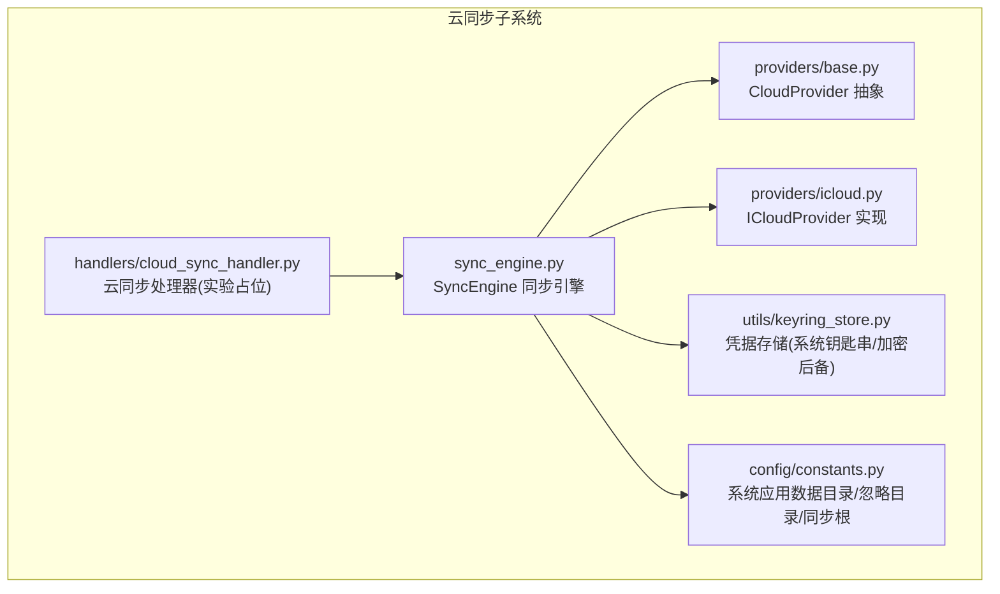
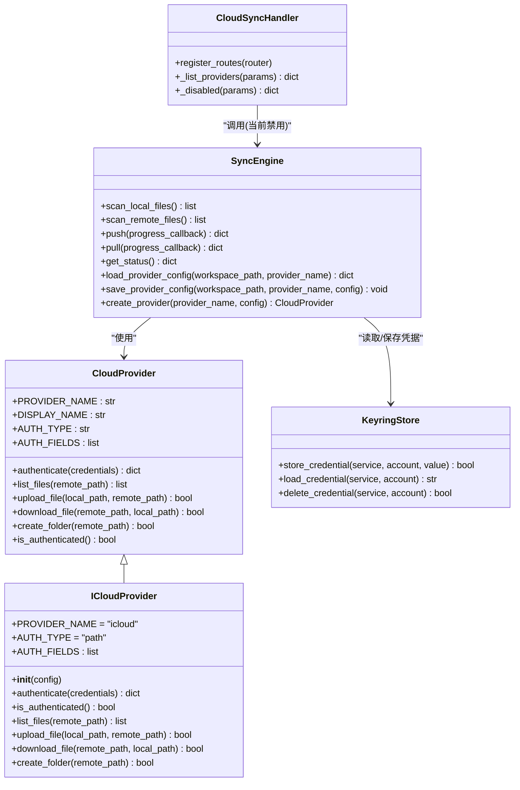
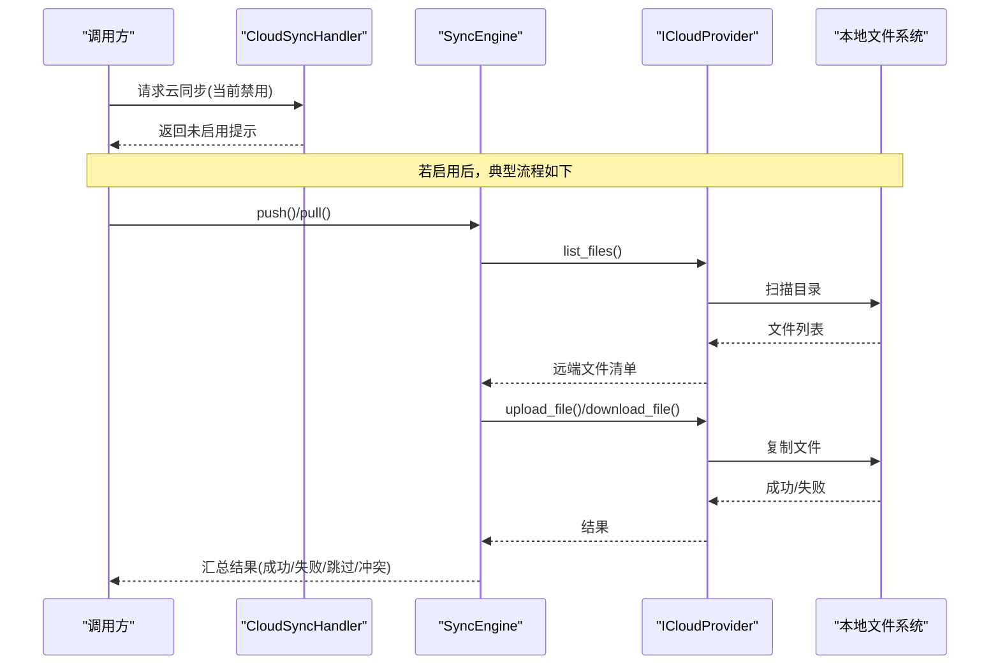
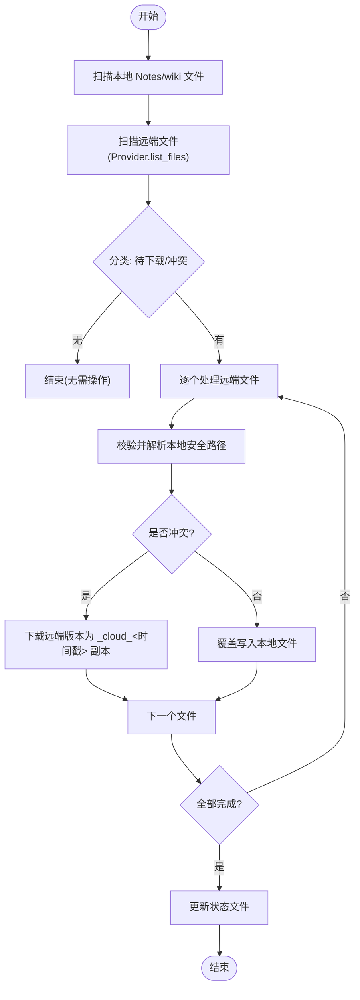
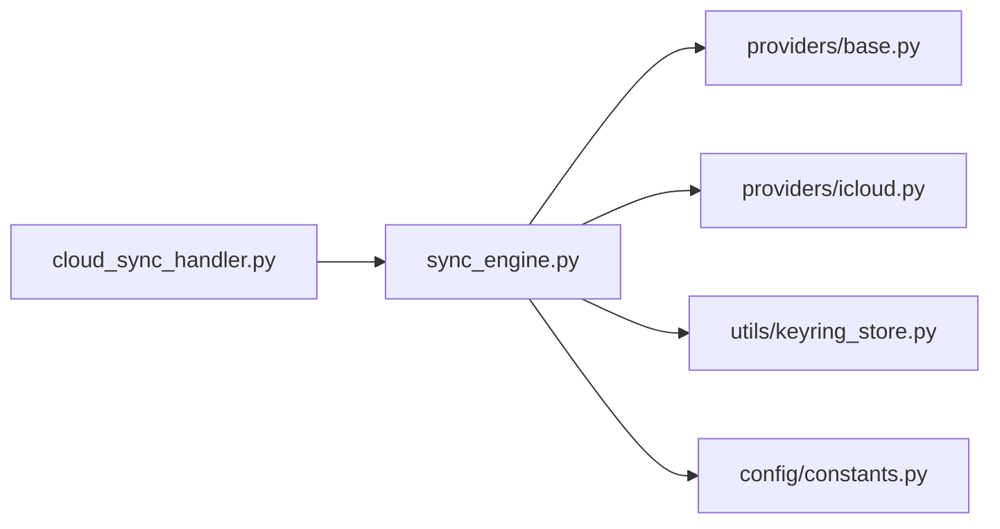

# iCloud 适配器

<cite>
**本文引用的文件**
- [icloud.py](file://python/sidecar/cloud/providers/icloud.py)
- [base.py](file://python/sidecar/cloud/providers/base.py)
- [sync_engine.py](file://python/sidecar/cloud/sync_engine.py)
- [cloud_sync_handler.py](file://python/sidecar/handlers/cloud_sync_handler.py)
- [keyring_store.py](file://utils/keyring_store.py)
- [constants.py](file://config/constants.py)
- [test_cloud_sync_engine.py](file://tests/unit/test_cloud_sync_engine.py)
</cite>

## 目录
1. [简介](#简介)
2. [项目结构](#项目结构)
3. [核心组件](#核心组件)
4. [架构总览](#架构总览)
5. [详细组件分析](#详细组件分析)
6. [依赖关系分析](#依赖关系分析)
7. [性能与可靠性](#性能与可靠性)
8. [故障排查指南](#故障排查指南)
9. [结论](#结论)
10. [附录](#附录)

## 简介
本技术文档围绕 iCloud 适配器的实现，系统性说明其在当前代码库中的集成方式、数据流与安全策略。需要特别说明的是：当前 iCloud 适配器采用“本地路径映射”的方式工作，即通过指向本机 iCloud Drive 的文件夹路径进行同步，而非直接调用 Apple ID 或 iCloud API。因此，Apple ID 认证与应用专用密码配置不在当前实现范围内；同步机制依赖操作系统对 iCloud Drive 的本地挂载与文件系统语义（如 mtime）。

## 项目结构
iCloud 相关能力位于 sidecar 云同步子系统中，主要包含以下模块：
- 提供者抽象与 iCloud 实现：定义统一的 CloudProvider 接口，并提供基于本地路径的 iCloudProvider 实现。
- 同步引擎：负责扫描本地/远端文件、冲突检测与处理、状态持久化等。
- 处理器入口：对外暴露 RPC 路由，当前处于“保留入口、功能禁用”的实验阶段。
- 凭据存储：使用系统钥匙串或加密后备文件安全保存敏感配置项。
- 常量与路径：定义应用数据目录、忽略目录、同步根目录等。

图示来源
- [base.py:15-41](file://python/sidecar/cloud/providers/base.py#L15-L41)
- [icloud.py:7-86](file://python/sidecar/cloud/providers/icloud.py#L7-L86)
- [sync_engine.py:37-342](file://python/sidecar/cloud/sync_engine.py#L37-L342)
- [cloud_sync_handler.py:12-33](file://python/sidecar/handlers/cloud_sync_handler.py#L12-L33)
- [keyring_store.py:205-241](file://utils/keyring_store.py#L205-L241)
- [constants.py:26-31](file://config/constants.py#L26-L31)

章节来源
- [base.py:15-41](file://python/sidecar/cloud/providers/base.py#L15-L41)
- [icloud.py:7-86](file://python/sidecar/cloud/providers/icloud.py#L7-L86)
- [sync_engine.py:37-342](file://python/sidecar/cloud/sync_engine.py#L37-L342)
- [cloud_sync_handler.py:12-33](file://python/sidecar/handlers/cloud_sync_handler.py#L12-L33)
- [keyring_store.py:205-241](file://utils/keyring_store.py#L205-L241)
- [constants.py:26-31](file://config/constants.py#L26-L31)

## 核心组件
- CloudProvider 抽象层
  - 统一认证、列举、上传、下载、创建目录、认证状态判断等接口。
- ICloudProvider 实现
  - 以“路径型”认证为主，要求用户提供 iCloud 文件夹路径（支持 ~ 展开），并通过标准文件系统操作完成文件读写。
- SyncEngine 同步引擎
  - 扫描本地 Notes/wiki 目录与远端（由 Provider 提供）文件集合，计算差异并执行 push/pull。
  - 冲突处理：当远端文件较新且本地存在同名文件时，将远端版本另存为带时间戳的副本，避免覆盖本地修改。
  - 状态持久化：记录最近一次 push/pull 时间与对应 Provider 名称。
  - 配置管理：敏感字段写入系统钥匙串，JSON 中仅保留占位符；支持从旧位置迁移配置文件。
- CloudSyncHandler 处理器
  - 注册云同步相关路由，当前所有写操作均返回“未启用”，仅保留入口。
- KeyringStore 凭据存储
  - 优先使用系统钥匙串（macOS Keychain、Windows Credential Manager、Linux Secret Service），不可用时回退到加密后备文件。
- Constants 常量
  - 定义系统应用数据目录、同步根目录（Notes、wiki）、忽略目录等。

章节来源
- [base.py:15-41](file://python/sidecar/cloud/providers/base.py#L15-L41)
- [icloud.py:7-86](file://python/sidecar/cloud/providers/icloud.py#L7-L86)
- [sync_engine.py:37-342](file://python/sidecar/cloud/sync_engine.py#L37-L342)
- [cloud_sync_handler.py:12-33](file://python/sidecar/handlers/cloud_sync_handler.py#L12-L33)
- [keyring_store.py:205-241](file://utils/keyring_store.py#L205-L241)
- [constants.py:26-31](file://config/constants.py#L26-L31)

## 架构总览
下图展示了 iCloud 适配器在整体系统中的角色与交互关系。

图示来源
- [base.py:15-41](file://python/sidecar/cloud/providers/base.py#L15-L41)
- [icloud.py:7-86](file://python/sidecar/cloud/providers/icloud.py#L7-L86)
- [sync_engine.py:37-342](file://python/sidecar/cloud/sync_engine.py#L37-L342)
- [cloud_sync_handler.py:12-33](file://python/sidecar/handlers/cloud_sync_handler.py#L12-L33)
- [keyring_store.py:205-241](file://utils/keyring_store.py#L205-L241)

## 详细组件分析

### ICloudProvider 实现要点
- 认证类型与字段
  - AUTH_TYPE 为 path，仅需一个 folder_path 字段，支持用户主目录展开。
- 认证流程
  - 校验路径是否存在，不存在则尝试创建；成功后标记已认证。
- 文件操作
  - 列举：遍历目标目录，收集文件元信息（大小、修改时间、是否目录）。
  - 上传/下载：使用标准拷贝函数复制文件，自动确保父目录存在。
  - 创建目录：递归创建目标目录。
- 平台特性
  - 作为本地路径映射方案，iOS/macOS 的差异主要体现在 iCloud Drive 的本地挂载行为与权限模型上；该实现不区分平台，完全依赖 OS 提供的文件系统语义。

图示来源
- [cloud_sync_handler.py:12-33](file://python/sidecar/handlers/cloud_sync_handler.py#L12-L33)
- [sync_engine.py:119-163](file://python/sidecar/cloud/sync_engine.py#L119-L163)
- [sync_engine.py:216-256](file://python/sidecar/cloud/sync_engine.py#L216-L256)
- [icloud.py:39-86](file://python/sidecar/cloud/providers/icloud.py#L39-L86)

章节来源
- [icloud.py:7-86](file://python/sidecar/cloud/providers/icloud.py#L7-L86)

### SyncEngine 同步逻辑与冲突处理
- 扫描范围
  - 仅同步 Notes 与 wiki 两个根目录，忽略隐藏文件。
- 差异判定
  - 上传：本地文件比远端新（含 1 秒容差）则上传。
  - 下载：远端文件比本地新（含 1 秒容差）视为冲突，走冲突分支。
- 冲突解决策略
  - 当检测到冲突时，不会直接覆盖本地文件，而是将远端版本下载到本地同目录下，命名为“原文件名_cloud_<时间戳>.扩展名”，从而保留双方版本供后续人工合并。
- 路径安全
  - 下载前对远端相对路径进行严格校验，拒绝绝对路径、包含 .. 或越界路径，确保只能落在允许同步的根目录内。
- 状态与配置
  - 状态文件保存在工作区 .noteai 目录，记录最近一次 push/pull 时间与 Provider 名称。
  - 配置文件中敏感字段以占位符形式保存，真实值存入系统钥匙串；加载时自动还原。
  - 兼容旧版 NoteAI 目录下的配置文件，首次加载时迁移至 .noteai。

图示来源
- [sync_engine.py:62-87](file://python/sidecar/cloud/sync_engine.py#L62-L87)
- [sync_engine.py:89-111](file://python/sidecar/cloud/sync_engine.py#L89-L111)
- [sync_engine.py:119-163](file://python/sidecar/cloud/sync_engine.py#L119-L163)
- [sync_engine.py:165-179](file://python/sidecar/cloud/sync_engine.py#L165-L179)
- [sync_engine.py:181-197](file://python/sidecar/cloud/sync_engine.py#L181-L197)
- [sync_engine.py:199-214](file://python/sidecar/cloud/sync_engine.py#L199-L214)
- [sync_engine.py:216-256](file://python/sidecar/cloud/sync_engine.py#L216-L256)
- [sync_engine.py:258-269](file://python/sidecar/cloud/sync_engine.py#L258-L269)

章节来源
- [sync_engine.py:62-87](file://python/sidecar/cloud/sync_engine.py#L62-L87)
- [sync_engine.py:119-163](file://python/sidecar/cloud/sync_engine.py#L119-L163)
- [sync_engine.py:165-179](file://python/sidecar/cloud/sync_engine.py#L165-L179)
- [sync_engine.py:181-197](file://python/sidecar/cloud/sync_engine.py#L181-L197)
- [sync_engine.py:199-214](file://python/sidecar/cloud/sync_engine.py#L199-L214)
- [sync_engine.py:216-256](file://python/sidecar/cloud/sync_engine.py#L216-L256)
- [sync_engine.py:258-269](file://python/sidecar/cloud/sync_engine.py#L258-L269)

### 处理器入口（实验占位）
- 当前所有云同步写操作均返回“未启用”，仅保留路由与提示信息，便于后续开放。
- 列出 Provider 的能力也暂时禁用，返回空列表与提示。

章节来源
- [cloud_sync_handler.py:12-33](file://python/sidecar/handlers/cloud_sync_handler.py#L12-L33)

### 凭据存储与安全
- 系统钥匙串优先：在可用情况下，将敏感配置（如 token、secret、password 等）写入系统钥匙串。
- 加密后备：当系统钥匙串不可用时，使用 PBKDF2+Fernet 对凭据进行加密，并以 0o600 权限落盘。
- 配置迁移：加载配置时，若发现 JSON 中存在占位符，则从钥匙串恢复真实值；删除不再使用的敏感键时会清理钥匙串条目。
- 服务与账户命名：按 provider_name/key 组合生成账户名，避免不同 Provider 之间的凭据冲突。

章节来源
- [sync_engine.py:271-334](file://python/sidecar/cloud/sync_engine.py#L271-L334)
- [keyring_store.py:205-241](file://utils/keyring_store.py#L205-L241)
- [keyring_store.py:253-298](file://utils/keyring_store.py#L253-L298)

### 移动端与桌面端差异处理
- 当前实现为纯 Python 侧的本地路径映射，不区分 iOS/macOS 平台细节。
- 实际可用性取决于运行环境是否能访问 iCloud Drive 的本地挂载路径（例如 macOS 上的 ~/Library/Mobile Documents/com~apple~CloudDocs/...）。
- iOS 沙盒限制下，通常无法直接访问 iCloud Drive 的系统级路径；如需在移动端使用，应通过系统提供的共享/文件选择器或 App 专属容器进行桥接，这不属于当前实现范围。

章节来源
- [icloud.py:20-34](file://python/sidecar/cloud/providers/icloud.py#L20-L34)
- [constants.py:26-31](file://config/constants.py#L26-L31)

## 依赖关系分析
- 模块耦合
  - SyncEngine 依赖 CloudProvider 抽象与具体实现（ICloudProvider），并通过 KeyringStore 管理敏感配置。
  - CloudSyncHandler 仅作为路由层，当前未启用实际业务逻辑。
- 外部依赖
  - 文件系统：os/shutil/pathlib 用于目录与文件操作。
  - 系统钥匙串：可选依赖 keyring，不可用时回退到加密后备文件。
- 潜在循环依赖
  - 未发现循环导入；Provider 与 Engine 之间通过抽象解耦。

图示来源
- [cloud_sync_handler.py:12-33](file://python/sidecar/handlers/cloud_sync_handler.py#L12-L33)
- [sync_engine.py:37-342](file://python/sidecar/cloud/sync_engine.py#L37-L342)
- [base.py:15-41](file://python/sidecar/cloud/providers/base.py#L15-L41)
- [icloud.py:7-86](file://python/sidecar/cloud/providers/icloud.py#L7-L86)
- [keyring_store.py:205-241](file://utils/keyring_store.py#L205-L241)
- [constants.py:26-31](file://config/constants.py#L26-L31)

章节来源
- [cloud_sync_handler.py:12-33](file://python/sidecar/handlers/cloud_sync_handler.py#L12-L33)
- [sync_engine.py:37-342](file://python/sidecar/cloud/sync_engine.py#L37-L342)
- [base.py:15-41](file://python/sidecar/cloud/providers/base.py#L15-L41)
- [icloud.py:7-86](file://python/sidecar/cloud/providers/icloud.py#L7-L86)
- [keyring_store.py:205-241](file://utils/keyring_store.py#L205-L241)
- [constants.py:26-31](file://config/constants.py#L26-L31)

## 性能与可靠性
- 扫描复杂度
  - 本地与远端扫描均为 O(N)，N 为受同步目录内的文件数量。
- 传输开销
  - 使用 copy2 保留元数据（mtime 等），有利于冲突判定与增量同步。
- 并发与中断
  - 当前实现为串行处理，不支持断点续传；大规模文件场景建议分批或引入队列。
- 稳定性
  - 异常捕获与日志记录完善，单个文件失败不影响整体流程。
- 优化建议
  - 引入增量索引（如哈希或更细粒度 mtime 比较）以减少不必要传输。
  - 增加并行下载/上传与重试机制。
  - 对大文件分块传输与校验和验证，提升鲁棒性。

[本节为通用指导，不涉及具体文件分析]

## 故障排查指南
- 认证失败
  - 检查 iCloud 文件夹路径是否正确，是否可访问并可创建。
- 上传/下载失败
  - 确认目标目录存在且具备写入权限；查看日志输出定位具体失败文件。
- 冲突过多
  - 冲突会生成 _cloud_<时间戳> 副本，请手动合并后再触发同步。
- 配置丢失
  - 若系统钥匙串不可用，检查加密后备文件权限是否为 0o600；必要时重新保存配置。
- 路径越界
  - 下载前会对远端路径做严格校验，非法路径将被拒绝；检查 Provider 返回的路径是否符合预期。

章节来源
- [icloud.py:24-34](file://python/sidecar/cloud/providers/icloud.py#L24-L34)
- [sync_engine.py:181-197](file://python/sidecar/cloud/sync_engine.py#L181-L197)
- [sync_engine.py:199-214](file://python/sidecar/cloud/sync_engine.py#L199-L214)
- [keyring_store.py:205-241](file://utils/keyring_store.py#L205-L241)

## 结论
当前 iCloud 适配器以“本地路径映射”的方式实现，聚焦于稳定的文件同步与安全的凭据管理。其优势在于实现简洁、跨平台一致性强；局限在于未直接对接 iCloud API，无法利用云端元数据与强一致性语义。未来可在保持现有抽象的基础上，逐步增强并发、断点续传、冲突可视化与多版本管理等能力。

[本节为总结性内容，不涉及具体文件分析]

## 附录

### 关键概念对照
- Apple ID 认证与应用专用密码
  - 当前实现不使用 Apple ID 或 iCloud API，因而不涉及此类认证流程。
- 容器路径映射
  - 通过 iCloud 文件夹路径（支持 ~ 展开）作为“容器”，将本地文件系统与 iCloud Drive 对齐。
- 同步机制与冲突解决
  - 基于 mtime 的增量差异判定；冲突时保留远端版本为带时间戳的副本，避免覆盖本地修改。
- 版本管理
  - 通过 _cloud_<时间戳> 副本体现“双版本并存”，便于人工合并。
- 平台差异
  - 当前实现不区分平台；实际可用性取决于运行环境的 iCloud Drive 挂载情况。

章节来源
- [icloud.py:20-34](file://python/sidecar/cloud/providers/icloud.py#L20-L34)
- [sync_engine.py:165-179](file://python/sidecar/cloud/sync_engine.py#L165-L179)
- [sync_engine.py:199-214](file://python/sidecar/cloud/sync_engine.py#L199-L214)

### 测试用例参考
- 路径穿越防护
  - 验证下载时对非法路径的拒绝与越界保护。
- 配置运行时目录
  - 验证配置保存到 .noteai 目录，并从钥匙串恢复敏感字段。
- 旧配置迁移
  - 验证从 NoteAI 目录迁移到 .noteai 的行为。

章节来源
- [test_cloud_sync_engine.py:15-49](file://tests/unit/test_cloud_sync_engine.py#L15-L49)