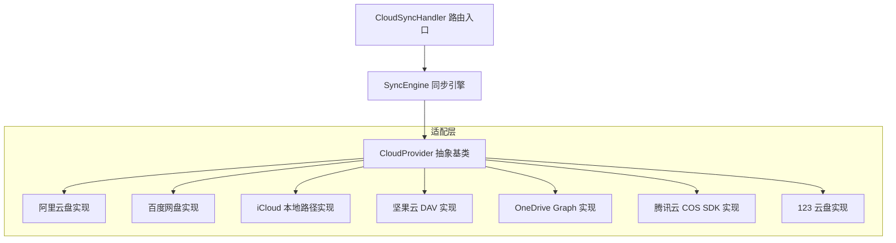
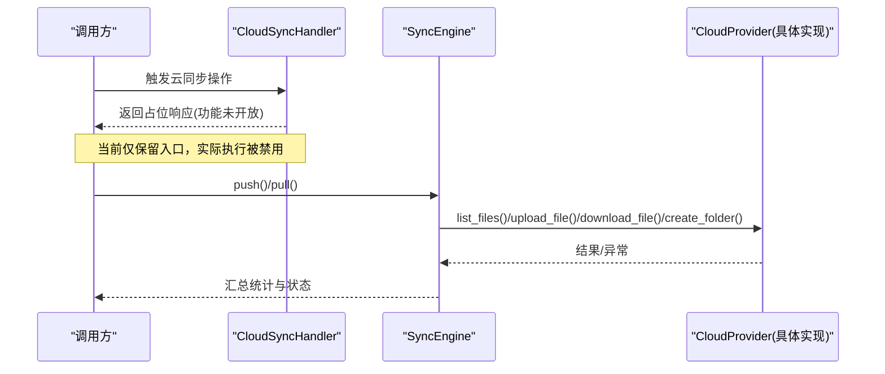
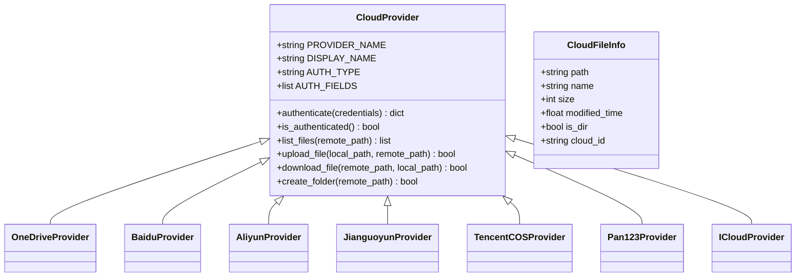
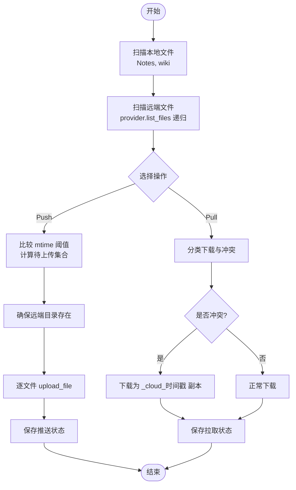
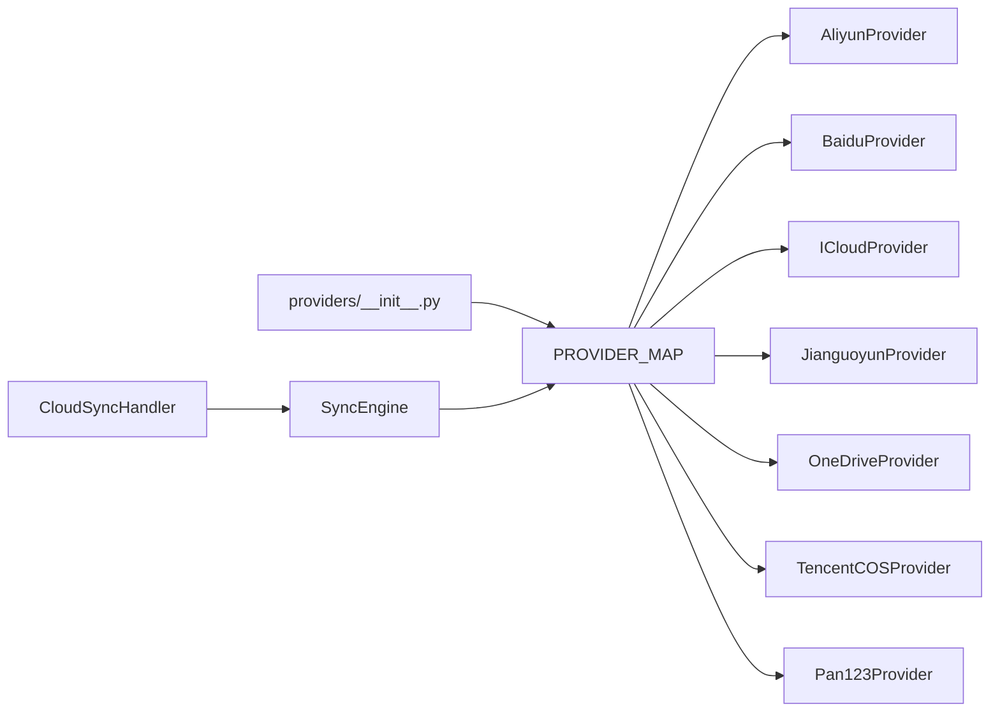

# 云存储提供商适配层

<cite>
**本文引用的文件**   
- [base.py](file://python/sidecar/cloud/providers/base.py)
- [__init__.py](file://python/sidecar/cloud/providers/__init__.py)
- [aliyun.py](file://python/sidecar/cloud/providers/aliyun.py)
- [baidu.py](file://python/sidecar/cloud/providers/baidu.py)
- [icloud.py](file://python/sidecar/cloud/providers/icloud.py)
- [jianguoyun.py](file://python/sidecar/cloud/providers/jianguoyun.py)
- [onedrive.py](file://python/sidecar/cloud/providers/onedrive.py)
- [pan123.py](file://python/sidecar/cloud/providers/pan123.py)
- [tencent_cos.py](file://python/sidecar/cloud/providers/tencent_cos.py)
- [sync_engine.py](file://python/sidecar/cloud/sync_engine.py)
- [cloud_sync_handler.py](file://python/sidecar/handlers/cloud_sync_handler.py)
- [test_cloud_sync_engine.py](file://tests/unit/test_cloud_sync_engine.py)
</cite>

## 目录
1. [简介](#简介)
2. [项目结构](#项目结构)
3. [核心组件](#核心组件)
4. [架构总览](#架构总览)
5. [详细组件分析](#详细组件分析)
6. [依赖关系分析](#依赖关系分析)
7. [性能与可靠性](#性能与可靠性)
8. [故障排查指南](#故障排查指南)
9. [结论](#结论)
10. [附录：新提供商集成指南](#附录新提供商集成指南)

## 简介
本技术文档面向云存储提供商适配层，系统性阐述抽象基类 CloudProvider 的设计模式、统一接口定义（list_files、upload_file、download_file、create_folder 等），以及各具体提供商（阿里云盘、百度网盘、iCloud、坚果云、OneDrive、腾讯云 COS、123 网盘）的实现差异。同时覆盖认证授权机制（API Key、OAuth、签名认证、路径直连）、流式上传下载、冲突处理策略、状态持久化与安全凭证管理，并提供新增云存储提供商的集成规范、测试方法与部署步骤。

## 项目结构
适配层位于 python/sidecar/cloud 下，采用“抽象基类 + 多实现 + 同步引擎”的分层组织方式：
- providers：抽象基类与各平台实现
- sync_engine：跨提供商的同步编排、状态与配置管理
- handlers：对外暴露的 RPC 入口（当前处于实验占位阶段）

图表来源
- [base.py:15-41](file://python/sidecar/cloud/providers/base.py#L15-L41)
- [aliyun.py:9-247](file://python/sidecar/cloud/providers/aliyun.py#L9-L247)
- [baidu.py:8-115](file://python/sidecar/cloud/providers/baidu.py#L8-L115)
- [icloud.py:7-86](file://python/sidecar/cloud/providers/icloud.py#L7-L86)
- [jianguoyun.py:10-161](file://python/sidecar/cloud/providers/jianguoyun.py#L10-L161)
- [onedrive.py:10-129](file://python/sidecar/cloud/providers/onedrive.py#L10-L129)
- [tencent_cos.py:7-155](file://python/sidecar/cloud/providers/tencent_cos.py#L7-L155)
- [pan123.py:8-258](file://python/sidecar/cloud/providers/pan123.py#L8-L258)
- [sync_engine.py:37-342](file://python/sidecar/cloud/sync_engine.py#L37-L342)
- [cloud_sync_handler.py:12-33](file://python/sidecar/handlers/cloud_sync_handler.py#L12-L33)

章节来源
- [base.py:15-41](file://python/sidecar/cloud/providers/base.py#L15-L41)
- [__init__.py:12-22](file://python/sidecar/cloud/providers/__init__.py#L12-L22)
- [sync_engine.py:37-118](file://python/sidecar/cloud/sync_engine.py#L37-L118)
- [cloud_sync_handler.py:12-33](file://python/sidecar/handlers/cloud_sync_handler.py#L12-L33)

## 核心组件
- CloudProvider 抽象基类
  - 统一能力：authenticate、is_authenticated、list_files、upload_file、download_file、create_folder
  - 元数据：PROVIDER_NAME、DISPLAY_NAME、AUTH_TYPE、AUTH_FIELDS
- CloudFileInfo 数据结构
  - 字段：path、name、size、modified_time、is_dir、cloud_id
- SyncEngine 同步引擎
  - 职责：扫描本地/远端、增量对比、上传/下载、冲突处理、状态与配置持久化、凭据安全存储
- 提供商注册表 PROVIDER_MAP
  - 通过 PROVIDER_NAME 映射到具体 Provider 构造器

章节来源
- [base.py:5-41](file://python/sidecar/cloud/providers/base.py#L5-L41)
- [__init__.py:12-22](file://python/sidecar/cloud/providers/__init__.py#L12-L22)
- [sync_engine.py:37-118](file://python/sidecar/cloud/sync_engine.py#L37-L118)

## 架构总览
整体调用链从上层处理器进入，经 SyncEngine 调度，最终委托至具体 Provider 完成 API 调用。

图表来源
- [cloud_sync_handler.py:12-33](file://python/sidecar/handlers/cloud_sync_handler.py#L12-L33)
- [sync_engine.py:119-256](file://python/sidecar/cloud/sync_engine.py#L119-L256)
- [base.py:24-41](file://python/sidecar/cloud/providers/base.py#L24-L41)

## 详细组件分析

### 抽象基类与数据模型
- CloudProvider
  - 设计要点：以 ABC 强制子类实现统一方法；通过 AUTH_TYPE/AUTH_FIELDS 描述认证表单；通过 PROVIDER_NAME/DISPLAY_NAME 提供识别与展示信息
  - 关键方法：authenticate、is_authenticated、list_files、upload_file、download_file、create_folder
- CloudFileInfo
  - 设计要点：标准化远端条目视图，屏蔽各平台差异；包含 is_dir 与 cloud_id 便于后续操作

图表来源
- [base.py:5-41](file://python/sidecar/cloud/providers/base.py#L5-L41)
- [onedrive.py:10-129](file://python/sidecar/cloud/providers/onedrive.py#L10-L129)
- [baidu.py:8-115](file://python/sidecar/cloud/providers/baidu.py#L8-L115)
- [aliyun.py:9-247](file://python/sidecar/cloud/providers/aliyun.py#L9-L247)
- [jianguoyun.py:10-161](file://python/sidecar/cloud/providers/jianguoyun.py#L10-L161)
- [tencent_cos.py:7-155](file://python/sidecar/cloud/providers/tencent_cos.py#L7-L155)
- [pan123.py:8-258](file://python/sidecar/cloud/providers/pan123.py#L8-L258)
- [icloud.py:7-86](file://python/sidecar/cloud/providers/icloud.py#L7-L86)

章节来源
- [base.py:5-41](file://python/sidecar/cloud/providers/base.py#L5-L41)

### 同步引擎（SyncEngine）
- 核心流程
  - 扫描本地：遍历 Notes、wiki 目录，收集相对路径、mtime、size
  - 扫描远端：递归调用 provider.list_files，聚合为统一列表
  - 推送（push）：比较 mtime 阈值，决定上传集合；自动创建远端目录；记录状态
  - 拉取（pull）：分类需要下载的文件与冲突文件；冲突时生成带时间戳的副本；记录状态
  - 安全校验：对远端路径进行白名单与越界检查，防止路径穿越
  - 配置与凭据：敏感字段使用系统钥匙串存储，JSON 中仅保留占位符；支持旧路径迁移
- 并发与断点续传
  - 当前实现为串行处理，未内置并发控制与断点续传
- 状态持久化
  - 在 .noteai/cloud_sync_state.json 记录最近一次 push/pull 时间与对应 provider

图表来源
- [sync_engine.py:62-118](file://python/sidecar/cloud/sync_engine.py#L62-L118)
- [sync_engine.py:119-163](file://python/sidecar/cloud/sync_engine.py#L119-L163)
- [sync_engine.py:165-256](file://python/sidecar/cloud/sync_engine.py#L165-L256)
- [sync_engine.py:181-197](file://python/sidecar/cloud/sync_engine.py#L181-L197)
- [sync_engine.py:271-342](file://python/sidecar/cloud/sync_engine.py#L271-L342)

章节来源
- [sync_engine.py:62-118](file://python/sidecar/cloud/sync_engine.py#L62-L118)
- [sync_engine.py:119-163](file://python/sidecar/cloud/sync_engine.py#L119-L163)
- [sync_engine.py:165-256](file://python/sidecar/cloud/sync_engine.py#L165-L256)
- [sync_engine.py:181-197](file://python/sidecar/cloud/sync_engine.py#L181-L197)
- [sync_engine.py:271-342](file://python/sidecar/cloud/sync_engine.py#L271-L342)
- [test_cloud_sync_engine.py:15-49](file://tests/unit/test_cloud_sync_engine.py#L15-L49)

### 各提供商实现差异与认证方式

#### 阿里云盘（AliyunProvider）
- 认证方式：access_token（Bearer）
- 根目录策略：首次认证时查找或创建 NoteAI 根文件夹并缓存 root_id
- 上传流程：先创建文件元信息获取 upload_url，再 PUT 上传
- 下载流程：通过 getDownloadUrl 获取直链后流式写入
- 目录解析：按路径分段查询或创建父目录

章节来源
- [aliyun.py:9-247](file://python/sidecar/cloud/providers/aliyun.py#L9-L247)

#### 百度网盘（BaiduProvider）
- 认证方式：access_token（参数传递）
- 上传/下载：直接通过 PCS 接口上传/下载
- 目录：基于固定远程根 /apps/NoteAI

章节来源
- [baidu.py:8-115](file://python/sidecar/cloud/providers/baidu.py#L8-L115)

#### iCloud（ICloudProvider）
- 认证方式：本地路径（folder_path）
- 实现：直接读写本地文件系统，适用于 macOS 环境
- 上传/下载：copy2 保持元数据

章节来源
- [icloud.py:7-86](file://python/sidecar/cloud/providers/icloud.py#L7-L86)

#### 坚果云（JianguoyunProvider）
- 认证方式：用户名 + 应用密码（DAV Basic）
- 协议：WebDAV（PROPFIND/MKCOL/PUT/GET）
- 目录：基于 DAV 根下的 NoteAI 前缀

章节来源
- [jianguoyun.py:10-161](file://python/sidecar/cloud/providers/jianguoyun.py#L10-L161)

#### OneDrive（OneDriveProvider）
- 认证方式：OAuth Device Flow（msal）
- 鉴权：Bearer Token 访问 Graph API
- 上传/下载：直接 PUT/GET /content
- 目录：基于 /NoteAI 前缀

章节来源
- [onedrive.py:10-129](file://python/sidecar/cloud/providers/onedrive.py#L10-L129)

#### 腾讯云 COS（TencentCOSProvider）
- 认证方式：SecretId/SecretKey + Bucket/Region（SDK 签名）
- 依赖：cos-python-sdk-v5
- 目录：基于 NoteAI 前缀的键空间

章节来源
- [tencent_cos.py:7-155](file://python/sidecar/cloud/providers/tencent_cos.py#L7-L155)

#### 123 云盘（Pan123Provider）
- 认证方式：client_id/client_secret 换取 access_token
- 上传流程：先申请上传 URL，再 PUT 上传
- 下载流程：先获取下载信息，再流式下载
- 目录：按需解析或创建父目录

章节来源
- [pan123.py:8-258](file://python/sidecar/cloud/providers/pan123.py#L8-L258)

### 认证与凭据管理
- 认证类型
  - access_token：阿里云盘、百度网盘、OneDrive（设备码 OAuth）
  - credentials：坚果云（Basic）、123 云盘（Client Credentials）、腾讯云 COS（AK/SK）
  - path：iCloud（本地路径）
- 凭据安全存储
  - 敏感字段（password/secret/token/key/credential/auth 等）写入系统钥匙串，JSON 中仅保留占位符
  - 加载时自动还原，兼容旧路径迁移

章节来源
- [sync_engine.py:25-34](file://python/sidecar/cloud/sync_engine.py#L25-L34)
- [sync_engine.py:271-342](file://python/sidecar/cloud/sync_engine.py#L271-L342)
- [test_cloud_sync_engine.py:27-49](file://tests/unit/test_cloud_sync_engine.py#L27-L49)

## 依赖关系分析
- 模块耦合
  - providers.__init__.py 集中注册所有 Provider 到 PROVIDER_MAP，供 SyncEngine 动态创建
  - SyncEngine 依赖 providers 抽象与注册表，不感知具体实现细节
  - handlers 仅作为路由入口，当前处于禁用状态
- 外部依赖
  - requests：HTTP 客户端（多数 Provider）
  - msal：OneDrive OAuth 设备码流程
  - qcloud_cos：腾讯云 COS SDK

图表来源
- [__init__.py:12-22](file://python/sidecar/cloud/providers/__init__.py#L12-L22)
- [sync_engine.py:337-342](file://python/sidecar/cloud/sync_engine.py#L337-L342)
- [cloud_sync_handler.py:12-33](file://python/sidecar/handlers/cloud_sync_handler.py#L12-L33)

章节来源
- [__init__.py:12-22](file://python/sidecar/cloud/providers/__init__.py#L12-L22)
- [sync_engine.py:337-342](file://python/sidecar/cloud/sync_engine.py#L337-L342)
- [cloud_sync_handler.py:12-33](file://python/sidecar/handlers/cloud_sync_handler.py#L12-L33)

## 性能与可靠性
- 流式处理
  - 下载普遍采用 iter_content 分块写入，降低内存占用
  - 部分上传为一次性读取（如百度网盘），大文件建议优化为分块上传
- 并发控制
  - 当前为串行处理，适合小量文件；未来可引入线程池/协程队列与速率限制
- 断点续传
  - 尚未实现；可在 Provider 层增加分片上传与断点恢复逻辑
- 幂等与重试
  - 建议在网络异常时增加指数退避重试；对上传/下载增加幂等键或校验
- 冲突处理
  - 拉取冲突时生成带时间戳的副本，避免覆盖用户本地修改

[本节为通用指导，无需代码引用]

## 故障排查指南
- 认证失败
  - 检查 Access Token/Client ID/Secret/用户名与应用密码是否正确
  - 确认网络可达与域名白名单
- 路径非法/越界
  - 拉取时对远端路径进行白名单与越界校验，若抛出异常请检查远端路径是否符合 Notes/wiki 前缀
- 依赖缺失
  - OneDrive 需安装 msal；腾讯云 COS 需安装 cos-python-sdk-v5
- 状态与配置
  - 查看 .noteai/cloud_sync_state.json 与 cloud_sync_config.json
  - 敏感字段应保存在系统钥匙串，JSON 中仅含占位符

章节来源
- [sync_engine.py:181-197](file://python/sidecar/cloud/sync_engine.py#L181-L197)
- [onedrive.py:38-64](file://python/sidecar/cloud/providers/onedrive.py#L38-L64)
- [tencent_cos.py:49-65](file://python/sidecar/cloud/providers/tencent_cos.py#L49-L65)
- [test_cloud_sync_engine.py:15-49](file://tests/unit/test_cloud_sync_engine.py#L15-L49)

## 结论
本适配层通过统一的 CloudProvider 抽象与 SyncEngine 编排，屏蔽了多云平台的差异，提供了稳定的文件同步能力。当前版本已覆盖主流云盘与对象存储，具备安全的凭据管理与基础的冲突处理。后续可在并发、断点续传、重试与错误上报方面进一步增强，以提升大规模文件的同步效率与鲁棒性。

[本节为总结，无需代码引用]

## 附录：新提供商集成指南

### 开发规范
- 新建 Provider 类继承 CloudProvider，实现以下方法：
  - authenticate、is_authenticated、list_files、upload_file、download_file、create_folder
- 声明元数据：
  - PROVIDER_NAME（唯一标识）
  - DISPLAY_NAME（显示名称）
  - AUTH_TYPE（access_token/credentials/oauth_device/path 等）
  - AUTH_FIELDS（用于前端渲染的表单字段定义）
- 将新 Provider 加入 providers/__init__.py 的 ALL_PROVIDERS 列表，以便 PROVIDER_MAP 自动注册

章节来源
- [base.py:15-41](file://python/sidecar/cloud/providers/base.py#L15-L41)
- [__init__.py:12-22](file://python/sidecar/cloud/providers/__init__.py#L12-L22)

### 最小可用示例（思路）
- 参考任一现有 Provider 的结构与命名约定，替换 API 地址、请求头与参数
- 注意：
  - 统一返回 CloudFileInfo 列表
  - 上传/下载尽量使用流式 IO
  - 正确处理超时与异常，返回布尔值或标准字典

章节来源
- [aliyun.py:156-230](file://python/sidecar/cloud/providers/aliyun.py#L156-L230)
- [baidu.py:80-105](file://python/sidecar/cloud/providers/baidu.py#L80-L105)
- [jianguoyun.py:131-149](file://python/sidecar/cloud/providers/jianguoyun.py#L131-L149)
- [onedrive.py:101-118](file://python/sidecar/cloud/providers/onedrive.py#L101-L118)
- [pan123.py:165-241](file://python/sidecar/cloud/providers/pan123.py#L165-L241)
- [tencent_cos.py:122-143](file://python/sidecar/cloud/providers/tencent_cos.py#L122-L143)

### 测试方法
- 单元测试
  - 验证路径安全：确保 _safe_local_path 拒绝越界与非法路径
  - 验证配置迁移：旧路径迁移到新 .noteai 目录
  - 验证凭据存储：敏感字段写入钥匙串，JSON 仅保留占位符
- 集成测试（可选）
  - 使用沙箱账号或 Mock Provider 模拟真实 API 行为

章节来源
- [test_cloud_sync_engine.py:15-49](file://tests/unit/test_cloud_sync_engine.py#L15-L49)

### 部署步骤
- 安装依赖
  - 如需 OneDrive：uv pip install msal
  - 如需腾讯云 COS：uv pip install cos-python-sdk-v5
- 配置工作区
  - 在 workspace/.noteai/cloud_sync_config.json 中保存非敏感配置
  - 敏感字段由运行时写入系统钥匙串
- 启用入口（可选）
  - 当前 CloudSyncHandler 处于禁用状态，可按需放开路由并接入 UI

章节来源
- [onedrive.py:38-64](file://python/sidecar/cloud/providers/onedrive.py#L38-L64)
- [tencent_cos.py:49-65](file://python/sidecar/cloud/providers/tencent_cos.py#L49-L65)
- [cloud_sync_handler.py:12-33](file://python/sidecar/handlers/cloud_sync_handler.py#L12-L33)
- [sync_engine.py:271-342](file://python/sidecar/cloud/sync_engine.py#L271-L342)