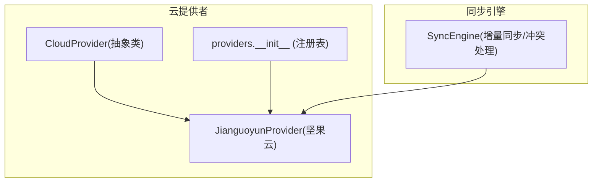
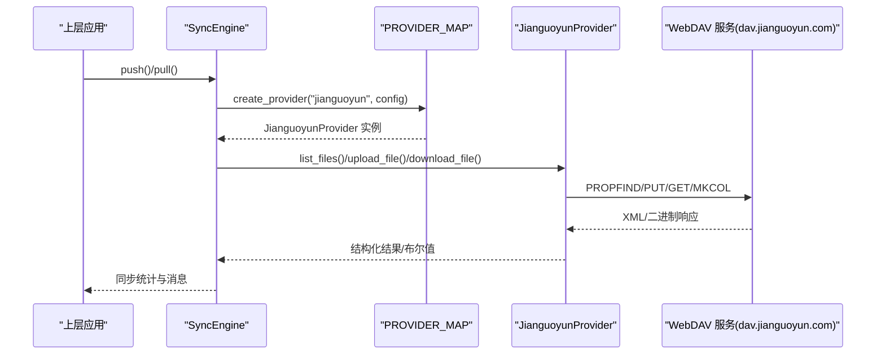
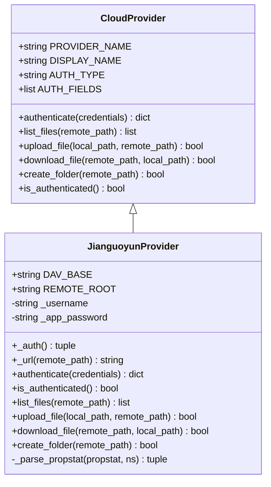
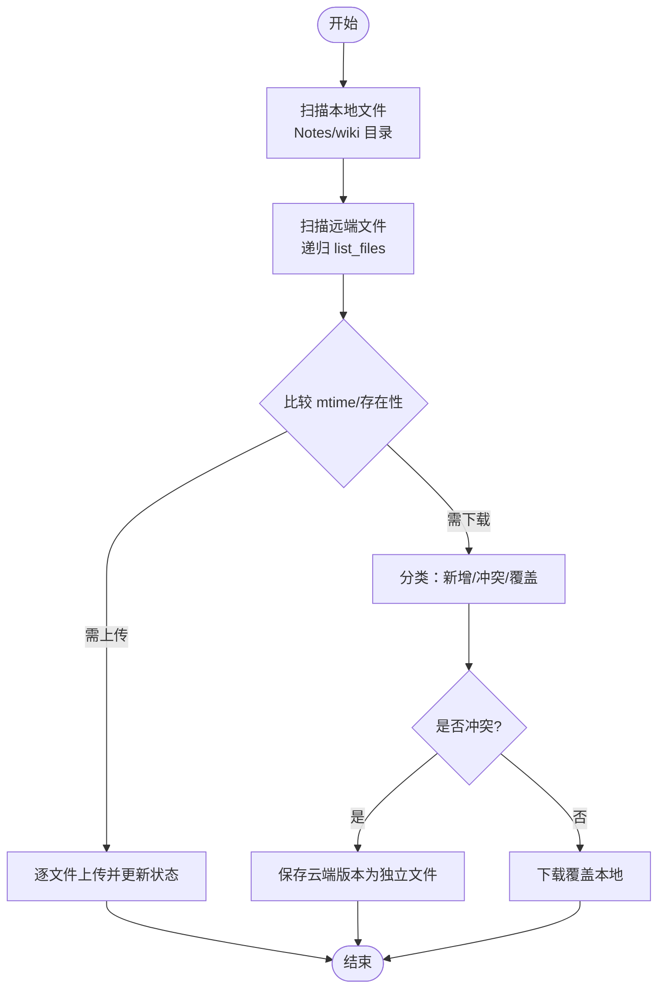
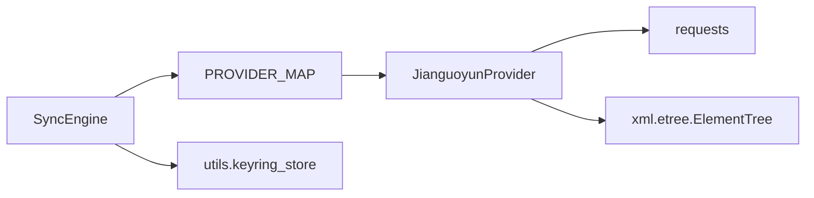

# 坚果云适配器

<cite>
**本文引用的文件**   
- [python/sidecar/cloud/providers/jianguoyun.py](file://python/sidecar/cloud/providers/jianguoyun.py)
- [python/sidecar/cloud/providers/base.py](file://python/sidecar/cloud/providers/base.py)
- [python/sidecar/cloud/providers/__init__.py](file://python/sidecar/cloud/providers/__init__.py)
- [python/sidecar/cloud/sync_engine.py](file://python/sidecar/cloud/sync_engine.py)
</cite>

## 目录
1. [简介](#简介)
2. [项目结构](#项目结构)
3. [核心组件](#核心组件)
4. [架构总览](#架构总览)
5. [详细组件分析](#详细组件分析)
6. [依赖关系分析](#依赖关系分析)
7. [性能考虑](#性能考虑)
8. [故障排查指南](#故障排查指南)
9. [结论](#结论)
10. [附录](#附录)

## 简介
本技术文档聚焦于“坚果云适配器”的实现与集成，覆盖以下关键主题：
- 基于 WebDAV 的 RESTful 风格交互（PROPFIND、PUT、GET、MKCOL）
- Basic 认证方式与凭据管理（用户名与应用密码）
- 文件同步引擎的增量同步、变更检测与冲突处理策略
- WebDAV 协议支持能力边界（标准文件操作、元数据解析、搜索查询现状与建议）
- 性能优化建议（连接复用、批量/并发控制、缓存策略等）

说明：当前实现采用 WebDAV 接口进行文件访问与同步，未使用坚果云的私有 REST API；因此不涉及“API Token 管理与请求签名机制”。

## 项目结构
围绕坚果云适配器的相关代码位于 sidecar/cloud 子系统中，主要包含：
- 提供者抽象与具体实现
- 多提供商注册表
- 同步引擎（本地与云端扫描、差异计算、上传下载、状态持久化）

图示来源
- [python/sidecar/cloud/providers/base.py:15-41](file://python/sidecar/cloud/providers/base.py#L15-L41)
- [python/sidecar/cloud/providers/jianguoyun.py:10-34](file://python/sidecar/cloud/providers/jianguoyun.py#L10-L34)
- [python/sidecar/cloud/providers/__init__.py:12-22](file://python/sidecar/cloud/providers/__init__.py#L12-L22)
- [python/sidecar/cloud/sync_engine.py:37-44](file://python/sidecar/cloud/sync_engine.py#L37-L44)

章节来源
- [python/sidecar/cloud/providers/base.py:1-41](file://python/sidecar/cloud/providers/base.py#L1-L41)
- [python/sidecar/cloud/providers/jianguoyun.py:1-34](file://python/sidecar/cloud/providers/jianguoyun.py#L1-L34)
- [python/sidecar/cloud/providers/__init__.py:1-22](file://python/sidecar/cloud/providers/__init__.py#L1-L22)
- [python/sidecar/cloud/sync_engine.py:1-44](file://python/sidecar/cloud/sync_engine.py#L1-L44)

## 核心组件
- CloudProvider 抽象基类：定义统一的云存储接口（认证、列举、上传、下载、创建目录、认证状态检查）。
- JianguoyunProvider：基于 WebDAV 的具体实现，提供 Basic 认证、目录遍历、文件上传/下载、目录创建。
- SyncEngine：负责本地与云端文件的增量同步、冲突检测与处理、状态持久化与凭据安全存储。

章节来源
- [python/sidecar/cloud/providers/base.py:15-41](file://python/sidecar/cloud/providers/base.py#L15-L41)
- [python/sidecar/cloud/providers/jianguoyun.py:10-34](file://python/sidecar/cloud/providers/jianguoyun.py#L10-L34)
- [python/sidecar/cloud/sync_engine.py:37-44](file://python/sidecar/cloud/sync_engine.py#L37-L44)

## 架构总览
整体调用链从 SyncEngine 出发，通过 PROVIDER_MAP 选择具体提供者（如 JianguoyunProvider），再调用其 WebDAV 方法完成实际 I/O。

图示来源
- [python/sidecar/cloud/sync_engine.py:337-342](file://python/sidecar/cloud/sync_engine.py#L337-L342)
- [python/sidecar/cloud/providers/__init__.py:22](file://python/sidecar/cloud/providers/__init__.py#L22)
- [python/sidecar/cloud/providers/jianguoyun.py:92-161](file://python/sidecar/cloud/providers/jianguoyun.py#L92-L161)

## 详细组件分析

### 组件一：JianguoyunProvider（坚果云 WebDAV 适配器）
- 认证方式
  - 使用 Basic 认证，凭据为“用户名 + 应用密码”，由 AUTH_FIELDS 描述表单字段类型与占位符。
  - authenticate/is_authenticated 通过向根路径发起 Depth=0 的 PROPFIND 验证连通性与凭据有效性。
- 基础 URL 与根目录
  - DAV_BASE 指向官方 WebDAV 地址，REMOTE_ROOT 固定为 NoteAI，所有远程路径均以此前缀拼接。
- 文件列举与元数据
  - 使用 Depth=1 的 PROPFIND 获取子项，解析 DAV XML 中的 resourcetype/getcontentlength/getlastmodified，转换为 CloudFileInfo。
- 文件上传/下载
  - 上传：PUT 到目标 URL，自动确保父目录存在。
  - 下载：GET 流式写入本地文件，按块迭代避免大文件内存峰值。
- 目录创建
  - MKCOL 逐级创建目录，兼容服务端已存在目录的状态码。

图示来源
- [python/sidecar/cloud/providers/base.py:15-41](file://python/sidecar/cloud/providers/base.py#L15-L41)
- [python/sidecar/cloud/providers/jianguoyun.py:10-34](file://python/sidecar/cloud/providers/jianguoyun.py#L10-L34)
- [python/sidecar/cloud/providers/jianguoyun.py:71-90](file://python/sidecar/cloud/providers/jianguoyun.py#L71-L90)
- [python/sidecar/cloud/providers/jianguoyun.py:92-161](file://python/sidecar/cloud/providers/jianguoyun.py#L92-L161)

章节来源
- [python/sidecar/cloud/providers/jianguoyun.py:10-34](file://python/sidecar/cloud/providers/jianguoyun.py#L10-L34)
- [python/sidecar/cloud/providers/jianguoyun.py:35-70](file://python/sidecar/cloud/providers/jianguoyun.py#L35-L70)
- [python/sidecar/cloud/providers/jianguoyun.py:92-161](file://python/sidecar/cloud/providers/jianguoyun.py#L92-L161)

### 组件二：SyncEngine（增量同步与冲突处理）
- 扫描与差异计算
  - 本地扫描：仅遍历 Notes 与 wiki 两个目录，忽略隐藏文件，记录相对路径、mtime、size。
  - 远端扫描：递归调用 provider.list_files，将目录与文件分别处理，构建 SyncFile 列表。
  - 推送决策：若远端不存在或本地 mtime 晚于远端超过阈值（秒级容差），则判定需要上传。
  - 拉取决策：若本地不存在或远端 mtime 晚于本地超过阈值，则判定需要下载；同时识别冲突场景。
- 冲突处理
  - 当检测到冲突时，优先保留本地版本，并将云端版本以带时间戳的文件名另存，避免覆盖用户修改。
- 安全与路径校验
  - 强制限制下载目标必须在允许同步目录内，防止路径穿越。
- 状态与配置持久化
  - 在 .noteai 目录下保存 cloud_sync_state.json 与 cloud_sync_config.json。
  - 敏感字段（如用户名、应用密码）不直接落盘，而是转存至系统钥匙串，JSON 中仅保留占位符。

图示来源
- [python/sidecar/cloud/sync_engine.py:62-87](file://python/sidecar/cloud/sync_engine.py#L62-L87)
- [python/sidecar/cloud/sync_engine.py:89-111](file://python/sidecar/cloud/sync_engine.py#L89-L111)
- [python/sidecar/cloud/sync_engine.py:119-163](file://python/sidecar/cloud/sync_engine.py#L119-L163)
- [python/sidecar/cloud/sync_engine.py:165-214](file://python/sidecar/cloud/sync_engine.py#L165-L214)
- [python/sidecar/cloud/sync_engine.py:216-256](file://python/sidecar/cloud/sync_engine.py#L216-L256)
- [python/sidecar/cloud/sync_engine.py:258-269](file://python/sidecar/cloud/sync_engine.py#L258-L269)
- [python/sidecar/cloud/sync_engine.py:271-335](file://python/sidecar/cloud/sync_engine.py#L271-L335)

章节来源
- [python/sidecar/cloud/sync_engine.py:12-17](file://python/sidecar/cloud/sync_engine.py#L12-L17)
- [python/sidecar/cloud/sync_engine.py:62-87](file://python/sidecar/cloud/sync_engine.py#L62-L87)
- [python/sidecar/cloud/sync_engine.py:89-111](file://python/sidecar/cloud/sync_engine.py#L89-L111)
- [python/sidecar/cloud/sync_engine.py:119-163](file://python/sidecar/cloud/sync_engine.py#L119-L163)
- [python/sidecar/cloud/sync_engine.py:165-214](file://python/sidecar/cloud/sync_engine.py#L165-L214)
- [python/sidecar/cloud/sync_engine.py:216-256](file://python/sidecar/cloud/sync_engine.py#L216-L256)
- [python/sidecar/cloud/sync_engine.py:258-269](file://python/sidecar/cloud/sync_engine.py#L258-L269)
- [python/sidecar/cloud/sync_engine.py:271-335](file://python/sidecar/cloud/sync_engine.py#L271-L335)

### 组件三：提供商注册表
- providers/__init__.py 维护 ALL_PROVIDERS 列表与 PROVIDER_MAP 映射，便于根据名称动态构造具体提供者实例。
- 当前已注册包括 OneDrive、百度、阿里云、123 盘、坚果云、腾讯云 COS、iCloud 等。

章节来源
- [python/sidecar/cloud/providers/__init__.py:12-22](file://python/sidecar/cloud/providers/__init__.py#L12-L22)

## 依赖关系分析
- 松耦合设计：SyncEngine 仅依赖 CloudProvider 抽象，通过 PROVIDER_MAP 解耦具体实现。
- 外部依赖：
  - requests：用于 HTTP/WebDAV 通信。
  - xml.etree.ElementTree：解析 WebDAV 返回的 XML。
  - os/pathlib：文件系统操作与路径安全校验。
  - utils.keyring_store：凭据的安全存取。

图示来源
- [python/sidecar/cloud/sync_engine.py:337-342](file://python/sidecar/cloud/sync_engine.py#L337-L342)
- [python/sidecar/cloud/providers/__init__.py:22](file://python/sidecar/cloud/providers/__init__.py#L22)
- [python/sidecar/cloud/providers/jianguoyun.py:1-7](file://python/sidecar/cloud/providers/jianguoyun.py#L1-L7)
- [python/sidecar/cloud/sync_engine.py:9](file://python/sidecar/cloud/sync_engine.py#L9)

章节来源
- [python/sidecar/cloud/providers/__init__.py:1-22](file://python/sidecar/cloud/providers/__init__.py#L1-L22)
- [python/sidecar/cloud/providers/jianguoyun.py:1-7](file://python/sidecar/cloud/providers/jianguoyun.py#L1-L7)
- [python/sidecar/cloud/sync_engine.py:9](file://python/sidecar/cloud/sync_engine.py#L9)

## 性能考虑
以下为通用优化建议，结合当前实现可逐步落地：
- 连接复用与超时
  - 使用会话对象复用 TCP 连接，减少握手开销；合理设置 connect/read 超时与重试退避。
- 并发与限流
  - 对上传/下载引入线程池或协程池，限制最大并发数，避免打满带宽或触发服务端限流。
- 批量与分片
  - 大文件分块传输（当前下载已按块写入，上传亦可考虑分片断点续传）。
- 缓存策略
  - 本地缓存远端目录树与元数据（mtime/size），减少频繁 PROPFIND 调用；对热点文件增加短期缓存。
- 增量与去重
  - 利用 mtime/size 快速跳过未变更文件；必要时引入内容哈希提升准确性。
- 资源清理
  - 及时关闭响应流、释放临时文件，避免资源泄漏。

[本节为通用指导，无需源码引用]

## 故障排查指南
- 认证失败
  - 现象：authenticate/is_authenticated 返回失败。
  - 排查要点：确认用户名与应用密码正确；网络可达；服务端返回非 200/207。
  - 参考位置：认证与探测逻辑。
- 列举目录为空或异常
  - 现象：list_files 返回空列表或解析错误。
  - 排查要点：Depth 头是否正确；XML 命名空间解析；权限与路径是否存在。
  - 参考位置：列举与解析逻辑。
- 上传/下载失败
  - 现象：upload_file/download_file 返回 False。
  - 排查要点：HTTP 状态码；父目录是否存在；磁盘空间与权限；网络中断。
  - 参考位置：上传/下载逻辑。
- 同步状态不一致
  - 现象：push/pull 后状态未更新或重复同步。
  - 排查要点：cloud_sync_state.json 读写权限；mtime 精度与容差；跨时区时间差异。
  - 参考位置：状态加载/保存与差异计算。
- 凭据泄露风险
  - 现象：配置文件含明文敏感信息。
  - 排查要点：确认 keyring_store 正常写入；JSON 中仅保留占位符；清理旧凭据。
  - 参考位置：凭据持久化逻辑。

章节来源
- [python/sidecar/cloud/providers/jianguoyun.py:35-70](file://python/sidecar/cloud/providers/jianguoyun.py#L35-L70)
- [python/sidecar/cloud/providers/jianguoyun.py:92-129](file://python/sidecar/cloud/providers/jianguoyun.py#L92-L129)
- [python/sidecar/cloud/providers/jianguoyun.py:131-149](file://python/sidecar/cloud/providers/jianguoyun.py#L131-L149)
- [python/sidecar/cloud/sync_engine.py:48-61](file://python/sidecar/cloud/sync_engine.py#L48-L61)
- [python/sidecar/cloud/sync_engine.py:271-335](file://python/sidecar/cloud/sync_engine.py#L271-L335)

## 结论
- 坚果云适配器通过 WebDAV 提供了稳定的文件访问能力，配合 SyncEngine 实现了可靠的增量同步与冲突处理。
- 当前实现未涉及坚果云私有 REST API 的 Token 与签名机制；如需更细粒度能力（如搜索、高级元数据），可在后续扩展中引入专用 API。
- 建议在现有基础上完善连接复用、并发控制与缓存策略，以提升大规模同步的性能与稳定性。

[本节为总结性内容，无需源码引用]

## 附录

### WebDAV 协议支持现状与建议
- 已支持
  - 标准文件操作：PROPFIND（列举）、PUT（上传）、GET（下载）、MKCOL（创建目录）。
  - 元数据：resourcetype、getcontentlength、getlastmodified 的读取与转换。
- 尚未支持
  - 搜索查询：当前未实现基于关键词的远端搜索；可通过本地全文索引替代或在后续引入服务端搜索接口。
  - 高级元数据：如自定义属性、版本历史等，可按需在解析层扩展。
- 建议
  - 在 SyncEngine 层增加“远端搜索缓存”或“按需搜索”能力，结合本地索引加速检索体验。

[本节为概念性说明，无需源码引用]