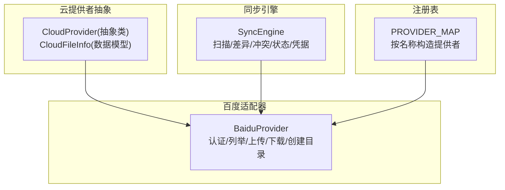
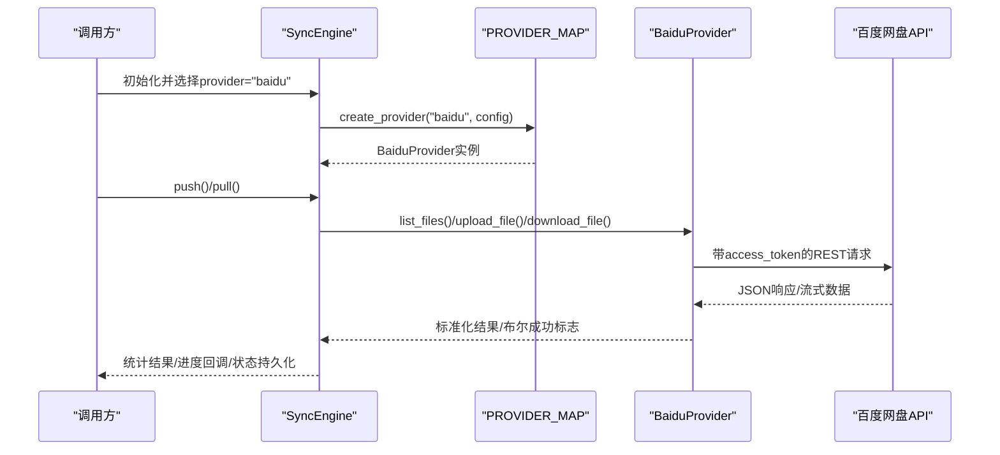
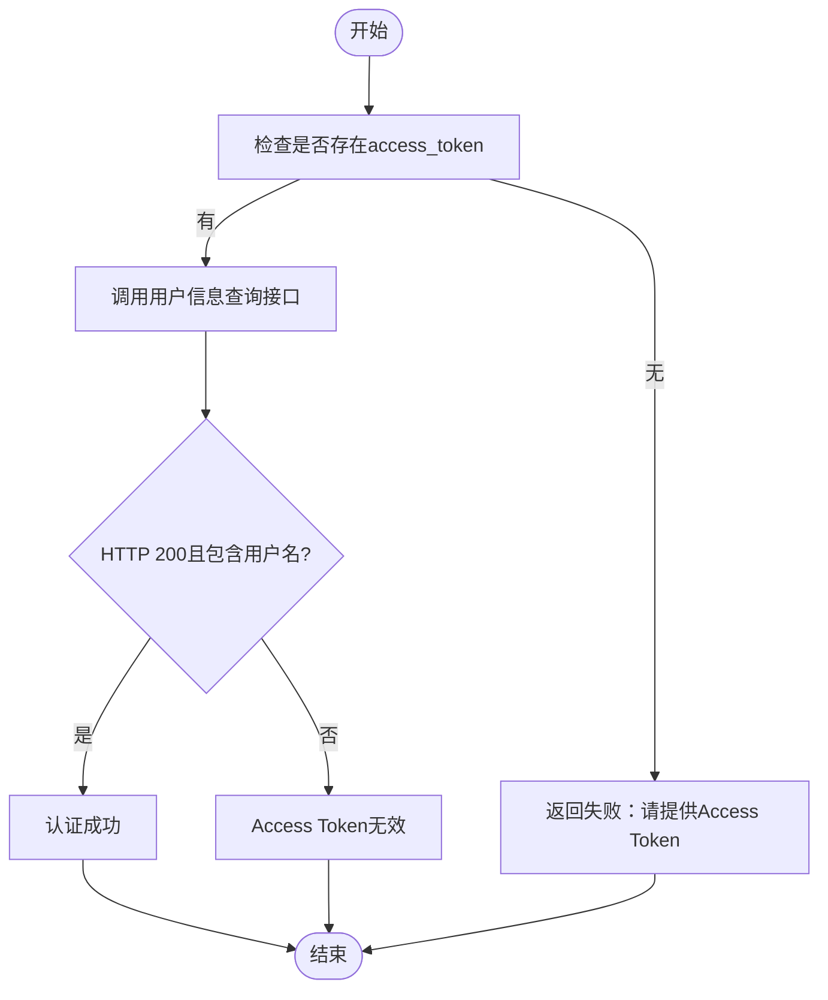
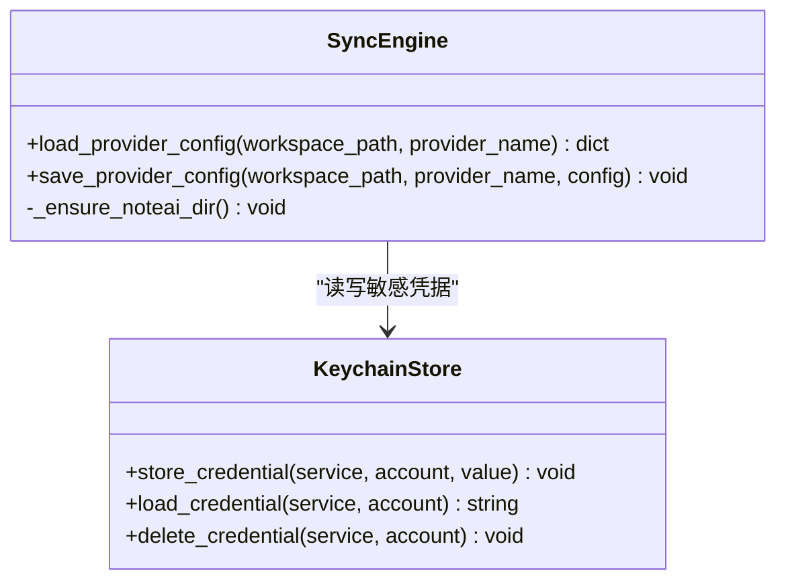
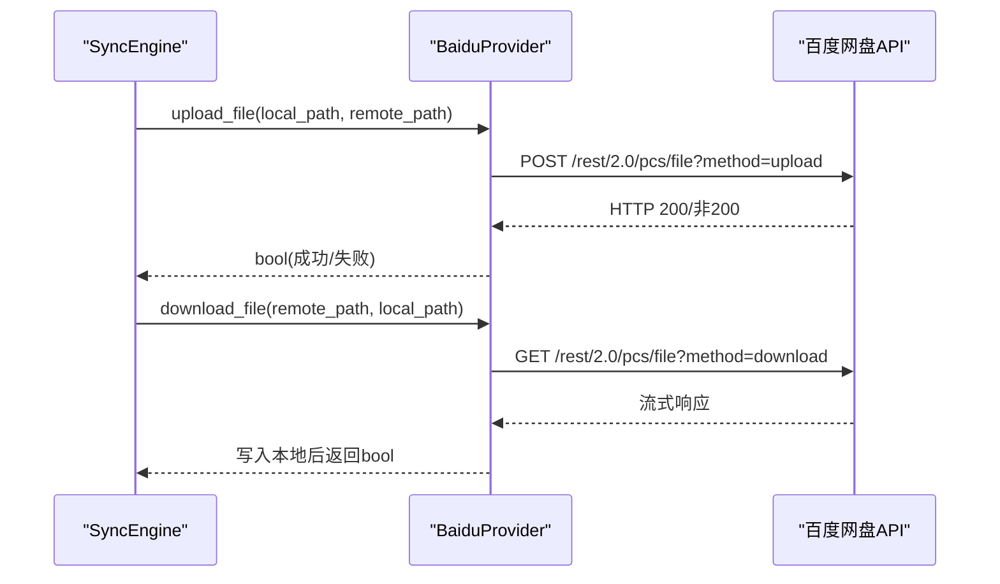
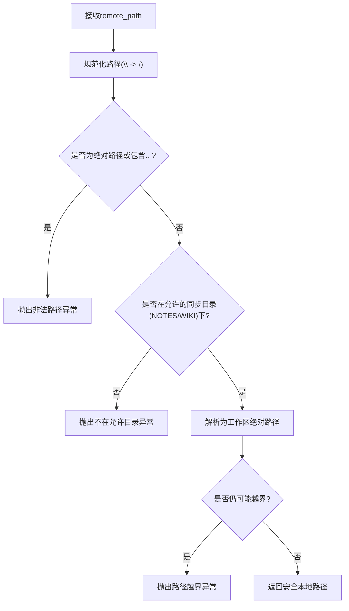
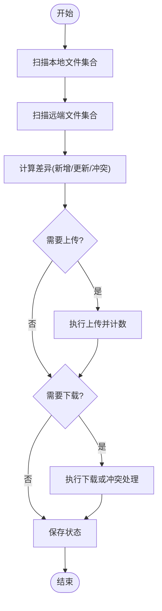
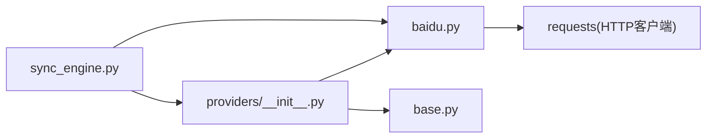

# 百度网盘适配器

<cite>
**本文引用的文件**   
- [baidu.py](file://python/sidecar/cloud/providers/baidu.py)
- [base.py](file://python/sidecar/cloud/providers/base.py)
- [__init__.py](file://python/sidecar/cloud/providers/__init__.py)
- [sync_engine.py](file://python/sidecar/cloud/sync_engine.py)
- [test_cloud_sync_engine.py](file://tests/unit/test_cloud_sync_engine.py)
- [error_codes.py](file://utils/error_codes.py)
</cite>

## 目录
1. [简介](#简介)
2. [项目结构](#项目结构)
3. [核心组件](#核心组件)
4. [架构总览](#架构总览)
5. [详细组件分析](#详细组件分析)
6. [依赖关系分析](#依赖关系分析)
7. [性能与限制](#性能与限制)
8. [故障排除指南](#故障排除指南)
9. [结论](#结论)
10. [附录](#附录)

## 简介
本技术文档聚焦于“百度网盘适配器”的实现与集成，覆盖以下关键主题：
- OAuth2.0 授权流程说明与 Access Token 获取方式（结合现有实现）
- API Key/Access Token 的存储与应用配置管理
- 文件操作的具体实现：上传、下载、目录创建、列表枚举、元数据同步策略
- 速率限制与配额管理的约束与应对建议
- 调试与故障排除：常见错误码、网络超时重试、缓存策略优化等实用技巧

## 项目结构
百度网盘适配相关代码位于云同步子系统内，采用“提供者抽象 + 具体实现 + 同步引擎”的分层组织方式：
- 提供者抽象：定义统一的 CloudProvider 接口与通用数据结构 CloudFileInfo
- 百度提供者：基于 requests 直接调用百度网盘 REST API
- 同步引擎：负责本地与云端扫描、差异计算、冲突处理、状态持久化与凭据安全存储
- 注册表：将各云盘提供者统一注册到 PROVIDER_MAP，便于动态实例化

图示来源
- [base.py:1-41](file://python/sidecar/cloud/providers/base.py#L1-L41)
- [baidu.py:1-115](file://python/sidecar/cloud/providers/baidu.py#L1-L115)
- [sync_engine.py:1-342](file://python/sidecar/cloud/sync_engine.py#L1-L342)
- [__init__.py:1-37](file://python/sidecar/cloud/providers/__init__.py#L1-L37)

章节来源
- [base.py:1-41](file://python/sidecar/cloud/providers/base.py#L1-L41)
- [baidu.py:1-115](file://python/sidecar/cloud/providers/baidu.py#L1-L115)
- [sync_engine.py:1-342](file://python/sidecar/cloud/sync_engine.py#L1-L342)
- [__init__.py:1-37](file://python/sidecar/cloud/providers/__init__.py#L1-L37)

## 核心组件
- CloudProvider 抽象类：定义认证、列举、上传、下载、创建目录、认证状态检查等统一接口。
- CloudFileInfo：描述远程文件的相对路径、文件名、大小、修改时间、是否目录、云盘 ID 等元信息。
- BaiduProvider：实现百度网盘的认证校验、目录列举、文件上传/下载、目录创建等能力。
- SyncEngine：负责工作区 Notes 与 wiki 两个目录的扫描、差异对比、冲突处理、进度回调、状态持久化与凭据安全存储。
- PROVIDER_MAP：根据 provider_name 动态创建对应提供者实例。

章节来源
- [base.py:1-41](file://python/sidecar/cloud/providers/base.py#L1-L41)
- [baidu.py:1-115](file://python/sidecar/cloud/providers/baidu.py#L1-L115)
- [sync_engine.py:1-342](file://python/sidecar/cloud/sync_engine.py#L1-L342)
- [__init__.py:1-37](file://python/sidecar/cloud/providers/__init__.py#L1-L37)

## 架构总览
百度网盘适配器在整体系统中的位置如下：
- 上层通过 SyncEngine 发起 push/pull 操作
- SyncEngine 使用 PROVIDER_MAP 构造 BaiduProvider
- BaiduProvider 以 access_token 为鉴权参数，调用百度网盘 xpan/pcs REST API
- 凭据（如 access_token）通过系统钥匙串或安全文件存储，JSON 中仅保留占位符

图示来源
- [sync_engine.py:37-118](file://python/sidecar/cloud/sync_engine.py#L37-L118)
- [baidu.py:20-115](file://python/sidecar/cloud/providers/baidu.py#L20-L115)
- [__init__.py:22-22](file://python/sidecar/cloud/providers/__init__.py#L22-L22)

## 详细组件分析

### 认证与授权（OAuth2.0 与 Access Token）
- 当前实现采用“Access Token”模式进行鉴权，未内置浏览器端 OAuth2.0 授权码流程。
- authenticate/is_authenticated 通过调用用户信息查询接口验证 token 有效性。
- 若需完整 OAuth2.0 流程，可在上层服务中完成授权码换取 token，再将 token 传入配置。

图示来源
- [baidu.py:24-52](file://python/sidecar/cloud/providers/baidu.py#L24-L52)

章节来源
- [baidu.py:24-52](file://python/sidecar/cloud/providers/baidu.py#L24-L52)

### 应用配置与凭据管理
- 配置加载：从工作区 .noteai/cloud_sync_config.json 读取指定 provider 的配置；兼容旧路径迁移。
- 敏感字段：对 key/password/token/secret/credential/auth 等关键字段，实际值存入系统钥匙串，JSON 中仅保留占位符。
- 运行时恢复：加载时自动用钥匙串中的真实值替换占位符。

图示来源
- [sync_engine.py:271-334](file://python/sidecar/cloud/sync_engine.py#L271-L334)

章节来源
- [sync_engine.py:271-334](file://python/sidecar/cloud/sync_engine.py#L271-L334)
- [test_cloud_sync_engine.py:27-48](file://tests/unit/test_cloud_sync_engine.py#L27-L48)

### 文件操作实现
- 目录根：所有远端路径以固定前缀作为根目录，避免跨账户访问。
- 列举：调用目录列表接口，映射为 CloudFileInfo 列表，包含路径、名称、大小、mtime、是否目录、云盘 ID。
- 上传：以表单形式上传文件，设置合理超时。
- 下载：流式分块写入本地，确保大文件内存占用可控。
- 创建目录：递归确保父目录存在后再上传。

图示来源
- [baidu.py:80-115](file://python/sidecar/cloud/providers/baidu.py#L80-L115)
- [sync_engine.py:112-163](file://python/sidecar/cloud/sync_engine.py#L112-L163)

章节来源
- [baidu.py:54-115](file://python/sidecar/cloud/providers/baidu.py#L54-L115)
- [sync_engine.py:112-163](file://python/sidecar/cloud/sync_engine.py#L112-L163)

### 目录结构与路径安全
- 同步范围：仅允许 Notes 与 wiki 两个目录参与同步，防止越界访问。
- 路径校验：拒绝绝对路径、包含 .. 的路径，确保最终解析路径在工作区内。
- 冲突处理：当云端 mtime 更新且本地存在同名文件时，优先保存云端版本为独立文件，避免覆盖本地。

图示来源
- [sync_engine.py:181-197](file://python/sidecar/cloud/sync_engine.py#L181-L197)

章节来源
- [sync_engine.py:181-197](file://python/sidecar/cloud/sync_engine.py#L181-L197)
- [test_cloud_sync_engine.py:15-24](file://tests/unit/test_cloud_sync_engine.py#L15-L24)

### 元数据同步策略
- 本地扫描：遍历 Notes 与 wiki，收集 relative_path、mtime、size。
- 远端扫描：递归调用 list_files，聚合为相同结构的列表。
- 差异判定：
  - 上传：本地不存在或本地 mtime 晚于远端超过阈值则上传。
  - 下载：远端不存在于本地，或远端 mtime 早于本地超过阈值则下载。
- 状态持久化：记录最近一次 push/pull 时间与使用的 provider。

图示来源
- [sync_engine.py:62-118](file://python/sidecar/cloud/sync_engine.py#L62-L118)
- [sync_engine.py:119-163](file://python/sidecar/cloud/sync_engine.py#L119-L163)
- [sync_engine.py:216-256](file://python/sidecar/cloud/sync_engine.py#L216-L256)

章节来源
- [sync_engine.py:62-118](file://python/sidecar/cloud/sync_engine.py#L62-L118)
- [sync_engine.py:119-163](file://python/sidecar/cloud/sync_engine.py#L119-L163)
- [sync_engine.py:216-256](file://python/sidecar/cloud/sync_engine.py#L216-L256)

## 依赖关系分析
- 模块耦合：
  - BaiduProvider 依赖 requests 进行 HTTP 通信，遵循 CloudProvider 抽象。
  - SyncEngine 依赖 PROVIDER_MAP 动态构造提供者，并通过 keyring_store 管理凭据。
- 外部依赖：
  - 百度网盘 REST API（xpan/pcs）。
  - 操作系统钥匙串（用于安全存储敏感字段）。

图示来源
- [__init__.py:1-37](file://python/sidecar/cloud/providers/__init__.py#L1-L37)
- [baidu.py:1-115](file://python/sidecar/cloud/providers/baidu.py#L1-L115)
- [sync_engine.py:1-342](file://python/sidecar/cloud/sync_engine.py#L1-L342)

章节来源
- [__init__.py:1-37](file://python/sidecar/cloud/providers/__init__.py#L1-L37)
- [baidu.py:1-115](file://python/sidecar/cloud/providers/baidu.py#L1-L115)
- [sync_engine.py:1-342](file://python/sidecar/cloud/sync_engine.py#L1-L342)

## 性能与限制
- 网络超时：
  - 认证与目录列举：较短超时（秒级），快速失败。
  - 上传/下载：较长超时（分钟级），支持流式下载以降低内存占用。
- 并发与限流：
  - 当前实现为串行处理，未内置指数退避与并发控制。
  - 建议在调用层增加重试与退避策略，避免触发服务端速率限制。
- 配额与限额：
  - 单文件大小限制、每日上传/下载配额由百度网盘服务端决定，应在上层做监控与告警。
  - 建议对大文件启用断点续传与分片上传（需在适配器扩展）。
- 缓存策略：
  - 本地状态文件记录最近一次同步时间与 provider，可用于增量判断。
  - 可考虑引入 TTL 缓存以减少重复扫描开销（需评估一致性）。

[本节为通用指导，不直接分析具体文件]

## 故障排除指南
- 认证失败
  - 现象：authenticate/is_authenticated 返回失败。
  - 排查：确认 access_token 有效；检查网络连通性；查看返回 JSON 是否包含用户名字段。
  - 参考：认证逻辑与返回分支。
- 路径越界/非法路径
  - 现象：下载时抛出路径非法或越界异常。
  - 排查：检查 remote_path 是否包含 .. 或绝对路径；确认是否在允许同步目录内。
  - 参考：路径安全校验与测试用例。
- 凭据丢失
  - 现象：配置文件中的敏感字段为空或仅为占位符。
  - 排查：确认系统钥匙串中是否存在对应 service/account；检查 load/save 流程是否正确。
  - 参考：凭据加载与迁移逻辑。
- 网络错误与超时
  - 现象：请求超时或连接失败。
  - 建议：在调用层增加重试与指数退避；对长耗时操作设置更合理的超时。
- 结构化错误码
  - 可通过 RPC 层的错误码体系统一返回错误信息，便于前端展示与自动化处理。
  - 参考：错误码定义与构造方法。

章节来源
- [baidu.py:24-52](file://python/sidecar/cloud/providers/baidu.py#L24-L52)
- [sync_engine.py:181-197](file://python/sidecar/cloud/sync_engine.py#L181-L197)
- [test_cloud_sync_engine.py:15-24](file://tests/unit/test_cloud_sync_engine.py#L15-L24)
- [sync_engine.py:271-334](file://python/sidecar/cloud/sync_engine.py#L271-L334)
- [error_codes.py:1-120](file://utils/error_codes.py#L1-120)

## 结论
百度网盘适配器在当前实现中以简洁可靠的方式完成了认证校验、目录列举、文件上传/下载与目录创建等核心能力，并通过 SyncEngine 实现了安全的本地-云端同步流程与凭据管理。针对生产环境，建议在上层补充重试与退避、并发控制、大文件分片上传与断点续传、以及更完善的错误码映射与监控告警，以提升稳定性与用户体验。

[本节为总结性内容，不直接分析具体文件]

## 附录
- 常用 API 端点（由适配器内部常量定义）
  - 认证与元数据：/rest/2.0/xpan
  - 文件传输：/rest/2.0/pcs
- 同步目录白名单
  - Notes、wiki
- 配置与状态文件
  - cloud_sync_config.json（工作区 .noteai 目录下）
  - cloud_sync_state.json（工作区 .noteai 目录下）

[本节为概念性说明，不直接分析具体文件]