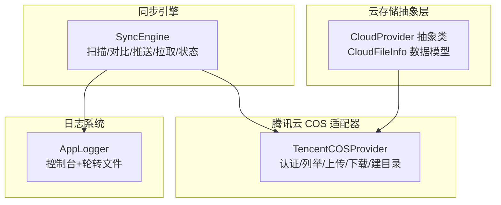
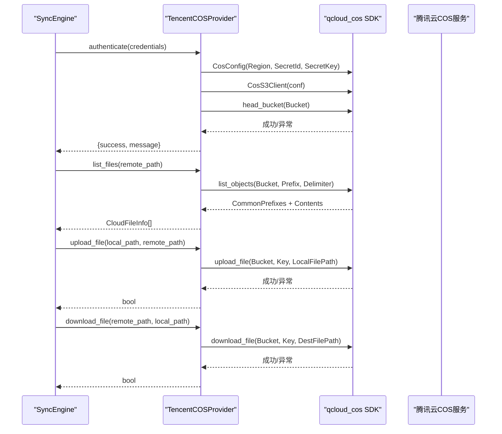
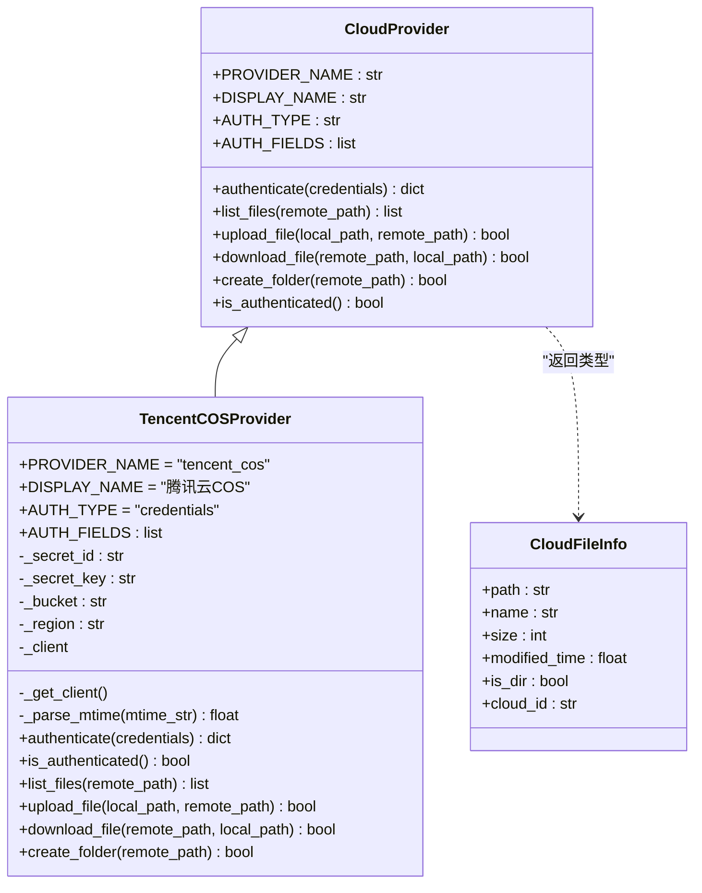
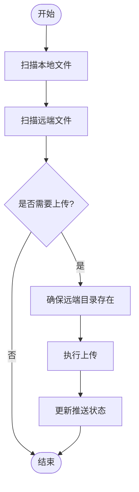
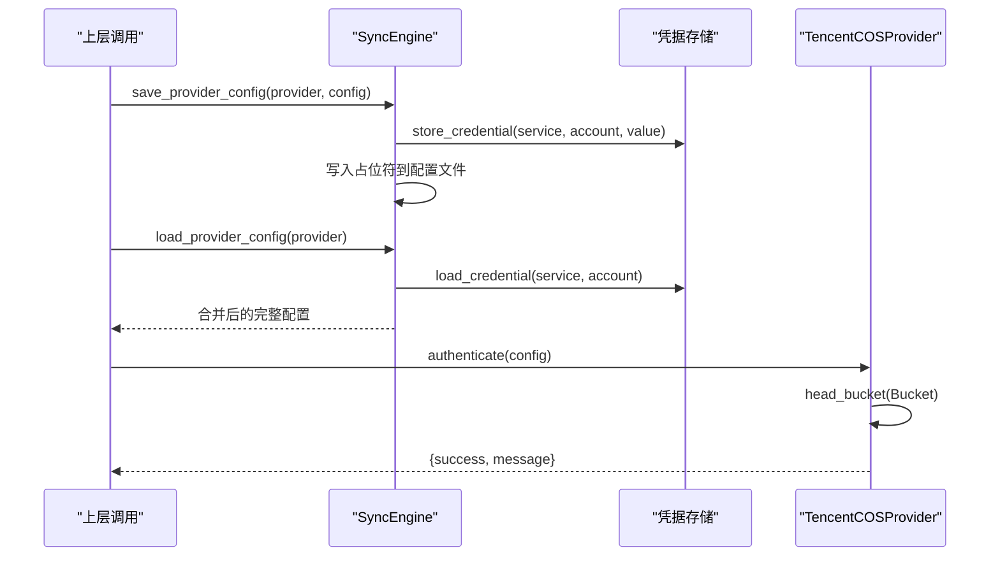
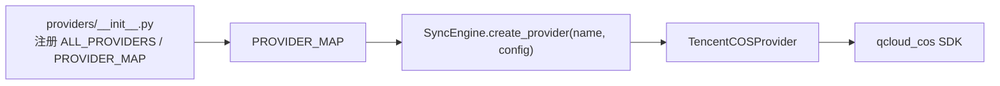
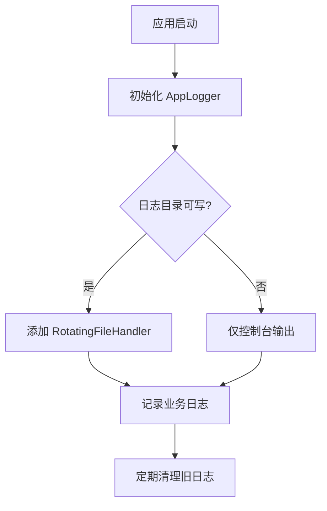

# 腾讯云 COS 适配器

<cite>
**本文引用的文件**   
- [tencent_cos.py](file://python/sidecar/cloud/providers/tencent_cos.py)
- [base.py](file://python/sidecar/cloud/providers/base.py)
- [__init__.py](file://python/sidecar/cloud/providers/__init__.py)
- [sync_engine.py](file://python/sidecar/cloud/sync_engine.py)
- [logger.py](file://utils/logger.py)
</cite>

## 目录
1. [简介](#简介)
2. [项目结构](#项目结构)
3. [核心组件](#核心组件)
4. [架构总览](#架构总览)
5. [详细组件分析](#详细组件分析)
6. [依赖关系分析](#依赖关系分析)
7. [性能与优化建议](#性能与优化建议)
8. [监控与日志配置](#监控与日志配置)
9. [故障排查指南](#故障排查指南)
10. [结论](#结论)

## 简介
本技术文档围绕“腾讯云对象存储（COS）适配器”的实现进行系统化说明，覆盖密钥管理、地域配置、存储桶策略、签名认证机制、高性能数据处理能力以及监控与日志配置等企业级运维需求。该适配器基于 Python SDK 封装，提供统一的云存储抽象接口，并通过同步引擎实现本地工作区与云端存储的增量同步。

## 项目结构
与腾讯云 COS 适配器相关的代码主要位于 sidecar 的云存储模块中：
- 提供者抽象与数据模型定义在 providers/base.py
- 腾讯云 COS 具体实现位于 providers/tencent_cos.py
- 多提供者注册与导出在 providers/__init__.py
- 同步编排逻辑在 cloud/sync_engine.py
- 应用日志工具在 utils/logger.py

图表来源
- [base.py:1-41](file://python/sidecar/cloud/providers/base.py#L1-L41)
- [tencent_cos.py:1-155](file://python/sidecar/cloud/providers/tencent_cos.py#L1-L155)
- [sync_engine.py:1-342](file://python/sidecar/cloud/sync_engine.py#L1-L342)
- [logger.py:1-126](file://utils/logger.py#L1-L126)

章节来源
- [base.py:1-41](file://python/sidecar/cloud/providers/base.py#L1-L41)
- [tencent_cos.py:1-155](file://python/sidecar/cloud/providers/tencent_cos.py#L1-L155)
- [__init__.py:1-37](file://python/sidecar/cloud/providers/__init__.py#L1-L37)
- [sync_engine.py:1-342](file://python/sidecar/cloud/sync_engine.py#L1-L342)
- [logger.py:1-126](file://utils/logger.py#L1-L126)

## 核心组件
- CloudProvider 抽象类与 CloudFileInfo 数据模型：定义统一接口与文件元信息结构，屏蔽不同云厂商差异。
- TencentCOSProvider：实现腾讯云 COS 的认证、列举、上传、下载、创建目录等能力；通过 qcloud_cos SDK 完成实际调用。
- SyncEngine：负责本地与远端的增量同步，包括扫描、冲突处理、进度回调、状态持久化等。
- AppLogger：线程安全的日志管理器，支持控制台输出与按大小轮转的文件日志，并提供最近日志读取能力。

章节来源
- [base.py:1-41](file://python/sidecar/cloud/providers/base.py#L1-L41)
- [tencent_cos.py:1-155](file://python/sidecar/cloud/providers/tencent_cos.py#L1-L155)
- [sync_engine.py:1-342](file://python/sidecar/cloud/sync_engine.py#L1-L342)
- [logger.py:1-126](file://utils/logger.py#L1-L126)

## 架构总览
下图展示了从上层同步引擎到腾讯云 COS 适配器的调用链路，以及认证、列举、上传、下载的关键流程。

图表来源
- [tencent_cos.py:28-77](file://python/sidecar/cloud/providers/tencent_cos.py#L28-L77)
- [tencent_cos.py:79-155](file://python/sidecar/cloud/providers/tencent_cos.py#L79-L155)
- [sync_engine.py:89-163](file://python/sidecar/cloud/sync_engine.py#L89-L163)

## 详细组件分析

### 腾讯云 COS 适配器（TencentCOSProvider）
- 认证与客户端初始化
  - 使用 SecretId、SecretKey、Bucket、Region 构建配置并创建客户端实例。
  - 首次认证时通过 head_bucket 校验连通性与权限。
  - 若未安装 cos-python-sdk-v5，返回明确的安装提示。
- 文件列举
  - 以固定远程前缀组织路径，结合 Delimiter 区分目录与文件。
  - 将 LastModified 解析为时间戳，统一为 CloudFileInfo 列表返回。
- 上传与下载
  - 上传：根据远程前缀拼接 Key，调用 SDK 上传接口。
  - 下载：确保本地目录存在后，调用 SDK 下载接口。
- 目录创建
  - 通过 put_object 写入空对象模拟目录。

图表来源
- [base.py:1-41](file://python/sidecar/cloud/providers/base.py#L1-L41)
- [tencent_cos.py:1-155](file://python/sidecar/cloud/providers/tencent_cos.py#L1-L155)

章节来源
- [tencent_cos.py:1-155](file://python/sidecar/cloud/providers/tencent_cos.py#L1-L155)
- [base.py:1-41](file://python/sidecar/cloud/providers/base.py#L1-L41)

### 同步引擎（SyncEngine）与 COS 集成
- 本地扫描
  - 仅扫描 Notes 与 wiki 两个根目录，忽略隐藏文件，收集相对路径、mtime、size。
- 远端扫描
  - 递归遍历远端目录，过滤出文件项，映射为 SyncFile。
- 推送（Push）
  - 比较本地与远端 mtime，超过阈值则判定需要上传。
  - 自动创建远端目录，逐个上传并统计成功/失败数量。
  - 更新 last_push 与 provider 名称到状态文件。
- 拉取（Pull）
  - 识别缺失或远端更新的冲突文件，优先保留本地版本并在冲突场景下保存云端版本为带时间戳的副本。
  - 更新 last_pull 与 provider 名称到状态文件。
- 安全路径校验
  - 对远端路径进行规范化与越界检查，确保只允许落盘到受控目录。

图表来源
- [sync_engine.py:62-163](file://python/sidecar/cloud/sync_engine.py#L62-L163)

章节来源
- [sync_engine.py:1-342](file://python/sidecar/cloud/sync_engine.py#L1-L342)

### 密钥管理与配置
- 敏感字段保护
  - 配置文件中的敏感键值（如 secret、key、token 等）会被替换为占位符，真实值保存在系统钥匙串或回退文件中。
  - 加载配置时，若检测到占位符且键名匹配敏感模式，会从凭据存储恢复真实值。
- 凭据账户命名
  - 采用 provider_name/key 的账户格式，避免不同提供者之间的凭据冲突。
- 认证流程
  - 适配器 authenticate 方法会校验必填字段并尝试 head_bucket 验证连通性。
  - is_authenticated 用于快速判断当前是否具备有效凭据与网络可达。

图表来源
- [sync_engine.py:271-334](file://python/sidecar/cloud/sync_engine.py#L271-L334)
- [tencent_cos.py:49-77](file://python/sidecar/cloud/providers/tencent_cos.py#L49-L77)

章节来源
- [sync_engine.py:271-334](file://python/sidecar/cloud/sync_engine.py#L271-L334)
- [tencent_cos.py:49-77](file://python/sidecar/cloud/providers/tencent_cos.py#L49-L77)

## 依赖关系分析
- 提供者注册
  - 所有云提供者通过 __init__.py 集中注册，形成 PROVIDER_MAP，便于动态创建实例。
- 运行时依赖
  - 腾讯云适配器依赖 qcloud_cos SDK，未安装时会返回明确错误提示。
- 耦合与内聚
  - 适配器与同步引擎通过抽象接口解耦，新增云厂商只需实现 CloudProvider 即可接入。

图表来源
- [__init__.py:1-37](file://python/sidecar/cloud/providers/__init__.py#L1-L37)
- [sync_engine.py:336-342](file://python/sidecar/cloud/sync_engine.py#L336-L342)
- [tencent_cos.py:28-38](file://python/sidecar/cloud/providers/tencent_cos.py#L28-L38)

章节来源
- [__init__.py:1-37](file://python/sidecar/cloud/providers/__init__.py#L1-L37)
- [sync_engine.py:336-342](file://python/sidecar/cloud/sync_engine.py#L336-L342)
- [tencent_cos.py:28-38](file://python/sidecar/cloud/providers/tencent_cos.py#L28-L38)

## 性能与优化建议
- 多线程上传
  - 当前实现为串行上传。对于大文件或大量小文件的批量同步，可考虑引入并发任务队列（例如线程池或进程池），并结合限速与重试策略提升吞吐与稳定性。
- 断点续传
  - 当前未实现分片与断点续传。针对大文件，可启用 SDK 的分片上传能力，并记录已上传片段状态以实现中断恢复。
- 压缩传输
  - 当前未启用传输压缩。可在上传前对文本类数据进行压缩（如 gzip），以降低带宽占用与传输时间。
- 并发控制与限流
  - 增加全局并发上限与单文件速率限制，避免对网络与目标存储造成压力。
- 缓存与去重
  - 对本地与远端元信息进行缓存，减少重复扫描与 API 调用；对相同内容做哈希去重，降低无效上传。

[本节为通用性能建议，不直接分析具体文件]

## 监控与日志配置
- 日志级别与输出
  - 控制台输出 INFO 及以上级别，文件输出 DEBUG 及以上级别，并按大小轮转，保留最近若干份。
  - 自动清理超过 30 天的旧日志文件。
- 关键操作日志
  - 同步引擎在列举失败、上传失败、下载失败等场景记录警告日志，便于问题定位。
- 最近日志读取
  - 提供获取最近 N 行日志的能力，便于前端或诊断工具展示。

图表来源
- [logger.py:1-126](file://utils/logger.py#L1-L126)
- [sync_engine.py:94-163](file://python/sidecar/cloud/sync_engine.py#L94-L163)

章节来源
- [logger.py:1-126](file://utils/logger.py#L1-L126)
- [sync_engine.py:94-163](file://python/sidecar/cloud/sync_engine.py#L94-L163)

## 故障排查指南
- 认证失败
  - 现象：authenticate 返回失败消息。
  - 排查要点：确认 SecretId、SecretKey、Bucket、Region 是否正确；检查网络连通性与 Bucket 权限；确认已安装 cos-python-sdk-v5。
- 列举失败
  - 现象：list_files 返回空列表或抛出异常。
  - 排查要点：检查远程前缀与路径分隔符；确认 Bucket 可读权限；查看同步引擎记录的警告日志。
- 上传失败
  - 现象：upload_file 返回 False。
  - 排查要点：检查本地文件路径与权限；确认远端目录是否存在；查看同步引擎记录的警告日志。
- 下载失败
  - 现象：download_file 返回 False。
  - 排查要点：检查本地目录写入权限；确认远端 Key 存在；查看同步引擎记录的警告日志。
- 凭据加载异常
  - 现象：配置中敏感字段仍为占位符。
  - 排查要点：检查凭据存储服务可用性；确认账户命名规则；查看配置加载与保存流程的异常日志。

章节来源
- [tencent_cos.py:49-77](file://python/sidecar/cloud/providers/tencent_cos.py#L49-L77)
- [sync_engine.py:94-163](file://python/sidecar/cloud/sync_engine.py#L94-L163)
- [sync_engine.py:271-334](file://python/sidecar/cloud/sync_engine.py#L271-L334)

## 结论
腾讯云 COS 适配器通过统一的抽象接口与同步引擎协作，实现了稳定的认证、列举、上传与下载能力，并在密钥管理方面提供了安全的凭据存储与恢复机制。当前实现以简洁可靠为目标，后续可在并发上传、断点续传、压缩传输等方面进一步增强性能与用户体验。配合完善的日志体系，可有效支撑企业级的运维与排障需求。