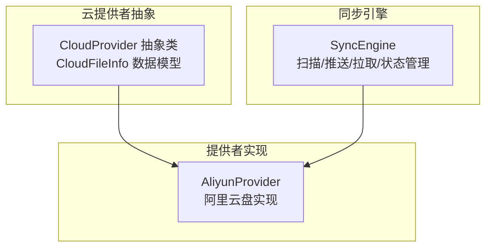
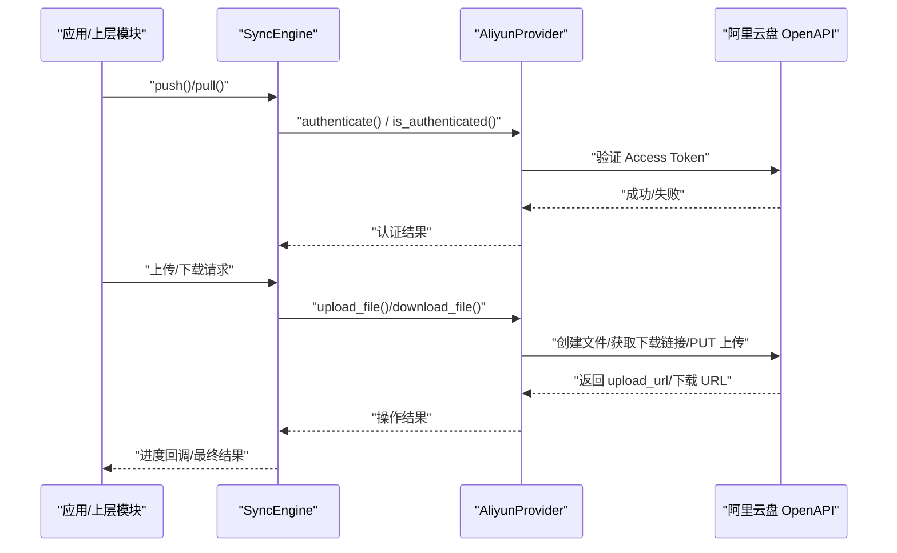
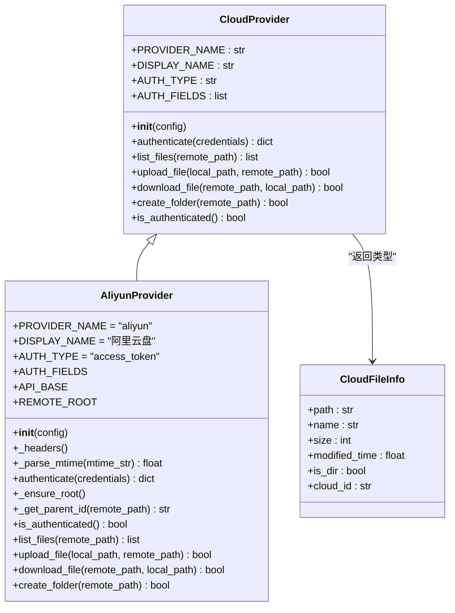
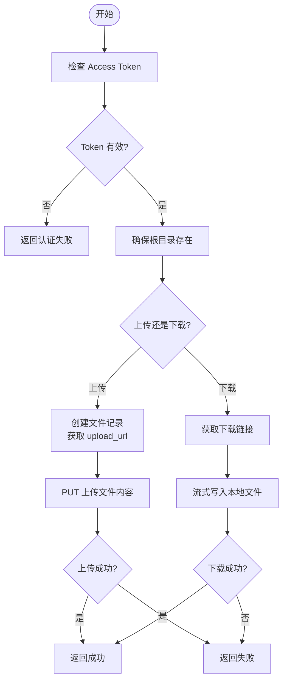
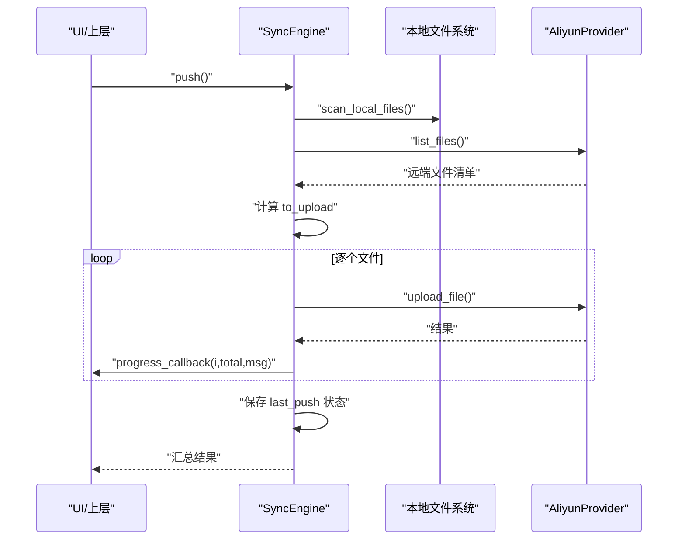
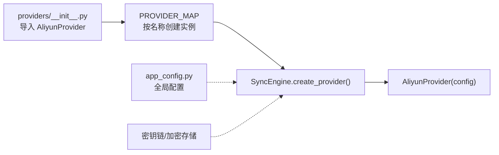

# 阿里云 OSS 适配器

<cite>
**本文引用的文件**   
- [python/sidecar/cloud/providers/aliyun.py](file://python/sidecar/cloud/providers/aliyun.py)
- [python/sidecar/cloud/providers/base.py](file://python/sidecar/cloud/providers/base.py)
- [python/sidecar/cloud/providers/__init__.py](file://python/sidecar/cloud/providers/__init__.py)
- [python/sidecar/cloud/sync_engine.py](file://python/sidecar/cloud/sync_engine.py)
- [config/app_config.py](file://config/app_config.py)
- [config/config.json.example](file://config/config.json.example)
</cite>

## 目录
1. [简介](#简介)
2. [项目结构](#项目结构)
3. [核心组件](#核心组件)
4. [架构总览](#架构总览)
5. [详细组件分析](#详细组件分析)
6. [依赖关系分析](#依赖关系分析)
7. [性能与可靠性](#性能与可靠性)
8. [配置与最佳实践](#配置与最佳实践)
9. [故障排查指南](#故障排查指南)
10. [结论](#结论)

## 简介
本技术文档围绕“阿里云对象存储服务（OSS）适配器”的实现进行系统化说明。需要特别说明的是，当前仓库中提供的“阿里云”实现实际对接的是“阿里云盘（alipan.com）开放 API”，而非阿里云对象存储（OSS）。因此，本节先给出适配器的现状说明，随后在“配置与最佳实践”章节提供将现有能力迁移至阿里云 OSS 的可行方案与注意事项。

- 当前实现：基于 HTTP REST 调用阿里云盘 openFile 系列接口，完成认证、目录遍历、上传、下载、创建文件夹等基础云同步能力。
- 目标扩展：如需使用阿里云 OSS，可参考本仓库的云提供者抽象与同步引擎设计，新增一个独立的 OSS Provider 实现，复用 SyncEngine 的扫描、冲突处理、状态持久化等通用逻辑。

[本节不直接分析具体代码文件]

## 项目结构
与云同步相关的核心代码位于 sidecar/cloud 目录下，采用“提供者抽象 + 多提供者实现 + 同步引擎编排”的分层设计：

- 提供者抽象：定义统一的 CloudProvider 接口与文件信息模型 CloudFileInfo。
- 提供者实现：以 AliyunProvider 为例，封装特定云服务的认证、文件操作细节。
- 同步引擎：SyncEngine 负责本地与远端的差异对比、并发控制策略预留、状态持久化与进度回调。

图示来源
- [python/sidecar/cloud/providers/base.py:1-41](file://python/sidecar/cloud/providers/base.py#L1-L41)
- [python/sidecar/cloud/providers/aliyun.py:1-247](file://python/sidecar/cloud/providers/aliyun.py#L1-L247)
- [python/sidecar/cloud/sync_engine.py:1-342](file://python/sidecar/cloud/sync_engine.py#L1-L342)

章节来源
- [python/sidecar/cloud/providers/base.py:1-41](file://python/sidecar/cloud/providers/base.py#L1-L41)
- [python/sidecar/cloud/providers/aliyun.py:1-247](file://python/sidecar/cloud/providers/aliyun.py#L1-L247)
- [python/sidecar/cloud/sync_engine.py:1-342](file://python/sidecar/cloud/sync_engine.py#L1-L342)

## 核心组件
- CloudProvider 抽象类：定义认证、列举、上传、下载、创建目录、鉴权检查等统一方法签名，屏蔽不同云厂商的差异。
- CloudFileInfo：描述远端文件的元信息（路径、名称、大小、修改时间、是否目录、云端 ID）。
- AliyunProvider：基于阿里云盘 OpenAPI 的具体实现，包含 Access Token 认证、根目录自动发现与创建、递归目录解析、分块上传（通过服务端返回的 upload_url）、流式下载等。
- SyncEngine：负责工作区内的 Notes 与 wiki 目录扫描、远端差异对比、冲突处理（保留本地版本并生成带时间戳的云端副本）、状态持久化、进度回调等。

章节来源
- [python/sidecar/cloud/providers/base.py:1-41](file://python/sidecar/cloud/providers/base.py#L1-L41)
- [python/sidecar/cloud/providers/aliyun.py:1-247](file://python/sidecar/cloud/providers/aliyun.py#L1-L247)
- [python/sidecar/cloud/sync_engine.py:1-342](file://python/sidecar/cloud/sync_engine.py#L1-L342)

## 架构总览
下图展示了从上层调用到具体云提供者实现的端到端流程，包括认证、上传、下载与目录操作的关键交互。

图示来源
- [python/sidecar/cloud/sync_engine.py:119-163](file://python/sidecar/cloud/sync_engine.py#L119-L163)
- [python/sidecar/cloud/sync_engine.py:216-256](file://python/sidecar/cloud/sync_engine.py#L216-L256)
- [python/sidecar/cloud/providers/aliyun.py:37-54](file://python/sidecar/cloud/providers/aliyun.py#L37-L54)
- [python/sidecar/cloud/providers/aliyun.py:156-186](file://python/sidecar/cloud/providers/aliyun.py#L156-L186)
- [python/sidecar/cloud/providers/aliyun.py:202-230](file://python/sidecar/cloud/providers/aliyun.py#L202-L230)

## 详细组件分析

### 云提供者抽象与数据模型
- CloudProvider 定义了统一的认证、列举、上传、下载、创建目录、鉴权检查等方法，便于后续扩展更多云厂商。
- CloudFileInfo 作为标准的数据载体，承载远端文件的基本属性，供上层引擎进行差异比较与展示。

图示来源
- [python/sidecar/cloud/providers/base.py:1-41](file://python/sidecar/cloud/providers/base.py#L1-L41)
- [python/sidecar/cloud/providers/aliyun.py:9-247](file://python/sidecar/cloud/providers/aliyun.py#L9-L247)

章节来源
- [python/sidecar/cloud/providers/base.py:1-41](file://python/sidecar/cloud/providers/base.py#L1-L41)
- [python/sidecar/cloud/providers/aliyun.py:9-247](file://python/sidecar/cloud/providers/aliyun.py#L9-L247)

### 阿里云盘提供者实现要点
- 认证方式：使用 Access Token 进行 Bearer 鉴权；首次认证会校验 token 有效性，并自动确保根目录下存在 NoteAI 目录。
- 目录解析：根据远程路径逐级查找或创建父目录，保证上传前目录结构存在。
- 上传流程：先调用创建文件接口获取 upload_url，再 PUT 上传完整文件内容。
- 下载流程：通过 getDownloadUrl 获取临时下载链接，再以流式写入本地文件。
- 错误处理：对网络异常与状态码非 2xx 的情况进行捕获与降级处理，返回布尔结果或空列表。

图示来源
- [python/sidecar/cloud/providers/aliyun.py:37-54](file://python/sidecar/cloud/providers/aliyun.py#L37-L54)
- [python/sidecar/cloud/providers/aliyun.py:56-79](file://python/sidecar/cloud/providers/aliyun.py#L56-L79)
- [python/sidecar/cloud/providers/aliyun.py:156-186](file://python/sidecar/cloud/providers/aliyun.py#L156-L186)
- [python/sidecar/cloud/providers/aliyun.py:202-230](file://python/sidecar/cloud/providers/aliyun.py#L202-L230)

章节来源
- [python/sidecar/cloud/providers/aliyun.py:37-54](file://python/sidecar/cloud/providers/aliyun.py#L37-L54)
- [python/sidecar/cloud/providers/aliyun.py:56-79](file://python/sidecar/cloud/providers/aliyun.py#L56-L79)
- [python/sidecar/cloud/providers/aliyun.py:156-186](file://python/sidecar/cloud/providers/aliyun.py#L156-L186)
- [python/sidecar/cloud/providers/aliyun.py:202-230](file://python/sidecar/cloud/providers/aliyun.py#L202-L230)

### 同步引擎与状态管理
- 扫描策略：仅扫描工作区下的 Notes 与 wiki 目录，忽略隐藏文件。
- 差异对比：基于 mtime 与 size 判断是否需要上传或下载；若云端更新且本地存在，则视为冲突，保留本地并另存为带时间戳的云端版本。
- 安全路径：对远端路径进行规范化与越界检查，防止路径穿越。
- 状态持久化：记录最近一次 push/pull 时间与对应提供者名称，用于 UI 展示与增量同步。
- 进度回调：支持逐文件进度回调，便于前端展示。

图示来源
- [python/sidecar/cloud/sync_engine.py:62-87](file://python/sidecar/cloud/sync_engine.py#L62-L87)
- [python/sidecar/cloud/sync_engine.py:89-110](file://python/sidecar/cloud/sync_engine.py#L89-L110)
- [python/sidecar/cloud/sync_engine.py:119-163](file://python/sidecar/cloud/sync_engine.py#L119-L163)
- [python/sidecar/cloud/sync_engine.py:258-269](file://python/sidecar/cloud/sync_engine.py#L258-L269)

章节来源
- [python/sidecar/cloud/sync_engine.py:62-87](file://python/sidecar/cloud/sync_engine.py#L62-L87)
- [python/sidecar/cloud/sync_engine.py:89-110](file://python/sidecar/cloud/sync_engine.py#L89-L110)
- [python/sidecar/cloud/sync_engine.py:119-163](file://python/sidecar/cloud/sync_engine.py#L119-L163)
- [python/sidecar/cloud/sync_engine.py:258-269](file://python/sidecar/cloud/sync_engine.py#L258-L269)

## 依赖关系分析
- 提供者注册：providers/__init__.py 将 AliyunProvider 暴露给外部，便于通过 PROVIDER_MAP 动态创建实例。
- 配置加载：应用级配置由 config/app_config.py 统一管理，云同步相关配置由 sync_engine 在工作区 .noteai 下独立维护。
- 敏感信息保护：sync_engine 会将敏感字段（如 access_token）保存到系统密钥链，并在 JSON 中以占位符形式存储。

图示来源
- [python/sidecar/cloud/providers/__init__.py:1-28](file://python/sidecar/cloud/providers/__init__.py#L1-L28)
- [python/sidecar/cloud/sync_engine.py:336-342](file://python/sidecar/cloud/sync_engine.py#L336-L342)
- [python/sidecar/cloud/sync_engine.py:271-297](file://python/sidecar/cloud/sync_engine.py#L271-L297)
- [python/sidecar/cloud/sync_engine.py:299-335](file://python/sidecar/cloud/sync_engine.py#L299-L335)

章节来源
- [python/sidecar/cloud/providers/__init__.py:1-28](file://python/sidecar/cloud/providers/__init__.py#L1-L28)
- [python/sidecar/cloud/sync_engine.py:271-297](file://python/sidecar/cloud/sync_engine.py#L271-L297)
- [python/sidecar/cloud/sync_engine.py:299-335](file://python/sidecar/cloud/sync_engine.py#L299-L335)
- [python/sidecar/cloud/sync_engine.py:336-342](file://python/sidecar/cloud/sync_engine.py#L336-L342)

## 性能与可靠性
- 上传机制：当前实现通过服务端返回的 upload_url 一次性 PUT 上传，适合中小文件；大文件场景建议引入分片上传与断点续传以提升稳定性与吞吐。
- 下载机制：采用流式写入，避免一次性加载大文件到内存，降低内存峰值。
- 并发控制：当前未启用并发，可按需引入线程池或协程并发，并结合限速与重试策略。
- 超时与重试：HTTP 请求设置了合理的超时时间；可在网络抖动时增加指数退避重试。
- 冲突处理：当云端较新而本地存在时，保留本地并生成带时间戳的云端副本，避免覆盖用户编辑。

[本节为通用指导，不直接分析具体代码文件]

## 配置与最佳实践

### 当前实现（阿里云盘）的配置项
- 认证字段：access_token（Access Token），用于 Bearer 鉴权。
- 根目录：默认在云端根目录下创建名为 NoteAI 的目录作为工作根。
- 存储位置：工作区 .noteai 目录下的 cloud_sync_config.json 保存各提供者配置；敏感字段保存在系统密钥链。

章节来源
- [python/sidecar/cloud/providers/aliyun.py:10-26](file://python/sidecar/cloud/providers/aliyun.py#L10-L26)
- [python/sidecar/cloud/providers/aliyun.py:56-79](file://python/sidecar/cloud/providers/aliyun.py#L56-L79)
- [python/sidecar/cloud/sync_engine.py:271-297](file://python/sidecar/cloud/sync_engine.py#L271-L297)
- [python/sidecar/cloud/sync_engine.py:299-335](file://python/sidecar/cloud/sync_engine.py#L299-L335)

### 迁移至阿里云 OSS 的建议方案
- 新增 OSS Provider：参照 AliyunProvider 的结构，新建 OssProvider，实现 CloudProvider 接口。
- 认证配置：
  - AccessKey ID、AccessKey Secret：用于签名与鉴权。
  - Endpoint：OSS 服务访问域名。
  - Bucket：目标存储桶名称。
  - Region（可选）：部分 SDK 需要指定地域。
- 文件操作：
  - 分片上传：利用 OSS SDK 的分片上传能力，结合本地断点记录实现断点续传。
  - 并发控制：按文件大小与网络状况调整并发度，设置最大并发与速率限制。
  - 生命周期管理：在 Bucket 层面配置规则（如过期清理、转低频/归档存储）。
  - CDN 加速：为 Bucket 绑定自定义域名并开启 CDN，提升全球访问速度。
  - 跨域设置（CORS）：按需配置允许的来源、方法与头，满足 Web 直传需求。
- 错误处理与重试：
  - 网络异常：指数退避重试，区分瞬时错误与永久错误。
  - 权限错误：提示重新配置 AK/SK 或检查 RAM 权限策略。
  - 存储空间不足：提前检测 Bucket 配额，必要时触发告警与暂停任务。
- 配置示例（概念性）：
  - provider_name: oss
  - access_key_id: xxx
  - access_key_secret: xxx
  - endpoint: https://oss-cn-hangzhou.aliyuncs.com
  - bucket: noteai-bucket
  - region: cn-hangzhou
  - cdn_domain: https://cdn.noteai.example
  - cors_rules: 允许的 origin/method/header
  - lifecycle_rules: 过期天数/转低频阈值

[本节为概念性指导，不直接分析具体代码文件]

## 故障排查指南
- 认证失败（401）：检查 Access Token 是否有效或已过期；确认 Authorization 头格式正确。
- 目录不存在：确保 _ensure_root 与 _get_parent_id 能正确创建中间目录；核对路径分隔符与大小写。
- 上传失败：检查 create 接口返回的 upload_url 是否存在；确认 PUT 请求体与 Content-Length 匹配。
- 下载失败：确认 getDownloadUrl 返回的 URL 可用；检查本地目录权限与磁盘空间。
- 冲突处理：若本地与云端同时修改，查看是否生成了带时间戳的云端副本；手动合并后再次同步。
- 状态不一致：检查 .noteai/cloud_sync_state.json 中的 last_push/last_pull 时间戳；必要时重置状态并全量同步。

章节来源
- [python/sidecar/cloud/providers/aliyun.py:37-54](file://python/sidecar/cloud/providers/aliyun.py#L37-L54)
- [python/sidecar/cloud/providers/aliyun.py:156-186](file://python/sidecar/cloud/providers/aliyun.py#L156-L186)
- [python/sidecar/cloud/providers/aliyun.py:202-230](file://python/sidecar/cloud/providers/aliyun.py#L202-L230)
- [python/sidecar/cloud/sync_engine.py:165-214](file://python/sidecar/cloud/sync_engine.py#L165-L214)
- [python/sidecar/cloud/sync_engine.py:258-269](file://python/sidecar/cloud/sync_engine.py#L258-L269)

## 结论
当前仓库提供了完善的云提供者抽象与同步引擎，AliyunProvider 实现了基于阿里云盘的稳定同步能力。若需接入阿里云 OSS，建议遵循现有架构新增 OssProvider，复用 SyncEngine 的扫描、冲突处理与状态管理能力，并在 OSS 侧启用分片上传、CDN 加速、生命周期管理等高级特性，以获得更好的性能与用户体验。

[本节为总结性内容，不直接分析具体代码文件]