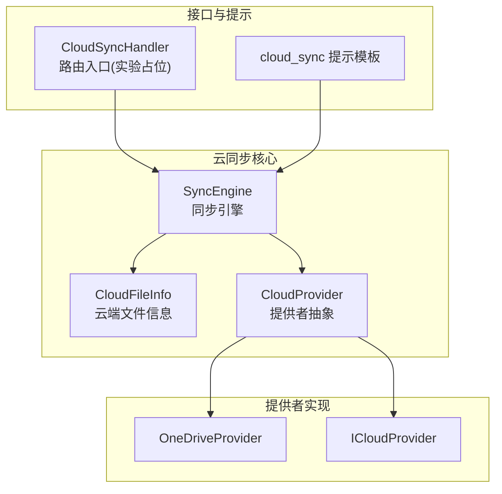
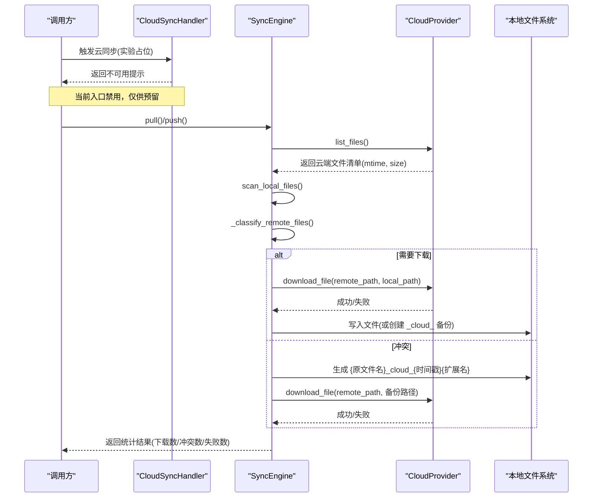
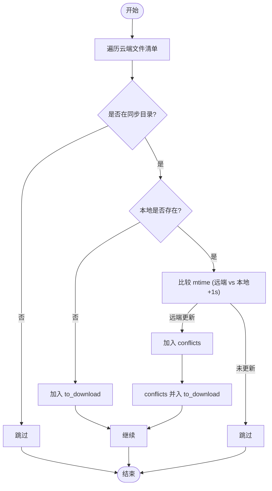
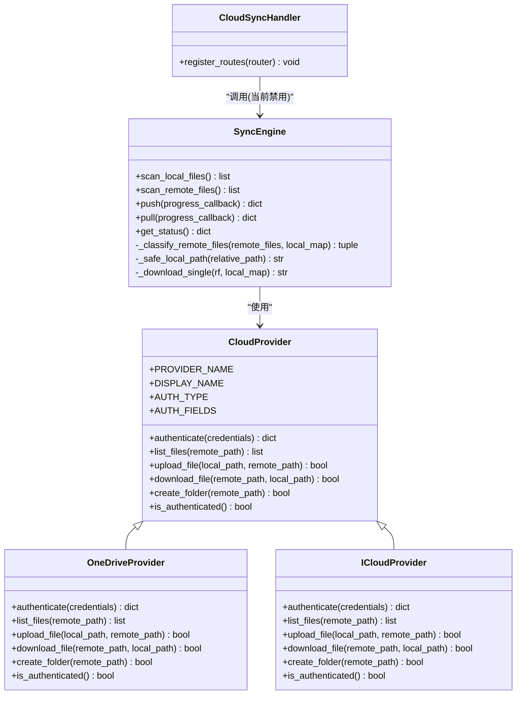

# 冲突解决机制

<cite>
**本文引用的文件**   
- [sync_engine.py](file://python/sidecar/cloud/sync_engine.py)
- [base.py](file://python/sidecar/cloud/providers/base.py)
- [onedrive.py](file://python/sidecar/cloud/providers/onedrive.py)
- [icloud.py](file://python/sidecar/cloud/providers/icloud.py)
- [cloud_sync_handler.py](file://python/sidecar/handlers/cloud_sync_handler.py)
- [cloud_sync.py](file://prompts/cloud_sync.py)
- [test_cloud_sync_engine.py](file://tests/unit/test_cloud_sync_engine.py)
</cite>

## 目录
1. [简介](#简介)
2. [项目结构](#项目结构)
3. [核心组件](#核心组件)
4. [架构总览](#架构总览)
5. [详细组件分析](#详细组件分析)
6. [依赖关系分析](#依赖关系分析)
7. [性能与容错特性](#性能与容错特性)
8. [故障排查指南](#故障排查指南)
9. [结论](#结论)
10. [附录：最佳实践与案例](#附录最佳实践与案例)

## 简介
本技术文档聚焦于云同步的冲突检测与解决机制，围绕基于修改时间戳（mtime）的比较策略、1秒容差范围的设计原因、云端版本优先原则、本地版本保留机制以及 _cloud_ 后缀重命名规则展开。同时解释 _classify_remote_files() 的分类逻辑，说明如何区分需要下载的文件与冲突文件，并阐述冲突文件的安全保存机制以避免覆盖用户本地编辑内容。最后提供冲突预防的最佳实践、同步频率建议，以及实际冲突处理案例与手动解决方法。

## 项目结构
与冲突解决相关的核心代码位于侧车（sidecar）的云同步模块中，包含同步引擎、提供者抽象与具体实现、处理器入口以及提示模板等。

图表来源
- [sync_engine.py:37-111](file://python/sidecar/cloud/sync_engine.py#L37-L111)
- [base.py:5-41](file://python/sidecar/cloud/providers/base.py#L5-L41)
- [onedrive.py:10-129](file://python/sidecar/cloud/providers/onedrive.py#L10-L129)
- [icloud.py:7-86](file://python/sidecar/cloud/providers/icloud.py#L7-L86)
- [cloud_sync_handler.py:12-33](file://python/sidecar/handlers/cloud_sync_handler.py#L12-L33)
- [cloud_sync.py:1-27](file://prompts/cloud_sync.py#L1-L27)

章节来源
- [sync_engine.py:37-111](file://python/sidecar/cloud/sync_engine.py#L37-L111)
- [base.py:5-41](file://python/sidecar/cloud/providers/base.py#L5-L41)
- [onedrive.py:10-129](file://python/sidecar/cloud/providers/onedrive.py#L10-L129)
- [icloud.py:7-86](file://python/sidecar/cloud/providers/icloud.py#L7-L86)
- [cloud_sync_handler.py:12-33](file://python/sidecar/handlers/cloud_sync_handler.py#L12-L33)
- [cloud_sync.py:1-27](file://prompts/cloud_sync.py#L1-L27)

## 核心组件
- SyncEngine：负责扫描本地与云端文件、计算差异、执行上传/下载、分类冲突与待下载文件、安全路径校验与冲突文件安全保存。
- CloudProvider 抽象与具体实现：定义统一的云端操作接口；OneDrive/iCloud 分别将云端时间戳转换为 mtime 或直接使用文件系统 mtime。
- CloudSyncHandler：当前为实验占位，屏蔽实际同步调用，仅暴露能力列表。
- cloud_sync 提示模板：用于向用户展示冲突通知与拉取/推送摘要。

章节来源
- [sync_engine.py:37-111](file://python/sidecar/cloud/sync_engine.py#L37-L111)
- [base.py:15-41](file://python/sidecar/cloud/providers/base.py#L15-L41)
- [onedrive.py:29-36](file://python/sidecar/cloud/providers/onedrive.py#L29-L36)
- [icloud.py:39-57](file://python/sidecar/cloud/providers/icloud.py#L39-L57)
- [cloud_sync_handler.py:12-33](file://python/sidecar/handlers/cloud_sync_handler.py#L12-L33)
- [cloud_sync.py:1-27](file://prompts/cloud_sync.py#L1-L27)

## 架构总览
下图展示了从请求到冲突处理的端到端流程，包括扫描、分类、下载与安全保存。

图表来源
- [sync_engine.py:119-163](file://python/sidecar/cloud/sync_engine.py#L119-L163)
- [sync_engine.py:216-256](file://python/sidecar/cloud/sync_engine.py#L216-L256)
- [sync_engine.py:165-179](file://python/sidecar/cloud/sync_engine.py#L165-L179)
- [sync_engine.py:199-214](file://python/sidecar/cloud/sync_engine.py#L199-L214)
- [cloud_sync_handler.py:12-33](file://python/sidecar/handlers/cloud_sync_handler.py#L12-L33)

## 详细组件分析

### 冲突检测算法与 1 秒容差
- 比较基准：以文件的修改时间戳（mtime）作为“最新性”依据。本地与云端均归一化为浮点秒级时间戳。
- 容差设计：在比较时引入 1 秒容差，即只有当远端 mtime 大于本地 mtime + 1 时才视为“远端更新”，否则认为两者一致或本地更新。该容差用于规避以下场景导致的误判：
  - 网络延迟导致的时间漂移
  - 不同系统/平台对 mtime 精度的差异
  - 批量写入或压缩归档后 mtime 被统一设置
- 关键判断位置：
  - 上传决策：若本地 mtime > 远端 mtime + 1，则判定本地更新，需上传
  - 拉取分类：若远端 mtime > 本地 mtime + 1，则判定远端更新，进入冲突或下载分支

章节来源
- [sync_engine.py:125-128](file://python/sidecar/cloud/sync_engine.py#L125-L128)
- [sync_engine.py:174-176](file://python/sidecar/cloud/sync_engine.py#L174-L176)
- [sync_engine.py:203-203](file://python/sidecar/cloud/sync_engine.py#L203-L203)

### 云端版本优先原则与本地版本保留机制
- 云端版本优先：当检测到远端更新（满足上述 mtime 条件），默认以云端为准进行同步。
- 本地版本保留：为避免覆盖用户正在编辑的内容，当发生冲突（本地存在且远端更新）时，不直接覆盖本地文件，而是将云端版本另存为带 _cloud_ 后缀的备份文件，确保本地编辑内容不被破坏。
- 冲突识别与处理：
  - 识别：rel 存在于本地映射且远端 mtime > 本地 mtime + 1
  - 处理：生成 {stem}_cloud_{int(time.time())}{ext} 的备份路径，下载云端版本至该路径

章节来源
- [sync_engine.py:174-179](file://python/sidecar/cloud/sync_engine.py#L174-L179)
- [sync_engine.py:203-211](file://python/sidecar/cloud/sync_engine.py#L203-L211)
- [cloud_sync.py:2-8](file://prompts/cloud_sync.py#L2-L8)

### _classify_remote_files() 分类逻辑
该方法遍历云端文件清单，结合本地映射，输出两类目标：
- to_download：需要下载到本地的文件集合
- conflicts：发生冲突的文件集合（最终并入 to_download，以便后续按冲突策略处理）

分类规则：
- 过滤非同步目录：仅处理 Notes/ 与 wiki/ 下的文件
- 新增文件：本地不存在 → 加入 to_download
- 冲突文件：本地存在且远端 mtime > 本地 mtime + 1 → 加入 conflicts，随后并入 to_download

图表来源
- [sync_engine.py:165-179](file://python/sidecar/cloud/sync_engine.py#L165-L179)

章节来源
- [sync_engine.py:165-179](file://python/sidecar/cloud/sync_engine.py#L165-L179)

### 冲突文件的安全保存机制
- 路径安全校验：在下载前通过 _safe_local_path() 严格校验相对路径，防止路径穿越与越界访问，确保只落在工作区允许的同步根目录下。
- 冲突备份命名：采用 {原文件名}_cloud_{时间戳}{扩展名} 的形式，避免覆盖本地文件，同时便于人工对比与合并。
- 异常保护：下载过程捕获异常并记录日志，不影响其他文件处理。

章节来源
- [sync_engine.py:181-197](file://python/sidecar/cloud/sync_engine.py#L181-L197)
- [sync_engine.py:199-214](file://python/sidecar/cloud/sync_engine.py#L199-L214)
- [test_cloud_sync_engine.py:15-24](file://tests/unit/test_cloud_sync_engine.py#L15-L24)

### 提供者时间戳处理细节
- OneDrive：将 lastModifiedDateTime 解析为 ISO 时间并转为 Unix 时间戳，作为 modified_time 参与比较。
- iCloud：直接使用文件系统 stat.st_mtime，保证与本地 mtime 同精度。

章节来源
- [onedrive.py:29-36](file://python/sidecar/cloud/providers/onedrive.py#L29-L36)
- [icloud.py:44-56](file://python/sidecar/cloud/providers/icloud.py#L44-L56)

## 依赖关系分析
- SyncEngine 依赖 CloudProvider 抽象，通过 PROVIDER_MAP 动态选择具体实现。
- 提供者实现关注认证、文件列举、上传/下载、目录创建等能力，并将云端时间戳归一化为 mtime。
- Handler 层目前屏蔽了同步功能，仅保留能力列表，便于后续开放。

图表来源
- [base.py:15-41](file://python/sidecar/cloud/providers/base.py#L15-L41)
- [onedrive.py:10-129](file://python/sidecar/cloud/providers/onedrive.py#L10-L129)
- [icloud.py:7-86](file://python/sidecar/cloud/providers/icloud.py#L7-L86)
- [sync_engine.py:37-111](file://python/sidecar/cloud/sync_engine.py#L37-L111)
- [cloud_sync_handler.py:12-33](file://python/sidecar/handlers/cloud_sync_handler.py#L12-L33)

章节来源
- [base.py:15-41](file://python/sidecar/cloud/providers/base.py#L15-L41)
- [onedrive.py:10-129](file://python/sidecar/cloud/providers/onedrive.py#L10-L129)
- [icloud.py:7-86](file://python/sidecar/cloud/providers/icloud.py#L7-L86)
- [sync_engine.py:37-111](file://python/sidecar/cloud/sync_engine.py#L37-L111)
- [cloud_sync_handler.py:12-33](file://python/sidecar/handlers/cloud_sync_handler.py#L12-L33)

## 性能与容错特性
- 增量同步：仅在 mtime 变化超过 1 秒阈值时触发上传/下载，减少无效传输。
- 批量处理：支持进度回调，便于前端反馈与中断控制。
- 健壮性：
  - 路径安全校验防止越界写入
  - 异常捕获与日志记录，单个文件失败不影响整体流程
  - 状态持久化记录最近一次 push/pull 时间与提供者名称

章节来源
- [sync_engine.py:119-163](file://python/sidecar/cloud/sync_engine.py#L119-L163)
- [sync_engine.py:216-256](file://python/sidecar/cloud/sync_engine.py#L216-L256)
- [sync_engine.py:181-197](file://python/sidecar/cloud/sync_engine.py#L181-L197)

## 故障排查指南
- 无法启用云同步：当前 CloudSyncHandler 已将所有同步相关路由标记为禁用，返回“暂未开放”的消息。这是预期行为，等待后续完善后再启用。
- 冲突文件未覆盖本地：属于预期策略。请检查是否生成了带 _cloud_ 后缀的备份文件，并按需合并。
- 路径错误/拒绝写入：检查相对路径是否包含非法片段或越界，确保目标文件位于 Notes/ 或 wiki/ 下。
- 时间戳不一致导致频繁冲突：确认各设备/平台时间同步正常，必要时调整同步频率与编辑节奏。

章节来源
- [cloud_sync_handler.py:12-33](file://python/sidecar/handlers/cloud_sync_handler.py#L12-L33)
- [sync_engine.py:181-197](file://python/sidecar/cloud/sync_engine.py#L181-L197)
- [sync_engine.py:203-214](file://python/sidecar/cloud/sync_engine.py#L203-L214)

## 结论
本机制以 mtime 为核心，辅以 1 秒容差，有效降低因时间漂移引发的误判。冲突处理遵循“云端版本优先、本地版本保留”的原则，通过 _cloud_ 后缀安全备份，避免覆盖用户编辑内容。配合严格的本地路径校验与异常保护，整体具备较好的安全性与鲁棒性。当前入口处于实验占位阶段，后续可在此基础上扩展更丰富的冲突合并策略与用户交互。

## 附录：最佳实践与案例

### 冲突预防最佳实践
- 合理编辑策略
  - 同一文件避免多端并发编辑，尽量串行化变更
  - 大段修改前先提交本地变更，再进行同步
- 同步频率设置
  - 建议将同步间隔设置为大于 1 秒（例如 5~10 秒），以降低抖动带来的误判
  - 在网络不稳定环境下适当增大间隔
- 时间同步
  - 确保各设备系统时间准确，避免跨时区/夏令时切换造成 mtime 异常

### 冲突处理实际案例
- 场景：你在本地编辑了 Notes/a.md，同时在另一台设备上更新了同一文件并推送到云端。
- 现象：拉取时发现冲突，本地 a.md 未被覆盖，但出现 a_cloud_<时间戳>.md 备份文件。
- 处理方法：
  - 打开 a.md 与 a_cloud_<时间戳>.md，对比差异
  - 将需要的变更合并回 a.md，删除多余的 _cloud_ 备份文件
  - 再次执行同步，确保两端一致

章节来源
- [cloud_sync.py:2-8](file://prompts/cloud_sync.py#L2-L8)
- [sync_engine.py:203-214](file://python/sidecar/cloud/sync_engine.py#L203-L214)