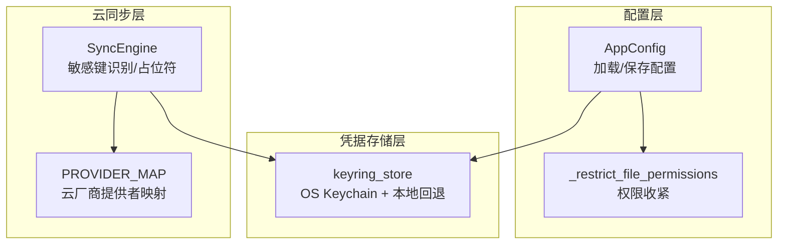
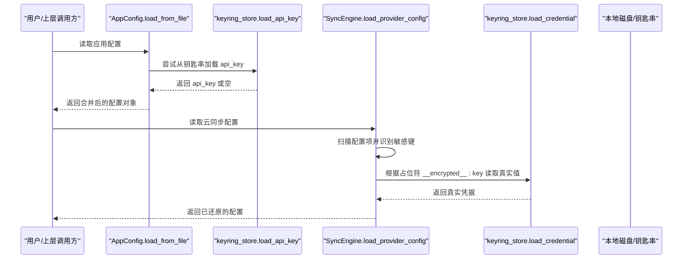
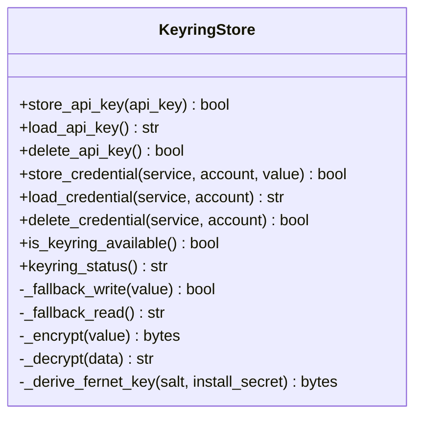
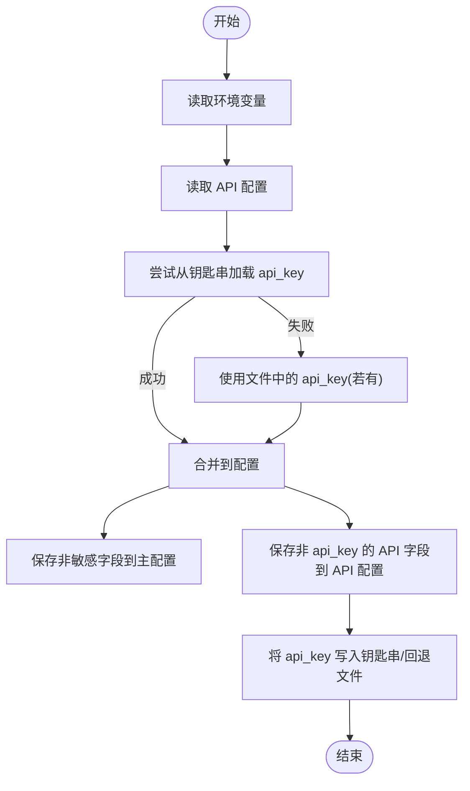
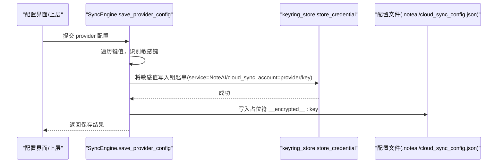
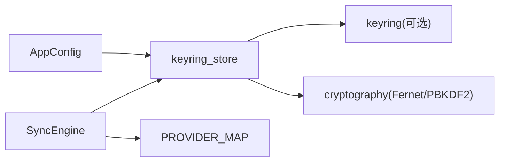

# 凭据安全管理

<cite>
**本文引用的文件**
- [keyring_store.py](file://utils/keyring_store.py)
- [app_config.py](file://config/app_config.py)
- [security.py](file://config/security.py)
- [sync_engine.py](file://python/sidecar/cloud/sync_engine.py)
- [providers/__init__.py](file://python/sidecar/cloud/providers/__init__.py)
- [test_keyring_store.py](file://tests/unit/test_keyring_store.py)
</cite>

## 目录
1. [简介](#简介)
2. [项目结构](#项目结构)
3. [核心组件](#核心组件)
4. [架构总览](#架构总览)
5. [详细组件分析](#详细组件分析)
6. [依赖关系分析](#依赖关系分析)
7. [性能与安全性考量](#性能与安全性考量)
8. [故障排除指南](#故障排除指南)
9. [结论](#结论)
10. [附录：配置示例与最佳实践](#附录配置示例与最佳实践)

## 简介
本技术文档围绕云同步凭据的安全管理，系统阐述敏感信息（密码、密钥、令牌等）的自动识别、加密存储与跨平台钥匙串集成方案。重点覆盖以下方面：
- 敏感字段自动识别与加密存储机制
- 操作系统钥匙串（Keychain）集成：macOS Keychain、Windows Credential Manager、Linux Secret Service
- 配置文件占位符机制 __encrypted__:key 的作用与用法
- 凭据生命周期管理：存储、更新、删除
- 跨平台兼容性与差异处理
- 安全最佳实践：权限设置、备份恢复、安全审计
- 实际配置示例与常见问题排查

## 项目结构
与凭据安全相关的核心代码分布在以下模块：
- utils/keyring_store.py：统一的凭据存取抽象，优先使用 OS 钥匙串，不可用时回退到本地 Fernet 加密文件
- config/app_config.py：应用配置加载/保存流程，API key 的优先级与持久化策略
- python/sidecar/cloud/sync_engine.py：云同步配置中敏感字段的自动识别与占位符替换
- config/security.py：文件权限收紧工具
- tests/unit/test_keyring_store.py：对 keyring 可用性与加解密往返的单元测试

图示来源
- [app_config.py:213-383](file://config/app_config.py#L213-L383)
- [security.py:6-12](file://config/security.py#L6-L12)
- [keyring_store.py:166-203](file://utils/keyring_store.py#L166-L203)
- [sync_engine.py:271-334](file://python/sidecar/cloud/sync_engine.py#L271-L334)
- [providers/__init__.py:12-22](file://python/sidecar/cloud/providers/__init__.py#L12-L22)

章节来源
- [app_config.py:213-383](file://config/app_config.py#L213-L383)
- [security.py:6-12](file://config/security.py#L6-L12)
- [keyring_store.py:166-203](file://utils/keyring_store.py#L166-L203)
- [sync_engine.py:271-334](file://python/sidecar/cloud/sync_engine.py#L271-L334)
- [providers/__init__.py:12-22](file://python/sidecar/cloud/providers/__init__.py#L12-L22)

## 核心组件
- 统一凭据存储接口（keyring_store）
  - 提供 store/load/delete API 与通用 service/account 凭据接口
  - 优先调用 OS 钥匙串；失败时回退到本地 Fernet 加密文件，并附带安装级随机密钥
- 应用配置加载器（AppConfig）
  - 按优先级合并环境变量、API 配置与主配置
  - 将 api_key 写入 OS 钥匙串或回退文件，避免明文落盘
- 云同步引擎（SyncEngine）
  - 自动识别敏感键名（如 password、secret、token、key、credential、auth）
  - 保存时将敏感值存入钥匙串，并在配置文件中仅保留占位符 __encrypted__:key
  - 加载时根据占位符从钥匙串还原真实值
- 安全工具（security）
  - 提供文件权限收紧函数，确保敏感文件最小权限访问

章节来源
- [keyring_store.py:166-203](file://utils/keyring_store.py#L166-L203)
- [keyring_store.py:205-242](file://utils/keyring_store.py#L205-L242)
- [app_config.py:213-383](file://config/app_config.py#L213-L383)
- [sync_engine.py:25-34](file://python/sidecar/cloud/sync_engine.py#L25-L34)
- [sync_engine.py:271-334](file://python/sidecar/cloud/sync_engine.py#L271-L334)
- [security.py:6-12](file://config/security.py#L6-L12)

## 架构总览
下图展示了从配置加载到凭据解析再到云同步调用的整体数据流。

图示来源
- [app_config.py:213-249](file://config/app_config.py#L213-L249)
- [keyring_store.py:180-189](file://utils/keyring_store.py#L180-L189)
- [sync_engine.py:271-297](file://python/sidecar/cloud/sync_engine.py#L271-L297)
- [keyring_store.py:218-227](file://utils/keyring_store.py#L218-L227)

## 详细组件分析

### 统一凭据存储（keyring_store）
- 设计要点
  - 优先使用 OS 钥匙串（通过第三方库 keyring），支持 macOS Keychain、Windows Credential Manager、Linux Secret Service
  - 当钥匙串不可用或异常时，回退到本地加密文件，采用 PBKDF2 派生密钥 + Fernet 对称加密
  - 引入“安装级随机密钥”（install_secret）与机器/用户信息组合，提升离线回退的安全性
  - 提供两类接口：
    - API Key 专用接口：store_api_key / load_api_key / delete_api_key
    - 通用凭据接口：store_credential / load_credential / delete_credential（service/account 维度）
- 关键实现细节
  - 回退文件路径与命名：基于服务/账户哈希生成安全文件名，限制为 0o600 权限
  - 迁移兼容：支持旧格式解密与纯 base64 降级读取，保障历史数据可恢复
  - 诊断能力：is_keyring_available / keyring_status 用于运行时状态检查

图示来源
- [keyring_store.py:166-203](file://utils/keyring_store.py#L166-L203)
- [keyring_store.py:205-242](file://utils/keyring_store.py#L205-L242)
- [keyring_store.py:82-102](file://utils/keyring_store.py#L82-L102)
- [keyring_store.py:66-79](file://utils/keyring_store.py#L66-L79)

章节来源
- [keyring_store.py:166-203](file://utils/keyring_store.py#L166-L203)
- [keyring_store.py:205-242](file://utils/keyring_store.py#L205-L242)
- [keyring_store.py:82-102](file://utils/keyring_store.py#L82-L102)
- [keyring_store.py:66-79](file://utils/keyring_store.py#L66-L79)
- [keyring_store.py:301-309](file://utils/keyring_store.py#L301-L309)

### 应用配置加载与 API Key 持久化（AppConfig）
- 加载优先级
  - 环境变量 > API 配置（可能包含来自钥匙串的 api_key） > 主配置文件
- 持久化策略
  - 非敏感字段写入主配置文件
  - api_key 优先写入 OS 钥匙串；若不可用则写入回退文件
  - 其他 API 相关字段（如 api_base、model_name 等）写入独立 API 配置文件，并收紧文件权限
- 兼容性
  - 工作区状态文件中的 workspace_path 作为默认值注入

图示来源
- [app_config.py:213-311](file://config/app_config.py#L213-L311)
- [app_config.py:313-383](file://config/app_config.py#L313-L383)
- [security.py:6-12](file://config/security.py#L6-L12)

章节来源
- [app_config.py:213-311](file://config/app_config.py#L213-L311)
- [app_config.py:313-383](file://config/app_config.py#L313-L383)
- [security.py:6-12](file://config/security.py#L6-L12)

### 云同步凭据与占位符机制（SyncEngine）
- 敏感键自动识别
  - 键名包含 password、secret、token、key、credential、auth 等关键字即视为敏感
- 保存流程
  - 将敏感值写入钥匙串（或回退文件）
  - 在配置文件中以占位符 __encrypted__:key 替代真实值
- 加载流程
  - 扫描配置项，遇到占位符且键名为敏感类型时，从钥匙串还原真实值
- 清理逻辑
  - 若某敏感键不再出现在新配置中，则删除对应钥匙串条目，避免残留

图示来源
- [sync_engine.py:25-34](file://python/sidecar/cloud/sync_engine.py#L25-L34)
- [sync_engine.py:299-334](file://python/sidecar/cloud/sync_engine.py#L299-L334)
- [keyring_store.py:205-242](file://utils/keyring_store.py#L205-L242)

章节来源
- [sync_engine.py:25-34](file://python/sidecar/cloud/sync_engine.py#L25-L34)
- [sync_engine.py:271-334](file://python/sidecar/cloud/sync_engine.py#L271-L334)
- [keyring_store.py:205-242](file://utils/keyring_store.py#L205-L242)

### 云提供商注册表（PROVIDER_MAP）
- 作用：集中注册各云厂商提供者类，供 SyncEngine 动态创建实例
- 影响：凭据按 provider_name 隔离存储，避免不同云服务凭据混淆

章节来源
- [providers/__init__.py:12-22](file://python/sidecar/cloud/providers/__init__.py#L12-L22)

## 依赖关系分析
- 组件耦合
  - AppConfig 依赖 keyring_store 进行 api_key 的读写
  - SyncEngine 依赖 keyring_store 进行通用凭据的读写，并通过 PROVIDER_MAP 获取具体云厂商实现
- 外部依赖
  - keyring：跨平台 OS 钥匙串封装（可选，不可用时启用回退）
  - cryptography：Fernet 对称加密与 PBKDF2 密钥派生
- 潜在风险
  - 若 keyring 缺失或初始化失败，系统将回退到本地加密文件，需确保安装级随机密钥与文件权限正确

图示来源
- [app_config.py:213-383](file://config/app_config.py#L213-L383)
- [sync_engine.py:271-342](file://python/sidecar/cloud/sync_engine.py#L271-L342)
- [keyring_store.py:16-23](file://utils/keyring_store.py#L16-L23)

章节来源
- [app_config.py:213-383](file://config/app_config.py#L213-L383)
- [sync_engine.py:271-342](file://python/sidecar/cloud/sync_engine.py#L271-L342)
- [keyring_store.py:16-23](file://utils/keyring_store.py#L16-L23)

## 性能与安全性考量
- 性能
  - 钥匙串 I/O 通常较快；回退文件涉及 PBKDF2 迭代与 Fernet 加解密，存在一定 CPU 开销
  - 建议仅在必要时触发敏感字段读写，避免频繁刷新
- 安全性
  - 优先使用 OS 钥匙串，利用系统级保护
  - 回退文件采用强随机盐与安装级随机密钥，降低离线破解风险
  - 所有敏感文件强制 0o600 权限，减少越权访问
  - 定期轮换敏感凭据，及时删除不再使用的凭据条目

[本节为通用指导，不直接分析具体文件]

## 故障排除指南
- 现象：无法读取 api_key 或云同步凭据
  - 检查钥匙串是否可用：调用 is_keyring_available / keyring_status
  - 查看日志警告：钥匙串失败时会记录回退路径与错误原因
  - 验证回退文件权限是否为 0o600，并确保当前用户可读
- 现象：保存配置后仍显示明文或占位符未生效
  - 确认键名是否命中敏感规则（包含 password、secret、token、key、credential、auth）
  - 检查 save_provider_config 是否成功写入钥匙串与配置文件
- 现象：迁移后无法解密旧凭据
  - 回退逻辑会尝试旧格式解密与 base64 降级，若仍失败，请重新输入凭据
- 现象：多用户环境下凭据错乱
  - 钥匙串按 service/account 隔离，确认 account 命名规范（provider/key）

章节来源
- [keyring_store.py:301-309](file://utils/keyring_store.py#L301-L309)
- [keyring_store.py:117-163](file://utils/keyring_store.py#L117-L163)
- [sync_engine.py:299-334](file://python/sidecar/cloud/sync_engine.py#L299-L334)
- [test_keyring_store.py:1-20](file://tests/unit/test_keyring_store.py#L1-L20)

## 结论
本方案通过“OS 钥匙串优先 + 本地加密回退”的双轨策略，在保证跨平台兼容性的同时，显著提升了敏感信息的存储安全性。配合敏感键自动识别与占位符机制，既避免了配置文件的明文泄露，又简化了凭据的生命周期管理。结合严格的文件权限与安装级随机密钥，进一步降低了离线攻击面。

[本节为总结性内容，不直接分析具体文件]

## 附录：配置示例与最佳实践

- 配置示例（云同步）
  - 在 .noteai/cloud_sync_config.json 中，敏感字段应仅保留占位符，例如：
    - "access_key": "__encrypted__:access_key"
    - "secret_key": "__encrypted__:secret_key"
    - "token": "__encrypted__:token"
  - 非敏感字段可直接写入 JSON，如 provider 名称、区域、桶名等
- 最佳实践
  - 权限设置：确保 SYSTEM_APP_DATA_DIR 及其子目录受系统访问控制；敏感文件权限为 0o600
  - 备份恢复：优先备份 OS 钥匙串；若仅能回退文件，需同时备份安装级随机密钥文件
  - 安全审计：定期检查钥匙串中残留凭据，及时清理不再使用的 service/account 条目
  - 凭据轮换：定期更换敏感凭据，避免长期不变带来的泄露风险
  - 环境隔离：不同环境（开发/测试/生产）使用不同的 service/account 命名空间，避免交叉污染

[本节为概念性说明，不直接分析具体文件]