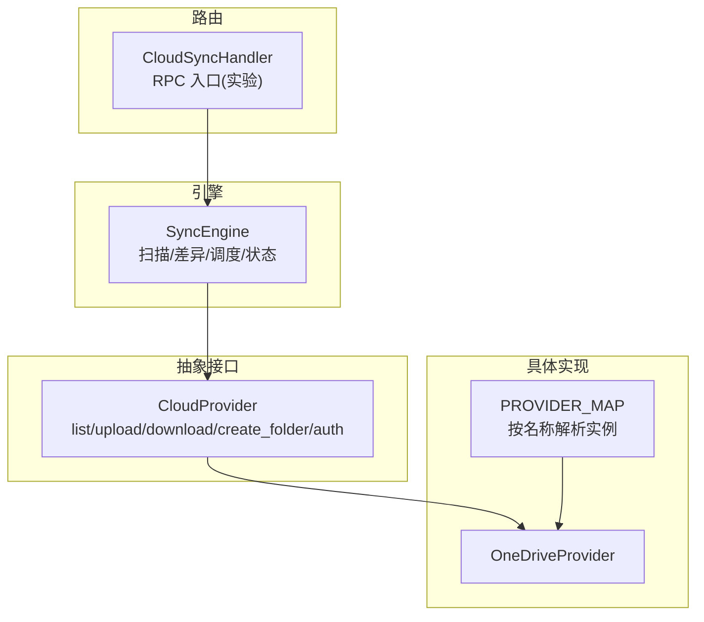
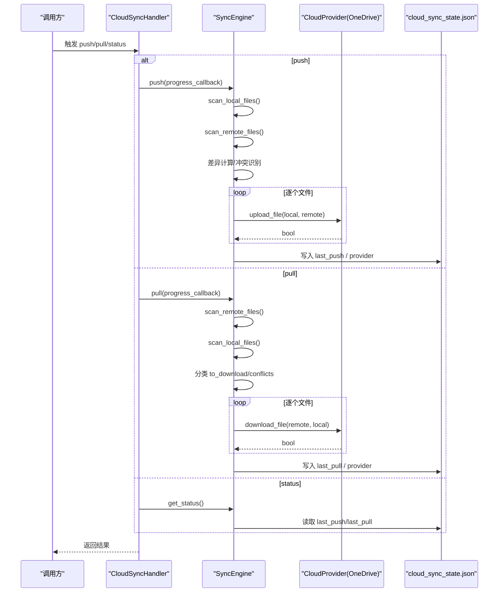
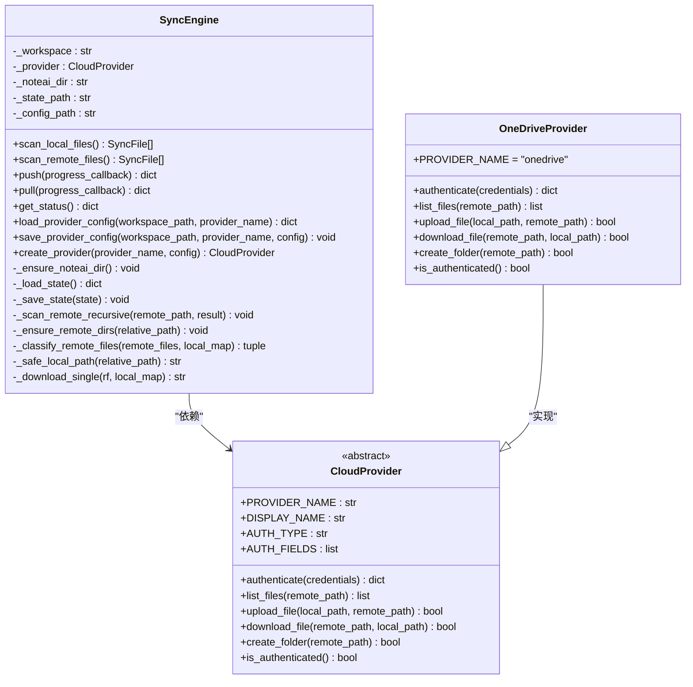
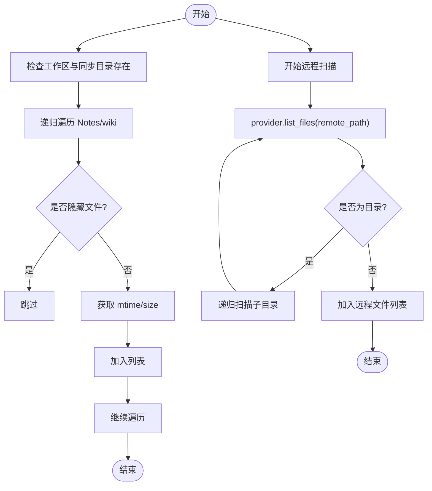
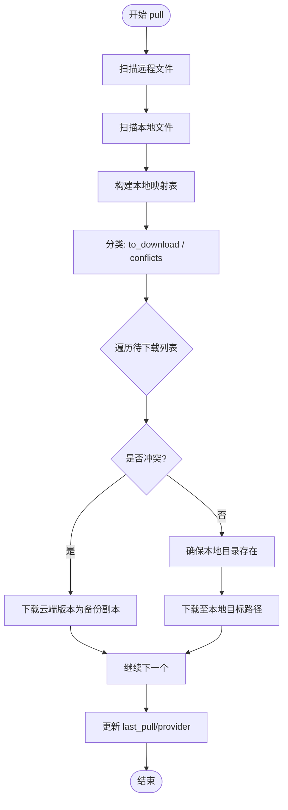
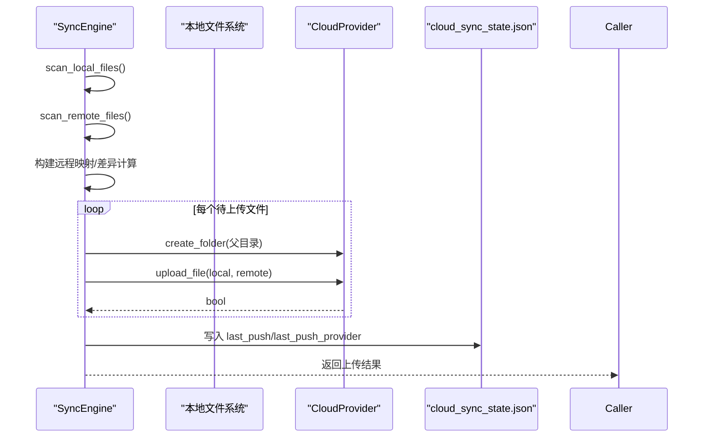
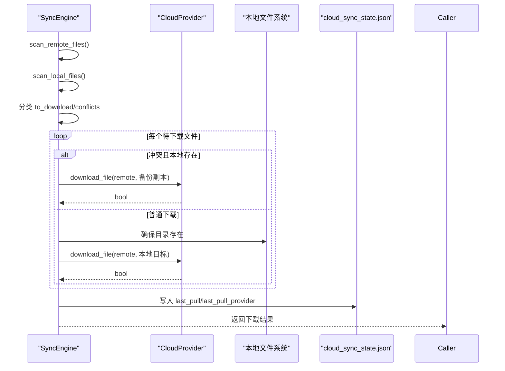
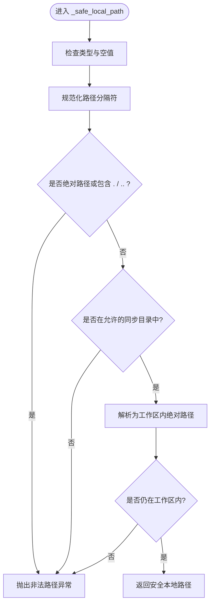
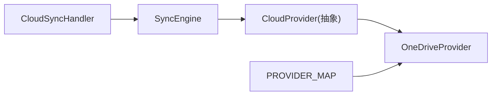

# 同步引擎核心

<cite>
**本文引用的文件**
- [sync_engine.py](file://python/sidecar/cloud/sync_engine.py)
- [base.py](file://python/sidecar/cloud/providers/base.py)
- [__init__.py](file://python/sidecar/cloud/providers/__init__.py)
- [onedrive.py](file://python/sidecar/cloud/providers/onedrive.py)
- [cloud_sync_handler.py](file://python/sidecar/handlers/cloud_sync_handler.py)
- [test_cloud_sync_engine.py](file://tests/unit/test_cloud_sync_engine.py)
</cite>

## 目录
1. [简介](#简介)
2. [项目结构](#项目结构)
3. [核心组件](#核心组件)
4. [架构总览](#架构总览)
5. [详细组件分析](#详细组件分析)
6. [依赖关系分析](#依赖关系分析)
7. [性能考虑](#性能考虑)
8. [故障排查指南](#故障排查指南)
9. [结论](#结论)
10. [附录](#附录)

## 简介
本技术文档聚焦云同步引擎的核心实现，围绕 SyncEngine 类展开，系统阐述其设计架构与关键流程：本地与远程文件扫描、增量同步算法、push() 与 pull() 的工作流、冲突识别策略、进度回调机制、状态管理（cloud_sync_state.json 结构与最后同步时间戳维护）、安全路径验证（防路径遍历），以及错误处理与故障恢复建议。同时提供配置示例与调试方法，帮助开发者快速理解并扩展该模块。

## 项目结构
云同步相关代码位于 sidecar/cloud 子系统中，采用“引擎 + 抽象提供者 + 具体提供商实现”的分层设计：
- 引擎层：SyncEngine 负责工作区扫描、差异计算、上传下载调度、状态持久化与安全校验。
- 抽象层：CloudProvider 定义统一接口（认证、列举、上传、下载、创建文件夹、认证状态）。
- 实现层：各云厂商 Provider（如 OneDrive）基于抽象接口完成网络交互。
- 路由层：CloudSyncHandler 暴露 RPC 入口（当前处于实验占位阶段）。
- 测试层：单元测试覆盖路径安全与配置迁移等关键行为。

图表来源
- [sync_engine.py:37-118](file://python/sidecar/cloud/sync_engine.py#L37-L118)
- [base.py:15-41](file://python/sidecar/cloud/providers/base.py#L15-L41)
- [__init__.py:12-22](file://python/sidecar/cloud/providers/__init__.py#L12-L22)
- [onedrive.py:10-129](file://python/sidecar/cloud/providers/onedrive.py#L10-L129)
- [cloud_sync_handler.py:12-33](file://python/sidecar/handlers/cloud_sync_handler.py#L12-L33)

章节来源
- [sync_engine.py:1-342](file://python/sidecar/cloud/sync_engine.py#L1-L342)
- [base.py:1-41](file://python/sidecar/cloud/providers/base.py#L1-L41)
- [__init__.py:1-37](file://python/sidecar/cloud/providers/__init__.py#L1-L37)
- [onedrive.py:1-129](file://python/sidecar/cloud/providers/onedrive.py#L1-L129)
- [cloud_sync_handler.py:1-33](file://python/sidecar/handlers/cloud_sync_handler.py#L1-L33)

## 核心组件
- SyncEngine：封装工作区根路径与云提供商实例，提供 push/pull/status 等能力；负责本地/远程扫描、差异判定、上传下载、状态持久化与安全路径校验。
- CloudProvider：抽象基类，定义统一的云端操作接口，屏蔽不同云服务的差异。
- 具体 Provider（以 OneDrive 为例）：实现认证、列举、上传、下载、创建文件夹等 API 调用细节。
- CloudSyncHandler：对外暴露的 RPC 路由（当前为实验占位，未启用实际同步逻辑）。

章节来源
- [sync_engine.py:37-118](file://python/sidecar/cloud/sync_engine.py#L37-L118)
- [base.py:15-41](file://python/sidecar/cloud/providers/base.py#L15-L41)
- [onedrive.py:10-129](file://python/sidecar/cloud/providers/onedrive.py#L10-L129)
- [cloud_sync_handler.py:12-33](file://python/sidecar/handlers/cloud_sync_handler.py#L12-L33)

## 架构总览
下图展示了从上层路由到引擎再到具体云提供商的调用链，以及状态文件的读写位置。

图表来源
- [cloud_sync_handler.py:12-33](file://python/sidecar/handlers/cloud_sync_handler.py#L12-L33)
- [sync_engine.py:119-269](file://python/sidecar/cloud/sync_engine.py#L119-L269)
- [onedrive.py:80-129](file://python/sidecar/cloud/providers/onedrive.py#L80-L129)

## 详细组件分析

### SyncEngine 类设计与职责
- 初始化与工作区布局
  - 工作区根路径 workspace_path，内部元数据目录 .noteai，状态文件 cloud_sync_state.json，配置文件 cloud_sync_config.json。
  - 通过 PROVIDER_MAP 动态创建具体云提供商实例。
- 本地文件扫描
  - 仅扫描 Notes 与 wiki 两个目录，递归遍历，忽略隐藏文件，记录相对路径、mtime、size。
- 远程文件扫描
  - 通过 provider.list_files 递归枚举，将目录项转换为统一数据结构。
- 差异与增量同步
  - push：比较本地与远程 mtime，若远程不存在或本地更新超过阈值则上传。
  - pull：优先下载远程新于本地的文件；对冲突文件采取保留本地版本并另存云端副本的策略。
- 进度回调
  - push/pull 在每次文件操作后调用 progress_callback(index, total, message)。
- 状态管理
  - 使用 _load_state/_save_state 读写 cloud_sync_state.json，记录 last_push/last_pull 及对应 provider。
- 安全路径验证
  - _safe_local_path 严格限制目标路径必须在允许同步目录内且不能越界，拒绝绝对路径与包含 .. 的路径。

图表来源
- [sync_engine.py:37-342](file://python/sidecar/cloud/sync_engine.py#L37-L342)
- [base.py:15-41](file://python/sidecar/cloud/providers/base.py#L15-L41)
- [onedrive.py:10-129](file://python/sidecar/cloud/providers/onedrive.py#L10-L129)

章节来源
- [sync_engine.py:37-342](file://python/sidecar/cloud/sync_engine.py#L37-L342)

### 本地文件扫描与远程文件扫描
- 本地扫描
  - 遍历 Notes 与 wiki 目录，过滤隐藏文件，收集 relative_path/mtime/size。
  - 异常跳过单个文件，保证整体扫描鲁棒性。
- 远程扫描
  - 递归调用 provider.list_files，将目录项转为统一结构，支持深层目录。

图表来源
- [sync_engine.py:62-111](file://python/sidecar/cloud/sync_engine.py#L62-L111)

章节来源
- [sync_engine.py:62-111](file://python/sidecar/cloud/sync_engine.py#L62-L111)

### 增量同步算法与差异检测
- push 差异检测
  - 构建远程映射表，逐一对比本地文件：若远程不存在或本地 mtime 大于远程 mtime+1 秒，则纳入上传队列。
- pull 差异检测与冲突识别
  - 仅关注 Notes/wiki 下的远程文件；若本地不存在则直接下载；若远程 mtime 大于本地 mtime+1 秒，视为冲突，先下载云端版本作为备份，再决定是否覆盖本地。
- 冲突处理策略
  - 当检测到冲突且本地文件存在时，将云端版本保存为带时间戳的副本（文件名追加 _cloud_<timestamp>），避免覆盖用户本地修改。

图表来源
- [sync_engine.py:165-256](file://python/sidecar/cloud/sync_engine.py#L165-L256)

章节来源
- [sync_engine.py:165-256](file://python/sidecar/cloud/sync_engine.py#L165-L256)

### push() 工作流程
- 步骤概览
  - 扫描本地与远程文件，构建远程映射。
  - 根据 mtime 差异生成上传队列。
  - 逐个上传前自动确保远程目录存在。
  - 统计成功/失败/跳过数量，更新 last_push 与 provider。
  - 通过 progress_callback 上报进度。
- 返回值
  - 包含 success、uploaded、failed、skipped、message 等字段。

图表来源
- [sync_engine.py:119-163](file://python/sidecar/cloud/sync_engine.py#L119-L163)

章节来源
- [sync_engine.py:119-163](file://python/sidecar/cloud/sync_engine.py#L119-L163)

### pull() 工作流程
- 步骤概览
  - 扫描远程与本地文件，构建本地映射。
  - 分类出需下载与冲突的文件。
  - 对冲突文件先下载云端版本为备份副本，再按需覆盖本地。
  - 统计下载/冲突/失败数量，更新 last_pull 与 provider。
  - 通过 progress_callback 上报进度。
- 返回值
  - 包含 success、downloaded、conflicts、failed、message 等字段。

图表来源
- [sync_engine.py:216-256](file://python/sidecar/cloud/sync_engine.py#L216-L256)

章节来源
- [sync_engine.py:216-256](file://python/sidecar/cloud/sync_engine.py#L216-L256)

### 状态管理机制（cloud_sync_state.json）
- 存储位置
  - 工作区 .noteai/cloud_sync_state.json。
- 关键字段
  - last_push：最近一次推送的时间戳（秒级浮点）。
  - last_pull：最近一次拉取的时间戳（秒级浮点）。
  - last_push_provider：最近一次推送使用的提供商名称。
  - last_pull_provider：最近一次拉取使用的提供商名称。
- 读写策略
  - 加载失败或文件不存在时回退为空字典，保证健壮性。
  - 每次 push/pull 完成后立即持久化最新状态。

章节来源
- [sync_engine.py:48-61](file://python/sidecar/cloud/sync_engine.py#L48-L61)
- [sync_engine.py:152-155](file://python/sidecar/cloud/sync_engine.py#L152-L155)
- [sync_engine.py:245-248](file://python/sidecar/cloud/sync_engine.py#L245-L248)
- [sync_engine.py:258-269](file://python/sidecar/cloud/sync_engine.py#L258-L269)

### 安全路径验证机制（防路径遍历）
- 约束规则
  - 拒绝空路径、绝对路径、包含 “.”、“..” 的路径。
  - 仅允许以 Notes 或 wiki 开头的相对路径。
  - 最终解析后的路径必须位于工作区根目录下，防止越界访问。
- 冲突时的备份命名
  - 冲突文件会保存为 <原文件名>_cloud_<时间戳><后缀>，避免覆盖本地内容。
- 测试覆盖
  - 单元测试验证非法路径会被拒绝，且不会在外部目录创建文件。

图表来源
- [sync_engine.py:181-197](file://python/sidecar/cloud/sync_engine.py#L181-L197)
- [test_cloud_sync_engine.py:15-24](file://tests/unit/test_cloud_sync_engine.py#L15-L24)

章节来源
- [sync_engine.py:181-197](file://python/sidecar/cloud/sync_engine.py#L181-L197)
- [test_cloud_sync_engine.py:15-24](file://tests/unit/test_cloud_sync_engine.py#L15-L24)

### 配置管理与凭据安全
- 配置文件位置
  - 工作区 .noteai/cloud_sync_config.json（兼容旧路径 NoteAI/cloud_sync_config.json 并自动迁移）。
- 敏感字段处理
  - 对 password/secret/token/key/credential/auth 等键名进行识别，将其值保存到系统钥匙串，并在 JSON 中以占位符 __encrypted__:key 形式存储。
  - 加载时自动从钥匙串还原真实值。
- 清理策略
  - 当配置中不再包含某敏感键时，自动删除钥匙串中的对应条目。

章节来源
- [sync_engine.py:271-334](file://python/sidecar/cloud/sync_engine.py#L271-L334)
- [test_cloud_sync_engine.py:27-48](file://tests/unit/test_cloud_sync_engine.py#L27-L48)

### 提供商抽象与具体实现（以 OneDrive 为例）
- 抽象接口
  - 统一认证、列举、上传、下载、创建文件夹、认证状态判断等方法。
- OneDrive 实现要点
  - 使用 OAuth 设备授权流程获取 access_token，并缓存有效期。
  - 通过 Microsoft Graph API 进行文件操作，REMOTE_ROOT 固定为 /NoteAI。
  - 下载采用分块流式写入，提升大文件稳定性。

章节来源
- [base.py:15-41](file://python/sidecar/cloud/providers/base.py#L15-L41)
- [onedrive.py:10-129](file://python/sidecar/cloud/providers/onedrive.py#L10-L129)

## 依赖关系分析
- 模块耦合
  - SyncEngine 依赖 CloudProvider 抽象，通过 PROVIDER_MAP 动态选择具体实现。
  - CloudSyncHandler 仅注册路由，当前未启用实际同步逻辑，便于后续接入。
- 外部依赖
  - OneDriveProvider 依赖 requests 与 msal（可选，用于认证）。
- 潜在循环依赖
  - 当前未发现循环依赖，分层清晰。

图表来源
- [__init__.py:12-22](file://python/sidecar/cloud/providers/__init__.py#L12-L22)
- [sync_engine.py:337-341](file://python/sidecar/cloud/sync_engine.py#L337-L341)
- [cloud_sync_handler.py:12-33](file://python/sidecar/handlers/cloud_sync_handler.py#L12-L33)

章节来源
- [__init__.py:1-37](file://python/sidecar/cloud/providers/__init__.py#L1-L37)
- [sync_engine.py:337-341](file://python/sidecar/cloud/sync_engine.py#L337-L341)
- [cloud_sync_handler.py:12-33](file://python/sidecar/handlers/cloud_sync_handler.py#L12-L33)

## 性能考虑
- 扫描优化
  - 本地扫描仅限定 Notes 与 wiki 目录，减少无关遍历开销。
  - 远程扫描采用递归列举，建议在 Provider 层增加分页与并发控制以提升大规模目录效率。
- 传输优化
  - 上传/下载可引入断点续传与分片并行（Provider 层实现）。
  - 利用 mtime 差异避免重复传输，已内置 1 秒容差以减少时钟漂移影响。
- 状态与配置
  - 状态文件读写频率较低（仅在 push/pull 结束后），I/O 压力可控。
  - 敏感配置使用钥匙串存储，避免磁盘明文泄露。

[本节为通用性能建议，不直接分析具体文件]

## 故障排查指南
- 常见问题定位
  - 认证失败：检查 Provider 的 is_authenticated 与 token 有效期；确认客户端 ID 与权限范围。
  - 上传/下载失败：查看日志警告输出，确认网络连通性与权限；检查本地文件是否存在与可读。
  - 路径非法：确认相对路径不在允许目录或包含 ..；参考安全路径验证逻辑。
- 日志与调试
  - 使用 logger.warning 输出的 [cloud_sync] 标签定位问题。
  - 通过 get_status 获取 last_push/last_pull 与 provider 信息，辅助判断上次同步状态。
- 恢复策略
  - 对于失败的单文件操作，引擎会继续处理后续任务，可在下次同步重试。
  - 冲突文件会以 _cloud_<timestamp> 形式保留云端版本，便于人工比对合并。

章节来源
- [sync_engine.py:94-111](file://python/sidecar/cloud/sync_engine.py#L94-L111)
- [sync_engine.py:146-150](file://python/sidecar/cloud/sync_engine.py#L146-L150)
- [sync_engine.py:239-243](file://python/sidecar/cloud/sync_engine.py#L239-L243)
- [sync_engine.py:258-269](file://python/sidecar/cloud/sync_engine.py#L258-L269)

## 结论
SyncEngine 以清晰的职责划分与稳健的安全校验实现了可靠的云同步能力。通过 mtime 差异与冲突备份策略，在保证数据安全的前提下提升了同步效率。配合 Provider 抽象与 PROVIDER_MAP，系统具备良好的可扩展性。后续可在 Provider 层增强并发与断点续传，进一步提升大规模场景的性能与稳定性。

[本节为总结性内容，不直接分析具体文件]

## 附录

### 同步配置示例
- 配置文件位置
  - 工作区 .noteai/cloud_sync_config.json。
- 示例结构（以 OneDrive 为例）
  - 非敏感字段直接写入 JSON。
  - 敏感字段（如 token）将被保存到系统钥匙串，JSON 中仅保留占位符。
- 兼容性
  - 若存在旧路径 NoteAI/cloud_sync_config.json，将在首次加载时自动迁移到新路径。

章节来源
- [sync_engine.py:271-334](file://python/sidecar/cloud/sync_engine.py#L271-L334)
- [test_cloud_sync_engine.py:27-48](file://tests/unit/test_cloud_sync_engine.py#L27-L48)

### 调试方法
- 启用日志
  - 观察 [cloud_sync] 标签的警告输出，定位上传/下载失败原因。
- 状态检查
  - 调用 get_status 获取 last_push/last_pull 与 provider 信息，确认上次同步情况。
- 单元测试
  - 参考 test_cloud_sync_engine.py 中的用例，模拟路径安全与配置迁移行为。

章节来源
- [sync_engine.py:258-269](file://python/sidecar/cloud/sync_engine.py#L258-L269)
- [test_cloud_sync_engine.py:15-48](file://tests/unit/test_cloud_sync_engine.py#L15-L48)