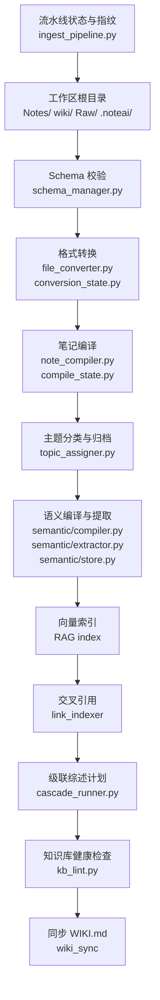
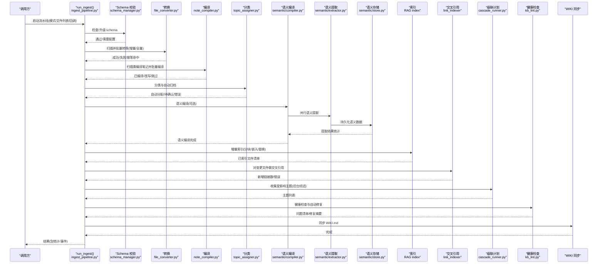
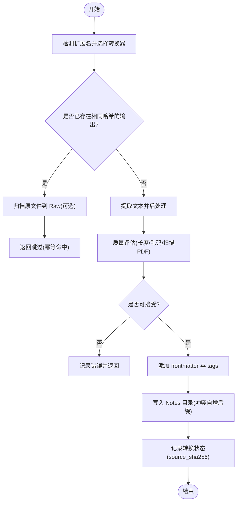
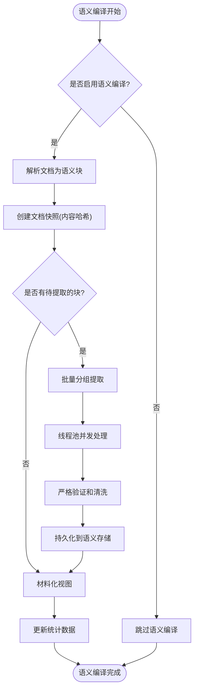
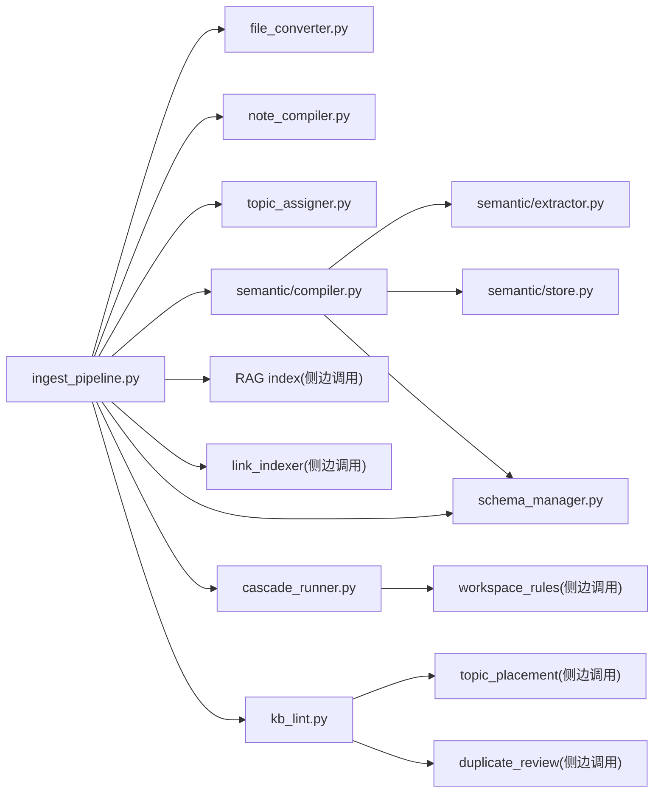

# 入库流水线

<cite>
**本文引用的文件**   
- [ingest_pipeline.py](file://python/sidecar/ingest_pipeline.py)
- [job_status.py](file://python/sidecar/job_status.py)
- [conversion_state.py](file://python/sidecar/conversion_state.py)
- [cascade_runner.py](file://python/sidecar/cascade_runner.py)
- [kb_lint.py](file://python/sidecar/kb_lint.py)
- [schema_manager.py](file://python/sidecar/schema_manager.py)
- [file_converter.py](file://modules/file_converter.py)
- [note_compiler.py](file://utils/note_compiler.py)
- [compile_state.py](file://python/sidecar/compile_state.py)
- [topic_assigner.py](file://utils/topic_assigner.py)
- [compiler.py](file://python/sidecar/semantic/compiler.py)
- [extractor.py](file://python/sidecar/semantic/extractor.py)
- [store.py](file://python/sidecar/semantic/store.py)
- [materializer.py](file://python/sidecar/semantic/materializer.py)
- [app_config.py](file://config/app_config.py)
</cite>

## 更新摘要
**所做更改**   
- 新增语义编译阶段（semantic）的完整文档说明
- 更新流水线阶段顺序，包含新增的语义提取集成
- 增强错误处理机制的详细描述
- 添加语义存储和材料化组件的技术细节
- 更新配置选项以包含语义编译开关

## 目录
1. [简介](#简介)
2. [项目结构](#项目结构)
3. [核心组件](#核心组件)
4. [架构总览](#架构总览)
5. [详细组件分析](#详细组件分析)
6. [依赖关系分析](#依赖关系分析)
7. [性能与并发](#性能与并发)
8. [故障诊断与排错](#故障诊断与排错)
9. [结论](#结论)
10. [附录：配置与监控](#附录配置与监控)

## 简介
本技术文档围绕"入库流水线"的端到端自动化处理链路展开，覆盖以下阶段：schema → convert → compile → classify → semantic → index → crossref → cascade → lint → sync。文档将解释每个阶段的职责、输入输出、错误处理机制，并说明任务状态管理、进度跟踪、断点续跑、重试策略、批量能力、并发控制与资源管理优化策略，最后提供配置、监控告警、故障诊断与调优建议。

**更新** 新增了语义编译阶段，该阶段负责从笔记内容中提取结构化语义信息，包括概念、实体和主张，为后续的知识图谱构建提供基础数据。

## 项目结构
入库流水线由多个模块协同完成：
- 流程编排与状态持久化：ingest_pipeline.py
- 转换与去重：file_converter.py + conversion_state.py
- 编译（规则+LLM）：note_compiler.py + compile_state.py
- 分类与自动归档：topic_assigner.py
- **新增** 语义编译与提取：semantic/compiler.py, semantic/extractor.py, semantic/store.py, semantic/materializer.py
- 向量索引与交叉引用：RAG 索引模块（在 ingest_pipeline.py 中调用）
- 级联综述更新：cascade_runner.py
- 健康检查与修复：kb_lint.py
- Schema 与工作区规则：schema_manager.py
- 后台作业状态：job_status.py

**图表来源**
- [ingest_pipeline.py:23-34](file://python/sidecar/ingest_pipeline.py#L23-L34)
- [compiler.py:129-257](file://python/sidecar/semantic/compiler.py#L129-L257)
- [extractor.py:361-515](file://python/sidecar/semantic/extractor.py#L361-L515)
- [store.py:154-800](file://python/sidecar/semantic/store.py#L154-L800)

章节来源
- [ingest_pipeline.py:23-34](file://python/sidecar/ingest_pipeline.py#L23-L34)
- [compiler.py:1-257](file://python/sidecar/semantic/compiler.py#L1-L257)

## 核心组件
- 流程编排器：定义阶段顺序、增量/全量模式、断点续跑、取消信号、进度回调、统计汇总与事件上报。
- 转换层：多格式到 Markdown 的转换，质量评估，源文件归档，幂等记录。
- 编译层：规则清理 + LLM 重写，增量判断与状态持久化。
- 分类层：基于路径/标题/标签/内容候选与 LLM 建议进行自动归档或待确认。
- **新增** 语义编译层：从笔记内容中提取概念、实体和主张，维护语义存储和依赖关系。
- 索引层：分块、向量化、替换与标记已索引，支持完整性修复。
- 交叉引用：对变更文件计算双向链接，小批量使用 LLM，大批量跳过。
- 级联综述：收集受影响主题，后台异步生成/更新综述，带重试与失败持久化。
- 健康检查：断链、孤儿页、过时综述、重复/近似重复、错位笔记扫描与自动修复。
- Schema 与工作区规则：解析 schema.md 标志位，驱动 AI 可写范围、综述粒度等。
- 作业状态：内存中的作业注册表，用于 UI 展示与事件推送。

**更新** 语义编译层是新增的核心组件，负责将非结构化的笔记内容转换为结构化的语义表示，支持增量处理和并发提取。

章节来源
- [ingest_pipeline.py:23-34](file://python/sidecar/ingest_pipeline.py#L23-L34)
- [compiler.py:129-257](file://python/sidecar/semantic/compiler.py#L129-L257)
- [extractor.py:361-515](file://python/sidecar/semantic/extractor.py#L361-L515)

## 架构总览
下图展示了从入口到各阶段的完整数据流与控制流，以及关键的状态与事件通道。

**图表来源**
- [ingest_pipeline.py:491-1054](file://python/sidecar/ingest_pipeline.py#L491-L1054)
- [compiler.py:129-257](file://python/sidecar/semantic/compiler.py#L129-L257)
- [extractor.py:361-515](file://python/sidecar/semantic/extractor.py#L361-L515)
- [store.py:154-800](file://python/sidecar/semantic/store.py#L154-L800)

## 详细组件分析

### 阶段一：Schema 校验与规则加载
- 目标：确保工作区 schema.md 存在且包含必要标记；解析规则标志位（如是否允许 AI 编辑 wiki/notes、最大层级、是否自动更新综述、综述粒度）。
- 输入：工作区路径；可选自定义文本。
- 输出：规则字典、是否需要配置提示。
- 错误处理：读取失败回退到内置模板；缺失标记时提示用户完成配置。
- 与流水线集成：若未配置，流水线提前返回并通知前端。

章节来源
- [schema_manager.py:68-124](file://python/sidecar/schema_manager.py#L68-L124)
- [schema_manager.py:140-178](file://python/sidecar/schema_manager.py#L140-L178)
- [ingest_pipeline.py:597-620](file://python/sidecar/ingest_pipeline.py#L597-L620)

### 阶段二：Convert（格式转换）
- 目标：将 PDF/DOCX/PPT/HTML/TXT 等转换为 Markdown，并进行质量评估与后处理。
- 输入：原始文件路径集合；输出目录；Raw 归档目录。
- 输出：Markdown 文件、质量报告、源文件归档位置、source_sha256。
- 幂等性：通过 conversion_state.json 记录 source_sha256→output 映射，避免重复转换。
- 错误处理：不支持格式/提取失败/质量不达标均会返回错误；部分失败不影响其他文件。
- 批量能力：convert_batch 串行处理，支持进度回调与失败记录。

**图表来源**
- [file_converter.py:569-770](file://modules/file_converter.py#L569-L770)
- [conversion_state.py:65-109](file://python/sidecar/conversion_state.py#L65-L109)

章节来源
- [file_converter.py:408-520](file://modules/file_converter.py#L408-L520)
- [file_converter.py:569-770](file://modules/file_converter.py#L569-L770)
- [conversion_state.py:1-109](file://python/sidecar/conversion_state.py#L1-L109)

### 阶段三：Compile（笔记编译）
- 目标：对来自外部格式的笔记进行规则清理与可选 LLM 重写，提升可读性与结构化程度。
- 输入：Notes 下需要编译的 Markdown 相对路径列表。
- 输出：被改写的文件数量与路径列表。
- 增量判断：基于 compile_state.json 记录 mtime，仅处理有变动的文件。
- 错误处理：LLM 不可用或异常时回退为规则清理；正文过短直接跳过。

章节来源
- [note_compiler.py:128-238](file://utils/note_compiler.py#L128-L238)
- [compile_state.py:1-55](file://python/sidecar/compile_state.py#L1-L55)

### 阶段四：Classify（主题分类与归档）
- 目标：根据文件名、frontmatter、文件夹路径、候选匹配与 LLM 建议，自动归入 Notes 对应主题目录或进入待确认队列。
- 输入：需要分类的 Markdown 文件路径。
- 输出：自动分配结果、待确认项、错误信息。
- 错误处理：单个文件失败不影响整体；错误累积并在阶段结束时抛出。

章节来源
- [topic_assigner.py:318-328](file://utils/topic_assigner.py#L318-L328)
- [topic_assigner.py:267-316](file://utils/topic_assigner.py#L267-L316)

### 阶段五：Semantic（语义编译与提取）**新增**
- 目标：从笔记内容中提取结构化语义信息，包括概念（concepts）、实体（entities）和主张（claims），建立证据关联关系。
- 输入：需要处理的 Markdown 文件路径列表；工作区路径。
- 输出：语义统计数据（文档数、块数、提取块数、主张数、失败数等）。
- 处理流程：
  1. 文档快照：解析 Markdown 为语义块，计算内容哈希，实现幂等处理
  2. 并行提取：使用线程池并发执行语义提取，最多4个worker
  3. 验证清洗：严格的JSON验证和证据引用检查
  4. 持久化存储：SQLite数据库存储语义数据，支持事务和并发访问
  5. 材料化视图：自动生成主题状态和Wiki页面
- 错误处理：单个文件失败不影响整体；失败详情记录在stats.failures中
- 配置开关：semantic_compile_enabled 控制是否启用语义编译

**图表来源**
- [compiler.py:129-257](file://python/sidecar/semantic/compiler.py#L129-L257)
- [extractor.py:361-515](file://python/sidecar/semantic/extractor.py#L361-L515)
- [store.py:154-800](file://python/sidecar/semantic/store.py#L154-L800)

章节来源
- [compiler.py:129-257](file://python/sidecar/semantic/compiler.py#L129-L257)
- [extractor.py:361-515](file://python/sidecar/semantic/extractor.py#L361-L515)
- [store.py:154-800](file://python/sidecar/semantic/store.py#L154-L800)
- [materializer.py:32-152](file://python/sidecar/semantic/materializer.py#L32-L152)

### 阶段六：Index（向量索引）
- 目标：对 Notes 下的 Markdown 进行分块、向量化与索引替换，维护索引一致性。
- 输入：需要索引的文件列表（增量/全量）。
- 输出：本次更新的文件数量与路径。
- 完整性修复：当实际 chunk 数与清单不一致时，触发全量修复。
- 并发保护：通过 RAG 索引锁避免多进程同时更新。

章节来源
- [ingest_pipeline.py:350-462](file://python/sidecar/ingest_pipeline.py#L350-L462)

### 阶段七：Crossref（交叉引用）
- 目标：为本次变更的文件建立双向链接，小批量启用 LLM 增强，大批量跳过以节省时间。
- 输入：本次索引变更的文件相对路径列表。
- 输出：新增链接数、错误列表。
- 错误处理：单文件异常记录并继续，最终汇总错误。

章节来源
- [ingest_pipeline.py:790-834](file://python/sidecar/ingest_pipeline.py#L790-L834)

### 阶段八：Cascade（级联综述）
- 目标：收集受影响的综述主题，后台异步生成/更新综述，具备重试与失败持久化。
- 输入：受影响主题集合。
- 输出：计划更新的综述主题列表；后台执行结果事件。
- 重试策略：最多重试次数与固定延迟；失败写入 cascade_failures.json。

章节来源
- [ingest_pipeline.py:836-860](file://python/sidecar/ingest_pipeline.py#L836-860)
- [cascade_runner.py:74-154](file://python/sidecar/cascade_runner.py#L74-L154)
- [cascade_runner.py:187-195](file://python/sidecar/cascade_runner.py#L187-L195)

### 阶段九：Lint（健康检查）
- 目标：扫描断链、孤儿页、过时综述、重复/近似重复、错位笔记，并提供自动修复。
- 输入：工作区路径。
- 输出：问题清单、修复摘要、日志条目。
- 自动修复：删除断链、移动错位笔记、刷新过时综述。

章节来源
- [kb_lint.py:414-485](file://python/sidecar/kb_lint.py#L414-L485)
- [kb_lint.py:166-246](file://python/sidecar/kb_lint.py#L166-L246)

### 阶段十：Sync（WIKI 同步）
- 目标：保持 WIKI.md 与 Notes 目录一致。
- 输入：无（内部扫描 Notes）。
- 输出：同步完成事件。

章节来源
- [ingest_pipeline.py:879-886](file://python/sidecar/ingest_pipeline.py#L879-886)

## 依赖关系分析
- 低耦合高内聚：每个阶段独立实现，通过函数式接口与回调进行通信。
- 关键依赖：
  - ingest_pipeline.py 依赖 file_converter、note_compiler、topic_assigner、semantic compiler、RAG index、link_indexer、kb_lint、cascade_runner、schema_manager。
  - semantic compiler 依赖 extractor、store、materializer 等语义组件。
  - cascade_runner 依赖 workspace_rules 与 wiki 可写性检查。
  - kb_lint 依赖 topic_placement、duplicate_review、organization_audit。
- 潜在循环：未发现直接循环导入；跨模块通过显式 import 调用。

**图表来源**
- [ingest_pipeline.py:491-1054](file://python/sidecar/ingest_pipeline.py#L491-L1054)
- [compiler.py:129-257](file://python/sidecar/semantic/compiler.py#L129-L257)
- [extractor.py:361-515](file://python/sidecar/semantic/extractor.py#L361-L515)
- [store.py:154-800](file://python/sidecar/semantic/store.py#L154-L800)

章节来源
- [ingest_pipeline.py:491-1054](file://python/sidecar/ingest_pipeline.py#L491-L1054)

## 性能与并发
- 增量优先：
  - 工作区指纹（mtime+size）快速判定是否有变更，避免全量扫描。
  - 转换幂等、编译增量、索引增量、交叉引用仅对变更文件。
  - 语义编译基于内容哈希实现幂等，避免重复提取。
- 批量与并行：
  - 转换与编译采用批处理接口，支持进度回调；当前实现为串行遍历，适合 IO/CPU 混合场景。
  - 语义提取使用线程池并发处理，最多4个worker，提高LLM调用吞吐量。
  - 索引阶段通过锁保证同一时刻只有一个任务更新索引，避免竞争。
- 资源管理：
  - 原子写入 JSON 状态文件，避免损坏。
  - 大文件/长文档限制 LLM 调用长度，避免超时与成本过高。
  - SQLite WAL模式提升并发读写性能。
- 取消与中断：
  - 全局取消信号与"代数"机制，确保新请求能覆盖旧运行；阶段间频繁检查取消。
  - 语义提取支持取消信号传播，及时终止长时间运行的提取任务。
- 断点续跑：
  - 保存 completed_stages、affected_topics、pending_crossref_paths 等中间态，重启后可恢复。
  - 语义编译状态持久化，支持中断后继续处理。

**更新** 语义编译阶段引入了多线程并发处理和SQLite事务管理，显著提升了大规模文档处理的性能和可靠性。

章节来源
- [ingest_pipeline.py:93-105](file://python/sidecar/ingest_pipeline.py#L93-L105)
- [compiler.py:187-224](file://python/sidecar/semantic/compiler.py#L187-L224)
- [store.py:160-199](file://python/sidecar/semantic/store.py#L160-L199)

## 故障诊断与排错
- 常见错误与定位
  - 未设置工作区：入口即返回，检查配置。
  - Schema 未配置：流水线提前终止，引导完成配置。
  - 转换失败：查看转换质量评估与错误消息；必要时重新转换或调整源文件。
  - **新增** 语义编译失败：检查semantic_compile_enabled配置，查看stats.semantic_failures获取详细错误信息。
  - 索引不可用：提示关闭其他实例或等待锁释放。
  - 分类失败：查看待确认队列与错误明细。
  - 交叉引用失败：检查链接目标是否存在。
  - 健康检查问题：根据报告逐项修复或忽略。
- 日志与报告
  - 健康检查报告持久化并可过滤过期项。
  - 级联失败持久化，支持重试。
  - **新增** 语义编译失败详情记录，包括失败的文档、块ID和具体错误原因。
- 恢复策略
  - 断点续跑：上次未完成自动标记为 interrupted，下次启动自动续跑。
  - 强制全量：完成 Schema 向导后可强制下一次全量。
  - **新增** 语义编译支持增量恢复，只处理有变化的文档和块。

**更新** 新增了语义编译相关的故障诊断和恢复机制，包括详细的错误记录和增量恢复能力。

章节来源
- [ingest_pipeline.py:597-620](file://python/sidecar/ingest_pipeline.py#L597-L620)
- [compiler.py:181-183](file://python/sidecar/semantic/compiler.py#L181-L183)
- [extractor.py:467-476](file://python/sidecar/semantic/extractor.py#L467-L476)
- [ingest_pipeline.py:384-386](file://python/sidecar/ingest_pipeline.py#L384-L386)
- [ingest_pipeline.py:915-942](file://python/sidecar/ingest_pipeline.py#L915-L942)
- [kb_lint.py:680-700](file://python/sidecar/kb_lint.py#L680-700)
- [cascade_runner.py:55-72](file://python/sidecar/cascade_runner.py#L55-L72)

## 结论
入库流水线以"增量优先、幂等可靠、可中断可恢复"为核心设计原则，串联了从格式转换、内容编译、主题分类、语义提取、向量索引、交叉引用、级联综述、健康检查到 WIKI 同步的完整链路。通过细粒度的状态持久化与事件上报，系统具备良好的可观测性与可运维性。配合合理的批量与并发策略，可在大规模知识库场景下保持稳定与高效。

**更新** 新增的语义编译阶段为知识库注入了结构化语义信息，支持更智能的知识检索和推理能力，同时保持了与现有流水线的无缝集成。

## 附录：配置与监控
- 配置要点
  - Schema 标志位：ai_may_edit_wiki、ai_may_edit_notes、max_topic_depth、auto_update_survey、survey_at_level。
  - 自动入库开关：ingest_auto_enabled。
  - RAG 开关：rag_enabled。
  - **新增** 语义编译开关：semantic_compile_enabled（默认启用）。
- 监控指标
  - 每阶段进度与消息（send_progress）。
  - 事件类型：ingest_complete、job_update、cascade_survey_chunk、cascade_done。
  - 统计字段：converted、compiled、classified、indexed_files、cross_refs、cascade_topics、lint 摘要等。
  - **新增** 语义统计：semantic_documents、semantic_blocks、semantic_extracted_blocks、semantic_claims、semantic_failed_blocks、semantic_pending_documents、semantic_failures。
- 操作指南
  - 首次运行：完成 Schema 向导，再触发一次全量入库。
  - 日常增量：放入新文件或修改现有笔记，系统自动检测并增量处理。
  - 手动干预：查看健康检查报告，修复断链/过时综述/错位笔记；必要时触发强制全量。
  - 失败重试：查看级联失败列表并一键重试；转换失败可单独重试。
  - **新增** 语义编译管理：可通过配置开关控制语义编译的启用/禁用，查看语义编译统计了解处理效果。

**更新** 新增了语义编译相关的配置选项和监控指标，便于管理和调优语义处理能力。

章节来源
- [schema_manager.py:140-178](file://python/sidecar/schema_manager.py#L140-L178)
- [ingest_pipeline.py:508-548](file://python/sidecar/ingest_pipeline.py#L508-L548)
- [job_status.py:35-92](file://python/sidecar/job_status.py#L35-L92)
- [cascade_runner.py:156-195](file://python/sidecar/cascade_runner.py#L156-L195)
- [app_config.py:86-87](file://config/app_config.py#L86-L87)
- [compiler.py:142-152](file://python/sidecar/semantic/compiler.py#L142-L152)