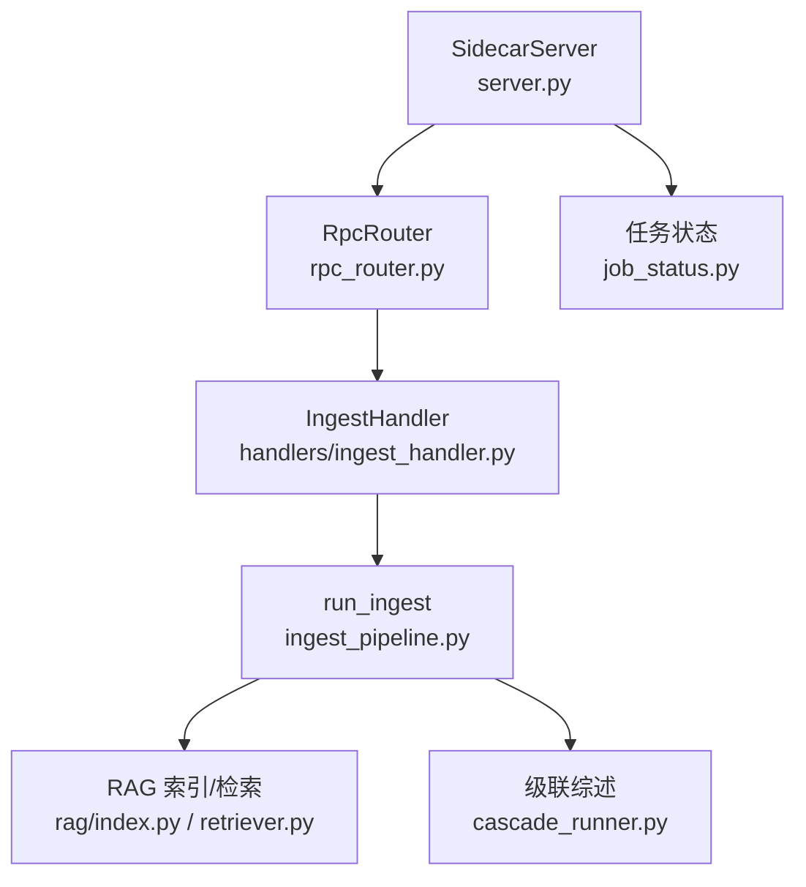
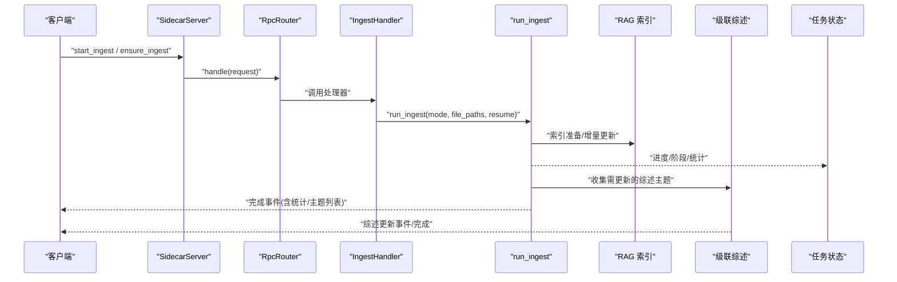
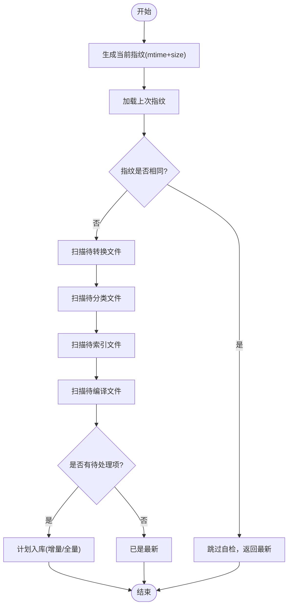
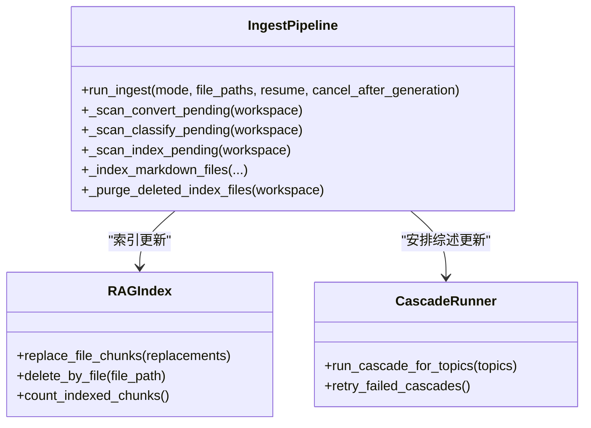
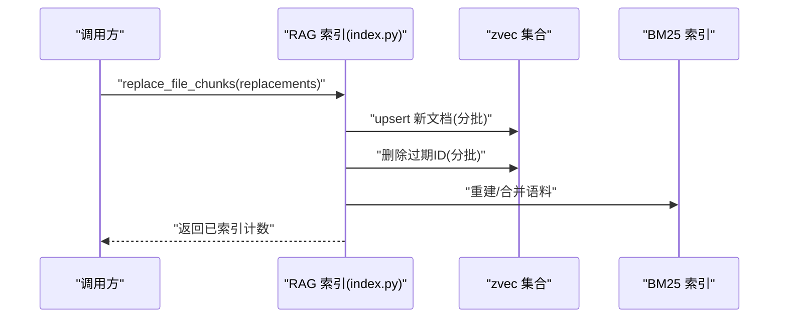
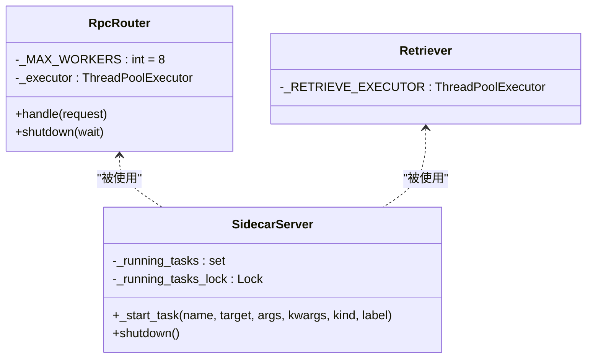
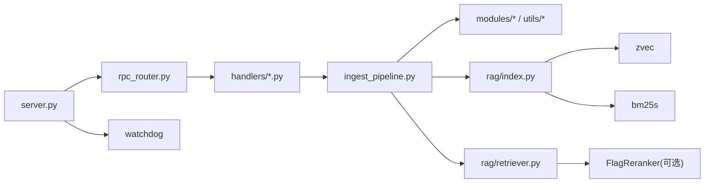

# 批量处理与并发控制

<cite>
**本文引用的文件**   
- [ingest_pipeline.py](file://python/sidecar/ingest_pipeline.py)
- [server.py](file://python/sidecar/server.py)
- [rpc_router.py](file://python/sidecar/rpc_router.py)
- [job_status.py](file://python/sidecar/job_status.py)
- [index.py](file://python/sidecar/rag/index.py)
- [retriever.py](file://python/sidecar/rag/retriever.py)
- [cascade_runner.py](file://python/sidecar/cascade_runner.py)
- [ingest_handler.py](file://python/sidecar/handlers/ingest_handler.py)
</cite>

## 目录
1. [引言](#引言)
2. [项目结构](#项目结构)
3. [核心组件](#核心组件)
4. [架构总览](#架构总览)
5. [详细组件分析](#详细组件分析)
6. [依赖关系分析](#依赖关系分析)
7. [性能考量](#性能考量)
8. [故障排除指南](#故障排除指南)
9. [结论](#结论)
10. [附录](#附录)

## 引言
本技术文档聚焦入库流水线的批量处理系统，围绕以下目标展开：
- 文件扫描算法与增量检测优化
- 批量处理策略（转换、编译、分类、索引、交叉引用、级联综述、健康检查、同步）
- 线程池管理、资源限制与内存优化
- 并发安全控制、锁机制与死锁预防
- 批量大小调优、并行度配置与性能监控
- 大数据集处理最佳实践与故障排除

## 项目结构
入库流水线由 RPC 路由层、处理器层、流水线编排层、RAG 索引与检索层、后台任务状态管理等模块组成。关键路径如下：
- server.py 启动 SidecarServer，注册路由，启动工作区文件监听与后台任务
- rpc_router.py 提供 JSON-RPC 路由与线程池执行器
- handlers/ingest_handler.py 暴露入库相关 RPC 方法，调度 run_ingest
- ingest_pipeline.py 编排各阶段，实现增量检测、取消语义、进度上报
- rag/index.py 与 rag/retriever.py 负责向量/BM25 索引构建与检索
- cascade_runner.py 负责主题综述的可靠更新与重试
- job_status.py 维护后台任务状态并推送事件

图示来源
- [server.py:54-125](file://python/sidecar/server.py#L54-L125)
- [rpc_router.py:43-82](file://python/sidecar/rpc_router.py#L43-L82)
- [ingest_handler.py:32-49](file://python/sidecar/handlers/ingest_handler.py#L32-L49)
- [ingest_pipeline.py:480-560](file://python/sidecar/ingest_pipeline.py#L480-L560)
- [index.py:67-79](file://python/sidecar/rag/index.py#L67-L79)
- [retriever.py:102-196](file://python/sidecar/rag/retriever.py#L102-L196)
- [cascade_runner.py:74-153](file://python/sidecar/cascade_runner.py#L74-L153)
- [job_status.py:35-64](file://python/sidecar/job_status.py#L35-L64)

章节来源
- [server.py:54-125](file://python/sidecar/server.py#L54-L125)
- [rpc_router.py:43-82](file://python/sidecar/rpc_router.py#L43-L82)
- [ingest_handler.py:32-49](file://python/sidecar/handlers/ingest_handler.py#L32-L49)
- [ingest_pipeline.py:480-560](file://python/sidecar/ingest_pipeline.py#L480-L560)
- [index.py:67-79](file://python/sidecar/rag/index.py#L67-L79)
- [retriever.py:102-196](file://python/sidecar/rag/retriever.py#L102-L196)
- [cascade_runner.py:74-153](file://python/sidecar/cascade_runner.py#L74-L153)
- [job_status.py:35-64](file://python/sidecar/job_status.py#L35-L64)

## 核心组件
- 文件扫描与增量检测
  - 指纹快照：基于 mtime+size 的快速指纹对比，避免全量哈希
  - 变更判定：比较上次指纹与当前指纹，快速判断是否需要重跑
  - 阶段扫描：分别扫描待转换、待分类、待索引的文件集合
- 批量处理策略
  - 分阶段推进：rules → convert → compile → classify → index → crossref → cascade → lint → sync
  - 断点续跑：记录 completed_stages 与受影响主题/交叉引用路径，支持 resume
  - 取消语义：全局取消事件 + 生成号，确保跨线程可观测
- 并发与资源
  - RPC 线程池：统一入口，隔离阻塞
  - RAG 写入互斥：按工作区加锁，串行化写操作
  - 批量大小与并行度：索引批大小、BM25 重建、HyDE/Rerank 候选上限等
- 持久化与原子性
  - 指纹/状态/清单/元数据采用临时文件+替换的原子写入
  - 失败重试与幂等：级联综述失败持久化，支持重试

章节来源
- [ingest_pipeline.py:65-104](file://python/sidecar/ingest_pipeline.py#L65-L104)
- [ingest_pipeline.py:277-347](file://python/sidecar/ingest_pipeline.py#L277-L347)
- [ingest_pipeline.py:480-560](file://python/sidecar/ingest_pipeline.py#L480-L560)
- [index.py:119-146](file://python/sidecar/rag/index.py#L119-L146)
- [index.py:646-701](file://python/sidecar/rag/index.py#L646-L701)
- [cascade_runner.py:24-26](file://python/sidecar/cascade_runner.py#L24-L26)

## 架构总览
入库流水线在 Sidecar 进程中运行，通过 JSON-RPC 接收请求，使用线程池执行；RAG 索引与检索作为独立子系统，提供向量与关键词混合检索能力；后台任务状态统一管理，并通过事件通道向前端推送进度与结果。

图示来源
- [server.py:54-125](file://python/sidecar/server.py#L54-L125)
- [rpc_router.py:43-82](file://python/sidecar/rpc_router.py#L43-L82)
- [ingest_handler.py:132-151](file://python/sidecar/handlers/ingest_handler.py#L132-L151)
- [ingest_pipeline.py:480-560](file://python/sidecar/ingest_pipeline.py#L480-L560)
- [index.py:67-79](file://python/sidecar/rag/index.py#L67-L79)
- [cascade_runner.py:156-184](file://python/sidecar/cascade_runner.py#L156-L184)
- [job_status.py:35-64](file://python/sidecar/job_status.py#L35-L64)

## 详细组件分析

### 文件扫描与增量检测
- 指纹生成：遍历工作区，过滤隐藏/忽略目录与受控目录，仅对 .md 与可转换格式计算 mtime+size
- 增量判定：加载上次指纹，若相等则跳过后续重扫；否则进入具体阶段扫描
- 阶段扫描：
  - 转换：扫描未转换的可转换文件
  - 分类：筛选收件箱孤儿且缺少主题或需要处理的笔记
  - 索引：根据 Notes 下 .md 的 mtime 与索引状态决定是否需要重新索引

图示来源
- [ingest_pipeline.py:65-104](file://python/sidecar/ingest_pipeline.py#L65-L104)
- [ingest_pipeline.py:180-199](file://python/sidecar/ingest_pipeline.py#L180-L199)
- [ingest_pipeline.py:277-347](file://python/sidecar/ingest_pipeline.py#L277-L347)
- [ingest_pipeline.py:294-313](file://python/sidecar/ingest_pipeline.py#L294-L313)

章节来源
- [ingest_pipeline.py:65-104](file://python/sidecar/ingest_pipeline.py#L65-L104)
- [ingest_pipeline.py:180-199](file://python/sidecar/ingest_pipeline.py#L180-L199)
- [ingest_pipeline.py:277-347](file://python/sidecar/ingest_pipeline.py#L277-L347)
- [ingest_pipeline.py:294-313](file://python/sidecar/ingest_pipeline.py#L294-L313)

### 批量处理策略与阶段编排
- 阶段定义：rules、convert、compile、classify、index、crossref、cascade、lint、sync
- 断点续跑：记录 completed_stages、affected_topics、pending_crossref_paths，resume 时恢复上下文
- 取消传播：cancel_after_generation 捕获入队时的取消生成号，内部 cancelled() 判断是否应终止
- 进度上报：每阶段内回调 send_progress，持久化 state 并推送事件

图示来源
- [ingest_pipeline.py:480-947](file://python/sidecar/ingest_pipeline.py#L480-L947)
- [index.py:646-701](file://python/sidecar/rag/index.py#L646-L701)
- [cascade_runner.py:156-184](file://python/sidecar/cascade_runner.py#L156-L184)

章节来源
- [ingest_pipeline.py:480-947](file://python/sidecar/ingest_pipeline.py#L480-L947)
- [index.py:646-701](file://python/sidecar/rag/index.py#L646-L701)
- [cascade_runner.py:156-184](file://python/sidecar/cascade_runner.py#L156-L184)

### 索引与检索：并发安全与内存优化
- 写入互斥：index_operation 按工作区加锁，保证同一时刻只有一个写入者
- 集合缓存：_COLLECTION_CACHE 缓存 zvec.Collection 句柄，减少重复 open 开销
- 批量写入：_INDEX_BATCH_SIZE 控制插入批次，避免单次过大请求
- BM25 重建：合并旧语料与新片段后重建，避免频繁重建
- 删除清理：按文件删除对应 chunk 并更新元数据，必要时重建 BM25
- 检索优化：TTL 查询缓存、MMR 去重、可选 HyDE 与 Rerank，动态 top_k

图示来源
- [index.py:67-79](file://python/sidecar/rag/index.py#L67-L79)
- [index.py:584-594](file://python/sidecar/rag/index.py#L584-L594)
- [index.py:646-701](file://python/sidecar/rag/index.py#L646-L701)
- [index.py:487-500](file://python/sidecar/rag/index.py#L487-L500)
- [retriever.py:102-196](file://python/sidecar/rag/retriever.py#L102-L196)

章节来源
- [index.py:67-79](file://python/sidecar/rag/index.py#L67-L79)
- [index.py:584-594](file://python/sidecar/rag/index.py#L584-L594)
- [index.py:646-701](file://python/sidecar/rag/index.py#L646-L701)
- [index.py:487-500](file://python/sidecar/rag/index.py#L487-L500)
- [retriever.py:102-196](file://python/sidecar/rag/retriever.py#L102-L196)

### 线程池管理与资源限制
- RPC 线程池：RpcRouter._MAX_WORKERS=8，所有处理器提交到线程池，避免阻塞 stdin 读取循环
- 后台任务：SidecarServer 使用 _start_task 启动守护线程，统一生命周期与错误上报
- 检索线程池：_RETRIEVE_EXECUTOR(max_workers=2)，用于检索相关异步任务
- 模型预热：ModelWarmupManager 启动预加载，降低首次延迟

图示来源
- [rpc_router.py:43-82](file://python/sidecar/rpc_router.py#L43-L82)
- [server.py:184-214](file://python/sidecar/server.py#L184-L214)
- [retriever.py:36](file://python/sidecar/rag/retriever.py#L36)

章节来源
- [rpc_router.py:43-82](file://python/sidecar/rpc_router.py#L43-L82)
- [server.py:184-214](file://python/sidecar/server.py#L184-L214)
- [retriever.py:36](file://python/sidecar/rag/retriever.py#L36)

### 并发安全控制、锁机制与死锁预防
- 全局取消：_cancel_event + _cancel_lock + _cancel_generation，避免竞态
- 状态持久化：_state_lock 保护 ingest_state.json 的原子写入
- RAG 写入互斥：index_operation 按工作区加锁，防止多进程/多线程并发写入
- 集合 IO 锁：_COLLECTION_IO_LOCK 串行化集合打开/关闭与统计查询
- 死锁预防：
  - 避免嵌套持有长生命期锁的同时进行 I/O
  - 将耗时操作（如 BM25 重建）移出临界区或在释放集合句柄后进行
  - 使用非阻塞尝试获取锁并在服务中给出明确提示

章节来源
- [ingest_pipeline.py:25-28](file://python/sidecar/ingest_pipeline.py#L25-L28)
- [ingest_pipeline.py:118-145](file://python/sidecar/ingest_pipeline.py#L118-L145)
- [index.py:67-79](file://python/sidecar/rag/index.py#L67-L79)
- [index.py:255-284](file://python/sidecar/rag/index.py#L255-L284)

### 批量大小调优、并行度配置与性能监控
- 批量大小
  - 索引批大小：_INDEX_BATCH_SIZE=128，控制 insert/upsert 批次
  - 检索批大小：_FETCH_BATCH_SIZE=256，控制 fetch 批次
- 并行度
  - RPC 线程池：8 个工作线程
  - 检索线程池：2 个工作线程
  - 全文分块并行：_chunk_files_parallel 使用 4 个线程
- 性能监控
  - 任务状态：job_status 维护 running/complete/failed/cancelled 及进度
  - 流水线进度：每个阶段回调 send_progress，持久化 state 并推送事件
  - 统计信息：converted/compiled/classified/indexed_files/cascade_updated 等

章节来源
- [index.py:36-41](file://python/sidecar/rag/index.py#L36-L41)
- [retriever.py:29](file://python/sidecar/rag/retriever.py#L29)
- [rpc_router.py:44](file://python/sidecar/rpc_router.py#L44)
- [retriever.py:36](file://python/sidecar/rag/retriever.py#L36)
- [retriever.py:387-403](file://python/sidecar/rag/retriever.py#L387-L403)
- [job_status.py:35-64](file://python/sidecar/job_status.py#L35-L64)
- [ingest_pipeline.py:584-591](file://python/sidecar/ingest_pipeline.py#L584-L591)

### 大数据集处理最佳实践
- 优先增量：利用指纹与 manifest 比对，仅处理变更文件
- 分阶段推进：convert/compile/classify/index/crossref/cascade/lint/sync 逐步推进，便于中断与恢复
- 原子写入：manifest/metadata/state/fingerprint 均使用临时文件+替换，避免损坏
- 失败重试：级联综述失败持久化，支持手动重试
- 资源回收：及时释放集合句柄并触发 GC，避免内存泄漏

章节来源
- [ingest_pipeline.py:65-104](file://python/sidecar/ingest_pipeline.py#L65-L104)
- [index.py:119-146](file://python/sidecar/rag/index.py#L119-L146)
- [cascade_runner.py:24-26](file://python/sidecar/cascade_runner.py#L24-L26)
- [index.py:215-227](file://python/sidecar/rag/index.py#L215-L227)

## 依赖关系分析
- 组件耦合
  - server.py 依赖 handlers 与 utils，启动 watcher 与后台任务
  - rpc_router.py 为所有 handler 提供线程池执行环境
  - ingest_handler.py 封装 run_ingest 的调用与事件转发
  - ingest_pipeline.py 依赖 modules/file_converter、utils/topic_assigner、sidecar/rag/*
  - rag/index.py 与 rag/retriever.py 共同维护索引与检索一致性
- 外部依赖
  - zvec/bm25s 用于向量与关键词检索
  - watchdog 用于文件系统事件监听
  - FlagReranker 可选用于重排序

图示来源
- [server.py:54-125](file://python/sidecar/server.py#L54-L125)
- [rpc_router.py:43-82](file://python/sidecar/rpc_router.py#L43-L82)
- [ingest_handler.py:32-49](file://python/sidecar/handlers/ingest_handler.py#L32-L49)
- [ingest_pipeline.py:14-22](file://python/sidecar/ingest_pipeline.py#L14-L22)
- [index.py:22-28](file://python/sidecar/rag/index.py#L22-L28)
- [retriever.py:10-24](file://python/sidecar/rag/retriever.py#L10-L24)

章节来源
- [server.py:54-125](file://python/sidecar/server.py#L54-L125)
- [rpc_router.py:43-82](file://python/sidecar/rpc_router.py#L43-L82)
- [ingest_handler.py:32-49](file://python/sidecar/handlers/ingest_handler.py#L32-L49)
- [ingest_pipeline.py:14-22](file://python/sidecar/ingest_pipeline.py#L14-L22)
- [index.py:22-28](file://python/sidecar/rag/index.py#L22-L28)
- [retriever.py:10-24](file://python/sidecar/rag/retriever.py#L10-L24)

## 性能考量
- 减少不必要的全量重建：is_index_up_to_date 与 manifest 比对，优先增量
- 控制候选规模：MMR 候选上限、Rerank 候选上限，避免大矩阵运算
- 缓存命中：查询 TTL 缓存、集合句柄缓存、BM25 缓存
- 批处理：insert/upsert/delete 分批，降低单次负载
- 资源释放：及时释放集合句柄并触发 GC，避免内存膨胀

[本节为通用指导，不直接分析具体文件]

## 故障排除指南
- 索引被占用
  - 现象：提示“索引文件被占用”
  - 排查：确认无其他 NoteAI 实例持有 zvec 锁；必要时重启或等待锁释放
- 索引不一致
  - 现象：expected_chunks 与 actual_chunks 不匹配
  - 处理：触发修复流程，重建索引或增量修复
- 级联综述失败
  - 现象：部分主题综述更新失败
  - 处理：查看失败记录，手动重试；检查 WIKI 可写性与主题文件夹创建
- 取消无效
  - 现象：请求取消但仍在运行
  - 排查：确认 cancel_after_generation 正确传递；检查 is_cancelled 与 cancelled() 逻辑

章节来源
- [index.py:169-189](file://python/sidecar/rag/index.py#L169-L189)
- [ingest_pipeline.py:384-402](file://python/sidecar/ingest_pipeline.py#L384-L402)
- [cascade_runner.py:55-71](file://python/sidecar/cascade_runner.py#L55-L71)
- [ingest_pipeline.py:147-165](file://python/sidecar/ingest_pipeline.py#L147-L165)

## 结论
本系统通过指纹驱动的增量检测、分阶段编排与断点续跑，结合严格的并发控制与资源管理，实现了高效稳定的批量入库流水线。配合 RAG 索引与检索的批处理与缓存策略，可在大数据集场景下保持良好吞吐与低延迟。建议在生产环境中关注批量大小与并行度的调优，并结合任务状态与日志进行持续监控与排障。

[本节为总结，不直接分析具体文件]

## 附录
- 关键配置项参考
  - 索引批大小：_INDEX_BATCH_SIZE=128
  - 检索批大小：_FETCH_BATCH_SIZE=256
  - RPC 线程池最大工作线程：8
  - 检索线程池最大工作线程：2
  - 分块并行线程数：4
- 常用接口
  - start_ingest / ensure_ingest：启动入库
  - request_full_ingest：标记下次全量
  - cancel_ingest：请求取消
  - get_ingest_status：查询状态
  - rebuild_index：重建索引（支持增量/全量）

章节来源
- [index.py:36-41](file://python/sidecar/rag/index.py#L36-L41)
- [retriever.py:29](file://python/sidecar/rag/retriever.py#L29)
- [rpc_router.py:44](file://python/sidecar/rpc_router.py#L44)
- [retriever.py:36](file://python/sidecar/rag/retriever.py#L36)
- [retriever.py:387-403](file://python/sidecar/rag/retriever.py#L387-L403)
- [ingest_handler.py:32-49](file://python/sidecar/handlers/ingest_handler.py#L32-L49)