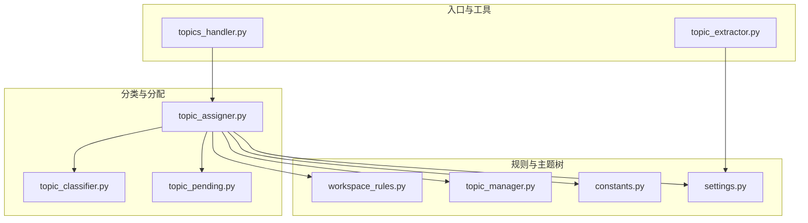
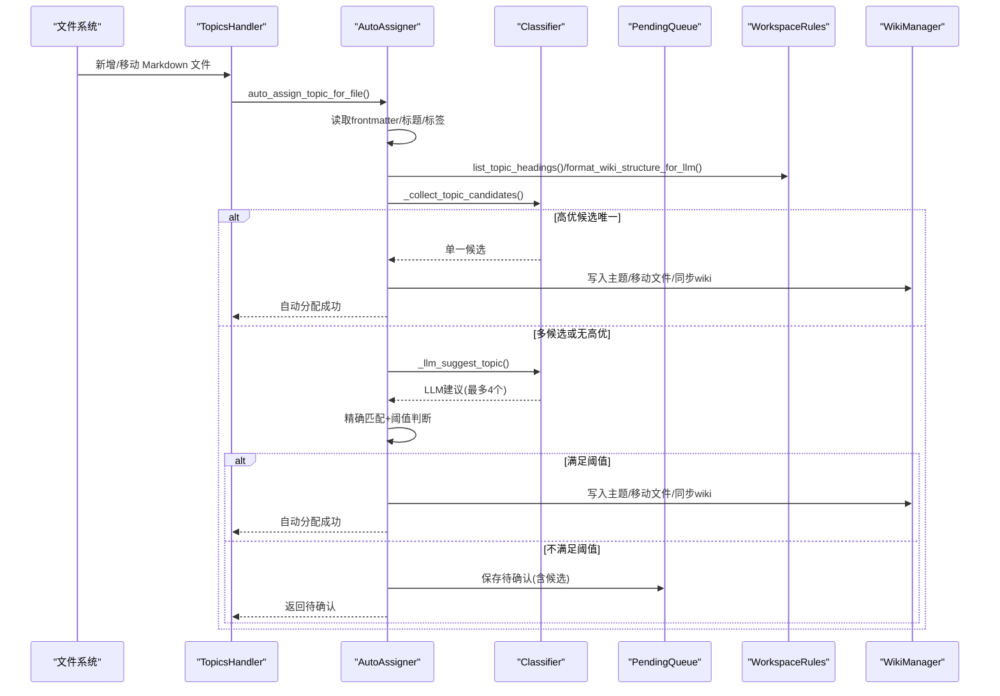
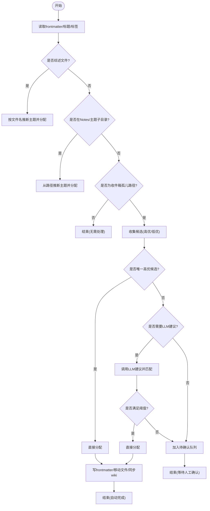
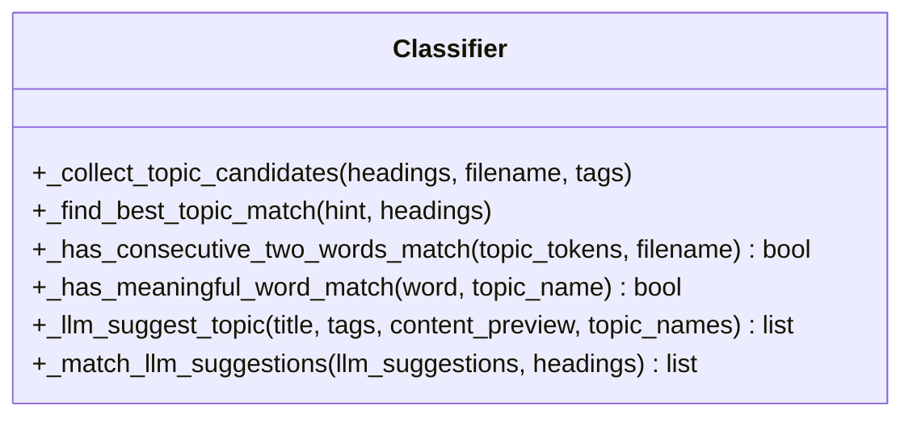
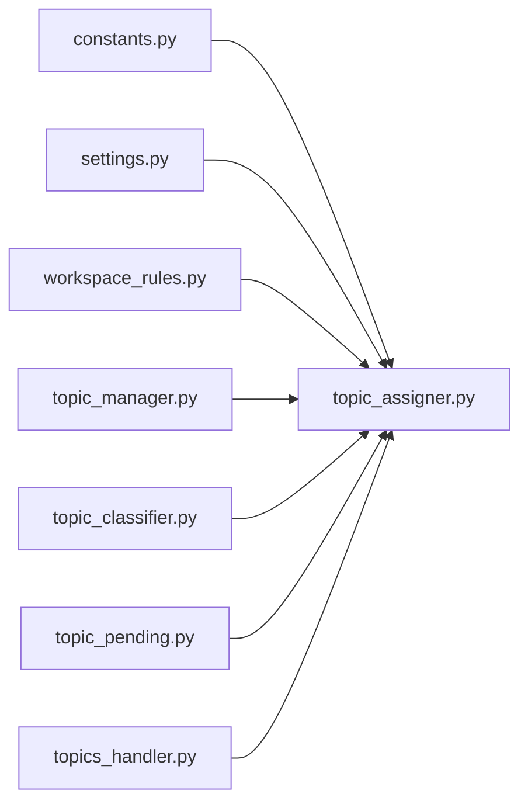

# 主题分类阶段

<cite>
**本文引用的文件**   
- [utils/topic_assigner.py](file://utils/topic_assigner.py)
- [utils/topic_classifier.py](file://utils/topic_classifier.py)
- [utils/topic_pending.py](file://utils/topic_pending.py)
- [python/sidecar/handlers/topics_handler.py](file://python/sidecar/handlers/topics_handler.py)
- [python/sidecar/workspace_rules.py](file://python/sidecar/workspace_rules.py)
- [utils/topic_manager.py](file://utils/topic_manager.py)
- [config/constants.py](file://config/constants.py)
- [config/settings.py](file://config/settings.py)
- [modules/topic_extractor.py](file://modules/topic_extractor.py)
- [tests/unit/test_topic_placement.py](file://tests/unit/test_topic_placement.py)
</cite>

## 目录
1. [简介](#简介)
2. [项目结构](#项目结构)
3. [核心组件](#核心组件)
4. [架构总览](#架构总览)
5. [详细组件分析](#详细组件分析)
6. [依赖关系分析](#依赖关系分析)
7. [性能与可扩展性](#性能与可扩展性)
8. [故障排查指南](#故障排查指南)
9. [结论](#结论)
10. [附录：配置示例与自定义规则](#附录：配置示例与自定义规则)

## 简介
本章节聚焦入库流水线的“主题分类阶段”，系统性阐述自动主题分类算法与流程，包括：
- 基于文件路径的分类（Notes/ 子目录推断）
- 基于内容与标签的启发式匹配
- AI 辅助主题建议与阈值控制
- 待确认主题管理与批量处理
- 工作区规则与分层主题体系
- 分类准确率优化策略与可观测性

## 项目结构
主题分类相关代码主要分布在以下模块：
- 分类器与分配器：utils/topic_classifier.py、utils/topic_assigner.py
- 待确认队列：utils/topic_pending.py
- 工作区规则与主题树：python/sidecar/workspace_rules.py、utils/topic_manager.py
- 处理器与入口：python/sidecar/handlers/topics_handler.py
- 常量与设置：config/constants.py、config/settings.py
- 主题提取（AI 辅助构建主题库）：modules/topic_extractor.py
- 行为验证测试：tests/unit/test_topic_placement.py

图表来源
- [utils/topic_assigner.py:1-418](file://utils/topic_assigner.py#L1-L418)
- [utils/topic_classifier.py:1-159](file://utils/topic_classifier.py#L1-L159)
- [utils/topic_pending.py:1-99](file://utils/topic_pending.py#L1-L99)
- [python/sidecar/workspace_rules.py:1-200](file://python/sidecar/workspace_rules.py#L1-L200)
- [utils/topic_manager.py:1-485](file://utils/topic_manager.py#L1-L485)
- [config/constants.py:1-52](file://config/constants.py#L1-L52)
- [config/settings.py:1-41](file://config/settings.py#L1-L41)
- [modules/topic_extractor.py:1-245](file://modules/topic_extractor.py#L1-L245)
- [python/sidecar/handlers/topics_handler.py:1-588](file://python/sidecar/handlers/topics_handler.py#L1-L588)

章节来源
- [utils/topic_assigner.py:1-418](file://utils/topic_assigner.py#L1-L418)
- [utils/topic_classifier.py:1-159](file://utils/topic_classifier.py#L1-L159)
- [utils/topic_pending.py:1-99](file://utils/topic_pending.py#L1-L99)
- [python/sidecar/workspace_rules.py:1-200](file://python/sidecar/workspace_rules.py#L1-L200)
- [utils/topic_manager.py:1-485](file://utils/topic_manager.py#L1-L485)
- [config/constants.py:1-52](file://config/constants.py#L1-L52)
- [config/settings.py:1-41](file://config/settings.py#L1-L41)
- [modules/topic_extractor.py:1-245](file://modules/topic_extractor.py#L1-L245)
- [python/sidecar/handlers/topics_handler.py:1-588](file://python/sidecar/handlers/topics_handler.py#L1-L588)

## 核心组件
- 自动分配器（Auto Assigner）
  - 负责读取文件 frontmatter、解析标题与标签、结合路径与内容线索进行候选收集、LLM 建议、阈值判定与落盘。
- 分类器（Classifier）
  - 提供候选收集、相似度打分、连续词匹配、LLM 建议与结果匹配等能力。
- 待确认队列（Pending Topics）
  - 持久化保存需要人工确认的主题候选，支持清理与并发安全写入。
- 工作区规则（Workspace Rules）
  - 管理最大层级、综述级别、是否允许 AI 编辑 wiki/notes 等；同时提供主题结构摘要供 LLM 使用。
- 主题管理器（Topic Manager）
  - 维护三层主题树、从文件系统扫描构建主题树、统计文件数、校验删除与综述约束。
- 处理器（Topics Handler）
  - 暴露 API：自动分配、批量分配、移动文件到主题、创建/重命名/删除主题、合并重复主题、获取待确认列表等。
- 主题提取器（Topic Extractor）
  - 通过文件名调用大模型生成主题集合，用于初始化或扩充主题库。

章节来源
- [utils/topic_assigner.py:1-418](file://utils/topic_assigner.py#L1-L418)
- [utils/topic_classifier.py:1-159](file://utils/topic_classifier.py#L1-L159)
- [utils/topic_pending.py:1-99](file://utils/topic_pending.py#L1-L99)
- [python/sidecar/workspace_rules.py:1-200](file://python/sidecar/workspace_rules.py#L1-L200)
- [utils/topic_manager.py:1-485](file://utils/topic_manager.py#L1-L485)
- [python/sidecar/handlers/topics_handler.py:1-588](file://python/sidecar/handlers/topics_handler.py#L1-L588)
- [modules/topic_extractor.py:1-245](file://modules/topic_extractor.py#L1-L245)

## 架构总览
下图展示了“主题分类阶段”的整体数据流与控制流：从文件进入 Notes/ 或收件箱开始，经过路径推断、启发式匹配、LLM 建议、阈值判定，最终写入 frontmatter、移动文件、更新 Wiki 并触发级联任务。

图表来源
- [python/sidecar/handlers/topics_handler.py:71-149](file://python/sidecar/handlers/topics_handler.py#L71-L149)
- [utils/topic_assigner.py:267-327](file://utils/topic_assigner.py#L267-L327)
- [utils/topic_classifier.py:117-159](file://utils/topic_classifier.py#L117-L159)
- [utils/topic_pending.py:18-44](file://utils/topic_pending.py#L18-L44)
- [python/sidecar/workspace_rules.py:99-200](file://python/sidecar/workspace_rules.py#L99-L200)

## 详细组件分析

### 自动分配器（AutoAssigner）
职责与流程
- 优先处理“综述”文件：根据文件名后缀推断目标主题并直接分配。
- 路径推断：若文件位于 Notes/ 下的主题子目录，则直接从路径构造主题并写入。
- 启发式候选：基于标题、标签、文件名与现有主题树进行匹配，产出高优候选与低优候选。
- LLM 建议：在候选不确定时，调用 LLM 给出建议，并与现有主题精确匹配。
- 阈值控制：当仅有一个精确匹配且置信度达到阈值时，自动分配；否则入待确认队列。
- 落盘与同步：写入 frontmatter、移动到对应主题目录、更新 Wiki、记录活动日志。

关键函数与要点
- 自动分配入口：auto_assign_topic_for_file
- 内部决策链：_auto_assign_existing_file
- 单候选快速通道：_try_assign_single_candidate
- LLM 建议与匹配：_try_assign_with_llm、_llm_suggest_topic、_match_llm_suggestions
- 待确认落盘：_save_pending_assignment
- 路径推断：_infer_topic_from_notes_folder
- 批量同步：sync_all_folder_topics

图表来源
- [utils/topic_assigner.py:267-327](file://utils/topic_assigner.py#L267-L327)
- [utils/topic_assigner.py:212-265](file://utils/topic_assigner.py#L212-L265)
- [utils/topic_assigner.py:181-199](file://utils/topic_assigner.py#L181-L199)
- [utils/topic_assigner.py:95-119](file://utils/topic_assigner.py#L95-L119)

章节来源
- [utils/topic_assigner.py:1-418](file://utils/topic_assigner.py#L1-L418)

### 分类器（Classifier）
职责与算法
- 候选收集：综合标题、标签、文件名与主题树，产出高优候选与额外候选。
- 匹配评分：对候选主题进行归一化、分词、连续两词匹配、有意义词匹配等打分。
- LLM 建议：将标题、标签、内容预览与主题结构摘要输入 LLM，返回建议列表并与现有主题精确匹配。
- 建议匹配：将 LLM 输出映射回现有主题名称，确保一致性。

关键函数与要点
- 候选收集：_collect_topic_candidates
- 最佳匹配：_find_best_topic_match
- 连续两词匹配：_has_consecutive_two_words_match
- 有意义词匹配：_has_meaningful_word_match
- LLM 建议：_llm_suggest_topic
- 建议匹配：_match_llm_suggestions

图表来源
- [utils/topic_classifier.py:117-159](file://utils/topic_classifier.py#L117-L159)
- [utils/topic_classifier.py:15-63](file://utils/topic_classifier.py#L15-L63)
- [utils/topic_classifier.py:72-114](file://utils/topic_classifier.py#L72-L114)

章节来源
- [utils/topic_classifier.py:1-159](file://utils/topic_classifier.py#L1-L159)

### 待确认主题（Pending Topics）
职责与特性
- 线程安全的读写：使用锁保护并发访问，原子写入（先写临时文件再替换）。
- 清理机制：定期清理无效/已处理/非收件箱的待确认项，避免堆积。
- 与分配器联动：自动分配失败或低于阈值时写入；确认后移除。

关键函数与要点
- 加载/保存：load_pending、save_pending
- 删除条目：_drop_pending_for_rel
- 清理过期：cleanup_stale_pending

章节来源
- [utils/topic_pending.py:1-99](file://utils/topic_pending.py#L1-L99)

### 工作区规则（Workspace Rules）
职责与要点
- 规则存储：JSON 文件 .noteai/workspace_rules.json，默认值与迁移逻辑。
- 主题结构摘要：为 LLM 提供当前主题树（来自 Notes/ 文件夹），限制长度。
- 一级主题枚举：从文件系统扫描或 TopicManager 构建。
- 综述级别控制：决定综述应落在哪一层级。

关键函数与要点
- 加载/保存：load_workspace_rules、save_workspace_rules
- 主题头列表：list_topic_headings
- 一级主题：list_l1_topics
- 结构摘要：format_wiki_topic_structure_for_llm
- 综述级别：resolve_survey_topic

章节来源
- [python/sidecar/workspace_rules.py:1-200](file://python/sidecar/workspace_rules.py#L1-L200)

### 主题管理器（Topic Manager）
职责与要点
- 三层主题树：解析 YAML frontmatter 中的 topic 层级，构建嵌套树。
- 文件系统扫描：以实际 Notes/ 目录为准构建主题树，统计文件数与综述状态。
- 路径解析：从相对路径解析主题层级。
- 删除保护与综述约束：防止误删与冲突。

关键函数与要点
- 解析层级：parse_topic_hierarchy
- 构建树：build_topic_tree
- 路径解析：resolve_topic_from_path
- 扫描树：build_tree_from_filesystem
- 计数与过滤：_count_files_in

章节来源
- [utils/topic_manager.py:1-485](file://utils/topic_manager.py#L1-L485)

### 处理器（Topics Handler）
职责与要点
- 自动分配：auto_assign_topic
- 批量分配：batch_auto_assign_topics（遍历收件箱孤儿路径，统计自动分配/待确认/跳过数量）
- 移动文件：move_file_to_topic（写入主题并移动）
- 主题 CRUD：create/rename/delete
- 待确认管理：get_all_pending、resolve_topic
- 级联更新：在主题确定后异步更新综述与索引

章节来源
- [python/sidecar/handlers/topics_handler.py:1-588](file://python/sidecar/handlers/topics_handler.py#L1-L588)

### 主题提取器（Topic Extractor）
职责与要点
- 基于文件名调用大模型生成主题集合，支持指定个数或范围选择。
- 进度回调与错误处理，便于集成到流水线。

章节来源
- [modules/topic_extractor.py:1-245](file://modules/topic_extractor.py#L1-L245)

## 依赖关系分析
- 常量与设置
  - TOPIC_SEP、NOTES_FOLDER、ABSTRACT_FOLDER 等常量由 config/constants.py 定义，被多处引用。
  - settings.py 聚合导出常用常量与工作区状态管理。
- 分类器与分配器
  - topic_assigner 依赖 topic_classifier 提供的候选与匹配能力，依赖 workspace_rules 提供主题结构与摘要，依赖 topic_pending 持久化待确认项。
- 处理器与外部系统
  - topics_handler 作为 API 层，调用分配器与主题管理器，并触发 Wiki 同步与级联任务。

图表来源
- [config/constants.py:26-33](file://config/constants.py#L26-L33)
- [config/settings.py:1-41](file://config/settings.py#L1-L41)
- [python/sidecar/workspace_rules.py:99-200](file://python/sidecar/workspace_rules.py#L99-L200)
- [utils/topic_manager.py:378-426](file://utils/topic_manager.py#L378-L426)
- [utils/topic_classifier.py:117-159](file://utils/topic_classifier.py#L117-L159)
- [utils/topic_pending.py:18-44](file://utils/topic_pending.py#L18-L44)
- [python/sidecar/handlers/topics_handler.py:71-149](file://python/sidecar/handlers/topics_handler.py#L71-L149)

章节来源
- [config/constants.py:1-52](file://config/constants.py#L1-L52)
- [config/settings.py:1-41](file://config/settings.py#L1-L41)
- [python/sidecar/workspace_rules.py:1-200](file://python/sidecar/workspace_rules.py#L1-L200)
- [utils/topic_manager.py:1-485](file://utils/topic_manager.py#L1-L485)
- [utils/topic_classifier.py:1-159](file://utils/topic_classifier.py#L1-L159)
- [utils/topic_pending.py:1-99](file://utils/topic_pending.py#L1-L99)
- [python/sidecar/handlers/topics_handler.py:1-588](file://python/sidecar/handlers/topics_handler.py#L1-L588)

## 性能与可扩展性
- 路径推断优先：Notes/ 子目录路径推断具有 O(1) 复杂度，能显著减少后续计算。
- 启发式匹配高效：分词与归一化操作在候选规模较小时开销可控；连续两词匹配提升召回率。
- LLM 调用节流：仅在候选不确定时调用，并通过温度参数与长度限制降低延迟与成本。
- 批量处理：批量分配接口支持进度上报与异常隔离，适合大规模入库场景。
- 可扩展点：
  - 调整阈值：通过配置项 topic_auto_assign_threshold 控制自动分配的保守程度。
  - 扩展提示词：在 prompts 中定制主题建议与输出格式，提高 LLM 稳定性。
  - 自定义匹配规则：在分类器中增加新的关键词权重或语义匹配策略。

[本节为通用指导，不涉及具体文件分析]

## 故障排查指南
常见问题与定位
- 未设置工作区或路径无效
  - 现象：自动分配返回失败或空结果。
  - 检查：工作区路径配置、文件是否存在、是否忽略目录。
- API 配置无效
  - 现象：LLM 建议失败或返回空。
  - 检查：API Key 与端点配置是否正确。
- 待确认队列堆积
  - 现象：大量文件处于“待确认”。
  - 处理：运行清理脚本或调用清理接口，检查阈值是否过低。
- 主题树不一致
  - 现象：前端显示与文件系统不一致。
  - 处理：执行“同步 Wiki 与文件系统”接口，修复综述与文件映射。

章节来源
- [utils/topic_assigner.py:330-418](file://utils/topic_assigner.py#L330-L418)
- [utils/topic_pending.py:53-99](file://utils/topic_pending.py#L53-L99)
- [python/sidecar/handlers/topics_handler.py:42-48](file://python/sidecar/handlers/topics_handler.py#L42-L48)

## 结论
主题分类阶段通过“路径推断 + 启发式匹配 + LLM 建议 + 阈值控制”的组合策略，在保证准确性的同时兼顾效率与可解释性。配合待确认队列与批量处理能力，能够支撑大规模入库场景。通过工作区规则与主题树管理，系统具备良好的可扩展性与可维护性。

[本节为总结，不涉及具体文件分析]

## 附录：配置示例与自定义规则

### 工作区规则（workspace_rules.json）
- 位置：工作区根目录下的 .noteai/workspace_rules.json
- 字段说明
  - max_topic_depth：最大主题层级（1-3）
  - survey_at_level：综述所在层级（1-2）
  - auto_update_survey：是否自动更新综述
  - ai_may_edit_wiki：是否允许 AI 编辑 Wiki
  - ai_may_edit_notes：是否允许 AI 编辑 Notes
  - configured：是否已完成配置

章节来源
- [python/sidecar/workspace_rules.py:15-22](file://python/sidecar/workspace_rules.py#L15-L22)
- [python/sidecar/workspace_rules.py:79-92](file://python/sidecar/workspace_rules.py#L79-L92)

### 自动分配阈值
- 配置项：topic_auto_assign_threshold（浮点数，默认约 0.80）
- 作用：控制 LLM 建议的自动分配严格程度；高于阈值才自动落盘，否则进入待确认。

章节来源
- [utils/topic_assigner.py:260-264](file://utils/topic_assigner.py#L260-L264)
- [tests/unit/test_topic_placement.py:20-48](file://tests/unit/test_topic_placement.py#L20-L48)

### 分类准确率优化策略
- 规范命名：为 Notes/ 子目录与文件采用一致、明确的命名约定，提升路径推断命中率。
- 丰富元数据：在 frontmatter 中补充 tags 与 title，增强启发式匹配。
- 合理阈值：根据业务容忍度调优 topic_auto_assign_threshold，平衡自动化与人工审核比例。
- 完善主题树：保持 Notes/ 目录结构与主题树一致，减少歧义。
- 定期清理：运行待确认清理，避免历史噪声影响后续匹配。

[本节为通用指导，不涉及具体文件分析]

### 自定义分类规则示例（参考路径）
- 修改候选收集策略：在分类器的候选收集函数中增加新的匹配条件或权重。
  - 参考路径：[utils/topic_classifier.py:117-148](file://utils/topic_classifier.py#L117-L148)
- 调整 LLM 提示词：在 prompts 中定制主题建议与输出格式，提升建议质量。
  - 参考路径：[utils/topic_classifier.py:72-114](file://utils/topic_classifier.py#L72-L114)
- 扩展路径推断：在分配器中增加更多路径模式识别（如特定前缀/后缀）。
  - 参考路径：[utils/topic_assigner.py:95-119](file://utils/topic_assigner.py#L95-L119)
- 调整阈值与行为：在工作区规则或配置中调整阈值与综述级别。
  - 参考路径：[python/sidecar/workspace_rules.py:163-169](file://python/sidecar/workspace_rules.py#L163-L169)
  - 参考路径：[utils/topic_assigner.py:260-264](file://utils/topic_assigner.py#L260-L264)

章节来源
- [utils/topic_classifier.py:117-148](file://utils/topic_classifier.py#L117-L148)
- [utils/topic_classifier.py:72-114](file://utils/topic_classifier.py#L72-L114)
- [utils/topic_assigner.py:95-119](file://utils/topic_assigner.py#L95-L119)
- [python/sidecar/workspace_rules.py:163-169](file://python/sidecar/workspace_rules.py#L163-L169)
- [utils/topic_assigner.py:260-264](file://utils/topic_assigner.py#L260-L264)