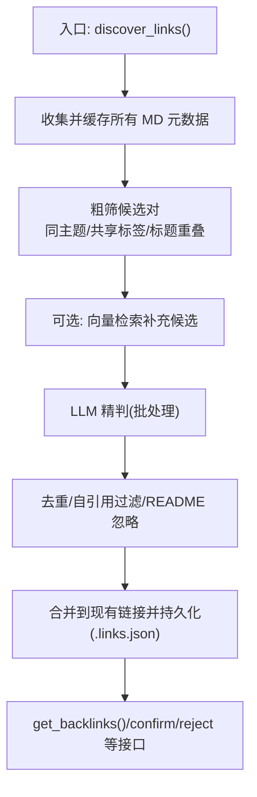
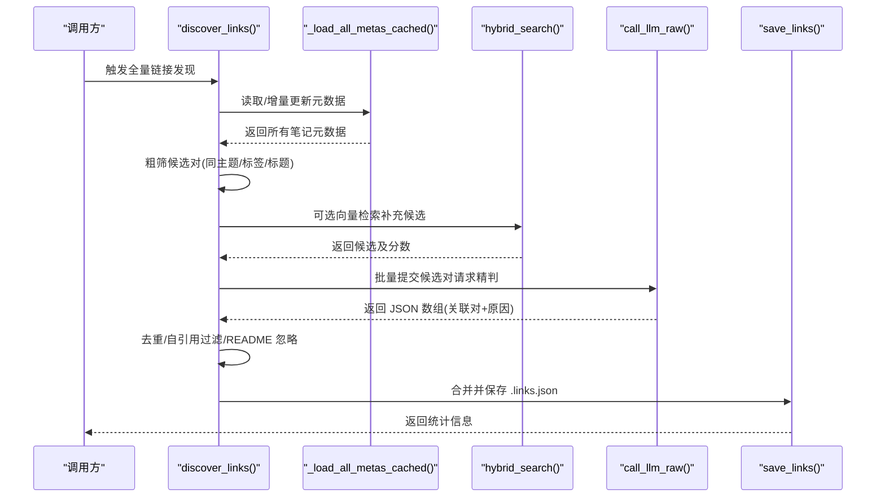
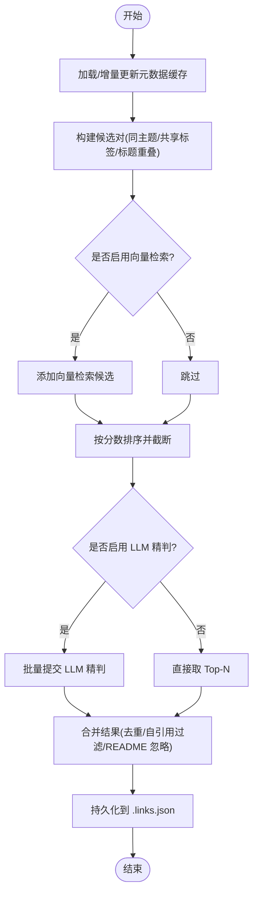
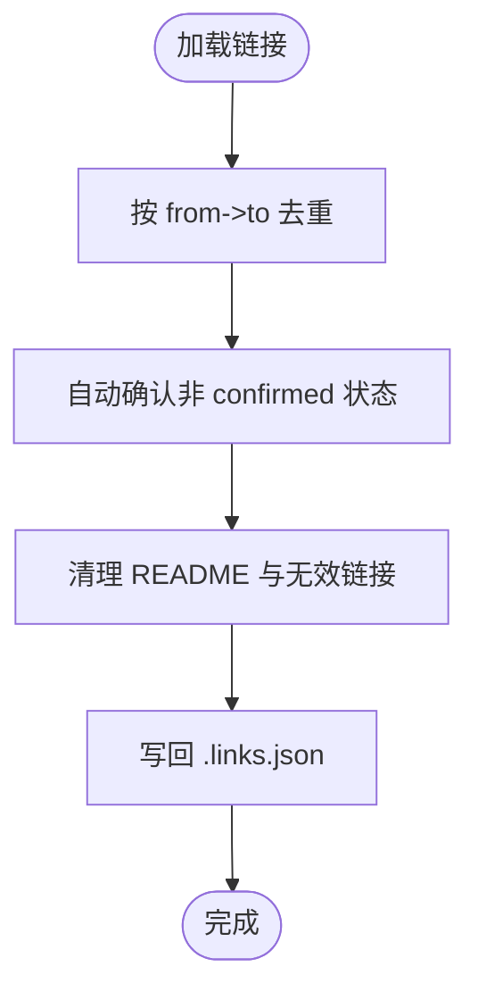
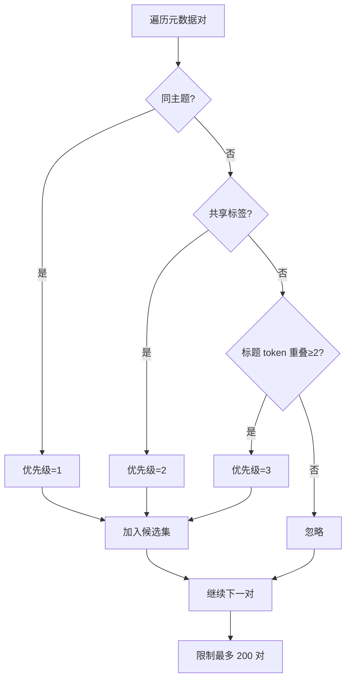
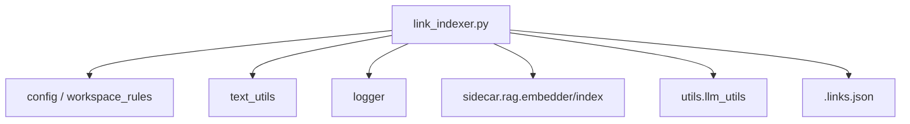

# 交叉引用阶段

<cite>
**本文引用的文件**   
- [utils/link_indexer.py](file://utils/link_indexer.py)
- [prompts/link_indexer.py](file://prompts/link_indexer.py)
</cite>

## 目录
1. [引言](#引言)
2. [项目结构](#项目结构)
3. [核心组件](#核心组件)
4. [架构总览](#架构总览)
5. [详细组件分析](#详细组件分析)
6. [依赖分析](#依赖分析)
7. [性能考虑](#性能考虑)
8. [故障排查指南](#故障排查指南)
9. [结论](#结论)
10. [附录](#附录)

## 引言
本章节聚焦入库流水线中的“交叉引用阶段”，围绕双向链接的发现、关系建立与验证机制展开。该阶段通过两阶段策略（本地粗筛 + AI 精判）构建高质量的双向链接，并以工作区内的持久化索引进行存储与查询。文档将深入解析链接扫描算法、冲突检测与修复策略、配置项与性能优化建议，并提供扩展链接类型支持的方法路径。

## 项目结构
交叉引用阶段的核心实现位于 utils/link_indexer.py，提示词定义位于 prompts/link_indexer.py。整体流程包括：
- 元数据提取与缓存
- 候选对生成（同主题、共享标签、标题提及、向量检索、邻居传播）
- LLM 精判与排序
- 合并写入 .links.json
- 反向链接查询与确认/拒绝操作

图表来源
- [utils/link_indexer.py:808-897](file://utils/link_indexer.py#L808-L897)
- [utils/link_indexer.py:690-737](file://utils/link_indexer.py#L690-L737)
- [utils/link_indexer.py:310-359](file://utils/link_indexer.py#L310-L359)
- [utils/link_indexer.py:740-805](file://utils/link_indexer.py#L740-L805)
- [utils/link_indexer.py:900-934](file://utils/link_indexer.py#L900-L934)

章节来源
- [utils/link_indexer.py:808-897](file://utils/link_indexer.py#L808-L897)
- [utils/link_indexer.py:690-737](file://utils/link_indexer.py#L690-L737)
- [utils/link_indexer.py:310-359](file://utils/link_indexer.py#L310-L359)
- [utils/link_indexer.py:740-805](file://utils/link_indexer.py#L740-L805)
- [utils/link_indexer.py:900-934](file://utils/link_indexer.py#L900-L934)

## 核心组件
- 链接索引引擎
  - 负责双向链接的发现、评分、精判、持久化与查询。
  - 关键能力：增量元数据缓存、候选对生成、向量检索融合、LLM 批处理精判、链接去重与状态管理。
- 提示词模块
  - 提供用于 LLM 精判的提示模板，控制输出格式与判断标准。

章节来源
- [utils/link_indexer.py:1-39](file://utils/link_indexer.py#L1-L39)
- [prompts/link_indexer.py:1-30](file://prompts/link_indexer.py#L1-L30)

## 架构总览
下图展示了从入口函数到持久化的完整调用链，以及外部依赖（RAG 嵌入与混合检索、LLM 调用）。

图表来源
- [utils/link_indexer.py:808-897](file://utils/link_indexer.py#L808-L897)
- [utils/link_indexer.py:638-676](file://utils/link_indexer.py#L638-L676)
- [utils/link_indexer.py:310-359](file://utils/link_indexer.py#L310-L359)
- [utils/link_indexer.py:740-805](file://utils/link_indexer.py#L740-L805)
- [utils/link_indexer.py:157-168](file://utils/link_indexer.py#L157-L168)

## 详细组件分析

### 双向链接发现与评分
- 元数据提取与缓存
  - 基于 mtime 的增量缓存，避免每次全量解析；删除不存在的文件缓存条目。
  - 支持 frontmatter 字段 title/tags/topic 与摘要截取。
- 候选对生成
  - 同主题优先（高权重），共享标签次之，文件名 token 重叠再次。
  - 可选向量检索（RAG hybrid search）作为语义相关候选补充。
  - 已确认链接的一跳邻居传播，增强图连通性。
- 评分与排序
  - 为每个候选赋予分数与理由，按分数降序排列，限制最大候选数。
- LLM 精判
  - 批处理候选对，使用固定提示模板要求返回 JSON 数组，包含 pair 编号与原因。
  - 若 LLM 不可用或失败，回退为保留高分候选。

图表来源
- [utils/link_indexer.py:638-676](file://utils/link_indexer.py#L638-L676)
- [utils/link_indexer.py:690-737](file://utils/link_indexer.py#L690-L737)
- [utils/link_indexer.py:310-359](file://utils/link_indexer.py#L310-L359)
- [utils/link_indexer.py:740-805](file://utils/link_indexer.py#L740-L805)
- [utils/link_indexer.py:111-133](file://utils/link_indexer.py#L111-L133)
- [utils/link_indexer.py:93-108](file://utils/link_indexer.py#L93-L108)

章节来源
- [utils/link_indexer.py:638-676](file://utils/link_indexer.py#L638-L676)
- [utils/link_indexer.py:690-737](file://utils/link_indexer.py#L690-L737)
- [utils/link_indexer.py:310-359](file://utils/link_indexer.py#L310-L359)
- [utils/link_indexer.py:740-805](file://utils/link_indexer.py#L740-L805)
- [utils/link_indexer.py:111-133](file://utils/link_indexer.py#L111-L133)
- [utils/link_indexer.py:93-108](file://utils/link_indexer.py#L93-L108)

### 引用关系建立与链接验证
- 有向链接键
  - 以 (from, to) 作为唯一键，方向不同视为不同链接。
- 自引用与 README 过滤
  - 自动丢弃自引用；README 不参与链接图。
- 去重与状态归一
  - 按有向键去重，优先保留 confirmed 状态；未确认的链接在加载时自动确认。
- 清理失效链接
  - 扫描 .links.json，移除目标文件不存在或 README 的链接，并将 pending 自动确认。

图表来源
- [utils/link_indexer.py:111-133](file://utils/link_indexer.py#L111-L133)
- [utils/link_indexer.py:93-108](file://utils/link_indexer.py#L93-L108)
- [utils/link_indexer.py:171-203](file://utils/link_indexer.py#L171-L203)

章节来源
- [utils/link_indexer.py:111-133](file://utils/link_indexer.py#L111-L133)
- [utils/link_indexer.py:93-108](file://utils/link_indexer.py#L93-L108)
- [utils/link_indexer.py:171-203](file://utils/link_indexer.py#L171-L203)

### 链接扫描算法细节
- 粗筛候选对
  - 遍历所有笔记元数据，计算优先级：同主题 > 共享标签 > 标题 token 重叠。
  - 限制最多 200 对进入 LLM 精判。
- 向量检索融合
  - 使用 RAG 的 encode_query 与 hybrid_search，结合 dense_vec 与 lexical_weights，返回 top_k 候选。
  - 失败时设置冷却时间，避免频繁重试。
- 邻居传播
  - 基于已确认链接，收集一跳邻居，提升图连通性与可发现性。

图表来源
- [utils/link_indexer.py:690-737](file://utils/link_indexer.py#L690-L737)
- [utils/link_indexer.py:310-359](file://utils/link_indexer.py#L310-L359)
- [utils/link_indexer.py:362-375](file://utils/link_indexer.py#L362-L375)

章节来源
- [utils/link_indexer.py:690-737](file://utils/link_indexer.py#L690-L737)
- [utils/link_indexer.py:310-359](file://utils/link_indexer.py#L310-L359)
- [utils/link_indexer.py:362-375](file://utils/link_indexer.py#L362-L375)

### 冲突检测与修复策略
- 冲突来源
  - 重复链接（相同 from->to）、自引用、README 参与链接、失效链接（目标文件不存在）。
- 检测与修复
  - 去重：按有向键保留首次出现，优先保留 confirmed。
  - 自引用与 README：直接丢弃。
  - 失效链接：清理并记录日志。
  - 状态归一：加载时将 pending 自动确认为 confirmed。

章节来源
- [utils/link_indexer.py:111-133](file://utils/link_indexer.py#L111-L133)
- [utils/link_indexer.py:93-108](file://utils/link_indexer.py#L93-L108)
- [utils/link_indexer.py:171-203](file://utils/link_indexer.py#L171-L203)

### 链接配置选项与行为开关
- 向量检索冷却
  - 当向量检索失败时，设置冷却时间以避免频繁重试。
- 候选数量上限
  - 精判前候选预览上限与最终链接上限常量控制。
- LLM 批大小
  - 每批提交的候选对数量，影响吞吐与延迟。
- 单文件建议模式
  - 提供针对单个文件的快速建议接口，仅基于本地启发式规则。

章节来源
- [utils/link_indexer.py:33-34](file://utils/link_indexer.py#L33-L34)
- [utils/link_indexer.py:305-307](file://utils/link_indexer.py#L305-L307)
- [utils/link_indexer.py:223-302](file://utils/link_indexer.py#L223-L302)

### 扩展链接类型支持（方法路径）
- 新增评分维度
  - 在候选对生成或评分阶段增加新的启发式规则（如共现实体、时间邻近、作者/来源相似等），调整优先级与分数映射。
- 扩展 LLM 精判提示
  - 在提示模板中增加新字段或约束，使模型能识别更复杂的关联类型（如“前置知识”、“对比分析”、“案例对照”）。
- 自定义链接属性
  - 在链接记录中扩展字段（如 type、strength、source），并在去重/归一逻辑中兼容新字段。
- 集成新的检索源
  - 替换或并行接入其他检索后端（如全文检索、图谱检索），在候选融合阶段统一打分。

章节来源
- [utils/link_indexer.py:690-737](file://utils/link_indexer.py#L690-L737)
- [prompts/link_indexer.py:1-30](file://prompts/link_indexer.py#L1-L30)
- [utils/link_indexer.py:111-133](file://utils/link_indexer.py#L111-L133)
- [utils/link_indexer.py:310-359](file://utils/link_indexer.py#L310-L359)

## 依赖分析
- 内部依赖
  - 文本工具：frontmatter 解析、tokenize、通用文本处理。
  - 配置与工作区：工作区路径、忽略目录规则。
  - 日志：统一日志记录。
- 外部依赖
  - RAG 嵌入与混合检索：encode_query、hybrid_search。
  - LLM 调用：check_api_config、call_llm_raw。
  - 文件系统：读写 .links.json（原子写入 tmp 再替换）。

图表来源
- [utils/link_indexer.py:20-31](file://utils/link_indexer.py#L20-L31)
- [utils/link_indexer.py:331-346](file://utils/link_indexer.py#L331-L346)
- [utils/link_indexer.py:388-427](file://utils/link_indexer.py#L388-L427)
- [utils/link_indexer.py:157-168](file://utils/link_indexer.py#L157-L168)

章节来源
- [utils/link_indexer.py:20-31](file://utils/link_indexer.py#L20-L31)
- [utils/link_indexer.py:331-346](file://utils/link_indexer.py#L331-L346)
- [utils/link_indexer.py:388-427](file://utils/link_indexer.py#L388-L427)
- [utils/link_indexer.py:157-168](file://utils/link_indexer.py#L157-L168)

## 性能考虑
- 增量元数据缓存
  - 基于 mtime 的缓存减少 I/O 与解析开销；删除不存在的文件缓存条目，保持内存占用稳定。
- 候选规模控制
  - 粗筛阶段限制候选对数量，避免 LLM 调用爆炸。
- 向量检索容错
  - 失败后设置冷却时间，降低错误风暴风险。
- 原子写入
  - 先写临时文件再替换，避免并发写入导致的数据损坏。
- 批处理 LLM
  - 合理设置批大小，平衡吞吐与延迟。

章节来源
- [utils/link_indexer.py:638-676](file://utils/link_indexer.py#L638-L676)
- [utils/link_indexer.py:690-737](file://utils/link_indexer.py#L690-L737)
- [utils/link_indexer.py:33-34](file://utils/link_indexer.py#L33-L34)
- [utils/link_indexer.py:157-168](file://utils/link_indexer.py#L157-L168)
- [utils/link_indexer.py:740-805](file://utils/link_indexer.py#L740-L805)

## 故障排查指南
- API 未配置或调用失败
  - 检查 LLM 配置；若失败，系统会回退为保留高分候选。
- 向量检索失败
  - 查看冷却时间是否生效；确认 RAG 服务可用。
- 链接未更新
  - 确认工作区路径正确；检查 .links.json 权限与磁盘空间。
- 大量重复或无效链接
  - 运行清理流程，确保 README 与自引用被过滤；检查去重逻辑。

章节来源
- [utils/link_indexer.py:388-427](file://utils/link_indexer.py#L388-L427)
- [utils/link_indexer.py:331-346](file://utils/link_indexer.py#L331-L346)
- [utils/link_indexer.py:171-203](file://utils/link_indexer.py#L171-L203)
- [utils/link_indexer.py:111-133](file://utils/link_indexer.py#L111-L133)

## 结论
交叉引用阶段通过“本地启发式 + 向量检索 + LLM 精判”的多层筛选，构建了高质量的双向链接网络。其设计兼顾性能与质量：增量缓存、候选规模控制、原子写入与批处理策略有效提升了稳定性与可扩展性。未来可通过扩展评分维度、提示模板与检索源进一步增强链接类型的表达能力。

## 附录
- 反向链接查询
  - 提供按文件或全量的反向链接视图，标注入边/出边与原因。
- 链接确认与拒绝
  - 支持对特定 from->to 的确认或删除操作，便于人工干预。

章节来源
- [utils/link_indexer.py:900-934](file://utils/link_indexer.py#L900-L934)
- [utils/link_indexer.py:937-987](file://utils/link_indexer.py#L937-L987)