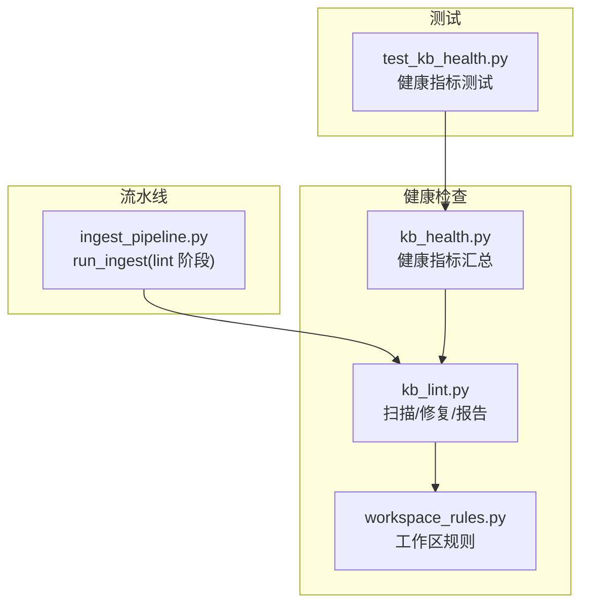
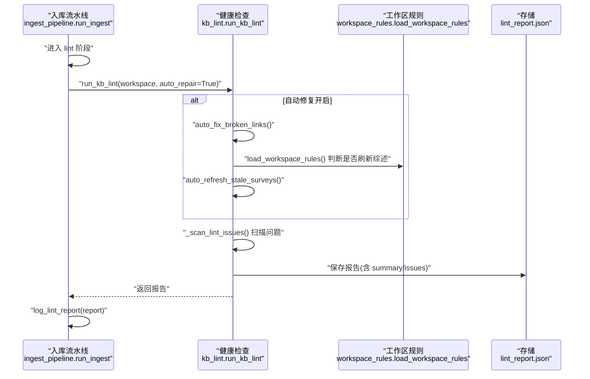
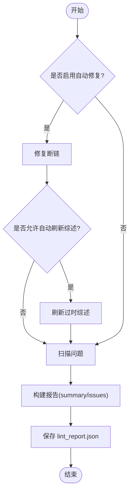
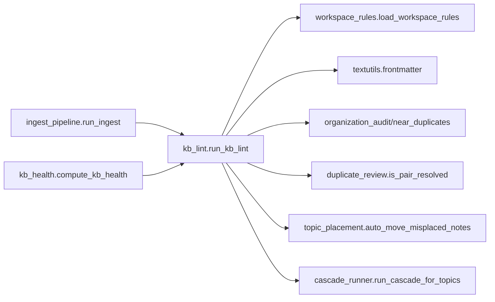

# 健康检查阶段

<cite>
**本文引用的文件**
- [kb_lint.py](file://python/sidecar/kb_lint.py)
- [kb_health.py](file://python/sidecar/kb_health.py)
- [ingest_pipeline.py](file://python/sidecar/ingest_pipeline.py)
- [workspace_rules.py](file://python/sidecar/workspace_rules.py)
- [test_kb_health.py](file://tests/unit/test_kb_health.py)
</cite>

## 目录
1. [简介](#简介)
2. [项目结构](#项目结构)
3. [核心组件](#核心组件)
4. [架构总览](#架构总览)
5. [详细组件分析](#详细组件分析)
6. [依赖关系分析](#依赖关系分析)
7. [性能考量](#性能考量)
8. [故障排查指南](#故障排查指南)
9. [结论](#结论)
10. [附录](#附录)

## 简介
本章节面向入库流水线中的“健康检查”阶段，系统性说明知识库完整性检查、文件一致性验证与元数据校验机制。文档覆盖：
- 检查规则配置项与默认行为
- 问题报告格式与持久化位置
- 自动修复策略（断链清理、综述刷新、主题错位迁移）
- 如何扩展自定义检查项并接入流水线
- 实际代码示例路径，便于快速定位实现

## 项目结构
健康检查相关能力主要分布在以下模块：
- sidecar.kb_lint：健康检查扫描、自动修复、报告生成与日志输出
- sidecar.kb_health：健康指标汇总（用于仪表盘展示）
- sidecar.ingest_pipeline：入库流水线编排，包含 lint 阶段调用
- sidecar.workspace_rules：工作区规则加载与合并（影响综述更新等策略）
- tests.unit.test_kb_health：健康指标测试用例

图表来源
- [kb_lint.py:414-484](file://python/sidecar/kb_lint.py#L414-L484)
- [kb_health.py:30-90](file://python/sidecar/kb_health.py#L30-L90)
- [ingest_pipeline.py:862-876](file://python/sidecar/ingest_pipeline.py#L862-L876)
- [workspace_rules.py:15-22](file://python/sidecar/workspace_rules.py#L15-L22)
- [test_kb_health.py:46-56](file://tests/unit/test_kb_health.py#L46-L56)

章节来源
- [kb_lint.py:414-484](file://python/sidecar/kb_lint.py#L414-L484)
- [kb_health.py:30-90](file://python/sidecar/kb_health.py#L30-L90)
- [ingest_pipeline.py:862-876](file://python/sidecar/ingest_pipeline.py#L862-L876)
- [workspace_rules.py:15-22](file://python/sidecar/workspace_rules.py#L15-L22)
- [test_kb_health.py:46-56](file://tests/unit/test_kb_health.py#L46-L56)

## 核心组件
- 健康检查入口与编排
  - run_kb_lint：统一入口，支持自动修复与进度回调；产出结构化报告并持久化
  - log_lint_report：将检查结果写入工作区日志
  - load_lint_report：读取缓存报告（含摘要）
- 健康指标汇总
  - compute_kb_health：聚合笔记数量、链接统计、综述覆盖率、lint 总数等指标
- 工作区规则
  - load_workspace_rules/save_workspace_rules：管理 auto_update_survey、survey_at_level 等开关与阈值

章节来源
- [kb_lint.py:414-484](file://python/sidecar/kb_lint.py#L414-L484)
- [kb_lint.py:519-558](file://python/sidecar/kb_lint.py#L519-L558)
- [kb_lint.py:680-699](file://python/sidecar/kb_lint.py#L680-L699)
- [kb_health.py:30-90](file://python/sidecar/kb_health.py#L30-L90)
- [workspace_rules.py:59-92](file://python/sidecar/workspace_rules.py#L59-L92)

## 架构总览
健康检查在入库流水线的“lint”阶段执行，负责：
- 可选的自动修复（断链清理、过时综述刷新、主题错位迁移）
- 扫描问题（断链、孤儿主题、过时综述、待确认主题、重复/近似重复、疑似错位）
- 生成并保存报告，同时记录到工作区日志

图表来源
- [ingest_pipeline.py:862-876](file://python/sidecar/ingest_pipeline.py#L862-L876)
- [kb_lint.py:414-484](file://python/sidecar/kb_lint.py#L414-L484)
- [kb_lint.py:166-200](file://python/sidecar/kb_lint.py#L166-L200)
- [kb_lint.py:203-245](file://python/sidecar/kb_lint.py#L203-L245)
- [kb_lint.py:248-411](file://python/sidecar/kb_lint.py#L248-L411)
- [workspace_rules.py:59-92](file://python/sidecar/workspace_rules.py#L59-L92)

## 详细组件分析

### 健康检查扫描与自动修复
- 自动修复
  - 断链清理：移除不存在的 [[目标]] 双向链接，保留 frontmatter
  - 过时综述刷新：当某主题的笔记 mtime 晚于综述文件时，触发后台综述生成
  - 主题错位迁移：根据内容相似度建议移动笔记至更合适的主题目录
- 扫描问题类型
  - broken_link：断链
  - orphan_topic：缺主题（无文件夹路径且 frontmatter 无 topic）
  - stale_survey：综述过时
  - pending_topics：待确认主题
  - duplicate_content：正文完全重复
  - near_duplicate：高度相似
  - misplaced_note：疑似错位

图表来源
- [kb_lint.py:414-484](file://python/sidecar/kb_lint.py#L414-L484)
- [kb_lint.py:166-200](file://python/sidecar/kb_lint.py#L166-L200)
- [kb_lint.py:203-245](file://python/sidecar/kb_lint.py#L203-L245)
- [kb_lint.py:248-411](file://python/sidecar/kb_lint.py#L248-L411)

章节来源
- [kb_lint.py:166-200](file://python/sidecar/kb_lint.py#L166-L200)
- [kb_lint.py:203-245](file://python/sidecar/kb_lint.py#L203-L245)
- [kb_lint.py:248-411](file://python/sidecar/kb_lint.py#L248-L411)
- [kb_lint.py:414-484](file://python/sidecar/kb_lint.py#L414-L484)

### 报告结构与持久化
- 报告字段
  - success：布尔值，表示本次运行是否成功
  - issues：问题列表，每项包含 kind、severity、message、file_path、topic、related_file、current_topic、suggested_score 等
  - summary：按问题类型计数的摘要
  - repair：自动修复结果（如 broken_links、surveys、topic_moves）
- 持久化位置
  - WORKSPACE_APP_FOLDER/lint_report.json
- 日志输出
  - 通过 append_log 写入 wiki/log.md，便于审计与回溯

章节来源
- [kb_lint.py:487-493](file://python/sidecar/kb_lint.py#L487-L493)
- [kb_lint.py:519-558](file://python/sidecar/kb_lint.py#L519-L558)
- [kb_lint.py:680-699](file://python/sidecar/kb_lint.py#L680-L699)

### 健康指标汇总（仪表盘）
compute_kb_health 聚合如下指标：
- survey_coverage_pct / survey_topics_with / survey_topics_total：综述覆盖率与主题数
- notes_total / notes_with_outbound / outbound_links_total / avg_outbound_links：笔记与外链统计
- lint_total / lint_summary：最近一次健康检查的问题统计
- pending_total：待处理项数量

章节来源
- [kb_health.py:30-90](file://python/sidecar/kb_health.py#L30-L90)
- [test_kb_health.py:46-56](file://tests/unit/test_kb_health.py#L46-L56)

### 工作区规则对健康检查的影响
- auto_update_survey：控制是否在健康检查中自动刷新过时综述
- survey_at_level：决定综述生成的主题层级
- ai_may_edit_wiki / ai_may_edit_notes：控制 AI 编辑权限（间接影响后续流程）
- max_topic_depth：限制主题深度（影响分类与组织）

章节来源
- [workspace_rules.py:15-22](file://python/sidecar/workspace_rules.py#L15-L22)
- [workspace_rules.py:59-92](file://python/sidecar/workspace_rules.py#L59-L92)

## 依赖关系分析
- ingest_pipeline.run_ingest 在“lint”阶段调用 kb_lint.run_kb_lint
- kb_lint 内部依赖：
  - workspace_rules.load_workspace_rules：读取工作区规则
  - textutils.parse_frontmatter/write_frontmatter：解析/写入 YAML frontmatter
  - organization_audit/near_duplicates/duplicate_review：重复与近似重复检测
  - topic_placement.auto_move_misplaced_notes：主题错位自动迁移
  - cascade_runner.run_cascade_for_topics：触发综述生成
- kb_health 依赖 kb_lint.load_lint_report 获取上次检查结果

图表来源
- [ingest_pipeline.py:862-876](file://python/sidecar/ingest_pipeline.py#L862-L876)
- [kb_lint.py:414-484](file://python/sidecar/kb_lint.py#L414-L484)
- [kb_health.py:30-90](file://python/sidecar/kb_health.py#L30-L90)

章节来源
- [ingest_pipeline.py:862-876](file://python/sidecar/ingest_pipeline.py#L862-L876)
- [kb_lint.py:414-484](file://python/sidecar/kb_lint.py#L414-L484)
- [kb_health.py:30-90](file://python/sidecar/kb_health.py#L30-L90)

## 性能考量
- 增量与跳过策略
  - 流水线在“完整最新”时可跳过自检，避免重扫
  - 索引阶段使用指纹与 mtime 快速判定是否需要重新分块与编码
- 批量与并发
  - 转换/编译/分类/索引均支持批处理与进度回调
  - 交叉引用仅在少量文件时使用 LLM，大批量时跳过以节省时间
- 报告与日志
  - 报告仅保存摘要与必要详情，避免过大体积
  - 日志输出限制最大条目数，减少 I/O 压力

[本节为通用指导，无需源码引用]

## 故障排查指南
- 常见问题定位
  - 断链：查看 issues 中 kind=broken_link 的 file_path 与 message，确认目标是否存在或链接语法是否正确
  - 孤儿主题：orphan_topic 表示缺少主题信息，可在 frontmatter 补充 topic 或将文件移入规范目录
  - 综述过时：stale_survey 提示需刷新，可手动触发或等待自动刷新
  - 重复/近似重复：duplicate_content/near_duplicate 提供 related_file 与 score，辅助决策合并或改写
  - 疑似错位：misplaced_note 给出 suggested_topic 与 current_topic，可接受自动迁移或手动调整
- 自动修复开关
  - 若不希望自动修复，可在调用处设置 auto_repair=False、auto_refresh_surveys=False
- 报告与日志
  - 读取 WORKSPACE_APP_FOLDER/lint_report.json 获取最近一次检查结果
  - 查看 wiki/log.md 中的“健康检查”条目，了解修复与扫描明细

章节来源
- [kb_lint.py:248-411](file://python/sidecar/kb_lint.py#L248-L411)
- [kb_lint.py:414-484](file://python/sidecar/kb_lint.py#L414-L484)
- [kb_lint.py:519-558](file://python/sidecar/kb_lint.py#L519-L558)
- [kb_lint.py:680-699](file://python/sidecar/kb_lint.py#L680-L699)

## 结论
健康检查阶段通过“自动修复 + 全面扫描 + 报告持久化 + 日志输出”的组合，确保知识库在入库后保持良好状态。其设计兼顾性能与可维护性，并通过工作区规则灵活控制行为。开发者可按需扩展检查项，并以最小改动融入流水线。

[本节为总结，无需源码引用]

## 附录

### 检查规则配置选项
- 工作区规则文件：WORKSPACE_APP_FOLDER/workspace_rules.json
- 关键键名与默认值
  - max_topic_depth：3
  - auto_update_survey：True
  - survey_at_level：2
  - ai_may_edit_wiki：True
  - ai_may_edit_notes：False
  - configured：False

章节来源
- [workspace_rules.py:15-22](file://python/sidecar/workspace_rules.py#L15-L22)
- [workspace_rules.py:59-92](file://python/sidecar/workspace_rules.py#L59-L92)

### 问题报告格式（关键字段）
- issues[].kind：问题类型（如 broken_link、orphan_topic、stale_survey、pending_topics、duplicate_content、near_duplicate、misplaced_note）
- issues[].severity：严重级别（info/warning 等）
- issues[].message：人类可读描述
- issues[].file_path：相关文件相对路径
- issues[].topic / current_topic / related_file / suggested_score：上下文与评分

章节来源
- [kb_lint.py:21-34](file://python/sidecar/kb_lint.py#L21-L34)
- [kb_lint.py:466-484](file://python/sidecar/kb_lint.py#L466-L484)

### 自动修复策略
- 断链清理：删除无效 [[目标]] 链接，保留 frontmatter 与 BOM
- 综述刷新：依据笔记 mtime 与综述 mtime 比较，必要时触发 cascade 生成
- 主题错位迁移：基于内容相似度建议移动，支持用户保留选择

章节来源
- [kb_lint.py:166-200](file://python/sidecar/kb_lint.py#L166-L200)
- [kb_lint.py:203-245](file://python/sidecar/kb_lint.py#L203-L245)
- [kb_lint.py:437-441](file://python/sidecar/kb_lint.py#L437-L441)

### 如何在流水线中集成健康检查
- 在 run_ingest 的“lint”阶段调用 run_kb_lint，并将结果写入日志
- 如需禁用自动修复，传入 auto_repair=False、auto_refresh_surveys=False

章节来源
- [ingest_pipeline.py:862-876](file://python/sidecar/ingest_pipeline.py#L862-L876)

### 添加新的健康检查项（步骤与示例路径）
- 步骤
  1) 定义新问题的 LintIssue 字段（如需新增字段）
  2) 在 _scan_lint_issues 中增加扫描逻辑，收集新问题
  3) 在 summary 计数中为新问题类型累加
  4) 在 filter_stale_lint_issues 中增加过滤逻辑，避免陈旧问题残留
  5) 在 log_lint_report 中为新问题类型添加中文标签
  6) 在 kb_health 中考虑是否纳入健康指标
- 参考实现路径
  - 新增问题类型与字段：[kb_lint.py:21-34](file://python/sidecar/kb_lint.py#L21-L34)
  - 扫描逻辑示例（断链/孤儿/综述/重复/错位）：[kb_lint.py:248-411](file://python/sidecar/kb_lint.py#L248-L411)
  - 摘要统计：[kb_lint.py:466-484](file://python/sidecar/kb_lint.py#L466-L484)
  - 过期过滤：[kb_lint.py:560-677](file://python/sidecar/kb_lint.py#L560-L677)
  - 日志标签映射：[kb_lint.py:495-517](file://python/sidecar/kb_lint.py#L495-L517)
  - 健康指标聚合：[kb_health.py:30-90](file://python/sidecar/kb_health.py#L30-L90)

章节来源
- [kb_lint.py:21-34](file://python/sidecar/kb_lint.py#L21-L34)
- [kb_lint.py:248-411](file://python/sidecar/kb_lint.py#L248-L411)
- [kb_lint.py:466-484](file://python/sidecar/kb_lint.py#L466-L484)
- [kb_lint.py:560-677](file://python/sidecar/kb_lint.py#L560-L677)
- [kb_lint.py:495-517](file://python/sidecar/kb_lint.py#L495-L517)
- [kb_health.py:30-90](file://python/sidecar/kb_health.py#L30-L90)