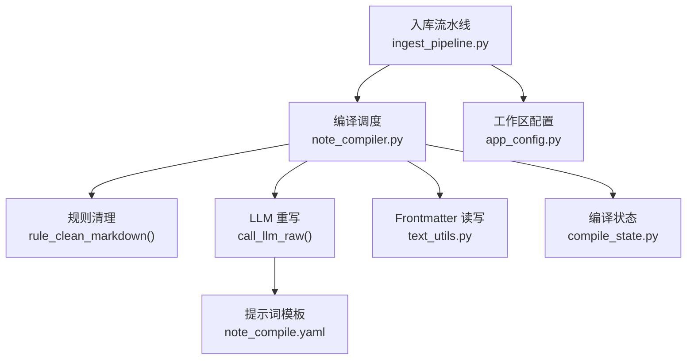
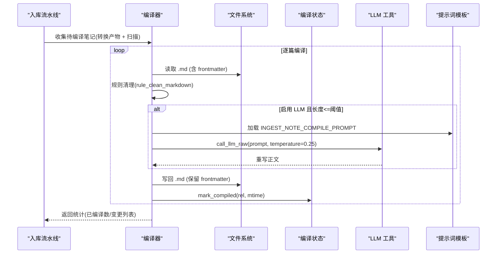
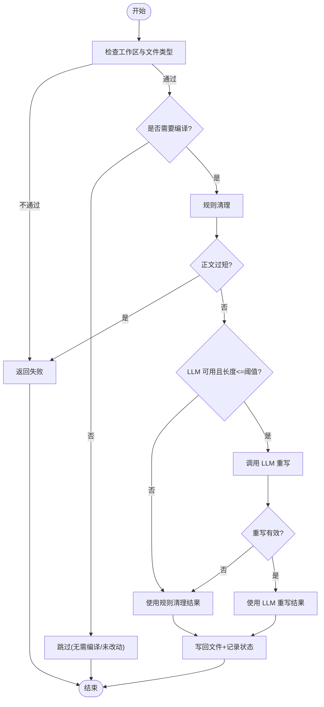
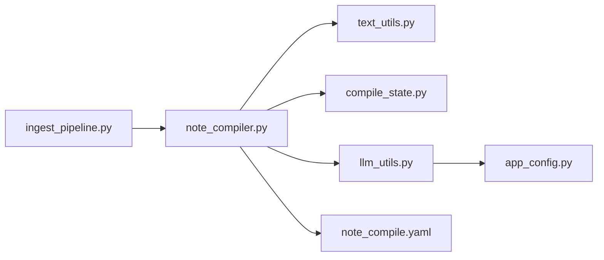

# 内容编译阶段

<cite>
**本文引用的文件**   
- [utils/note_compiler.py](file://utils/note_compiler.py)
- [python/sidecar/compile_state.py](file://python/sidecar/compile_state.py)
- [python/sidecar/ingest_pipeline.py](file://python/sidecar/ingest_pipeline.py)
- [prompts/yaml/note_compile.yaml](file://prompts/yaml/note_compile.yaml)
- [utils/llm_utils.py](file://utils/llm_utils.py)
- [utils/text_utils.py](file://utils/text_utils.py)
- [config/app_config.py](file://config/app_config.py)
- [tests/unit/test_note_compile.py](file://tests/unit/test_note_compile.py)
</cite>

## 目录
1. [简介](#简介)
2. [项目结构](#项目结构)
3. [核心组件](#核心组件)
4. [架构总览](#架构总览)
5. [详细组件分析](#详细组件分析)
6. [依赖关系分析](#依赖关系分析)
7. [性能与优化](#性能与优化)
8. [故障排查指南](#故障排查指南)
9. [结论](#结论)
10. [附录：配置与扩展示例](#附录配置与扩展示例)

## 简介
本章节聚焦入库流水线中的“内容编译”阶段，系统性地说明从转换后的笔记到最终可索引、可检索的 Markdown 笔记之间的处理流程。重点覆盖：
- 模板渲染与变量替换（工作区规则注入）
- 外部引用解析（基于 frontmatter source 字段）
- 内容优化（去噪、客观化、结构化、精简）
- 编译规则配置与 LLM 重写能力
- 批量处理机制与幂等性保证
- 如何扩展自定义编译规则与调用方式

## 项目结构
编译阶段由多个模块协作完成：
- 入口编排：入库流水线在“convert”之后进入“compile”，负责收集待编译目标并驱动批处理
- 编译实现：规则清理 + 可选 LLM 重写，保留 frontmatter，落盘并记录编译状态
- 状态管理：记录已编译文件的 mtime，避免重复编译
- 提示词模板：集中定义编译规则与输出约束
- LLM 工具：统一封装模型调用、重试、限流、上下文预算控制
- Frontmatter 解析：读取/写入 YAML frontmatter

图示来源
- [python/sidecar/ingest_pipeline.py:658-686](file://python/sidecar/ingest_pipeline.py#L658-L686)
- [utils/note_compiler.py:128-210](file://utils/note_compiler.py#L128-L210)
- [prompts/yaml/note_compile.yaml:1-21](file://prompts/yaml/note_compile.yaml#L1-L21)
- [utils/text_utils.py:1332-1367](file://utils/text_utils.py#L1332-L1367)
- [python/sidecar/compile_state.py:45-55](file://python/sidecar/compile_state.py#L45-L55)
- [config/app_config.py:37-44](file://config/app_config.py#L37-L44)

章节来源
- [python/sidecar/ingest_pipeline.py:658-686](file://python/sidecar/ingest_pipeline.py#L658-L686)
- [utils/note_compiler.py:128-210](file://utils/note_compiler.py#L128-L210)
- [prompts/yaml/note_compile.yaml:1-21](file://prompts/yaml/note_compile.yaml#L1-L21)
- [utils/text_utils.py:1332-1367](file://utils/text_utils.py#L1332-L1367)
- [python/sidecar/compile_state.py:45-55](file://python/sidecar/compile_state.py#L45-L55)
- [config/app_config.py:37-44](file://config/app_config.py#L37-L44)

## 核心组件
- 编译入口与批处理
  - compile_note_file：单篇编译（规则清理 + 可选 LLM 重写），保持 frontmatter，落盘并标记已编译
  - compile_notes_batch：批量编译，支持进度回调，返回实际变更数量与路径
  - scan_compile_pending：扫描 Notes 下需要编译的笔记（依据 source 字段与编译状态）
- 规则清理
  - rule_clean_markdown：去除页眉页脚、页码、重复水印、版权声明、重复行，压缩空行
- 编译状态
  - file_needs_compile / mark_compiled：基于相对路径与 mtime 判断是否需要重新编译
- 提示词与模板
  - INGEST_NOTE_COMPILE_PROMPT：定义去噪、客观化、完整性、结构、精简、语言、只输出正文等规则；支持注入工作区补充规则
- LLM 工具
  - call_llm_raw：带指数退避重试、并发信号量、超时保护、上下文预算裁剪
  - check_api_config：校验 API Key/Base/Model 是否配置完整
- Frontmatter 解析
  - parse_frontmatter / write_frontmatter：安全解析/重建 YAML frontmatter

章节来源
- [utils/note_compiler.py:43-81](file://utils/note_compiler.py#L43-L81)
- [utils/note_compiler.py:105-126](file://utils/note_compiler.py#L105-L126)
- [utils/note_compiler.py:128-210](file://utils/note_compiler.py#L128-L210)
- [utils/note_compiler.py:213-238](file://utils/note_compiler.py#L213-L238)
- [python/sidecar/compile_state.py:45-55](file://python/sidecar/compile_state.py#L45-L55)
- [prompts/yaml/note_compile.yaml:1-21](file://prompts/yaml/note_compile.yaml#L1-L21)
- [utils/llm_utils.py:197-229](file://utils/llm_utils.py#L197-L229)
- [utils/llm_utils.py:298-315](file://utils/llm_utils.py#L298-L315)
- [utils/text_utils.py:1332-1367](file://utils/text_utils.py#L1332-L1367)

## 架构总览
编译阶段在入库流水线中位于“convert”之后、“classify/index”之前，确保后续分类与索引基于高质量、结构化的笔记文本。

图示来源
- [python/sidecar/ingest_pipeline.py:658-686](file://python/sidecar/ingest_pipeline.py#L658-L686)
- [utils/note_compiler.py:128-210](file://utils/note_compiler.py#L128-L210)
- [prompts/yaml/note_compile.yaml:1-21](file://prompts/yaml/note_compile.yaml#L1-L21)
- [utils/llm_utils.py:197-229](file://utils/llm_utils.py#L197-L229)
- [python/sidecar/compile_state.py:45-55](file://python/sidecar/compile_state.py#L45-L55)

## 详细组件分析

### 编译主流程（单篇）
- 前置检查
  - 工作区未设置或非 .md 直接返回失败
  - 根据 frontmatter.source 后缀判断是否需要编译（PDF/Word/PPT/HTML/TXT 等）
  - 若未强制且上次编译后未改动，跳过
- 规则清理
  - 删除页码、版权、重复分隔线、高频短行（常见页眉/页脚）
  - 合并多余空行，得到 cleaned
  - 若 cleaned 过短则拒绝编译
- LLM 重写（可选）
  - 仅当 API 可用且 cleaned 长度不超过阈值时触发
  - 注入工作区补充规则（project_rules），使用固定低温度以稳定输出
  - 若重写结果显著短于输入则丢弃，保留规则清理结果
- 持久化
  - 重建 frontmatter + 新正文，落盘
  - 记录编译状态（rel -> mtime）

图示来源
- [utils/note_compiler.py:128-210](file://utils/note_compiler.py#L128-L210)
- [utils/note_compiler.py:43-81](file://utils/note_compiler.py#L43-L81)
- [utils/llm_utils.py:197-229](file://utils/llm_utils.py#L197-L229)
- [python/sidecar/compile_state.py:45-55](file://python/sidecar/compile_state.py#L45-L55)

章节来源
- [utils/note_compiler.py:128-210](file://utils/note_compiler.py#L128-L210)
- [utils/note_compiler.py:43-81](file://utils/note_compiler.py#L43-L81)
- [utils/llm_utils.py:197-229](file://utils/llm_utils.py#L197-L229)
- [python/sidecar/compile_state.py:45-55](file://python/sidecar/compile_state.py#L45-L55)

### 批量编译与进度
- 遍历目标列表，逐个调用单篇编译
- 支持 progress_cb(cur, total, msg) 回调上报进度
- 返回已编译数量与变更路径列表

章节来源
- [utils/note_compiler.py:213-238](file://utils/note_compiler.py#L213-L238)
- [python/sidecar/ingest_pipeline.py:679-686](file://python/sidecar/ingest_pipeline.py#L679-L686)

### 待编译扫描策略
- 仅扫描 Notes 目录下的 .md
- 忽略隐藏文件与 wiki 相关路径
- 依据 frontmatter.source 后缀匹配可转换源类型集合
- 结合编译状态文件，过滤已编译且未改动的文件

章节来源
- [utils/note_compiler.py:105-126](file://utils/note_compiler.py#L105-L126)
- [utils/note_compiler.py:90-99](file://utils/note_compiler.py#L90-L99)
- [python/sidecar/compile_state.py:45-55](file://python/sidecar/compile_state.py#L45-L55)

### 规则清理细节
- 正则识别页码、版权、重复分隔线
- 对短行进行频次统计，超过阈值的视为页眉/页脚噪声
- 压缩连续空行为双换行，提升可读性

章节来源
- [utils/note_compiler.py:43-81](file://utils/note_compiler.py#L43-L81)

### 提示词模板与变量替换
- 模板包含七条编译规则：去噪、客观化、完整性、结构、精简、语言、只输出正文
- 支持注入 {project_rules} 作为工作区补充规则
- 注入 {content} 为待编译正文（受长度限制）

章节来源
- [prompts/yaml/note_compile.yaml:1-21](file://prompts/yaml/note_compile.yaml#L1-L21)
- [utils/note_compiler.py:173-177](file://utils/note_compiler.py#L173-L177)

### LLM 重写与容错
- 仅在 API 配置有效且正文长度不超过阈值时调用
- 使用较低温度以保证稳定性
- 重写结果需满足最小长度比例，否则回退到规则清理结果
- 异常捕获与日志记录，不影响整体流程

章节来源
- [utils/note_compiler.py:165-194](file://utils/note_compiler.py#L165-L194)
- [utils/llm_utils.py:197-229](file://utils/llm_utils.py#L197-L229)
- [utils/llm_utils.py:298-315](file://utils/llm_utils.py#L298-L315)

### Frontmatter 处理
- 解析 frontmatter 以提取 source 字段与元数据
- 写回时保留原有 frontmatter，仅替换正文
- 兼容无 frontmatter 的情况

章节来源
- [utils/text_utils.py:1332-1367](file://utils/text_utils.py#L1332-L1367)
- [utils/note_compiler.py:146-149](file://utils/note_compiler.py#L146-L149)
- [utils/note_compiler.py:195-202](file://utils/note_compiler.py#L195-L202)

### 与入库流水线的集成
- 流水线在 convert 完成后，将转换产物与扫描到的待编译笔记合并为 compile_targets
- 调用 compile_notes_batch 执行批量编译，更新统计与阶段状态
- 后续 classify/index 阶段基于编译后的笔记继续处理

章节来源
- [python/sidecar/ingest_pipeline.py:658-686](file://python/sidecar/ingest_pipeline.py#L658-L686)

## 依赖关系分析
- 模块耦合
  - ingest_pipeline 依赖 note_compiler 提供编译能力
  - note_compiler 依赖 text_utils（frontmatter）、compile_state（幂等）、llm_utils（LLM 调用）、prompts（模板）
  - llm_utils 依赖 app_config（API 配置、上下文预算）
- 外部依赖
  - LangChain OpenAI 客户端（通过 create_llm/call_llm_raw）
  - PyYAML（frontmatter 解析/序列化）
  - tiktoken（估算 token，用于上下文预算）

图示来源
- [python/sidecar/ingest_pipeline.py:658-686](file://python/sidecar/ingest_pipeline.py#L658-L686)
- [utils/note_compiler.py:128-210](file://utils/note_compiler.py#L128-L210)
- [utils/text_utils.py:1332-1367](file://utils/text_utils.py#L1332-L1367)
- [python/sidecar/compile_state.py:45-55](file://python/sidecar/compile_state.py#L45-L55)
- [utils/llm_utils.py:197-229](file://utils/llm_utils.py#L197-L229)
- [prompts/yaml/note_compile.yaml:1-21](file://prompts/yaml/note_compile.yaml#L1-L21)
- [config/app_config.py:37-44](file://config/app_config.py#L37-L44)

章节来源
- [python/sidecar/ingest_pipeline.py:658-686](file://python/sidecar/ingest_pipeline.py#L658-L686)
- [utils/note_compiler.py:128-210](file://utils/note_compiler.py#L128-L210)
- [utils/llm_utils.py:197-229](file://utils/llm_utils.py#L197-L229)
- [config/app_config.py:37-44](file://config/app_config.py#L37-L44)

## 性能与优化
- 幂等与增量
  - 基于 mtime 的编译状态文件避免重复处理，显著提升二次运行速度
- 长度阈值与降级
  - 长文自动跳过整篇 LLM 重写，防止超长上下文导致失败或成本过高
- 并发与限流
  - LLM 调用使用全局信号量限制并发，配合指数退避重试，提高鲁棒性
- 上下文预算
  - 调用前估算 token 并进行摘要/压缩/截断，确保请求在模型上下文限制内
- I/O 与原子写入
  - 流水线侧使用原子写入保障状态文件一致性；编译阶段直接写回 .md，注意大文件写入时的磁盘压力

[本节为通用指导，不直接分析具体文件]

## 故障排查指南
- 未设置工作区或非 .md 文件
  - 现象：返回失败消息
  - 处理：确认 workspace_path 已设置，并确保目标为 Markdown
- 正文过短
  - 现象：规则清理后不足阈值被拒绝
  - 处理：检查源文件质量，必要时手动编辑或调整阈值
- LLM 不可用或配置错误
  - 现象：check_api_config 返回失败，跳过 LLM 重写
  - 处理：检查 API Key/Base/Model 配置，网络连通性与配额
- 长文被跳过 LLM 重写
  - 现象：日志提示因长度过长跳过
  - 处理：接受规则清理结果，或拆分文档后再编译
- 并发已满/超时
  - 现象：抛出并发或超时异常
  - 处理：降低并发、延长超时或等待其他任务完成

章节来源
- [utils/note_compiler.py:135-161](file://utils/note_compiler.py#L135-L161)
- [utils/note_compiler.py:165-194](file://utils/note_compiler.py#L165-L194)
- [utils/llm_utils.py:298-315](file://utils/llm_utils.py#L298-L315)
- [utils/llm_utils.py:197-229](file://utils/llm_utils.py#L197-L229)

## 结论
内容编译阶段通过“规则清理 + 可选 LLM 重写”的组合，将转换后的原始文本转化为结构清晰、去噪完备、适合长期查阅的笔记。借助编译状态与长度阈值，系统在正确性与效率之间取得平衡；通过提示词模板与工作区规则注入，具备良好可扩展性。

[本节为总结性内容，不直接分析具体文件]

## 附录：配置与扩展示例

### 编译配置要点
- API 配置
  - api_key、api_base、model_name、max_context_tokens 等影响 LLM 重写是否可用及上下文预算
- 工作区与目录
  - NOTES_FOLDER、RAW_FOLDER、WORKSPACE_APP_FOLDER 决定扫描范围与状态存储位置
- 流水线开关
  - ingest_auto_enabled 控制自动入库，其中包含编译阶段

章节来源
- [config/app_config.py:37-44](file://config/app_config.py#L37-L44)
- [config/settings.py:1-41](file://config/settings.py#L1-L41)
- [python/sidecar/ingest_pipeline.py:202-267](file://python/sidecar/ingest_pipeline.py#L202-L267)

### 自定义编译规则
- 修改提示词模板
  - 在 prompts/yaml/note_compile.yaml 中调整规则条目或输出约束
- 注入工作区规则
  - 在工作区根放置 .ai_memory/project_rules.md 或 NoteAI/GUIDE.md，内容将被注入到 {project_rules}
- 调整长度阈值与温度
  - 在 note_compiler 中调整 LLM 触发的长度阈值与 temperature，以适配不同场景

章节来源
- [prompts/yaml/note_compile.yaml:1-21](file://prompts/yaml/note_compile.yaml#L1-L21)
- [utils/note_compiler.py:173-177](file://utils/note_compiler.py#L173-L177)
- [utils/note_compiler.py:165-194](file://utils/note_compiler.py#L165-L194)

### 扩展编译功能（代码级示例路径）
- 新增预处理步骤
  - 在 compile_note_file 中，于规则清理前后插入自定义函数，参考路径：
    - [utils/note_compiler.py:158-162](file://utils/note_compiler.py#L158-L162)
- 新增后处理步骤
  - 在落盘前对 new_body 做额外变换，参考路径：
    - [utils/note_compiler.py:195-202](file://utils/note_compiler.py#L195-L202)
- 新增批量钩子
  - 在 compile_notes_batch 中增加统计或告警逻辑，参考路径：
    - [utils/note_compiler.py:213-238](file://utils/note_compiler.py#L213-L238)
- 单元测试参考
  - 验证规则清理与 LLM 开关行为，参考路径：
    - [tests/unit/test_note_compile.py:26-68](file://tests/unit/test_note_compile.py#L26-L68)