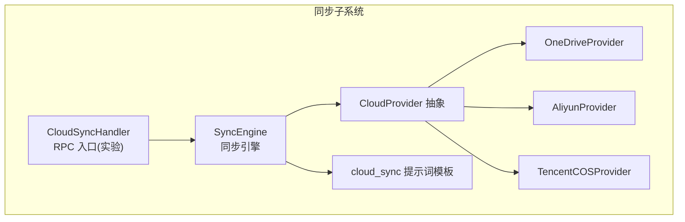
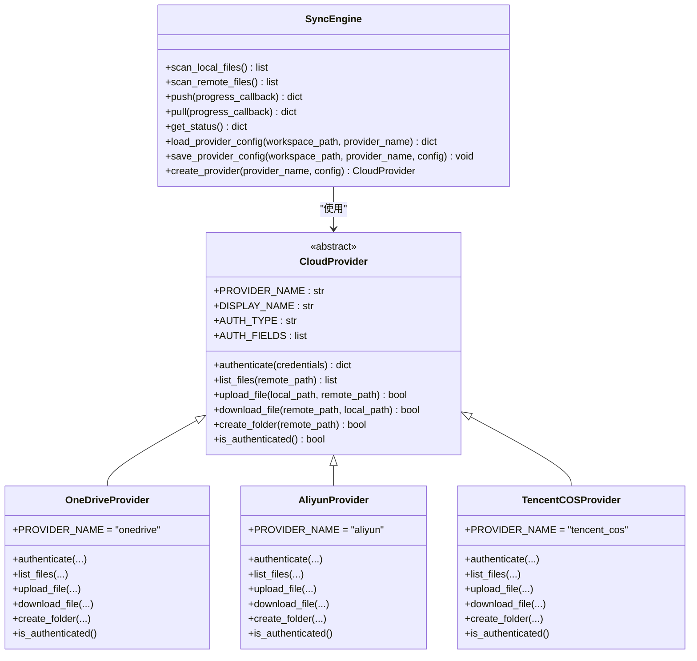
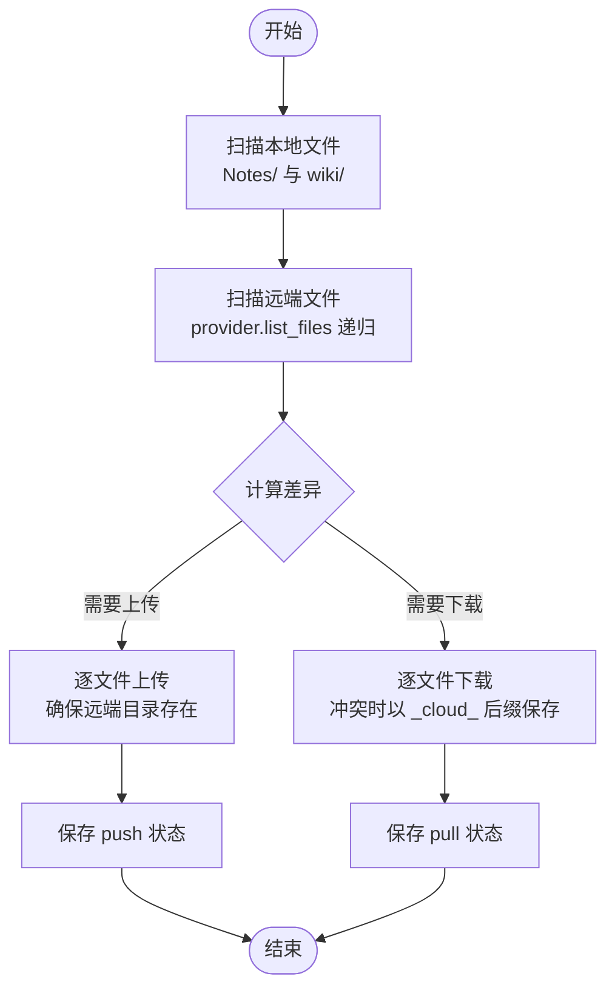
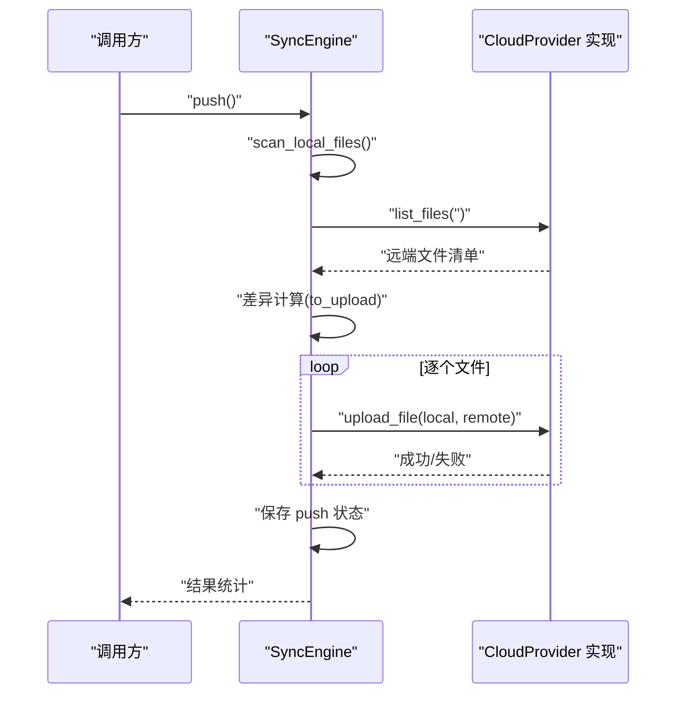
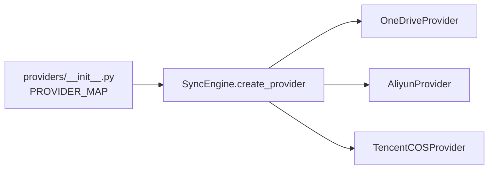
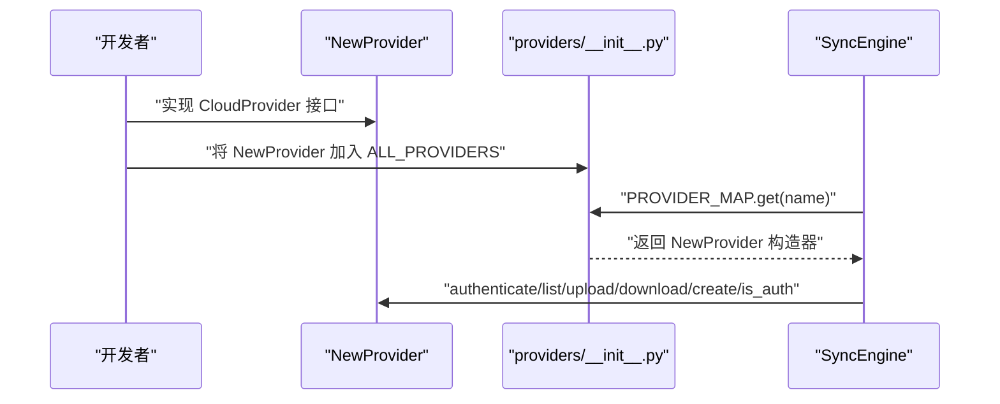

# 同步阶段

<cite>
**本文引用的文件**   
- [sync_engine.py](file://python/sidecar/cloud/sync_engine.py)
- [base.py](file://python/sidecar/cloud/providers/base.py)
- [__init__.py](file://python/sidecar/cloud/providers/__init__.py)
- [onedrive.py](file://python/sidecar/cloud/providers/onedrive.py)
- [tencent_cos.py](file://python/sidecar/cloud/providers/tencent_cos.py)
- [aliyun.py](file://python/sidecar/cloud/providers/aliyun.py)
- [cloud_sync_handler.py](file://python/sidecar/handlers/cloud_sync_handler.py)
- [cloud_sync.py](file://prompts/cloud_sync.py)
- [test_cloud_sync_engine.py](file://tests/unit/test_cloud_sync_engine.py)
</cite>

## 目录
1. [简介](#简介)
2. [项目结构](#项目结构)
3. [核心组件](#核心组件)
4. [架构总览](#架构总览)
5. [详细组件分析](#详细组件分析)
6. [依赖关系分析](#依赖关系分析)
7. [性能与可靠性](#性能与可靠性)
8. [故障排查指南](#故障排查指南)
9. [结论](#结论)
10. [附录：扩展新云存储提供商](#附录扩展新云存储提供商)

## 简介
本章节聚焦“入库流水线”的同步阶段，围绕云同步机制、增量同步算法、冲突解决策略、状态管理、断点续传与错误重试进行系统化说明。同时提供配置选项与多云存储支持说明，并给出扩展新云存储提供商的实践路径。

## 项目结构
同步阶段的核心位于 sidecar/cloud 子系统中，包含：
- 同步引擎：负责本地与远端扫描、差异计算、上传/下载、状态持久化与配置管理
- 云存储抽象与实现：统一的 CloudProvider 接口及多个具体提供商（OneDrive、阿里云盘、腾讯云 COS 等）
- 处理器入口：对外暴露 RPC 路由（当前处于实验占位状态）
- 提示词模板：用于生成推送/拉取摘要与冲突通知

图表来源
- [sync_engine.py:1-342](file://python/sidecar/cloud/sync_engine.py#L1-L342)
- [base.py:1-41](file://python/sidecar/cloud/providers/base.py#L1-L41)
- [__init__.py:1-37](file://python/sidecar/cloud/providers/__init__.py#L1-L37)
- [onedrive.py:1-129](file://python/sidecar/cloud/providers/onedrive.py#L1-L129)
- [aliyun.py:1-247](file://python/sidecar/cloud/providers/aliyun.py#L1-L247)
- [tencent_cos.py:1-155](file://python/sidecar/cloud/providers/tencent_cos.py#L1-L155)
- [cloud_sync_handler.py:1-33](file://python/sidecar/handlers/cloud_sync_handler.py#L1-L33)
- [cloud_sync.py:1-27](file://prompts/cloud_sync.py#L1-L27)

章节来源
- [sync_engine.py:1-342](file://python/sidecar/cloud/sync_engine.py#L1-L342)
- [cloud_sync_handler.py:1-33](file://python/sidecar/handlers/cloud_sync_handler.py#L1-L33)
- [cloud_sync.py:1-27](file://prompts/cloud_sync.py#L1-L27)

## 核心组件
- SyncEngine：同步主流程编排器，负责：
  - 本地与远端文件扫描
  - 增量差异计算（基于 mtime 与大小）
  - 上传/下载执行与进度回调
  - 冲突检测与处理（云端版本保留为带时间戳后缀的文件）
  - 状态持久化（最近一次 push/pull 时间与对应 provider）
  - 配置加载/保存（敏感字段使用系统密钥链存储，JSON 中仅保留占位符）
- CloudProvider 抽象：统一接口定义认证、列举、上传、下载、创建文件夹、认证状态检查
- Provider 实现：OneDrive、阿里云盘、腾讯云 COS 等
- CloudSyncHandler：对外 RPC 路由注册（当前全部方法返回“未启用”，仅保留 cloud_sync_list_providers 返回空列表与提示信息）
- 提示词模板：用于生成推送/拉取摘要与冲突通知文案

章节来源
- [sync_engine.py:1-342](file://python/sidecar/cloud/sync_engine.py#L1-L342)
- [base.py:1-41](file://python/sidecar/cloud/providers/base.py#L1-L41)
- [cloud_sync_handler.py:1-33](file://python/sidecar/handlers/cloud_sync_handler.py#L1-L33)
- [cloud_sync.py:1-27](file://prompts/cloud_sync.py#L1-L27)

## 架构总览
同步阶段采用“引擎 + 插件式提供商”的架构。引擎不关心具体云厂商细节，通过 CloudProvider 抽象完成所有 I/O；不同提供商在各自模块内实现 API 适配。

图表来源
- [base.py:1-41](file://python/sidecar/cloud/providers/base.py#L1-L41)
- [onedrive.py:1-129](file://python/sidecar/cloud/providers/onedrive.py#L1-L129)
- [aliyun.py:1-247](file://python/sidecar/cloud/providers/aliyun.py#L1-L247)
- [tencent_cos.py:1-155](file://python/sidecar/cloud/providers/tencent_cos.py#L1-L155)
- [sync_engine.py:1-342](file://python/sidecar/cloud/sync_engine.py#L1-L342)

## 详细组件分析

### 同步引擎（SyncEngine）
- 扫描与增量计算
  - 本地扫描：遍历 Notes/ 与 wiki/ 两个根目录，收集相对路径、mtime、size，忽略隐藏文件
  - 远端扫描：递归调用 provider.list_files，将目录与文件分别处理，构建统一清单
  - 差异判定：
    - 上传：若远端不存在或本地 mtime 晚于远端超过 1 秒，则标记为需要上传
    - 下载：若本地不存在或远端 mtime 晚于本地超过 1 秒，则标记为需要下载
- 冲突处理
  - 当本地存在且远端更新时，视为冲突；为避免覆盖用户本地修改，引擎会将云端版本下载到本地同目录下，并以 _cloud_ 加时间戳后缀命名，供用户手动对比决定取舍
- 安全校验
  - 下载前对远端路径进行严格校验，确保目标落在工作区允许范围内，防止路径穿越
- 状态管理
  - 每次 push/pull 完成后，记录 last_push/last_pull 时间戳以及对应的 PROVIDER_NAME，便于 UI 展示与后续增量优化
- 配置管理
  - 配置文件位于工作区 .noteai/cloud_sync_config.json，兼容旧位置 NoteAI/cloud_sync_config.json 并自动迁移
  - 敏感字段（如 token、secret、key 等）写入系统密钥链，JSON 中仅保留占位符 __encrypted__:key，读取时再还原
- 进度回调
  - push/pull 均支持 progress_callback(index, total, message)，便于上层 UI 显示实时进度

图表来源
- [sync_engine.py:62-163](file://python/sidecar/cloud/sync_engine.py#L62-L163)
- [sync_engine.py:165-256](file://python/sidecar/cloud/sync_engine.py#L165-L256)
- [sync_engine.py:258-269](file://python/sidecar/cloud/sync_engine.py#L258-L269)
- [sync_engine.py:271-342](file://python/sidecar/cloud/sync_engine.py#L271-L342)

章节来源
- [sync_engine.py:62-163](file://python/sidecar/cloud/sync_engine.py#L62-L163)
- [sync_engine.py:165-256](file://python/sidecar/cloud/sync_engine.py#L165-L256)
- [sync_engine.py:258-269](file://python/sidecar/cloud/sync_engine.py#L258-L269)
- [sync_engine.py:271-342](file://python/sidecar/cloud/sync_engine.py#L271-L342)

### 云存储抽象与提供商
- CloudProvider 抽象定义了认证、列举、上传、下载、创建文件夹、认证状态检查的统一接口
- 各提供商实现差异：
  - OneDrive：设备授权流获取 access_token，按 Graph API 规范操作
  - 阿里云盘：access_token 鉴权，先确保根目录存在，再根据路径解析父目录 ID 进行上传/下载
  - 腾讯云 COS：凭据鉴权，使用 SDK 的 bucket/key 模型，注意远程前缀与对象键映射

图表来源
- [sync_engine.py:119-163](file://python/sidecar/cloud/sync_engine.py#L119-L163)
- [onedrive.py:101-129](file://python/sidecar/cloud/providers/onedrive.py#L101-L129)
- [aliyun.py:156-186](file://python/sidecar/cloud/providers/aliyun.py#L156-L186)
- [tencent_cos.py:122-131](file://python/sidecar/cloud/providers/tencent_cos.py#L122-L131)

章节来源
- [base.py:1-41](file://python/sidecar/cloud/providers/base.py#L1-L41)
- [onedrive.py:1-129](file://python/sidecar/cloud/providers/onedrive.py#L1-L129)
- [aliyun.py:1-247](file://python/sidecar/cloud/providers/aliyun.py#L1-L247)
- [tencent_cos.py:1-155](file://python/sidecar/cloud/providers/tencent_cos.py#L1-L155)

### 处理器入口（CloudSyncHandler）
- 当前所有同步相关路由均返回“未启用”的占位响应，仅保留 providers 列表查询接口（返回空列表与提示信息）
- 该设计表明同步功能仍在实验阶段，UI 入口可见但不可用

章节来源
- [cloud_sync_handler.py:1-33](file://python/sidecar/handlers/cloud_sync_handler.py#L1-L33)

### 提示词模板
- 提供冲突通知、推送摘要、拉取摘要三段文本模板，便于上层生成用户可读的消息

章节来源
- [cloud_sync.py:1-27](file://prompts/cloud_sync.py#L1-L27)

## 依赖关系分析
- 提供商注册表：providers/__init__.py 汇总 ALL_PROVIDERS 并构建 PROVIDER_MAP，供 SyncEngine.create_provider 动态实例化
- 引擎与提供商解耦：引擎仅依赖 CloudProvider 抽象，新增提供商无需改动引擎逻辑
- 配置与凭证：
  - 配置文件：.noteai/cloud_sync_config.json（兼容旧路径迁移）
  - 敏感字段：通过 keyring_store 存取，JSON 中仅保留占位符

图表来源
- [__init__.py:1-37](file://python/sidecar/cloud/providers/__init__.py#L1-L37)
- [sync_engine.py:336-342](file://python/sidecar/cloud/sync_engine.py#L336-L342)

章节来源
- [__init__.py:1-37](file://python/sidecar/cloud/providers/__init__.py#L1-L37)
- [sync_engine.py:336-342](file://python/sidecar/cloud/sync_engine.py#L336-L342)

## 性能与可靠性
- 增量同步
  - 基于 mtime 与 size 的差异判断，避免全量传输
  - 上传/下载循环中支持进度回调，便于中断与恢复
- 断点续传
  - 当前实现未内置分片断点续传；如需大文件可靠传输，可在提供商层引入分片上传/断点续传能力（例如利用各云厂商 SDK 的分片接口），并在引擎层增加任务队列与状态记录
- 错误重试
  - 当前网络异常通过日志记录与计数统计，未实现指数退避重试；建议在提供商层封装通用重试装饰器，结合幂等性保障
- 并发与吞吐
  - 当前为串行处理；可考虑对独立文件并行上传/下载，但需控制并发度以避免触发云厂商限流
- 安全与健壮性
  - 下载路径白名单校验，防止越界写入
  - 配置敏感字段不落盘明文，降低泄露风险

[本节为通用建议，不直接分析具体文件]

## 故障排查指南
- 常见问题定位
  - 认证失败：检查 provider.authenticate 返回值与消息，确认凭据是否完整有效
  - 列举失败：查看 provider.list_files 的异常日志，确认网络与权限
  - 上传/下载失败：关注返回布尔值与异常堆栈，必要时开启更详细的日志
  - 冲突文件：在本地查找 _cloud_ 后缀文件，手动比对后决定保留版本
- 状态与配置
  - 查看 .noteai/cloud_sync_state.json 中的 last_push/last_pull 时间戳，确认上次同步是否成功
  - 检查 .noteai/cloud_sync_config.json 中敏感字段是否为占位符，确认系统密钥链中是否存在对应条目
- 测试用例参考
  - 路径穿越防护、配置迁移与敏感字段还原等行为可通过单元测试验证

章节来源
- [sync_engine.py:119-163](file://python/sidecar/cloud/sync_engine.py#L119-L163)
- [sync_engine.py:165-256](file://python/sidecar/cloud/sync_engine.py#L165-L256)
- [sync_engine.py:271-342](file://python/sidecar/cloud/sync_engine.py#L271-L342)
- [test_cloud_sync_engine.py:1-49](file://tests/unit/test_cloud_sync_engine.py#L1-L49)

## 结论
同步阶段通过清晰的抽象与模块化设计，实现了多云存储支持与增量同步能力。当前处于实验阶段，API 入口暂未开放。未来可在提供商层增强分片与重试能力，在引擎层引入任务队列与断点状态，以提升大规模文件的可靠性与吞吐。

[本节为总结性内容，不直接分析具体文件]

## 附录：扩展新云存储提供商
步骤概览
- 新建提供商类
  - 继承 CloudProvider，实现 authenticate、list_files、upload_file、download_file、create_folder、is_authenticated
  - 设置 PROVIDER_NAME、DISPLAY_NAME、AUTH_TYPE、AUTH_FIELDS
- 注册提供商
  - 在 providers/__init__.py 的 ALL_PROVIDERS 列表中追加新类，PROVIDER_MAP 会自动构建
- 配置与凭证
  - 通过 SyncEngine.save_provider_config 保存配置，敏感字段将被存入系统密钥链
  - 通过 SyncEngine.load_provider_config 加载配置，敏感字段将从密钥链还原
- 示例参考
  - 参考 OneDrive、阿里云盘、腾讯云 COS 的实现方式，按需调整鉴权与 API 调用

图表来源
- [base.py:1-41](file://python/sidecar/cloud/providers/base.py#L1-L41)
- [__init__.py:1-37](file://python/sidecar/cloud/providers/__init__.py#L1-L37)
- [sync_engine.py:336-342](file://python/sidecar/cloud/sync_engine.py#L336-L342)
- [onedrive.py:1-129](file://python/sidecar/cloud/providers/onedrive.py#L1-L129)
- [aliyun.py:1-247](file://python/sidecar/cloud/providers/aliyun.py#L1-L247)
- [tencent_cos.py:1-155](file://python/sidecar/cloud/providers/tencent_cos.py#L1-L155)

章节来源
- [__init__.py:1-37](file://python/sidecar/cloud/providers/__init__.py#L1-L37)
- [sync_engine.py:336-342](file://python/sidecar/cloud/sync_engine.py#L336-L342)
- [base.py:1-41](file://python/sidecar/cloud/providers/base.py#L1-L41)