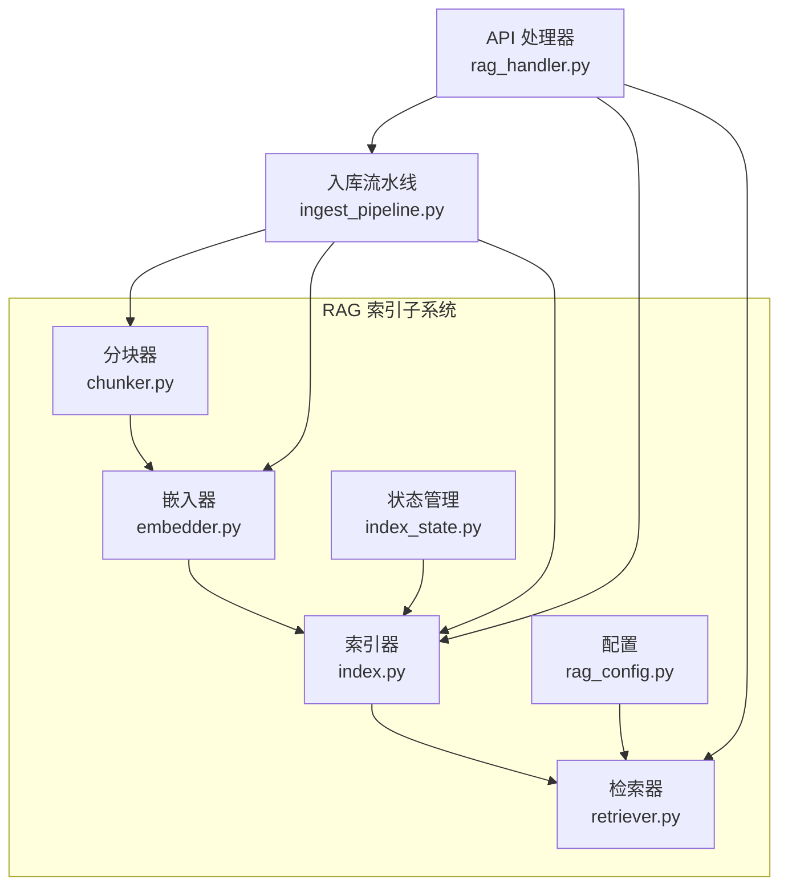
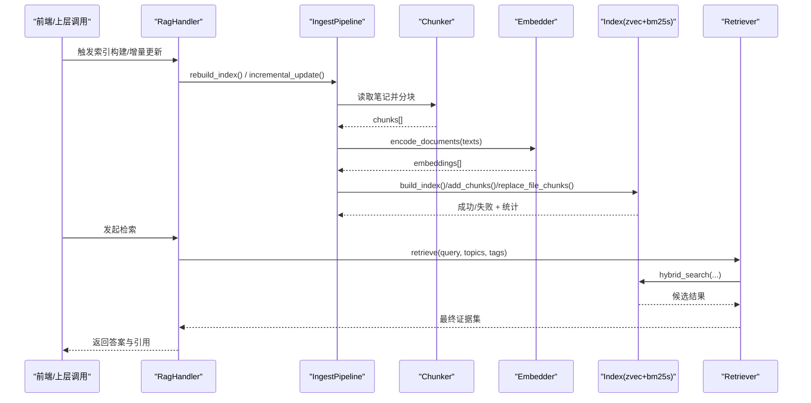
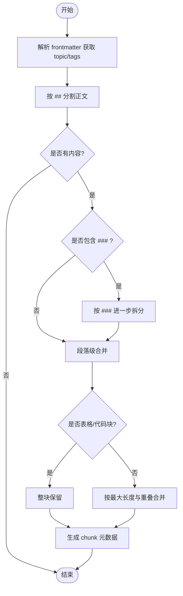
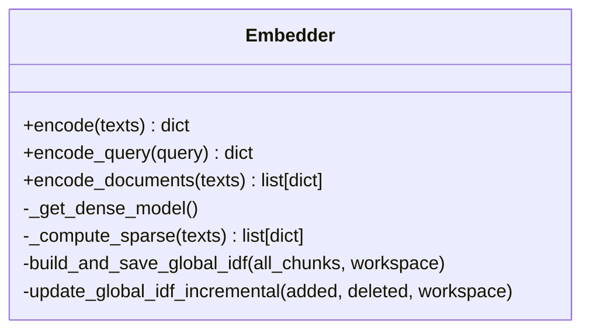
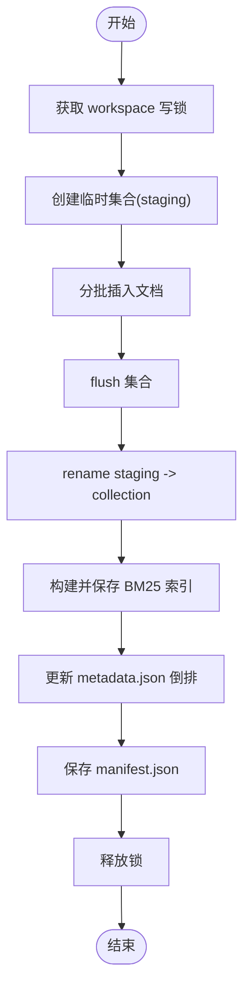
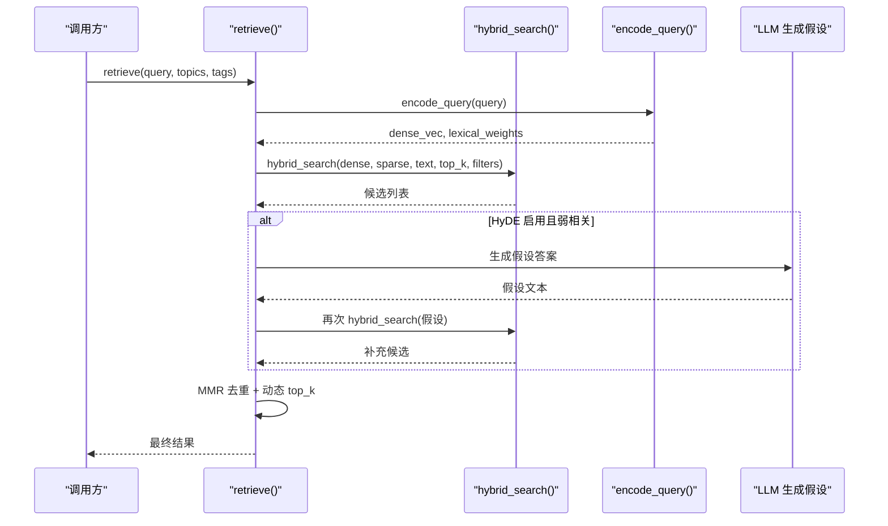
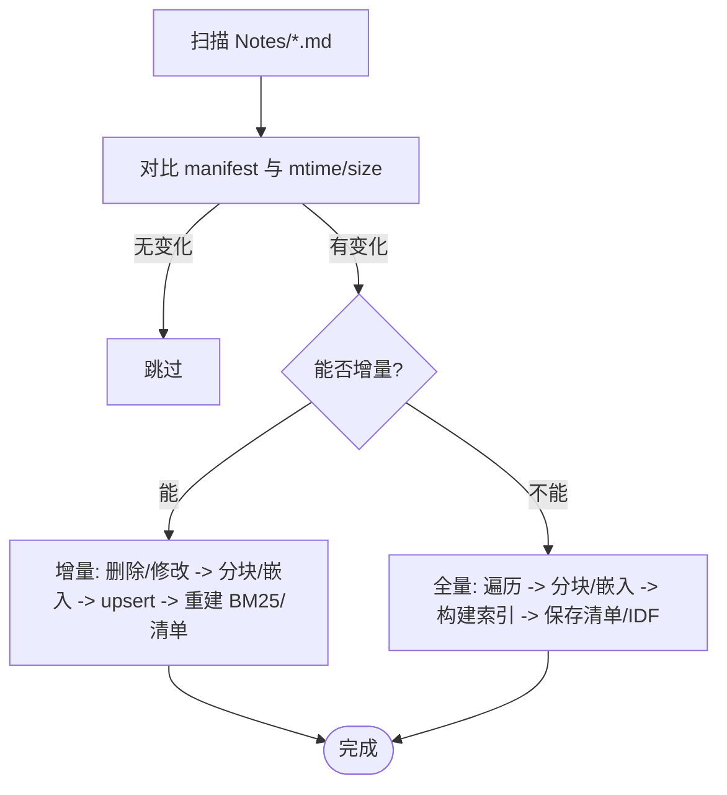
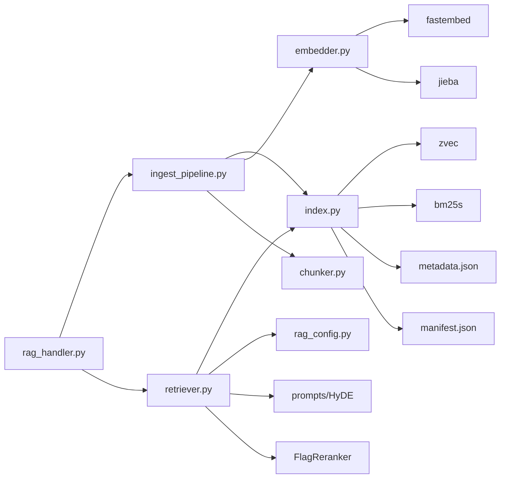

# 向量索引阶段

<cite>
**本文引用的文件**   
- [index.py](file://python/sidecar/rag/index.py)
- [index_state.py](file://python/sidecar/rag/index_state.py)
- [chunker.py](file://python/sidecar/rag/chunker.py)
- [embedder.py](file://python/sidecar/rag/embedder.py)
- [retriever.py](file://python/sidecar/rag/retriever.py)
- [rag_config.py](file://python/sidecar/rag/rag_config.py)
- [ingest_pipeline.py](file://python/sidecar/ingest_pipeline.py)
- [rag_handler.py](file://python/sidecar/handlers/rag_handler.py)
- [test_rag_index.py](file://tests/unit/test_rag_index.py)
</cite>

## 目录
1. [简介](#简介)
2. [项目结构](#项目结构)
3. [核心组件](#核心组件)
4. [架构总览](#架构总览)
5. [详细组件分析](#详细组件分析)
6. [依赖关系分析](#依赖关系分析)
7. [性能与并发优化](#性能与并发优化)
8. [配置项与故障恢复](#配置项与故障恢复)
9. [扩展指南：新增索引后端](#扩展指南新增索引后端)
10. [故障排查](#故障排查)
11. [结论](#结论)

## 简介
本章节聚焦于入库流水线中的“向量索引阶段”，系统性阐述 RAG 索引的构建流程，包括文本分块、向量嵌入生成、索引存储、增量更新机制、索引状态管理、并发控制与性能优化策略，并给出配置选项与故障恢复方案。同时提供可扩展的后端接入思路与示例路径，帮助读者在现有架构基础上进行二次开发。

## 项目结构
向量索引阶段涉及的核心模块位于 sidecar/rag 下，并与 ingest_pipeline 和 handlers 协同工作：
- 分块器：按标题层级与段落切分文档为可索引片段
- 嵌入器：使用本地模型将文本转为稠密向量，并计算稀疏权重
- 索引器：基于 zvec（HNSW）与 bm25s（BM25）混合检索，维护元数据倒排与清单
- 检索器：组合稠密与稀疏得分，支持 HyDE、MMR、重排序等增强策略
- 状态管理：记录文件 mtime，实现增量重建
- 流水线集成：自动检测变更、触发全量或增量重建
- 处理器：对外暴露构建、增删、查询接口

图表来源
- [chunker.py:1-163](file://python/sidecar/rag/chunker.py#L1-L163)
- [embedder.py:1-384](file://python/sidecar/rag/embedder.py#L1-L384)
- [index.py:1-800](file://python/sidecar/rag/index.py#L1-L800)
- [retriever.py:1-662](file://python/sidecar/rag/retriever.py#L1-L662)
- [index_state.py:1-102](file://python/sidecar/rag/index_state.py#L1-L102)
- [rag_config.py:1-64](file://python/sidecar/rag/rag_config.py#L1-L64)
- [ingest_pipeline.py:1-800](file://python/sidecar/ingest_pipeline.py#L1-L800)
- [rag_handler.py:1-698](file://python/sidecar/handlers/rag_handler.py#L1-L698)

章节来源
- [chunker.py:1-163](file://python/sidecar/rag/chunker.py#L1-L163)
- [embedder.py:1-384](file://python/sidecar/rag/embedder.py#L1-L384)
- [index.py:1-800](file://python/sidecar/rag/index.py#L1-L800)
- [retriever.py:1-662](file://python/sidecar/rag/retriever.py#L1-L662)
- [index_state.py:1-102](file://python/sidecar/rag/index_state.py#L1-L102)
- [rag_config.py:1-64](file://python/sidecar/rag/rag_config.py#L1-L64)
- [ingest_pipeline.py:1-800](file://python/sidecar/ingest_pipeline.py#L1-L800)
- [rag_handler.py:1-698](file://python/sidecar/handlers/rag_handler.py#L1-L698)

## 核心组件
- 文本分块（chunker）：解析 frontmatter，按 ## 与 ### 标题分层切分，对表格与代码块做特殊处理，保持段落重叠以提升召回
- 向量嵌入（embedder）：加载本地 bge-small-zh-v1.5 模型，批量生成稠密向量；同时基于 jieba 分词与 IDF 计算稀疏权重，支持全局 IDF 持久化
- 索引存储（index）：zvec 集合保存稠密向量与字段，bm25s 保存稀疏索引，metadata.json 维护 topic/tag/file 倒排，manifest.json 记录版本与文件清单
- 检索（retriever）：hybrid_search 融合稠密与稀疏得分，支持当前文件优先候选、HyDE 假设式检索、MMR 去重、可选重排序与上下文扩展
- 状态管理（index_state）：以 rag_index_state.json 记录每个文件的 mtime，用于跳过未改动文件
- 流水线集成（ingest_pipeline）：扫描 Notes 目录，判断是否需要全量或增量重建，协调分块、嵌入、写入与清单更新
- API 处理器（rag_handler）：封装构建、增量更新、删除、查询等能力，并通过事件推送进度与结果

章节来源
- [chunker.py:1-163](file://python/sidecar/rag/chunker.py#L1-L163)
- [embedder.py:1-384](file://python/sidecar/rag/embedder.py#L1-L384)
- [index.py:1-800](file://python/sidecar/rag/index.py#L1-L800)
- [retriever.py:1-662](file://python/sidecar/rag/retriever.py#L1-L662)
- [index_state.py:1-102](file://python/sidecar/rag/index_state.py#L1-L102)
- [ingest_pipeline.py:1-800](file://python/sidecar/ingest_pipeline.py#L1-L800)
- [rag_handler.py:1-698](file://python/sidecar/handlers/rag_handler.py#L1-L698)

## 架构总览
下图展示了从文件变更到索引构建与检索的关键调用链与数据流。

图表来源
- [rag_handler.py:30-115](file://python/sidecar/handlers/rag_handler.py#L30-L115)
- [retriever.py:102-196](file://python/sidecar/rag/retriever.py#L102-L196)
- [ingest_pipeline.py:459-627](file://python/sidecar/ingest_pipeline.py#L459-L627)
- [chunker.py:11-42](file://python/sidecar/rag/chunker.py#L11-L42)
- [embedder.py:334-384](file://python/sidecar/rag/embedder.py#L334-L384)
- [index.py:502-582](file://python/sidecar/rag/index.py#L502-L582)

## 详细组件分析

### 文本分块（chunker）
- 解析 frontmatter 提取 topic/tags，按 ## 标题分段，再按 ### 细分
- 对表格与代码块整体保留，避免破坏结构
- 段落拼接时采用固定最大长度与重叠比例，保证跨段语义连续性
- 输出 chunk 包含 id、content、file_path、topic、tags、section_title

图表来源
- [chunker.py:11-163](file://python/sidecar/rag/chunker.py#L11-L163)

章节来源
- [chunker.py:11-163](file://python/sidecar/rag/chunker.py#L11-L163)

### 向量嵌入（embedder）
- 模型加载：BAAI/bge-small-zh-v1.5，ONNX 推理线程数自适应 CPU 核数
- 缓存与重试：首次加载失败时清理不完整快照并重试
- 稠密向量：批量 embed，返回 dense_vecs
- 稀疏权重：jieba 分词 + 停用词过滤，优先使用全局 IDF，否则回退到批次内 IDF
- 全局 IDF：全量重建时持久化 global_idf.json，后续增量可使用近似更新

图表来源
- [embedder.py:133-384](file://python/sidecar/rag/embedder.py#L133-L384)

章节来源
- [embedder.py:133-384](file://python/sidecar/rag/embedder.py#L133-L384)

### 索引存储（index）
- 数据结构
  - zvec 集合：稠密向量 + 字段（content、file_path、topic、tags_json、section_title），HNSW 索引，余弦相似度
  - bm25s：稀疏索引，按中文停用词分词，k1=1.5，b=0.75
  - metadata.json：topic/tag/file 倒排映射，快速过滤
  - manifest.json：索引版本、schema_version、last_rebuilt、files 清单（含 mtime/size/chunks）
- 构建流程
  - 原子性：先写入 staging 目录，成功后 rename 替换旧集合，失败则回滚至 backup
  - 批处理：插入/更新/删除均按固定 batch size 分批执行
  - BM25 重建：根据 corpus 重新 tokenize 并 index，保存到磁盘
  - 元数据倒排：逐条更新 topics/tags/files 映射
- 增量更新
  - add_chunks：追加新文档，更新倒排，可选择是否重建 BM25
  - replace_file_chunks：按文件维度 upsert 新文档，删除旧 ids，最后统一重建搜索索引与清单
  - delete_by_file：按 file_path 过滤删除，更新倒排与清单，重建 BM25
- 并发与锁
  - index_operation：按 workspace 串行写操作，避免并发提交冲突
  - _COLLECTION_IO_LOCK：保护集合打开/关闭与缓存一致性
  - _BM25_CACHE：缓存已加载的 BM25 retriever，减少重复 load 开销

图表来源
- [index.py:502-582](file://python/sidecar/rag/index.py#L502-L582)

章节来源
- [index.py:1-800](file://python/sidecar/rag/index.py#L1-L800)

### 检索（retriever）
- 入口 retrieve：
  - 编码 query 得到 dense_vec 与 lexical_weights
  - 调用 hybrid_search 获取候选
  - 若开启 HyDE 且首条分数低于阈值，则用 LLM 生成假设答案再检索
  - MMR 去重，可选 rerank 重排序
  - 上下文扩展与唯一来源限制
- 动态 top_k：根据查询复杂度与分数分布选择引用数量
- 当前文件优先：对当前打开文件单独检索，作为候选补充

图表来源
- [retriever.py:102-196](file://python/sidecar/rag/retriever.py#L102-L196)
- [retriever.py:198-227](file://python/sidecar/rag/retriever.py#L198-L227)
- [retriever.py:229-324](file://python/sidecar/rag/retriever.py#L229-L324)

章节来源
- [retriever.py:102-196](file://python/sidecar/rag/retriever.py#L102-L196)
- [retriever.py:198-227](file://python/sidecar/rag/retriever.py#L198-L227)
- [retriever.py:229-324](file://python/sidecar/rag/retriever.py#L229-L324)

### 状态管理与增量更新（index_state + ingest_pipeline）
- index_state：
  - 记录每个相对路径的 mtime，比较阈值 0.5s 判定是否需要重建
  - 支持从旧的 file_manifest.json 恢复状态
- ingest_pipeline：
  - 扫描 Notes 目录，对比 manifest 与文件系统，决定全量或增量
  - 增量路径：删除/修改文件对应的旧 chunk，并行分块与嵌入，批量 upsert，最后统一重建 BM25 与清单
  - 全量路径：遍历所有文件，分块、嵌入、构建索引，保存清单与全局 IDF

图表来源
- [index_state.py:75-102](file://python/sidecar/rag/index_state.py#L75-L102)
- [ingest_pipeline.py:459-627](file://python/sidecar/ingest_pipeline.py#L459-L627)

章节来源
- [index_state.py:75-102](file://python/sidecar/rag/index_state.py#L75-L102)
- [ingest_pipeline.py:459-627](file://python/sidecar/ingest_pipeline.py#L459-L627)

## 依赖关系分析
- 外部库
  - zvec：稠密向量集合与 HNSW 索引
  - bm25s：稀疏 BM25 索引
  - fastembed：本地 embedding 模型加载与推理
  - FlagReranker：可选重排序
  - jieba：中文分词
- 内部依赖
  - config.settings：路径常量与工作区设置
  - utils.error_handler/utils.logger：异常与日志
  - prompts：HyDE 提示模板
  - utils.llm_utils：LLM 调用

图表来源
- [index.py:1-800](file://python/sidecar/rag/index.py#L1-L800)
- [embedder.py:1-384](file://python/sidecar/rag/embedder.py#L1-L384)
- [retriever.py:1-662](file://python/sidecar/rag/retriever.py#L1-L662)
- [ingest_pipeline.py:1-800](file://python/sidecar/ingest_pipeline.py#L1-L800)
- [rag_handler.py:1-698](file://python/sidecar/handlers/rag_handler.py#L1-L698)

章节来源
- [index.py:1-800](file://python/sidecar/rag/index.py#L1-L800)
- [embedder.py:1-384](file://python/sidecar/rag/embedder.py#L1-L384)
- [retriever.py:1-662](file://python/sidecar/rag/retriever.py#L1-L662)
- [ingest_pipeline.py:1-800](file://python/sidecar/ingest_pipeline.py#L1-L800)
- [rag_handler.py:1-698](file://python/sidecar/handlers/rag_handler.py#L1-L698)

## 性能与并发优化
- 并发控制
  - index_operation：按 workspace 串行写，避免多进程并发提交导致索引不一致
  - _COLLECTION_IO_LOCK：保护集合句柄缓存与 IO 访问
  - ThreadPoolExecutor：检索与分块阶段使用线程池提升吞吐
- 缓存策略
  - 集合句柄缓存：避免频繁 open/close 导致的 mmindex 重载
  - BM25 retriever 缓存：减少每次查询的 load 成本
  - 查询 TTL 缓存：相同查询短时间复用结果
- 批处理与内存
  - 插入/更新/删除按固定 batch size 分批，降低单次请求大小
  - 向量维度固定为 512，平衡精度与性能
- 索引重建优化
  - 增量更新优先，仅在必要时全量重建
  - BM25 重建延迟到批量操作完成后一次性执行
  - 全局 IDF 持久化，避免重复计算

章节来源
- [index.py:36-61](file://python/sidecar/rag/index.py#L36-L61)
- [index.py:502-582](file://python/sidecar/rag/index.py#L502-L582)
- [retriever.py:36-41](file://python/sidecar/rag/retriever.py#L36-L41)
- [retriever.py:387-404](file://python/sidecar/rag/retriever.py#L387-L404)

## 配置项与故障恢复
- 检索配置（rag_config）
  - rag_top_k：默认 5，带过滤器时默认 7，范围 1-50
  - rag_hyde_enabled：是否启用 HyDE
  - rag_hyde_threshold：HyDE 触发阈值，默认 0.33
  - rag_rerank_enabled：是否启用重排序，可通过环境变量 NOTEAI_DISABLE_RERANKER 禁用
  - rag_rerank_skip_score：强结果跳过重排序阈值，默认 0.75
  - rag_dense_weight：稠密权重，默认 0.7，稀疏权重为 1-dense
- 索引状态与恢复
  - manifest.json：记录版本、schema_version、last_rebuilt、files 清单
  - metadata.json：倒排索引，支持空值容错与降级
  - error_state.json：错误冷却期，防止短时间内重复报错
  - 集合损坏恢复：当版本不匹配或集合不可用时，自动重建集合与 BM25
  - 锁冲突处理：检测到 zvec 锁占用时，提示关闭其他实例后重试

章节来源
- [rag_config.py:1-64](file://python/sidecar/rag/rag_config.py#L1-L64)
- [index.py:105-146](file://python/sidecar/rag/index.py#L105-L146)
- [index.py:169-190](file://python/sidecar/rag/index.py#L169-L190)
- [rag_handler.py:118-152](file://python/sidecar/handlers/rag_handler.py#L118-L152)

## 扩展指南：新增索引后端
目标：在不破坏现有 API 的前提下，增加新的索引后端（例如 FAISS、Milvus、Qdrant 等）。建议遵循以下模式：

- 抽象层设计
  - 定义统一的 IndexBackend 接口：
    - create_collection(schema)
    - insert(docs)
    - upsert(docs)
    - delete(ids)
    - search(query_vector, top_k, filters)
    - save/load_index(path)
    - stats()
  - 在 index.py 中通过工厂函数根据配置选择具体后端实现
- 适配现有流程
  - 替换 zvec.Collection 为自定义后端对象
  - 保持 _chunk_to_doc 与 _doc_to_result 的数据结构兼容
  - 保持 build_index/add_chunks/replace_file_chunks/delete_by_file 的调用契约不变
- 并发与缓存
  - 沿用现有的锁与缓存策略，确保多工作区隔离与句柄复用
- 测试覆盖
  - 参考 test_rag_index.py 的断言方式，为新后端编写单元测试，验证构建、检索与过滤行为

示例路径（仅示意，不包含具体代码）
- 后端接口定义位置：建议在 sidecar/rag/index_backend.py 新增
- 工厂与注册：在 index.py 中引入并根据配置切换
- 测试用例：在 tests/unit/test_rag_index_backend.py 中新增

章节来源
- [index.py:433-477](file://python/sidecar/rag/index.py#L433-L477)
- [test_rag_index.py:122-200](file://tests/unit/test_rag_index.py#L122-L200)

## 故障排查
- 索引被占用
  - 现象：抛出“索引文件被占用”错误
  - 原因：zvec 底层 RocksDB 锁文件被其他进程持有
  - 解决：关闭其他 NoteAI 实例，或等待其释放锁
- 集合版本不匹配
  - 现象：重建集合与 BM25
  - 原因：schema_version 升级或损坏
  - 解决：系统会自动重建，必要时手动清理 .tmp 文件
- BM25 重建失败
  - 现象：警告日志，但稠密索引可用
  - 解决：检查 corpus 是否为空，或手动触发一次全量重建
- 嵌入模型加载失败
  - 现象：提示模型不存在或 ONNX 错误
  - 解决：清理 fastembed_cache 下的不完整快照，重试加载
- 查询结果为空
  - 现象：retrieve 返回空列表
  - 原因：query 为空或索引尚未构建
  - 解决：确认索引存在且非空，检查 rag_enabled 配置

章节来源
- [index.py:169-190](file://python/sidecar/rag/index.py#L169-L190)
- [index.py:229-285](file://python/sidecar/rag/index.py#L229-L285)
- [embedder.py:110-165](file://python/sidecar/rag/embedder.py#L110-L165)
- [retriever.py:102-123](file://python/sidecar/rag/retriever.py#L102-L123)

## 结论
向量索引阶段通过“分块-嵌入-索引-检索”的完整链路，结合稠密与稀疏混合检索、HyDE、MMR 与可选重排序，提供了高效、可扩展的知识库检索能力。系统在并发控制、缓存与批处理方面做了充分优化，并提供完善的增量更新与故障恢复机制。通过清晰的接口与模块化设计，开发者可以便捷地扩展新的索引后端，以满足不同场景的性能与功能需求。