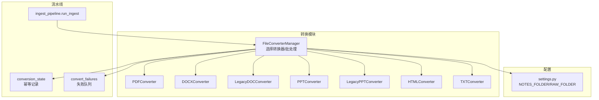
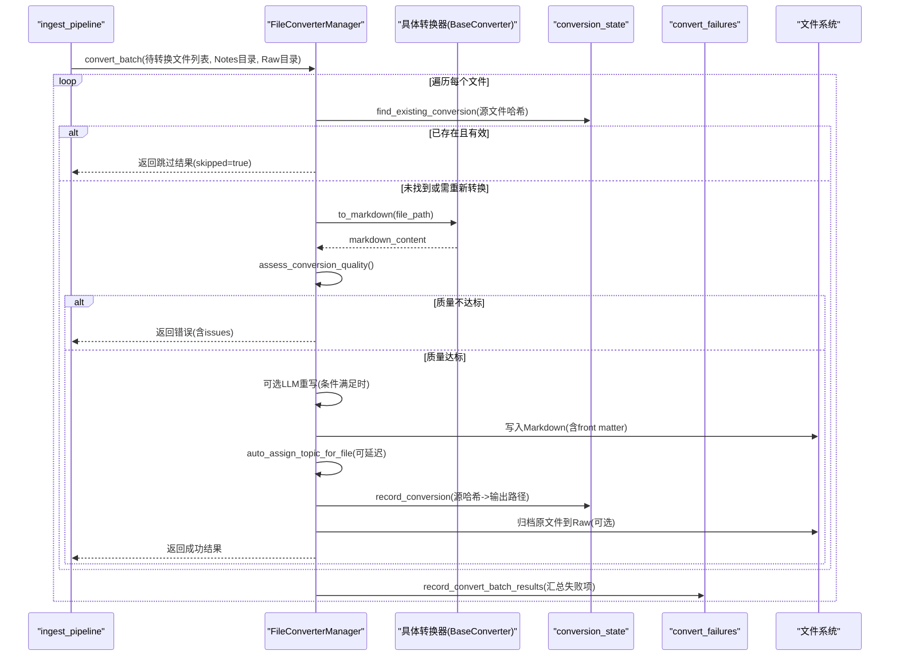
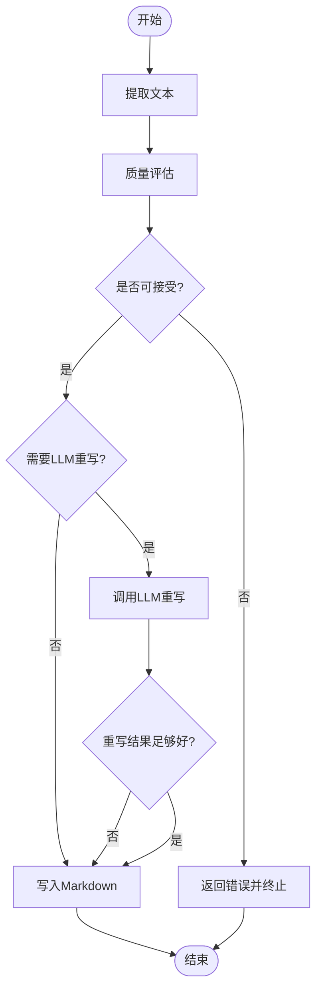
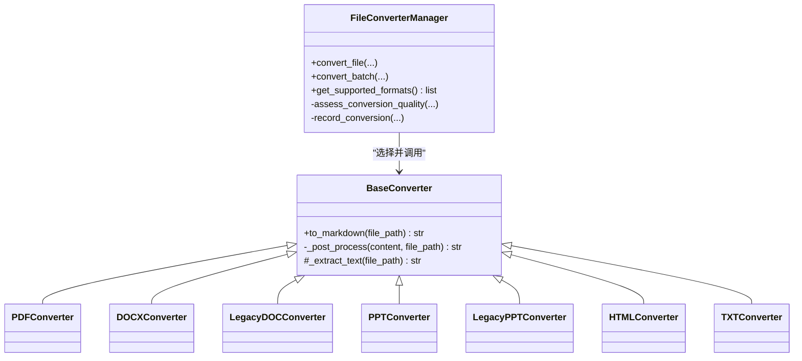

# 格式转换阶段

<cite>
**本文引用的文件**   
- [modules/file_converter.py](file://modules/file_converter.py)
- [python/sidecar/ingest_pipeline.py](file://python/sidecar/ingest_pipeline.py)
- [python/sidecar/conversion_state.py](file://python/sidecar/conversion_state.py)
- [python/sidecar/convert_failures.py](file://python/sidecar/convert_failures.py)
- [config/settings.py](file://config/settings.py)
- [tests/unit/test_file_converter.py](file://tests/unit/test_file_converter.py)
</cite>

## 目录
1. [简介](#简介)
2. [项目结构](#项目结构)
3. [核心组件](#核心组件)
4. [架构总览](#架构总览)
5. [详细组件分析](#详细组件分析)
6. [依赖关系分析](#依赖关系分析)
7. [性能与优化](#性能与优化)
8. [故障排查指南](#故障排查指南)
9. [结论](#结论)
10. [附录：扩展新格式转换器](#附录扩展新格式转换器)

## 简介
本章节聚焦入库流水线的“格式转换阶段”，系统支持将多种办公与网页文档（PDF、DOCX、旧版 DOC、PPTX、旧版 PPT、HTML、TXT）转换为 Markdown，并在转换过程中进行内容质量评估、可选的 LLM 重写、元数据注入、主题自动分配、原始文件归档以及幂等去重。该阶段由 FileConverterManager 统一编排，配合 ingestion 流水线在合适时机触发批量转换。

## 项目结构
- 模块层
  - modules/file_converter.py：定义 BaseConverter 抽象基类与各具体格式转换器，以及 FileConverterManager 管理器，负责选择转换器、执行转换、质量评估、LLM 重写、元数据写入、主题分配、原始文件归档与幂等记录。
  - python/sidecar/ingest_pipeline.py：入库流水线入口，扫描待转换文件并调用 FileConverterManager 进行批量转换，随后进入编译、分类、索引等后续阶段。
  - python/sidecar/conversion_state.py：维护源文件到已生成笔记的映射，实现“相同源文件只转换一次”的幂等能力。
  - python/sidecar/convert_failures.py：持久化转换失败队列，便于重试与清理。
  - config/settings.py：工作区常量（如 NOTES_FOLDER、RAW_FOLDER、WORKSPACE_APP_FOLDER），用于输出路径与状态文件定位。
  - tests/unit/test_file_converter.py：覆盖支持的格式、并发安全、幂等与低质量拒绝等关键行为。

图表来源
- [modules/file_converter.py:407-862](file://modules/file_converter.py#L407-L862)
- [python/sidecar/ingest_pipeline.py:620-654](file://python/sidecar/ingest_pipeline.py#L620-L654)
- [python/sidecar/conversion_state.py:65-109](file://python/sidecar/conversion_state.py#L65-L109)
- [python/sidecar/convert_failures.py:83-100](file://python/sidecar/convert_failures.py#L83-L100)
- [config/settings.py:1-41](file://config/settings.py#L1-L41)

章节来源
- [modules/file_converter.py:27-862](file://modules/file_converter.py#L27-L862)
- [python/sidecar/ingest_pipeline.py:620-654](file://python/sidecar/ingest_pipeline.py#L620-L654)
- [python/sidecar/conversion_state.py:1-109](file://python/sidecar/conversion_state.py#L1-L109)
- [python/sidecar/convert_failures.py:1-100](file://python/sidecar/convert_failures.py#L1-L100)
- [config/settings.py:1-41](file://config/settings.py#L1-L41)

## 核心组件
- BaseConverter：模板方法模式，封装日志、异常、文本清洗与图片移除等通用流程；子类仅实现 _extract_text。
- 各格式转换器：
  - PDFConverter：基于 PyMuPDF 提取文本，并针对重复签名/页眉/页脚做后处理。
  - DOCXConverter：使用 mammoth 将 .docx 转为 Markdown。
  - LegacyDOCConverter：依次尝试 textutil / antiword / catdoc 提取旧版 .doc 文本。
  - PPTConverter：使用 python-pptx 解析 .pptx 文本与表格。
  - LegacyPPTConverter：解析 OLE PowerPoint Document 流中的文本记录。
  - HTMLConverter：使用 html2text 将 HTML 转为 Markdown。
  - TXTConverter：按编码读取纯文本。
- FileConverterManager：
  - 根据扩展名选择对应转换器。
  - 单文件 convert_file 与批量 convert_batch 接口。
  - 质量评估 assess_conversion_quality，必要时触发 LLM 重写。
  - 元数据注入（YAML front matter）、主题自动分配、原始文件归档至 Raw。
  - 幂等检查 find_existing_conversion 与记录 record_conversion。
  - 失败结果持久化 record_convert_batch_results。

章节来源
- [modules/file_converter.py:27-158](file://modules/file_converter.py#L27-L158)
- [modules/file_converter.py:160-405](file://modules/file_converter.py#L160-L405)
- [modules/file_converter.py:407-862](file://modules/file_converter.py#L407-L862)

## 架构总览
下图展示从入库流水线到转换阶段的端到端流程，包括幂等判断、质量评估、可选 LLM 重写、元数据写入、主题分配、原始文件归档与失败记录。

图表来源
- [python/sidecar/ingest_pipeline.py:620-654](file://python/sidecar/ingest_pipeline.py#L620-L654)
- [modules/file_converter.py:569-731](file://modules/file_converter.py#L569-L731)
- [python/sidecar/conversion_state.py:65-109](file://python/sidecar/conversion_state.py#L65-L109)
- [python/sidecar/convert_failures.py:83-100](file://python/sidecar/convert_failures.py#L83-L100)

## 详细组件分析

### 多格式转换机制与引擎选择
- 扩展名到转换器映射：
  - .pdf → PDFConverter
  - .docx → DOCXConverter
  - .doc → LegacyDOCConverter
  - .pptx → PPTConverter
  - .ppt → LegacyPPTConverter
  - .html/.htm → HTMLConverter
  - .txt → TXTConverter
- 懒加载策略：管理器通过属性访问器按需实例化具体转换器，避免不必要的依赖导入。
- 统一接口：所有转换器继承 BaseConverter，对外暴露 to_markdown 方法，内部由模板方法统一处理日志、异常、文本清洗与图片移除。

章节来源
- [modules/file_converter.py:407-507](file://modules/file_converter.py#L407-L507)
- [modules/file_converter.py:27-69](file://modules/file_converter.py#L27-L69)

### 内容提取与后处理
- PDF：优先快速路径提取全文，并对重复出现的签名/页眉/页脚行进行识别与剔除。
- Word/PPT：分别使用 mammoth 与 python-pptx 提取结构化文本与表格。
- 旧版 Office：通过系统工具链或 OLE 记录解析提取文本。
- HTML/TXT：使用 html2text 或直接读取文本。
- 通用后处理：clean_text + remove_images_from_markdown，PDF 额外执行签名过滤。

章节来源
- [modules/file_converter.py:72-158](file://modules/file_converter.py#L72-L158)
- [modules/file_converter.py:168-287](file://modules/file_converter.py#L168-L287)
- [modules/file_converter.py:289-388](file://modules/file_converter.py#L289-L388)
- [modules/file_converter.py:390-405](file://modules/file_converter.py#L390-L405)

### 质量评估与可选 LLM 重写
- 质量评估 assess_conversion_quality：
  - 统计非空白字符数、替换字符与控制字符比例，检测疑似乱码与扫描型 PDF。
  - 若不可接受，直接返回错误信息，阻止写入。
- LLM 重写：
  - 当内容较短或缺乏段落/标点结构时，尝试调用 LLM 重写为更完整的 Markdown。
  - 仅在 API 配置可用且重写结果长度达到阈值时才替换。

图表来源
- [modules/file_converter.py:509-534](file://modules/file_converter.py#L509-L534)
- [modules/file_converter.py:641-658](file://modules/file_converter.py#L641-L658)

章节来源
- [modules/file_converter.py:509-534](file://modules/file_converter.py#L509-L534)
- [modules/file_converter.py:641-658](file://modules/file_converter.py#L641-L658)

### 元数据保留与来源追踪
- YAML front matter：
  - 自动添加 tags、source、source_sha256 等字段。
  - 若输出位于工作区内，source 字段存储相对路径；否则使用绝对路径。
- 幂等记录：
  - 计算源文件 SHA256，记录到 conversion_state.json。
  - 再次遇到相同源文件时，直接复用已有输出，避免重复转换。
- 来源更新：
  - 若原文件被归档到 Raw，则更新笔记的 source 字段指向归档后的路径。

章节来源
- [modules/file_converter.py:550-568](file://modules/file_converter.py#L550-L568)
- [modules/file_converter.py:665-673](file://modules/file_converter.py#L665-L673)
- [python/sidecar/conversion_state.py:18-23](file://python/sidecar/conversion_state.py#L18-L23)
- [python/sidecar/conversion_state.py:65-109](file://python/sidecar/conversion_state.py#L65-L109)

### 错误处理与重试机制
- 单文件转换异常：
  - 捕获异常并记录错误信息，返回 result.error。
- 批量转换失败记录：
  - convert_batch 结束后调用 record_convert_batch_results，将失败项写入 convert_failures.json。
- 失败队列操作：
  - 提供记录、清除、清理过期条目等接口，便于后续重试或人工干预。

章节来源
- [modules/file_converter.py:726-731](file://modules/file_converter.py#L726-L731)
- [modules/file_converter.py:732-771](file://modules/file_converter.py#L732-L771)
- [python/sidecar/convert_failures.py:83-100](file://python/sidecar/convert_failures.py#L83-L100)
- [python/sidecar/convert_failures.py:40-81](file://python/sidecar/convert_failures.py#L40-L81)

### 批量处理流程
- 增量扫描：
  - ingest_pipeline 通过 _scan_convert_pending 扫描工作区中尚未转换的支持格式文件。
- 进度回调：
  - 支持 progress_callback，逐文件上报进度与消息。
- 结果汇总：
  - 统计成功数量，记录失败项，供 UI 或后续任务使用。

章节来源
- [python/sidecar/ingest_pipeline.py:277-291](file://python/sidecar/ingest_pipeline.py#L277-L291)
- [modules/file_converter.py:732-771](file://modules/file_converter.py#L732-L771)

## 依赖关系分析
- 外部库与系统工具：
  - PyMuPDF（fitz）：PDF 文本与页面提取。
  - mammoth：DOCX 转 Markdown。
  - python-pptx：PPTX 文本与表格解析。
  - olefile：旧版 PPT 的 OLE 流解析。
  - html2text：HTML 转 Markdown。
  - 系统工具：textutil、antiword、catdoc（用于旧版 .doc）。
- 内部依赖：
  - utils.helpers：文本清洗、编码探测、文件名清理等。
  - utils.pdf_utils：PDF 页面与文本提取。
  - utils.tag_extractor：标签提取与 front matter 注入。
  - sidecar.textutils：front matter 读写。
  - utils.topic_assigner：自动主题分配。
  - config.settings：工作区目录常量。

图表来源
- [modules/file_converter.py:27-158](file://modules/file_converter.py#L27-L158)
- [modules/file_converter.py:407-862](file://modules/file_converter.py#L407-L862)

章节来源
- [modules/file_converter.py:27-158](file://modules/file_converter.py#L27-L158)
- [modules/file_converter.py:407-862](file://modules/file_converter.py#L407-L862)

## 性能与优化
- 懒加载转换器：按需导入重型依赖，减少启动开销。
- 幂等去重：基于源文件 SHA256 的 conversion_state 记录，避免重复转换。
- 质量前置评估：在写入前快速拒绝低质量内容，减少无效 I/O。
- 增量扫描：仅处理新增或变更的文件，提升整体吞吐。
- 并发安全：输出文件名冲突时自动追加序号，避免覆盖。
- 可选 LLM 重写：仅在内容不足时启用，控制成本与耗时。

[本节为通用指导，无需特定文件引用]

## 故障排查指南
- 常见错误与定位：
  - 不支持的文件格式：检查扩展名是否在 get_supported_formats 列表中。
  - 低质量内容被拒绝：查看 quality.issues，确认是否为扫描型 PDF 或提取过短。
  - 系统工具缺失：旧版 .doc 转换需要 textutil/antiword/catdoc，安装后可恢复。
  - 幂等命中：若出现 skipped=true，说明已存在相同源的输出，可直接复用。
- 失败队列：
  - 使用 load_convert_failures 查看失败项，clear_convert_failure 清理成功后项，cleanup_stale_convert_failures 清理不存在文件的残留记录。
- 幂等状态：
  - 检查 conversion_state.json 中 sources 映射，确认源哈希与输出路径一致性。

章节来源
- [modules/file_converter.py:509-534](file://modules/file_converter.py#L509-L534)
- [modules/file_converter.py:732-771](file://modules/file_converter.py#L732-L771)
- [python/sidecar/convert_failures.py:22-81](file://python/sidecar/convert_failures.py#L22-L81)
- [python/sidecar/conversion_state.py:65-109](file://python/sidecar/conversion_state.py#L65-L109)

## 结论
格式转换阶段通过统一的 BaseConverter 模板方法与 FileConverterManager 编排，实现了多格式、可扩展、幂等且具备质量保障的转换流程。结合 ingestion 流水线的增量扫描与失败队列，系统在可靠性与性能之间取得良好平衡。未来可通过新增转换器与调整质量阈值进一步扩展能力。

[本节为总结性内容，无需特定文件引用]

## 附录：扩展新格式转换器
步骤概览：
- 新建转换器类：
  - 继承 BaseConverter，实现 _extract_text 以返回 Markdown 字符串。
  - 如需特殊后处理，可覆盖 _post_process。
- 注册支持格式：
  - 在 FileConverterManager 中添加新的扩展名常量与映射逻辑（或在现有映射分支中增加 case）。
  - 确保 get_supported_formats 包含新扩展名。
- 测试验证：
  - 参考单元测试，验证并发安全、幂等与低质量拒绝等行为。

示例路径（不含代码内容）：
- 转换器基类与模板方法：[BaseConverter.to_markdown/_post_process/_extract_text:27-69](file://modules/file_converter.py#L27-L69)
- 具体转换器示例（PDF/DOCX/PPTX/HTML/TXT）：[PDFConverter/DOCXConverter/PPTConverter/HTMLConverter/TXTConverter:72-405](file://modules/file_converter.py#L72-L405)
- 管理器映射与批量接口：[FileConverterManager._get_converter/convert_file/convert_batch:490-771](file://modules/file_converter.py#L490-L771)
- 幂等与失败记录：[find_existing_conversion/record_conversion/record_convert_batch_results:65-109](file://python/sidecar/conversion_state.py#L65-L109), [convert_failures.py:83-100](file://python/sidecar/convert_failures.py#L83-L100)
- 相关测试用例：[test_file_converter.py:1-175](file://tests/unit/test_file_converter.py#L1-L175)

章节来源
- [modules/file_converter.py:27-69](file://modules/file_converter.py#L27-L69)
- [modules/file_converter.py:72-405](file://modules/file_converter.py#L72-L405)
- [modules/file_converter.py:490-771](file://modules/file_converter.py#L490-L771)
- [python/sidecar/conversion_state.py:65-109](file://python/sidecar/conversion_state.py#L65-L109)
- [python/sidecar/convert_failures.py:83-100](file://python/sidecar/convert_failures.py#L83-L100)
- [tests/unit/test_file_converter.py:1-175](file://tests/unit/test_file_converter.py#L1-L175)